# Architecture

The backend is a modular monolith in Go on Cloud Run in São Paulo. CockroachDB runs on Google Cloud, also in São Paulo: server and database share a provider and a region. Angular only draws the screen; every rule runs on the server.

## Design decisions

Decisions that are hard to undo become ADRs (Architecture Decision Records) in the private repository `docs/adr/` (ignored in this repository). Code and documents here cite only the number, as in "see ADR-0002".

| Piece | Choice | Why |
| --- | --- | --- |
| Backend | Go, modular monolith: one deploy, modules with clear boundaries (ADR-0001) | A small team does not need microservices. The boundaries allow splitting a module later. |
| BFF | The Go server itself (ADR-0001) | The screen asks for "the sheet, ready" in one call. No D&D rule lives in the browser, so nobody cheats by editing JavaScript. |
| API | Protobuf + Connect (connect-go and connect-es), with buf (ADR-0001) | One contract generates the code on both sides. It works over HTTP/1.1 with JSON, so it can be tested with `curl`. |
| Real time | Connect stream (server streaming), open only during a session and only while the tab is visible; the session notice is a light poll every 30 seconds, not a stream (ADR-0005; see [Live session](#live-session)) | With no active session nothing stays connected. A WebSocket left open all month would cost a lot (see [Operations](operations.md)). |
| Hosting | Cloud Run in `southamerica-east1`, 1 vCPU and 512 MiB, `min-instances` 0, `max-instances` 1 while stream fan-out is in memory (ADR-0003, ADR-0005) | Scales to zero when nobody uses it. At the expected usage it stays under US$ 1 per month (see [Operations](operations.md)). |
| Database | CockroachDB on Google Cloud (São Paulo), with pgx, sqlc and goose (ADR-0003) | sqlc generates typed Go from SQL. CockroachDB runs at `SERIALIZABLE`, so every write retries the transaction on error `40001`. |
| Sign-in | Google OIDC with PKCE; session with an opaque token in an `__Host-` httpOnly cookie (ADR-0002) | Page JavaScript cannot read the cookie, and a session can be revoked instantly (sign-out, removing someone from a campaign). |
| Frontend | One Angular app in `web/`, on the Connect client, with the rules on the server. The Go server serves the build on the same origin as the API (ADR-0006) | The session cookie only works well without third-party cookies, and iPhone Safari blocks them. See [Web app](#web-app-web). |
| Jev (after the MVP) | Cloudflare Workers AI, behind a Go interface | Switch provider without touching the rest of the code. |

## Modules

Each backend module lives in `backend/internal/<module>`. A module calls another only through its public interface, never through its tables.

- `identity`: sign-in, login sessions and users. The master's sign-in is a generic OIDC *relying party*: Google in production, a local OIDC provider in the end-to-end tests. The module speaks the protocol, not a Google SDK. The player sign-in without Google (RN-17: per-table handle, no e-mail) is not implemented yet; see [ADR-0009](adr/0009-login-do-jogador-sem-google.md). Creating a campaign still requires a Google account in the MVP (RN-14).
- `campaigns`: campaigns, members (including the pending member of an invite with approval, RN-15), roles, invites, how the campaign rolls dice (RN-18), the table rules (RN-24, see [Table rules](#table-rules-mr-025-rn-24)) and the campaign document (MR-018, see [Campaign document](#campaign-document)).
- `characters`: characters, sheets, backstory, lock, master notes and copies. Also serves the editor's rules catalogue (`ContentService`), with the SRD plus the table content (ADR-0018; see [Characters module](#characters-module-characters-and-sheets)).
- `play`: game session, scenes, encounters, combatants and the live stream. Start, end and list sessions, what locks the sheets, and the live session: the notice, the stream, the master's correction of HP, spell slots and hit dice with the history in `session_events`, and what the session shows (the current map and a gallery image). See [Play module](#play-module-game-sessions).
- `maps`: maps, points of interest, tokens, the image gallery and generated dungeons. The gallery (uploading, storing and serving images, see [Gallery and images](#maps-module-gallery-and-images)) and the maps, with what each person sees decided on the server (see [Maps, points and tokens](#maps-module-maps-points-and-tokens)).
- `progression`: the XP the master gives (for enemies, for gold or by hand), milestones, the history and who can level up (`ProgressionService`; see [Progression module](#progression-module-xp-and-milestones)).
- `notes`: the players' private notes, with a scene label, next to the clues the master revealed to each one (`NotesService`; see [Notes module](#notes-module-player-notes)).
- `rules`: the D&D 5e calculations (modifiers, DC, bonuses) and the SRD content as data. It does not touch the database, so it is easy to test.
- `platform`: what everyone shares: configuration, database, HTTP server, logs and dice (`platform/dice`: parse expressions, roll and check the physical die).

Every module is built from scratch in Go. The old NestJS app is discontinued and will be removed from the repository (see [Legacy app](legacy-app.md)); the new backend covers every MVP story alone. The done criterion is the same as any story's: the module's tests pass (see [Vision](product/vision.md)).

### Target architecture diagram

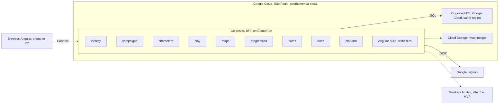

The dashed line is future: Jev (Workers AI) only arrives after the MVP. The legacy app (Angular in `src/`, NestJS in `server/`, GitHub Pages and Render) is not in this diagram because it is discontinued; `src/` stays in the repository only as a reference, and `server/` will be removed (see [Legacy app](legacy-app.md)).

Who may touch a sheet and how a player joins a session are in [Rules → Flows and states](product/rules.md#flows-and-states): they are business rules, not infrastructure.

### Module wiring is checked at startup

`campaigns`, `characters`, `play`, `maps` and `progression` need each other, so some collaborators enter after `New`, through a `Set...` called in a fixed order in `cmd/api` (`wireModules`). The compiler cannot see a missing call, and a `nil` collaborator rarely fails loudly: a `nil` fog source means "no fog of war", and players would see the NPCs the master hid (RN-10), with no error. Each module has a `CheckWired()` that lists the setters it needs (`platform/wiring`), and the end of `wireModules` calls them: a forgotten `Set...` **stops the server from starting**, with its name in the message. `TestTheRealWiringIsComplete` builds the real wiring (without a database or a sign-in provider) and passes only if everything is wired.

## API contracts (Protobuf)

Every API call starts in a `.proto` file. `buf generate` produces the Go and TypeScript code, and CI rejects a PR that breaks the contract. (A contract mismatch between Angular and NestJS in the legacy app caused the 400 error when saving sheets.)

Rules:

1. One package per module and version: `meurpg.<module>.v1`, in `proto/meurpg/<module>/v1/`.
2. One service per module, as a rule. A separate subject inside a module may have its own service in the same package: `campaigns` has `CampaignService` and `CampaignDocumentService` (the [campaign document](#campaign-document)). Each call has its own `XxxRequest` and `XxxResponse`, even if empty, as `buf lint` demands.
3. A field number never changes and is never reused. A removed field becomes `reserved`.
4. A breaking change becomes a `v2` package. `buf breaking` compares every PR with `main`.
5. Generated code is committed. CI runs `buf generate` again and fails on any difference.
6. Fields are `snake_case` in the `.proto`; the generated TypeScript uses `camelCase` by itself.
7. A read-only call carries an idempotency level, which depends on the request:
   - **Request with no ID and no personal data** (empty, like `GetMe`, `ListMyCampaigns`, `ListOpenGameSessions` and `GetServerInfo`): `idempotency_level = NO_SIDE_EFFECTS`. Connect then accepts GET, which the browser can cache.
   - **Request with an ID or personal data** (like `GetCampaign`, `ListMembers`, `ListInvites`, `GetCampaignDocument`, `GetCharacter`, `ListCharacters`, `GetMasterNotes`, `ListContent`, `GetSpellDetails`, `ListSpells`, `GetClassTableDefaults`, `GetEffectMenu`, `ListGameSessions` and `GetLiveSession`): `idempotency_level = IDEMPOTENT`. It is documented as a read and safe to repeat, but accepts only POST: in a GET the whole message goes in the URL, and the URL ends up in the platform logs (see [Privacy](privacy.md)).
   - `TestConnectGETOnlyForRequestsWithoutData` (`backend/cmd/api`) fails if a `NO_SIDE_EFFECTS` method has a request with a field.
8. Names follow Google AIP:
   - **Standard methods** start with `Get`, `List`, `Create`, `Update` or `Delete` plus the resource (AIP-131 to AIP-135): `GetCampaign`, `ListMembers`, `CreateInvite`.
   - **Custom methods** start with the action verb (AIP-136): `AcceptInvite`, `RevokeInvite`.
   - **Search with a filter**, when it exists, is `Search<Resource>`, like `SearchCampaigns`: the RPC equivalent of AIP-136's `:search`. It is `IDEMPOTENT`, because the request carries the filter.
   - An existing name does not change: renaming an RPC breaks the contract (rule 4).
9. Every call that **creates** something carries an `idempotency_key`, so repeating the call (a second tap, or a retry after a lost response) does not create a second resource (AIP-155). One mechanism serves all of them, the one from `PlaceTreasure` (`map_points.create_key`):
   - **How it works.** The key is 1 to 64 characters, chosen by the app **once per action** and repeated on the retry (`ActionKey`, in `web/src/app/core/connect/idempotency.ts`: the same key while the values stay the same, a new one when they change or when the action succeeded). The table stores `create_key` (the key's owner, a colon and the key, so it is unique within the owner) and `create_hash` (the hash of the whole request minus the key), with a partial unique index on `create_key`. Inside the create's transaction (`db.InTx`, only `WithTx`), the server looks the key up: if it finds a row with the same hash it returns what the first call did and creates nothing, publishes nothing and skips the list limit; with another hash it answers `invalid_argument` ("idempotency_key was used for another change"); if it finds nothing it creates. Two simultaneous calls with the same key create one: the loser's `INSERT ... ON CONFLICT DO NOTHING` returns no row, and it reads the winner's. The shared code is in `backend/internal/platform/idem` (`Clean`, `Scope`, `Hash`, `Create`); each module only adds the columns and queries.
   - **The key is optional** on RPCs that existed without it: with no key, the call is not deduplicated. The app always sends one. (The newer writes, and the combat and XP ones, require the key.)
   - **Where the key applies:** `CreateCampaign` (per user, `campaigns.create_key`); `CreateMap` and `CreateDungeonMap` (per campaign, `maps.create_key`); `CreateMapPoint` and `PlaceDungeonScene` (per campaign, `map_points.create_key`, the same column as `PlaceTreasure`); `AddSceneAction` (`scene_actions`); `AddSceneClue` (`scene_clues`); `CreateNote` (per author in the campaign, `player_notes`); `StartGameSession` (`game_sessions`); `CreatePuzzle` (`puzzles`); `AddMilestone` (`planned_milestones`); `CreateTableEntry` (`campaign_content`); `GiveCreature` (`character_creatures`) and `CreateCharacter` (`characters.create_key`, which existed for "Criar NPC"; the key is a UUID, a version 5 UUID of the caller and the app's key, so it is unique per caller; plus `create_hash`). The combat's and the session's changes keep the hash on the event (`session_events.idempotency_hash`), the XP awards on `xp_awards.idempotency_hash` and the generated images on `image_requests.idempotency_hash`: the same key with another request is `invalid_argument` there too. A trap damage applied or discarded keeps its scoped key and hash on its own row (`trap_damages.settle_key` and `settle_hash`, unique): the damage outlives its session, so it can be settled with none open, where there is no event to hold the key. A puzzle move is the same request when it is the same move (`puzzle_moves.move`), a hint try when it is rolled the same way (in the app, or the same typed die), and a key spent on a move or on a try of a run is spent for the other. The master's changes to a run that are not idempotent by themselves (a restart, a new start, a hint released, a play of the sequence) take the revision the master read (`expected_revision`): a call made on another revision is refused with `STALE_REVISION` and changes nothing.
   - **Four details.** (1) `CreateDungeonMap` looks the key up before generating and drawing again (drawing is the expensive part): a retry returns the first call's map, seed and room count. (2) `StartGameSession` returns the first session even if it has since ended, and the `locked_sheet_count` of a repeat is 0 (the first call locked the sheets). (3) `CreateTableEntry` looks the key up after bumping the content revision, which holds the campaign, and rolls the transaction back on a repeat: the revision does not rise for nothing. (4) `AddSceneAction`, `AddSceneClue` and `AddMilestone` look the key up with the point (or the list) already locked.
   - **Left out, and why.** `CreateInvite`: the response carries the token in clear text, which the database never stores (only the hash), so a repeat would have nothing to return; one extra invite does no harm and can be revoked. `PlaceMapToken`: already a "put or move", which repeated leaves the same token. `GenerateTreasure` and `GenerateEncounter`: they only compute from a seed and store nothing. `RollAbilityScores`: stores the dice, and a second call returns the same ones (`already_rolled`). `TakeBackLeftImage` and `TakeOffStage`: they remove something already removed and can repeat. `RollSceneCheck` already had the key.

The first contract only proves the whole path works:

```protobuf
syntax = "proto3";

package meurpg.system.v1;

// SystemService exposes build and runtime information.
service SystemService {
  rpc GetServerInfo(GetServerInfoRequest) returns (GetServerInfoResponse) {
    option idempotency_level = NO_SIDE_EFFECTS;
  }
}

message GetServerInfoRequest {}

message GetServerInfoResponse {
  string version = 1;
  string commit = 2;
}
```

Because Connect accepts JSON, it can be called with `curl`:

```bash
curl -s -X POST http://localhost:8080/meurpg.system.v1.SystemService/GetServerInfo \
  -H 'Content-Type: application/json' -H 'Connect-Protocol-Version: 1' -d '{}'
```

### Error codes

Every refused business rule returns a Connect error code, always the same one for the same case.

| Code | When |
| --- | --- |
| `unauthenticated` | No valid sign-in session. |
| `permission_denied` | The user is a campaign member but lacks the role: a player tries a master action. |
| `failed_precondition` | The rule does not allow it now: locked sheet (RN-01), a session that has not started, an expired invite, an image used on a map. It comes with a detail that says why when there is more than one reason (`InviteUnusable`, `CharacterBlocked`, `GameSessionBlocked`, `XPBlocked`, `AbilityScoresRefusal`, `XpModeChangeBlocked`), or what the screen needs to show (`ImageInUse`, with the maps that use the image). |
| `not_found` | It does not exist, or the user may not know it exists: a map hidden from the player, or a campaign the user is not a member of (ADR-0011). The pending member (RN-15) gets the same `not_found` outside the few calls they may make. |
| `invalid_argument` | Invalid input, such as an ability score above 30. |
| `resource_exhausted` | A campaign limit ran out: gallery full (300 images or 500 MB, MR-019), 200 maps in the campaign or 200 points on a map; or 5 image requests are already alive on the server (`maxPendingRequests`); or the person already has 8 live streams open in that campaign (`WatchGameSession`, no typed detail: the app retries with a delay). |
| `aborted` | A transaction conflict (`40001`) that persisted after the retries (`rpcerr.FromDB`), or a sheet or campaign document that changed since the app read it (stale revision, AIP-154). The app reloads and the person tries again. |

### Database errors

A read or write error becomes a Connect code in **one place**, `platform/rpcerr` (`rpcerr.FromDB`), which each module calls through its `dbError`. (There used to be six copies, all answering `unavailable` for anything unknown: a tab closed mid-request turned into "the database is not responding" and an `ERROR` in the log.)

| What happened | Code | Log level |
| --- | --- | --- |
| A Connect error the *handler* chose | the same, no log | — |
| The request was cancelled (the client left) | `canceled` | `DEBUG` |
| The request deadline passed, or the database cancelled a statement for exceeding `statement_timeout` (SQLSTATE `57014`) | `deadline_exceeded` | `WARN` |
| `db.InTx` retried `40001` until it gave up | `aborted` (the client may retry) | `WARN` |
| A commit lost its connection midway (`crdb.AmbiguousCommitError`): the change may or may not have been saved | `unknown`, with a fixed sentence telling the client to check before trying again (never `unavailable`: a blind retry of a create without a key could duplicate it) | `ERROR` |
| The database was unreachable: connection failure, network error, connection closed midway, node shutting down (class `08`, `57P01`, `57P03`) | `unavailable` | `ERROR` |
| Anything else (a bug, a row that should not be missing) | `internal` | `ERROR` |

The client receives only a fixed sentence, never the error text (which may contain SQL or a server name); the cause goes to the log line, once. The error keeps the original as its cause (`Unwrap`), so a method that runs inside another module's `db.InTx` may return it from the closure and `InTx` still sees a `40001` and retries. A module handles its own special case first (`campaigns` and `characters`: the row that vanished between the check and the query; `characters`: the document that cannot be read).

### Panics in goroutines and handlers

`net/http` only recovers from a panic in the *handler's* own goroutine; a goroutine the server starts that panics takes down the whole process, and with it every live session. So:

- **Connect *handlers*** have `connect.WithRecover` right after `rpclog` (`connectOptions`, in `cmd/api/main.go`): the panic becomes `internal` with a fixed sentence, the stack goes to the log (`rpc handler panicked`, with `request_id`, user and campaign) and `rpclog` still writes the `rpc` line with `code=internal`.
- **Background goroutines** (the image request in `maps/imagegen.go`, the live-hint timers in `maps` and `play`, the body of the Gemini request) use `defer safego.Recover(logger, "...")` (`platform/safego`): the work that broke is lost (the image request is recorded as failed and returns its slot), the stack goes to the log, and the server keeps going.

### Slow clients

The server has no global `ReadTimeout` or `WriteTimeout`, on purpose: they would cut the streams. The limit sits on the operation that can hang (`platform/slowclient`):

- **Each `Send` of a live stream** has 30 s to reach the client (`slowclient.Interceptor`; `Middleware` stores the `http.ResponseController` in the context, because Connect does not hand over the `ResponseWriter`). The deadline is set before each send and cleared after, so silence between two messages does not count. A reader that stopped reading (a laptop that slept, a dead mobile connection that never closed) ends with `Send` failing and the stream finishing as `client_gone`, instead of the goroutine staying stuck until Cloud Run closes the connection. The 30-minute stream cap, `ReadHeaderTimeout` and `IdleTimeout` remain.
- **The body of an image upload** has 2 minutes to arrive (10 MiB, at under 1 Mbit/s), and **the `POST /auth/login` form**, 10 s (`slowclient.ReadBody`). Past the deadline the upload answers 400 (`MALFORMED_REQUEST`, "the upload took too long") and the login, "the form could not be read".
- **The body of an image, a thumbnail, a fog tile and an app file** has 2 minutes to be written (`slowclient.WriteBody`, called right before `http.ServeContent` and `http.ServeFile`; 10 MiB on a slow phone). A client that stops reading ends with the write failing, instead of holding the handler and a Cloud Run request slot until the platform closes the connection (35 minutes). `WriteBody` clears the deadline when the handler ends, because with no `WriteTimeout` the server would not, and a kept-alive connection would carry it into its next request.
- A unary RPC has no body-read deadline (the body is at most 4 MiB): left for later.

### Abuse limits

There are four in-memory rate limits and three caps on what an account creates. The rate limits stop a script; none hinders a real table. The package is `platform/ratelimit`, the same as the login's (its token bucket, `Limiter`, with a per-client and a global limit); there is no new dependency.

| Limit | Key | Value (burst, then…) | Where | Response |
| --- | --- | --- | --- | --- |
| Every API request (`/meurpg.*`, `/images/`, `/uploads/`) | Client IP | 600, then 100 per second (global: 2,000, then 500 per second) | HTTP middleware (`ratelimit.Middleware`), **before** the session is looked up | `429` with `Retry-After` and JSON `{"code":"resource_exhausted","reason":"RATE_LIMITED"}` |
| Connect calls | Signed-in user | 200, then 40 per second | Interceptor right **after** the session one (`limitedSessions`, in `cmd/api`) | `resource_exhausted` with the `Retry-After` header |
| Images, thumbnails and fog tiles | User | 500, then 50 per second | `maps.Mount`, after the session and before authorization | `429`, reason `RATE_LIMITED`, `Retry-After` |
| Uploads (`POST /uploads/images`) | User | 20, then 1 every 6 s (10 per minute) | the same | the same |
| `/auth/login` and `/auth/callback` | Client IP | 40, then 1 every 3 s (see [Login attempt limit](#login-attempt-limit)) | `identity`, first thing in each handler | `429` with `Retry-After`, plain text |

- **Why the IP comes before the session.** A request with no session, or with an invented 43-character cookie, costs a database read to be refused. The IP limit stops it before that. It counts everything on the API, with or without a session, because that can only be known after the read; so the value is generous (a table of seven people behind the same Wi-Fi stays under 100 per second), and the per-user limit is what holds back a member who repeats an expensive call (generator, preview, upload).
- **Routes outside the limit.** The static app and `/healthz` touch no database. `/readyz` does, and it is open to anyone, but it is not limited by IP: Cloud Run's probes can share an address, and a limit that refuses a probe takes the instance out of service. What bounds it is that the database answer is shared: one ping per 2 seconds for all requests (`pingCache`, in `platform/httpserver`; the others wait for that ping), made with a context of its own so that one request hanging up does not fail the others. A change of database state shows in `/readyz` up to 2 seconds late.
- **The user comes after the session.** Each module builds the session interceptor it receives (`Sessions.Interceptor()`); `cmd/api` hands every module a `limitedSessions`, which chains the limit right after it, and mounts `IdentityService` the same way (`Service.MountLimited`): its calls write to the database too (the profile, "Sair dos outros dispositivos"). A call with no session passes this limit (the IP one covered it and the *handler* refuses it). A stream spends one token on opening, not per message; the per-user stream limit is separate (see [Live session](#live-session)).
- **Fog tiles have two limits**, and they do not contradict each other: the downloads' one counts every request (each costs three database reads to check session, participation and sight), and the one in `maps/tiles.go`, tighter, counts only the tiles that need rendering (60 at once, then 10 per second).
- **The numbers** are what fits comfortably at a table (a master, six players, the map editor painting in batches, the session page reading): the gallery lists up to 300 thumbnails at once, and a fogged map opens with a few dozen tiles. `RATE_LIMIT_MULTIPLIER` multiplies all of them (default 1). The e2e suite runs with 10 (see [Operations](operations.md#abuse-limits)).
- **Each refusal becomes a `WARN`** (`rate limit hit`), with the limit's name and the `user_id` the context already carries, at most one per 10 s per limit, with the count of those left out. **Never with the IP** (see [Privacy](privacy.md)): a script hitting the limit a thousand times a second does not fill the log.
- **The web app handles the refusal without retrying by itself.** `rateLimitInterceptor` (`web/src/app/core/connect/transport.ts`) turns a `resource_exhausted` with `Retry-After` into `unavailable` with "Muitas ações em pouco tempo. Espere N segundos e tente de novo.", which every screen already treats as "try again", and never as the final refusal of a full gallery (also `resource_exhausted`). Nothing resends by itself; the live stream, which reconnects, already waits with growing delay. The one exception is images: the browser's `` cannot read `Retry-After`, so a fog tile (`fog-base`) answered `429` or `503` is asked for again after 2, 4, 8, 16 and 30 s (the URL gains `&retry=N`), and the place stops waiting for it only when it arrives or the last attempt fails; the map's picture and the gallery's thumbnails do the same through the `appRetryImage` directive (`shared/retry-image`), which starts over for another picture and stops with the screen. The image upload reads the `RATE_LIMITED` reason from the JSON.
- **One instance only.** The counters live in process memory. With `max-instances` 1 the limits are exact; with two instances each would have its own (up to double), and exact limits would need shared storage (Redis, or the database). Changing `max-instances` means rereading this section.
- **The client IP** comes from the connection (`RemoteAddr`) locally and, on Cloud Run, from the **last** item of `X-Forwarded-For`, for the same reason and with the same caveat as the [login](#login-attempt-limit): Google's front end appends the address of whoever connected after what the client sent, and only what comes from the right is trustworthy.

**What an account creates (RN-30).** An account is master of at most `MAX_CAMPAIGNS_PER_USER` campaigns (default 10). The count is done in the same transaction that inserts the campaign (`CountMasteredCampaigns`, with `WithTx`), so two creations at once do not both pass the cap (`SERIALIZABLE` makes one retry and count again). The `campaign_members (user_id)` index already finds the rows. The refusal is `resource_exhausted` with the `CampaignCreationRefused` detail (`LIMIT_REACHED`, with the cap), and the screen shows the sentence in place of the form. With `CAMPAIGN_CREATORS` set (verified e-mails, comma-separated), only someone with one of those verified e-mails creates campaigns; the others get `permission_denied` with `NOT_ALLOWED`. The e-mail comes from the identity (`identity.PostgresStore.VerifiedEmails`, only those the provider vouched for): the `campaigns` module never reads the users table. Empty, anyone creates. Someone invited to a campaign plays without needing to be on the list.

**The daily image cap (MR-039).** Besides the 20 per month per campaign, the whole server generates at most `IMAGE_DAILY_LIMIT` images per Brasília day (default 100), counted in `image_requests` (those not given back) with the index `image_requests_created_at_idx` (migration 00176). The count runs in the transaction that reserves the slot (and before, to refuse without reading or shrinking images). The refusal is the usual `failed_precondition`, with the reason `DAILY_LIMIT_REACHED`. It is the Gemini account's ceiling, and it stops a stranger from spending the Google quota the table needs.

## Transactions and the connection pool

**Inside a transaction, no read through the pool.** Code inside a `db.InTx` already holds a pool connection; a read through the pool takes a second one and waits for it while the transaction holds the first. With a few simultaneous requests, each holds a connection and waits for another: all hang until the context ends. (This happened in CI: `MoveCombatant` read the map terrain through the pool inside the transaction, and it plus four other requests sat stuck for 176 s. Alone, the same call works, which is why the error only shows under load.)

| Rule | How it is met |
| --- | --- |
| Everything the transaction reads or writes goes through it | `queries.WithTx(tx)`, or a function that takes the `pgx.Tx`. Never the service's `s.queries` or `s.pool`, and never a function from another module that reads through the pool. |
| A cross-module call that reads receives the transaction | The first argument after `ctx` is `tx pgx.Tx` (`nil`: the pool, for callers outside a transaction). This is how `CombatRoster` works (`CombatParty`, `CombatCharacters`, `SessionCharacters`, `CombatSheet`, `CombatTurnOptions`, `CombatSpell`, `CombatSave`, `SceneOptions`, `CheckSummon`, `ContentNames`, `CreatureSheet`, `CreatureTurnOptions`, `CreatureSave`, `CreatureEyes`), `characters.ContentSource.For` and `TableRulesReader.StoredTableRules`, `maps.MapDefaults.FogOnNewMaps`, `campaigns.XPAwards.AwardedXP`, `MapKeeper` (`MapGrid`, `MapTokens`, `ScenePoint`), `TerrainSource.Terrain`, `DiceModes.ForcedDice`, `LevelUps.LevelUpReason`, `DiceRules.LevelUpDice`, `progression.Campaigns.CampaignXPMode`, `CharacterDirectory` (`MapCharacters`, `PartyVision`), `CombatMaps.CombatPositions` and `CombatSight.KnownTerrain`. Each module has a `queriesIn(tx)` (in `maps`, `queriesIn(q, tx)`) that picks the transaction or the pool. |
| A read error inside the transaction propagates | In CockroachDB a failed statement aborts the transaction, and the next one fails with `25P02`, which nobody retries. Swallowing a `40001` (log and go on) would turn a retryable conflict into a failure. With `tx`, the error comes back wrapped with `%w`; only the pool path may log and go on. |
| The closure starts from the same state on every run | A variable the closure shares with the code around it is not overwritten with something that exists only inside one attempt (the copy of a fog map's image, whose gallery row is rolled back with the attempt): it is assigned to a local, and `used`-style flags are reset at the top. |
| Inside the transaction, nobody waits for another request | The fog scene compiled inside a transaction does not enter the `maps` single-flight cache (`once`): whoever holds a connection does not wait for someone who may be waiting for one. |
| What must not change during the transaction, or does its own write, is prepared before | The fog view (`sightForWrite`) is read first. An NPC portrait that needs a copy (the background of a fogged map) has its files copied beforehand (`Gallery.PreparePortrait`, only for whoever passes the same checks as the transaction) and the gallery row inserted **inside** it (`PortraitCopy.Insert`); if the transaction fails the files are removed (`Discard`) and no orphan image remains. |
| No effect outside the database inside the transaction | The transaction may run again on error `40001`; publishing to the stream, touching files and calling another service wait until after the commit. |

**Reads that join several statements run in a read-only transaction.** A loose statement outside a transaction picks its own instant: a write finishing between two statements of the same response gave a view mixing two states (the new combatant list next to the old revision). `db.ReadTx` opens a `READ ONLY` transaction (with the same `40001` retry as `InTx`; it sets `SET TRANSACTION READ ONLY` at the start of every attempt, because the retry begins again with a plain `BEGIN`), and all its statements see the same instant. It does not use `AS OF SYSTEM TIME` (`follower_read_timestamp()`), which reads data a few seconds old: in live play the player must see what the table just did, and an ordinary CockroachDB read transaction reads what was committed at its start and never blocks writers. The single-connection rule applies equally: inside it, only `WithTx(tx)`. Users: `GetEncounter`, `GetTurnOptions`, `GetMoveOptions`, `ListCombatLog` and `GetCombatHighlights` (`play`: the session, the combat, the combatants, the events), and `GetMap`, `GetMapLayers` and all of `loadMaps` (`maps`: the maps and sub-map links, and, in `GetMap`, the points and sheets; in `GetMapLayers`, the layers together with the revision that counts them). What the view adds from other modules (HP, sheets, fog) is read afterwards, outside it: one transaction across several modules would be a change of its own.

**What proves it.** Every test pool (`platform/dbtest`) has **one** connection (`MaxConns = 1`) and an `Acquire` tracker. An acquisition made from inside a `db.InTx` closure fails the test at once, with the stack, and the `Acquire` itself is cancelled, so nothing waits. A wait of more than 90 s for a connection (the case the stack cannot see, like a goroutine launched by the closure) brings down **the whole package's test binary** with the stack of whoever waits. Since every integration test goes through that pool, every write in every package runs on one connection, and a new call that reads through the pool inside a transaction breaks the test that exercises it. A test that races transactions against each other asks for a bigger pool with `dbtest.PoolSize(t, n)` (n at least the number of racers; with one connection they would run one at a time and prove nothing); one that must hold a transaction open while the service works uses `dbtest.SideConnection` and `side.Begin`. `MEURPG_TEST_POOL_MAX_CONNS=8` applies to the whole process and lists all violations at once.

**The pool size in production.** Without `pool_max_conns` in `DATABASE_URL`, the pool opens at most 10 connections (`db.defaultMaxConns`); why 10 is in [Operations](operations.md#the-connection-pool). It is a safety net, not the fix: no path may hold a connection and ask for another, whatever the size.

## Logs

Every API log is one JSON line on stdout, and every request, RPC, stream and game event leaves a line tied to the same `request_id`. Operators read and filter these logs (see [Operations](operations.md)); this section says what the line has and why. The code is in `backend/internal/platform/logging`, `platform/rpclog` and `platform/httpserver`.

### Log fields

| Field | When | What it is |
| --- | --- | --- |
| `time`, `severity`, `message` | Always | The time, the level (`DEBUG`, `INFO`, `WARNING`, `ERROR`, the Cloud Logging names) and a fixed text per code point (`http request`, `rpc`, `stream opened`, `stream closed`, `event`). Never user text |
| `service`, `version` | Always | `meurpg-api` and the build version (the same as `SystemService.GetServerInfo`) |
| `request_id` | Inside a request | 32 hexadecimal characters, generated by the server |
| `user_id` | With a valid session | The account ID (a UUID, a pseudonym) |
| `campaign_id` | When the request is about a campaign | The campaign UUID |
| `logging.googleapis.com/trace` | On Cloud Run, with `GOOGLE_CLOUD_PROJECT` | `projects/<project>/traces/<id>`, taken from the `X-Cloud-Trace-Context` header, so Cloud Logging joins a request's lines |

A `slog` *handler* (`contextHandler`) adds `request_id`, `user_id` and `campaign_id` to every line written with a context (`logger.InfoContext(ctx, ...)`). Whoever logs without a context does not carry these fields, which is why request code always passes `ctx`.

### The request id

The server generates each request's id, puts it in the context and returns it in the `X-Request-Id` header. An `X-Request-Id` the client sends is ignored, never read: otherwise anyone could write what they liked into the log, or pose as another request. The app reads the header in `fetch` with nothing extra, because the API and the app share an origin (the CSP already says `connect-src 'self'`), so whoever sees an error can quote the id.

`user_id` and `campaign_id` arrive *after* the id, deeper in the call. So the context holds a pointer to the fields, not a value: the session interceptor (`identity`) records the user, and `authz` and the log interceptor record the campaign, and the `http request` line, written at the end by the outer layer, already sees them. The campaign only enters if it is a UUID in canonical form: the value comes from the client, and any other text could be written into the log by it.

### Log lines

| `message` | Level | Fields besides the common ones |
| --- | --- | --- |
| `http request` | `INFO`; `WARNING` if the status is 5xx; `DEBUG` on the `/healthz` and `/readyz` probes | `method`, `path` (without the query; cut at 256 bytes with `...[truncated]`, because the client chooses it), `proto`, `status`, `duration_ms` |
| `rpc` | `DEBUG` when the code is `ok` or a client error (`invalid_argument`, `not_found`, `permission_denied`, `failed_precondition`, `already_exists`, `aborted`, `unauthenticated`, `resource_exhausted`, `out_of_range`, `canceled`); `ERROR` for `internal`, `unknown`, `unavailable`, `data_loss`, `deadline_exceeded` | `procedure`, `code`, `duration_ms`, `stream`, and if the code is not `ok`: `error` and, when the error carries a typed detail, `reason` |
| `stream opened` and `stream closed` | `DEBUG` | `procedure`; at the end, `duration_ms`, `messages` (those sent) and `close_reason` (`client_gone`, `server_ended`, `access_lost`, `error`) |
| `event` | `DEBUG` | `event` (`<area>.<past_verb>`), only IDs and closed enums |

The `rpclog` interceptor is first in the list, so it is outermost: it sees the final error, wherever it came from. `reason` is the reason enum of the error detail (`XPBlocked`, `CharacterBlocked`...), read by reflection from the field whose name contains `reason`: a new detail shows up in the log without touching the interceptor. The `close_reason` of a stream the server ends by itself (the session ended, the 30-minute cap, shutdown) is always `server_ended`: from inside the server the three are the same fact.

The `error` text stays only in the log. If a *handler* returns a non-Connect error (a driver message, a file path), Connect would send it to the client with code `unknown`; the interceptor swaps it for `internal` and a fixed text, and the real text goes to the `rpc` line. Connect error messages (those the client also receives) are fixed sentences we wrote, and the log cuts them at 500 characters.

### Game events

An `event` marks a state change that was just written, logged *after* `db.InTx` returns: a retried transaction (`40001`) does not log twice. Only IDs (`session_id`, `encounter_id`, `character_id`, `combatant_id`, `map_id`, `point_id`, `puzzle_id`, `award_id`, `entry_key`...) and closed enums (`outcome`, `kind`, `mode`, `reason`).

| Area | Events |
| --- | --- |
| Session | `session.started`, `session.ended` |
| Combat | `combat.started`, `combat.begun`, `combat.ended`, `combat.turn_passed`, `combat.attack_resolved` (with `outcome`), `combat.spell_resolved`, `combat.damage_rolled`, `combat.damage_applied`, `combat.death_save_rolled`, and one per kind of combat change (`combat.<session_events kind>`) |
| Scene | `scene.opened`, `scene.closed`, `scene.check_rolled` |
| Puzzle | `puzzle.move_made` (with `outcome`: `ok`, `wrong`, `solved`), `puzzle.solved`, `puzzle.failed` |
| Trap and treasure | `trap.noticed`, `trap.triggered`, `treasure.found`, `treasure.converted` |
| XP | `xp.awarded`, `xp.milestone_marked`, `xp.undone`, `levelup.done` |
| Table content | `content.entry_written`, `content.entry_archived`, `content.entry_unarchived`, `content.option_switched` |
| AI images | `image.requested`, `image.generated`, `image.refused`, `image.failed` |
| Campaign and character | `invite.accepted`, `character.created`, `character.approved` |

All of combat goes through one function (`write`, in `play/combat_write.go`), which logs the event of each change written. The others sit beside the change.

### What never goes in the log

Session, invite, login and CSRF tokens; cookies; the OIDC client secret; `GEMINI_API_KEY`; e-mails; display, character, NPC and campaign names; any text a person typed (documents, notes, clues, prompts, the text of a content entry); request or response bodies; headers; the URL query. Only IDs and closed enums. The reason is RN-10 (the player must not learn what the master hid, and the log reaches more people than the app) and the LGPD (see [Privacy](privacy.md#api-logs)).

A guard in the *handler* enforces this even when a code point errs: it drops every attribute whose name is `email`, `token`, `password`, `secret`, `cookie`, `authorization`, `prompt`, `body`, `text`, `name` or `display_name`, at any depth (inside groups and maps), case-insensitively. A test proves it (`TestDenyListDropsKeysAtAnyDepth`). The guard is the safety net, not the plan: code should log IDs.

### Log levels

`LOG_LEVEL` (`debug`, `info`, `warn`, `error`) picks the level; the default is `info`, which production uses until someone raises it. At `info` the cost is one line per request, plus the RPC error lines. At `debug` the `rpc`, `stream` and `event` lines also come out. The local environment (`make up`, Docker or native) already starts at `debug`; `LOG_LEVEL=info make up` goes back to normal. The native environment's log is at `~/.meurpg/run/api.log`. What to do with logs in production is in [Operations](operations.md).

## Web app (web/)

`web/` is the Angular app (the old `src/` is deprecated). Go serves its build on the same origin as the API, as the "Frontend" row of the decisions table explains.

- **How it is served:** `backend/internal/platform/httpserver.NewStatic` serves `index.html` and the hashed assets from `WEB_DIR` (`/app/web` in the image, configurable). Without a valid `WEB_DIR` the server starts with the API only and logs a line. It is not fatal; it is the normal case outside the Docker image (`make run` on the host, for example). An unknown route (not `/meurpg.*`, `/auth/*`, `/healthz` nor `/readyz`) falls back to `index.html`, for the Angular router to take over (SPA fallback); the four exceptions become a plain 404, never the page.
- **Cache:** a hashed asset (the build's own files, named `name-<8 characters>.ext` thanks to `outputHashing: "all"`) gets `Cache-Control: public, max-age=31536000, immutable`. `index.html` and the files copied as they are, with no hash in the name (`favicon.ico`, `material-symbols/*`), get `no-cache`: the browser asks again whether they changed.
- **CSP:** `default-src 'self'`; `form-action` is `'self'` plus the sign-in provider's origin (see the invite flow below); no exception in `script-src` (the production build uses no inline `<script>` or event attribute, checked in the generated HTML and live, with no console violation). `style-src` needs `'unsafe-inline'`: Angular injects each component's CSS into `<style>` in the `<head>` at runtime, regardless of any build option, also confirmed live (without `'unsafe-inline'` the app loads with no style). More, and the option to swap this for a per-request nonce: the `cspHeader` comment in `static.go`.
- **Security headers on every response:** a middleware (`securityHeaders`, in `backend/internal/platform/httpserver/middleware.go`) sets on **every** response (RPCs, `/auth/*`, `/images/*`, `/uploads/*`, the probes, the 404s): `X-Content-Type-Options: nosniff`, `Referrer-Policy: same-origin`, `Permissions-Policy` (denies camera, microphone, geolocation, payment, USB, sensors and the rest the app does not use; the clipboard, which "copy link" uses, is not restricted), `Cross-Origin-Opener-Policy: same-origin`, `Cross-Origin-Resource-Policy: same-origin` and a closed CSP for what is not a page (`default-src 'none'; base-uri 'none'; form-action 'none'; frame-ancestors 'none'`). A handler that needs another value replaces it with `Set`: the static handler sets the app CSP (the one above), the `/auth/*` routes set `Referrer-Policy: no-referrer`. **HSTS** (`Strict-Transport-Security: max-age=63072000; includeSubDomains`) only goes out when the request arrived over HTTPS (direct TLS or `X-Forwarded-Proto: https`); never on `http://localhost`. On Cloud Run Google's front end terminates TLS and sets this header, and the container is not reachable any other way, so a client cannot forge it; elsewhere a forged header only earns an HSTS on an HTTP response, which the browser ignores. The app CSP keeps `base-uri 'self'` (not `'none'`): Angular's `index.html` has `<base href="/">`, which the router depends on.
- **Codegen:** `proto/buf.gen.yaml` runs `protoc-gen-es` (Connect-ES v2: one plugin generates messages and services) as a local plugin, from the binary in `web/node_modules/.bin`, with `target=ts`, writing to `web/src/gen/` — generated and committed code, like the Go side. `make proto` installs the `web/` dependencies by itself if missing.
- **Dev:** `cd web && npm start` runs Angular with `proxy.conf.json` forwarding `/meurpg.*`, `/auth` and the probes to `localhost:8080`.
- **Visual:** the color, type, space and radius tokens are `--mr-*` CSS properties in `web/src/styles.scss`, with the Angular Material system tokens pointed at them, and the common pieces (panel, list, tag, notice) live in `web/src/styles/_ui.scss`. What each means and how a screen is designed and reviewed: [Design](design.md).
- **Fonts:** Alegreya and Alegreya Sans (OFL license), from the `@fontsource/alegreya` and `@fontsource/alegreya-sans` packages, Latin subset only in woff2, declared in `web/src/styles.scss` and served by Go itself, like the icons below. Each license is in `NOTICE` and `third_party/licenses/`.
- **Icons:** when a screen needs an icon it is the self-hosted Material Symbols font (package `@material-symbols/font-400`, copied into the build by an `assets` entry of `angular.json` and served by Go itself) — never Google Fonts, which the CSP's `font-src 'self'` blocks and [privacy](privacy.md) forbids.

### Session state and the sign-in/sign-out flow

An `AuthService` (`web/src/app/core/auth/auth.service.ts`) calls `IdentityService.GetMe` at startup (in practice as soon as the always-present account menu in the navigation bar injects the service) and again whenever a call learns the login session ended (below), and keeps the result in a signal with four states:

| State | When |
| --- | --- |
| `unknown` | `GetMe` has not returned yet. |
| `signed-out` | `GetMe` answered with code `unauthenticated`: at startup, or after another call answered `unauthenticated` (signed out in another tab, "Sair dos outros dispositivos", expiry). |
| `signed-in` | `GetMe` answered with the user and `sessionExpiresAt`. |
| `unavailable` | Any other Connect code, or a network failure. Never becomes `signed-out`: a server or database being down must not look like a signed-out user. |

A login session that ends while a tab is open is learned from any unary call: an interceptor in the transport (`sessionEndedInterceptor`) answers `unauthenticated` from any call except `GetMe` and `SignOut` (the reader itself, which would loop) by asking `AuthService.refresh()` to read `GetMe` again; calls that arrive while it is in flight share it. The state settles to `signed-out`, so the account menu shows "Entrar", the open-sessions poll stops (it also calls `refresh()` itself on `unauthenticated`) and guarded routes send to sign-in on the next navigation. Every screen that maps errors through `describeConnectError` shows "Sua sessão acabou. Entre de novo para continuar." for `unauthenticated` unless it has its own wording, never the "server unavailable, try again" text, which no retry fixes. A code the screen did not word is also not shown with the screen's `unavailable` text (which often names a cause, such as images being off): `unknown`, which the server answers when a commit is ambiguous, says "Não deu para confirmar se a alteração foi salva. Confira na tela antes de tentar de novo.", and any other says the server could not be reached or failed. A rate-limited call says how long to wait. The table content writes (`contentErrorText`) say the same.

The app's single Connect transport (`web/src/app/core/connect/transport.ts`) forces `credentials: 'same-origin'` on `fetch`, so the session cookie goes on every call, and every unary call already gets `Connect-Protocol-Version: 1` by default from `@connectrpc/connect` (see [CSRF](#csrf)). The transport also gives **every unary call a 60 s deadline** that does not set its own (`withUnaryDeadline` in `transport.ts`): a hung call ends in `deadline_exceeded`, which screens treat like any server failure (the message and the "try again" they already have), instead of an eternal loading indicator. The deadline also goes in the `Connect-Timeout-Ms` header, and the server cancels the work. **Streams** (the live session) are excluded, because they stay open on purpose. 60 s is above the longest legitimate long poll, `GetImageGeneration` with `wait_seconds` (at most 25 s on the server); a call that needs more passes its own `timeoutMs`.

Signing in is always a full-page navigation to `/auth/login?return_to=<current path>`, never an Angular route: the server drives the OIDC flow (see [Identity module](#identity-module-sign-in-and-session)). `authGuard` (`web/src/app/core/auth/auth.guard.ts`) protects routes that need a session, like "Minhas campanhas": it lets `signed-in` through; sends `signed-out` to sign-in with `return_to`; and redirects `unavailable` to the "server unavailable" page (keeping the requested path in `return_to`, so "Tentar de novo" goes straight back), instead of treating it as if the person had signed out. After the server's callback the browser already returns to `return_to`, so there is nothing for the client to interpret.

Signing out calls `IdentityService.SignOut` and always returns to the home page with a full-page navigation — even if the call fails, because a silently failing "Sair" is worse than a cookie that a future `GetMe` corrects.

### Nothing in the browser besides the session cookie

No exception: nothing in `web/` reads or writes `localStorage`, `sessionStorage` or IndexedDB, writes a cookie from JavaScript, or uses a Worker to hold a token or personal data. The only place the session lives is the `__Host-meurpg_session` cookie, `HttpOnly` — the app's JavaScript never reads or writes it; sign-in and sign-out are always a full-page navigation to the server (`AuthService.signIn`/`signOut`, above), never a `fetch` storing something in the browser. The invite token (below) also never touches storage: it lives only in a component field, in memory.

`web/src/no-web-storage.spec.ts` is the automatic guard: it scans every `.ts`/`.html` in `web/src` (except `gen/` and specs) for `localStorage`, `sessionStorage`, `indexedDB`, `document.cookie =` and `new Worker`/`new SharedWorker`, and fails the test if any appears. See [Privacy](privacy.md).

**Why nothing stays in the browser.** The BFF pattern (decisions table, above) is what the IETF guidance for OAuth in browser-based applications ("OAuth 2.0 for Browser-Based Applications") ranks as the strongest option: the OIDC tokens stay on the server only, and the browser has only the `__Host-`, `HttpOnly` session cookie, which JavaScript cannot read. Holding a token in a Web Worker is the mitigation recommended only for those who really must hold a token in the browser — and even then an XSS can still use the worker as a proxy; that is not our case, because no OIDC token reaches the browser. The invite token is not there either: it goes in the body of `POST /auth/login`, and the server keeps only its hash, in the single-use, 10-minute login state; a worker would not survive the navigation to the provider anyway. If the browser ever needs to call a third-party API directly, the worker pattern is the plan for that token.

### Screens: campaigns, invite and profile

MR-001, MR-002 and MR-003 (see [Stories](product/stories.md)) live in `web/src/app/pages/`, all loaded by lazy route (`loadComponent`), on the generated `CampaignService` (`web/src/app/core/campaigns/campaigns.service.ts`):

| Route | Screen | Guard |
| --- | --- | --- |
| `/campaigns` | `ListMyCampaigns`, with each one's role (master/player), or "esperando a aprovação do mestre" for the pending member (RN-15); a "Nova campanha" form (name, XP mode) that leads to the created campaign | `authGuard` |
| `/campaigns/:id` | `GetCampaign` + `ListMembers`; for the master, the "Convites" section (create, with the "Exigir aprovação do mestre" option, list with status, revoke). For the pending member, only `GetCampaign` (which carries only the name): the "Esperando a aprovação do mestre" notice and their own character, without asking for members | `authGuard` |
| `/invite` | Accepts an invite by the token in the URL fragment (below) | Public — handles both cases, signed in and out |
| `/invite/error` | Message by code (`reason`), after the invite sign-in flow | Public |
| `/profile` | "Meu perfil": changes the display name (`IdentityService.UpdateProfile`) | `authGuard` |

Connect errors become Portuguese messages through a `Code → text` map (`web/src/app/core/connect/connect-errors.ts`), with a special case for `AcceptInvite`: its `failed_precondition` carries the `InviteUnusable` detail, and `web/src/app/core/campaigns/invite-errors.ts` reads its `state` to say exactly why (expired, revoked, used up). A campaign the user is not a member of and one that does not exist arrive as the same `not_found` (ADR-0011) and become the same "campaign not found" screen — the app never tries to guess the difference.

**The invite flow, browser side** (`web/src/app/pages/invite/invite-accept.ts`):

1. On opening `/invite#t=<token>`, the component reads the token from `location.hash` in the constructor and calls `history.replaceState` **immediately**, before anything else — the visible URL never shows the token after that first instant. The token stays only in a private component field, in memory (see "Nothing in the browser", above); it never becomes a route parameter or query string, nor touches storage.
2. Without a token, it shows "link de convite inválido".
3. With a token and an active session, it calls `AcceptInvite` directly: success (including `already_member`) navigates to `/campaigns/<id>`; an unusable invite shows the specific message from `invite-errors.ts`; a failure of the server or the network (and an unconfirmed session) shows its message with "Tentar de novo", which asks again with the token kept in memory, since the fragment is already gone from the URL and a reload could not. On an invite with approval (RN-15, MR-024), whoever just became a pending member (`awaiting_approval` and not `already_member`) goes straight to `/campaigns/<id>/characters/new`, to create the character the master will approve.
4. With a token and no session, it shows "Entrar para aceitar o convite". The click builds and submits a hidden `<form method="post" action="/auth/login">` with `return_to=/campaigns`, `intent=campaign_invite` and `intent_payload=<token>` — this is the contract with the server (`identity` module): it accepts the invite after sign-in and redirects to `/campaigns/<id>` (or `/campaigns/<id>/characters/new`, for whoever just became a pending member), or to `/invite/error?reason=<code>`, with `<code>` among `expired`, `revoked`, `used_up`, `not_found`, `invalid` and `unavailable` (the database failed on accept). The menu's "Entrar" button never carries the fragment into `return_to`: `AuthService.signIn` cuts everything from the `#`, and the server also discards fragments. It is a same-origin POST to `/auth/login`, and the server answers with a 303 to the provider. The browser checks the CSP `form-action` at every step of that redirect, so the CSP lists, besides `'self'`, the origin of the provider configured in `OIDC_ISSUER` (`WithFormActionOrigin` in `backend/internal/platform/httpserver/static.go`); without it the button does not leave the page.

### Web tests

Unit tests (Vitest, `web/src/**/*.spec.ts`) cover error mapping, the fragment cut (`replaceState` called, no storage touched), the signed-out flow's form fields and, for the invite with approval (MR-024), the "Exigir aprovação do mestre" box, the destination of whoever just became a pending member, the "Esperando a aprovação do mestre" notice, the master's "Esperando aprovação" list and the "Aprovar personagem" and "Recusar personagem" buttons. End to end (Playwright, tags `@MR-001`/`@MR-002`/`@MR-003`/`@MR-024`) are in `e2e/tests/campaigns.spec.ts`, `e2e/tests/invite.spec.ts` (including the invite sign-in path, item 4 above) and `e2e/tests/character-approval.spec.ts`.

## Identity module: sign-in and session

The master signs in through an OpenID Connect (OIDC) provider with Authorization Code + PKCE, and the server opens an opaque session of at most 30 days (ending sooner after 14 idle days), kept in an `__Host-` `HttpOnly` cookie (ADR-0002). The code lives in `backend/internal/identity` and knows no particular provider: Google in production, a local OIDC provider or a fake one in tests. Everything comes from configuration (see [CONTRIBUTING.md](../CONTRIBUTING.md#sign-in-with-an-oidc-provider)) and OIDC discovery (`/.well-known/openid-configuration`).

| Route | What it does |
| --- | --- |
| `GET /auth/login?return_to=/path` | Stores the login state and sends the browser to the provider. `return_to` only accepts a path of this site; a fragment (`#...`) is discarded. |
| `POST /auth/login` | The same, from an app form, with an optional **login intent** (`intent` and `intent_payload`): something the server completes right after sign-in, like accepting an invite. See [Accepting an invite through sign-in](#accepting-an-invite-through-sign-in). |
| `GET /auth/callback` | Checks everything, creates the session, writes the cookie, completes the intent if any, and returns to `return_to` (or wherever the intent sends). |
| `IdentityService.GetMe` | Who is signed in (account ID and display name) and when the session ends. Accepts GET, because the request is empty. |
| `IdentityService.SignOut` | Revokes the current session in the database and clears the cookie. The user's other sessions continue. |
| `IdentityService.SignOutOtherSessions` | Revokes all the user's other sessions that are still valid and returns how many ended. The current session and cookie stay as they are (ASVS 5.0 V7.4.3). |
| `IdentityService.CountOtherSessions` | How many other sessions of the user are still valid, for the screen to say "conectado em N outros dispositivos". Accepts GET. |
| `IdentityService.UpdateProfile` | Changes the display name (empty clears it). `GetMe` also returns that name. |

### Sign-in sequence

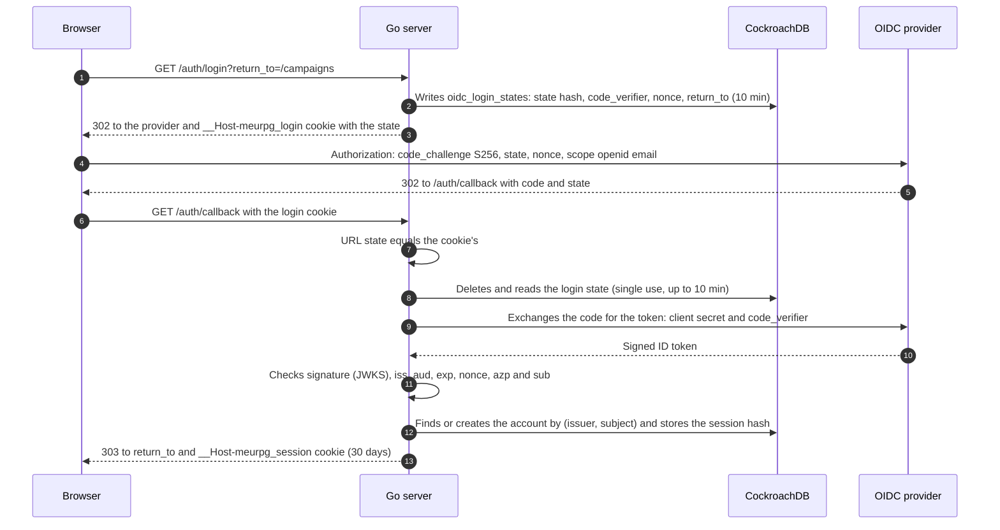

The callback refuses with 400, creating no session, when: the login cookie is missing or the `state` does not match it; the state does not exist, was already used or is older than 10 minutes; the provider returned an error; the `code` exchange failed (including by PKCE); or the ID token fails any check. `aud` must be only our client ID, and `azp`, when present, too.

### Session

- **Token:** 32 random bytes (`crypto/rand`) in the `__Host-meurpg_session` cookie, with `Secure`, `HttpOnly`, `SameSite=Lax` and `Path=/`. The database stores only the SHA-256 (`auth_sessions.token_hash`).
- **Absolute lifetime:** 30 calendar days from sign-in, not renewed by use (NIST SP 800-63B-4, AAL1). After that the master goes through the provider again.
- **Idle lifetime (ASVS 5.0 V7.3.1, level 2):** a session unused for **14 days** ends and behaves like a session that does not exist (`unauthenticated`; the app goes to sign-in). 14 days weighs risk against use: the table plays roughly weekly, so 14 days forgive two missed sessions in a row, and a browser forgotten at a friend's house stops working well before 30 days. Changed by `SESSION_IDLE_TIMEOUT` (1 h to 720 h; [Operations](operations.md#environment-variables-and-secrets)). Use never extends the 30 days.
- **How the last use is recorded:** in `auth_sessions.last_used_at`, at most **once every 10 minutes** per session, not on every request. The interceptor reads the session (which already carries `last_used_at`) and, only if it is older than 10 minutes, issues a single `UPDATE ... WHERE id = $1 AND last_used_at < $limit`, outside any transaction and without failing the request on error (a log warning; the next request tries again). Two servers at once only write twice. The tolerance of up to 10 minutes is nothing against 14 days. `last_used_at` is not in the index that covers the `token_hash` lookup, so the lookup also reads the session row (one more read, by primary key).
- **An open stream counts as use:** the 60-second recheck (below) also checks the idle limit and records the use (with the same 10-minute rule), so someone watching a live session for days does not lose the login for making no other call.
- **Sign out of other devices:** `SignOutOtherSessions` deletes, in a single statement, the rows of the user's other sessions that have not expired, idle ones included: an idle row is only unusable under today's `SESSION_IDLE_TIMEOUT`, and a longer timeout later must not bring it back. (The count `CountOtherSessions` shows only the sessions that work now.) For new calls the token stops working at once, on any instance. A stream open on one of those devices is **not** dropped at once: it ends at the next recheck, within 60 seconds (accepted, because what the member receives in that window is only what they could already see, RN-10). Dropping it at once would require `play` to subscribe to a notice from `identity`, a coupling not worth 60 seconds.
- **`auth_time` and `max_age`:** the server sends `max_age` only if `OIDC_MAX_AGE` is set (Google does not document the parameter). The ID token's `auth_time`, when present, is only recorded in `auth_sessions.auth_time`, never used to decide: on a local test provider it kept the first sign-in's time even after a forced sign-in. In the local environment the devidp gets `OIDC_MAX_AGE=1h`; with Google the variable stays empty. What enforces re-authentication every 30 days (NIST SP 800-63B-4) is the 30-day server session, not `max_age`.
- **Sign-out:** deletes the session row, so the token stops working at once, on any instance. An already-open live-session stream ends at the next check, within 60 seconds (see [Live session](#live-session)).
- **Signing in again in the same browser:** generates another token (the old one is never reused) and revokes the previous session.

### Who is calling

The session enters a request's context only through `identity`, after checking the cookie in the database: the interceptor on Connect calls, and `AuthenticateRequest`, the same step for the few ordinary HTTP routes (uploading and downloading images, see [Gallery and images](#maps-module-gallery-and-images)). Both only read the request's cookie. No exported function puts a session, or an arbitrary user, in the context.

- **Other modules receive the caller through an interface,** `authz.Caller` (`UserID(ctx) (string, error)`). `identity.Service` implements it by reading the private key its interceptor filled, and `cmd/api/main.go` connects the two ends. With no valid session the answer is `unauthenticated`; if the database does not respond, the interceptor returns `unavailable`, so the app does not think the user signed out.
- **In handlers the question goes through `authz`:** `authz.RequireSignedIn(ctx)` when being signed in suffices, `authz.RequireCampaignMember` or `authz.RequireCampaignRole` when it is about a campaign. `campaigns` builds the service with `Mount(handle, sessions, ...)`, where `sessions` is the interceptor plus the `Caller` (`identity.Service` itself in production). On an ordinary HTTP route `authz.Middleware` plays the role of `authz.Interceptor`: the same checks, with a per-request memo. No route is in `pendingMayCall`, so the pending member is left out.
- **Other modules' tests use a fake `Caller`** (a mock) instead of fabricating a session. The mock exists only in that module's `_test.go` files.
- **`identity.Store` closes that door too:** the session and login-state methods are unexported, so no other package creates or queries a session, nor implements a fake `Store` that invents one.
- **So does the login intent:** `IntentHandler.Complete` receives the user as `identity.SignedIn`, which only the `identity` callback fills (see [Accepting an invite through sign-in](#accepting-an-invite-through-sign-in)).

So a mistake in a new module cannot become a way to impersonate another person: to have a user in the context, the request needs a valid session cookie.

### CSRF

Protection comes in layers, as ADR-0009 describes:

| Layer | What it stops |
| --- | --- |
| `SameSite=Lax` cookie | The browser does not send the cookie on a POST or `fetch` from another site. |
| `http.CrossOriginProtection` around the mux | Refuses with 403 a POST (or PUT, DELETE) from another origin, by `Sec-Fetch-Site` or by comparing `Origin` with `Host`. GET always passes, so no GET may change state without its own protection. |
| `connect.WithRequireConnectProtocolHeader()` on every service | Every unary Connect call requires the `Connect-Protocol-Version: 1` header (or `connect=v1` in a GET's URL). Another site could only send that header after a CORS preflight, which the server does not accept. |
| `state` in the login cookie, PKCE and `nonce` | Protect `GET /auth/callback`, which creates the session even though it is a GET. Nobody can make the victim's browser finish a login started by someone else. |

Because of the required header, a `curl` on a Connect call needs `-H 'Connect-Protocol-Version: 1'`.

The image upload (`POST /uploads/images`) is not Connect, so the protocol header does not apply. It is protected by `http.CrossOriginProtection`, which wraps all routes, and the `SameSite=Lax` cookie. `TestCrossSiteUploadsAreRefused` checks that a cross-site upload gets 403 and stores nothing.

### Login attempt limit

`/auth/login` writes a row to `oidc_login_states` on each call, and `/auth/callback` deletes one (a request with a made-up state and a matching cookie reaches the database), so both have an in-memory limit before anything else, and they **share** it. `GET` and `POST` of the login share it too. A sign-in is one login and one callback. Past the limit the response is `429 Too Many Requests` with `Retry-After` (seconds), storing and deleting nothing.

| Limit | Value | Why |
| --- | --- | --- |
| Per client IP | 40 at once (20 sign-ins), then 1 every 3 s (20 per minute) | Room for a whole table on the same Wi-Fi; a single client does not fill the table or hammer the database. |
| Global | 200 at once, then 2 per second (120 per minute) | Bounds what a botnet writes: at most 7,200 rows per hour per instance, which the TTL deletes the next hour. |

- Each client's limit is checked before the global one, so a client above its own limit does not spend everyone's quota. IPv6 counts by `/64`.
- Counters live in each instance's memory: with N instances on Cloud Run the effective limit is up to N times larger. A table of at most 10 thousand clients keeps new addresses from exhausting memory; an idle client leaves the table within 2 minutes even if no new request arrives.
- **Where the IP comes from.** Locally, from the connection (`RemoteAddr`); `X-Forwarded-For` is ignored, because any client sends what it likes in it. On Cloud Run (the `K_SERVICE` variable exists) every request goes through Google's front end, and the client IP comes from the **last** item of `X-Forwarded-For`: Google appends the address of whoever connected to it after what the client sent, and does not check what comes before. The source (Google Cloud documentation) and what changes if a load balancer is ever put in front are in the `ratelimit.ClientKey` comment, in `backend/internal/platform/ratelimit`.
- The IP does not go to the log (see [Privacy](privacy.md)).

### No provider or no database

The server starts even without `OIDC_ISSUER` or `DATABASE_URL`: the startup log warns that sign-in is off, `/auth/login` and `/auth/callback` answer 503 and `IdentityService` answers `unavailable`. If the provider is down when the server starts, discovery is tried again at the next sign-in.

## Campaigns module and authorization

The master creates the campaign and generates invites; the player signs in and accepts the invite, becoming a player in the campaign (MR-001, MR-002, MR-003). The code lives in `backend/internal/campaigns`, and the package `backend/internal/authz` decides what each person may do (ADR-0011: per-campaign roles, checked in the database on every request).

| Call | Who may |
| --- | --- |
| `CreateCampaign`, `ListMyCampaigns`, `AcceptInvite` | Anyone signed in. `ListMyCampaigns` also lists the campaigns where the person is a pending member, with the name only |
| `GetCampaign` | Campaign members; the pending member (RN-15) too, receiving only the name and `awaiting_approval` |
| `ListMembers` | Campaign members. The pending member does not appear in the list and gets `not_found` |
| `CreateInvite`, `ListInvites`, `RevokeInvite` | The campaign master |
| `SetCampaignDiceMode` | The campaign master (RN-18, see [Campaign dice](#campaign-dice)) |
| `SetMyDicePreference` | Campaign members, the master too; the pending member gets `not_found` |
| `ListPendingMembers`, `RemovePendingMember` | The campaign master. They list and remove pending members who have not created a character yet (RN-15); deliberately not `ListMembers`, because these people are not members. Someone who already created a character is approved or refused through `CharacterService` |
| `CampaignDocumentService`: `GetCampaignDocument`, `UpdateCampaignDocument` | The campaign master (see [Campaign document](#campaign-document)) |

### Authorization

The role is per campaign (RN-05): the row in `campaign_members` says whether the person is `master` or `player` in that campaign. There is no global role, and no role held in a token.

- **The database decides, on every request.** Removing someone from the campaign takes effect on the next call, without waiting for anything to expire.
- **An explicit check at the start of each handler:** `authz.RequireCampaignMember(ctx, id)` for any member, `authz.RequireCampaignRole(ctx, id, authz.RoleMaster)` for the master only, or just `authz.RequireSignedIn(ctx)` when being signed in suffices. The few calls the pending member may make use `authz.RequireCampaignMemberOrPending(ctx, id)` (see [Pending member](#pending-member)). The caller comes from `identity`, through the `authz.Caller` interface (see [Who is calling](#who-is-calling)).
- **One read per campaign, per request.** `authz.Interceptor` gives each request a new memo, and the memo ends with it.
- **The stream checks again.** A stream (`WatchGameSession`) lasts minutes, and its memo would last as long. So the handler calls `authz.RecheckCampaignMember` every 60 seconds: it rereads the login session (`identity.Service.RecheckSession`, through the `authz.SessionRechecker` interface) and the membership, without the memo, and the stream ends with the same error a new call would get (`unauthenticated` or `not_found`). Without a `Caller` that can recheck the session, the check fails (`internal`).
- **Without the interceptor the check fails** (`internal`), never allows.

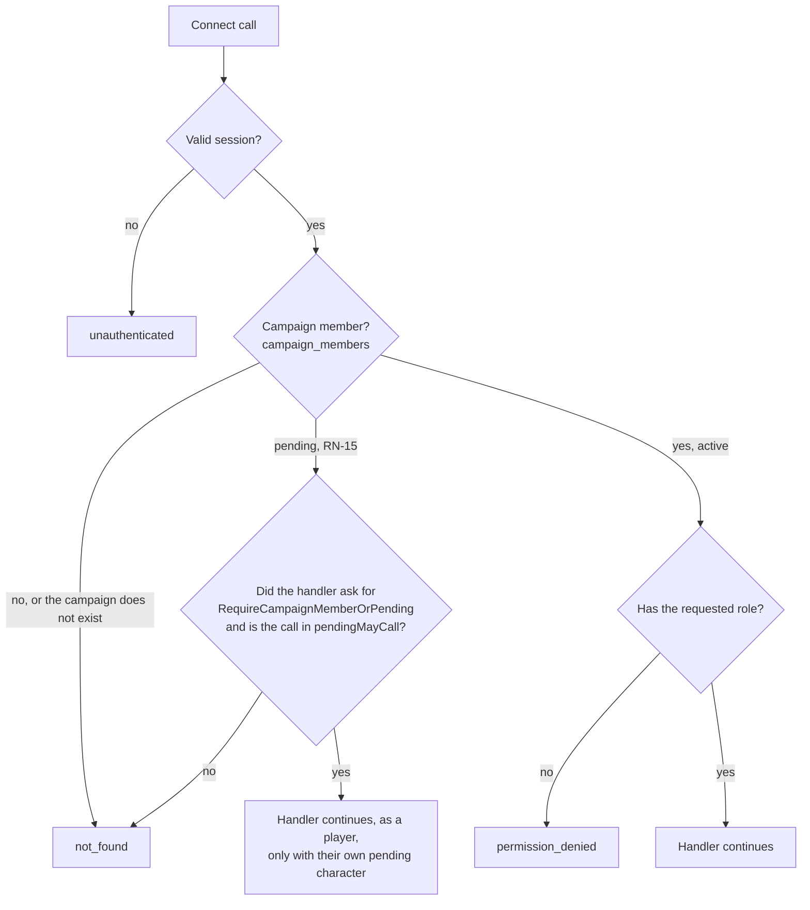

A non-member gets `not_found` both for a campaign that exists and for an invented one, with the same message. So nobody learns which campaigns exist. A test calls every `CampaignService` method as master, player, non-member, anonymous and pending member (`TestAuthorizationMatrix`), and fails if a new method appears without a row in the table; `CampaignDocumentService` has its own (`TestCampaignDocumentAuthorizationMatrix`).

### Pending member

The pending member is someone who accepted an invite with approval (RN-15, MR-024) and waits for the master to approve the character they created. They are not a member: `campaign_members.status = 'pending'`, and `RequireCampaignMember` and `RequireCampaignRole` answer them exactly as they answer someone not in the campaign (`not_found`, the same message). So every existing call, and every new one, leaves them out without anyone having to remember them.

A pending member who never creates the character is deleted automatically 30 days after joining (database TTL on `campaign_members.pending_expires_at`, see [Data model](data.md#tables-by-module)); the master sees and removes them earlier with `ListPendingMembers` and `RemovePendingMember`. The 30-day deadline binds as soon as it passes, not when the job runs: the membership reads (`GetMembership`, the master's list) ignore a pending member past it, `ClearPendingExpiry` leaves its deadline alone, and an invite accepted by that person deletes the stale row before the new one is inserted. If they accept an ordinary invite (no approval) to the same campaign, `AcceptInvite` promotes them in the same transaction: it spends a use, activates the membership and approves their character, if any, through the `campaigns.Characters` interface, which `characters` implements (`cmd/api` connects the two with `SetCharacters`, because the two modules need each other and neither imports the other).

There is a single exception, written in `authz` (`backend/internal/authz/pending.go`), not scattered across handlers: while waiting, they work on their own character. To pass, two locks must open:

1. The handler asks, calling `authz.RequireCampaignMemberOrPending` instead of `RequireCampaignMember`.
2. The call is in `pendingMayCall`, the closed list of what the pending member may call. If a handler outside the list asks anyway, the pending member still gets `not_found`, and the programming error goes to the log.

| Call in `pendingMayCall` | What for | What the handler limits |
| --- | --- | --- |
| `CampaignService.GetCampaign` | See the campaign name while waiting | Only `id`, `name`, `my_role` (player) and `awaiting_approval` |
| `CharacterService.CreateCharacter` | Create the single character, born pending | Only a player character, and only one (RN-03: the pending one counts as alive) |
| `CharacterService.GetCharacter`, `ListCharacters` | Read their own character | Only their own pending character |
| `CharacterService.UpdateCharacter`, `UpdateCharacterStory` | Edit the sheet and the backstory | Only their own pending character |
| `CampaignService.GetTableRules` | Read the ways of making ability scores the table allows (RN-24) | Read only; the same as a player reads |
| `CharacterService.GetAbilityRolls`, `RollAbilityScores` | Make the sheet's ability scores with the 4d6 the server stores (RN-24); the pending member only creates the sheet the way the table allows | Players only (the master gets `permission_denied`); the rolls are theirs |
| `ContentService.ListContent` | The catalogue the character editor offers | — |
| `ContentService.GetSpellDetails` | A spell's details, for the editor's spell list | — |

Inside these calls the pending member is treated as a player (`authz` returns `RolePlayer` and `Membership.Pending`), and `characters` only shows them their own `pending` characters (`canSee`, in `access.go`). `ListMyCampaigns` needs no exception: it only asks for sign-in, and lists the person's own memberships, pending ones included. Changing the list means changing RN-15: it needs the decision, rows in the authorization matrices (`campaigns`' and `characters`' `TestAuthorizationMatrix` have a column for the pending member) and the `TestPendingMayCallIsTheAgreedList` test.

The pending member stops existing in one of two ways, always by the master and always in the same transaction that decides the character (see [Characters module](#approving-or-refusing-the-character)): approval makes them an active member (player), refusal deletes the membership.

### Invites

The invite is a link `https://<app>/invite#t=<token>`. The token is 32 random bytes and only the server generates it; the database stores only its SHA-256 (`campaign_invites.token_hash`), and the server returns the token once, in the `CreateInvite` response.

- **The token goes in the fragment (`#t=`),** which the browser never sends to the server, so it appears in no log or `Referer`. The app reads the fragment and sends the token in the `AcceptInvite` body, never in the URL (ADR-0009).
- **Default (RN-07):** valid for one person and 7 days. The master may choose 1 to 20 uses and 5 minutes to 30 days, and may revoke the invite at any time. Whoever already joined stays in the campaign.
- **Accepting requires sign-in** (OIDC today). When the player sign-in without Google arrives (RN-17, ADR-0009), it creates the account and session, and the same accept-invite rule runs afterwards.
- **Invite with approval (RN-15, MR-024):** the master chooses, per invite, whether it requires approval (`CreateInviteRequest.requires_approval`, "Exigir aprovação do mestre" on the screen; the default is not to require, and the invite works as before). Whoever accepts an invite with approval becomes a [pending member](#pending-member), spends one use of the invite, and the app takes them straight to create the character, which is born pending. The master approves or refuses that character (see [Characters module](#approving-or-refusing-the-character)); once refused, the player needs a new invite.
- **Accepting again changes nothing:** a member gets the campaign back with `already_member`, and no use of the invite is spent. This holds for the pending member, with any invite of the campaign: they remain pending.
- **Two players competing for the last use do not both get in.** Everything happens in one transaction (`db.InTx`), with the invite row locked (`SELECT ... FOR UPDATE`); the `UPDATE` repeats the rules, and a database `CHECK` prevents `use_count` above `max_uses`. `TestAcceptInviteRaceForTheLastUse` puts ten people at once on CockroachDB.
- **An unusable invite** answers `failed_precondition`, with the `InviteUnusable` detail giving the reason: expired, revoked or already used. The app shows a clear message for each. "Already used" doubles as a warning that the link may have leaked.

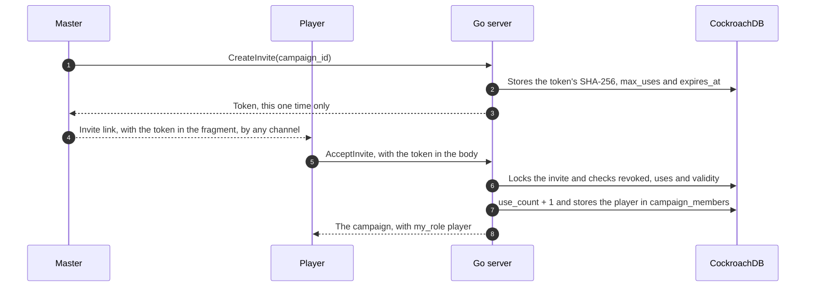

### Accepting an invite through sign-in

Whoever opens the invite link without being signed in signs in and accepts the invite in one step, and nothing is kept in the browser: no `localStorage`, no `sessionStorage`, no service worker (ADR-0009). The token goes in the sign-in form body, and the server keeps only its hash, inside the login state, which is already single-use and lasts at most 10 minutes.

1. The `/invite#t=<token>` screen reads the token from the fragment and submits a `POST /auth/login` form (`application/x-www-form-urlencoded`, same origin) with `return_to`, `intent=campaign_invite` and `intent_payload=<token>`.
2. `identity` checks the attempt limit and the `return_to`, and asks `campaigns` to prepare the intent. `campaigns` checks the token's format and returns its SHA-256. `identity` stores the hash, with the intent type, in `oidc_login_states`, and continues the sign-in as usual.
3. At the callback, after creating the session, `identity` asks `campaigns` to complete the intent. `campaigns` accepts the invite by the hash, in the same transaction as `AcceptInvite` (`db.InTx`, with the invite row locked).
4. The browser goes to `/campaigns/<campaign_id>`, including for someone who was already a member. Whoever just became a pending member, through an invite with approval (RN-15), goes to `/campaigns/<campaign_id>/characters/new`, to create the character. If the invite is unusable, it goes to `/invite/error?reason=<code>`. The sign-in counts all the same: the session stays, and only the destination changes.

| `reason` | When |
| --- | --- |
| `expired` | The invite passed its validity. |
| `revoked` | The master revoked the invite. |
| `used_up` | The uses ran out, perhaps with someone who got the link. |
| `not_found` | No invite has this token, or the campaign was deleted. |
| `invalid` | What was stored in the login is not a token hash. Only a bug causes this. |
| `unavailable` | The database did not respond. Opening the link again may work. |

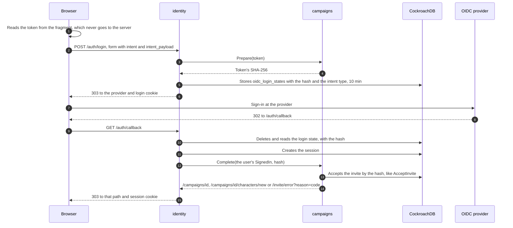

Rules that hold for any intent, not only the invite's:

- **`identity` does not know `campaigns`.** It has a registry of intents by name (`identity.Config.Intents`), filled in `cmd/api/main.go`. Each intent implements `identity.IntentHandler`: `Prepare(payload)` at the start of sign-in, which returns what to store (at most 256 bytes, and never a secret as received), and `Complete(ctx, who, data)` after the session is created, which returns where to go.
- **`Complete` only acts for whoever just signed in.** The user arrives as `identity.SignedIn`, a capability: the field is private and there is no constructor, so only the `identity` callback fills one, right after creating that person's session. Outside `identity` one can only write `identity.SignedIn{}`, which has no user, and the invite's `Complete` refuses that value before touching the database. For the same reason `ContextWithSession` was removed: no exported function acts as an arbitrary user.
- **Nothing secret in a URL.** `GET /auth/login` refuses `intent` and `intent_payload` with 400, and `POST` refuses a query string. `return_to` loses the fragment, so not even a `#t=...` pasted by mistake is stored.
- **CSRF:** `POST /auth/login` goes through `http.CrossOriginProtection`, so a form from another site gets 403. Without it any page could make someone's browser join a campaign chosen by an attacker.
- **Bad input stops before the provider:** an unknown intent type, `intent_payload` without `intent`, a malformed token or one over 1,024 characters answer 400; a body over 8 KiB, 413; another `Content-Type`, 415. Nothing is stored.
- **The destination goes through the same check as `return_to`.** A path that is not on this site is replaced by `return_to`.
- **Logs:** record only the reason and the intent type, never the token, the hash or a client-sent value. `TestIntentLogsHaveNoSecrets` and the `signin_test.go` tests check it.

### Responses and GET

Every `CampaignService` and `CampaignDocumentService` response, errors included, goes out with `Cache-Control: no-store`. Only `ListMyCampaigns` accepts GET (`NO_SIDE_EFFECTS`), because its request is empty. The other reads (`GetCampaign`, `ListMembers`, `ListInvites`, `GetCampaignDocument`) carry the campaign ID, and in a GET the whole message goes in the URL, which ends up in the platform logs (see [Privacy](privacy.md)). So they are `IDEMPOTENT` and POST-only, even with no side effect (rule 7 of the [API contracts](#api-contracts-protobuf)).

### Campaign dice

How players roll dice is a campaign setting plus a preference per member (RN-18, MR-013, MR-014). `Campaign` carries `dice_mode`; `GetCampaign` also carries `my_dice_preference`, the caller's own, which is what the campaign page needs (the lists do not read the column, so it comes empty there). `ListMembers` puts `dice_preference` on each `Member` only when the caller is the master, because the master lists each player's choice in the "Dados" panel; for a player the field comes empty. It is one more field, not a new call, because the panel already lists the members. `SetCampaignDiceMode` and `SetMyDicePreference` return the saved value; repeating the same value is not an error, and an unspecified value is `invalid_argument`.

The calculation "where does this player roll?" is `campaigns.EffectiveDiceMode(mode, preference)`, a pure function: with `app` or `physical` on the campaign, the mode wins and the preference does not matter; with `players_choose`, the preference wins. `Service.PlayerDiceMode(ctx, campaignID, userID)` does both reads and applies the function. The `play` module does not import `campaigns`: it declares a small interface and `cmd/api` hands it the service, as is already done with `ActiveCampaigns`. NPCs do not go through here: they always roll in the app.

#### The platform/dice package

`backend/internal/platform/dice` is plain Go, with no new dependency, and is where rolling happens (the `rules` module stays free of randomness, ADR-0008). `Parse` reads `d20`, `1d20+6`, `2d6 + 2`, `1d4 - 1` and refuses the rest, with limits of 1 to 100 dice, sides in 4, 6, 8, 10, 12, 20 or 100, and a modifier from −100 to +100. `Roll(roller, expr)` returns a `Result` (the expression, the faces, the modifier and the total). `Roller` is an interface: `Crypto` uses `crypto/rand` (`rand.Int` draws without bias), and `Fixed` returns a sequence of faces in tests. `Physical(expr, sum)` checks the typed sum, which must lie between `N` and `N×sides`, and adds the modifier; the result has no faces, because nobody typed them.

### Table rules (MR-025, RN-24)

The choices on the "Regras da mesa" page belong to `campaigns` (file `tablerules.go`; table `campaign_table_rules`, see [Data](data.md)) and apply to the whole campaign. Three `CampaignService` calls:

| Call | Who | What it does |
| --- | --- | --- |
| `GetTableRules` | Every active member and the pending member (RN-15; non-member: `not_found`) | The rules, the style they form, the three preset styles and the numbers of the ability-score methods (the standard array, the cost of each point-buy value, the 27 points and the typing range, from SRD 5.2.1), so the app does no arithmetic. With no row, the defaults. `IDEMPOTENT`. |
| `SetTableRules` | The master | Replaces **all** the rules at once (the page has a single "Salvar regras"): each field is stored as sent, and the dice mode (`campaigns.dice_mode`, RN-18) goes in the same transaction. They apply from now on: existing sheets stay as they are. |
| `SetCampaignXpMode` | The master | Changes the XP mode after the campaign is created (RN-09). See below. |

- **Fields and defaults** (the default is what the app did): level HP `player_chooses`; the four ability-score methods on (at least one: `invalid_argument` if none); critical hit `doubled_dice`; death saves `visible_to_all`; combat with a map; fog off on new maps; up to 20 house rules of 1 to 200 characters, one line, text the app displays only. **The critical hit and the death saves are applied by combat** (see [Table rules in combat](#table-rules-in-combat)).
- **The table style is not stored.** `StyleOf(dice mode, combat with map, fog on new maps)` returns `TUDO_NO_APP` (app, with map, fog), `MESA_FISICA` (physical, no map, no fog), `TEATRO_DA_MENTE` (each chooses, no map, no fog) or `PERSONALIZADO` when the three values match none. The three styles come in the `GetTableRules` response (`presets`), for the screen to fill the fields without repeating the calculation; a style only fills these three, and the rest stays as the master marked.
- **Who reads what.** `characters` reads everything through `ContentSource` (see [Characters module](#characters-module-characters-and-sheets)): the level HP and the ability-score methods. `maps` reads `FogOnNewMaps` when creating a map (fog is made of grid squares, and a new map has no grid: the map carries the `fog_on_first_grid` mark, and fog turns on with the first grid, in `SetMapGrid`, with the image copied if another use shares it, RN-10), through `maps.MapDefaults` (a one-method interface that `campaigns.Service` implements; `Config.Defaults` is optional and empty means no fog). `play` reads "combat with a map" (RN-25), the critical hit and the death saves through `play.CombatDefaults` (`Config.Defaults`, optional: empty means the SRD defaults and every combat with no map mode), which `campaigns.Service` implements (`CombatWithoutMap` and `StoredTableRules(ctx, tx, campaign)`, in the writer's transaction). The critical hit and death saves do **not** go through `ContentSource`: they are combat rules, not sheet content.
- **The XP mode after the campaign is created.** `SetCampaignXpMode` changes `campaigns.xp_mode` and stores the time (`xp_mode_changed_at`, which a call that changes nothing returns). The mode also decides "Pode subir de nível" (RN-12): changing it moves the pending level-up notices (by XP, XP reaching the level; by milestones, the mark), writing nothing to the sheets. If XP was already given (an award that was not undone, a milestone added), it refuses with `failed_precondition` and the `XpModeChangeBlocked` detail (`awards` and `total_xp`: the text of the "Já houve XP dado nesta campanha" screen) until the master sends `confirm`; with no XP given, or for the mode the campaign already has, it changes without asking. **Nothing is converted**: the XP already given and the history stay as they are, and the new mode applies from here on (RN-09: the modes only decide which awards fit the campaign). The number of awards and XP comes from `progression` through the `campaigns.XPAwards` interface (`AwardedXP`, implemented by `progression.Service`, connected by `SetXPAwards` in `cmd/api`), read in the transaction that changes the mode, with the campaign row locked. Going back to the previous mode asks the same way. **An award and the mode change take turns:** `give` and the planned-milestone writes reread the mode inside their own transaction (`CampaignXPMode(ctx, tx, ...)`), and under serializable isolation one of the two retries (`TestRN09_AnAwardAndAChangeOfTheXPModeTakeTurns`).
- **Who rolls dice.** `CampaignDiceMode` also answers for a pending member (RN-15): they create the character and roll the ability scores by the campaign's rule.

Tests (`campaigns`): `TestRN24_TableRulesRoundTrip`, `TestRN24_TheStyleIsWorkedOutNotStored`, `TestRN24_OnlyTheMasterWritesTheRules`, `TestRN24_TheRulesRefuseWhatBreaksTheLimits`, `TestTableRulesParamsRefuseWhatBreaksTheLimits`, `TestStyleOf`, `TestRN09_TheXPModeChangesAfterCreation` and the `TestAuthorizationMatrix` matrix; in `progression`, `TestRN09_ChangingTheXPModeAsksOnceXPWasAwarded` and `TestRN09_AnUndoneAwardDoesNotCount`; in `maps`, `TestRN24_NewMapsStartWithTheFogTheTableChose`.

### Display name

Members appear by display name, which each person types in the app (`IdentityService.UpdateProfile`, 1 to 40 characters). It never comes from the sign-in provider. `campaigns` asks `identity` for the names through an interface (`Profiles`, which `identity.PostgresStore` implements), without reading the `users` table, as the module rule demands.

### Campaign document

Each campaign has a document: Markdown text that only the master reads and writes (MR-018), with game preparation, gallery images and links to maps and sheets. "Master only" is a decision, because the document holds spoilers; if players ever read the document, or parts of it, the authorization and this section change. The code lives in `backend/internal/campaigns/document.go`; the contract, in `proto/meurpg/campaigns/v1/campaign_document.proto`; the table, in [Data model](data.md#tables-by-module).

| `CampaignDocumentService` call | Master | Player | Non-member | Anonymous | Pending member (RN-15) |
| --- | --- | --- | --- | --- | --- |
| `GetCampaignDocument`, `UpdateCampaignDocument` | Yes | `permission_denied` | `not_found` | `unauthenticated` | `not_found` |

- **One document per campaign.** The row in `campaign_documents` is born on the first save. Before that the document is empty, at revision 0. Deleting the campaign deletes the document; deleting the account of whoever edited last does not: the document belongs to the campaign.
- **Revision, as on the sheet.** The app sends the revision it read (`expected_revision`), and the server only saves if it is still the stored one, in one statement: `INSERT ... ON CONFLICT DO NOTHING` on the first save, `UPDATE ... WHERE revision = <the one read>` on the others. If someone saved first (another tab, or another master when RN-13 arrives), the answer is `aborted` and nothing changes; the screen warns and keeps the draft. The same save repeated (the same text, by the same person, one revision up) returns the saved document, not `aborted`: it is a lost response, or a double click.
- **The text.** Up to 200 KiB: 204,800 bytes of UTF-8, counted in bytes, as the database stores it (a `CHECK` repeats the limit). Line breaks and tabs are allowed, and `\r\n` becomes `\n`. Other control characters, and the invisible ones that change text direction, are refused with `invalid_argument`, which names the field and never repeats the text. Nothing else changes: spaces at the ends stay, because in Markdown they count, and the editor gets back exactly what it saved.
- **Who edited.** The response carries `updated_at` and the display name of whoever saved last (`updated_by_display_name`), for "Editado por Samuel ontem às 22:10". `campaigns` asks `identity` for the name through the `Profiles` interface.

Besides ordinary Markdown (headings, paragraphs, bold, italic, lists), the app understands three links of its own:

| In the text | On the screen |
| --- | --- |
| `[text](map:<map id>)` | A link that opens the map in a window, without leaving the document |
| `[text](character:<character id>)` | A link that opens the sheet in a window |
| `` | The image; the text in brackets is the alt text and the caption |

The IDs are UUIDs, which the editor's pickers ("Imagem da galeria", "Link para mapa", "Link para ficha") write: the master never types an ID, and reading never shows one. The server stores the IDs as text and checks nothing. A link to something deleted, or from another campaign, appears as unavailable ("mapa apagado", "ficha apagada", "imagem apagada"). Images only come from the gallery: the app does not load an image from an external URL written in the text, and the CSP (`img-src 'self'`) would not allow it either (see [Privacy](privacy.md)).

**Why the server does not render the document.** The server stores the text and does not interpret it. The app turns the Markdown into a token tree and draws each token with Angular, never with `innerHTML`, so no document text becomes HTML or script on the page. And each link is resolved by the usual calls and routes (the `maps` module, `characters` and `/images/<id>`), with each one's authorization: an ID written in the text grants access to nothing. So the document does not need to repeat the authorization of what it cites, and a link never shows someone what that person may not see, even if the "master only" rule changes.

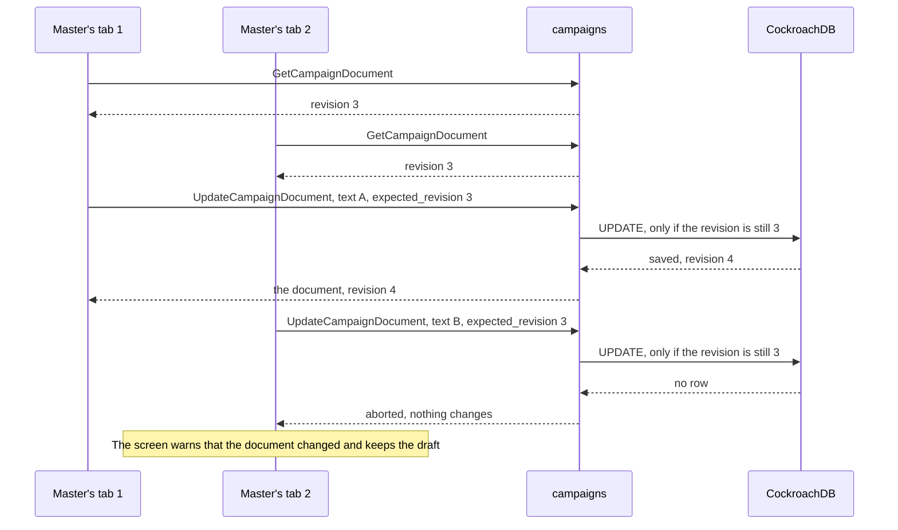

## Rules module: rules as data

`rules` computes the sheet: it receives the player's choices (the `Build`) and returns the sheet's numbers (the `Derived`), from the SRD 5.1 content embedded in the binary (ADR-0008). It uses no database, network, clock or randomness: the same sheet and the same content always give the same result. The code lives in `backend/internal/rules`.

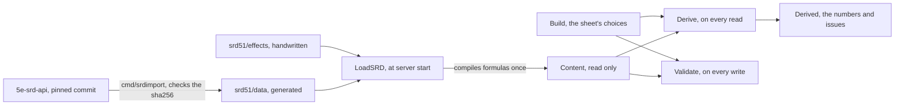

| Function | When it runs | What it does |
| --- | --- | --- |
| `LoadSRD()` | Once, at start | Reads the snapshot and the effects, checks the schema and compiles every formula. An error here is a bug in the embedded content, and the server does not start. |
| `Validate(build, content)` | On every sheet write | Refuses what makes no sense: ability score outside 1 to 30, total level above 20, a key that does not exist, a subrace of another race, lists too large. Returns the field, with the proto names, without repeating the value. |
| `Derive(build, content)` | On every sheet read | Computes the sheet. Never fails: an unknown key, a choice outside the rules or a formula that breaks becomes an `Issue`, and the rest is computed ("the app is an assistant, not a judge"). |
| `Content.Catalog()`, `NamePT()`, `Summary()` | In the edit screens and lists | What the editor offers, with Portuguese names; the name of a key; "Mago 3" for a list row. |
| `Content.NextLevelXP(level)`, `LevelForXP(xp)`, `XPForChallenge(cr)`, `SplitXP(total, n)` | In XP and on the sheet | The experience arithmetic (RN-09, RN-12): the XP of the next level (false at 20), the level of an XP value, the XP of a challenge rating ("1/4", "5"...) and each one's share of a split, rounded down. Tables in `effects/advancement.json`, checked on load (20 ascending levels; the 34 challenge ratings in order). `Derived.NextLevelXP` and `Content.Catalog().ChallengeRatings` (which `ListContent` returns for the NPC's CR picker) come from them. |
| `SceneOptions(derived, actions)` | In the RP scene (MR-015) | For each check the master put in the scene (`skill:investigation`, `ability:str`, `save:wis`, with optional name and DC), the character's bonus, the Portuguese name ("Teste de Força", "Teste de resistência de Sabedoria") and the passive Perception, Investigation and Insight. The types are closed: nothing from combat enters a scene, and an unknown key returns a `*SceneError`, never a panic. |

**What `Derive` computes**, for the 12 SRD classes and 9 races, from level 1 to 20:

- ability scores with race, subrace and manual bonuses, and the modifiers;
- proficiency bonus, the 6 saving throws (from the first class), the 18 skills (none, half, proficient or expertise), the 3 passives and initiative;
- AC with armor, shield and unarmored defenses, with a description of how it got there; maximum HP (fixed or rolled) and hit dice; speed and senses;
- spellcasting per class (DC, attack, cantrips, spells known or prepared), spell slots (with the multiclass table) and the warlock's pact magic;
- attacks with the sheet's weapons and with damage cantrips;
- features and traits up to the character's level, with the SRD text in English, the `hints` and the `issues`;
- resources with uses (`Resources`: Second Wind, Ki, Rage, with the maximum at the level and when they return) and actions (`Actions`, those a feature grants, with the action they spend and the resource they consume; `StandardActions`, the ten everyone has);
- each attack's damage also as numbers (`DamageDice`, `VersatileDice`: count, faces and bonus), besides the text "1d8+3".

**What it does not compute:** active spells such as Mage Armor and Shield, current HP, spent slots and resources in use (they belong to the game session; `combat`, below, only does arithmetic on what the session stores). The handwritten effects cover levels 1 to 5; above that, a feature without an effect appears only as text, and the master resolves it.

### Effects and versions

The SRD describes features in prose. What the engine needs to know lives in handwritten `effects/*.json`, in a closed set of types:

| Type | Example |
| --- | --- |
| `modifier` | Unarmored Defense: `ac.base`, the highest of the options, `10 + mod("dex") + mod("con")`, only with `armor() == "none"` |
| `proficiency` | Jack of All Trades: half proficiency on every skill and on initiative |
| `roll_mode` | Gnome Cunning: advantage on INT, WIS and CHA saves against magic (becomes a hint) |
| `sense` | Darkvision, 18 m (60 ft) |
| `spellcasting` | Wizard: INT, prepares from the spellbook, `max(1, mod("int") + classLevel("wizard"))` prepared |
| `resource`, `grant_action` | Rage, Second Wind: become `Derived.Resources` and `Derived.Actions`, which `combat` reads (see [Combat](#combat)) |
| `extra_attack` | Extra Attack: how many attacks the Attack action makes (`Derived.AttacksPerAction`) |
| `wild_shape` | The druid's Wild Shape: the maximum CR and whether it excludes flying and swimming (`max_cr`, `no_fly`, `no_swim`), at the three levels (2, 4 and 8); see [Creatures, summons and Wild Shape](#creatures-summons-and-wild-shape-rules) |
| `choice`, `note`, `handler` | Player choices, what appears only as text, and a registered Go function (SRD only: table content never uses `handler`) |

An effect with `tags` (like `against:magic`) is never applied by itself: it becomes a hint on the sheet, and the master decides. The content version, `srd51@<commit>+fx.<n>` (with `+mesa.<revision>` when the campaign has its own content, see [Table content](#table-content-contentwith)), appears on the sheet. Changing a file in `effects/` requires a new revision; a test checks it. A new snapshot or revision can change the numbers of a locked sheet, and `content_version` shows which content they were computed with. The step-by-step to change an effect or a name is in [CONTRIBUTING.md](../CONTRIBUTING.md#rules-content-srd).

### Magic items

The 362 SRD 5.1 magic items (MR-044) enter `rules` as data, without effects: `cmd/srdimport` reads `5e-SRD-Magic-Items.json` (the same commit, the sha256 in `inputHashes`) and writes `srd51/data/magic-items.json` (`srd51.MagicItem`: key `item:<index>`, SRD name, category, rarity, attunement and by whom, variants and the English text). Loading checks the format, and the Portuguese names are `item:<index>` in `effects/names_pt.json`, one per item and variant. The gold values (SRD 5.2.1 table) are not here: they belong to the treasure generator (MR-044; see [Treasure generator](#treasure-generator-mr-044)).

**Families and variants.** The SRD lists "Armor +1, +2 or +3" once, as a family, and again as three variants. Each is a real item with its own key: the family holds `Variants` (the keys, in SRD order) and each variant holds `VariantOf` and its own rarity (Armor +1 rare, +2 very rare, +3 legendary; Weapon and Ammunition +1 uncommon, +2 rare, +3 very rare). There are 21 families. Eleven have the rarity `varies`, because the variants differ: ammunition, armor and weapon +1/+2/+3, Belt and Potion of giant strength, Figurine of wondrous power, Horn of Valhalla, Ioun stone, Potion of healing, Spell scroll and Wand of the war mage. The other ten (Bag of tricks, Carpet of flying, Potion of resistance...) have their own rarity, and the variants say theirs. The Crystal ball is the special case: the SRD calls it "very rare or legendary" and says the common one is "a very rare item", while the three variants are legendary. It is a family that is also an item (`Standalone`, a fixed list in the importer): it is drawn as the common Crystal ball among the very rare, and the variants among the legendary.

**Attunement.** `Attunement` holds when the SRD header says "(requires attunement)", and `AttunementBy` keeps the restriction in English ("by a paladin"), with the Portuguese label in `AttunementByPT` (`attunement:<restriction in lowercase, with hyphens>` in `names_pt.json`; loading refuses a restriction without a label and a label without a restriction). An attunement that applies only to one property stays in the text: Hammer of Thunderbolts does not require attunement as an item, only its Giant's Bane does.

**What gets drawn.** A flat list would overweight the families (the Ring of Resistance is 10 of the 117 rare entries). So `MagicItemUnits(rarity)` returns **units**: each standalone item (the common Crystal ball included) and **one unit per (family, rarity)**, with that rarity's variants in `Options`. Whoever draws picks a unit and, within it, an option: the Ring of Resistance is a rare unit with 10 options, and the Ioun stone is a unit in each rarity where it appears (4 options among the rare, 7 among the very rare, 3 among the legendary). There are 266 units, of the 362 entries; a family is never a unit in a rarity its variants do not have, except the Crystal ball.

| Function (`rules.Content`) | What it does |
| --- | --- |
| `MagicItems()` | All 362 entries (families and variants), sorted by Portuguese name, as `MagicItemEntry`. Copies. |
| `MagicItem(key)` | One entry with the SRD text in English. |
| `MagicItemUnits(rarity)` | The units a treasure may contain at that rarity (above), sorted by the key's Portuguese name. Copies. |
| `MagicRarities()` | The six rarities, from most common to artifact. |

**Consumables.** `Consumable` comes from `effects/consumables.json`, handwritten: the potion and scroll categories, and the single-use items (Ammunition +1/+2/+3 and the family, Arrow of slaying, Beads of force, Candle of invocation, the three dusts, Elemental gem, Quaal's feather token, the manuals and tomes that lose their magic once read, Manual of golems, Pigments of wonder, Restorative ointment, Sovereign glue and Universal solvent). Loading refuses a category or item that does not exist, a repeated one and one the category already covers. The SRD 5.2.1 value table halves the consumable, except the Spell scroll, which `SpellScroll` marks (see [Treasure generator](#treasure-generator-mr-044)).

### Creatures, summons and Wild Shape (rules)

The 334 SRD 5.1 creatures (MR-037) enter `rules` like the rest of the content: `cmd/srdimport` reads `5e-SRD-Monsters.json` (the same commit, the sha256 in `inputHashes`) and writes `srd51/data/monsters.json` (`srd51.Monster`: size, type, AC and what gives it, HP and dice, speeds in feet, the six abilities, save and skill bonuses, vulnerabilities, resistances and immunities, condition immunities, senses, CR and XP, traits, actions with the attack bonus, the damage parts, the save DC and the Multiattack routines, reactions and legendary actions). The Portuguese names are `monster:<index>` in `effects/names_pt.json`; the sheets' text stays in English, like the spells'. Three importer readings deserve a warning: when the SRD gives a damage choice (the longsword one- or two-handed), the first option is kept and the text has the rest; the XP of each creature is the one of its challenge rating in the SRD table (the importer does not copy the source's, which has four creatures at half), with 0 kept for a challenge rating 0 creature that has none; and a save that 5e-database leaves only in the text ("Força CD 11 ou cai Derrubado") is read from the action's text.

| Function (`rules.Content`) | What it does |
| --- | --- |
| `ListCreatures(filter)`, `CreatureByKey(key)` | The list (Portuguese or English name without accents, type, size, minimum and maximum CR, no flying, no swimming; sorted by Portuguese name; refuses a CR not in the SRD, a minimum above the maximum and a size that does not exist) and the sheet with Portuguese labels. They feed `ContentService.ListCreatures` and `GetCreature`. |
| `MonsterDerived(key)` | The creature's sheet as `Derived`, which combat already reads: abilities and modifiers, saves and skills (the sheet's bonuses, or the modifier), AC, HP, the walking speed in `SpeedWalkFt` and the others (`SpeedFlyFt`, `SpeedSwimFt`, `SpeedClimbFt`, `SpeedBurrowFt`, `Hover`), senses, passive Perception, the attacks (bonus and the **first** damage part; the full text goes in `Attack.Notes` for the master), Multiattack as `AttacksPerAction` (the largest routine) and the save actions in `SaveActions`, with the DC. No spellcasting. |
| `SummonOptions(spell, level, build)`, `CheckSummon(...)` | What a summoning spell lets you pick with that slot, and the check of a choice (`ErrSummonCreature`, `ErrSummonCount`, `ErrSummonOption`, `ErrSummonCircle`). Casting time, ritual and concentration come from the spell's data. |
| `WildShapeLimitFor(build)`, `WildShapeForms(build)`, `WildShapeAllows(build, beast)` | The beasts the druid may assume now: level 2, CR up to 1/4, no flying or swimming (31 beasts); level 4, up to 1/2, no flying (48); level 8, up to 1 (70). |
| `WildShapeDerived(sheet, beast)` | The druid's sheet in beast form, by the SRD: AC, HP (a separate pool: `HitPointsMax` is the beast's), speeds, Strength, Dexterity and Constitution, attacks and senses of the beast; Intelligence, Wisdom and Charisma, proficiency bonus, features and resources of the character. Skill and save proficiencies stay and gain the beast's, and where both have the same, the larger bonus wins. The character's darkvision only holds if the beast also has it (the larger range wins). No spells: `Spellcasting`, `Spells` and `PactMagic` come out empty. |

**The `summon` effect** (the fifth closed type of `effects/spells.json`, next to `hp_pool`, `hp_threshold`, `zero_hp_target` and `flat_heal`; loading refuses a creature, field, CR or attack mode that does not exist). Three entries: `spell:find-familiar` (the SRD's 15 forms, one creature, 1-hour ritual, **does not attack**; the Pact of the Chain, `feature:pact-of-the-chain`, adds Imp, Pseudodragon, Quasit and Sprite, and makes **every** warlock familiar, of any form, attack only with the reaction), `spell:animate-dead` (Skeleton or Zombie: 1 creature plus 2 per level above 3rd), `spell:conjure-animals` (beasts only; 1 of CR 2, 2 of CR 1, 4 of CR 1/2 or 8 of CR 1/4, times 2 at 5th level, 3 at 7th and 4 at 9th; concentration), and none for Find Steed, which is left for after the MVP. Whoever spends the slot and creates the creatures is `play`; `rules` only says what is allowed.

**In the API.** `ContentService.ListCreatures` (filters, order by Portuguese name, pages of 1 to 400 (the bestiary asks for 400 and receives the 334), 50 by default, opaque `page_token`; the token is valid only for the same filters, size and CR included) and `GetCreature` (the sheet for the screen) are `IDEMPOTENT` and POST-only. Creatures are public rules, the same for every campaign, but only an **active member** asks: the pending member (RN-15) does not need a creature to build the character and gets `not_found`. `ListCreatures` accepts `size` and `min_cr`, and each `CreatureSummary` carries AC and average HP (`armor_class`, `hit_points`), so a bestiary row ("Lobo · Wolf · SRD · CA 13 · PV 11") comes from one call; the Portuguese type and size labels come from `rules` (`type_pt`, `size_pt`). `DerivedSheet` carries the speeds (`speed_fly_ft`, `speed_swim_ft`, `speed_climb_ft`, `speed_burrow_ft`, `hover`), `save_actions` and, on `Attack`, `notes`; `Sense` carries `sense` ("darkvision"...), because the `key` of a creature's sense is the creature. A creature's AC comes from the armor it uses (the azer has 17, with shield), and the note says what it wears and the other values ("15 com Armadura Arcana"). Tests: `TestMonsterDerived`, `TestListCreatures`, `TestSummonOptions`, `TestCheckSummon`, `TestWildShapeForms`, `TestWildShapeDerived` (the `rules` package), `TestListAndGetCreatures` and the row of the two methods in `TestAuthorizationMatrix` (`characters`).

**Multiattack corrections.** A creature's Multiattack count (`Content.MonsterDerived(...).AttacksPerAction`, the same number the character's creatures use on their turn) applies to any basic sheet linked to a creature (`basicDerived`), so a monster's turn options count the attacks of the Attack action (`attacks_per_action`, `attacks_left`), and NPCs made by "Criar NPC" follow the creature's multiattack. The master plays the monsters, so no extra attack is refused to them (the master has the last word, as with every NPC): the attacks are any N of those the sheet holds (up to three). The number comes from SRD 5.1 and not from the snapshot, which gets some wrong (the Veteran did 4, the Shambling Mound 3, the Brown Bear 1): `effects/corrections.json` corrects them (`creature_corrections`, a closed type: known creature and field, `attacks_per_action`), and `TestMultiattackCountsFollowTheSRDText` reads the Multiattack text of the 148 creatures and checks the number the engine uses, with an explicit list of those the text does not let it read (the Chuul, the Grick, the Hydra, the Medusa and the Violet Fungus, each with the reason). Wild Shape also uses this number: the Brown Bear now makes 2 attacks.

### Combat engine and spell details

The `rules/combat` package is the pure part of the fight (MR-012 to MR-014): what the character can do now and the arithmetic of attack, damage, healing, slots and death saves. Like `rules`, it uses no database, network, clock or randomness: dice are rolled outside (on the session server or by the player, RN-18) and enter as numbers, and every function returns a new value instead of changing what it received. The `play` module stores the state and calls these functions; the app writes the results in Portuguese.

| Function | What it does |
| --- | --- |
| `Options(derived, TurnState, Usage)` | The "Sua vez" `TurnOptions`: the economy (action, bonus action, reaction, each with `used` and `available`; movement in feet, doubled after Dash), the attacks, the spells, the standard actions and the features' actions, each option enabled or disabled with a reason code. Computed on every read, never stored. |
| `ResolveAttack(bonus, AC, d20)` | Hit or miss: a natural 20 always hits and is a critical, a natural 1 always misses. |
| `DamageTotal(dice, faces, critical)` | Sums the rolled faces and the bonus. A critical doubles the dice, never the bonus. `DiceToRoll` and `DiceRange` give how many dice to roll and the valid range, to check a total typed with a physical die. |
| `CriticalDice(dice, critical, rule)` | How many dice to roll and what comes without rolling, with the table rule (RN-24): `CriticalDoubledDice` rolls twice the dice; `CriticalMaxPlusRoll` rolls the dice once and adds their maximum (`fixed`, dice × faces) without rolling. The bonus enters once, in both. It is what `play` uses in every critical (combat and traps); `DamageTotal`, `DiceToRoll` and `DiceRange` stay for the SRD arithmetic. |
| `ApplyDamage(hp, temporary, damage)` | Temporary HP go first; floor at 0; says whether it "dropped to 0" and how much of the damage was left over. |
| `ApplyHeal(hp, maximum, heal)` | Heals up to the maximum and says how much it actually healed. |
| `SpendSlot`, `SpendPactSlot`, `SpendResource` | Spend a spell slot, a pact slot or a resource use; `ErrNoSlot` and `ErrNoUses` when none. Return a new `Usage`. |
| `DeathSave(d20, successes, failures)` | 10 or more is a success, less is a failure, natural 1 is two failures, natural 20 returns with 1 HP. Three successes: stable. Three failures: `dying`, which the master confirms (RN-03); the engine never kills by itself. `DamageWhileDown(critical)` gives 1 failure (2 on a critical) for damage to someone at 0. |
| `JumpLimits(derived)`, `HasRunningStart(previous movement)` | The jump (MR-034, RN-21): the reach in distance and height, with and without a running start, in tenths of a foot. Only the sheet arithmetic; the jump line and its cost are in `rules/grid`. |
| `ConcentrationDC(damage)` | `max(10, damage/2)`, the number of the concentration reminder (RN-22). |
| `AttacksLeft`, `MissileDarts`, `SaveSucceeded`, `HalfDamage`, `ShieldACBonus` | How many attacks of the Attack action still fit (Extra Attack), Magic Missile's darts (3, plus one per level above 1st), the save that reaches the DC, half the damage rounded down and Shield's +5. |

**The reasons for a disabled option** are codes, never text; the app maps each to the Portuguese sentence:

| Code | When | Parameters |
| --- | --- | --- |
| `ACTION_USED`, `BONUS_ACTION_USED`, `REACTION_USED` | The action, bonus action or reaction the option needs was already used | — |
| `ATTACKS_USED` | The Attack action made all its attacks (Extra Attack); with a single attack the code is `ACTION_USED` | — |
| `NO_SLOT` | A level 1 or higher spell with no free slot at its level or above (nor pact) | `min_level`: the spell's level |
| `NO_USES` | The feature's resource ran out | `recharge`: when it returns (`short_rest`, `long_rest`...) |
| `REACTION_ONLY_WHEN_HIT` | Shield: only cast when an attack hits the caster | — |
| `REACTION_ONLY` | The other reaction spells (Counterspell, Feather Fall, Hellish Rebuke) | — |
| `CASTING_TIME_TOO_LONG` | Casting time of 1 minute or more | — |

**Spell order.** `Options` returns `spells` already sorted (MR-014): first the ones that can be cast now (`enabled`), then the others; within each group, cantrips first, then by level and by Portuguese name (without accents, case-insensitive; a tie keeps the sheet's order). Shield can never be cast on the character's own turn (`REACTION_ONLY_WHEN_HIT`), so it goes among the others, and the screen shows the reason as "Só fora da sua vez".

The first reason that applies wins: what the spell is, then the economy, then the slots. Each spell also carries the levels it can be cast at (`slots`: from its own level up, only with a free slot, plus the warlock's pact slot, with how many are free for the "last slot" warning). Damage cantrips stay only in `attacks`, not in `spells`. `TurnOptions` is returned by `CombatService.GetTurnOptions`, with the economy (including `attacks_per_action` and `attacks_left`, from Extra Attack).

**Standard actions and resources.** The ten actions everyone has (Attack, Cast a Spell, Dash, Disengage, Dodge, Help, Hide, Ready, Search, Use an Object) live in `effects/standard_actions.json`, handwritten, and follow the effects revision rule. The Portuguese resource names live in `effects/names_pt.json` as `resource:<name>`; without that name, the feature's applies. **Extra Attack** is a closed effect type, `extra_attack` (with `count`: 2 at fighter, barbarian, monk, paladin and ranger level 5), and `Derived.AttacksPerAction` holds the character's largest `count` (1 without it). **Action Surge** is a free action (`grant_action` with `free`) tied to the `action_surge` resource.

**Spell details.** `ListContent` stays light (name, spell level, school, classes, ritual, concentration, casting time). Everything the SRD says about a spell comes from `ContentService.GetSpellDetails(campaign_id, spell_key)`, for the "?" dialog (same access as `ListContent`, pending member included; an unknown key is `not_found`): casting time (quantity and unit, and the reaction trigger when the SRD has one), range (type and distance in feet), components (V, S, M and the material in English), duration (instantaneous, timed, until dispelled, special; and whether it needs concentration), attack, save (ability and what happens on a pass: nothing, half or something else), damage per slot level (and per character level, for cantrips), healing per level and the English text, with "At Higher Levels". The server returns structured data and the SRD's raw text for what does not fit the structure ("4d6 OR 5d6"); writing "60 ft" as "18 m" and "1 action" as "1 ação" is the app's job (`spell-details-format.ts`, which falls back to the raw text, marked, when the value does not map; the editor fetches the spell on opening the "?" and keeps the answer only while the page is open, with no Web Storage). In Go, `SpellDetails.DamageAt(level, level)` and `HealAt(level)` give the rolls already as numbers (`ParseDice`), for the combat code.

### Grid, vision and presets

Two pure packages do the map geometry and the fog of war (MR-034 to MR-036, RN-21), alongside two handwritten content tables. None uses a database, network, clock or randomness (ADR-0008); `maps` stores the layers, `play` asks the cost of a move and `vision` builds the fog on top of `grid`'s line. The browser computes nothing: it draws what the server sends. The movement, range, jump and cover wiring is in [Movement in combat](#movement-in-combat); the layers and the new point kinds are in [Layers, fog and point kinds](#layers-fog-and-point-kinds); each character's fog is in [Fog per player](#fog-per-player).

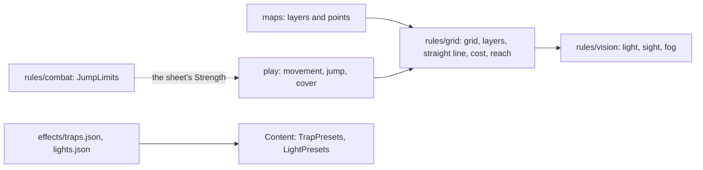

**`rules/grid`.** A map's grid (`Grid`: columns and rows; rows come from the image through `RowsFor`, `round(columns × height / width)` between 1 and 400), the conversion between base points (0 to 10000 of the image's width and height) and squares (`SquareOf`, `CenterOf`, the same arithmetic as `play`) and the **packed layers**, which `maps` stores and the API sends (the browser decodes them, so the format is part of the contract):

| Layer | Type | Bytes |
| --- | --- | --- |
| Wall, difficult terrain | `Layer`: 1 bit per square | `ceil(squares / 8)`. Square `n = row × columns + column` is bit `n % 8` of byte `n / 8`, least significant first. |
| Light | `LightLayer`: 2 bits per square (0 unpainted, 1 dark, 2 dim, 3 bright) | `ceil(squares / 4)`. Square `n` occupies bits `2 × (n % 4)` and the next one of byte `n / 4`. |
| Cover | `CoverLayer`: 2 bits (0 none, 1 half, 2 three-quarters; 3 is never stored) | Same as light. |
| Doors | `DoorLayer`: 4 bits per square (0 none, 1 open, 2 closed, 3 locked, 4 portcullis, 5 secret; 6 to 15 never stored) | `ceil(squares / 2)`. Square `n` is the low nibble of byte `n / 2` when `n` is even and the high one when odd. The leftover nibble of the last byte (odd number of squares) is 0. A value above 5, the wrong size or a leftover nibble are refused on reading (`ErrLayerSize`). |

The leftover bits in the last byte are 0; `Decode…` refuses a wrong size, a leftover bit set and, in cover, the value 3 (`ErrLayerSize`). A wall is total cover; it and the three-quarters square block movement, but only the wall blocks sight and light.

The **straight line between the centres** of two squares (`Line`) is walked with integers, so the result is the same on every machine: the exit square is left out, the arrival square enters, and a line passing exactly through a corner does not enter the two squares next to it. When those two are walls (or a wall and a pillar, in movement), the line is **squeezed** and blocked. On top of the line:

| Function | What it does |
| --- | --- |
| `Terrain.Move(from, to, occupants, mover)` | The cost of a straight move in tenths of a foot: the line's length (exact to the tenth) plus 50 for each square the line enters that is difficult terrain or holds another creature (once, even if both apply). A flier does not pay the map's terrain, only creature space. It blocks by wall, pillar, squeeze and a hostile creature that cannot be passed through (two sizes of difference, `Size`), and by ending on someone's square (except Tiny with Tiny). |
| `Terrain.MoveUntil(…, stop, remaining)` | The move as it actually happens, which stops when the player does not see everything (fog) or there is a trap: it follows the line and stops before the first real obstacle, before the first square the remaining movement (`remaining`, in tenths of a foot) does not pay (`StopMovement`), or at the first square of the `stop` set (the trap's area). The cost is the real one up to there and never exceeds what is left. `Marked` and `MarkedAt` say the trap triggered even when its square is occupied and the character ends a square before (`Reached`). |
| `Terrain.Reach(from, remaining movement, occupants, mover)` | Every square reachable in a straight move, with the cost, in reading order: the circle, shrunk by terrain and cut by walls. It is what the server sends for the browser to draw. |
| `Terrain.Jump(from, to, occupants, mover)` | The cost of a long jump: only the length (passes over difficult terrain and creatures); it does not cross a wall or pillar. |
| `Terrain.CoverBetween(attacker, target, creatures)` | The target's cover: the best among the line's squares, without the two end ones; a wall or a squeeze is total, another creature gives half. |
| `LeavesReach(from, to, reactor, reach)` | Whether a move leaves the reactor's reach (the opportunity attack), including crossing through it, and its last square inside the reach. |
| `RangeSquares`, `RangeFt` | Attack and spell range: the distance between centres **rounded down** in squares, times 5 ft. |
| `Terrain.Validate()`, `NewSight(grid, walls)` | Check the grid is valid and each layer has its size (`ErrBadGrid`): a layer's bytes mean nothing on another grid. Outside input never takes the server down. |
| `Sight.Clear(from, to)` | Whether the line crosses no wall, fast: with a sum of wall areas it skips the stretch of the line whose box has no wall and halves the rest. It is what `vision` uses. |

**`rules/vision`** is the fog-of-war arithmetic: from the `Scene` (the grid, the walls, the map's base light, the painted light and the light sources) `Compile` computes each square's light, the greatest that reaches it, and `Lit.See(viewer)` says what each observer (a square and their senses in feet: darkvision, blindsight, truesight) sees: **unseen**, **bright**, **dim**, **grey** (in the dark, inside darkvision or blindsight) or **wall seen** (a wall that touches a seen square). Light and sight stop at walls, by the same line as movement. An observer always knows their own square. `Lit.Union` joins several (the "Visão do grupo", or a player with more than one creature). `PassivePenalty` gives −5 for dim and grey (lightly obscured, SRD) and 0 for bright. Darkvision, within range, sees dim as bright light and dark as grey; truesight sees both as bright light. `Compile` returns an error for an invalid grid or layers of another grid, and limits a light source's radius to 120 ft (bright and dim, each). Measured (`go test ./internal/rules/vision -run '^$' -bench .`, Apple M1 Pro; Cloud Run, with 1 vCPU, is slower): the sketch's cave (24 × 16, 4 observers, 2 lights) takes about 0.03 ms; 60 × 40 with 6 and 10 lights, about 0.4 ms; 200 × 400 with 6 and 20, about 5 ms in the dark; a 200 × 400 field in daylight with a border and five pillars, about 80 ms; with 1 wall per 1000 squares, about 75 ms; with 1 per 100 (the worst case measured), about 145 ms.

**Presets.** `effects/traps.json` (the SRD's eight sample traps, in our words and with the SRD's numbers, plus the severity table and damage per level) and `effects/lights.json` (the SRD's lights, in feet) are handwritten, checked on load (closed types, conditions and damage types that exist, everything refused if it does not match) and follow the effects revision rule. The Portuguese names are `trap:<key>` and `light:<key>`, in `names_pt.json`. `ContentService.ListTrapPresets` and `ListLightPresets` (`characters/presets.go`) deliver the presets, the severity table and the damage per level to the master's form; they are public rule, `IDEMPOTENT`, for active members only (the pending member gets `not_found`, as in `ListCreatures`). `Content.TrapPresets()`, `TrapSeverities()`, `TrapDamageByLevel()` and `LightPresets()` deliver the content; a trap has the effect parts of the design (an attack, damage that always hits, conditions that always apply and a save, with what happens on failure and pass), the DC to notice and to find, the trigger, the area and the pits' `fall_ft` (a fall of 1d6 per 3 m, `FallDice`, and whoever falls ends Prone). `find_dc_ours` marks the DC to find that is not the SRD's (it only gives the DC to notice): `TrapPreset.FindDCIsOurs`. `TrapPresets()` and `TrapPreset()` return deep copies. The flashlight lantern (a cone) is left out: the app only lights circles.

### Level-up (MR-040)

Three pure functions, in `levelup.go`, say what a level gives and what a locked sheet may change on level-up (RN-01, RN-12). Like the rest of the package, they use no database, clock or randomness: the hit die is rolled outside and enters as a number.

| Function | What it does |
| --- | --- |
| `LevelUpOptions(before, classKey, c)` | What the next level of that class gives, as data the screen draws: whether it has an Ability Score Improvement, the hit die and the average, how many new cantrips and spells (and from which list, up to which level), the new maximum of prepared spells, the subclass, the options of the level's features, the skills and expertise, and what changes by itself (slots, proficiency bonus, the new features, by name). Computed by the `Derive` of the before and after sheets, without choices. |
| `ApplyLevelUp(before, choices, c)` | The `Build` the choices make: the class with one more level and the choices added. HP follow the sheet's method: the average on a fixed-HP sheet writes nothing; a die on a fixed-HP sheet becomes "rolled", with the average in the earlier levels; on a rolled-dice sheet, the average enters as a roll. It judges nothing. |
| `CheckLevelUp(before, after, c)` | Refuses everything the level does not give. The only differences accepted: one of the character's classes with one more level; the ability score improvement, only at a level that has one (+2 on one or +1 on two, none above 20); the new HP entry (1 up to the die) with earlier levels equal; exactly the cantrips and spells known or in the spellbook that the table gives (two per level for the Wizard), and new prepared spells, none removed; the subclass at its level; and exactly the options, skills and expertise the level's features give. Everything else (name, race, background, base scores, armor, shield, weapons, the other classes) is `locked_field`. At the end, the new sheet may not have an `Issue` the old one lacked (a spell outside the class list or above the level, too many prepared): it becomes `sheet_issue`. |

Each refusal is a `*LevelUpError` with the field (`full.cantrip_keys`, with the proto field names) and a stable reason code (`class`, `max_level`, `locked_field`, `ability_not_due`, `ability_shape`, `ability_above_20`, `hit_points`, `subclass`, `cantrips`, `spells`, `prepared`, `feature_choice`, `skills`, `expertise`, `sheet_issue`), which the screen translates to Portuguese; the message is never read. What the options say, and what the check demands, come from the same numbers (`levelUpOptionsWith`): what the chosen subclass adds (the Lore College's three skills, the Circle of the Land's cantrip, its features' options) is in each candidate subclass's part (`LevelUpSubclass`), because the level does not have a subclass yet. The Warlock's new invocations come from the `invocations_known` column of the class table (levels 2, 5, 7, 9, 12, 15 and 18, as in the SRD table; the 5e-database snapshot gets levels 4 and 6 wrong, and the fix is in `effects/corrections.json`), and the Bard's Magical Secrets (levels 10, 14 and 18) let two of the new spells come from any class's list (`AnyClassSpells`; `Derive` also stops flagging those spells as off-list). **What is deliberately not covered, and the master adds through the editor** (`MasterAdds` lists the level's): the Warlock's Mystic Arcanum (11, 13, 15 and 17), the Wizard's Spell Mastery and Signature Spells (18 and 20), the Lore College's Additional Magical Secrets (6) and the Ranger's favored enemies and terrains; own multiclass and subclass; and **swapping a known spell for another**, which the SRD allows Bard, Ranger, Sorcerer and Warlock at level-up (level-up only adds, never removes). A repeated key in any list is refused. `TestLevelUpSweep` levels the 12 classes from 1 to 20, with each SRD subclass, doing exactly what the options ask, and checks that the check, `Validate` and `Derive` accept each step with no `Issue` (`TestLevelUpSweepTable` does the same with table classes; see [Table content](#table-content-contentwith)). Tests: `TestLevelUpPensantus` (Wizard 3 to 4, the golden numbers: Int 18 to 20, HP 23 to 30, or 34 with Constitution, DC 14 to 15, prepared 7 to 9, cantrips 3 to 4, spellbook 10 to 12, 2nd-level slots 2 to 3), `TestLevelUpToren` (Fighter 3 to 4 with an increase, and 4 to 5 with nothing to choose), the Cleric (prepares without a spellbook), the Sorcerer (spells known and metamagic), the subclass, rolled HP and `TestLevelUpRefusals`, one line per refusal.

### Table content (`Content.With`)

The content the master registers enters the engine as a layer over the SRD (MR-025, RN-23, ADR-0018): `(*Content).With(Overlay)` returns **a new `*Content`**, the SRD plus the table's entries, and never changes what it received. `rules` stays pure (no database, network, clock or randomness); who stores the entries is `characters` (see [Live table content](#live-table-content)) and the editors are in the web app. The code is in `rules/overlay*.go`.

| Piece | What it does |
| --- | --- |
| `Overlay` | The revision and the entries of the six kinds: `TableClass`, `TableSubclass`, `TableRace`, `TableSubrace`, `TableBackground` and `TableSpell`. Each starts with a `TableEntry` (the key, the Portuguese name and `Archived`) and carries the features (`TableFeature`: key, name, text and `Effects`). The fields follow what the editors fill in, so the protos map one to one. |
| Keys | Every table key is `<kind>:<name>@mesa`, the name 1 to 60 characters of `[a-z0-9-]`; a feature's is `feature:`, `trait:` or `background-feature:`. `With` refuses a key without `@mesa`, of another kind, malformed or that already exists (including another entry's or feature's). Since the prefix is the SRD's, every place that decides by prefix (`feature:`, `trait:`, `class:`, `subclass:`, `spell:`) holds for table keys. A class or subclass feature's key arrives ready (the server creates them). **Reserved words:** `With` refuses (`reserved_key`) a key, of an entry or a feature, with `magical-secrets`, `wild-shape` or `ability-score-improvement` in the name, or that ends in `-spellcasting`, because the engine, `play` and the web app react to those words in SRD keys (the Bard's Magical Secrets, Wild Shape, the ability score improvement). The keys the engine writes carry the kind (`feature:class-<name>-spellcasting@mesa`, `feature:subclass-<name>-spellcasting@mesa`, `feature:class-<name>-ability-score-improvement-<n>@mesa`), so a class and a subclass of the same name never generate the same key. |
| Copy-on-write | The SRD is a singleton that many requests read at once. `With` copies (shallowly) only the maps it changes, adds the entries, rebuilds the indexes and the catalogue, and leaves the values shared: a table subclass of an SRD class enters a **copy** of the class, with the new subclass list, and the same for a race's subraces. Two contents made from the same SRD do not see each other, and `TestWithDoesNotChangeTheBase`, `TestWithOverlaysDoNotSeeEachOther` and `TestWithConcurrently` (under `-race`) prove it. A `Content` that already has the table layer does not accept another. |
| The same loaders | Formulas go through the usual compiler (`classLevel("cavaleiro-runico@mesa")` works) and effects through the SRD's `compileEffect`; a repeated formula is compiled once per `With`. What `With` adds are the checks below. |
| Closed menu | A table feature only has effects of: `modifier`, `proficiency`, `resource` (with uses and recharge), `sense`, `roll_mode`, `grant_action`, `extra_attack`, `choice`, `note` and the **granted spell** (a `note` with `spells`, like the SRD's Infernal Legacy: the character knows the cantrip Light, or a spell once per day, when the same feature has a `resource`; no `handler`). A granted spell is on the character's list and does not count in the class numbers (cantrips, known, prepared), nor does it need a spell slot. **No `handler`**, not even one that already exists (a `handler` reads columns of an SRD class that a table class lacks): the error names the key. `spellcasting` and `wild_shape` are also out (the engine writes the casting from the class), and only a `note` grants spells. A `choice` picks among SRD options (a key the SRD has, never the table's); the options of a `feature` hold on the sheet with the table feature as origin. The `count` of a `choice` is from 1 to 18 (the skills there are), and a choice of `feature` never asks for more than the options it lists (`.count`, `bad_value`), so a level-up is always possible. An `hp.max` modifier never takes the maximum below one hit point per level (`Derive` floors it, and the sheet sent to the client never says less than 1). A text-only feature always holds. The resource may not have the name of an SRD one. |
| The class | The ADR-0018 contract (section 8): hit die (6, 8, 10 or 12), two saves, skills, proficiencies, multiclass prerequisites, the subclass level (3 if unsaid) and **exactly 20 table rows** (proficiency bonus, which by default is the SRD's, the features, cantrips, spells known and slots). The ability score improvement levels are 4, 8, 12, 16 and 19 by default, and the server writes the features `<class>-ability-score-improvement-<n>@mesa`, which the engine finds by key like the SRD's. Each class has up to 60 features and each subclass, 60 separately. |
| Casting | `none`, `full`, `half` or `pact`, the ability, `known` or `prepared` and the list: an SRD class's (or a table class's with its own list), plus the spells that cite the class. The number of prepared is a formula (if absent, `max(1, mod + level)`, with half the level for the half caster). The "Conjuração" feature is written by the engine. Before the level it starts, the columns are zero; after, it has slots (a single slot level for pact). |
| Third caster | It is the casting of a **subclass** (`CastingThird`), as in the 2014 SRD: the parent class does not cast, and the subclass brings the table of cantrips, spells and slots for each level, from the level it starts to 20. The multiclass rule (`multiclassSlots`) counts the full caster's whole level, half of the half caster's and **a third** of the third caster's (rounded down) and reads the slots from the **SRD** full caster table, never a table class's (its table is its own). Alone, the caster uses its own table. |
| Subclass | Carries the parent class (SRD's or the table's, which never changes), the features by class level, the third-caster casting (optional) and the **always-prepared spells** by class level, which do not count against the prepared limit. The choice level is the parent class's (the engine stores it on the class). |
| Race and subrace | The 2014 format: ability bonuses, size, speed, darkvision (a sense of the race itself), languages and how many to choose, and the traits. "+2 and +1 of your choice" is the master's option (`ChoiceBonuses`): the player puts the bonuses in the manual ones, and `Derive` warns (`race_bonus`) while they do not cover. |
| Background | Two skills, tools, languages to choose, the equipment (text) and the feature, which is usually a note. |
| Spell | Spell level, school, time, range, components (with the material), duration, concentration, ritual, classes, text and "at higher levels", plus **the target** (`SpellTarget`): one creature, several (with one more per level above), an **area** (cone, cube, cylinder, line or sphere, in feet, in steps of 5; an area takes no spell attack) or only the caster (the range is Self); time, range, duration and components have input-only types (`TableCastingTime` with a reaction's trigger, `TableRange`, `TableDuration`, `TableComponents`), without the fields `With` would ignore; and, optionally, an attack or a saving throw (half or nothing), the damage (extra dice per level above or per cantrip tier) and the healing, whose dice are plain (`8d6`, no bonus) and of a die that exists at a table (d4, d6, d8, d10, d12, d20 or d100, the dice `platform/dice` rolls; `.dice`, `.per_slot_level`, `.per_tier`, `.heal.dice`). `With` writes the tables in the SRD format and uses the same constructor, so `SpellDetails` equals the SRD spells' (`DamageAt`, `HealAt`) and combat resolves a table spell the same way. The target is `SpellDetails.Target` (`IsArea()`, `AnyNumber()`, `MaxTargets(level, spellLevel)`, 0 for any number and for whoever only affects the caster, like `play`'s `maxTargetsOf`): for a table spell it is what the master wrote, and for an SRD spell it is computed (see [Spell targets and the "Magias" page](#spell-targets-and-the-magias-page)). The engine stores the size in feet and writes the text ("Cone de 4,5 m", `LabelPT`). |
| Spell list | The question "is this spell on this class's list?" has one answer, `content.onList` (`spell.classes` ∪ the list the class reuses): `Derive` and level-up use it. The catalogue answers the same from the other side, `spellClasses` (each spell's classes, with the table classes that reuse the list, in `SpellEntry.Classes`), and the arithmetic is the same. `Validate` does not look at lists: it only checks that the key is a spell (what is off-list is a `Derive` `Issue`). Whoever picks a spell's caster (combat) uses `Spellcasting.SpellList`, the list it reads: the class's or, for a third caster, the class the subclass casts from (`SubclassEntry.Casting` says the ability, known or prepared, the list and the maximum level per level). |
| Archived | An `Archived` entry keeps holding everywhere (`Derive`, `Validate`, names, level-up); the catalogue marks it (`Archived`). Refusing an archived key as a **new** choice needs the earlier sheet, so it belongs to the server: `Content.ArchivedKeys(build)` lists the archived keys a sheet uses (the server compares the before and after sheets), and `TableKeys(build)` the `@mesa` keys (a sheet that uses any does not go to another campaign). |
| Missing key | A sheet that cites an `@mesa` key the content lacks opens, with an `unknown_key` `Issue`; nothing panics (`TestMissingTableKeysNeverPanic`). `Validate` refuses it, like any unknown key. |
| Version and limits | The version is `srd51@<commit>+fx.<n>+mesa.<revision>`; the SRD's does not change, and the revision is **per campaign**: a content cache must be indexed by the campaign **and** the version, never the version alone. Limits, all checked in the first pass, before compiling anything: 300 entries (features do not count); 60 features per class and per subclass; **60 traits per race and per subrace**; 20 effects per feature; **2,000 effects** and **500 distinct formulas** in the set (the effects the engine writes count; a repeated formula is compiled once); 20 items in each list of an effect; 80 characters in a name and 4,000 in a paragraph (50 paragraphs). The error says the limit. A name or a paragraph over its length carries `bad_name` or `bad_text` (more than 50 paragraphs is `limit`), whatever the words of the message. The 64 KiB per entry is a storage limit (see [Live table content](#live-table-content)). |
| Errors | `*OverlayError{Key, Field, Reason, Message}`: `Field` is the path in the entry as the caller sent it (`classes[2].levels[4].features[0].effects[1].formula`; `With` sorts the entries by key so the result does not depend on order, but the indexes are the caller's) and `Reason` a stable code (`limit`, `bad_key`, `duplicate_key`, `reserved_key`, `bad_name`, `bad_text`, `dangling_reference`, `forbidden_effect`, `bad_formula`, `bad_table`, `bad_casting`, `bad_value`, `overlay`), so the server returns field violations and the web app says them in Portuguese. The field is precise for features and effects; for other attributes it is the entry's path plus the attribute, when the message says it. |

**Cost.** Measured on an Apple M1 Pro, without `-race` (`BenchmarkWith`, a content of 300 entries: 10 classes, 30 subclasses, 20 races, 40 subraces, 40 backgrounds and 160 spells): **5 to 11 ms (the machine is shared) and 3.3 MB per `With`**, within the ADR-0018 budget (25 ms and 4 MB); an empty `With` takes 1.7 to 3 ms and 1 MB (cloning the maps and rebuilding the catalogue). Each content of that realistic set retains about **1.5 MB** in memory beyond the SRD (`MEURPG_MEASURE=1 go test ./internal/rules -run TestWithMemory -v`), so eight in the cache add up to about 12 MB. **In the worst case the budgets let through** (300 entries, 2,000 effects, 500 distinct formulas; `TestWithAtTheBudgets`) a `With` takes about 31 ms and the content retains about 1 MB, so eight add up to about 8 MB. Without the budgets, 300 classes of 60 features of 20 effects cost 24 s, 14.6 GB allocated and 673 MB retained. Commands: see [CONTRIBUTING](../CONTRIBUTING.md#rules-content-srd).

**The quality gate (ADR-0018, section 12).** `TestLevelUpSweepTable` levels from 1 to 20, doing exactly what the options ask, one table class of each casting type (none, full that prepares, full that knows, half, pact) with the subclasses (one with features, another with always-prepared spells) and the third casters of two SRD classes (the Fighter's Eldritch Knight, which knows, and the Rogue's Arcane Trickster, which prepares), and `TestLevelUpSweepTableMulticlass` repeats it with each of them together with an SRD class, in both orders. No step may fail `CheckLevelUp` or `Validate`, leave an `Issue` or panic. In level-up, each candidate subclass's part (`LevelUpSubclass`, which also says whether it is archived) also says the new spells (`Spells`, `SpellsKind`) and the list (`SpellList`, `MaxSpellLevel`) of a casting subclass, and `LevelUpOffer.SpellList` is the list the spells come from (the one the class reuses, or the third-caster subclass's). `TestDeriveTableCharacterGolden` pins a table character's sheet at levels 1, 5 and 11 (`testdata/golden/table-character.json`).

### Formulas in Expr, sandboxed

Effect formulas run in Expr (`github.com/expr-lang/expr`), pinned at `v1.17.8`, never below `v1.17.7` (CVE-2025-68156). Since table content (homebrew) is untrusted input, the `rules/formula` package closes Expr in layers:

- **Closed, typed environment.** A formula only sees `level()`, `classLevel("wizard")`, `mod("int")`, `score("int")`, `prof()`, `armor()` and `shield()`. None of these functions touches the database, network, clock or randomness, and an unknown name is a compile error.
- **No builtins.** `DisableAllBuiltins` turns them all off; only `floor`, `ceil`, `min` and `max` come back, as our own two-line functions, with fixed types.
- **Allow-list before compiling.** The formula's tree may only have numbers, true/false, arithmetic, comparisons, `and`/`or`/`not`, the ternary and calls to the functions above, with literal, known text arguments (the 6 abilities, the classes, the armor categories). Ranges (`1..1000000` allocates memory even without builtins), `in`, `matches`, pipes, `??`, `let`, member access, lists, maps and closures are refused.
- **Limits.** At most 256 bytes and 64 nodes; literal numbers up to 1,000 and results up to 10,000; a formula whose steps could pass about two billion (the literals and the most each function returns, multiplied) is refused when written, because integer arithmetic wraps in 64 bits and a long product could slip under the result limit. Compilation happens once, on loading the content, never in a request.
- **Execution that does not take the server down.** A runtime error (a `%` by zero) becomes an `Issue` and the effect is ignored. Execution is also protected by `recover`.
- **Tests.** A test tries each forbidden construct, and a fuzz (`FuzzCompileFormula`) feeds the compiler random input.

SRD 5.1 is CC-BY-4.0: the exact attribution is in `NOTICE`, in `srd51.Attribution` and on the "Créditos" page; a test checks they are the same text.

### Dungeon generator (MR-010)

The pure package `rules/dungeon` generates a dungeon level from `(Options, seed)`: a rectangular grid of 5-foot (1.5 m) squares with rooms, 1-square corridors, doors and stairs, plus the metadata. Like the rest of `rules`, it uses no database, network, clock, global variable or goroutine, and does not iterate a map without sorting the keys: the same `(version, seed, options)` gives the same `Dungeon`, byte for byte, on any platform. The integration with the map (the image, the wall and door layers, the service) is described in [Generated dungeon maps](#generated-dungeon-maps).

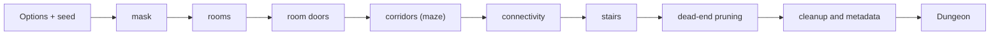

| Function | What it does |
| --- | --- |
| `Generate(opts)` | The generator. Refuses an out-of-range option with `*OptionError` (which says which option; `errors.Is(err, ErrInvalidOption)`) and returns `ErrNoSpace` when the mask leaves no space even for a room of the smallest size. An even size becomes the odd one below; room sides become odd. The effective options come back in `Dungeon.Options`. |
| `DefaultOptions(seed)` | The default values (51 × 51, `spread`, `meandering`, `typical`, 2 stairs, 60% pruning). |
| `Check(d)` | Checks the specification invariants that can be read off the result: bounds and effective options, room parity and size, no overlap nor blocked square, reachability from the entrance, doors (parity, open on both sides, 4 squares apart, no trap on an open door or portcullis), exits on two rooms, corridors with no 2 × 2 and outside floors and rings, stairs, entrance and dead ends with pruning 100. It does not check determinism or stream independence (separate tests). It also runs inside `Generate` with `Options.SelfCheck`. |
| `WallsMask`, `Markers`, `PromptOf` / `PromptJSON` | What the caller derives from the result: the mask of open squares and walls (a wall is any closed square with an open one among its 8 neighbours), a marker per door and per stair, and the structured JSON for the image prompt (no pixels and no draw; the direct room connections in `connections[]` and the corridor networks, with each one's rooms, in `networks[]`). The image itself (floors and walls only) is `maps/dungeonimg`'s. |

`Dungeon` stores data, not bits: `Kinds` (rock, room, corridor, door; a square outside the mask is rock), `RoomIDs`, `CorridorIDs`, `Mask` (where the silhouette allows), `Rooms` (with `Exits`), `Doors` (type `archway`, `closed`, `barred`, `locked` or `secret`, the `Trapped` mark, the axis and what the door joins), `Corridors`, `Stairs`, `Entrance`, `DiscardedRooms` and `StairsPlaced`. The door types match the door layer's states (RN-26); a secret door is in the result, and hiding it from the players is the integration's job.

**Determinism.** The random number generator is ours (xoshiro256\*\* with the seed expanded by SplitMix64), not `math/rand`, whose stream is not stable across Go versions. Each phase has its own stream (SplitMix64 of the seed with a phase constant), so changing `stairs` does not change the rooms and changing `door_mix` moves no door: every door's type and trap mark come from their own stream ("door kinds"), not from the phase's. Draws use unbiased integers (Lemire) and Fisher-Yates shuffles; the order of the draws, commented in the code (`DRAW:`), is part of the contract. Changing any number that alters the output requires a new `Version` and the `testdata/golden.json` file regenerated (one grid hash per case). A test vector pins the generator. The list of specification readings the code made is in the package comment (`doc.go`).

**Cost.** Measured on an Apple M1 Pro (shared machine, so times vary), `Generate` takes 0.1 ms at 31 × 31, 0.25 ms at 51 × 51, 1.5 ms at 121 × 121, 4.4 ms at 199 × 199 and about 8 ms at 199 × 399 (the largest), against the 50 ms target and the 250 ms ceiling; it allocates about 4 MB on that largest (the result itself is near 0.6 MB). The constructed worst cases at 199 × 399 (3 × 3 rooms in `tiled` with density 200, small dense rooms, a mask with loops) take 7 to 12 ms; the loop one at 100% allocates about 17 MB, because almost every square becomes a junction and the result lists tens of thousands of corridors. Connectivity retries orphan groups and discards one per pass without progress; with the door tracks entering the maze and the links on both sides, the default discards 0% of rooms (1% in a 20,000-combination sweep with masks and few doors) and the worst cases seen make at most about 8 passes. `PromptOf` is linear: 3.5 to 4.7 ms at 199 × 399 (limit 20 ms). The maze uses an explicit stack, no recursion. The limits: width 15 to 199, height 15 to 399 and at most 500 rooms. A service that calls the generator should run with a deadline (proposed: 2 s) and refuse requests above the limits before generating.

**Clean room (ADR-0015).** The generator was written only from a behaviour specification, by someone who had not seen any other generator's code. The specification and its origin note stay with the generator's PR, as comments, and not in this document or the code; the audit (a third person checked that the specification has no code, data or text from the original) is in the private ADR.

## Characters module: characters and sheets

The player creates their own character and the master creates the NPCs; the sheet comes back with the numbers computed by the server (MR-003, MR-004, MR-005, MR-006). The character of someone who joined through an invite with approval waits for the master to approve or refuse it (MR-024, RN-15). The code lives in `backend/internal/characters`, and the tables are in [Data model](data.md#tables-by-module).

- **The sheet stores choices, not numbers.** `CharacterSheet` is a full sheet (`FullSheet`: player, enemy and boss) or a basic one (`BasicSheet`: minion and story NPC). The full one stores content keys, like `class:wizard`; every write goes through `rules.Validate`, and every read through `rules.Derive`, which returns the `DerivedSheet` (see [Rules module](#rules-module-rules-as-data)). The browser never computes a rule.
- **An NPC gives XP (MR-016).** `FullSheet` (enemy, boss) and `BasicSheet` (minion) have `challenge_rating` ("0", "1/8", ... "30" or empty) and `xp_value` (0 to 1,000,000). A player's sheet refuses both with `invalid_argument`. The server stores what it receives: filling the XP from the level is the editor's job. `characters` also adds and subtracts the sheet's XP at `progression`'s request and says, in `GetCharacter`, whether the character can level up (see [Progression module](#progression-module-xp-and-milestones)).
- **The NPC portrait (MR-031).** `FullSheet` and `BasicSheet` have `portrait_image_id`: an image from the campaign gallery, checked by `Gallery` (see [NPCs on stage](#npcs-on-stage)). A player's sheet refuses the field with `invalid_argument`. The field lives in the sheet's JSON, with no migration.
- **The backstory is separate** (`CharacterStory`: personality, appearance, history, allies), with its own lock and its own call (`UpdateCharacterStory`).
- **Revision.** Sheet and backstory share one `revision`. Whoever saves sends the revision they read; if the sheet changed meanwhile, the answer is `aborted` and nothing changes.
- **Master notes** live in a separate table and only come out through `GetMasterNotes`. No other response carries them (RN-11), and a test checks each response a player may ask for.

| Call | Master | Owner (player) | Other player | Non-member | Anonymous | Pending member (RN-15) |
| --- | --- | --- | --- | --- | --- | --- |
| `CreateCharacter`, player type | `permission_denied` | Yes; `failed_precondition` if they already have a living one (RN-03) | Yes, their own | `not_found` | `unauthenticated` | Yes, only one, born pending |
| `CreateCharacter`, NPC | Yes | `permission_denied` | `permission_denied` | `not_found` | `unauthenticated` | `permission_denied` |
| `GetCharacter`, `UpdateCharacter`, `UpdateCharacterStory` of a player's character | Yes | Yes, within the locks below | `not_found` | `not_found` | `unauthenticated` | Only their own pending character |
| `GetCharacter`, `UpdateCharacter`, `UpdateCharacterStory` of an NPC | Yes | `not_found` | `not_found` | `not_found` | `unauthenticated` | `not_found` |
| `ListCharacters` | All, NPCs and pending included | Only their own | Only their own | `not_found` | `unauthenticated` | Only their own pending one |
| `SetStoryEditing`, `MarkCharacterDead` (player characters only) | Yes | `permission_denied` | `permission_denied` | `not_found` | `unauthenticated` | `not_found` |
| `ApproveCharacter`, `RejectCharacter` (player characters only) | Yes | `permission_denied` | `permission_denied` | `not_found` | `unauthenticated` | `not_found` |
| `GetMasterNotes`, `UpdateMasterNotes` | Yes | `permission_denied` | `permission_denied` | `not_found` | `unauthenticated` | `not_found` |
| `GetLevelUpOptions`, `PreviewLevelUp` (only while `can_level_up`) | Yes | Yes | `not_found` | `not_found` | `unauthenticated` | `not_found` |
| `RollLevelUpHitPoints`, `LevelUpCharacter` (only while `can_level_up`) | `permission_denied` | Yes | `not_found` | `not_found` | `unauthenticated` | `not_found` |
| `ListLevelUps` | Yes | `permission_denied` | `permission_denied` | `not_found` | `unauthenticated` | `not_found` |
| `ContentService.ListContent`, `GetSpellDetails` | Yes | Yes | Yes | `not_found` | `unauthenticated` | Yes |
| `ContentService.ListSpells`, `ListCreatures`, `GetCreature`, `ListTrapPresets`, `ListLightPresets` | Yes | Yes | Yes | `not_found` | `unauthenticated` | `not_found` |
| `CharacterService.CreateNpcFromCreature` | Yes | `permission_denied` | `permission_denied` | `not_found` | `unauthenticated` | `not_found` |
| `TableContentService.ListTableEntries` | Yes, with all entries and the counts | Yes, only the non-archived ones | Yes, same | `not_found` | `unauthenticated` | `not_found` |
| `TableContentService.CreateTableEntry`, `UpdateTableEntry`, `ArchiveTableEntry`, `UnarchiveTableEntry`, `GetClassTableDefaults`, `GetEffectMenu` | Yes | `permission_denied` | `permission_denied` | `not_found` | `unauthenticated` | `not_found` |

A member who may not see a character (another player's, or any NPC for a player) gets `not_found`, with the same message as a character that does not exist; so nobody discovers NPC IDs. `TestAuthorizationMatrix` calls each method as each of the six and fails if a new method appears without a row in the table.

**The player's locks (RN-01).** The owner edits the sheet while it is a draft, or while it waits for the master's approval (pending, MR-024). Once a session starts, the sheet locks; the backstory too, and the player only edits it while the master releases it (`SetStoryEditing`), until the next session starts. The master edits everything, always. The computed numbers are never editable.

| Reason (`CharacterBlockedReason`) | When |
| --- | --- |
| `SHEET_LOCKED` | The player tries to edit the sheet after a session started. |
| `CHARACTER_DEAD` | The player tries to edit a dead character's sheet (RN-03). |
| `LIVING_CHARACTER_EXISTS` | The player tries to create a second living character in the campaign (RN-03). The detail carries the living character's ID. |
| `STORY_LOCKED` | The player tries to edit the backstory of a locked or dead character without the master's release. |
| `NOT_PENDING` | The master tries to refuse a character that is not awaiting approval (MR-024): once approved, the character stays in the campaign. |
| `AWAITING_APPROVAL` | The master tries to mark as dead a character still awaiting approval (MR-024): they approve or refuse first. Also holds in the level-up calls. |
| `CANNOT_LEVEL_UP` | A guided level-up call (MR-040) on a character that cannot "Pode subir de nível" (RN-12), that is an NPC or is at level 20. A dead character answers `CHARACTER_DEAD`. |
| `DICE_FORCED_PHYSICAL` | `RollLevelUpHitPoints`, or `LevelUpCharacter` with the die rolled in the app, in a campaign where everyone rolls physical dice (RN-18). |
| `DICE_FORCED_IN_APP` | `LevelUpCharacter` with the physical die typed, in a campaign where everyone rolls in the app (RN-18). |
| `ARCHIVED_CONTENT`, `SWITCHED_OFF_CONTENT`, `TABLE_CONTENT_STAYS` | A new choice of an archived or switched-off table entry, or a sheet with an `@mesa` key moved to another campaign (see [Live table content](#live-table-content) and [Player options and the live hint](#player-options-and-the-live-hint)). |
| `HIT_POINTS_AVERAGE_ONLY` | `RollLevelUpHitPoints` on a "average only" table (see [Leveling up from the sheet](#leveling-up-from-the-sheet-mr-040)). |

These reasons come in the `failed_precondition`'s `CharacterBlocked` detail, and win over a stale revision: trying again would not solve it. An `invalid_argument` names the field, with the proto path (for example, `sheet.full.base_scores.intelligence`), and never repeats what the person typed.

**The basic (NPC) sheet rolls initiative and attacks with real dice.** `BasicSheet` stores `initiative_bonus` (−10 to +20) and up to 3 `BasicAttack`: name (1 to 40 characters), attack bonus (−10 to +20), damage dice (1 to 20 dice of 4, 6, 8, 10 or 12 faces), damage bonus (−20 to +40), damage type (`DamageType`, the SRD's 13) and reach in feet (0 to 600; 0 is melee, 1.5 m). The reach is in the API, but the screen has no field for it yet: it returns the value as it came. Each error is an `invalid_argument` with the field path (`sheet.basic.attacks[1].damage_dice_sides`). The old `attack_bonus` and `damage` fields (free text, like "1d6+2 cortante") stay in the `.proto` only to read sheets saved before the structured attacks. **The conversion happens on read, with no migration:** `loadSheet` calls `upgradeLegacyAttack` (`legacy_attack.go`), a pure function that reads "NdS+K type", in Portuguese or English, and turns it into an attack called "Ataque" with the old bonus, zeroing the old fields. If the text cannot be read (no type, invalid die, number out of limit), the old fields stay as they are and the screen shows "Dano antigo: …" for the master to redo. The stored JSON only changes when the master saves again, and whoever saves with attacks has the old fields cleared by the server (`cleanBasicSheet`); without attacks, the old text is kept, so saving never erases it. A data migration would gain nothing: the read is cheap, holds for every reader (sheet, session, combat) and cannot leave a sheet half done.

**Free text.** The server trims spaces at the ends; one-line fields refuse line breaks, control characters, the line and paragraph separators (U+2028, U+2029) and invisible characters (zero width, text direction, word joiner, byte order mark, the Hangul fillers), and need at least one visible character; multi-line ones accept line breaks and tabs but refuse the same invisible characters. Both return the text in Unicode form NFC. The zero-width joiner stays legal, since emoji sequences need it. The limits, in characters, are in the `characters.proto` comments.

**Responses and GET.** As in `campaigns`: every response, errors included, goes out with `Cache-Control: no-store`, and every read carries an ID, so it is `IDEMPOTENT` and POST-only.

### Content source

Every read of rules content in `characters` goes through a `ContentSource` (`contentsource.go`), never through a `*rules.Content` held in the service:

```go
For(ctx context.Context, tx pgx.Tx, campaignID string) (*rules.Content, TableRules, error)
```

- **It returns the campaign's content and table rules.** `TableRules` are the table's choices (RN-23, RN-24), and their zero value is the SRD defaults the code already assumed (the player chooses to roll or take the average for level HP, all ability-score methods, critical doubles the dice, death saves visible, combat with a map, new maps without fog, no reminders): each field says what the table changes, never what the SRD already does. **The type belongs to `platform/tablerules`** (`tablerules.Rules`, a value with no behaviour), and `characters.TableRules` is an alias of it: `campaigns` stores the rules, `characters` reads them through the `ContentSource`, and `maps` and combat also need them, so a neutral package lets the modules share the type without importing each other. See [Table rules](#table-rules-mr-025-rn-24).
- **It receives the caller's transaction** (`nil` outside one): the implementation reads the campaign's content revision inside it, by the rule that no read goes through the pool inside `db.InTx`. So whoever is in a transaction passes the `tx`, and the `campaignID` comes from what the call already knows (the membership, the row read, the interface argument), never from an extra read.
- **The rules come from `campaigns`** (`TableSource`): `TableRulesReader.StoredTableRules`, which `campaigns.Service` implements and `cmd/api` wires, read through the `tx` the call receives (a primary-key read of `campaign_table_rules`, which with no row gives the zero value). The content is the SRD plus the table's entries (below). `SRDSource`, which never touches the database, stays for those who do not need the rules (tests). Each content read costs that extra read; `Service.TableRulesFor(ctx, tx, campaignID)` exposes only the rules. Combat does not go through here: it reads the rules through `play.CombatDefaults` (see [Table rules](#table-rules-mr-025-rn-24)).
- **The source of truth is the `TableSource`** (see [Live table content](#live-table-content)): the SRD plus the entries the master registered **and** the table rules (one object: `NewTableSource(pool, srd, campaigns)`; `ContentFor` skips reading the rules). `SRDSource` (the SRD for every campaign, without touching the database) stays only for those without a database.
- **The `ListContent` catalogue is built per content**: the same content gives the same catalogue, and a table's content has its own. The cache keeps at most 8 catalogues (the budget of 8 contents), the oldest leaves first, so the contents of a table that was edited do not stay alive.
- **One content per request.** A request asks for the content once and passes it along (`shapedVitals`, `writeWildShape`, `levelUpTarget.content`); in combat views, the `CombatRoster.ContentNames(ctx, tx, campaignID)` seam returns a names function tied to a content, and `play` asks for it once per view. A write asks for the content **before** the transaction (or inside it, with the `tx`), never after the commit: a failure there would make the client repeat a write that already took effect.
- **Helpers that receive the content** (`derive`, `maxima`, `combatCharacter`, `checkSheet`, `creatureOf`...) keep receiving a `*rules.Content`: the caller gets it from the campaign's `ContentSource`. The internal vitals readers (`getVitals`, `shapedVitals`) receive the `tx` instead of the `Queries`, so they can ask for the content in the same transaction.
- **The few points without a campaign stay on the SRD** (`Config.SRD`): the condition names (RN-22) and the skills of a scene, and the trap and light presets (`ListTrapPresets`, `ListLightPresets`; `maps` checks their keys against the SRD), which no table changes. `maps` also stays on the plain SRD (`Config.Rules`): it only reads presets, damage types, conditions and skills.
- **The seams with `play` carry campaign and transaction** where they read the content without knowing which campaign: `CombatRoster.ContentNames`, `CreatureSheet`, `CreatureTurnOptions`, `CreatureSave` and `CreatureEyes` receive `(ctx, tx, campaignID, ...)` and return an error. `Conditions()` and `SceneCheckName` stay SRD.

**Why `ContentService` is here.** The table content is a per-campaign layer over the SRD, read by a `ContentSource` inside the caller's transaction (ADR-0018 places it in `characters`, which already serves the catalogue; see [MR-025](product/stories.md#mr-025-register-table-content) and [RN-23](product/rules.md)). A campaign's content is the SRD embedded in `rules` plus the table's entries (`campaign_content`), and the `ContentSource` returns it; the catalogue is built once per content and served by `characters`. The request already carries the `campaign_id`, because table content is per campaign. Each casting class carries, in `ClassSpellcasting.max_spell_level_by_level`, the highest spell level it reaches at each level (computed from the class table's spell slots, with `rules.MaxSpellLevelFromSlots`), and the editor only filters the spell lists by that table; what actually validates, on saving, is still the server.

### Live table content

The content the master registers (MR-025, RN-23, ADR-0018) is stored, served and **takes effect at once**, in `characters`. The engine is [Table content](#table-content-contentwith); around it sit storage, the API and the live read.

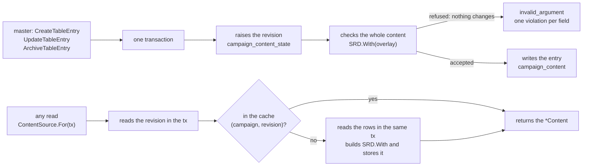

| Piece | What it does |
| --- | --- |
| Storage | `campaign_content` (one row per entry, `data` is the kind's message as protojson) and `campaign_content_state` (the campaign's revision). It lives in `characters`, not in `campaigns.content_revision` as ADR-0018 said: `characters` does not write a column of another module. See [Data](data.md). |
| The protos | `rules/v1/table_content.proto`: one message per kind (`TableClass`, `TableSubclass`, `TableRace`, `TableSubrace`, `TableBackground`, `TableSpell`), one to one with `rules`' `Table*` types, and `TableEntry`, which reads return. The writes and the full read are `TableContentService`; the catalogue stays `ContentService.ListContent`, which already carries the table's entries (and the `archived` mark). The two services are in different files because `rules.proto` cannot import what imports `rules.proto`. |
| Writes (master only) | `CreateTableEntry`, `UpdateTableEntry`, `ArchiveTableEntry` and `UnarchiveTableEntry`. Each is **one transaction** that starts by raising the revision (so two writes of the same campaign run one after the other), reads all entries, applies the change and checks **the campaign's whole content** with `SRD.With`: a refused content changes nothing (the transaction rolls back, the revision too). The error is `invalid_argument` with the `TableContentRefusal` detail, one `TableContentViolation{field, reason}` per engine error (`OverlayError`), with the path in the body's own names (`table_class.levels[4].features[0].effects[1].value`): the editors point at the field and the Portuguese text is the web app's, by code. The server adds `immutable` (kind, key, parent class or race changed, a feature key the entry never had, or **a spell that goes from cantrip to leveled spell, or the reverse**), `duplicate_name` (another entry of the kind has the name, case-insensitive), `size_limit` (64 KiB) and `limit` (more features or traits than the engine allows, 60: counted in the handler, before the transaction and before any feature gets a key, so a body of thousands of features is refused at once and never holds the campaign's revision). A stale entry (`expected_revision` different from the entry's `revision`) is `aborted` with `TableContentBlocked` `STALE`. **An archived entry can still be edited** and stays archived; archiving twice is `ARCHIVED`, unarchiving one that is not archived is `NOT_ARCHIVED`. **Archiving and unarchiving are not changes to the entry**: they touch neither its `revision` nor its `updated_at` (sheets that use it "keep it", with no notice), but they raise the campaign's revision, for the cache; the archiving date is `archived_at`. |
| Keys | The entry's key is born from the name (accents removed, `a-z0-9-`, up to 60, with `-2`, `-3`... if it exists; the engine's reserved words become a single word) and never changes, not even when the name does. The features' are the server's: `feature:class-<start of name>-<hash>--<feature name>@mesa` (and `subclass`, `race`, `subrace` and `background` in place of `class`, with `trait:` and `background-feature:` on the last three): the start of the entry's name is up to 16 characters and the hash is 6 characters of a SHA-256 of the **whole** entry key, so two entries with long names that start the same never make the same key, and the feature still fits within the engine's 60 characters; `--` never appears in a name, so the two parts are not confused. **A feature keeps its key while it exists**: the editor returns it on update, and, if it does not, the one of the same level and name takes it back; only one with no key and no match gets a new one. A key the entry never had is refused (`immutable`), so a request cannot take another entry's feature. |
| `ListTableEntries` | The entries in full, by kind and name. The master receives all (archived too, with `archived_at`) and, in each, **how many sheets use it** ("Em uso por N fichas"); the player receives the non-archived ones, in full (numbers and effects), and never a count; a pending member does not read it (they only need the catalogue). What the master switched off in "Opções para os jogadores" the player never receives, like the archived (a subclass or subrace whose class or race is switched off neither, unless their sheet uses it); the master receives the switched-off ones, with `off`. The master's reads for the screen are `ListOptionSwitches` and `SetOptionSwitches` (see [Player options and the live hint](#player-options-and-the-live-hint)). |
| `ListContent` and what a player never receives of an archived entry | The campaign catalogue: the SRD plus the table, with `content_version` `srd51@...+fx.N+mesa.<revision>` and `table_revision`. Archived entries only go to the master (with `archived`); the players' catalogue is a copy (`proto.Clone`, filtering the six lists) without them. **`GetLevelUpOptions`** does not offer a player an archived subclass, unless their own sheet already has it (the master receives it with `LevelUpSubclass.archived`). **`GetSpellDetails`** answers `not_found` to a player or pending member for an archived spell, unless a sheet of **theirs** in the campaign uses it. **No archived key reaches a player, not even by reference**: their catalogue, `ListTableEntries` (which also removes the classes and the list of a casting, the spells an effect grants and each body's always-prepared ones), the spell details and the level-up options clear archived keys from the reference lists (`Spell.class_keys`, `list_class_key`, `TableSpell.class_keys`, `TableCasting.list_from`, `TableEffect.spells`...), and a subclass or subrace whose parent class or race is archived disappears, unless a sheet of the player's uses it (in `ListTableEntries`; in the catalogue, shared among the players, it always disappears). The catalogues carry what is needed to read the engine's content: `Race.choice_bonuses`, `Subclass.spellcasting` (the third caster), `ClassSpellcasting.list_class_key` (the list the class reuses) and `Background.equipment_pt`. |
| The `TableSource` | One object for content and rules (`tablesource.go`; `NewTableSource(pool, srd, campaigns)`). `For(ctx, tx, campaign)` **reads the revision inside the caller's `tx`** and returns `SRD.With(overlay)` **and** the stored rules (`TableRulesReader.StoredTableRules`, through the same `tx`); `ContentFor` skips the rules. With no revision row (a campaign without content) it returns the SRD itself, building nothing. **Outside a transaction**, a hit costs reading the revision through the pool; a miss opens **a read transaction** that reads the revision and rows again, so the content stored under a revision is that revision's. **The order against a sheet write:** `CreateCharacter` and `UpdateCharacter` read the content before the transaction (validation needs it), and **inside it read it again**; if the revision changed meanwhile (an archive, an edit), the sheet is checked again with the new content, and the write holds for only one of the two sides. `LevelUpCharacter` already reads the content inside the transaction. The serialization conflict (40001) is retried by `db.InTx`. |
| The cache | By **(campaign, revision)**, at most **8 contents**, the least recent leaves first. A hit costs reading the revision (one indexed query). A miss **builds the content only for whoever asked**, reading the rows in the same `tx` (so they are those of the revision it read), with no shared `singleflight`: a request holding a connection while waiting for another that needs one is how the pool hangs. Two that miss at once both build, and the second to store wins (the result is the same). **A write never fills the cache**: what it builds can still roll back, and the next revision would be something else. The memory cost and the time are in [Operations](operations.md#table-content-cache). |
| "A classe mudou" | A change takes effect at once, **also on locked sheets**. Each sheet stores, **inside its own document** and written by `checkSheet` (create, edit and level-up; what the client sends is ignored), the content revision (`FullSheet.content_revision`), the notices it already had (`known_issues`, each by **code, field and exact sentence**: "Faltam 1 perícias" turning into "Há 3 perícias; escolhe 2" is another notice) and, for a still-flagged entry, the revision at which the sheet was up to date with it (`content_baselines`). **Each `Derive` notice carries the table keys it depends on** (`Issue.Keys`: the entry of the field it points to, and the entries the number is computed from, like the classes in a skill count, the race in a bonus to distribute, all the keys in a formula that failed). On **every read**, `Content.ChangedSince` lists the table entries the sheet uses that changed later (each stores the revision and the date, `updated_at`, of its own last change), and the server shows, **for each changed entry, only the new notices whose keys include it**: `DerivedSheet` carries `changed_content` (the key, the name, the field, the revisions, **the date of the change** and **the exact sentences** of those notices) and a `table_content_changed` `Issue` per entry. A notice of another entry is never attributed to it (a changed background's text does not carry a spell's notice). The notice **disappears by itself** when nothing remains tied to it (the master undoes the change, or the sheet is adjusted); a change that left no new notice on that sheet (a text) shows nothing; there is no "dismiss". **Saving the sheet does not clear it** (a player's rename or an unrelated master edit keeps the banner): on saving, the notices that were flagged and still stand stay **out** of `known_issues`, and the entry stores the base revision in `content_baselines`, so the next read flags them again; only fixing what the notice says clears it. It is a notice, **never a `Validate` error**: no other edit is refused because of it, only the owner and the master read it, and the player never receives the history of changes nor who made them. **So that `Validate` never refuses an unrelated edit because of a change**, the server refuses on the entry itself the only change `Validate` checks against the sheet: a spell going from cantrip to leveled (the sheet stores the two in different lists). The others (a class's or subclass's casting, a race's number of bonuses to choose, a background's skills...) only generate `Derive` notices, never a `Validate` error. `UpdateTableEntry` also returns `affected_characters`: the sheets that use the entry and **ended up with new notices tied to it**, with the player's name, for the master's "Fichas com aviso" list. |
| An archived entry as a new choice | `CreateCharacter` and `UpdateCharacter` refuse an archived key that the new sheet has and the earlier one did not (`Content.ArchivedKeys`, comparing the two; a creation's is compared with nothing): `failed_precondition` with the `CharacterBlocked` detail `ARCHIVED_CONTENT` and the `content_key`. `LevelUpCharacter` and `PreviewLevelUp` refuse with `LEVEL_UP_REFUSAL_REASON_ARCHIVED_CHOICE` (and the field). A sheet that already uses the key keeps working (`Derive`, `Validate`, names and level-up). |
| A sheet with an `@mesa` key does not change campaign | `CheckSheetCanMove(sheet)` (`failed_precondition`, `CharacterBlocked` `TABLE_CONTENT_STAYS`, with the first key). **Nothing calls it yet**: there is no copying or reuse of characters across campaigns (MR-021, MR-022), and whoever builds them must call it before writing. |
| Beyond this | `maps` stays on the SRD. A write **notifies the live session** (`content_changed`, contentless) and the master has per-option switches ("Opções para os jogadores"): see the next section. |

**Tests** (`tablecontent_test.go`): `TestTableContentEveryKindIsCreatedUpdatedArchivedAndBroughtBack` (the six kinds through the four writes, with the key stable across a rename), `TestTableContentFeatureKeysAreStable`, `TestTableContentKeysNeverChangeAndNamesAreUnique`, `TestTableContentRefusalsAreFieldViolations`, `TestTableContentLimits` (64 KiB and 300), `TestTableContentAccess` (master, player, pending and outsider), `TestTableContentStaleAndRevision`, `TestTableContentIsLive` (a write shows on the next read, also inside a transaction with the one-connection pool, and the cache never exceeds 8), `TestTableContentConcurrentWrites` (eight writes at once, the revision ends at eight), `TestTableContentChangeShowsOnTheSheet` (the notice, the sentences, the date, and it disappears by itself), `TestTableContentAnUnrelatedEditIsNeverRefusedForAChange`, `TestTableContentEveryMechanicalChangeLetsTheSheetSave`, `TestTableContentASpellNeverCrossesCantripAndLeveled`, `TestTableContentArchivedIsNeverANewChoice`, `TestTableContentArchivedSubclassesAreNotOffered`, `TestTableContentArchivedSpellsAreNotShown`, `TestTableContentNeverNamesAnArchivedKeyToAPlayer`, `TestTableContentAnIssueIsBlamedOnItsOwnEntry`, `TestIssuesAreToldApartByTheirWholeIdentity`, `TestTableContentWritesAreOrderedAgainstContentWrites` (an archive between the read and the transaction), `TestTableContentFeatureKeysOfLongNames`, `TestTableContentTheClientNeverSetsTheContentRevision` and `TestSheetsThatUseTableContentStayInTheirCampaign`.

### Player options and the live hint

The master switches on and off, per campaign, each class, subclass, race, subrace, background and spell, **from the SRD and the table**: everything is on by default (MR-025, RN-23, ADR-0018). What is switched off **never reaches a player**, in any read, and the master sees everything, with the `off` mark.

| Piece | What it does |
| --- | --- |
| Storage | `campaign_content_off`, one row per **switched-off** option (no row means on), in `characters`, like the content. See [Data](data.md). |
| In the engine | `Overlay.Off` carries the switched-off keys to `Content.With`, which stores them on a copy (the SRD never changes) and ignores a key that belongs to none of the six kinds. The catalogue carries `Off` on each entry (its own key). `Content.Off(key)` is the key's own switch; **`Content.Hidden(key)`** is what the player does not receive: archived, switched off, or the **subclass** or **subrace** of a class or race that is switched off **or archived** (which keep their own switch as it was, so turning the class back on returns each subclass as it was). **But the parent only hides the children of whoever does not have it on their sheet:** `Content.OffKeys(build)` lists the switched-off keys a sheet uses, and a subclass (or subrace) under a switched-off class (or race) only counts when the sheet does **not** have the class (or race), so a sheet that already has the switched-off class keeps reaching the subclass level, and a new sheet, which cannot take the class, does not take the subclass. The level-up offer (`LevelUpSubclass.off`) uses only the subclass's own switch. A content version with the set holds only inside the campaign, like `+mesa.<revision>`. |
| In the source and cache | The `TableSource` reads the switched-off keys **in the same transaction as the revision** and adds them to the content; the cache stays by (campaign, revision). A campaign that only switched options off (no table entry) already has a revision and a content of its own, built only with the set. |
| What the player never receives | A switched-off option is **treated as archived**, at every point: the catalogue (`ListContent`; the players' catalogue is the copy without the archived **or switched-off** entries, and without the child subclasses and subraces), `ListTableEntries` (which also clears switched-off keys from each body's references, the `from` choices included), `ListSpells` (`SpellFilter.Hidden`; a hidden `class_key` answers like an unknown one, an empty list, unless a sheet of **theirs** uses the class), `GetSpellDetails` (`not_found`, unless a sheet of **theirs** uses it, as with the archived, **SRD or table**: the set of the sheet's own keys is that of all the `Build`'s keys), the level-up options (`LevelUpSubclass.off`; the list class that a table class or a subclass reuses also leaves) and the reference lists inside other entries (`Spell.class_keys`, `list_class_key`, `TableSpell.class_keys`, `TableCasting.list_from`, `TableEffect.spells` and `from`, the always-prepared ones). `PreviewLevelUp` of a choice refused as archived or switched off **returns no `after`**: a player guessing the key does not read the features. Whoever filters receives a single predicate (`Content.Hidden`). |
| A new choice | `CreateCharacter` and `UpdateCharacter` refuse, **for a player**, a switched-off key (or child of a switched-off class or race) that the new sheet has and the earlier one did not (`Content.OffKeys`, comparing the two): `failed_precondition` with `CharacterBlocked` `SWITCHED_OFF_CONTENT` and the `content_key`. `PreviewLevelUp` and `LevelUpCharacter` refuse with `LEVEL_UP_REFUSAL_REASON_SWITCHED_OFF_CHOICE` and the field. **The master is not refused**: the switch hides the option from players, not from any sheet the master edits (an NPC with the class players cannot choose; a player's sheet they edit, which then keeps it). A sheet that already uses the key keeps working, and an unrelated edit is never refused. |
| `ListOptionSwitches` (master only) | The screen's list, by kind and name: every class, subclass, race, subrace, background and spell of the campaign (SRD and table), each with the key, kind, name, `table` (it is the table's), `off` (the switch), `archived`, `hidden` (the player does not receive it: archived, switched off or of a switched-off parent), `parent_key` (a subclass's class, a subrace's race), `level` (the spell's level) and **`characters_using`** (how many **player** sheets of the campaign use it, once per sheet). It reads the content and the sheets in one transaction. A pending member or outsider gets `not_found`; a player, `permission_denied`. |
| `SetOptionSwitches` (master only) | Switches up to 700 options on or off in one transaction. The order: reads the content (the revision enters the transaction's read), checks each key against it (`invalid_argument` for a key that belongs to none of the six kinds, a repeated one, none or more than 700), **raises the campaign's revision** (two campaign writes run one after the other, and a sheet write is ordered against it) and stores the set. **The response is built without the live source** (`SRD.With` of the rows the transaction sees plus the new set, like the other writes' check): a write never fills the cache, because the transaction can still roll back and the next revision would be served with a content nobody stored (`TestRN23_AWriteNeverFillsTheLiveCache`). An **archived** table entry can also be switched on and off, and stays hidden either way. A request that changes nothing **rolls the transaction back** (the revision does not rise) and notifies nobody. The response carries the revision, how many options changed state (`changed`) and those that changed **for the players** (`options`: those with a different `off` or `hidden`, the subclasses of a switched-off class included). |
| The live hint | Every write to table content (create, edit, archive and unarchive, and the switches) sends **`content_changed`** (stream field 23, with no fields) to **everyone** watching the campaign, **after the commit**. It carries neither the entry, the key nor what changed (RN-10): each reader reads the content with their own role (`ListContent`, and `ListTableEntries` where the screen has the full entries), and open sheets read the character again ("A classe mudou"). `characters` calls `Live.PublishContentChanged`, which `play` implements with the puzzles' time gate (one hint per campaign every 250 ms; the last change is never left without a notice) and the hub's `Coalesce` (a hint waiting in a stream's queue does not enter twice). With no open session nobody listens, and readers read the current content on opening. |

**Who listens to the hint in the browser.** The hint goes to **everyone** watching the campaign, with no content, and each reader reads again what they show **with their own role** (the player never receives, on read, what the master switched off). `ContentWatcher` (`core/content/content-watcher.ts`) opens the session stream (the same `LiveStream` and ADR-0005 rules: backoff, closes with the tab hidden, no retry without access) **only when the campaign has an open session** (`OpenSessions`, which asks every 30 s), groups notices arriving within 300 ms into one read, clears the wait when the page leaves and reads again on a `ready` that is not the page load's own (a session that opens with the page already up connects **within 30 s** and its first `ready` already reads, because the content may have changed in between; a hint can be lost with the stream down). Each page declares it in its own component (`providers: [ContentWatcher, LiveSessionSourceLive]`), one stream per page, and the page reads what it shows. Who listens: the table content list and the entry page (`ListTableEntries`, no spinner; the open editor keeps the body and revision the master is editing, and a "Salvar" after another write still says the entry changed), "Opções para os jogadores" (`ListOptionSwitches`; a read that started before a master change is discarded), "Magias" (the list in its current filter, with the "Mostrar mais" pages that were open, the open spell and the class names), a player's character editor (the master's does not listen, because they write the content; the catalogue with the character, `ListContent` with `character_id`; what was typed stays, and a sentence says the lists changed), level-up (the character, the options and the catalogue **read again**: the page's `LevelUpClient` keeps the catalogue per campaign and character, and the hint asks for `fresh`, so the client memory never serves an old list; the choices still in the offer stay, `adopt`, and the sentence only appears if what the page shows changed) and the open sheet (the `XpWatcher`, one more hint on the same stream: it reads the character again, for the "A classe mudou"). With no open session nobody sends the hint, and each page reads the current content on opening.

**Tests** (`tableswitches_test.go`, `overlay_off_test.go` in `rules`, `content_hint_test.go` in `play`): `TestRN23_SwitchedOffOptionsAreNeverSeenByPlayers` (an SRD class, an SRD spell and a table race switched off: no player read cites them, read as the app's JSON; the master reads them with the mark; the subclass of a switched-off class disappears; the counts; the sheet that uses the switched-off class goes on without a notice and renames; turning back on), `TestRN23_ASheetThatUsesAnOffOptionKeepsReadingAboutIt`, `TestRN23_ANewChoiceOfAnOffOptionIsRefused` (create, edit and level up; the sheet that already has it works; an unrelated edit passes; the master is not refused; the subclass switched on under a switched-off class), `TestRN23_TheRevisionAndTheCacheFollowTheSwitches` (the revision, the content version, the request that changes nothing), `TestRN10_ContentChangedTellsTheSession` (the hint after each write, none on a refusal), `TestRN10_ContentChangedIsAContentFreeThrottledHint` (the empty message, to everyone, only of the campaign, the gate), `TestMR025_TheSwitchesAreTheMastersAlone` (roles and invalid requests), `TestRN23_TheOwnSheetKeepsAnOffSRDOptionReadable`, `TestRN23_AWriteNeverFillsTheLiveCache`, `TestRN23_ASubraceUnderTheSheetsOwnOffRaceKeepsWorking` (and, in `TestRN23_ANewChoiceOfAnOffOptionIsRefused`, the level-up under the sheet's own switched-off class), `TestRN23_TheListedChoicesOfAnEntryNeverNameAnOffSpell`, `TestRN23_APreviewOfARetiredChoiceCarriesNoSheet`, `TestRN23_SwitchingAnArchivedEntryWorks`, `TestRN23_ASwitchIsOrderedAgainstASheetWrite`, `TestRN23_ConcurrentSwitchesAreOrdered` (eight at once, `dbtest.PoolSize`, the revision ends at eight) and, in `rules`, `TestOverlayOffMarksSRDAndTableOptions`, `TestOverlayOffHidesTheChildrenOfAnOffParent`, `TestOverlayOffLeavesTheBaseAndOtherContentsAlone` and `TestOffSubclassInTheLevelUpOffer`.

### Spell targets and the "Magias" page

Every spell, SRD or table, says **who it catches**, and the players' "Magias" page (MR-045) reads that, the search and the filters from the server (MR-025, RN-23). The code is in `rules/spelltarget.go`, `rules/spelllist.go`, `characters/spelllist.go` and `characters/spelldetails.go`.

**An SRD spell's target.** The importer (`cmd/srdimport`) reads 5e-database's `area_of_effect` (the shape and size in feet) into `spells.json` (`area_type`, `area_size_ft`): 88 of the 319 spells have it, and the importer refuses a shape that is not cone, cube, cylinder, line or sphere and a size that is not a multiple of 5. Loading checks again. `srdTarget` decides, in this order (the first row is a handwritten file, `effects/spell_targets.json`):

| When | The target |
| --- | --- |
| The spell is in `effects/spell_targets.json` | What the file says (see below) |
| The spell has a structured area | `TargetArea`, with the shape and size. The structured data wins: the text is not read. |
| Magic Missile and Scorching Ray | `TargetCreatures`, 3 and 1 more per level above (one dart or ray each, also in the `targets_per_level` the app reads: the 3rd-level Scorching Ray has 4 rays) |
| A spell attack | `TargetCreature` |
| The SRD text says area ("20-foot radius", "up to three creatures", a Self spell that deals damage or asks for a save...) | `TargetCreatures` without a number (`Count` 0: the caster picks how many; the master judges) |
| Self range | `TargetSelf` ("Só quem conjura") |
| The rest | `TargetCreature`; with `PerSlotLevel` 1 when "at higher levels" says "one additional creature" |

Each target's text is `SpellTarget.LabelPT()`, sent in `SpellDetails.target.label_pt`: "Uma criatura", "Várias criaturas", "Só quem conjura" or the area ("Cone de 4,5 m", "Esfera de 6 m", "Linha de 30 m"), with the metres from `MetersPT` (5 ft = 1.5 m, comma, no decimal when whole, in kilometres from 1,000 m). The app writes the rest of the spell (time, range "Pessoal", "Toque" or the distance, duration, components) as it already did (`spell-details-format.ts`).

**The handwritten file, `effects/spell_targets.json`.** The database and the text get a few spells wrong, and the file corrects them in our words. The types are closed (`creature`, `creatures` with `count` and `per_slot_level`, `area` with shape and size, `self` and `none`, "no creature": a point, an object, a place, nobody to pick), every key is an SRD spell (loading refuses the rest), `label_pt` replaces only the page's text, and the file follows the content revision rule. The `self` and `none` types mean "nobody to pick": `play` lists only the caster, refuses another target (`link.Spell.CasterOnly`) and rolls nobody's save (Contact Other Plane asks for the caster's save). The entries:

| Type | Spells |
| --- | --- |
| One creature | `telekinesis` |
| Only the caster | `detect-evil-and-good`, `detect-magic`, `detect-poison-and-disease`, `speak-with-plants`, `branding-smite`, `divine-favor`, `flame-blade`, `contact-other-plane`, `magic-jar`, `scrying`, `wish` |
| No creature | `arcane-eye`, `magnificent-mansion`, `dancing-lights`, `druidcraft`, `fabricate`, `light`, `major-image`, `minor-illusion` |
| Several creatures, with the SRD's number | `bless` and `bane` (3, plus 1 per level), `mass-healing-word` and `prayer-of-healing` (6), `mass-suggestion` (12), `telepathic-bond` (8), `water-walk` (10), `wind-walk` (you and 10), `astral-projection` (you and 8), `heroes-feast` (12) |
| An area the database lacks | `hypnotic-pattern` (9 m cube), `plant-growth` (30 m sphere), `purify-food-and-drink` (1.5 m sphere), `glyph-of-warding` (6 m sphere) |
| Only the text changes | `flame-strike` ("Cilindro de 3 m de raio": the database carries 40 ft, the height), `forbiddance`, `mirage-arcane`, `teleportation-circle` (3 m diameter), `guards-and-wards` and `fire-storm` (no false cube) |

**Where the structured area and the text still disagree.** `characters/combatspells.go` used to read only the text. With the structured data, 11 spells became area (any number of targets) and used to catch one target: `blade-barrier`, `control-water`, `forcecage`, `guardian-of-faith`, `hallow`, `prismatic-wall`, `private-sanctum`, `storm-of-vengeance`, `wall-of-fire`, `wall-of-thorns` and `wind-wall` (`TestStructuredAreasAgainstTheText` pins the list). Another 10 from the database had an area and the file corrected them (those that used to catch one target, like `telekinesis` and `arcane-eye`, and those that were "only the caster" for being Self, like `detect-magic`). In the other direction, spells that only the text calls area and that the file does not correct (`compulsion`, `enthrall`, `mass-heal`, `dispel-evil-and-good`, `eyebite`, the summoning ones) stay as they were, "several creatures" without a number, and since the master is never limited by the number of targets, this blocks nobody.

**The "Magias" page (`ContentService.ListSpells`).** Active members only (the pending member gets `not_found`, as in `ListCreatures`), `IDEMPOTENT`, with `query`, `class_key`, `levels`, `school_keys`, `character_id`, `page_size` (1 to 400, 100 by default) and `page_token`; it returns the light `Spell`, ordered by Portuguese name, with `total`. A spell is one row, SRD or table, and the full description is still `GetSpellDetails`.

- **The search** finds the Portuguese or English name, without accents and case-insensitive ("maos" finds Mãos Flamejantes).
- **The class** is its list: the spells that cite it, or the list the table class reuses. A key of a casting subclass (the third caster) takes the list of the class it casts from. A class without a list gives an empty list.
- **"Só as que posso aprender"** (`character_id`): the list of each casting class on the sheet, up to that class's highest level, cantrips included; in a multiclass, each one's list by its level in it. The sheet's owner and the master may ask; another player gets `not_found`, and a basic sheet, `failed_precondition`.
- **Who sees what:** the player never receives an archived table spell, nor an archived class's key in `class_keys`; the master receives the archived ones, with the `archived` mark. The rule lives at one point (`SpellFilter.Hidden`, which is `Content.Hidden`: archived or switched off), and the "Opções para os jogadores" switches enter it: the player also does not receive a switched-off spell nor a switched-off class in `class_keys`; the master receives them with `off`. Switching a class off does **not** hide its list's spells: only the class key leaves `class_keys`, and the filter by a hidden class answers like a class that does not exist.

**A table spell in combat.** It goes through the same `CombatSpell`, which reads the campaign's content: the attack (`attack`, one d20 per target), the save (half or nothing), the damage per level or per cantrip tier, the healing with the modifier, concentration, slots and the log work as for an SRD spell, with the Portuguese name in the log. The target comes from the spell: `link.Spell` carries `TargetCount` and `TargetPerLevel`, and `maxTargetsOf` uses them before looking at the spell's type (a table spell with an attack and three creatures rolls three attacks). Self reaches only the caster or an area coming from them (`With` refuses Self with "one creature" or "several"). The "Spells that read HP" and the summoning ones stay SRD-only: the table key is not in `effects/spells.json`, so no table spell reads HP or summons, and its `GetSpellDetails` carries no `hit_point_effect`. `GetTurnOptions` carries `SpellTargets.targets_per_level`, how many more targets per level (1 in the SRD that says "one additional creature"; the master's number in a table spell).

**The "Outro" background.** The free-text background follows SRD 5.1's "Customizing a Background" rule: the sheet's `CustomBackground` has `proficiency_keys` (two tools or languages, in any mix), `feature_name` and `feature_text` (the feature, in the player's words) and `equipment` (text). `Validate` checks the limits (at most 2 tools or languages, each an SRD tool proficiency or language, without repeating; feature name up to 40 characters; text up to 1,000; equipment up to 500), and what is missing is a `Derive` notice (`missing`, one per part: the tools or languages, the feature and the equipment), never an error: the app is an assistant. The three notices only appear when the sheet already has some of the new parts, that is, when the editor that writes them saved it: an older sheet gains no notice. A language the race already gives becomes a notice (it spends one of the two choices for nothing). `Derive` applies: the tools become proficiencies, the languages enter `Languages`, the feature enters `Features` (`background-feature:custom`, of origin `background:custom`) and the equipment comes out in `DerivedSheet.background_equipment_pt`, which also shows a table background's equipment. Level-up changes none of this (`full.custom_background` is locked).

**Table races, subraces and backgrounds.** The `Table*` types already carry everything the race editor shows: size, speed, darkvision, ability bonuses and the "+2 and +1 of your choice", languages and how many to choose, and the traits as features with an effect from the menu; the subrace adds bonuses and traits; the background, the two skills, the SRD tools, the languages to choose, the equipment as text and the feature as a note. A table background's equipment reaches `Derive` (`background_equipment_pt`).

### Table classes and subclasses end to end

The server gives the class editor everything it needs, and the flows of a table class (create, level up, play and change) work end to end; the web app **draws what the server sends and computes no table nor picks any menu** (MR-025, RN-23, ADR-0018). The engine and the storage are in [Table content](#table-content-contentwith) and [Live table content](#live-table-content); this adds two reads, the field paths of refusals and the sentences of "A classe mudou".

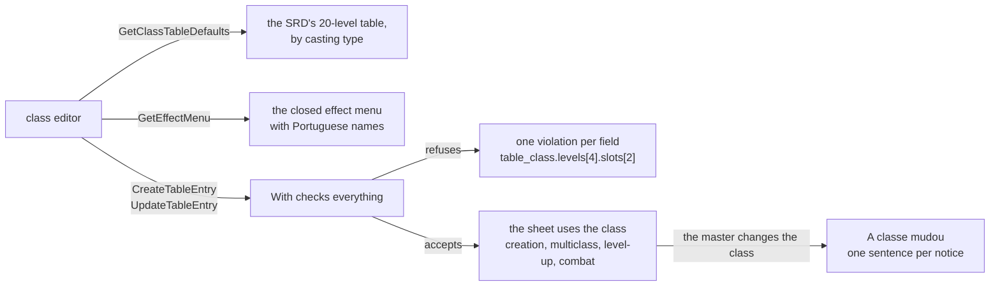

| Piece | What it does |
| --- | --- |
| The 20-level table defaults | `TableContentService.GetClassTableDefaults` (master only; `rules.Content.TableDefaults`). Returns the SRD proficiency bonus per level (+2 at levels 1 to 4 up to +6 at 17 to 20), the ability score improvement levels (4, 8, 12, 16 and 19), the subclass level (3) and **a 20-row table per casting type**: none, full, half, pact and a third (the subclass's), each "knows" or "prepares". The row is a `TableClassLevel` ready to be the class's `levels` (features come empty): bonus, cantrips known, spells known and the slots per level (nine numbers, or none before casting starts). The numbers are those of the SRD class tables, read from the SRD itself (never from the campaign's content: a campaign that fails to load does not break them): full and a third use the Wizard/Cleric's, half the Paladin's (starts at level 2), pact the Warlock's (one level only, all its slots), "knows" the cantrips and spells known of the Sorcerer (full), the Ranger (half) and the Warlock; "prepares" has no spells known. **The third caster**, which SRD 5.1 lacks, uses the full table at a third of the level, rounded up (2 slots at level 3, 4 and 2 at 7, 4/3/3/1 at 19), 2 cantrips (3 from level 10) and, the one that knows spells, 3 at levels 3 and 4 and one more every two levels, 11 at level 20: it is our default, written in our words, and the master changes whatever they want. The reference (`reference_class_key`) says which SRD class the numbers come from. |
| The closed menu as data | `TableContentService.GetEffectMenu` (master only; `rules.Content.EffectMenu`). Returns the nine effect types with the name and sentence in Portuguese, each one's fields (what is required, the field's type and the list it points to, a number's limits) and **all the closed lists** with Portuguese names: the modifier targets (AC, HP, speed, weapon attack and damage, a skill, a saving throw), the modes (add, at least, set), the proficiency targets (skills, saves, initiative, armor, weapons and tools), the levels, the advantage or disadvantage modes and targets, the senses, the recharges, the action economies, the choice kinds, the skills, the languages, the tools and the tag prefixes. It also carries **the SRD option lists** that a "one option from a list" choice can offer (fighting styles, invocations...), the formula functions (`level()`, `classLevel("<class>")`, `mod("<ability>")`, `score("<ability>")`, `prof()`, `armor()`, `shield()`, `floor`, `ceil`, `min`, `max`) with each one's sentence, the class indexes `classLevel` accepts (the SRD's and **the table's**) and the limits (60 features per class, 20 effects per feature, 2 to 4 attacks). The editor writes none of these lists; what it offers, the server accepts: `TestEffectMenuIsWhatTheValidatorAccepts` puts each value of each list in an effect and checks that `With` accepts it, and that the types, fields and required ones are what the validator reads. The names are in Portuguese: the tools have the sheet's name, and two option lists with the same name carry the class ("Estilo de Luta (Guerreiro)", "Metamagia (Feiticeiro, nível 3)"); `TestEffectMenuNamesArePortuguese` checks it. **A field the effect type does not read** is refused only **on writing the entry** (create, edit and unarchive); in an already stored entry it is ignored on read (`Overlay.Strict`), so a lost field never makes a campaign unreadable (`TestStrayEffectFieldsAreIgnoredWhenRead`). The menu offers a subset of what the engine understands (a `damage.spell.<spell>` or the choice of a spell by key, for example, are left out): it never offers what the server refuses. |
| One field per rule | Every refusal of a class or subclass comes out as a `TableContentViolation` with the **exact field** the editor draws, in the proto's names and with its indexes (`table_class.levels[4].slots[2]`, `table_class.casting.list_from`, `table_class.skill_from[2]`, `table_class.levels[0].features[0].effects[0].max`, `table_subclass.always_prepared[1].spell_key`, `table_subclass.casting.start_level`), and a stable reason (`bad_table`, `bad_casting`, `bad_value`, `bad_formula`, `forbidden_effect`, `dangling_reference`, `limit`...). A formula that does not compile points to the `value`, `when` or `max` that failed; a field the effect type does not read (a `recharge` on a modifier, a `count` on a sense) is refused **at that field**, with `bad_value`; the multiclass bonus points to the ability (`table_class.minimums.wisdom`). `TestClassRefusalsNameTheirField` (`rules`, over 60 cases, each rule with the field and reason) and `TestTableClassRefusalsPointAtTheirField` (`characters`, through the API, and a refusal changes nothing) are the list. What `With` says about the **whole content** keeps the field empty, and the 300-entry limit has the reason `limit`. |
| Multiclass at creation | `CreateCharacter` already accepts a sheet with more than one class, each with its subclass, the table's included. The SRD prerequisites of each class (the first too) are sheet **notices** (`multiclass_prerequisite`), never a refusal, like the rest of the choice rules; a subclass before its level is the `subclass_level` notice. HP follow the table rule (RN-24): with "roll", the whole calculation is of levels after the first, **summing the classes** (`HIT_POINTS_RULE` refuses the average and missing rolls), and the first level is the first class's full die. Spell slots are those of the multiclass caster table: full counts the level, half half (rounded down), the third caster a third (rounded down) and the table class with the same arithmetic as the SRD's, with pact apart. |
| The casting subclass at level-up | `LevelUpSubclass` carries what the third caster adds on choosing the subclass: `spells` (how many spells known), `spells_kind`, `spell_list_class_key` (the class whose list they come from) and `max_spell_level`, and, for the one that **prepares** instead of knowing, `prepares` and `prepared_max_after` (how many it may prepare at the new level, already with the subclass). Without them the level-up screen would not know how many spells to ask for nor from which list. The subclass's always-prepared spells enter the sheet at their level and do not count against the limit; the slots and cantrips come from the subclass table's row. |
| "A classe mudou": the sentences | `rules.Issue` carries `ChangeMessage` and `ChangeSubject`: the sentence of the same notice as a **change** is told, without the entry's name, and the class or subclass it talks about. Only notices tied to a table entry (`Issue.Keys`) have one. `ChangedContent.messages` carries these sentences, built where the changed entry is known (`changeSentence`): **the name enters only when the sentence is about the very entry that changed**; about any other, the sentence comes out nameless and capitalised (an SRD class whose number changed because a table race's trait changed is never named). `DerivedSheet.issues` and the notice's identity (`code`, field and sentence) keep the neutral sentence, which also holds in a draft, and that is why `content_baselines` does not change. The sentences: **skills** "Guardião do Vale agora dá 2 perícias no nível 1; esta ficha tem 3." (with another skill source, "O total de perícias para escolher agora é 4; esta ficha tem 3."), **cantrips** "Mago agora conhece 3 truques; esta ficha tem 4.", **spells known** "… agora conhece 5 magias; esta ficha tem 6.", **spells prepared** "… agora prepara 4 magias; esta ficha tem 5." (with a single caster and no other source; the third caster is named by the **subclass**; otherwise, "O total de magias preparadas agora é 4; esta ficha tem 5."), **the subclass level** "Guardião do Vale agora escolhe a subclasse no nível 5; esta ficha tem nível 3 nela.", **multiclass** "Guardião do Vale agora pede outras habilidades para multiclasse; os desta ficha não cumprem." and **an SRD option the table feature stopped offering** "Guardião do Vale agora não oferece a escolha Estilo de Luta: Defesa; ela não vale mais nesta ficha." The option notice is tied to the entry **where the option list comes from** (the table class or subclass whose feature offers options of the same SRD set), never another entry of the sheet; if no feature offers it any more, there is no entry to blame and the notice does not appear in "A classe mudou" (the sheet keeps the ordinary notice, which says the option no longer holds for the character: it stores the SRD option, not the table feature that offered it). A sentence says what the entry gives today and what the sheet has, in the singular when it is 1. The other notices (a spell that left the class list, for example) use their own sentence. |

**Tests.** `rules` (no database): `TestTableDefaultsFollowTheSRDTables` and `TestTableDefaultsMakeValidClasses` (each default becomes a class `With` accepts and that levels from 1 to 20 through the same sweeper as `TestLevelUpSweepTable`, the third caster as a Fighter subclass), `TestEffectMenuIsWhatTheValidatorAccepts`, `TestEffectMenuRequiredFieldsAreRequired`, `TestEffectMenuFormulaHelpers`, `TestClassRefusalsNameTheirField` and `TestChangedClassSentences`. With database (`characters`): `TestTableClassEditorStartsFromTheServer` (only the master reads; the defaults are the SRD's; a class from each default table and the default third caster are accepted unchanged), `TestTableClassRefusalsPointAtTheirField`, `TestTableClassMulticlassAtCreation` (Corvina, Maga 3 and Clériga 1, each with a table subclass; Guardião 2 and Mago 2; Guerreiro 3 with the third caster and Mago 2; the prerequisite and the early subclass become notices), `TestTableClassMulticlassHitPointsFollowTheRule`, `TestTableClassCreationAndLevelUp` (Ícaro, the Guardião do Vale with the "Outro" background, from level 1 to 5: the average, the fighting style at 2 with the slots and prepared spells, the subclass at 3 with the always-prepared spells, the ability score improvement at 4 and the table slots at 5), `TestTableClassThirdCasterCreationAndLevelUp`, `TestTableClassSubclassPickedAtLevelUpGivesItsSpells`, `TestTableClassChangeIsTold` and `TestTableClassThirdCasterChangeIsTold` (each ordinary change, with the exact sentence, and the notice that disappears by itself). And in `play`: `TestMR025_AThirdCasterOfTheTableCastsATableSpell` (the Lâmina de Nanquim, a table spell on the Wizard list, cast in combat by a level 5 Fighter of the Lâmina de Tinta: the attack with Intelligence and the subclass's proficiency, its table's slots, the 2d8 damage and the log).

**The client.** The character editor, level-up and the sheet draw what the server sends, without computing a rule:

| `web` piece | What it does |
| --- | --- |
| `character-editor-source.live` (the catalogue) | Reads the table flags from `ListContent` (the `@mesa` key and `archived`), each class's skills and saves (`skill_choice`, `saving_throws`), the list a table class reuses (`ClassSpellcasting.list_class_key`), the third-caster subclass's casting (`Subclass.spellcasting`), the race's choice bonuses and the background's equipment. The "Outro" tools and languages are the only list the browser keeps (`tools-and-languages.ts`: the SRD keys, our names), because the catalogue does not carry them yet |
| `class-blocks.ts` | The arithmetic only of **splitting** what the catalogue gives: total level, each level's die after the first (in class order, the order of `HitPoints.rolls`), and the spell sections (one per casting class or casting third-caster subclass, with the list, which class it comes from, and the highest level at its level). No prerequisite, hit point or spell slot is computed there: they are notices and numbers of the sheet |
| `EditorStepper` | Builds a step's content the first time it opens and keeps it; the `eager` step ("Habilidades" under table rules) comes from the start. It is what stopped the editor tests from building five steps per test |
| `levelup-flow.withSubclass` | Folds into the server's options what the chosen subclass adds (`LevelUpSubclass` 8 to 13: the spells, from which list, up to which level, whether it prepares and the maximum); the steps and lists read the "effective" options. Before the choice, and for a non-casting subclass, they are the server's options, untouched |
| `ListContent` with `character_id` | Editing (and level-up) asks for the catalogue **with the sheet**: the server (`ownSheetKeys`, the same keys as `callerKeys`' `BuildKeys`) returns, besides the player's catalogue, the entries **that** sheet uses, even archived or switched off, still with `archived`/`off`; never those of another sheet. It is only for the sheet's own full sheet, also a pending member's, who edits the character while waiting for approval (RN-15): another sheet, an NPC, a basic sheet and one that does not exist get `not_found`; the master receives the usual whole catalogue. It does not go to the catalogue cache (it depends on the sheet). What comes out in references stays clean: a domain that prepares a hidden spell does not name it. Tests: `TestListContentGivesBackTheCallersOwnSheetsRetiredEntries`, `TestListContentGivesAPendingMemberTheirOwnDraftsRetiredEntries`, `TestListContentKeepsAnArchivedTableSpellTheSheetKnows` |
| `NamedKey.kind` and `Subclass.always_prepared` | `NamedKey` carries `kind` (`NamedKeyKind`: tool, armor, weapon, skill, save, language, other): "Outro" offers the tools and languages without guessing from the key, and `TestCatalogNamedKeysSayWhatTheyAre` checks every proficiency has one. `Subclass` carries `always_prepared` (the spell key and the class level, without those that depend on a feature choice): the editor shows the always-prepared ones on creation. `TestCatalogSubclassesCarryTheirAlwaysPreparedSpells` |
| `LevelUpClient` and the catalogue | The client belongs to the page (`LevelUpPage`'s `providers`): the catalogue and the descriptions it keeps hold while the page exists, never beyond a reload; it reads with `character_id`, and `catalog(…, fresh)` reads again inside the page (`content_changed`, stale sheet), with the `table_revision` it saw. A player's page and editor listen to the open session stream's `content_changed` (`XpWatcher`, the fourth callback; the master's editor does not open the stream, because they write the content, and an NPC sheet open in a live campaign would hold a connection for nothing) and read the catalogue again (the editor without touching the form, level-up rebuilding the session and carrying the choices that still hold; a die rolled in the app whose answer arrives after the rebuild lands on the new session, through `LevelUpSession.handOver`). A key the catalogue does not know never reaches the screen: "uma opção que saiu da lista" |
| `changed-content` | The "A classe mudou" notice and the "O que mudou" sheet, from `DerivedSheet.changed_content`; the sheet's pending list does not repeat the sentences (`table_content_changed`) |

### Ability scores of a new sheet (RN-24)

When a **player** creates the sheet, the server checks the base scores (before the race bonus) against the method they said they used (`CreateCharacterRequest.ability_method`) and against the methods the table allows (`TableRules.AbilityMethodsOff`); the check is creation only, and the master's NPCs and the master's later edits stay free. The arithmetic is pure, in `rules/abilitymethods.go`: the standard array (15, 14, 13, 12, 10 and 8, each once, in any order), point buy of 27 points (each value from 8 to 15, at most 27 points spent, costs 0, 1, 2, 3, 4, 5, 7 and 9), 4d6 (the six stored results, each once) and typing (3 to 18). The first three methods come from SRD 5.2.1 (CC BY 4.0, p. 20; in `NOTICE`). The refusal is `failed_precondition` with the `AbilityScoresRefusal` detail (the reason and the method: `METHOD_NOT_ALLOWED`, `NOT_STANDARD_ARRAY`, `BAD_POINT_BUY`, `NO_ROLLS_STORED`, `NOT_THE_ROLLS`, `TYPED_OUT_OF_RANGE`); a malformed sheet stays `invalid_argument`, before. **The server records the method on the sheet** (`FullSheet.ability_origin`: the method and, for 4d6, the six sets, since the stored ones are spent by creation). The value the client sends is always ignored (on creation and edit), and an NPC never has it. In `UpdateCharacter`, while the sheet is the player's draft, **the player's** edit that changes the base scores is checked against the recorded method (`keepAbilityOrigin`; the same `AbilityScoresRefusal` refusal); the master edits freely, and a sheet without a record is not checked. Without `ability_method` is the app from before the rules: while the table allows all methods, only the sheet's usual check holds (1 to 30 in each value), so an app that does not send the field yet keeps working; when the master switches a method off, the field becomes mandatory (`METHOD_NOT_ALLOWED`), because there would be nothing to check against.

**The server's 4d6.** `RollAbilityScores` rolls six sets of four d6 with `platform/dice` and stores them in `character_ability_rolls` (one per player and campaign); calling again returns the same sets (`already_rolled`), so reloading the screen does not roll again, and `GetAbilityRolls` reads them without rolling. The `CreateCharacter` that uses the sets deletes the row in the same transaction, and the next sheet rolls again; a refused sheet does not spend them. **With physical dice (RN-18)** the player types the six sets of four dice, once (`typed_dice`, each die 1 to 6; the server drops the lowest of each set): a table that forces the app refuses typed dice (`DICE_FORCED_IN_APP`), one that forces physical refuses the server's roll (`DICE_FORCED_PHYSICAL`), "each player chooses" accepts both; typing other dice again is `ROLLS_ALREADY_STORED`, and the same dice are a repeat. The dice rule comes from the same `DiceRules` as level-up. Who rolls is the player or the pending member (RN-15); the master gets `permission_denied`. **The manual bonuses:** positive `extra_ability_bonuses` do not exceed what the race lets you place (the half-elf's choice or a table race's) plus 2 per Ability Score Improvement reached (`rules.FreeAbilityPoints`), on creation and on editing the player's draft; the refusal is `EXTRA_BONUSES`. **Creation HP** above level 1 are checked against the table rule (`HIT_POINTS_RULE`). `ContentSource` carries `ContentFor`, which returns only the content, without reading the rules: what does not need them (`contentFor`) does not pay for the read. `AbilityOrigin` also stores `typed` (the typed 4d6, not rolled by the server); an unknown `ability_method` is `invalid_argument`. Reading the rule and the row happens in `CreateCharacter`'s transaction, through the `tx`. Tests: `TestRN24_TheScoresFollowTheMethod`, `TestRN24_ATableCanSwitchMethodsOff`, `TestRN24_TheServerKeepsTheFourD6`, `TestRN24_PhysicalDiceAreTypedOnce`, `TestRN24_ThePendingMemberMakesTheirScoresToo`, `TestRN24_TheTableRulesAreReadInTheCallersTransaction` and, in `rules`, `TestCheckStandardArray`, `TestPointBuy`, `TestCheckTyped` and `TestAbilityRolls`. **The app** does not roll in the browser (`crypto.getRandomValues`) for the player: it asks `RollAbilityScores` for the sets, sends `ability_method` on creation and reads the methods that hold from `GetTableRules` (see [Table rules screens](#table-rules-screens)); the master, on NPCs, still rolls in the browser.

### Approving or refusing the character

The character created by a [pending member](#pending-member) is born `CHARACTER_STATE_PENDING` (RN-15, MR-024). The player edits the sheet and backstory while waiting; the game session does not lock it, and it does not die. The master sees it in "Esperando aprovação", in the campaign's "Personagens" section, opens the sheet and decides:

- **`ApproveCharacter`**: the character becomes a draft (RN-01 holds as always: it locks at the next session), and the player's membership becomes active. Approving again, or approving a character that never waited, changes nothing.
- **`RejectCharacter`**: the character is deleted, with the backstory and the master notes, and the pending membership too. The player no longer sees the campaign and needs a new invite. Only valid for a pending character; for others, `failed_precondition` (`NOT_PENDING`).

Both touch two tables of two modules, in one transaction: `characters` changes the character and asks `campaigns` to change the membership, through the `characters.PendingMembers` interface (`ActivatePendingMember` and `DeletePendingMember`), which `campaigns.Service` implements and `cmd/api` wires, as `play` does with `SheetLocker`. Neither package imports the other. Both lock the character row first (`SELECT ... FOR UPDATE`), so an approval and a refusal at once happen one after the other: the second finds the character already active (the refusal gets `failed_precondition`) or already deleted (the approval gets `not_found`), never half of each (`TestRN15_ApproveAndRejectRace`).

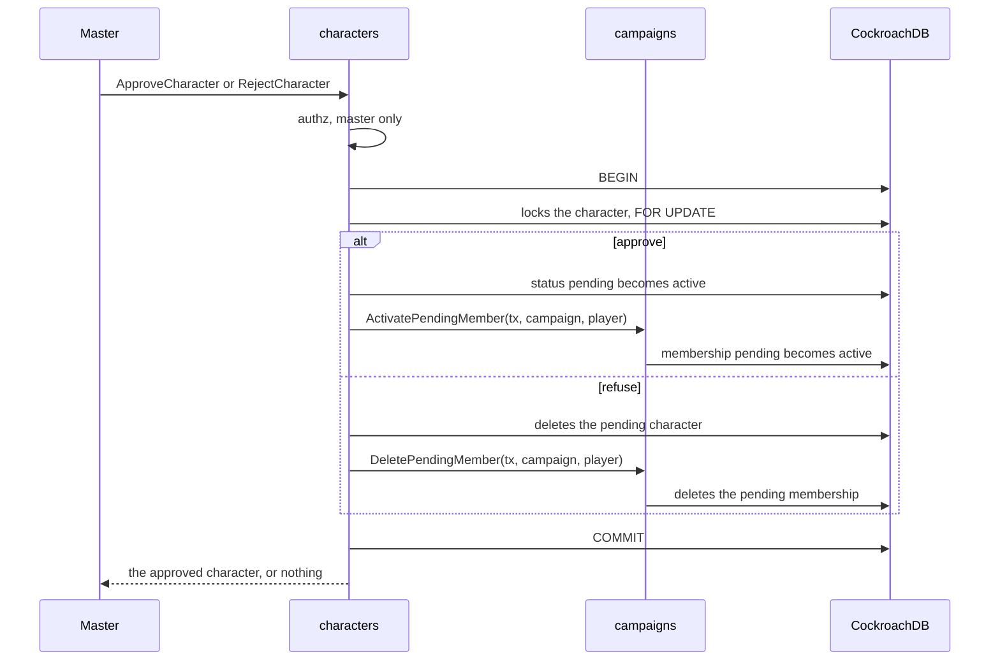

On screen, the pending sheet shows the player "Esperando a aprovação do mestre", and the master the "Aprovar personagem" and "Recusar personagem" buttons; refusing asks for a confirmation ("Confirmar recusa"), because it deletes the character for good.

### Leveling up from the sheet (MR-040)

The player levels the character up from the locked sheet, only while `can_level_up` is true (RN-01, RN-12). The `characters` module does the part that needs the database; what a level gives and what the sheet may change is `rules`' (see [Level-up](#level-up-mr-040)). Five `CharacterService` calls, in the who-may table above:

- **`GetLevelUpOptions`** (read, `IDEMPOTENT`): the class's `LevelUpOptions` (the first, if `class_key` is empty) with Portuguese names, the campaign's dice rule (`dice_rule`) and the die the server already rolled, if any (`kept_hit_point_roll`). For the master and the owner.
- **`PreviewLevelUp`** (read, `IDEMPOTENT`): the derived sheet of afterwards, with the choices applied, and the first refusal, if any (`LevelUpRefusal`, as data, not as an error). It is the "Resumo", the before and after: the web app has no rules engine, so the server does the arithmetic, including the new maximum of prepared spells after an ability score improvement. It stores nothing.
- **`RollLevelUpHitPoints`**: the server rolls the class's hit die with `platform/dice` and stores the result in `character_level_up_rolls`, per character and level (not per class: a two-class character rolls once per level). Calling again, with the same key or another, returns the same roll (`already_rolled`); asking for another class is refused (`HIT_POINT_ROLL_OTHER_CLASS`). A campaign that forces physical dice refuses it (`DICE_FORCED_PHYSICAL`). Owner only.
- **`LevelUpCharacter`**: receives the revision and the choices, builds the new sheet from the stored one (the client never sends the sheet), runs `rules.Validate` (`invalid_argument` for what is malformed, like a key that does not exist) and `rules.CheckLevelUp` (`failed_precondition` with the `LevelUpRefusal` detail: the field and the reason), and stores, in the same transaction, the sheet (with the revision check, `aborted` if stale) and the record in `character_level_ups`, and deletes the die used. The order of refusals: dead or pending character, stale revision, "cannot level up", the stored sheet that no longer passes today's rules (`SHEET_NEEDS_MASTER`: no choice fixes it, the master corrects it through the editor), die, rules. Owner only; the master keeps the editor (`permission_denied`). After storing, it publishes `xp_changed`.
- **`ListLevelUps`** (read, `IDEMPOTENT`): the master's "O que mudou": the campaign's level-ups, or a character's (`character_id`), newest to oldest, in pages (`page_size` 1 to 50, opaque `page_token`, like the XP history), each with the player, the class, the level before and after, the choices (`LevelUpChoices`, with the value the HP took), the Portuguese names of each key and the time. It is the **smaller** read that draws state 6 of the screen: the master is told through the stream and reads the list, with no approval or veto. Master only.

**Dice and RN-18.** The campaign's rule comes from `campaigns` through the `characters.DiceRules` interface, wired in `cmd/api` (the same design as `play.DiceModes`): `FORCED_PHYSICAL` refuses the app's die, `FORCED_IN_APP` refuses the typed number, and with "each player chooses" each roll's applies (the saved preference only says which option the screen highlights). The typed die is a number from 1 up to the class's die; outside that is `HIT_POINTS`.

**HP and the table rule (RN-24).** The level HP rule (`TableRules.HitPoints`, read together with the content, in the transaction) says which method holds, and holds in both calls: with "roll", the average is refused; with "the average", every die is refused. `GetLevelUpOptions` says which holds in `hit_points_rule` (`PLAYER_CHOOSES`, `ROLL_ONLY` or `AVERAGE_ONLY`), apart from `dice_rule`, which says where to roll. `LevelUpCharacter` and `PreviewLevelUp` with a method the rule does not accept give the `HIT_POINTS_RULE` refusal (field `choices.hit_points.method`); a `PreviewLevelUp` without a method has not chosen yet and is not refused. `RollLevelUpHitPoints` on an "average only" table is `failed_precondition` with `CharacterBlocked` `HIT_POINTS_AVERAGE_ONLY`. A die stored from before the rule changed stays stored, and the rule applies at the time of leveling. Tests: `TestRN24_TheLevelUpFollowsTheHitPointsRule`.

**Live.** Level-up reuses the notice the sheet and list already listen to, `xp_changed` (stream field 14, contentless): it already means "read the XP and levels again", and level-up changes exactly that (the sheet's level and `can_level_up`). `characters` calls `PublishXPChanged` through the `characters.Live` interface, which `play` implements and `cmd/api` wires. It does not take field 20.

**The record and the "can level up" that disappears.** Nothing needs to clear `can_level_up`: it comes from the sheet's XP and the milestone mark, and the sheet's level changed (see [RN-12](product/rules.md)). Level-up does not touch XP: the XP campaign stops asking for the level when XP does not reach the next, and the milestone one when the level passes the mark's. `TestMR040_CanLevelUpClearsAfterwards` checks both.

### Level-up screen (MR-040)

The page `/campaigns/:id/characters/:characterId/level-up` (lazy route, `pages/level-up`) is only a client of the five calls above: the browser computes no rule (ADR-0008). `core/levelup` holds the screenless part: `LevelUpClient` (the calls, plus the campaign's content and dice preference), `levelup-flow.ts` (each level's steps and the pickers' lists, which come from the server and the content), `LevelUpDraft` (the choices in signals, what is missing and the `LevelUpChoices` to send), `levelup-summary.ts` (the "before → after" lines, from the two derived sheets), `levelup-errors.ts` (refusals by code and reason, never by message) and `LevelUpFeed` (the master's read).

- **On every choice** `LevelUpPreview` calls `PreviewLevelUp` (with a 150 ms debounce; a response overtaken by a newer one is discarded) and the screen reads from it the "O que muda", the new maximum of prepared and the first refusal (the 20 cap on abilities is its: the screen only shows the reason). With the hit die rolled, it also calls with the average, so the "Média: 4" card shows the life with it. The screen does no rule arithmetic: it shows the server's numbers and the terms ("4 + Constituição +3").
- **The steps:** Habilidades, Vida, Magias and Resumo; a step with no choice does not exist. "Escolhas" (subclass, feature options, skills, expertise) enters before Magias, because the subclass may give cantrips.
- **Saving** is a single call, `LevelUpCharacter`, on "Confirmar o nível N", with the revision read. `aborted` (stale revision) and `LevelUpRefusal` appear in place; the confirmation returns to the sheet through the navigation state (never Web Storage), and the sheet removes it from the history after reading, so a reload does not show the notice again. "Ler a ficha de novo" after a stale revision rebuilds the session with the new sheet and options and carries along the choices that still hold. `LevelUpCharacter` has no idempotency key (a retry is a stale revision, never a second level), so when the answer to a confirmation is lost, the stale retry reads the sheet and, if it is already at the level asked for, goes to the sheet as after a confirmation.
- **The master:** `LevelUpFeed` reads `ListLevelUps` in the campaign (one page of 50) and the list reads all the pages and the page reads again on `xp_changed` when the campaign has an open session (`XpWatcher`, the same client as the sheet's stream). "Recente" is "confirmed in the last 24 hours", storing nothing in the browser; dismissing the notice holds until reload.

### Bestiary and creating an NPC from a creature (MR-042)

The bestiary is the `ListCreatures` list (see [Creatures, summons and Wild Shape](#creatures-summons-and-wild-shape-rules)): there is no second list, and the Wild Shape and summon callers send the same fields and receive the same rows. Access: an active member reads, the pending member gets `not_found`; the player may see the bestiary (it is SRD rule), but reading a combat never carries a monster's numbers (RN-20, RN-29).

**"Criar NPC"** is `CharacterService.CreateNpcFromCreature` (`characters/npcfromcreature.go`): master only, `MINION` ("Minion", the default the app offers) or `STORY` ("NPC de história"; the full sheet of `ENEMY` and `BOSS` asks for class and race, which a creature lacks). The server builds the `BasicSheet` from `Content.CreatureByKey` and `MonsterDerived`, and passes it through the same checks as a typed basic sheet (`cleanBasicSheet`): AC, average HP, speed (the walking one, or the largest it has), initiative (the Dexterity modifier), size, CR, XP, the abilities (`ability_scores`) and up to three weapon or spell attacks, with the bonus, the reach and the first damage (`BasicAttack` holds a single damage: the other parts, like the extra fire of the dragon's bite, go in the sheet's description, "Mordida: +2d6 fogo."; the save and other effects stay in the SRD sheet, and an attack without damage or with a die the sheet lacks, like d20, is left out). The attack names come out in Portuguese (`attack:<name>`, for the 334 creatures), plus `monster_key`, the link to the creature. The two new fields are server-only: `checkSheet` zeroes them on input, and `UpdateCharacter` keeps the saved ones (`keepCreatureLink`), so the link survives the master's edits. It is a copy: the numbers do not follow the creature afterwards. Idempotency is `characters.create_key` with a partial unique index (`INSERT ... ON CONFLICT DO NOTHING`, and a repeat reads the NPC that already exists and checks that the request is the same, else `invalid_argument`); the NPC, like every NPC, belongs to the master and the player neither lists nor reads it (RN-04), and its token on the map is born hidden (RN-10). Everything in the same transaction, only with `WithTx`. Every field-level `invalid_argument` of `CharacterService` carries the `InvalidField` detail (the field name), so the app can say which field without reading the message (`TestCreateNpcFromCreatureNamesTheField`).

**In the browser**, the bestiary is two lazy routes, `campaigns/:id/bestiary` (the list) and `campaigns/:id/bestiary/:creature` (the sheet, with "Criar NPC"), and the campaign page's "Bestiário" panel. Only the master sees them: since the server lets any member read the SRD, the page asks the campaign for the role (`BestiaryAccessCheck`) and tells the player it is the master's. The list asks for the 334 creatures in one call (`page_size` 400) and filters on the server (name, type, size, `min_cr`/`max_cr`); the search lives in the address parameters. The sheet reuses `StatBlock` (with `full`). The "Criar NPC" idempotency key is born once per opened dialog; the AC, HP, speed and abilities the dialog shows come from the creature sheet, and the attacks that go along come from the server (`Creature.npc_attack_names`, which `GetCreature` fills with the very function `CreateNpcFromCreature` uses to build the sheet, so the two never differ; `TestGetCreatureNpcAttackNames`).

### Table content in the browser

The table content screens (MR-025, RN-23; design E10-01) use only the server of [Live table content](#live-table-content), [Spell targets](#spell-targets-and-the-magias-page) and [Table classes](#table-classes-and-subclasses-end-to-end) (`TableContentService`, `ContentService.ListContent`): the browser does no rule arithmetic nor writes any list, and what the server refuses comes back on the field.

- **The route** `/campaigns/:id/content` (`pages/content/content.routes.ts`, `loadChildren`, so the editors and the client stay out of the initial bundle): `''` is the list (`content-list`), `new/:kind` and `entries/:key` are the same entry page (`content-entry`), which picks the editor (spell, race, subrace, background, class, subclass) when the caller is the master on a notebook, and the read view (`entry-read`) in any other case: the player and the master on the phone. The entry's key (`race:corujeiro@mesa`) is a single segment, encoded.
- **The client** (`core/content/content-client.ts`, `TableContentClient`): the list, the writes (`save` creates or swaps the body with the revision the editor read), archive and unarchive, the effect menu and the campaign catalogue. Failures are read through the typed detail (`TableContentRefusal`, `TableContentBlocked`), never the `message`. Each violation arrives at the field's exact path, and all of the entry's at once (`OverlayError.More` in `rules`; the table of paths is `entryViolationRows`, in `overlay_paths_test.go`, and `content-violations.spec.ts` keeps a copy, with the Go test's name).
- **The drafts** (`spell-draft`, `feature-draft`, `effect-draft`): the form as plain values, with distances in metres (5 ft = 1.5 m; `rangeFeet` and `rangeMeters` are the only arithmetic) and the conversion to the request body. The body carries **only** what the choice uses: a spell's mechanics (`Só texto` has no attack, save, damage or healing), the shape and size only on an area, and, for an effect, only the fields that the server's menu says the type reads (`draftToEffect`).
- **What comes from the server and what is screen text:** the effect menu (`EffectMenuVm`, from `GetEffectMenu`: the types, each one's fields, the closed lists with the Portuguese name, the SRD options, the formula functions and the tag prefixes), the abilities, damage types, languages, proficiencies, skills and schools (`Content`, from `ListContent`, which every member reads) and the race bonus limit (−4 to +4, the server's `maxRaceBonus`, written once in `feature-draft.ts`) come from the server; the picker (`shared/effect-picker`) and the editors draw what it sends. The browser keeps only screen text: the fields' labels, the hints, the refusals' sentences (`content-violations.ts`) and the shape and mode options (cone, cube, action, minutes), which are screen names of closed `.proto` fields.
- **From violation to field** (`core/content/content-violations.ts`):

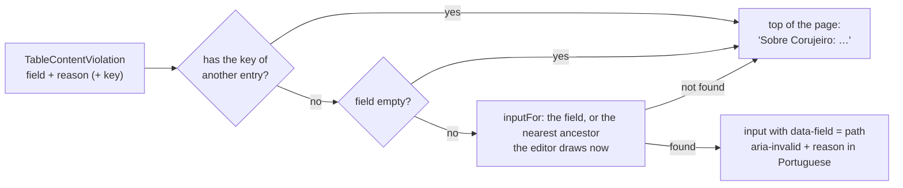

  Every editor field carries its own path in `data-field` (`table_race.traits[1].effects[0].value`), so the path finds the field without a table per editor; what the editor draws now (a mechanic's fields, an effect type's, the rows that exist) comes from one function per editor (`spellFieldPaths`, `featurePaths`). The text comes from the reason and the path's shape (`violationText`: indexes become `[]`), in Portuguese, and focus goes to the first field with an error (`focusField`).
- **The archive question** is `archive-question` (in place, on the notebook) or `archive-sheet` (bottom sheet, on the phone, through `openSheet`). Unarchiving asks nothing. After a write that changes an entry in use, the response carries `affected_characters` and the page lists "Fichas com aviso".
- **The player** reads entries through `ListTableEntries` (the server already removed the archived and the count) and `core/content/content-read.ts` writes them in rows and sections (the class shows the hit die, "Testes de resistência", skills, armor and the features by level). The effect menu is only read by the master, so the player sees the feature's text and, of the effects, only what a sentence says without the menu (proficiency in a skill, sense, resource with a number, extra attack).
- **Shared pieces and where they live:** `shared/segmented` (the options picker that used to be combat movement's), `shared/sheet` (`sheet-host.ts` and `sheet-frame/`: the bottom sheet on the phone and the dialog elsewhere; a sheet that sends a create or a write calls `lock(true)` while the request runs, so Esc and the backdrop do not close it and the answer is not lost to a second try under a new idempotency key, and its own Cancelar and ✕ do nothing meanwhile; unlocking puts back what the sheet was opened with, so an alert that must be answered stays undismissable; every sheet and dialog with a request in the air does it, the adjust-vitals and start-combat dialogs included), `shared/form-fields`, `shared/effect-picker` and `shared/feature-editor`; the old paths in `pages/live-session/combat/` only re-export. The class and subclass editors reuse them all.
- **The "Disponível para os jogadores" switch** of each editor and the "Opções para os jogadores" screen use `ListOptionSwitches`/`SetOptionSwitches` (see [Player options and the live hint](#player-options-and-the-live-hint)); the switch belongs to the entry (`TableEntry.off`), never to the class body.
- **Tests:** Vitest (`core/content/*.spec.ts`, `pages/content/**/*.spec.ts`) and Playwright (`e2e/tests/content.spec.ts`, `@MR-025`, `@RN-23`, `@RN-10`), plus the screens in `a11y.spec.ts`.

### Class and subclass editors

Design E10-02, states 1 to 4 and the master's part of 8. They use only the server of [Table classes and subclasses](#table-classes-and-subclasses-end-to-end) (`GetClassTableDefaults`, `GetEffectMenu`) and the live-content writes; the browser does no table arithmetic.

- **The numbers come from the server.** `TableContentClient.classDefaults` brings the proficiency bonus, the ability score improvement levels, the subclass level and a 20-row table per casting type (none, full, half, pact and, for the subclass, a third, each preparing or knowing). `core/content/class-draft.ts` pastes those rows into the draft (`rowsOfTable`), says whether the master edited them (`rowsEdited`, for the "Refazer a tabela dos 20 níveis?" question before swapping the casting) and returns them as `levels` (nine slots per row, or none). Whoever reads a stored class with `start_level` 0 receives the default's. The multiclass prerequisite (`minimums` and `any_of`) and what the class gives whoever enters it later (proficiencies and skills) are shown and edited, one row per requirement (ability, minimum, remove), and the subclass level sits in the "Subclasse" section, above the class's subclass list. A stored third-caster subclass is compared with the default only on the casting columns (the server's rows carry no bonus), so swapping "Preparadas" and "Conhecidas" on it does not ask to redo the table without there having been an edit.
- **The features** are a single list, with each one's level; the request puts each under its level, and `classFeatureBase` says where (`table_class.levels[4].features[0]`), so the refusal of `…features[0].effects[0].value` lands on the right field and opens the closed feature. The "N de 60" counter uses the menu's limit. Each feature is the `feature-editor` from the content screens, with its level beside it.
- **The grid** (`shared/level-grid`) scrolls inside (fixed height, titles pinned on top, the level pinned on the left), one `<input>` per cell with `data-field` (`table_class.levels[4].slots[2]`) and `aria-label` ("Nível 5, espaços de magia de 3º nível"); arrows change row and Page Down jumps five. It shows the levels the casting type's default uses, and "Mostrar os 9 níveis de magia" opens the rest. The third-caster subclass uses the same grid, without bonus and without features, from the level casting starts (`subclassLevels` says which rows the request carries).
- **The refusals, all at once:** `addClass` and `addSubclass` (`overlay_class.go`) gather the violations with `entryErrors`, each at its exact path (`TestAnEntryReportsEveryViolationAtOnce` has the class and subclass cases); the screen puts them on the fields. Two of them are not for a single field: "passou das 60 características" goes to the top of the panel, with the counter in red (`redirect` of `ViolationContext`), and an always-prepared spell's goes to the group of its level, since the request lists them in one list (`groupOfAlwaysPrepared`). What the request refuses on a whole row ("Nível 7, espaços de magia") appears under the grid, with the level.
- **The page** (`pages/content/class-editor`, `subclass-editor`, `class-parts/`): sections with the list beside (`SectionNav`: marks the section in view with an `IntersectionObserver`, says "Com erro" where there is a refusal and stays pinned while scrolling, at the side or as a strip on top below 1100 px), a fixed save bar at the foot, and the same refusal, archive and "Fichas com aviso" pieces as `content-entry`. Only the master on a notebook edits; on the phone they read (the table becomes the 20-level list of `content-read`). The armor, shield and weapon proficiencies are six check rows (the keys, with the server's names); the others come from the menu.
- **Tests:** `class-draft.spec.ts`, `class-editor.spec.ts`, `subclass-editor.spec.ts`, `content-violations.spec.ts` (the class refusals' rows, copied from `overlay_class.go`), `e2e/tests/classes.spec.ts` (`@MR-025`, `@RN-23`) and the screens in `a11y.spec.ts`.

### Table rules screens

The MR-025 screens that use the server of [Table rules](#table-rules-mr-025-rn-24), [Ability scores of a new sheet](#ability-scores-of-a-new-sheet-rn-24) and [Grid calibration](#grid-calibration) (design E10-03). The browser does no rule arithmetic: it shows the numbers the server gives and sends what the player chose.

- **The "Regras da mesa" page** (`/campaigns/:id/rules`, `pages/table-rules`, lazy route; the master edits and the player reads the rules in words, without controls, in `rules-read`; the campaign carries the "Regras da mesa" panel for both, and the master's "Dados" panel only summarizes the mode and links here). The `TableRulesClient` reads `GetTableRules` and stores `SetTableRules` (the whole page at once, with the dice mode) and `SetCampaignXpMode`. The page's **style** is computed in the browser from the three presets the server sends (`styleOf`: the dice, the combat and the fog match a preset, or it is "Personalizado"), because the person sees the style before saving; choosing a style only copies those three values (`applyPreset`) and the page says what changed. The ability-score methods' numbers (the array, the 27 points, the typing range) come from the server and go in the cards' sentences. The **XP mode** has its own flow (`xp-mode-panel`): `SetCampaignXpMode` without `confirm`; with XP already given, the `XpModeChangeBlocked` refusal opens the question in its place with the number of awards and XP, and only the confirmation sends `confirm`.
- **The "Habilidades" step** (`character-editor/table-ability-scores`, only for the **player** creating a sheet and the pending member; the master and NPCs keep the free editor). The editor's source (`CharacterEditorSource`) has `loadAbilityTable` (the rules, the numbers and the stored roll), `rollAbilityScores` and `CreateCharacter`'s `abilityMethod`. Each method writes the six numbers into the form and the step stays incomplete, with the reason, until the method finishes: the **standard array** uses the server's values and the same screen for placing the 4d6; **point buy** sums the costs the server gave ("Restam N pontos"); the **4d6** ask `RollAbilityScores` (never `crypto.getRandomValues`) and show the stored roll, the same after a reload; with a physical die (RN-18) the player types the dice once and the server stores them; **typing** goes from 3 to 18. The server's refusal (`AbilityScoresRefusal`) appears by reason in `describeCharacterError`. **The player's own draft** (editing before the sheet locks) shows only the method the server recorded (`FullSheet.ability_origin`, read in `loadCharacterForEdit`), with its limits and, in 4d6, the dice stored on the sheet; the master and sheets without a recorded method keep the free editor. **Creation HP** follow `TableRules.hit_points`, which `loadAbilityTable` brings (only "Rolado", only "Média" or both), and `CreateCharacter`'s `LevelUpRefusal` `HIT_POINTS_RULE` refusal has its own message. Physical dice only go to the server after the question "Guardar estas rolagens?".
- **Level-up HP** follows `LevelUpOptions.hit_points_rule`: with `ROLL_ONLY` the page shows no average and opens on the die; with `AVERAGE_ONLY`, only the average, no die; with `PLAYER_CHOOSES`, the usual two cards.
- **The calibration** lives in the map editor's "Grade" panel (`grid-panel`, and the question in `grid-panel/calibrate-ask`). `SetMapGrid` always carries the map's factor now (`MapsClient.setGrid(…, squareFactor)`): whoever changes only the columns sends the current factor, or the server would read 0 as 1 and lose the calibration. The "Mudar a grade?" question only opens when the change deletes the layers and something is painted or seen: for a larger factor that is a multiple of the current one, with the same columns, the screen saves directly (`core/maps/calibration.ts` says the effect: `scales`, `clears` or `same`, with `SetMapGrid`'s rule). The map draws the drawing's lines (every `square_factor` squares, solid) over the rules' grid (dotted). With a combat on the map, the button is off with the reason written, and the server's `COMBAT_RUNNING` refusal says the same.
- **Tests:** Vitest (`table-rules.spec.ts`, `table-ability-scores.spec.ts`, `grid-panel.spec.ts`, `level-up.spec.ts`, `calibration.spec.ts`...) and Playwright in `e2e/tests/table-rules.spec.ts` (`@RN-24`, `@RN-25`, `@RN-09`), plus the screens in `a11y.spec.ts`.

## Play module: game sessions

`play` starts, ends and lists a campaign's game sessions, which locks the sheets (RN-01), and handles the live session: the notice that the session started (RN-06), the session stream (ADR-0005) and the master's correction of HP, spell slots and hit dice (RN-02), each recorded in `session_events` (ADR-0007). It also runs combat: the encounter, who fights, initiative, turn order and movement on the grid (MR-013), and what is done on a turn: the options, the two-step attack, damage, standard actions, undo and the log (MR-012, MR-014; see [Combat](#combat)). The code lives in `backend/internal/play`.

| `PlayService` call | Who may | Own errors |
| --- | --- | --- |
| `StartGameSession` | The campaign master | `failed_precondition` (`SESSION_ALREADY_OPEN`) if a session is already open |
| `EndGameSession` | The campaign master | `not_found` if the session is not the campaign's. Ending again is not an error: it returns the session as it is |
| `ListGameSessions` | Campaign members | — |
| `ListOpenGameSessions` | Anyone signed in; each sees only the campaigns where they are an active member | — |
| `GetLiveSession`, `WatchGameSession` | Campaign members | `failed_precondition` (`NO_OPEN_SESSION`) without an open session |
| `AdjustCharacterVitals` | The campaign master, during the session | `failed_precondition` (`NO_OPEN_SESSION`); `not_found` if the character is not a living player character of the campaign; `invalid_argument` outside 0 up to the maximum |
| `SetCurrentMap` | The campaign master, during the session | `failed_precondition` (`NO_OPEN_SESSION`); `not_found` if the map is not the campaign's |
| `SetShownImage` | The campaign master, during the session | `failed_precondition` (`NO_OPEN_SESSION`); `not_found` if the image is not in the campaign gallery |
| `OpenScene` | The campaign master, during the session (opening another scene empties the stage) | `failed_precondition` (`NO_OPEN_SESSION`); `not_found` if the point is not a scene point of the campaign. Any scene point opens, even without actions; opening discovers the scene (MR-030) |
| `CloseScene` | The campaign master, during the session | `failed_precondition` (`NO_OPEN_SESSION`). With no open scene, it changes nothing; closing empties the stage |
| `GetOpenScene` | Campaign members | `failed_precondition` (`NO_OPEN_SESSION`) |
| `RollSceneCheck` | A player, with a living character, during the session | `permission_denied` for the master; `failed_precondition` (`NO_OPEN_SESSION`, or `SceneBlocked`: `NO_OPEN_SCENE`, `ALREADY_ROLLED` (no attempt left), `WRONG_DICE_MODE`, `NO_CHARACTER`); `not_found` if the action is not of the open scene; `invalid_argument` for a d20 outside 1 to 20 |
| `GrantSceneAttempt` | The campaign master, during the session | `failed_precondition` (`NO_OPEN_SESSION`; `SceneBlocked`: `NO_OPEN_SCENE`); `not_found` if the action is not of the open scene or the character is not a living player character of the campaign; `invalid_argument` for a key that is not a UUID, or already used by another change. On an unlimited action it changes nothing |
| `GetSessionSummary` | Campaign members | `not_found` if the session is not the campaign's; `failed_precondition` (`GameSessionBlocked`: `SESSION_NOT_ENDED`) for a still-open session. See [Session summary](#session-summary) |
| `PutOnStage` | The campaign master, during the session | `failed_precondition` (`NO_OPEN_SESSION`; `SceneBlocked`: `NO_OPEN_SCENE`, `STAGE_FULL` with 4 on stage); `not_found` if the character is not a living NPC of the campaign (or the ID is not a UUID). An NPC already on stage changes nothing |
| `TakeOffStage` | The campaign master, during the session | `failed_precondition` (`NO_OPEN_SESSION`). An NPC not on stage changes nothing |
| `SetSpeaker` | The campaign master, during the session | `failed_precondition` (`NO_OPEN_SESSION`); `not_found` if the NPC is not on stage. An empty `character_id` takes the floor from everyone |
| `ListLeftImages` | Campaign members, with or without an open session | — |
| `TakeBackLeftImage` | The campaign master, with or without an open session | `not_found` if the image is not in the left-images list |

The pending member (RN-15) gets `not_found` on everything that asks for a campaign, like a non-member; `TestAuthorizationMatrix` has a column for them.

**How `play` and `characters` meet.** Starting a session locks the sheets in the same transaction that opens the session. `play` does not touch the `characters` table: it declares an interface, `SheetLocker`, which `characters.Service` implements with `LockSheets`, and `cmd/api` wires the two. Neither package imports the other. `LockSheets` does not receive who is calling: it is "the system" of RN-01, and only `play` calls it, after checking that the caller is the master.

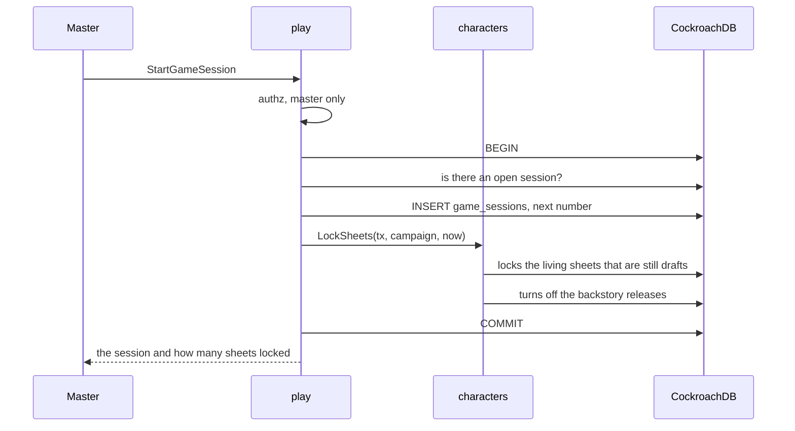

- **One open session per campaign.** The check inside the transaction gives the clear error; a partial unique index guarantees the rule when two calls race.
- **A character created later** than the first session stays a draft until the next one starts, because `LockSheets` runs at every session start, not only the first.
- **Ending unlocks nothing.** The sheet stays locked between sessions.

### Live session

The player learns of the session through a light poll, and follows the session through a stream that only exists while they have the session page open and visible (ADR-0005).

- **The notice (RN-06) is a poll, not a stream.** With the tab visible and the person signed in, the app calls `ListOpenGameSessions` every 30 seconds, and once when the tab becomes visible again. The response carries the open sessions of the campaigns where the person is an active member, with the campaign name and their role; a new session becomes the notice "A sessão 3 de Mirathel começou" with the link. It is two index reads (the person's campaigns, through `campaigns`, and their open sessions, through the partial index of `game_sessions`), and Cloud Run only bills the request time.
- **The session link** is `/campaigns/<id>/session`, with no secret (RN-07). The server decides: without sign-in, `unauthenticated`, and the app sends to sign-in; a non-member, or pending member, gets `not_found` (the screen shows "Peça um convite ao mestre", without the campaign name); without an open session, `failed_precondition` with `GameSessionBlocked` and the reason `NO_OPEN_SESSION` (the screen shows "Nenhuma sessão em andamento").
- **The stream** (`WatchGameSession`) sends `ready` first, after registering the subscription. Only then does the app read the session snapshot (`GetLiveSession`), so no change falls in the gap between the snapshot and the stream. A change may arrive before the snapshot: the `revision` of `CharacterVitals` says which is newer, and for the current map and the image on show the app keeps what the stream said while the snapshot was on its way (the snapshot fills in only what no event told). A snapshot the server refuses for good (`permission_denied`, `invalid_argument`) is not asked again: the page says there is no access, or offers "Tentar de novo". A reconnection also reads the map, the fog vision and the creatures again, and the master's page reads the map again on `xp_changed` (converting a treasure to XP, or undoing it, changes its point and publishes no map event). Then come `heartbeat` every 25 seconds, `vitals_changed`, the map events (`current_map_changed`, `map_changed`, `token_moved`; see [Maps in the live session](#maps-in-the-live-session)), `shown_image_changed`, `left_images_changed`, the combat events (`encounter_changed`, `turn_changed`, `combatant_moved`, `combat_log_changed`; see [Combat](#combat)), `xp_changed` (the campaign's XP changed; see [Progression module](#progression-module-xp-and-milestones)) and `session_ended`. The other hints (`scene_changed`, `stage_changed`, `scene_check_rolled`, `notes_changed`, `creatures_changed`, `content_changed`, `vision_changed`...) are described with their features.

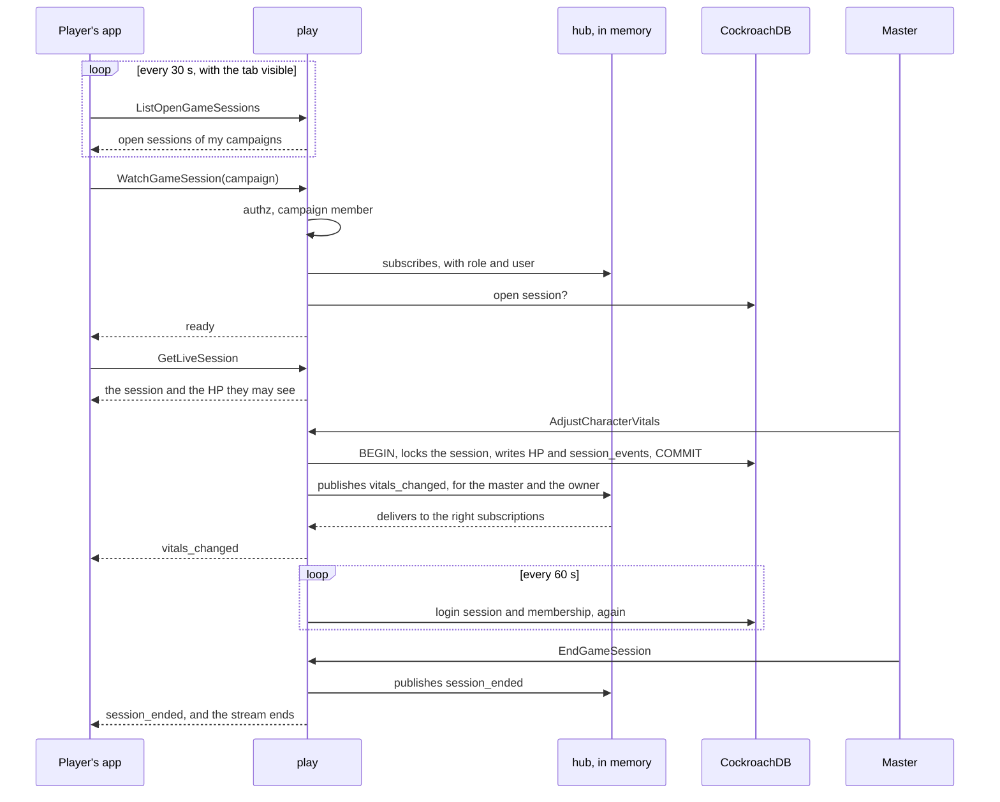

**Who sees what.** The master sees the `CharacterVitals` of every living player character in the campaign; the player, only their own character's, in the snapshot and the stream. The filter runs on the server: each published event carries its own audience (everyone, the master, or one user), and the hub only delivers to the subscriptions in it. `TestPlayersSeeOnlyTheirOwnVitals` checks the snapshot and the stream, and `TestRN11_LiveSessionNeverCarriesMasterNotes` checks that nothing in the live session carries the master's notes.

**When the stream ends.**

| When | How it ends | What the app does |
| --- | --- | --- |
| The master ends the session | `session_ended`, then an end without error | Shows "Sessão encerrada" |
| 30 minutes of stream | End without error | Reconnects and reads the snapshot again |
| The server is about to restart (graceful shutdown) | End without error, at once: `httpserver` calls `play.Service.Close` when shutdown begins | Reconnects |
| The app stopped reading and fell 16 events behind | `unavailable` | Reconnects and reads the snapshot again |
| The app stopped reading and a message went 30 s without arriving | `Send` fails and the stream ends (`close_reason` `client_gone`) | Reconnects |
| The person already has 8 streams open in the campaign | `resource_exhausted`, on opening | Retries with a delay: a closed tab returns the slot |
| The login session ended (sign-out, revoked, 14 days idle, 30 days) | `unauthenticated`, at the next check | Sends to sign-in |
| The person left the campaign | `not_found`, at the next check | "Peça um convite ao mestre" |

The app reconnects with growing delay (1 s, 2 s, 4 s, up to 30 s, with random jitter) and only with the tab visible: with the tab hidden for 2 minutes, it closes the stream itself, and reopens (with a fresh snapshot) when the tab returns. That is what stops a forgotten tab from holding an open connection (see [Operations](operations.md#live-session-stream)).

**In the app.** The notice poll lives in `web/src/app/shell/live-notice/open-sessions.ts`, which is part of the initial bundle but loads the generated `PlayService` client only on the first poll (a dynamic `import()`), so the generated code sits in a lazy chunk. The session page (`web/src/app/pages/live-session`) follows the rules above in `live-stream.ts`, tested with a fake clock. The notice does not appear on the campaign's own page (the "Sessão" panel already says), on session pages, nor for the campaign's master, who started it; the "Ao vivo" link appears for everyone.

**The hub is in memory, on one instance.** The `play/live` package keeps each campaign's subscriptions in server memory. Publishing never waits: each subscription has a 16-event buffer, and the one that fills is dropped, instead of delaying the master's change. With two Cloud Run instances, a change made on one would not reach streams open on the other; so the service runs with `max-instances = 1` while fan-out is in memory (see [Operations](operations.md)). When one instance is not enough, a shared channel (CockroachDB changefeed or Pub/Sub) takes the hub's place, and the rest does not change.

**The stream goes through the same HTTP stack.** The request log wraps the response in a `statusRecorder` that passes `Flush` through, `CrossOriginProtection` refuses POST from another origin (the stream is a POST with `Content-Type: application/connect+json`, which another site could only send after a CORS preflight), the server speaks HTTP/1.1 and h2c, and there is no `WriteTimeout`. `TestLiveStreamIsNotBuffered` opens the stream through the real server, in HTTP/1.1 and in h2c, with the heartbeat off, and checks that `ready` and `vitals_changed` arrive at once.

### HP, spell slots and hit dice

The character numbers that change during play (current HP, temporary HP, spell slots used per level, pact slots used and hit dice used) live in `character_vitals`, in the `characters` module, because they belong to the character and last from one session to the next (see [Data model](data.md#tables-by-module)). `play` reads and changes them through the `play.VitalsKeeper` interface (`ListVitals`, `GetVitals`, `AdjustVitals`), which `characters.Service` implements and `cmd/api` wires, like `SheetLocker`. The messages (`CharacterVitals`) belong to `play.proto`, because only `PlayService` serves them: `play` declares the interface and what passes through it, and `characters` only fills it in.

- **The maximums are never stored.** They come from `rules.Derive`, like every sheet number: maximum HP, slots per level, pact slots and hit dice (the total is the level). On every read, the stored value is clipped to today's maximum: a sheet that lost a level never shows more than it has.
- **With no row, the character is whole:** full HP, nothing used, `revision` 0.
- **Only living, active player characters** (not NPC, not dead, not pending). The NPC gets combat HP with the combatants.
- **The master's correction** (`AdjustCharacterVitals`) changes only the values that come in the request, each from 0 up to the maximum (temporary HP up to 999); the screen's "Ajustar" sheet also gives back the spent uses of each resource (`resources_used`) and, for a druid in a beast form, sets the beast's hit points (`wild_shape_hit_points_current`, 0 ends the form). In a single transaction, `play` locks the open session's row (`FOR UPDATE`), checks the idempotency key, asks `characters` to store and writes the event in `session_events`; only after `COMMIT` does it publish `vitals_changed`.
- **Idempotency.** The app sends a new UUID with each correction (`idempotency_key`) and the same on a retry. If the key is already in `session_events`, nothing is stored or published, and the response carries the HP as they are now (`TestAdjustCharacterVitalsIsIdempotent`). The same key for another character is `invalid_argument`.
- **Event order.** Each event's `seq` is the session's next, read with the session row locked, so two simultaneous corrections wait for each other and get 1, 2, 3, with no gap and no repeat (`TestSessionEventsAreOrderedPerSession`). `EndGameSession` locks the same row, so a correction in progress finishes before the session ends.

### What the session shows

The open session shows everyone two things, side by side and independent: the current map and a gallery image the master chooses to show (MR-028), like a portrait or a card. Both live on the session's row, in `game_sessions`, and only the master changes them, only with the session open.

| | Current map | Shown image |
| --- | --- | --- |
| Call | `SetCurrentMap(map_id)`, empty to clear | `SetShownImage(image_id)`, empty to stop |
| Column | `current_map_id` | `shown_image_id` |
| Reveals | The map (RN-10): the player always sees the current map | Nothing beyond the image itself, and only while it is shown |
| In the snapshot | `GetLiveSession.current_map_id`; the app reads the map with `MapService.GetMap` | `GetLiveSession.shown_image` (ID, name as caption, size, URLs) |
| In the stream | `current_map_changed`, to everyone | `shown_image_changed`, to everyone |
| When deleted | `DeleteMap` takes it off the session (`SET NULL`) and sends an empty `current_map_changed` | `DeleteGalleryImage` takes it off the session (`SET NULL`) and sends an empty `shown_image_changed` |

- **A new session starts with neither:** the columns belong to the session's row. An ended session keeps the last one, only as a record.
- **Choosing the current map reveals it** in the same transaction that locks the session row. If the master hides the current map afterwards, the player keeps seeing it while it is the current one (`Map.revealed` false and `Map.current` true).
- **The shown image does not open the gallery.** The player receives the image's ID while it is shown, and no other; after the master stops showing it, the `GET /images/{id}` route answers `404` to them, even if they kept the ID, unless the master left it with the players (below; see [Serving images](#serving-images) and [MR-028](product/stories.md#mr-028-show-an-image-to-the-players)).

#### Images left with the players

The master can leave the shown image with the players (MR-028, "Deixar com os jogadores"): it leaves the screen but stays in a list the players see until the master takes it away. The list belongs to the campaign, not the session: so it lives in the table `campaign_left_images` (`campaign_id`, `image_id`, `left_at`; primary key on the first two; `CASCADE` on the campaign and the gallery image, so deleting the image removes it from the list), not in `game_sessions`, which would lose it when the session ends. The switch of the image currently shown, that one, belongs to the session: `game_sessions.shown_image_keep` (starts off, and returns to off when the shown image changes).

| Call | What it does |
| --- | --- |
| `SetShownImage(image_id, keep)` | `keep` is the shown image's switch. The master turns it on by calling again with the same image (it sends no event: players do not know about the switch). With it on, stopping or swapping moves the image to the list, in the same transaction that locks the session row; `EndGameSession` does the same on ending |
| `ListLeftImages(campaign_id)` | Any active member, with or without a session: the list, oldest to newest, with the same URLs as the shown image |
| `TakeBackLeftImage(campaign_id, image_id)` | Master only: removes the image from the list (it stays in the gallery); `not_found` if it is not there |
| `left_images_changed` (stream) | A contentless hint, to everyone: an image was left, taken back or deleted. The app reads the list again |

The table belongs to the `maps` module (the images route reads it, along with the map tables); `play` writes it through the same `MapKeeper` interface (`LeaveImage` inside its transaction, `ListLeftImages`, `TakeBackImage`). `GetLiveSession.shown_image_keep` tells the master whether the switch is on; the player always receives `false`.

**How `play` and `maps` meet.** Each needs the other, so each declares what it needs, the other implements, and `cmd/api` wires the two, with neither importing the other:

- `play` declares `MapKeeper`: check and reveal the current map, inside `play`'s transaction, read the shown image and keep the images left with the players. `maps` implements it with `maps.SessionMaps`, which only needs the database;
- `maps` declares `LiveSession`: which map is current and the shown image, which point is the open scene's, and publishing to the stream. `play.Service` implements it with `OnScreen`, `OpenScenePoint` and `Publish`. The messages are `play.proto`'s: `maps` builds them, as `characters` builds `CharacterVitals`.

Since `SessionMaps` does not need `play`, `cmd/api` creates it first, creates `play` with it, and only then creates `maps` with `play`: neither waits for the other.

### RP scenes

An RP scene is a map point of kind `scene` with the actions the master chose (MR-015). The actions live in `maps` (`scene_actions`, `MapService`); opening the scene in the session, rolling and the log belong to `play` (`backend/internal/play/scene.go`).

- **The actions:** a skill check, an ability check or a saving throw, each with an optional name (up to 60 characters) and optional DC (1 to 30), at most 20 per point. The master changes one at a time (`AddSceneAction`, `UpdateSceneAction`, `MoveSceneAction`, `RemoveSceneAction`: there is no "save all"), and each response carries the list as it ended up. The key is checked against the rules catalogue (`rules.Content.SceneCheckName`, which `cmd/api` hands to `maps` in `Config.Rules`): only skills, the six abilities and the six saving throws, so an attack, a spell or a combat ability gives `invalid_argument`. `MapPoint` carries `scene_actions`: the master receives everything; the player, only on the points they see (RN-10), and with the DC only when the point has `show_dc` on (RN-20). Each action also has `max_attempts` (each player's attempts, below), which everyone receives.
- **Showing the DC:** `map_points.show_dc`, per scene, off by default, which the master changes with `UpdateMapPoint` (or `CreateMapPoint`) like the hooks; only a scene point has it, and a point that stops being a scene loses it. Every member receives the key (`MapPoint.show_dc`, `OpenSceneInfo.show_dc`). When on, the player receives `dc` on the actions that have a DC (`SceneActionView` and `SceneAction`) and `passed` on their own rolls; when off, none of that. An action without a DC shows nothing more, and the master always sees the DC. Changing the key with the scene open sends `scene_changed` to everyone, and the app reads the scene again. Each roll stores in the event whether the scene showed the DC when it was made (`dc_shown`): it is that mark, not today's key, that the [session summary](#session-summary) counts.
- **Opening and closing:** `OpenScene(point_id)` picks **any** scene point of the campaign, even without actions (the description, clues and NPCs suffice for a scene; the `SceneBlocked` `NO_ACTIONS` stays in the enum, but the server never sends it), hidden or not: opening a hidden point does not reveal it on the map, but **discovers** the scene (`scene_discoveries`, MR-030). One scene at a time: opening another swaps the first; opening the one already open changes nothing. `CloseScene` asks nothing. The open scene is `game_sessions.open_scene_point_id`; a deleted point, or one that stops being a scene, closes the scene. Each opening and closing becomes a `session_events` (`scene_opened`, `scene_closed`).
- **Reading the scene** (`GetOpenScene`, a call of its own, not `GetLiveSession`: it computes bonuses from the sheet, and the app reads it after `ready` and each `scene_changed`). The point's name and description go to everyone. The **master** also receives the point's hooks and the clues, each with who has it (MR-029); the player **never** receives either (RN-20), nor the clues already revealed to them: those they read in the notes. The **master** receives the actions with the DC and the attempt limit and all the rolls, each with who rolled, the die and the total, `passed` when the action had a DC and `attempts_left` (how many attempts that character still has on that action, to offer "Dar mais uma tentativa"). The **player** receives the actions **without the DC** (unless the scene shows it), each with the bonus and the passive of their own living character (`rules.SceneOptions`, through `CombatRoster.SceneOptions`), the limit (`max_attempts`) and the attempts **their own character** still has (`attempts_left`), and only their own rolls, without `passed` (unless the scene shows the DC). The passive only comes on Perception, Investigation and Insight. A player without a living character (or with a basic sheet) receives the actions without a bonus.
- **Rolling** (`RollSceneCheck`, RN-18): the player rolls, with their own living character, an action of the open scene. The server rolls the d20, or receives the typed d20 (1 to 20) according to RN-18's per-roll rule: a mode forced by the campaign refuses the other form with `WRONG_DICE_MODE`. Total = d20 + the `SceneOptions` bonus. Each character rolls each action up to its **attempt limit** (`scene_actions.max_attempts`: 1 by default, 1 to 5, or 0 for unlimited; the master changes it with `UpdateSceneAction`), counting rolls and granted attempts (`GrantSceneAttempt`) since the last `scene_opened`: with none left, the roll is refused with `ALREADY_ROLLED` (the name dates from when the limit was 1; the reason is the same). An **unlimited** action has a cap too: 200 rolls per character in one opening (`maxUnlimitedSceneRolls`), refused with the same reason, because every roll is a row of the session's log and nothing else bounds what a member appends. The attempts are counted by the database (`CountSceneRolls`, one row per character and action), not by reading the rolls; closing and opening the scene again resets all the counts. Lowering the limit below what someone spent leaves them without attempts and deletes nothing (what is left is `max(limit - rolls + granted, 0)`, computed on each read of `session_events`); raising it gives attempts back. **"Dar mais uma tentativa"** (`GrantSceneAttempt(action_id, character_id, idempotency_key)`, master only, scene open): adds one attempt for that character on that action in this opening, stores the `scene_attempt_granted` event (IDs only: the point and action in the payload, the character in the event) and sends `scene_changed` to everyone, the same contentless notice; on an unlimited action it changes nothing and stores nothing. A repeated idempotency key does not add another. Repeating the call with the same `idempotency_key` returns the first roll and stores nothing; the same key with another action or another typed d20 is refused with `invalid_argument`. The response to the player is the roll with the total; the DC and whether it passed only come when the scene shows the DC, and stay with the master otherwise. The master's log is the `GetOpenScene` list of rolls, read from `session_events`, newest to oldest.
- **The stream.** `scene_changed` (field 15 of `WatchGameSessionResponse`) goes to everyone when the scene opens, closes or changes (an action or the point's text): it is a contentless notice, and the app reads the scene again, already filtered. `stage_changed` (field 17) goes to everyone when the stage changes (see [NPCs on stage](#npcs-on-stage)). A change only the master reads (the clues and revealing a clue in the open scene) sends `scene_changed` to the master only, and the players' stream hears nothing. `scene_check_rolled{action_id}` (field 16) goes only to the master and whoever rolled: nobody hears another player's roll, and neither carries any number. `notes_changed` (field 18) goes only to the players who received a clue: contentless, the app reads the notes again (`PlayService` publishes through the `maps.LiveSession.PublishToUsers` interface).
- **In the app.** The `MapsClient` (the four action calls) and `SceneClient` (`OpenScene`, `CloseScene`, `GetOpenScene`, `RollSceneCheck`) clients are called only by lazy code. `SceneState` keeps the scene as each person sees it and says, in a live region, what changed; the session reads it after `ready` (the first read is silent) and on each `scene_changed` or `scene_check_rolled`. The `SceneBlocked` reasons become text through `scene-errors.ts`, never through the message. The screens are in [Design](design.md#rp-scenes).

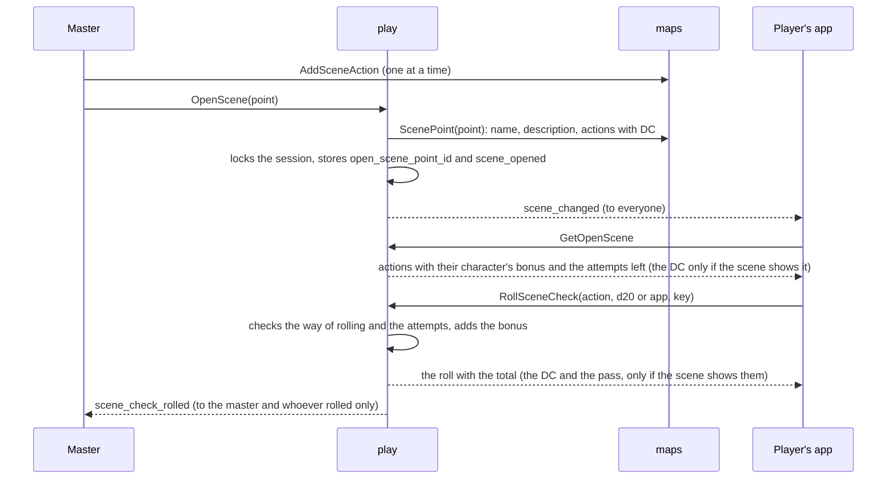

- **Hooks, clues and discoveries** (MR-029 and MR-030). "Ganchos e anotações" are the master's Markdown text, up to 4,000 characters, in the `map_points.hooks` column: they save with the point (`UpdateMapPoint`) and only the master receives them, on the map and in the open scene. Clues (`scene_clues`) are texts of 1 to 500 characters, up to 30 per scene, which the master changes one at a time (`AddSceneClue`, `UpdateSceneClue`, `MoveSceneClue`, `RemoveSceneClue`), like the actions.
  - **Revealing** (`RevealSceneClue(campaign, clue, character_ids)`): the app ticks every player character by default and the master unticks. Each player receives the clue **once** (`scene_clue_reveals`, unique per clue and player: repeating changes nothing, stores no event and notifies nobody), and there is **no "hide again"**. The row stores a **copy of the text**, so editing or deleting the clue, or the scene, afterwards does not change what the player received (the clue was said at the table). With an open session, the reveal becomes the `clue_revealed` event (IDs only: the clue, the point and the characters that did not have it yet, never the text) and `maps` stores it through the `LiveSession.AppendEvent` interface, the same one `progression` uses; without a session, the reveal holds all the same. Only the players who received it hear `notes_changed`. Someone offline reads it at the next `ListNotes`.
  - **Who has each clue:** the master receives each clue with `revealed_to` (the characters and when); "Todos", "Só a Brisa" and "Ninguém ainda" the screen computes by comparing with the party.
  - **Discoveries** (`scene_discoveries`): a scene is discovered when its point is revealed on the map (`SetMapPointRevealed(true)` or `UpdateMapPoint` with `revealed`) or when the master opens it (`OpenScene`, even hidden); it holds for the whole party and keeps holding if the point is hidden again. It is the only list of scenes a player reaches by name outside the map and the open scene (see [Notes module](#notes-module-player-notes)).
- **How `play`, `maps` and `characters` meet.** `play` reads the scene through `MapKeeper.ScenePoint` (`maps.SessionMaps`, which also carries the hooks and clues, and which `play` only hands to the master) and stores the discovery through `MapKeeper.DiscoverScene`, in `OpenScene`'s transaction, asks `CombatRoster.SceneOptions` for the bonuses and `CombatRoster.SceneCheckName` for the check's name (`characters.Service`), and `maps` asks which point is the open scene through `LiveSession.OpenScenePoint` (`play.Service`), to notify the stream when an action or the open scene's point changes.
- **The history** (`session_events`): the `scene_check_rolled` payload carries only IDs and numbers (the point, the action, the check key, the d20, the bonus, the total, `physical`, `dc_shown` (the scene showed the DC) and, if the action had a DC, `passed`), never a person's, action's or scene's name, nor the DC (see [Privacy](privacy.md)). `scene_attempt_granted`'s carries the point and the action. The stage stores `stage_changed` with the `change` (`put`, `taken_off`, `speaker` or `cleared`) and the NPC's ID, no name.

### NPCs on stage

The stage is the queue of NPCs "on scene" in the open scene, as in a visual novel (MR-031, D7): the portrait lives on the NPC's sheet and appears in the scene and on the combat card. The code is `backend/internal/play/stage.go`; the portrait is `characters`' (`portrait.go`); the rule of downloading the image is `maps`' (`serve.go`).

- **The portrait** is the `portrait_image_id` field of an NPC's sheet (`FullSheet` or `BasicSheet`): an image from the campaign gallery. `characters` checks it through the `Gallery` interface (`SetGallery`; implemented by `maps.SessionMaps.ImageInCampaign`, which `cmd/api` hands over before wiring the rest, because it only needs the database): an image from another campaign, or that does not exist, is `invalid_argument` with the same text, so nobody knows it exists in another, and a player's sheet refuses the field. **Deleting the gallery image clears the portrait** (`DeleteGalleryImage` calls `ClearPortraits` in the same transaction and sends `stage_changed`), instead of refusing as it does for a map's background: the portrait falls back to initials, a map without an image is not a map. A portrait saved at the instant the image is deleted may outlive it: the URL answers `404` and the app draws the initials; the next sheet save is refused until the portrait is swapped. The NPC's combat card (`Combatant.portrait_url`) carries the URL only in the master's copy (`TestMR031_TheMastersNPCCardHasThePortrait`).
- **The stage** is the table `stage_npcs` (see [Data](data.md)): per session, in order, at most 4. Three `PlayService` calls, master only and only with the session open: `PutOnStage(character_id)` (any living NPC of the campaign, hidden in combat or not, which does not reveal it there; refuses with `SceneBlocked` `NO_OPEN_SCENE` without an open scene and `STAGE_FULL` with 4 on stage; repeating changes nothing), `TakeOffStage` and `SetSpeaker` (only one speaks at a time; empty, nobody). Each locks the session row, changes and stores a `stage_changed` `session_events` (IDs only, no name) in the same transaction, and after `COMMIT` publishes `stage_changed` (field 17 of `WatchGameSessionResponse`, contentless) to everyone. The response is the stage as it ended up. **Closing the scene, or opening another, empties the stage** in the same transaction (`OpenScene` and `CloseScene` call `clearStage`): reopening the one already open changes nothing.
- **What each one receives (RN-20).** The stage goes in `GetOpenScene`'s `OpenSceneInfo.stage` (`OpenScene`'s response also carries it): each entry has the NPC's name, the portrait URL (empty without a portrait: the app draws the initials) and whether it speaks. The master also receives the `character_id`, which the three calls ask for. **The player never receives** the type, HP, AC, XP, the sheet, the notes nor the character's ID: the entry's `id` is the place on stage, made when the NPC enters, and names no one. The stream carries only the notice. `TestMR031_APlayerSeesOnlyNameAndPortrait` reads every response and event the player receives, as the app's JSON, and checks each entry's keys.
- **Downloading the portrait.** The player only downloads an NPC's image (and thumbnail) **while it is on the stage of the open scene** of the campaign's open session; at any other time it is `404`, like an image they may not see: off stage, with the scene closed, swapped or the session ended, also on `If-None-Match` (never a `304`). It is the same shape as the shown image (MR-028): `maps.playersSeeImage` asks `play` (`LiveSession.ImageOnStage`), after the other rules. The master always downloads (`TestMR031_PortraitsAreVisibleOnlyOnStage`).
- **The who-may table.** The three calls are in the `PlayService` table above; `TestAuthorizationMatrix` (in `play`) and `TestStageAuthorizationMatrix` (in `maps`, with a real scene and NPCs) call each as master, player, outsider, pending and signed out.

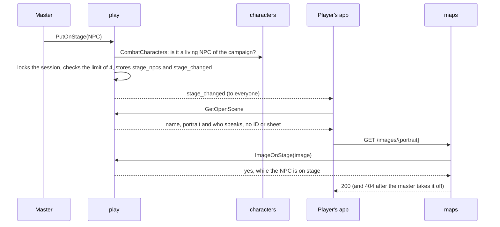

### Combat

A combat (in the code, an *encounter*) lives inside the open session: the master picks who fights, everyone rolls initiative, turns rotate until the master ends it (MR-013). The contract is `CombatService`, in `proto/meurpg/play/v1/combat.proto`, and the events travel on the same session stream. It is a separate service, not more `PlayService` methods, because combat keeps growing (attacks, undo and the log; spells, reactions, death saves, conditions and features) and `play.proto` is already the module's largest file; the two services are implemented by the same `play.Service` and mounted together, with the same interceptors. The code is in `combat.go` (the calls), `combat_write.go` (the transaction every change shares), `combat_view.go` (who sees what), `combat_rules.go` (the arithmetic, pure and tested without a database), `combat_actions.go` (the options, the attack, the damage, the standard actions and the NPC's HP), `combat_undo.go` (undo), `combat_log.go` (the log), `combat_events.go` (the events' payload), `combat_spells.go` and `combat_spells_view.go` (casting), `combat_reactions.go` (Shield), `combat_death.go` (death saves and confirmation), `combat_conditions.go` (conditions and concentration) and `combat_vitals.go` (slots, uses and HP through `character_vitals`).

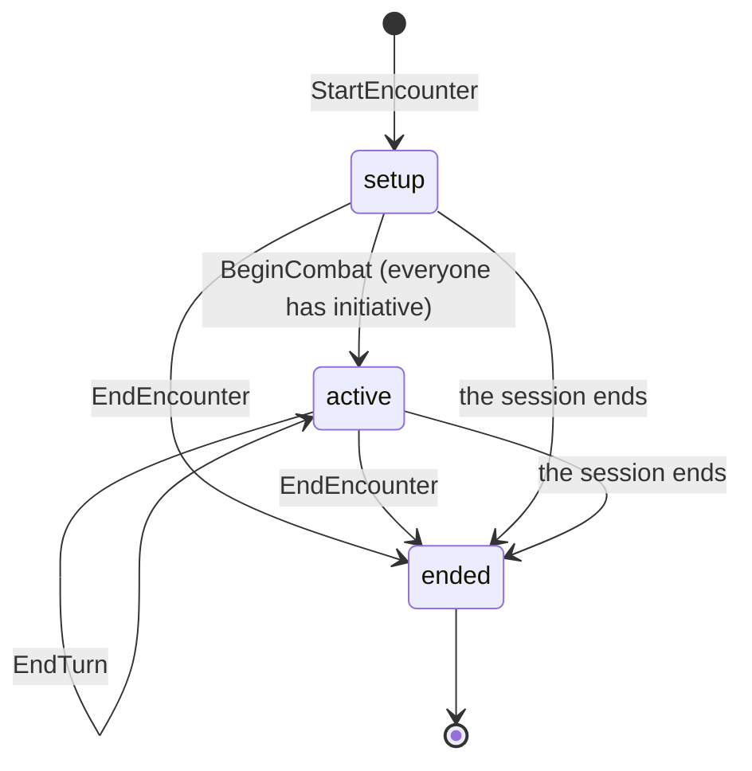

| `CombatService` call | Who may | What it does |
| --- | --- | --- |
| `StartEncounter` | The master, with the session open | Creates the combat in `setup`, on the current map (which needs a grid; or none, in theatre of the mind) or on the battle point's map. Puts the group and the NPC copies; each NPC rolls its own initiative at once. With `monsters` ("Começar este combate", MR-043), it also puts the bestiary monsters, in the same transaction and by the same code as `AddMonsters` ([Encounter builder](#encounter-builder-mr-043)) |
| `GetEncounter` | Members, filtered | The open session's latest combat, including one that just ended, or none |
| `SubmitInitiative` | The player on their own character, or the master on any | d20 rolled in the app (`roll_in_app`) or the typed physical d20 (`d20_face`), with RN-18: with "each player chooses" the player chooses on every roll, and only a mode the master forced bars it (`WRONG_DICE_MODE`). Only in `setup` |
| `SetInitiativeOrder` | The master | Orders a tie (same total and same bonus) |
| `BeginCombat` | The master | `active`, round 1, the first in the order on turn. Without someone's initiative: `failed_precondition` (`INITIATIVE_MISSING`) with who is missing |
| `EndTurn` | The member's player, or the master (any) | Ends one member's part of the turn; when the last one acting ends, the turn passes to the next group not defeated and, after the last, the round rises (in a one-member turn, it is the whole turn, as always). `aborted` if `expected_combatant_id` is no longer a member who acts. With damage to roll, to apply or waiting for a reaction of the combatant on turn: `PENDING_DAMAGE`, and only the master passes anyway (`discard_pending_damage`), which discards the damage. With the player's death save still to roll: `DEATH_SAVE_DUE` (the master passes anyway). If nobody is on turn (the combatant on turn left the combat, or their character was deleted), only the master calls, and the turn restarts from the first in the order, in the same round |
| `MoveCombatant` | The player on their own character, on their turn; the master on any, always | Puts the combatant on a square, or makes it jump (`jump`). The player pays the line's exact length in tenths of a foot, with terrain and creatures counted, and is limited by the movement left; the master is not ([Movement in combat](#movement-in-combat)) |
| `GetMoveOptions` | The player on their own character, on their turn; the master on any | Every square the combatant reaches in a straight move, with the cost, and the reason for each square in the circle that it refuses (`IDEMPOTENT`) |
| `SetCombatantSide` | The master | Marks an NPC as "Aliado" (the group's side) or enemy, and stores `side_set` |
| `SetCombatantCover` | The master | Sets a combatant's cover by hand (none, half, three-quarters, total), which disappears when it moves, and stores `cover_set` |
| `SetCombatantHidden` | The master | Hides or shows an NPC |
| `AddCombatants` | The master | Reinforcements (NPCs), with initiative rolled at once and their place in the order |
| `AddMonsters` | The master | "Pôr no combate" (MR-042, RN-29): 1 to 10 monsters of an SRD creature, with average or rolled HP, hidden by default, each with initiative rolled at once (see [Monsters in combat](#monsters-in-combat-pôr-no-combate-mr-042-rn-29)) |
| `RemoveCombatant` | The master | Takes someone out; if it was their turn, the turn passes. Refused (`PENDING_DAMAGE`) while a damage the combatant attacked with or took is still to roll or apply: it would disappear with the combatant, with no line in the log |
| `EndEncounter` | The master | `ended`; the players' tokens go where they stopped. Ending again is not an error |
| `GetTurnOptions` | The player on their own character; the master on any | What the combatant can do now ("Sua vez"), with the targets of each attack and spell (`spell_targets`, with the distance, the darts per level and how many targets the spell accepts) and the damage still to roll or apply. It also answers off turn, with everything disabled and the reason |
| `RollAttack` | The player on their own character, on their turn (or with `as_reaction`, off it); the master on any combatant on turn | The attack, first step: rolls the d20 (app or physical face), spends the action (or the reaction, on an opportunity attack) and compares with the target's AC |
| `CastSpell` | The player on their own character, on their turn; the master on any combatant on turn | Casts: spends the slot and the action or bonus action at once, and resolves by what the spell is (spell attack, save, darts, healing or just a log entry) |
| `DeclineOpportunity`, `SkipOpportunity` | The reactor's controller (the character's or creature's player; the master, of an NPC) declines; only the master continues without waiting | Answer an opportunity-attack offer without attacking (the attack is `RollAttack` with `opportunity_offer_id`); they store `reaction_declined` ([Opportunity attacks](#opportunity-attacks)) |
| `UseReaction`, `DeclineReaction` | The player on the hit character; the master on any | Shield when a blow hits: spends the slot and the reaction, gives +5 AC until the start of the character's next turn and compares the blow again; or lets the blow through |
| `RollDeathSave` | The player on their own character; the master on any | The death save of someone at 0 HP, at the start of their turn |
| `ConfirmDeath` | The master | Confirms the death of someone who failed three times: marks the character dead and removes them from the order. Cannot be undone |
| `SetCombatantConditions` | The master; the player only to end the concentration of their own character | The conditions (labels, RN-22) and the end of concentration |
| `RollDamage` | The player on their own attack; the master on any | The damage of the attack that hit, second step. NPC target: applied at once. Player character: stays `ROLLED`, waiting for the master. On an area spell, one roll holds for all the casting's targets; a heal applies at once |
| `ApplyPendingDamage`, `DiscardPendingDamage` | The master | "Aplicar 5 de dano" (through `character_vitals`, RN-02), with whatever amount they want in place of the rolled one (`amount`), and "Não aplicar" |
| `TakeAction` | The player on their own character, on their turn; the master on any combatant on turn | The standard actions that only spend the economy (Dash, Disengage, Dodge, Help, Hide, Ready, Search, Use an Object) and the features' actions (`feature:second-wind`, `feature:action-surge-1-use`...), which also spend a use of the resource |
| `AdjustCombatantHitPoints` | The master | "Dano/Cura" of an NPC: damage, healing or an exact value, and temporary HP |
| `UndoLastAction` | The master | Undoes the last action, one step, with a compensating event |
| `ListCombatLog` | Members, filtered | The combat log, from the latest round to the first |
| `GetCombatHighlights` | Members, filtered | Who did what, for a combat that has ended ([Combat highlights](#combat-highlights)) |

State errors are `failed_precondition` with the `EncounterBlocked` detail and a reason (`MAP_HAS_NO_GRID` with the `map_id`, for the screen to offer the grid; `NO_CURRENT_MAP`; `ENCOUNTER_ALREADY_OPEN`; `NOT_IN_SETUP`; `NOT_ACTIVE`; `NOT_YOUR_TURN`; `NOT_PLACED`; `TOO_FAR` with `missing_ft`; `SQUARE_OCCUPIED`; and, in the actions, `ACTION_USED`, `BONUS_ACTION_USED`, `REACTION_USED`, `ATTACKS_USED`, `NO_SLOT` with `min_level`, `NO_USES` with `recharge`, `TARGET_OUT_OF_REACH` with `missing_ft`, `TARGET_DEFEATED`, `COMBATANT_DOWN`, `PENDING_DAMAGE`, `REACTION_PENDING`, `NOT_AWAITING_REACTION`, `DEATH_SAVE_DUE`, `DEATH_SAVE_NOT_DUE`, `NOT_DYING`, `DAMAGE_ALREADY_ROLLED`, `DAMAGE_NOT_ROLLED`, `DAMAGE_RESOLVED`, `NOTHING_TO_UNDO`, `WRONG_DICE_MODE`...). Callers do not depend on the message text.

**How `play` reads the other modules.** Through small interfaces, wired in `cmd/api`, without importing anyone's code. The simple types that pass through them live in `play/link`, a package that imports nothing from the project.

| `play` interface | Who implements | What for |
| --- | --- | --- |
| `CombatRoster` (`CombatParty`, `CombatCharacters`, `CombatSheet`, `CombatTurnOptions`, `CombatSpell`, `CombatSave`, `MarkDead`, `Conditions`) | `characters.Service` | Who can fight, with initiative bonus, speed and maximum HP (from `rules.Derive` on a full sheet; as it stands on a basic one); a character's AC, attacks, standard actions and features' actions (`link.Sheet`, with attacks per action); the rules engine's `TurnOptions`, with the slots and uses the character already spent; the spell as the caster casts it, already at the slot's level (`link.Spell`: range, attack or save, damage or healing with the caster's modifier); a target's save bonus (a basic sheet has none: `Known` false); the death confirmed by the master (the effect of `MarkCharacterDead`, in the combat's transaction); and the SRD conditions. A basic sheet becomes a minimal `rules.Derived` (the structured attacks as `basic:0`, `basic:1`, and the ten standard actions), so the engine serves the Goblin as it serves Toren |
| `DiceModes` (`ForcedDice`) | An adapter over `campaigns.Service.CampaignDiceMode` | What the campaign's mode forces: nothing (`each player chooses`), everything in the app, or everything with physical dice (RN-18). The player's preference does not enter: it is only the default the screen highlights (`PlayerDiceMode`, `EffectiveDiceMode`) |
| `MapKeeper` (plus `MapGrid`, `BattlePoint`, `MapTokens`, `SetTokenPositions`) | `maps.SessionMaps` | The map's grid, a battle point's map, where the tokens are and, at the end, moving the players' tokens |

**The grid and movement (RN-21).** The map has `grid_columns` (4 to 200 squares of 1.5 m across the image's width); rows follow the image's proportion (`round(columns × height / width)`, from 1 to 400) and are not stored. Combat copies the grid when it starts (`encounters.grid_columns` and `grid_rows`), so changing the map's grid afterwards touches nobody. Each combatant starts on the square of the character's token, if it has one (of several copies of an NPC, only the first), and otherwise without a position: the master places it. The player moves on their own turn, at most the movement left: the sheet's speed (doubled after Dash, `dashed`) minus what was already walked, in tenths of a foot, and a straight line costs its exact length (a diagonal step is worth 7.1 ft), with terrain and creatures counted (see [Movement in combat](#movement-in-combat)). Past it: `TOO_FAR`. A square occupied by someone they see: `SQUARE_OCCUPIED`; a combatant hidden from the player does not block, so the error does not reveal that it is there. The master moves anyone to any grid square, without spending movement. Dash (`TakeAction`) calls `markDashed`, and the movement left doubles until the end of the turn.

**The order (RN-19).** Highest total first; on a tie, highest bonus; on a tie of both, the order the master decided (`SetInitiativeOrder`), and without a decision, the order of entry. Whoever has not rolled yet goes last. The server stores each one's position (`order_index`) and rebuilds the order on every roll or reinforcement. The player rolls their own initiative once only, so nobody rolls again until it comes out good; the master can correct any value. Each NPC rolls its own, on the server, with `crypto/rand` (RN-19); the physical die is validated by `platform/dice`.

**Who sees what (RN-10, RN-20).** As on the map, the filter runs on the server (`combat_view.go`) and what the player does not see stays out of the response, never blank. `TestRN20_PlayersNeverReceiveHiddenCombatantsOrNPCNumbers` reads the player's response as the JSON the app receives and searches it for the hidden combatant and the NPC's numbers.

| What | The master sees | The player sees |
| --- | --- | --- |
| Hidden combatant (a new NPC is born hidden) | All | None: neither the ID, the name nor the position |
| A hidden one's turn | The combatant | "Vez do mestre": empty `current_combatant_id` and true `master_turn` |
| An NPC's HP and temporary HP | The numbers | One word: Ileso, Ferido, Muito ferido (half or less) or Derrotado |
| Any combatant's AC | The master only: `Combatant.armor_class` (the order list, "CA 15") and `AttackRoll.target_armor_class` ("Acertou contra CA 18 do Toren"); the server reads each sheet only for the master's copy | Never: no response carries it, only Acertou or Errou |
| An NPC's initiative | The total, the d20 and the bonus | Nothing: only the order |
| A player's initiative | Everything | The total of every player; the d20 and the bonus, only of their own |
| A player's HP | The numbers, from `character_vitals` | Their own character's come from the live session; the other players' do not; only the word "Caído" at 0 HP, for all |
| Speed, movement left, action, bonus action, reaction | All | Only of their own character |
| Which character an NPC is a copy of | Yes | No |

**The two-step attack (MR-012, MR-014).** There are two calls because, with physical dice, the player types the d20 and then the damage (RN-18). `RollAttack` checks who may (the player on their own character, on their turn, with the action free, the target in sight and in reach; the master on any combatant on turn, with no limit of reach or action: the Captain with several weapons is theirs), rolls the d20 (`crypto/rand` in the app, or the typed face, 1 to 20), spends the **action** and compares with the target's AC (`rules/combat.ResolveAttack`: natural 20 is a critical, natural 1 misses). The response carries the roll in numbers (`1d20 (13) + 6 = 19`) and the result, **never the AC for the player**; the master's response also carries the AC the total was compared with (`target_armor_class`, with the +5 of an active Shield, stored in the event, so a resend finds the same). `TestRN20_PlayersNeverReceiveCAOrHiddenLogEntries` searches the AC in the player's JSON and checks the master's has it. A hit opens a line in `pending_damages` (stored, so a resend or a reload finds it). `RollDamage` rolls the damage dice (on a critical, as the table rule says: doubled, or once with the maximum added; the modifier once, the attack's type) or validates the typed sum (`dice.Physical`, from N to N × faces). The Attack action makes one attack, or more with Extra Attack (below); advantage and disadvantage are up to the table.

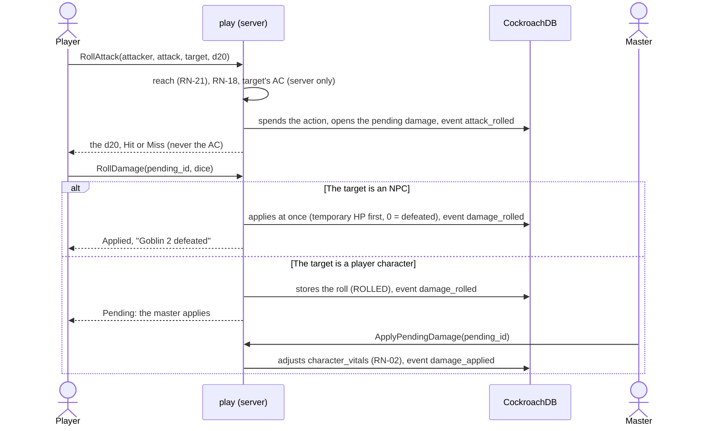

**Pending damage.** `pending_damages` stores a hit's damage, with the dice copied from the sheet at the time of the hit (a sheet changed later does not touch an open roll; a critical already comes with the table rule applied: doubled dice, or the usual dice plus the maximum in `critical_max`, see [Table rules in combat](#table-rules-in-combat)). The state goes from `awaiting_roll` to `rolled` (player characters only) and to `applied` or `discarded`. An NPC applies at once: `ApplyDamage` (temporary HP first, floor at 0); at 0 HP it is `defeated` and `nextTurn` skips it. Damage to a player character waits for the master (RN-02) and goes through `character_vitals` (the same path as the correction), with a floor at 0; at 0 HP the character is **down**: `GetEncounter` shows the word `COMBATANT_STATE_DOWN` ("Caído") to everyone who sees them, derived from `character_vitals`, with no numbers. The death saves are in "The fallen" below; death by massive damage stays the master's. `EndTurn` with open damage of the combatant on turn refuses with `PENDING_DAMAGE`; only the master passes anyway (`discard_pending_damage`, the screen's "Passar o turno mesmo assim?"), and the open damage is discarded in the same transaction.

**Casting (MR-014).** `CastSpell` spends the slot and the action (or bonus action) **on casting**, in the same transaction: a resend with the same key spends nothing, and a refused casting does not either. Who casts: the player on their own character, on their turn (a prepared spell or a save cantrip from the options list); the master, on any combatant on turn (an NPC with a full sheet casts from the sheet; NPC slots are not counted, only player characters'). The spell, the level (`slot`: level or pact, none for a cantrip) and the targets are checked against the character's `TurnOptions`, and the targets against what they see, the range (Self only the caster, Touch 5 ft, at distance the spell's range; the master is never limited) and how many targets the spell accepts. What says whether a spell hits an area and how many targets it takes is `SpellDetails.Target`: what the master wrote on the table spell, the 5e-database's structured area on the SRD one and, only for one without a structured area, the SRD text, read with two patterns (`rules/spelltarget.go`); a spell attack takes one target, so a wrong guess never blocks the master (they are not limited by the number of targets). A table spell is cast through the same `CombatSpell`, with the campaign's content (see [Spell targets and the "Magias" page](#spell-targets-and-the-magias-page)).

| The spell is | What the casting does | What is left for `RollDamage` |
| --- | --- | --- |
| Spell attack (Ray of Frost... with `attack_type`) | One d20 per target (`roll_in_app`, or `d20_face` for a single target, RN-18 on each roll), against the AC as in `RollAttack` (a critical follows the table rule); a hit opens the pending damage, and Shield can hold it | Each hit's damage |
| Save (Burning Hands, Sacred Flame) | The server rolls each target's save: a full-sheet NPC uses the `Derived.SavingThrows` bonus; a basic sheet has no bonus, rolls d20 + 0 and the log says so (`bonus_known` false, master only); the player character is also rolled in the app with the sheet's bonus (the final word is the master's, through `amount`). Whoever passes takes half (rounded down) or nothing, as the spell says | **One** roll for the whole casting (SRD): its pending damages share a `cast_id`, and rolling one settles all, full or half |
| Magic Missile | The darts (3, plus one per level above) are split among the targets, at least one in each, summing exactly; no attack roll | Each target's damage: 1d4 + 1 per dart, at any level (the SRD damage at the level is the whole volley's, and each dart is 1d4 + 1) |
| Healing | A pending damage that is a heal | The roll with the casting modifier ("+ MOD") heals **at once**, up to the maximum, per NPC and per character (through `character_vitals`); whoever was at 0 HP rises and the death saves reset |
| Reads HP (Sleep, Chromatic... Power Word, Spare the Dying, Heal) | The server reads each target's HP (NPC: `combatants.hp_current`; player character: the `VitalsKeeper`) and applies the effect at once, in the same transaction (see [Spells that read HP](#spells-that-read-hp)) | — |
| The rest (Web, Misty Step...) | Spends and logs; the effect is the table's, and the master marks the conditions afterwards | — |

#### Spells that read HP

Six SRD spells roll no damage: what they do depends on the HP of whoever is in the area (MR-014). What each does is handwritten content, in `rules/srd51/effects/spells.json`, in a closed set of four types the loader checks (like the features' `effects/`; changing the file asks for a new revision):

| Type | What it does | Spells |
| --- | --- | --- |
| `hp_pool` | Rolls a total of dice (and the extra dice per level above the spell's) and goes through the creatures in ascending order of current HP, skipping those already unconscious or at 0 HP; each one whose HP fits in what is left gets the condition, and the total goes down by its HP | Sleep (5d8, +2d8, Unconscious), Colour Spray (6d10, +2d10, Blinded) |
| `hp_threshold` | The creature with HP equal to or less than N suffers the effect: a condition or death | Power Word Stun (150, Stunned), Kill (100, dies) |
| `zero_hp_target` | Only holds on a creature at 0 HP, and leaves it stable | Spare the Dying |
| `flat_heal` | Heals a fixed value (plus an amount per level) and ends conditions | Heal (70, +10 per level; ends Blinded and Deafened) |

`rules.SpellEffect(key, level)` returns the effect already at the slot's level. The arithmetic is pure functions of `rules/combat` (`hpspells.go`): `ResolvePool`, `ResolveThreshold`, `ResolveZeroHP` and `ResolveFlatHeal` receive each creature's HP and the rolled dice and say who is affected (ties keep the targets' order; the limit holds with HP exactly equal to N). In `play`, `combat_spells_hp.go` reads the real HP and applies the result: the condition through the same field `SetCombatantConditions` writes; "death" defeats an NPC (0 HP) and takes a player character to 0 HP with three death-save failures, for the master to confirm with `ConfirmDeath` (RN-03); a character at 0 HP under Spare the Dying becomes stable (three successes). The pool's total is rolled on the server (`roll_in_app`) or typed with a physical die (`pool_sum`, the sum of the dice), and follows the campaign's dice mode like any roll (RN-18). The casting event stores, per target, the HP before, what was affected and what "Desfazer última ação" needs to return (HP, death failures, conditions).

**Who receives what (RN-20).** `SpellCast` (the response) and `CombatLogSpell` (the log) carry typed fields, and the app never reads text: `effect_kind`, `effect_condition_key` and, per target, `SpellEffectResult.outcome` (affected or not) go to everyone who sees the line; `pool_roll` (`5d8 (2, 4, 1, 5, 3) = 15`) only to the master and the caster's player; `effect_threshold`, and per target `reason`, `hit_points_before`, `pool_order` and `pool_left`, only to the master; `healed`, to the master and the target's player (on an NPC, the amount would tell the caster how many HP were missing). The targets stay in the order the caster listed them, and the order of the total only appears in the master's `pool_order`.

A casting takes at most **10 targets**, the master's too: what each target suffered stays in the casting's event and the damage roll's, and a `session_events` payload is at most 4 KiB; past that is `invalid_argument`. A heal appears in the log with what the target recovered (up to the maximum) only for the master and the target's player; the others receive the roll, because the clipped number would tell how many HP were missing (RN-20).

A concentration spell puts its name in the caster's `concentration_spell`; a second swaps it, and the log says which ended (RN-22). `GetTurnOptions` carries, for each spell that can be cast now, the targets the caller sees, with the distance and `too_far`, and the darts per level.

**The reaction: Shield.** When a non-critical blow hits a player character who can cast Shield now (prepared, with a free slot, reaction free, standing), the pending damage is born `AWAITING_REACTION`, not `AWAITING_ROLL`: the attacker sees "esperando a reação", and the hit player and the master receive the notice in `GetEncounter` (`reaction_prompts`, by who sees: the master all, the player their own character's, without the attacker and without the blow's total). The player decides without knowing the total, as at a table.

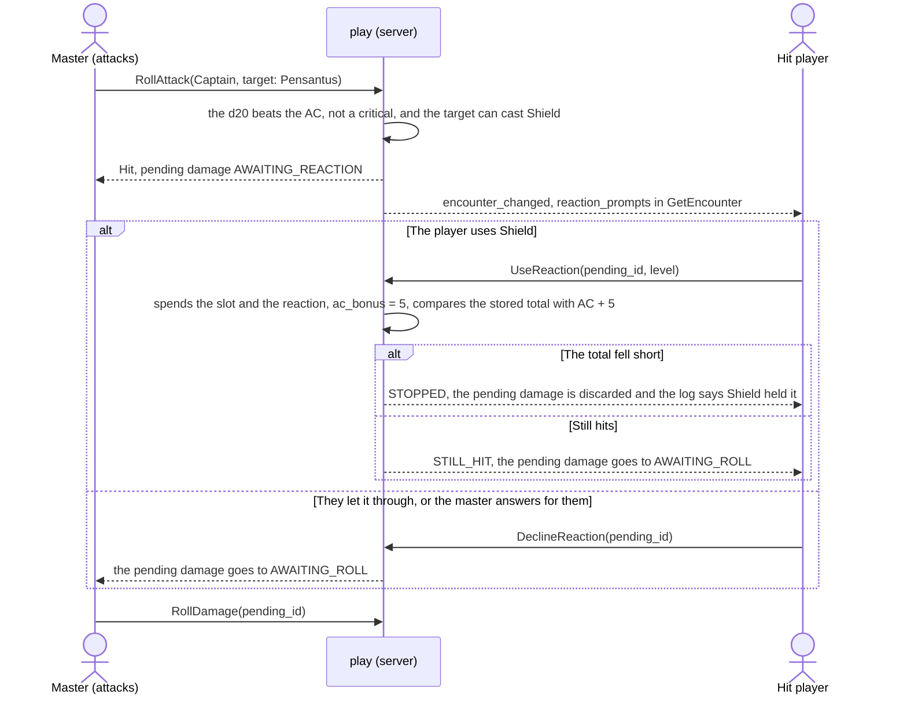

`RollDamage` and `ApplyPendingDamage` on a blow waiting for the reaction give `REACTION_PENDING`; the attacker's `EndTurn` gives `PENDING_DAMAGE` (only the master passes, discarding). The +5 stays in `combatants.ac_bonus` until the start of the character's next turn (`ResetCombatantTurn`): every attack in the meantime uses the sheet's AC plus the bonus, and the bonus never alters the sheet (RN-04). The **opportunity attack** is `RollAttack` with `as_reaction`: a melee attack (5 ft reach; a weapon the sheet lists with its own reach, like the throwable dagger, counts as ranged) off turn, spending the reaction in place of the action. The other reaction spells are the table's.

**The fallen (RN-03).** A player character at 0 HP is "Caído" (the word comes from `character_vitals`). Their turn starts with a death save to roll (`death_save_due`, for them and the master), and the turn waits for them. Whoever drops to 0 HP **during their own turn** (an opportunity attack, the master's correction) does not owe the save that turn: the first is at the start of the next turn (SRD 5.1; `changeVitals` marks `death_save_rolled`).

```mermaid
stateDiagram-v2
    [*] --> Down: reached 0 HP
    Down --> Down: death save (success or failure), damage at 0 HP (one failure; two on a critical)
    Down --> Stable: 3 successes
    Stable --> Down: damage (successes reset and one failure counts)
    Down --> Dying: 3 failures
    Dying --> Dead: the master confirms (ConfirmDeath)
    Down --> Standing: natural 20, or any heal (1 HP or more): the counts reset
    Stable --> Standing: any heal
    Dying --> Standing: any heal
    Dead --> [*]
```

`RollDeathSave` uses `combat.DeathSave` (10 or more is a success, less a failure, natural 1 is two failures, natural 20 returns with 1 HP through `character_vitals`); the d20 is the app's or typed, on each roll (RN-18). Damage that hits someone at 0 HP (the master's "Aplicar") does not lower the HP: it adds a failure (`combat.DamageWhileDown`). Any heal above 0 resets both counts: a spell, Second Wind, the natural 20, the master's HP correction (`AdjustCharacterVitals`) and an undo, through the same `character_vitals` path (`changeVitals`). A player who tries `EndTurn` with the save still to roll gets `DEATH_SAVE_DUE` (the master passes the turn anyway). With three failures the character is **dying**: the master sees the word "Morrendo" and confirms with `ConfirmDeath`, which calls the effect of `MarkCharacterDead` (the character becomes `dead` and the player may create another), marks the combatant out of the order and passes the turn if it was theirs. For the players the word stays "Caído", with the counts (public, unless the table hides them from everyone but the owner and the master: see [Table rules in combat](#table-rules-in-combat)): the app never says someone died before the master confirms. `ConfirmDeath` cannot be undone: the character is already dead in `characters`. The counts stay on the combatant's row: the ended combat keeps them for the summary ("Caída: 1 sucesso, 1 falha"), and a new combat starts at 0 and 0.

**Conditions and concentration (RN-22).** Conditions are labels (`combatants.conditions`, SRD keys like `condition:poisoned`): `SetCombatantConditions` swaps the whole set, master only; the player only ends the concentration of their own character. There is no effect at all. Players see the conditions of the combatants they see (the keys and Portuguese names, `condition_names_pt`), never a hidden one's. When damage is applied to someone concentrating, the response and the log carry `concentration_dc` (`combat.ConcentrationDC` of the damage the target suffers, without what temporary HP absorbed): "Teste de concentração: CD 10", only for the master and the target's player. The app reminds; the table rolls.

**Resources, features' actions and Extra Attack.** The uses spent of each sheet resource live in `character_vitals.resources_used` (`{key: uses}`, clipped to the sheet's maximum on read, like the slots), and the master's correction (`AdjustCharacterVitals.resources_used`) returns them: there is no rest yet. `TakeAction` accepts the `TurnOptions`' `feature_actions`: it spends the economy (a free action spends nothing), a use of the resource (`NO_USES` with the `recharge`; only player characters count uses, and a resource that is a pool of points, like Lay on Hands, stays with the master) and goes to the log. Only two change numbers: **Second Wind** heals 1d10 + the fighter level, rolled as damage (RN-18) and healed through `character_vitals`, and **Action Surge** returns the action, with the Attack action's attacks. **Extra Attack:** `combatants.attacks_made` counts the turn's attacks; the first spends the action, the following fit while any remain (`AttacksLeft`) and the last gives `ATTACKS_USED`; the counter returns to 0 at the start of the turn. Extra Attack belongs to the Attack action only, that is, to weapon attacks: a cantrip (`Kind` spell) spends the whole action and counts no attack, and after a weapon attack the cantrip gives `ACTION_USED`, and vice versa. An NPC's multiattack stays the master's, who may attack again.

| Feature action, levels 1 to 5 | Economy | How combat treats it |
| --- | --- | --- |
| Second Wind (fighter) | Bonus action, 1 use per short rest | Heals 1d10 + level through the HP path; spends the use |
| Action Surge (fighter, level 2) | Free, 1 use per short rest (2 from level 17, but once in the same turn: `combatants.action_surged`, cleared at the start of the turn; `ALREADY_USED_THIS_TURN`, which the master may override like the economy) | Returns the action and the attacks; spends the use |
| Rage (barbarian) | Bonus action, uses per long rest | Spends the use and logs; the effects are the table's |
| Bardic Inspiration (bard), Cutting Words (bard, reaction) | Bonus action; reaction | Spends and logs (the inspiration has uses per long rest) |
| Divine Sense, Lay on Hands (paladin) | Action | The first spends a use; Lay on Hands is a master-held pool of points: spends the action and no point |
| Channel Divinity: Turn Undead and Preserve Life (cleric), Sacred Weapon and Turn the Unholy (paladin) | Action | Spends the action and a use and logs |
| Wild Shape (druid) | Action | Does not go through `TakeAction`: it is `AssumeWildShape`, which spends the action and a use, swaps the combatant's numbers for the beast's and logs (see [Wild Shape, the familiar's eyes and creature tokens](#wild-shape-the-familiars-eyes-and-creature-tokens-mr-037-mr-036)) |
| Flexible Casting: Create Spell Slots and Convert Spell Slot (sorcerer) | Bonus action | Spends the bonus action and logs; sorcery points are the table's |
| Flurry of Blows, Patient Defense, Step of the Wind (monk, level 2); Deflect Missiles (reaction); Slow Fall (reaction) | Bonus action; reaction | Spends the economy and logs |
| Cunning Action, Fast Hands (rogue); Uncanny Dodge (rogue, reaction) | Bonus action; reaction | Spends the economy and logs |
| Hunter's Prey: Giant Killer (ranger, reaction); Fighting Style: Protection (fighter and paladin, reaction) | Reaction | Spends the reaction and logs (can be used off turn) |
| Breath Weapon (dragonborn, race trait) | Action | Spends the action and a use and logs |

**Undo (compensation, not erasure).** `UndoLastAction(expected_event_id)` undoes one step, master only. The last action is the session's latest `session_events` that an undo has not yet undone (`lastAction`): if it is an attack, a damage, an "Aplicar" or "Não aplicar", a standard or feature action, a cast spell, a Shield used or declined, a death save, the conditions or concentration, or an NPC's HP adjustment, of that combat, it can be undone (the death confirmation, no); any later event (the turn passed, a move, an HP correction) leaves `NOTHING_TO_UNDO`, because undoing over it would stop being a restoration of what was before. Each event stores the before (HP and `defeated`, the economy, the attacks made, the damage state, the death counts, the concentration, the conditions, the AC bonus) and what it spent (the slot, the resource use), and undo writes it back, through the same paths (`character_vitals` for slots, uses and HP), and stores an `action_undone` event with the undone one's ID: the history keeps both. `expected_event_id` is the log's `undoable_event_id`; if it is already another, `aborted`, and two masters never undo two things. The undone line disappears from the log.

**The combat log (ADR-0007).** `ListCombatLog` builds the log on every read, from the combat's `session_events` (the `encounter_id` column), from the latest round to the first, with no table of its own: the history and the log cannot disagree. Each line is structured (kind, round, who did it and to whom, the attack or action and its Portuguese name, the rolls, the result, the damage and type); the Portuguese sentence is the app's. An attack's events (the roll, the damage, the "Aplicar") become **one** line, the attack's. In: the combat's start and end, the attacks (with the damage, the amount the master applied in place of the rolled one, only for them, and the concentration reminder), the spells cast (one line with the result on each target: the attack, the save, the damage or healing), the reactions, the death saves and the confirmed death, the conditions and the end of concentration, the standard and feature actions, the movement on turn (`distance_ft`), and, only for the master, an NPC's HP adjustment and the "show/hide". Initiative, turn order and reinforcements are not log lines; what happens before round 1 is not either (except the monster additions, for the master).

| What | The master | The player |
| --- | --- | --- |
| A line with a hidden combatant (today, or when it happened) | Yes, with `hidden` on ("Só o mestre vê") | None: neither the ID, the name nor "waits hidden" |
| A combatant the master shows later | — | The **new** lines; the old ones (made hidden) stay out (each event stores `secret`) |
| The dice (d20 and damage) | All | Only their own character's; for the others, the result and the damage they suffer or cause |
| A spell target's save | The dice, the bonus and whether the bonus is known | The result as a word (passed or failed); the dice only if the target is their character (never an NPC's); the DC, only the caster |
| A casting that touches a hidden one | Yes, with `hidden` on | No line |
| The amount the master applied in place of the rolled one | Both | Only what the character took |
| The reaction notice (Shield) | All, with the attacker | Only their own character's, without the attacker and without the blow's total |
| Conditions | All | Those of the combatants they see |
| "Morrendo" | Yes | Never: "Caído", with the counts (public); "Estável" and "Morto" (after the confirmation) are for all |
| HP after the damage (`hit_points_after`) | Yes | Never (RN-20) |
| Anyone's AC | Not part of the log (the master reads it in the order and in the roll) | Never |
| An NPC's HP adjustment, show/hide | Yes | None |
| `undoable_event_id`, `undoable` | The last action | Never |

**Events.** Each change becomes a `session_events` (`encounter_started`, `initiative_submitted`, `initiative_order_set`, `combat_begun`, `turn_ended`, `combatant_moved`, `combatant_hidden_set`, `combatants_added`, `combatant_removed`, `encounter_ended`, and the actions': `attack_rolled`, `damage_rolled`, `damage_applied`, `damage_discarded`, `action_taken`, `hit_points_adjusted`, `action_undone`, and the spells' and the rest: `spell_cast`, `reaction_used`, `reaction_declined`, `death_save_rolled`, `death_confirmed`, `conditions_set`), in the same transaction, with the payload only IDs and numbers (`combat_events.go`; the event carries the `encounter_id`, the round and whether a hidden one was in it). The weapon's or action's name never goes in the event: the log reads it from the sheet, on the spot. A payload is at most 4 KiB (a `CHECK` of `session_events`), so an event that lists one record per creature is written as several when the list does not fit (`eventPayloadBudget`, `fitPrefix`, `combat_write.go`): the master's lines of a start's monsters (`combatants_added`, each with its dice and faces) and a trap's firing (below). Only after `COMMIT` does `play` publish, to each audience what it may see (the hub has the "players" audience, for an event the master receives another way):

| Stream event | When | Who receives it |
| --- | --- | --- |
| `encounter_changed{encounter_id, revision}` | Any change in the combat | Everyone. A contentless notice: the app reads `GetEncounter` again, already filtered |
| `turn_changed{round, current_combatant_id, master_turn}` | The combat begins, the turn passes, whoever is on turn disappears or changes state | Each their own copy: the master sees who it is; the player, "Vez do mestre" if it is a hidden one |
| `combatant_moved{combatant_id, col, row}` | A combatant moves | The master always; the player, only if they see the combatant |
| `combat_log_changed{encounter_id}` | A log line appeared, changed or vanished (attack, damage, action, undo, movement on turn, start and end) | The master always; the player, only if the line has no hidden one. A contentless notice: the app reads `ListCombatLog` again |

**Idempotency and concurrency.** Every write carries `idempotency_key`. In a single transaction, `play` locks the open session's row (`FOR UPDATE`, like the HP correction), checks the key in `session_events`, changes the rows, writes the event and ends; a repeated key changes nothing and stores nothing, and the response is the combat as it is; it publishes only the generic hints (`encounter_changed`, and `combat_log_changed` when the first event was not a hidden one), because the first call may have died before telling. What `finish` reads and publishes after the commit runs on a context that outlives the call (`context.WithoutCancel`, with a timeout), so a client that hangs up never leaves the table without the hint (an attack's or damage's rebuilds the roll from the stored event: a resend never rolls again, and another change's key, or the same key with another request (the hash kept on the event), is `invalid_argument`). Two simultaneous changes wait for each other, so a double tap on "Encerrar turno" never skips two turns: the second brings an `expected_combatant_id` that is no longer the one on turn and gets `aborted` (`TestEndTurnIsIdempotent`). A partial unique index (`encounters_one_open_per_session`) guarantees one open combat per session even if two calls race. Ending the session (`EndGameSession`) ends the combat in the same transaction.

**Combat on screen.** The session page (`pages/live-session`) reads the combat (`CombatClient.get`, in `core/combat`) at every `ready` and after each `encounter_changed` newer than the copy it has (`CombatState` compares the revisions and only sets an older copy aside); `turn_changed` and `combatant_moved` go in place, without reading again, and a combatant the screen does not know makes it read. A read that began before one of those events is dropped when it answers (it may be older than the event), and the page reads again once: `CombatState.patchedSince` says it. The server has already filtered what each sees, so the screen only draws what arrives. What picks the screen is `CombatView` (`pages/live-session/combat`): for the master, the initiative, the combat and the summary; for the player, "Role a iniciativa", the turn with the map and the Move page, and the summary. Errors become Portuguese through the code and the `EncounterBlocked` detail (`combat-errors.ts`), never through the message. Dragging a token saves one move at a time per combatant (`MoveSaves`), and if the server refuses, the token goes back and the screen says why. The map's grid has its own page `/campaigns/:id/maps/:mapId/grid` (`MapService.SetMapGrid`). Printing the map also has its own page, `/campaigns/:id/maps/:mapId/print` (MR-033, `pages/maps/map-print`): web only, it reads the map that already comes from `MapService.GetMap` (`grid_columns`, `grid_rows` and the image), does the sheet arithmetic in `print-math.ts` and prints with print CSS, with no server-side PDF. See [Design](design.md#print-the-map). The combat code loads only with the session page: the initial bundle does not grow.

**Casting, falling and reacting on screen.** The sheets (`cast-sheet`, `shield-sheet`, `feature-sheet`, `conditions-dialog`) live in a single frame, `sheet-frame`, which scrolls inside with a fixed footer, and open through `openSheet` (a sheet on the phone, a dialog from the tablet up; Shield is an `alertdialog` with no exit). All pure logic lives in `core/combat` and is tested without DOM: `cast-flow` (the slots, targets, darts, the result), `death-saves`, `conditions` (the SRD's 15 with Portuguese names), `combat-log` (the sentences). `CombatClient` has `castSpell`, `rollDeathSave`, `confirmDeath`, `setConditions`, `applyDamage`'s `amount` and `rollAttack`'s `asReaction`; each action carries its own `idempotency_key`, made once and resent on the retry. The key follows the request, not the sheet (`ActionKey`): the same values again (the same die, the same slot) are a retry and keep it, while another die typed after an app roll was lost, "Conjurar Escudo" after a lost "Não usar", or a target the options refresh moved are new requests with a new key; a slot, target or dart change in the cast sheet also drops a typed roll, which was made for the old choice (RN-18). Every change `CombatClient` sends is keyed this way (the same request again keeps the key until it worked), and so are the sheets' and the XP screens' own. While a sheet's own request is in the air it cannot be dismissed (X, Cancelar, Esc and the backdrop do nothing: `cast-sheet`, `attack-sheet`, `feature-sheet`, `adjust-npc`, `conditions-dialog` and the familiar's sheet lock the frame), so its answer is always shown and a second sheet never starts a second spend. A hit that waits for the target's Shield shows the attacker "Esperando a reação do alvo." in place of the damage, never "Sem dano". `SpellCatalog` reads what the SRD says about a spell (`GetSpellDetails`: whether it rolls an attack, asks for a save or heals) only when the screen needs it, and forgets it on `content_changed` and on every `ready` (a hint missed while the stream was down). The Portuguese names come ready from the server: the conditions (`condition_names_pt`), the concentration spell (`concentration_spell_name_pt`) and the reaction notice's (`spell_name_pt`), which also says who attacked and with what (`attacker_label`, `attack_name_pt`) only to whoever sees the attacker (RN-20). The player reads `GetTurnOptions` also off turn (the opportunity attack uses the `attack_targets`), and the Shield notice opens by itself from `Encounter.reaction_prompts` after each `encounter_changed`; the master's card reads the same pending damage and swaps live when the player answers. The master's correction (`AdjustCharacterVitals`) during a combat with that character raises the encounter's revision and publishes `encounter_changed`, so screens show "Caído" or the heal at once. The opportunity attack accepts only attacks with `Attack.melee` (an SRD melee weapon, throwable or not: the dagger counts), at 1.5 m. A feature action that spends a resource carries the resource's name ("Surto de Ação", not the SRD's "Surto de Ação (1 uso)").

#### Monsters in combat: "Pôr no combate" (MR-042, RN-29)

`CombatService.AddMonsters` (`play/combat_monsters.go`) puts 1 to 10 monsters of an SRD creature into a combat in `SETUP` or `ACTIVE`, like `AddCombatants`, and only the master calls it. **Monsters are copies, in the combat, of a single NPC per campaign and creature** (RN-29, "one per creature"): `characters` makes it the first time and reuses it (`CombatRoster.MonsterNpc`, `characters/combatmonsters.go`). It is a minion with the basic sheet "Criar NPC" makes (`npcSheetFromCreature`, the same function), average HP and `BasicSheet.combat_only` on (a server-only field: `checkSheet` zeroes it on input and `keepCreatureLink` keeps it). The creation key is fixed, a UUID v5 of the campaign and the creature, and the `INSERT ... ON CONFLICT (campaign_id, create_key) DO NOTHING` followed by a read in the same transaction makes a single NPC even with two adds at once (`GetOpenGameSessionForUpdate` already queues them). The NPC never appears in the master's list (`ListCharacters` filters it in the query, by `sheet->'basic'->>'combat_only'`; no new column, no migration), and `participants()` (`StartEncounter`, `AddCombatants`) and the stage refuse it with `invalid_argument`: the only way in is `AddMonsters`. It is never deleted: combatants, XP and the summary point to it, and `combatants.character_id` deletes in cascade.

Each monster's name and HP live on the combatant row: `planned` carries the base name (`copyLabels` counts from what is already in the combat, and a lone monster gets the plain name) and each copy's HP, which `addParticipants` uses in place of the sheet's maximum. From there the combat treats the monster as any NPC, with no new code: the state word and hidden (RN-20, RN-10), the sheet's attacks through `RollAttack` (so the critical hit follows the table rule, RN-24) and XP for enemies, which adds the `xp_value` copied from the sheet to the combatant (the creature's CR XP, RN-09), with the usual split and remainder (`TestMR042_ThreeBanditsGiveTheirXPToTheParty`: 75 XP, 18 for each of four and 3 left over). The base name is the master's (1 to 30 characters) or the creature's in Portuguese; **the bestiary is the public SRD, so a player who knows the creature can find its numbers**, and the app only tells the player the name the master gave (whoever wants secrecy gives another base name, RN-20). HP is the creature's average (the default) or rolled: the server rolls the hit dice (`2d8+2`, read from `Creature.HitPointsRoll`) once per monster, at least 1, **before** the initiative d20s (one rolled per monster, with the Dexterity modifier, RN-19). They enter hidden unless the request says `hidden = false`, and **without a square** on the map: the master places them, like every NPC without a token (in theatre of the mind nobody has a square, RN-25). In a combat already running, the turn does not change.

**The idempotency key covers the whole request:** the `combatants_added` event stores the parameters (the creature, the quantity, a hash of the name, the HP and hidden: never a name) and each monster's ids and HP (a start with many rolled monsters writes them as several `combatants_added` events, each within the payload limit, one log line each); an identical repeat returns the same ids without rolling or creating anything, and one with other parameters, or with a key an `AddCombatants` used, is `invalid_argument`. **What only the master reads:** `Combatant` carries `bestiary_creature_key` and `challenge_rating` (the creature sheet and the "ND 1/8"; they come from the NPC and also hold for an NPC made by "Criar NPC"), and the log has the line `COMBAT_LOG_KIND_MONSTERS_ADDED` ("Bandido 1: 9 PV (2d8+2: 3, 4)"), master only and **also from before the combat starts** (round 0, the only line the log keeps of the preparation). None of this reaches the player, neither through `GetEncounter`, nor the log, nor the stream (`encounter_changed` is a notice without content).


### Joint turn

A combat turn belongs to a **group** (MR-013, RN-19). Combatants side by side in the order with the same initiative total, players and NPCs, form a group (`groupRuns`, `combat_turn.go`); someone alone on their total is a group of one. The group is not stored: it is computed from the order and the totals when the turn reaches it (`nextTurnGroup`), and `combatants.turn_state` stores the answer, `idle` (outside the turn), `acting` or `ended`, until the turn passes. So reordering a tie, bringing in a reinforcement or hiding a member mid-turn does not change a turn that already began.

```mermaid
stateDiagram-v2
    [*] --> acting: the group's turn begins (each living member)
    acting --> ended: member's EndTurn (player or master)
    ended --> [*]: the last one ends, the turn passes to the next group
    acting --> [*]: the member leaves, dies or is removed
```

- **Who still acts.** `othersActing` counts the members whose part has not ended and who are not defeated: a member that dies (`ConfirmDeath`) or is taken to 0 HP (an NPC) keeps its `turn_state`, but never holds the group, so the turn passes when the last living member ends theirs (`EndTurn`, `leaveTurn`), and the current member is the first living one (`turnFor`).
- **Start of the turn:** `startTurn` resets, for each living member, the movement, action, bonus action, Dash, reaction, Shield bonus and the death save due (`ResetCombatantTurn`), and `current_combatant_id` points to the first.
- **Every "is it their turn" check** is `actsNow` (is in the turn and the part has not ended): `MoveCombatant`, `RollAttack`, `RollDamage`, `TakeAction`, `CastSpell`, the death saves, the reactions (`mustReactNow`: whoever acts now spends the action, not the reaction) and `GetTurnOptions` (`gate`). Undo stays closed after an ended part, because `turn_part_ended` is not an undoable action.
- **What each receives (RN-20):** `Encounter.turn_group_ids` and `Combatant.turn_part_ended` only for a group that has a player character, never with a hidden member (the turn waits for the master's part without naming them); an NPC-only group reaches the player as the ids they see, without a chosen `current_combatant_id` nor a total, plus `npc_only_groups` for the plural "os Goblins"; a player's economy reaches them, the master and the other players of the same group. The stream got no event: `encounter_changed` and `turn_changed` (each audience its own copy) suffice.
- **Events:** `turn_part_ended` (the part ended, with the turn still standing) and `turn_ended` (the turn passed), besides the combat log "Brisa encerrou a parte dela".
- **On the web:** `core/combat/joint-turn.ts` (pure) reads this and groups the order (`orderItems`); the master's card is `joint-card`, and `end-part` and `joint-others` are the player's. A part that ends moves `current_combatant_id` to another member and publishes `turn_changed` in the same round: `CombatState.applyTurn` keeps the group and the parts already ended, and only a turn that moves on (another round, or a current combatant outside the group) starts the group over until the combat is read again.

### Combat highlights

When a combat ends, the table sees who did what (MR-032, D8). `CombatService.GetCombatHighlights(encounter_id)` (`backend/internal/play/highlights.go`) is for any member, only for an **ended** combat of the open session (else `failed_precondition` with `EncounterBlocked` `NOT_ENDED`; a combat of another campaign is `not_found`).

- **Where it comes from.** Like the combat log, it is computed on every read of the combat's `session_events`, never stored: the history and the highlights cannot disagree. An event that `action_undone` undid is skipped (the first pass finds all the undone), and a player character's damage only counts when the master applies it (`damage_applied`): rolled and waiting, or discarded, does not count.
- **What counts**, per player character who fought: **damage dealt** to NPCs, only the HP that really left (temporary too; damage beyond 0 does not count: 28 rolled on a 7-HP goblin is 7); **healing done**, what really came back, to whoever; **damage taken**, from whoever (a blow at 0 HP is a death-save failure, not HP); **killing blows**, NPCs their blow took to 0 HP; **critical hits**, with a weapon and with a spell attack. An NPC's HP adjustment by the master's hand (`AdjustCombatantHitPoints`) is nobody's. Whoever left the combat (`RemoveCombatant`) does not appear.
- **The categories**, in the app's order: Mais dano causado, Mais cura, Tanque (most damage taken), Golpe final and Acertos críticos. Each carries the number and all the tied, in combat order; a category in which everyone has 0 is left out (`HighlightKind`, `HighlightCategory`).
- **What each receives (RN-20).** No NPC is named, hidden or not: damage to a hidden NPC enters as a number, and no response carries an NPC's name or ID. **Every member** receives the categories with the winners' numbers; **only the master** also receives `characters`, the table with every number of each character, zeros included ("Números de cada jogador" on screen). The player receives the empty list (`TestMR032_HighlightsOfTheAmbush`).
- **Tests.** The reference combat (`timeline.md`) is the main one: Toren 23 damage, Brisa 24 taken, Pensantus and Toren with 2 killing blows, no healing or critical, so Golpe final ties and two categories are left out. `TestMR032_HighlightsSkipTheUndoneAndCountWhatHappened` (undo, heal, critical, hidden NPC), `TestMR032_OverkillDoesNotCount`, `TestMR032_UndoneActionsAreSkipped`, `TestMR032_DamageTakenIsWhatTheMasterApplied`, `TestMR032_HealingIsWhatWasGivenBack`, `TestMR032_TiesNameEveryoneAndZerosAreLeftOut` and `TestMR032_HighlightsAuthorizationMatrix`.

### Session summary

When the session ends, the table sees how it went (MR-032). `PlayService.GetSessionSummary(campaign_id, game_session_id)` (`backend/internal/play/summary.go`) is for any member, only for a session **that ended**: the open session is refused with `failed_precondition` (`GameSessionBlocked` `SESSION_NOT_ENDED`), because its numbers still change and each combat already has its own highlights; a session of another campaign is `not_found`. The app knows the summary exists from the `session_ended` that everyone's stream receives when the master ends the session (the event carries the session id); the master also opens an old session's summary from the session list.

- **Where it comes from.** Like the highlights, it is computed on every read of the `session_events`, never stored. The checks are counted by the database (`CountSessionScenesOpened` and `TallySessionSceneChecks`: one row per character), so the number of rolls in a session does not change what the summary costs or whether it answers. For each combat that began in the session (`started_at` filled) the server runs the same `tallyHighlights` as `GetCombatHighlights` and sums, per character, in the order they appeared; the categories come from the same `categoriesOf`, with two more: `HIGHLIGHT_KIND_CHECKS_PASSED` ("Mais testes passados fora do combate": the count of checks passed, and a tie names everyone) and `HIGHLIGHT_KIND_TREASURE_FOUND` ("Mais tesouro encontrado", below).
- **What counts as a check.** Only a `scene_check_rolled` roll with `dc_shown` (the scene showed the DC to the players when it was made) and `passed` filled (the action had a DC). A roll in a scene that hid the DC enters no count, for anyone (RN-20): the scene never told the player whether it passed, and the summary does not either. The master switching the key off later does not remove the rolls made with it on; switching it on later does not add those made before. **"Mais tesouro encontrado" (MR-041).** The last category (`HIGHLIGHT_KIND_TREASURE_FOUND = 7`, only in the session summary: a combat's highlights never return it) and each character's `treasure_found_po` (`SessionCharacterSummary`, in the master's table and in the player's `mine`) come from the gold each character found **in that session**: treasures with `treasure_session_id` equal to its, each value split between those who found it and rounded down (125 and 125 for 251 gp from two). `play` asks `maps` through the interface it already has, `MapKeeper.TreasureFoundIn(session_id)` (the query `ListTreasureFindsOfSession`); the arithmetic is done on read, like the rest, and it **reads live data**. It counts the treasures found in that session with the value and the finders **as they are now**, not the `treasure_found` events: marking again to change who found it writes no event, so the events are not enough as a source. The cost is accepted: editing a treasure later changes an old session's summary (a converted treasure, however, is locked, and an unmarked one stops counting). A treasure found outside a session has no session and does not count; one unmarked later lost the session and the finders and does not count either. Someone who found one and neither fought nor rolled a check enters the summary for that. Every member receives the category (treasure found is public) and it holds in any XP mode; it is a different number from the "Voltar à cidade" XP, which splits among whoever the master picks. Test: `TestMR032_SummaryCountsTreasureFoundInTheSession`.
- **What each receives (RN-20).** **Every member**: the start, the end and the duration, and the categories with the winners and their number, without the "of N". **The master**, also: how many combats and open scenes (opening again counts again), the checks passed and attempted in total ("9 de 12") and the `players` table with each character who fought or rolled a check, zeros included ("Pensantus: 3 de 4"). **The player**, instead: `mine`, their own result (their damage and checks passed of attempted), and never another player's. No NPC is named.
- **The screen.** The app reads the summary when the session page turns "ended" (the master confirmed the end, or the stream sent `session_ended`): `SessionEnded` (`pages/live-session/session-ended`) calls `GetSessionSummary` with the session id the page already had and draws the master's panel or the player's card; if the read fails, it falls back to the simple notice "A sessão acabou". The screen computes nothing: it writes the fields the server sent. The highlight boxes, the per-player table and the card live in `web/src/app/shared/highlights` and are the same as at the end of a combat.
- **Tests.** `TestMR032_SessionSummary` (a combat and three scenes, one with the DC hidden: Pensantus 1 of 3, Toren 2 of 3, Brisa 2 of 2; the master, each player and the refusals), `TestRN20_SessionSummaryHidesWhatTheSceneHid` (reads each player response as JSON), and the `GetSessionSummary` and `GrantSceneAttempt` rows in the authorization matrices (`TestAuthorizationMatrix`, `TestSceneAuthorizationMatrix`).

### Movement in combat

Movement, reach, jump and cover in combat (MR-034, RN-21) belong to `play`, which **calls** `rules/grid` and `rules/combat.JumpLimits` and does not redo the geometry (`combat_move.go`, `combat_cover.go`). The numbers combat needs from a sheet are copied to the combatant when it enters, like speed: the side, the size, the flying speed and the jump limits (migration `00098`, [Data](data.md)). What stays on the server (RN-20): the AC with cover never goes to a player.

```mermaid
flowchart LR
    Terr["TerrainSource (play interface)"] -->|"grid.Terrain: wall, rubble, cover"| Move
    Roster["CombatRoster: size, flying, jump limits"] -->|"copied on entry"| Comb["combatants"]
    Comb --> Move["MoveCombatant, GetMoveOptions"]
    Comb --> Cover["coverAgainst: reach and cover of each attack"]
    Move --> Grid["rules/grid: Move, Jump, Reach"]
    Cover --> Grid
```

| Piece | What it does |
| --- | --- |
| `TerrainSource` | `Terrain(ctx, campaign, map) (grid.Terrain, error)`, declared in `play` and implemented by `maps` (`Service.Terrain`, in `terrain.go`: the grid and the wall, difficult terrain, cover and door layers the master painted (doors as they are, the truth; see [Doors](#doors)), read with the same `gridOf` and `loadLayers` as `GetMapLayers`; with no layer row it is open floor, a map from another campaign is `not_found`, and light does not enter). Since the two need each other, `cmd/api` wires one to the other with `play.Service.SetTerrain` after creating `maps`; a nil source (tests without a map) is also open floor. The terrain only counts if its grid is the combat's, copied when it began: layers of another grid, or a map the master deleted, become open floor. |
| `MoveCombatant` | A straight line from the combatant's square to the chosen one. The player pays the exact length in tenths of a foot (`grid.Terrain.Move`) and sees `TOO_FAR` with what is missing (`missing_dft`); the master moves for free. Each move's `grid.Occupants` is built by `occupantsFor`: the other combatants on the map and alive, hostile when the side is the other, with the largest size of the square; the player plans with those they see, and the real move runs with `Terrain.MoveUntil` against everyone: it stops before a hidden creature, charges the cost up to there and answers only `stopped_early`; closed doors the line crosses open and a locked one stops it ([Doors](#doors)). On a fogged map, "those they see" are those the character sees now and the plan's terrain is what they know ([Per-player combat under fog](#per-player-combat-under-fog)). Whoever has `speed_fly_ft` flies (the better of the two speeds, without paying rubble); swimming and climbing are out. |
| `GetMoveOptions` | `Terrain.Reach` for the reachable and `Terrain.Move` for the refused within the circle, each with the reason (`WALL`, `ENEMY`, `OCCUPIED`, `TOO_COSTLY`). Only the player's own combatant on their turn, or anyone for the master. |
| Jump | `MoveCombatant` with `jump`: `LONG` uses `Terrain.Jump` (cost = length, no difficult terrain, no wall, no landing on a creature); `HIGH` spends the feet without moving. The limits come from `combat.JumpLimits` (stored on the combatant, and only they count: `GetTurnOptions` returns them; standing still is half) and the running start, from `combat.HasRunningStart` over `last_move_dft`, which sums consecutive moves on foot and is broken by an action, attack, spell or jump (`breakRun`; undo returns it). `GetTurnOptions` returns them (`TurnOptions.jumps`). The `combatant_moved` event carries `jump`, `height_dft` and `landing_difficult`; the log shows the Acrobatics reminder to the master only. |
| Side and size | `combatants.side` (`party` or `enemy`) and `size`. Player characters and their creatures (MR-037) are `party` and NPCs `enemy`; the master switches an NPC with `SetCombatantSide` (event `side_set`), which also passes over the opportunity offers that waited between two combatants now on the same side. Size comes from the character's race (the `Catalog`), from `BasicSheet.size` (no value, Medium) or, for a creature, from its sheet (`CreatureByKey`). Every combatant occupies one square, Large or not. |
| Reach | `grid.RangeFt`, the squares between centres rounded down times 5 ft, everywhere `GridDistanceFt` used to be (`combat_actions.go`, `combat_spells.go`): a diagonal neighbour is 5 ft away. |
| Cover | `coverAgainst`: the greater of `Terrain.CoverBetween` (with the other creatures' squares) and the master's mark (`SetCombatantCover`, event `cover_set`, cleared when the combatant moves; the move that clears it also sends `encounter_changed`, because `combatant_moved` only carries the square). It adds +2 or +5 to the AC of weapon attacks and spell attacks and to the spell's Dexterity save; total cover makes `RollAttack` and `CastSpell` refuse the player (`TARGET_COVER_TOTAL`; an area spell does not refuse) and the target list annotates it (`TargetInReach.cover`, `cover_source`). The AC with cover (`target_armor_class`, `cover_bonus`) only goes to the master; it is stored in the pending damage (`pending_damages.attack_armor_class`, migration `00100`) for Shield to compare the blow with it plus 5. A spell with the `ignores_cover` type in `effects/spells.json` (Sacred Flame, `Content.IgnoresCover`, `link.Spell.IgnoresCover`) adds no cover to the save, but the refusal of the target by total cover stays. `TargetInReach.untargetable` tells the app the player cannot pick the target. |
| Disengage | `standard:disengage` turns on `combatants.disengaged`, reset at the start of the turn (`ResetCombatantTurn`) and returned by undo. It is the mark the opportunity attack reads ([Opportunity attacks](#opportunity-attacks)). |
| Undo | `combatant_moved` is a type `UndoLastAction` undoes: the event stores where the combatant came from (`from`: square, distance walked, running start, cover mark), and undo puts it all back (a jump and the cover the move cleared included). |

**In tenths of a foot.** The server stores and charges movement in tenths of a foot (`movement_used_dft`, `last_move_dft`; `Combatant.movement_*_dft`, `MovementLeft.*_dft`); the fields in feet stay filled, rounded down, for the published app. The app draws what `GetMoveOptions` sends ([Movement and opportunity attacks on screen](#movement-and-opportunity-attacks-on-screen)); `combat-grid.ts` kept only the grid geometry (where a square sits on the map).

**Limits.** Swimming and climbing do not cost differently; every combatant occupies one square; a creature hidden from the players does not count as cover for a player's attack (it would count as "map cover" and give away that it is there); when the master attacks, all count. Combatant jump limits default to 0, so a combat that was already running when the columns arrived has no jump limits until people join it again.

### Opportunity attacks

A move that leaves an enemy's reach lands at once and **offers** an attack to that enemy; the mover's turn waits for the answer (MR-034, RN-21; `combat_opportunity.go`). `play` calls `grid.LeavesReach` (the whole line, the exit square included, and the last square still inside the reach) and the existing attack and damage path, redoing neither.

```mermaid
sequenceDiagram
    participant J as Player (who moves)
    participant S as play
    participant R as Reactor's controller
    J->>S: MoveCombatant (on foot, on their turn)
    S->>S: LeavesReach for each eligible reactor
    S-->>J: move landed (provoked), opportunity_offered
    S-->>R: encounter_changed (also to the master and the mover's player)
    Note over J,S: OPPORTUNITY_PENDING: the mover's turn waits
    alt attacks
        R->>S: RollAttack(opportunity_offer_id), without checking reach
        S->>S: reaction spent, damage by the usual path (Shield included)
        S->>S: if the damage takes them to 0 HP: the mover goes back to the exit square
    else declines
        R->>S: DeclineOpportunity
    else the player is away
        R->>S: SkipOpportunity (master only)
    end
    S-->>J: the turn continues
```

| Piece | What it does |
| --- | --- |
| Who provokes | `opportunityReactors`: the other `side`, on the map, not defeated, with the reaction free, with no incapacitating condition (Incapacitated, Paralyzed, Petrified, Stunned, Unconscious) nor Blinded, not down (the sight of someone at 0 HP), a creature that can attack with its reaction (`mayAttack`) and with a melee attack; whoever is in the same turn group also reacts. The reach is the sheet's greatest melee reach, at least 5 ft (`meleeReachOf`; a thrown weapon, with long range, does not count). A hidden mover is seen by no one; on a fogged map the reactor must **see** the mover ([Per-player combat under fog](#per-player-combat-under-fog)); and whoever used Disengage does not provoke. A long jump provokes (it spends movement); the high jump, the master's placement outside the mover's turn, the master's `forced` move and the move back of the 0 HP rule do not offer. For the player, `GetMoveOptions` warns only with what they see (5 ft reach, without the reaction or the NPC's sheet). |
| Offers | `opportunity_offers`: one per reactor per move, with the exit square. `MoveCombatant` writes an `opportunity_offered` event per offer (ids and square, before the move's event, like the creatures') and puts the `move_id` on the event itself. The offers live in the combat, not in `combatant_moved`: a move that provokes sends `encounter_changed` to the master, the mover's player (their turn waits) and the reactors' players (their question), and to no other player, because a reactor's offer they may not see is not theirs (`publishOffersMade`). The players' copy goes without a revision ("read again"). |
| The turn waits | `mustNotWait` (called by `mustActNow`, which the attack, the action and the spell use, by `MoveCombatant` and by `EndTurn`): `OPPORTUNITY_PENDING` for the player of whoever has a pending offer, or whose opportunity attack still has damage to roll, apply or discard (`ListWaitingOpportunityOffers`); it holds for the mover and for the same player's creatures in the turn group. After any change, `pruneOffers` marks as `skipped` the offers nobody answers any more (defeated, down, incapacitated, reaction spent). The master is never stopped, and when they end the mover's turn the pending offers become `skipped`. Other combatants' reactions do not wait. |
| Answers | Attacking is `RollAttack` with `opportunity_offer_id` (implies `as_reaction`, does not check reach and writes `offer_id` in the attack's event); declining, `DeclineOpportunity`; continuing without waiting, `SkipOpportunity` (master only). The last two write `reaction_declined` with the `offer_id`. Who may: the reactor's controller (the character's or creature's player; the master, for an NPC) and the master for any (RN-10: a reactor the player does not see is `not_found`). An offer that no longer exists (move undone, turn passed) or already answered is `aborted`. |
| 0 HP rule | The attack stores the damage it opened in `attack_pending_id`. When that damage takes the mover from above 0 HP to 0 (`RollDamage` for an NPC or creature; `ApplyPendingDamage` for a character), `returnToReach` puts the combatant on the offer's exit square and the damage event stores `returned_from`, which the damage's undo restores; if the exit square is occupied, the mover stays where they are and the event stores `return_blocked` (the master's line says so). The attack counts cover with the mover on the exit square. The move is published (`combatant_moved`) like any other. |
| Undo | Undoing the move deletes its pending offers (`move_id`). Only the last action is undone: a move whose offer was answered is only undone after undoing the answer, and undoing an opportunity attack, a decline or a "continue without waiting" returns the offer to `pending`. A decline and a "continue without waiting" have no log line of their own: the event is attached to the move's line (`move_id`), which becomes the undoable one. `opportunity_offered` events do not close the undo chain. |
| Who sees what | `Encounter.opportunity_offers` (`opportunityOffers`): the master sees all, with names; the reactor's controller sees theirs, with the melee attacks and the exit square; the mover's player sees the `mover_id` and only sees the reactor (id and name) if the reactor is not hidden from them (RN-10); other players see none. The stream still carries only the `encounter_changed` hint (and `combatant_moved` when someone goes back), so nothing new leaks through it. `GetMoveOptions` puts `provokes_reactor_ids` on each square, only with reactors the asker sees. |

### Movement and opportunity attacks on screen

The browser only draws what the server sends (RN-21, RN-20). The "Mover" page (`pages/live-session/combat/move-page`) reads `GetMoveOptions` (`core/combat/move-options-state.ts`, asked again at every combat change; a slow answer never overrides a newer one) and `GetMapLayers` (`core/maps/layers-state.ts`, read again when the map's `layers_revision` changes; `core/maps/layers.ts` decodes the bytes in the `rules/grid` format). Everything it writes comes from `core/combat/move-plan.ts`: find the square in the answer (reachable with the cost, refused with the reason, or outside the circle), state the cost and what is left, warn who may provoke (a walk, and a long jump that lands on a reachable square) and ask about the known trap; nothing there computes a cost, a wall or a cover. While the options are unanswered or their read failed, no square is judged "beyond": the page keeps the last good answer, and without one it sends the move and shows the server's refusal. A jump (it charges movement) keeps one idempotency key across its retries (`ActionKey` in `combat-view.ts`), and a call that fails with `UNAVAILABLE` or `DEADLINE_EXCEEDED` makes the page read the combat again, so a retry sees what was charged. "Passar o turno mesmo assim?" belongs to the turn and the owed damage it was asked on: it closes when either changes. The only length the browser measures is a long jump's line (`core/combat/jump-plan.ts`, only to write "Saltar 4,5 m" before confirming): the server does not send where one can land, so it decides on confirming and answers `TOO_FAR` with the limit. The opportunity-attack offers (`Encounter.opportunity_offers`) become the player's `alertdialog` (`OpportunitySheet`, opened by itself once per offer), the master's card (`OpportunityCard`) and the mover's wait (`core/combat/opportunity.ts`: `waitingText`, `barText`); "Atacar com <arma>" opens the `AttackSheet` with the offer (`opportunity.offerId`), which makes `RollAttack` go with `opportunity_offer_id`. The offer reaches the player through `encounter_changed` without a revision (`revision` 0), and the page reads the combat again at each of those, as on a fogged map, where every player notice comes this way; with a revision, it only reads when it is newer than the screen's. Each target's cover comes from `TargetInReach` (`core/combat/cover.ts`).

### Traps in play

Noticing, searching for, triggering and disarming a trap (MR-035, RN-10, RN-02) are split between two modules that call each other both ways: `maps` owns the trap (where the area is, the state, who knows it, what each character sees of it) and `play` owns the game around it (the moves, the dice, the damage, the history and undo). The two are wired in `cmd/api` (`playService.SetTraps(mapsService)` and `mapsService.SetTrapFirer(playService)`), like `TerrainSource`; without the wiring, no trap does anything in play.

```mermaid
flowchart LR
    Move["MoveCombatant (play)"] -->|"trapHook: stop in the area"| Fire["fireInCombat"]
    Move -->|"after the commit"| Notice["TrapBook.Notice"]
    Token["PlaceMapToken (maps)"] -->|"TrapFirer.TokenDropped"| FireOut["fireOutsideCombat"]
    Token --> Notice
    Search["SearchForTraps (play)"] -->|"TrapBook.SearchTraps"| Reveal[("map_point_reveals")]
    Notice --> Reveal
    Fire -->|"TriggerTrap, RestoreTrap"| Pt[("map_points: trap_state")]
    FireOut --> Pt
    Fire --> Pend[("pending_damages, trap_point_id")]
    FireOut --> TD[("trap_damages")]
    Notice -->|"sees the square? dim?"| Vision["fog.go: trapScene.sightOf"]
    Search --> Vision
    Quem["GetTrapNoticers (maps)"] --> Vision
```

| Piece | What it does |
| --- | --- |
| `play.TrapBook` | The interface `play` declares and `maps.Service` implements (`maps/traps_play.go`): `Traps` and `KnownTraps` (the map's traps, with the master's data or only the name and area), `Notice`, `SearchTraps`, `Told`, `TriggerTrap` and `RestoreTrap` (inside `play`'s transaction, which locks the session), `TrapChanged` (the notice to everyone after the commit) and `TrapNames` (a triggered trap's name, for the log). The types live in `maps/link` (`Trap`, `Observer`, `Eyes`). |
| `maps.TrapFirer` | The other side: `PlaceMapToken`, after the commit, calls `TokenDropped` and `play` triggers the "On entering the area" traps whose area has the token's square, during a session and with no combat on the map. An NPC does not trigger. |
| Who sees what | `trapScene` (`maps/traps_play.go`) builds the map for traps: the grid, the traps, who knows them, the passive Perception and the senses of each character (`PartyMember.PassivePerception`, filled by `characters.PartyVision` from the derived sheet; a basic sheet counts 10) and, with fog, the scene of `fog.go` (`newSight`); without fog every grid square is seen in bright light. `sightOf` says, for an observer on a square, whether any square of the area is within 3 m (100 tenths of a foot between centres), whether any is seen now and, in both at once, the `vision.PassivePenalty` penalty (−5 in dim or in darkvision's grey; dim within darkvision counts as bright). A map without a grid has no squares: no notice and no search. |
| A creature dropped on the map | The master placing a character creature's token (`PlaceMapToken` with `creature_id`) on an "On entering the area" trap, outside combat and on a map the players see, triggers the trap like a character's token (`TrapFirer.CreatureDropped`): the creature is caught with whoever is in the area (or alone, if the trap picks the targets by hand), with the AC and save of its sheet; the line goes under the owner character's name and only they and the master read it. With no HP stored outside combat, its damage is just the line (like an NPC's); the creature notices nothing when dropped. A creature already in the area is also caught by `FireTrap` with no targets, by `TokenDropped` and by `CreatureDropped` (creature tokens enter `tokensOn`; `creaturesInArea` finds the creature through the group's characters). `GetTrapNoticers` carries `passes_dc` (passive plus penalty reaches the DC, wherever the character is), so the screen says "Se chegar a 3 m: nota" without comparing. |
| Noticing | `Notice` runs **after the commit** of a move (to see the square the character is on now): the player character, or their creature with its own passive Perception and senses (`CombatRoster.CreatureEyes`), that ends there reveals the armed trap, not yet known to them, with a DC to notice and `passive + penalty ≥ DC`; it writes `map_point_reveals` (`noticed`), the `trap_noticed` event and notifies only their player through `PublishToUsers`: a `map_changed` and the `trap_noticed{map_id, point_id}` hint (stream field 21; only when the player sees the map, and never to another player or the master). The line enters `ListTrapActivity` as `TrapActivity.notice` (field 5; `TrapNotice` with the characters and the trap's name, which the player already knows): the master reads all, the player only those of their characters, without the DC. |
| Searching | `SearchForTraps` is the player's, during the session. In a running combat the character is part of it is the Search action (`searcherPlace`: their turn, the action still free, the combatant's square, the combat's map); outside it, the session's current map and the token. The d20 comes from the app or the physical die (RN-18), with the `SceneOptions` bonus (`skill:perception` or `skill:investigation`). All in one transaction that locks the session: `SearchTraps` reveals the found ones and `play` writes `trap_searched` (the roll, the skill and the found IDs; never a DC). The response carries the roll and the found IDs, which are the same for "nothing here" and "the check failed". |
| Triggering on entry | `trapHook` (`combat_traps.go`) is the hook `MoveCombatant` calls at three points: `stops()` hands the area of armed "On entering the area" traps (minus those that already have the character inside) as the `stopAt` of `Terrain.MoveUntil`, `marked`/`landed` say where the move entered or landed (a jump only counts where it lands; the master's move only where it ends), and `finish` returns the move's event or, when it entered a trap, writes the move's and leaves the trigger's (`trap_triggered`) as the change's (`altKind`), in the same transaction. Only the player character and their creature trigger. Caught: whoever is in the area, plus whoever entered; if the effect has manual targets, only whoever entered. |
| Triggering by hand | `FireTrap` (master): in a combat on the trap's map it is a combat change (`fireByHandInCombat`, with combatant `target_ids` or, without them, whoever is in the area); outside it, `fireOutsideCombat`, in its own transaction (`target_ids` of characters with a token on the map or, without them, the tokens in the area). The tokens are read before the session's lock, so inside the transaction, after the lock, the firing reads the session's latest combat again: one that began meanwhile on the trap's map refuses the call (`failed_precondition`, "fire the trap from the combat"; a token that lands in a trap just does not fire), and one without a map refuses it as any trap does there. A retry or another key reuse is told from the first call by the hash of the request (the trap, the firing it extends and the targets). `TriggerTrap` sets `trap_state = triggered` and `trap_triggered_at` (the trap becomes public) and returns the trap as it was, with the master's data. |
| The effect | `resolveTrap` (`traps_effect.go`, no database): the trap's attacks go one by one to the caught creatures, in order, with its bonus against the creature's AC (20 hits and doubles the dice, 1 misses); damage that always hits and conditions go to all; the save (of all or only those hit) uses each creature's bonus (like the spells'; a basic sheet rolls d20 + 0); on failure, the damage and the condition; on a pass, half (rounded down) or nothing. Each damage part of each creature is a roll. |
| Where damage lands | In combat (`trapDamageInCombat`): the player character gets a `rolled` `pending_damages` line without an attacker and with `trap_point_id` (the master applies it with `ApplyPendingDamage`, changing the amount if they like); the NPC and the creature take it at once (`landDamage`, the line is born `applied`); the conditions go to the combatant. Outside combat (`fireOutside`): a `rolled` `trap_damages` line for the player character (`ApplyTrapDamage` applies it to the vitals (a druid in a beast form takes it on the beast, and what is left goes to the druid when the form ends, as `beastDamageRequest` says; the open session's combat, when the character is in it, gets its revision raised and `encounter_changed`, as the master's correction does: `touchCombatOf`), `DiscardTrapDamage` discards it, both with an idempotency key and the `damage_applied` or `damage_discarded` event); the NPC only has the event, and the conditions are a reminder on it. `ListTrapDamages` lists what is waiting, from both places, for the master's card. |
| Parts | A firing whose creatures do not fit one event (4 KiB) is written as several `trap_triggered` events back to back (`insertFiringInParts`): the first carries the firing and the idempotency key, the next ones add the creatures that did not fit to it (`extends_id`, `part`), as the master's own "add creatures" does, so the log shows one entry. One undo takes all the parts back (`firingBefore`, `action_undone.undone_also`), and a retry of `FireTrap` answers with every creature (`firingWithParts`). A firing outside a combat is written the same way (`insertSceneEvent` splits it), so a trap that catches many creatures never fails on the size of the event. |
| Undo | A trigger in combat is an undoable `trap_triggered` event (`takeBackTrap`): it deletes the damage lines it opened, returns the HP of NPCs and creatures and the conditions, and arms the trap again (`RestoreTrap`); the move that triggered it is the previous event and is undone next. Outside combat there is no undo, as with the other events outside it. |
| Warning before entering | A player's `GetMoveOptions` calls `markKnownTraps`: each reachable square whose line enters the area of an armed "On entering the area" trap the character knows (`KnownTraps`) carries `known_trap_point_id` and `known_trap_name`. The master is not warned, and an unknown trap is never marked. |
| The log | The trigger is the `TRAP_TRIGGERED` line of `ListCombatLog` (`CombatLogEntry.trap`): everyone receives the trap (it is public) and what it did to each creature (passed, failed, the damage and whether it was applied); the d20 and the dice belong to the master and the target's owner; the DC and AC, to the master only; a hidden NPC does not appear to the player. The search is a master-only line ("Procurar"). |
| Search rules (SRD) | The Perception search has **disadvantage** on traps whose squares are poorly visible to the character (dim, or dark seen through darkvision; blindsight within range does not count, `penaltyAt`). In the app the server rolls two d20 (`d20_face_2` and `second_roll` on the physical die) and the lower counts on those and the first on the others; with a physical die the second is required (`SEARCH_NEEDS_TWO_DICE`) when any square within 3 m that the character sees is poorly visible (`nearbyObscured`, which looks at squares, never traps). Investigation does not change. Blindsight also removes the −5 from passive Perception. |
| One save per blow | On a trap that asks for the save of whoever was hit (`applies_to HIT`), the save, the damage on failure and the condition are rolled **once per blow** (each dart); `TrapCaught.saves` carries all of them and `save` the first. |
| Adding creatures | The trigger on entry catches whoever entered (and whoever is in the area, if the effect does not have manual targets). The master adds others to the **same firing** with `FireTrap.extend_firing_id` (the `TrapFiring.id`, which is the log line's id): the server rolls only for the added ones, without touching the trap's state, and they enter the results and the log line; an "Desfazer" removes only them. |
| Read in the transaction | `MoveCombatant` reads the traps **inside the move's transaction** (`Traps(ctx, tx, ...)`): a disarm or a deletion that commits meanwhile makes the move read again, and a trap that no longer exists simply stops nobody. If the move provokes and the trap triggers, the trigger's event carries the `move_id` and a resend with the same key keeps `provoked`. An opportunity attack that takes the character to 0 HP and returns them before the area does not undo the trigger: it already happened. |
| Outside combat | `ListTrapActivity` (the newest 500 events of the session, in order): the master reads each trigger (attack, save, damage, conditions as a reminder) and each search (who, skill, d20, total, what was found) of the open session; the player, only the lines of their characters, with their own d20 and "passed" or "failed", without the DC and without a trap they do not know. A player's search and a trigger outside combat send the master a `map_changed` with no content, and when a character notices a trap the master also receives it, and no one else besides their player. A dropped token only triggers or notices on a map the players see (revealed or the current one). |
| The damage that does not vanish | At the end of a combat, the trap damage on a player character that is still waiting becomes a `trap_damages` line (`keepTrapDamage`); `trap_damages` survives the end of the session, and `ListTrapDamages` lists the whole campaign's, with the session number and date, until the master applies or discards it (`ApplyTrapDamage` works without an open session, only without the event; the damage keeps the key, so a retry still gets the first answer there, and the key with another damage, another amount or the other action is refused). The combat's "Desfazer" skips `trap_noticed` and any trap or trap-damage event that is not from this combat. |
| Who may | The master triggers, disarms (`maps.DisarmTrap`, `trap_disarmed`), applies and discards the damage and reads "Quem notaria" (`maps.GetTrapNoticers`); the player searches (and only they: the master gets `permission_denied`). `trap_noticed` and `trap_disarmed` enter the history through `AppendEvent` (`appendableKinds`), and `trap_searched` and `trap_triggered` are written by `play`. |

**On screen.** The session map draws traps, chests and lights over the image with `app-map-pins`, both on the simple map (`app-map-view`) and the fogged one: `app-fog-map` has the `pins` input, which puts the marks inside the stage (they move and zoom with the image), draws only the points the server sent (the remembered one, `MapPoint.remembered`, dimmed) and takes the three kinds out of the ordinary markers. The master's "Ver como" uses the same. The marks' legend and the player's "Procurar armadilhas" sit under the map in both cases. The browser computes no rule: the DC, the passive Perception and whether it "passes" come from the server (`TrapNoticer.passes_dc`).

### Per-player combat under fog

On a map with fog on, **each player receives only the NPCs their character sees now** (MR-036, RN-10, RN-20; `combat_fog.go`). For that player, an NPC they do not see is a hidden combatant: it leaves the order, the turn, the targets, the log and the stream; naming it is `not_found`, in every call (including `EndTurn` with its `expected_combatant_id`). Player characters and their creatures never disappear. A map without fog changes nothing.

| Piece | What it does |
| --- | --- |
| `FogSource` | A `play` interface, implemented by `maps.Service` (`fogcombat.go`) and wired in `cmd/api` with `play.Service.SetFog`, like `TerrainSource`. `CombatSight` returns, **in one go and with the group already read**, what the players see now of the combat's map (nil without fog): `Users`, `Sees(player, square)`, `CanSee(from, senses, to)` (one calculation for the pair: the square's light for those senses and a line, `vision.Lit.CanSee`, never a view of the whole map) and `KnownTerrain(player)` (wall, rubble and cover of the squares they see now or remember). The scene is the same as in the per-player map reads, so the same holds as for `GetMapVision`. `CombatMoved` is the fog-memory hook. |
| Who sees whom | `combatViewer.unseen`: the NPCs the player does not see now (an NPC without a square is not seen either). `combatViewer.sees` says `!Hidden && !unseen`, and everything that asked "does the player see this combatant?" (the order, `turnFor`, `npcOnlyGroups`, the target lists, the pending damage, the reaction and opportunity notices, `findCombatant`) got the fog rule without being rewritten. Whoever reads outside a change builds the viewer with `viewerFor`; inside it, `combatTx.viewer`; a repeat's response (the same key) rebuilds the viewer (`viewerAfter`), because its closing did not run. |
| The view is read before the transaction | `write` reads the view (`sightForWrite`) **before** opening the transaction, together with the combat's revision: `maps` asks `play` where the combatants are (`CombatPositions`, through the pool), and that read would wait for the rows the change itself already wrote. With the session lock in hand, the transaction checks the revision: if another change came in between, it returns `errSightStale` and `write` reads the view again (up to 3 times, then `aborted`), so what gets stamped is the table as of when the thing happened. After the commit, **one** view is read and shared between the publications and the response (`withFogMemo`); the earlier one says who saw the squares someone left. |
| The log | `insertEvent` stamps the event (`stamp`): `fogged` and `seen_by`, the ids of the users who saw **all** its NPCs when it happened (each on the square they were on; in a move, on either of the two squares; in an opportunity attack, the one who flees on the square they left). The line belongs to the player in `seen_by`; it is never recomputed with a later view. An event with a hidden combatant in it (`secret`) has an empty `seen_by`: no player counts it or hears it, and it never reaches one, even after a reveal. The undo's event copies `fogged`, `seen_by` and `secret` from the event it takes back, so an undo counts and is told to the players who were told of the action, and to no one else. An event with no NPC, or written before the fog, carries no mark and follows the earlier rule (a combatant the master hides still takes the line back). For the master, `Hidden` says no player sees it. |
| Movement | The terrain the player knows (`sight.knownTerrain`, read before the transaction) becomes the **plan** (`planOn`; `GetMoveOptions` and `MoveCombatant`'s check): an unseen square is floor, so the reach may offer a square that is actually a wall. The real move runs on the true terrain and stops where something blocks it (`stopped_early`, without saying what); no refusal names a wall or creature the player does not see ("movement in the dark"). After each move that landed, its undo, the 0 HP rule's return and the undo of that return, `positionChanged` calls `CombatMoved`: the memory grows and `vision_changed` goes to whoever sees one of the squares. A hidden combatant's move calls nothing: telling the players who see its squares would tell them it is there. |
| Opportunity attack | The reactor only provokes if it **sees** the mover, on the square they left (`reactorSees`), **after** the reach filter (only the reactors the move leaves behind are asked): **every** reactor, of any kind, sees from its own square with its own senses (`link.Sheet.Senses`: darkvision, blindsight and truesight, from the sheet or the creature; without them, ordinary sight), in the map's light, and its player's "Visão do grupo" does not count (SRD: each creature perceives with its own eyes). The `GetMoveOptions` warning, the master's included, uses the same rule and only names the reactor the player sees; a reactor they do not see provokes all the same (if it sees the mover), and the player reads only "Esperando o mestre". The mover is judged **on the square they left** (`combatViewer.seesAt`): an NPC that backed into the dark after the player saw it leave keeps the offer, the `RollAttack` with it is found and the line is the player's; the damage, rolled later, with the target out of sight, is the master's. |
| The stream | `turn_changed` goes to each player as they see the turn (an NPC they do not see is "Vez do mestre"). An NPC's `combatant_moved` goes only to whoever sees the new square; whoever only saw the square it left (in the earlier view) receives a contentless `encounter_changed`, to read the combat again and not find it; the others receive nothing. `combat_log_changed` of a stamped line goes only to whoever is in `seen_by`. The undo of a stamped action sends the same: `encounter_changed` goes only to the players in the undone event's `seen_by` and to the owners of the player characters and creatures in it (their own sheet changes), plus the master. The players' `encounter_changed` says `revision` 0 ("read again"): the master's number rises with everything that happens, and a player who received it would count the steps in the dark. If the view cannot be read, the player receives nothing that names a combatant. |
| The player's revision | `Encounter.revision` on a fogged map is, for the player, how many of the combat's events they could see (`visibleRevision`: those with no NPC, those from before the fog and those that have them in `seen_by`): it never falls, and does not rise from what happens out of their sight. The app orders an answer to a call by revision (an older answer never replaces a newer copy), but not a read: of two reads the one started later wins, and a read applies whatever its number, because turning the fog on can make the player's number lower than one it held; later answers then compare against numbers of that same kind. The master's number stays the master's. |
| Cover | There are two: the **real** one, which changes the AC and the save (and only the master reads as a number), and the one **the player reads** (the target list, `untargetable`, the `TARGET_COVER_TOTAL` refusal, `RollAttack`'s response, the log), made with the terrain they know and only the creatures they see (`coverOf`, `coverPool`). A map cover in the log only goes to whoever, at the time, would have read it the same (`cover_restricted` and `cover_seen_by` on the event; the other reads do not carry it): a pillar on a square in the dark, or an Ogre nobody sees, does not become "map cover". The master's mark always holds. |
| Traps | A trap's trigger is public (it becomes revealed to all), so the `trap_triggered` line does not depend on `seen_by`; what it did to an **NPC** belongs only to whoever saw it then: the stamp records, in each NPC `Caught`, `fogged` and `seen_by`, and `trapEntry` removes from the player the NPC they did not see (as it already removed what the master hid). An NPC the master had hidden when the trap fired carries `hidden` in its `Caught`: its line stays out of the players' log after a reveal, as the attack lines do. `TrapCaught.character_id` goes to the master, to the owner's own line and for a player's character; an NPC's character id is the master's secret, as in `GetEncounter`. Whoever triggers is always a player character or a creature (an NPC never triggers a trap by walking), so a move that stopped on a trap follows the rules above: the plan uses the terrain the player knows, the real move runs on the true terrain, and `GetMoveOptions`'s `known_trap_*` marks come from the traps the character knows, not from what the view shows. `trap_noticed` and `trap_searched` stay per user. |
| Wild Shape and the familiar | A player's view is already `PartyVision`'s: in Wild Shape, the beast's senses (a wolf has no darkvision); with "Ver pelos olhos do familiar", its eyes in place of the character's (`link.PartyMember.Eyes`). `CombatSight.Sees` uses that view, so the order, the targets and the stream follow the right eyes. An opportunity attack's reactor sees with the senses of the sheet **in its current form** (`CombatSheet` derives the beast), and a creature is the group's: it never disappears for the players. Wild Shape and familiar writes belong to the character itself (no NPC in the event), so they carry no stamp. |
| Deleting the map | `DeleteMap` is refused (`MapBlocked COMBAT_RUNNING`) while an unfinished combat runs on the map, like the grid and the image: deleting the map cleared the combat's `map_id` and turned the filter off. |

**Limits.** The master cannot yet read the combat "as" a character (the map's "Ver como" exists; in combat it is left for later). A wall that blocks the player but that they do not know cannot be refuted by cover (the target they see has a clear line to them, and the cover they read uses only what they know). A player with no living character on the map sees all NPCs as unseen. **Cost.** A move on a fogged map reads the view twice (before and after the commit; each is the cached scene, the read of the map and the group's sheets, once) and, in `maps`, a third for the memory; the opportunity attack asks the view only for the reactors the move leaves behind, with the one-pair calculation. Measured (`TestFogCombatMoveCost`, Apple M1 Pro, in-memory test database, without `-race`): a forced master move (the whole call, with HTTP and database) takes on average **44 ms** in the cave (24 × 16, three players and six NPCs; worst case 53 ms for an NPC and 64 ms for a character) and **25 ms** on a 60 × 40 map with six players and four NPCs (worst case 57 ms). Before the review it was one more view per read and, in the opportunity attack, a whole view per hostile reactor inside the locked transaction; now the reactor costs one pair calculation. On a 200 × 400 the compiled scene costs what the fog read measured (about 5 ms in the dark), and the reactor's pair, one line.

### Character creatures in play (MR-037)

**A creature belongs to the character, and in combat it is a combatant of kind `creature`.** The rules (what a spell lets you summon, a creature's numbers) belong to `rules`, described in [Creatures, summons and Wild Shape](#creatures-summons-and-wild-shape-rules); this section is what the server stores and does with them. The `characters` module stores the creature (`character_creatures`); `play` puts it in combat (`combatants.kind = 'creature'`); the two meet in two small interfaces wired in `cmd/api`: `play.CombatRoster` (what combat asks of `characters`) and `characters.CreatureHost` (what `characters` asks of `play`, wired by `SetCreatureHost`).

| Who | What |
| --- | --- |
| `CharacterService` | `ListCharacterCreatures` (`IDEMPOTENT`; the master and the owning player; any other player gets `not_found`, like the sheet, and the HP never reaches them), `GiveCreature` (master only, any SRD creature, up to 40 per character), `RenameCreature` (the creature's combatant in an open combat gets the new name) and `DismissCreature` (the owner or the master; dismissing one already dismissed changes nothing) and `AdjustCreatureHitPoints` (master only, RN-02, only outside combat: inside it HP belongs to the combatant and `AdjustCombatantHitPoints` applies; at 0 HP the creature is dismissed). The creature's sheet (`ContentService.GetCreature`) is the usual one. |
| `PlayService.CastSummon` | Casting outside combat what does not fit inside it: Find Familiar (1 hour, **ritual: no spell slot**), Animate Dead (1 minute, spends the slot) and Conjure Animals (1 action). It checks the character has the spell (the spellbook's counts as ritual for the wizard; the Pact of the Chain gives the Find Familiar ritual without the spell), the slot (the `vitals`, like every spend) and the choice (`rules.CheckSummon`), creates the creatures and writes the `creature_summoned` event (IDs and keys, never the name the player typed). A new familiar dismisses the old one ("one at a time", reason `replaced`), and a summon that needs concentration (Conjure Animals) first dismisses the creatures of the previous concentration, inside or outside combat (reason `concentration`). Refused while the character is in a combat that has not ended (`SUMMON_IN_COMBAT`: there it is `CastSpell`). |
| `CombatService.CastSpell` | Conjure Animals in combat: the request carries `summon` (the option and the creature keys, and the names) and the group's initiative roll in the same `roll_in_app` / `d20_face` (the spell rolls nothing else), which the player makes like any die (RN-18). The creatures are born on free squares next to the caster, enter the order with **a single initiative** and play together if the total ties with another combatant (the usual joint turn). A spell longer than an action is refused with `CASTING_TIME_TOO_LONG` ("Leva 1 hora: conjure fora do combate"); a choice the rules refuse, with `SUMMON_CHOICE_INVALID`; without the roll, `SUMMON_NEEDS_INITIATIVE`; with no room (a combat has 40 combatants, counting the creatures of the concentration that ends), `TOO_MANY_COMBATANTS`, before spending the slot. The group's bonus is the first creature's of the summon, whichever member the player rolls for. |
| `CombatService.EndConcentration` | Ends concentration (the player or the master) and **dismisses that casting's creatures**, with a `creature_dismissed` for each. `SetCombatantConditions` with `end_concentration` and casting another concentration spell do the same (RN-22). |
| Stream hint `creatures_changed` (20) | For the master and the owner, outside combat; in combat, `encounter_changed` already covers it. Carries no content. |

**What the combat does with them.**

- **Who enters.** The living creatures of a player character enter when the combat is set up (`StartEncounter`), one row each, without initiative and without a square while the owner has no token. The owning player (or the master) rolls initiative with `SubmitInitiative`: **one roll per summon** (creatures with the same `summon_group_id` get the same d20 and the same total, and the bonus of whoever rolled; Conjure Animals is SRD rule, and the same holds, by our decision, for Animate Dead); the familiar rolls its own. The master can take one out of the combat (`RemoveCombatant`), and it stays in the owner's list. Whoever leaves a combat in preparation takes the creatures along. Those of Conjure Animals, cast before combat, enter with the owner already concentrating on the spell. A creature given by the master **during** a combat does not enter it.
- **Whose row it is.** `combatants.character_id` is the **owner** (the column stays `NOT NULL` and the creature disappears with the character, in cascade) and `user_id` the owner's player, so the usual `mayAct` works: the player acts for the creature, and only they and the master. `Combatant.mine` stays true **only for the player's own character** (the current screen finds "my" combatant with it); the field `controlled_by_me` also covers the creatures, and `owner_character_id` says whose it is. `character_id` is empty on a creature, even for the master.
- **Turn and economy.** The creature has its own turn and economy, computed from `MonsterDerived`: attacks (each action with an attack bonus, the first damage part), Dash and the standard actions, **without** "Cast a spell". What the spell left: the familiar does not attack (no attacks nor the Attack action, even for the master: `CREATURE_CANNOT_ATTACK`); the Pact of the Chain's has its attacks disabled as an action (`REACTION_ONLY`) and only attacks with `as_reaction`; those of Animate Dead and Conjure Animals attack like any creature. On entering combat the creature copies, like the character, the side (`party`), the size and the flying speed of its sheet (`size`, `speed_fly_ft`) and the jump (`combat.JumpLimits` from the creature's Strength, `jump_long_dft` and `jump_high_dft`): movement uses the better of walking and flying, whoever flies ignores difficult terrain, and swimming and climbing are never the speed on the map. The owning player moves it on its turn and the master always; another player gets `permission_denied`. A dismissed combatant (concentration ended) occupies no square and gives no cover, because movement and cover read the list without the dismissed. Tests: `TestMR037_ACreatureMovesLikeAnyCombatant`, `TestMR037_ADismissedCreatureBlocksNoSquare`.
- **HP and defeat.** HP lives on the combatant, like an NPC's: damage lands at once, without waiting for the master (RN-02 is about **character** HP), and at 0 HP the creature is defeated (no death saves) and **dismissed** from the owner's list. There is no per-HP-point code: every combat write goes through `syncCreatures`, which, after the change and before its event, dismisses the defeated creature and brings back the one an "Desfazer" or a heal raised. At the end of combat, and when it leaves it, the HP goes back to `character_creatures`.
- **Who sees what (RN-20).** The owning player and the master receive the creature's HP as a number (`hit_points_*`); **everyone else receives only the state word**, in the order, in the log and in the stream (never a `hit_points_*`, nor `hit_points_after` in the log). The creature's initiative is public, like the characters'; the owner, the type and the creature's Portuguese name too (the group knows whose it is). The group and the permitted attack go only to the owner and the master.
- **Outside combat.** HP belongs to the master (`AdjustCreatureHitPoints`); the creature may have a token on the exploration map, which the master places like any token (see [Creature tokens](#creature-tokens)).
- **What undo restores.** The master's "Desfazer" returns the creature's HP (and brings it back if it had fallen), removes the creatures of a `CastSpell` and returns the slot and the concentration. When concentration ends, the creatures' combatants are not deleted: they are **dismissed** (`combatants.dismissed`), out of the order, the map and the turns, but with the same id, HP, conditions and log lines; undoing the end of concentration removes the mark and they come back, the same ones. The `creature_summoned` and `creature_dismissed` events are written before the change's event and **do not close the undo chain** (`lastAction` skips them): once the `CastSpell` or the end of concentration is undone, the previous action can still be undone. In combat the defeated creature writes no event of its own (the damage that defeated it is already its record, and an event after it would close the previous action's undo); outside combat, `creature_dismissed` with `reason: defeated` is written.

**The player-versus-NPC audit in `play`.** There were 42 checks `== kindNPC` and `!= kindPlayer`; each was read, and the table says what a creature does there. Those that **changed** now ask "does it hold HP on the combatant?" (`holdsHP`: NPC or creature) or "is it on the group's side?" (`inParty`: character or creature).

| Where | Before | Creature |
| --- | --- | --- |
| `landDamage`, `healCombatant` | only NPCs take damage and healing at once | `holdsHP`: takes it at once, like the NPC |
| `AdjustCombatantHitPoints`, `readFxTarget`, `dropToZero` (Sleep, Power Word), `pendingProto` (`target_defeated`) | NPC only | `holdsHP` |
| `UndoLastAction` (damage, heal, spell and HP correction, 3 places) | only NPCs get HP back on the combatant | `holdsHP`; and `syncCreatures` rebuilds the owner's list |
| `stateOf` | only NPCs have a state word | `holdsHP`: Ileso / Ferido / Muito ferido / Derrotado |
| `turnFor`, `EndTurn` (whose part ends), the joint turn's split economy | only a player character is "the player's" | `inParty`: the group with a creature is the player's, not "NPCs only" |
| `combatantToProto`: `character_id`, initiative | player character (or the master) | creature: `owner_character_id` in place of `character_id`; public initiative (`inParty`) |
| `armorClasses`, portraits, log names | the sheet comes from `character_id` | the sheet comes from the creature (`sheetKey`, `sheetOf`): never the owner's AC |
| `ResetDeathSavesOfCharacter`, `MarkDeathSaveRolledOnTurn` (SQL) | by `character_id` | `AND kind = 'player'`: a creature's `character_id` is the owner's |
| `RollAttack`, `GetTurnOptions`, `TakeAction`, `CastSpell`, the target of an attack and of a save | the `character_id` sheet | the creature's sheet, and `mayAttack` applies what the spell left |

Those that **did not change, on purpose**: `isDown` (a creature never "falls": it is defeated), `RollDeathSave` and `ConfirmDeath` (refuse: only characters die), `shieldFor` (a creature does not cast Shield), spending slots and resources (characters only), `ApplyPendingDamage` (there is never damage waiting on a creature), `SetCombatantHidden` (a creature is never hidden), `npcOnlyGroups` (a group with a creature is not NPC-only), portraits (NPCs only), the combat highlights (`tallyHighlights`: a creature's damage does not count for the owner; and a blow, critical or damage on a group target, a creature or a character, is friendly fire and counts for nobody: only what hits an NPC counts), XP (only a defeated NPC gives XP: `kind = 'npc'` in the SQL), `RemoveCombatant` (only the player character cannot leave a running combat) and `endEncounter` (only the character has a token to take back). Tests: `TestMR037_TheKindAudit`, `TestMR037_ACreatureAtZeroLeavesAndTheHitPointsGoBack`, `TestRN20_CreatureHitPointsOnlyToOwnerAndMaster`.

**`GetSummonOptions` (read, `IDEMPOTENT`).** For a player character it answers what the cast sheet draws: for each summoning spell it may cast (the spell on the sheet, prepared or in the spellbook; the Pact of the Chain gives the Find Familiar ritual without the spell), the key, the Portuguese name, the level, the time ("1 hora"), whether it is a ritual and needs concentration, `can_ritual` and `can_cast_with_slot`, and, for each level it can use (the spell's own, if ritual, and each slot it has from there up), the options `rules.SummonOptions` gives (the count already with the level, and the forms or the type and maximum CR); plus the slots (`SummonSlot`, pact ones with `pact`, with the free ones) and, per spell, what a casting would send away (the living familiar; the creatures of the current concentration, which a new one ends, RN-22). It is the same code `CheckSummon` uses (`summonStanding`), so the read and the casting agree; `CastSummon` still checks every choice. Access as `ListCharacterCreatures`: the owner and the master; another player gets `not_found`; no HP goes in the response (RN-20). Tests: `TestMR037_SummonOptions`, `TestRN20_SummonOptionsCarryNoHitPoints` and the authorization matrix row.

**The sheet and combat screens.** The browser reads the list with `ListCharacterCreatures`, the sheets with `ContentService.GetCreature` (kept in memory; public rules), the master's catalogue with `ListCreatures` and **what the sheet can summon with `CharacterService.GetSummonOptions`**, and casts with `CastSummon`; the `creatures_changed` hint makes the panel and the master's list read again (the same stream client as `xp_changed`, only while a session is open, and also when the stream comes back). The sheet's panel also reads the druid's Wild Shape form again on the character's `vitals_changed` and on `encounter_changed`, because a form ends by damage, by sleep or by the master's hand without any creature changing. The browser holds no summon rule. In combat, it gathers what the player plays (`Combatant.controlled_by_me`: the character and the creatures) into tabs (`core/combat/mine.ts`: the character first, then each summon, by `summon_group_id`, or a lone creature) and reads each creature's options with `GetTurnOptions` (`CreatureOptionsState`); attacking and moving use the same flow and the same Move page as the character (`moverId`). "Encerrar a parte dos Lobos" is one `EndTurn` per member still acting. Conjure Animals in combat is `CastSpell` with `summon`, through the sheet's cast sheet, with the group's d20 in `roll_in_app` or `d20_face`; that the spell is a summon comes from `GetSummonOptions`, with no table in the browser. Wild Shape uses `ListWildShapeForms`, `AssumeWildShape` and `LeaveWildShape` (`CreaturesClient`); HP pools come from `Combatant.wild_shape_hit_points_*` (owner and master only) and the uses from `CharacterVitals.resources`. The server does not send a creature's or beast's AC (RN-20): the screen reads the book's (`GetCreature`). The damage that passes from the beast to the druid comes from the server, in the combat log line (`COMBAT_LOG_KIND_WILD_SHAPE` = 21, `CombatLogEntry.wild_shape` = 41, `CombatLogWildShape`: the beast, whether it started or ended, the reason `WildShapeEndReason` and `carried_damage`): the number only goes to the druid's player and the master (RN-20), and the others read "voltou à forma normal" without a number. The player's notice (`core/combat/combat-notices.ts`, `FormNotices`) reads that line, says the reason (the beast fell to 0 HP, the master adjusted, the druid fell to 0 HP, became unconscious) and the number, and what the log already had when the combat was read is not news (a reconnection does not repeat the notice); the master's card does not show the split. The notice logic (`FormNotices`, `ConcentrationWatch`, `wildActionLine`) and the tab logic (`actingTab`, `validTab`, `membersToEnd` in `core/combat/mine.ts`) are pure and tested; notices apply to one combat only. The master's "Perdeu a concentração" question does not depend on a fixed spell: it is offered only to whoever has creatures of a summon (`summon_group_id` with the owner), and the server's undo brings them back. The `wild_shape_started` and `wild_shape_ended` events carry the combat, the round and the actor, also for the end by 0 HP, by the master and by the druid, and the master's end is not a "last action" that undo skips. The Portuguese attack names (`attack:<slug>` in `names_pt.json`, `Attack.name_pt` and `CreatureAction.name_pt` = 9) mean the browser translates nothing.

### Wild Shape, the familiar's eyes and creature tokens (MR-037, MR-036)

**The druid's form lives in the `vitals`; the arithmetic is `rules`'.** The form is part of the `vitals` for the API (`CharacterVitals.wild_shape`) and has its own table `character_wild_shapes`: one row per character in beast form, with the beast key (`monster:wolf`) and its current HP, always 1 or more (at 0 the form ends and the row disappears); changing the form raises the `vitals` `revision`. It is a separate table because of locking, not columns of the `vitals`: `UseReaction`, for example, spends a slot (writes the `vitals` row) and then reads the sheet, through another connection, for the AC, and that read now joins the form; with the form in the `vitals` row the read would wait for the write of its own transaction (this hung `TestShieldTurnsAHitIntoAMiss` for minutes in a first design with columns in the `vitals`). The beast's maximum is never stored, it comes from its sheet (`MonsterDerived`). The druid's own HP (`hit_points_current`) stays **still** and only takes the damage that remains when the beast falls. `characters` is the only place that reads the form back into the character's numbers: `Service.derive` calls `rules.WildShapeDerived` (AC, attacks, speeds, senses and the beast's Strength, Dexterity and Constitution; no spells) and that is what `fighter` (combat sheet, turn options, AC), `combatCharacter` (speed, size, flying and jumps the combatant copies) and `PartyVision` (the fog senses) use. None of the beast arithmetic is redone outside `rules`.

| Call | Who | What it does |
| --- | --- | --- |
| `CharacterService.ListWildShapeForms` | The master and the owning player (another player: `not_found`) | The beasts Wild Shape allows now (`rules.WildShapeForms`: level 2, CR up to 1/4 without flying or swimming; 4, up to 1/2 without flying; 8, up to 1), by Portuguese name, with the limit that decided the list. Empty for non-druids |
| `PlayService.AssumeWildShape` | The owning player and the master | In combat or out of it, with the session open. Spends **one use** of `wild_shape` (`NO_USES`) and, in combat, the **action**, on the character's turn (the master may act again with the action spent, as in `TakeAction`). Typed refusals: `WILD_SHAPE_BEAST_NOT_ALLOWED`, `ALREADY_IN_WILD_SHAPE`, `ACTION_USED`, `NOT_YOUR_TURN`. The sheet's action (`feature:wild-shape...`) no longer goes through `TakeAction`, which refuses it with `invalid_argument`, because it needs the beast. Writes `wild_shape_started` |
| `PlayService.LeaveWildShape` | The owning player and the master | "Voltar à forma normal": **bonus action** on the character's turn (the master's spends nothing). `NOT_IN_WILD_SHAPE` in own form. Writes `wild_shape_ended` (`reason: left`) |
| `PlayService.AdjustCharacterVitals` | The master | Carries `wild_shape_hit_points_current` (1 up to the beast's maximum; **0 ends the form**, and then `wild_shape_ended` with `reason: master` and the combatant's numbers go back). Without a form it is `invalid_argument` |

- **Damage on the beast, healing on the beast, what is left over.** The damage the master applies (`ApplyPendingDamage`) falls on the beast's pool, without temporary HP (`damageBeast`); if the beast falls to 0 the form ends, the combatant goes back to the character's numbers and **what was left over passes to the druid** by the usual path (temporary HP first, `changeVitals`, the death saves). Healing a druid in the form (`healCombatant`: a spell, Second Wind) heals the beast, up to its maximum. `wild_shape_ended` with `reason: damage` and `carried_damage` is written **before** the damage event and does not close undo (`lastAction` skips it, like the creature events).
- **In combat.** On assuming or leaving the form, the combatant swaps `speed_ft`, `speed_fly_ft`, `size` and the jumps (`SetCombatantBody`, the same one the combatant copies on entering), so movement uses the beast's size and speed; a combat that starts with a druid already in the form puts them in with the beast's numbers. The turn options come from `fighter`: the beast's attacks (`monster:wolf#bite`), the standard actions, **no spell**. `CastSpell` and `CastSummon` are refused with `WILD_SHAPE_NO_SPELLS` before spending anything. `Combatant` carries `wild_shape_beast_key` and the Portuguese name for **everyone who sees it** (the group sees the wolf), and the beast's HP (`wild_shape_hit_points_*`) only for the master and the owning player (RN-20: the character's HP was already so). **The druid goes back to their own form when falling to 0 HP or unconscious (SRD)**: `changeVitals` ends the form whenever the druid's own HP reaches 0 (the leftover damage, the master's correction, Power Word Kill), and giving the Unconscious condition (Sleep, the master) also does (`endFormIfAsleep`); each end writes `wild_shape_ended` (`reason`: `zero_hp` or `unconscious`, before the change's event, and without closing undo). `AssumeWildShape` on a druid at 0 HP or unconscious is refused with `COMBATANT_DOWN`. Healing a druid at 0 HP heals the druid, not a beast. Undoing the damage that took them to 0 puts the form back; undoing the condition does not.
- **Undo.** The `hpState` of HP events carries the form (`shape`: the beast and its HP), and `putVitals` puts the form back together with the HP, and the combatant's numbers with it. The master's undo of the action that began the form ends it and returns the use, the action and the dash; the undo of the "Voltar à forma normal" action puts the beast back with the HP it had.
- **Events** (ADR-0007) only have IDs, keys and numbers: `wild_shape_started` (`character_id`, `beast`, `resource`, and what undo restores) and `wild_shape_ended` (`beast`, `reason`: `left`, `damage` or `master`, `carried_damage`).

**"Seeing through the familiar's eyes" (MR-036).** The player of a character with a familiar (the creature of origin `familiar`) sees what the familiar sees, with its senses (the owl's darkvision, the bat's blindsight), while it is **on the same map, 30 m or less away** (20 squares, the RN-21 circle: the straight line between centres). The state lives in the `vitals` (`familiar_sight_creature_id`, `familiar_sight_in_combat`, `familiar_sight_conditions`) and only holds while the familiar is alive and with the character (the read joins `character_creatures` and ignores a dismissed one).

| Call | What it does |
| --- | --- |
| `PlayService.StartFamiliarSight` | Checks the familiar (`FAMILIAR_SIGHT_BLOCKED`: `NO_FAMILIAR`, `NOT_ON_MAP`, `TOO_FAR`, `ALREADY_SEEING`, in the `familiar_sight_reason` field). **Outside combat** it lasts until the player stops (and ends when the character enters a combat or the combat starts, `reason: combat`; in a combat in preparation, `COMBAT_NOT_BEGUN`); the positions are those of the tokens on the current map (it needs a grid). **In combat** it spends the **action**, on the character's turn, the positions are those of the combatants and it ends at the start of their next turn (`startTurn` calls `endFamiliarSights`, in a `familiar_sight` with `reason: turn`) or with the end of the combat (`endCombatSights`, no event: `encounter_ended` already says). While it lasts, the character is **blind and deaf** and the player sees **only** what the familiar sees (the character's own view leaves the calculation; with "Visão do grupo", the other characters' views still count for the group): in combat the combatant gains the conditions `blinded` and `deafened` (only those it did not already have, kept in `conditions_given`: ending removes only those); outside it the notice is the `FamiliarSightState` in the `vitals`. It is a reminder for the master, like every condition (RN-22) |
| `PlayService.StopFamiliarSight` | The player stops whenever they like: removes the conditions and **does not return the action**. `NOT_SEEING` if not seeing |

The master's undo undoes only the **start** in combat (returns the action and removes the conditions); the end, by turn or by will, is not undone. On the map, `PartyVision` sends `link.PartyMember.Eyes` (the creature and its senses) and `maps` adds one more observer at the square where the creature is (its token, or the combatant while a combat runs: `CombatPositions.Creatures`), **only while it is within 30 m of the character** (`familiarEyes`): beyond that the familiar's sight leaves, the player sees nothing new (the character is still blind) and what was seen is remembered. `play` notifies the fog (`MapKeeper.VisionChanged`, after the commit) on assuming or leaving the form and on starting or stopping the sight. Tests: `TestMR036_FamiliarSightOutsideACombat`, `TestMR036_FamiliarSightInCombat`, `TestMR036_FamiliarSightKeepsAConditionTheCharacterHad`, `TestMR036_FamiliarSightNeedsTheFamiliarWithin30m`, `TestMR036_TheFamiliarsEyesGiveItsView`.

**Idempotency keys and sheet reads.** An idempotency key belongs to whoever used it: `write()` (and the scene roll) refuses with `invalid_argument` a key repeated by **another member**, and the four newer calls also refuse a key repeated **for another character** (a repeat's `GetVitals` never returns the `vitals` of someone who is not the key's owner). And `CombatSheet`, `CombatTurnOptions` and `CombatSpell` (`play.CombatRoster`) receive the caller's transaction (`nil`: the pool): a change that wrote the `vitals` or the form and then reads the sheet must read it inside the transaction, or the read waits for its own transaction's write (see the lock above). When the form or the familiar's sight changes by any path (the beast falling in `ApplyPendingDamage`, the master's `AdjustCharacterVitals`, undo, the end of the combat or the session, a creature leaving and passing the turn), `write()` publishes the `vitals` and notifies the fog after the commit (`combatTx.told`).

**Spells that read HP.** A druid in a beast form has the beast's hit points for them, as for damage and healing: Sleep and the Power Words judge the beast's pool, and a Power Word Kill takes the beast to 0 (the form ends, nothing is carried over, and the druid keeps their own hit points).

**Known limits.** (1) Wild Shape's duration (hours) is not counted: the master ends it (`AdjustCharacterVitals` with the beast at 0) or the player uses "Voltar à forma normal". (2) If the master dismisses the familiar with the eyes on outside a combat, the sight ends by itself (the `vitals` read only considers a living familiar). In a combat the sight stays in the `vitals` while it holds the blind and deaf conditions it gave, and ends as usual with the owner's next turn or the end of the combat, taking those conditions back. (3) The combat log has no line for the form nor for the familiar's eyes beyond the Wild Shape line above (the events exist in the session history); the master's screen shows them in the `vitals`. (4) The beast does not take temporary HP: the druid's stays theirs.

**Which creatures see through their owner.** The map design says "each player sees what their character (and their creatures) see". Read literally, **every** creature with a token would light up the owner's map, which defeats the point of the "Seeing through the familiar's eyes" action (the SRD only gives the owner the familiar's senses through that action, which spends the action and leaves them blind and deaf) and would cost one view per creature (Conjure Animals brings up to eight). So: **only the familiar, and only while its eyes are on**, sees through the owner; the other creatures **appear** to the group (their token belongs to the group, never hidden) but see through nobody. Changing to "all" means replacing `familiarEyes` with a loop over the owner's creature tokens.

### Creature tokens

`map_creature_tokens` (module `maps`) stores `(map_id, creature_id, x_bp, y_bp)`, one token per creature per map, in its own table because the key of `map_tokens` is `(map_id, character_id)`, one token per character, and a character has many creatures. The master places and moves with `PlaceMapToken` (`creature_id` in place of `character_id`) and removes with `RemoveMapToken` (`creature_id`); a player gets `permission_denied`, and `character_id` and `creature_id` together or neither give `invalid_argument`. A creature's `MapToken` carries `creature_id` (15), the **owner's** `character_id` (the group knows whose it is), the creature's name, `hidden` always false and never carried light. It is a **group token**: every player who sees the map receives it, with fog or without, even on a black square (`creatureTokensOf`, after the characters' tokens); moving one is `map_changed`, not `token_moved`, and under fog it notifies the view. A dismissed creature, or one whose owner is dead, is not listed (`CharacterDirectory.MapCreatures`); the token stays in the table and disappears with the creature or the map (`CASCADE`). At the end of combat the creature combatant's position goes back to its token, if it has one (`SetTokenPositions` with `CreatureID`); combat does not create a token.

### Table rules in combat

Combat applies two of the "Regras da mesa" page's rules (MR-025, RN-24): the critical hit and who sees the death saves. The rules are read, never kept in memory: each write reads them in its own transaction (`combatTx.rules`, read in `writeOnce` right after locking the session, through `play.CombatDefaults.StoredTableRules(ctx, tx, ...)`; nothing through the pool inside `InTx`), and each read outside a transaction reads them when building the `combatViewer` (`viewerWith`, `ListCombatLog`) or the response (`GetTurnOptions`). Changing the rules mid-combat holds **from the next roll on**; damage already opened stays as opened. No path keeps them longer than the call.

**The critical hit.** `RollAttack` (the weapon attack, the spell attack, the creature's and the NPC's, which all go through it, the opportunity attack too) and `CastSpell` of an attacking spell open the damage through the same `openHit`, which asks `combat.CriticalDice` how many dice to roll and what comes without rolling:

| Rule | Pending damage's `dice_count` | `critical_max` | The damage |
| --- | --- | --- | --- |
| "Dados dobrados" (default, SRD) | Twice the attack's dice | 0 | The roll plus the bonus |
| "Máximo mais uma rolagem" | The attack's dice, once | Dice × faces | The roll, the bonus and the maximum |

The columns `pending_damages.critical_max` and `critical_max_rule` store what comes without rolling and the rule the hit was opened with (a fixed-damage critical, with no dice, also says the rule); before them, and on a non-critical hit, they are 0 and false. `trap_damages.critical_max` does the same for the trap outside combat. `RollDamage` rolls `dice_count` dice with the modifier `bonus + critical_max` (so `dice (faces) + modifier = total` still holds in `DiceRoll`), and the physical die types only the sum of the dice that are rolled: from `dice_count` to `dice_count × faces`, without the maximum or the bonus. The screen shows the hint from `PendingDamage`'s `critical_rule` ("role os dados duas vezes" or "o máximo mais uma rolagem") and `GetTurnOptions` and `AttackRoll` say it before the damage; the browser does no arithmetic. The log (`CombatLogDamage.critical_rule` and `critical_max`) says the same. The attack's rule goes in the event (`critical_max_rule`), so a repeat's response says the same as the first.

**Hidden death saves.** With the rule "owner and master only", what holds is what the table had **when the roll was written**: the save event and the 0-HP blow's event store `death_hidden` (from `c.rules`), and the log filters by that mark (as the fog filters by `SeenBy`), so changing the rule never reveals or hides what was already written; the combatant's counts, the current state, follow the current rule. The paths that carry a death save, and how each is filtered for whoever is neither the owner nor the master (`combatViewer.hideDeath`, `deathHiddenFrom(combatant)`):

| Path | Whoever is neither the owner nor the master receives |
| --- | --- |
| `Combatant.death_successes` and `death_failures` (`GetEncounter` and every response carrying the combat) | 0 and 0; the state is the word "Caído" (`DOWN`), never `DYING` (which was already the master's alone). `death_save_due` was already the owner's and master's alone. |
| The "Estável" and "Morto" state | The same for everyone: the result is the table's, the path to it is not. |
| `ListCombatLog`, the `DEATH_SAVE` line | No line for a save that continued (success, failure, natural 20); only the one that made the character stable, with `stable` and nothing else (no d20, no result, counts at 0). `DEATH_CONFIRMED` is everyone's. |
| `CombatLogDamage.death_failures_added` and `PendingDamage.death_failures_added` (a blow on someone at 0 HP: one failure, two on a critical) | 0 (the response of `RollDamage` to the attacking player, and the log line). |
| The stream | Only hints (`encounter_changed`, `combat_log_changed`, `turn_changed`), which never carry a save; the natural 20's `vitals_changed` goes to the owner and the master, as always. The hint raises the combat's revision for everyone, like every change: the signal that "something happened" stays, accepted. |
| `RollDeathSave` | Only the owner (or the master) calls it and receives the save. |
| Highlights and the session summary | Nothing to filter: they carry no death save (a blow at 0 HP takes no HP, so it does not even enter "damage taken"). `TestRN24_HiddenDeathSavesAreTheOwnersAndTheMasters` checks their JSON. |

The spell that makes a character stable (Spare the Dying) and the death the master confirms appear to everyone, as before: they are results. With "visible to all" (the default) nothing changes. Theatre mode (RN-25) follows the same rules, with no difference by mode. **Traps:** a trap's critical attack (`resolveTrap`, rolled by the server at once) follows the same rule: it comes from the combat's `c.rules` or from the trigger's transaction outside it, and the maximum goes in `critical_max` (of `pending_damages` and `trap_damages`), already added to the `DiceRoll`'s `roll_total` and `modifier`. Every `combatTx` is born in `writeOnce` or `openTx`, which read the rules: no path forgets.

Tests (`play`, with database): `TestRN24_TheCriticalFollowsTheTablesRule` (weapon, attack spell, attacking spell and NPC, app and physical dice, the mid-combat change), `TestRN24_ACreaturesCriticalFollowsTheRule`, `TestRN24_TheRulesAreReadInTheCallersTransaction`, `TestRN24_HiddenDeathSavesAreTheOwnersAndTheMasters`, `TestRN24_ARevivalAndADeathStayWithTheOwnerAndTheMaster`, `TestRN24_ADeathTheMasterConfirmsIsTheTables`, `TestRN24_VisibleDeathSavesAreUnchanged` and `TestRN24_TheTheatreFollowsTheSameRules`; without database, `TestDamageTotalUnder` (`rules/combat`).

### Combat without a grid: theatre of the mind

A combat has a **mode**, chosen when it starts and never changing (`encounters.mode`: `grid` or `theatre`, MR-025, RN-25, ADR-0017). In `grid`, the usual combat, the server knows where everyone is. In `theatre`, the "teatro da mente", it knows no place at all: no combatant has a square, the combat has no map or grid (0 by 0), the server never checks a player's reach, distance or spell range (the master judges), movement is a number and the opportunity attack is an offer from the master. The screens are in [Theatre of the mind on screen](#theatre-of-the-mind-on-screen).

```mermaid
flowchart TD
    Inicio["StartEncounter(mode)"] --> Modo{"request's mode?"}
    Modo -->|"GRID"| Grid["combat on the map: the grid and the combatants on the tokens' squares"]
    Modo -->|"THEATRE"| Teatro["combat without a map: grid 0 x 0, nobody has a square"]
    Modo -->|"not said"| Regra{"table rule<br/>combat with a map (RN-24)"}
    Regra -->|"on, the default"| Grid
    Regra -->|"off"| Teatro
    Teatro --> Ponto{"map_point_id?"}
    Ponto -->|yes| Recusa["failed_precondition: THEATRE_HAS_NO_MAP"]
    Ponto -->|no| Roda["the combat runs; the mode never changes again"]
    Grid --> Roda
```

- **The choice.** `StartEncounter` carries `mode`. A `map_point_id` without a mode is a combat on the map (the point leads to a map), whatever the table rule. Without it (`UNSPECIFIED`, the already-published app), the table rule "combat with a map" (RN-24) holds, read in the start's own transaction (`campaigns.Service.CombatWithoutMap`, wired to `play` in `Config.Defaults`; without it, every combat is on the map). A client that does not send the field and a table with the rule on get today's combat. `theatre` asks for no map, and leaves the session's current map as it is; it refuses a `map_point_id` (`THEATRE_HAS_NO_MAP`). Combat reads the mode from `Encounter.mode` and the `encounter_changed` hint carries it too (`mode`), for the screen to draw a list or a map without asking.
- **What `theatre` does on each combat path.**

| Path | In `theatre` |
| --- | --- |
| Initiative, turns, `BeginCombat`, `EndTurn`, `SetInitiativeOrder`, reinforcements (`AddCombatants`), `EndEncounter` | The same. Nobody is put on a square on entering, and the end of combat returns no token anywhere. Defeated NPCs' XP counts as always. |
| `MoveCombatant` (walking, jumping, circle movement, putting a combatant on the map) | Refused, `failed_precondition` with `NEEDS_A_MAP`, for the master and the player. There is no square. |
| `GetMoveOptions` | A valid, empty response: no square reachable or refused, and `movement_left_dft` with what can still be spent. |
| `SpendMovement(distance_ft)` | The player spends movement by number, in whole feet (the screen steps 5 ft, 1.5 m), in `combatants.movement_used_dft`, the same field as movement on the map, and never beyond the turn's movement: the speed (the better of walking and flying), double after Dash. Holds on the combatant's own turn (or a character creature's); the master spends for any combatant, off turn too, with the same limit. Past what is left is `TOO_FAR` (with `missing_ft` and `missing_dft`); a waiting opportunity-attack offer stops the player (`OPPORTUNITY_PENDING`). In `grid`, `THEATRE_ONLY`. The response says what is left (`movement_left_dft`: "Restam 3,0 m" is 100). It writes a `combatant_moved` without a square, which the log shows as "gastou 6,0 m de movimento" and the master's undo restores. |
| An attack's targets and reach (`GetTurnOptions`, `RollAttack`) | The list has every combatant the rules let attack (not themselves, not a defeated one, not one hidden from the player), without `distance_ft` and without `too_far`. The player's `RollAttack` checks neither position nor reach (in `grid`, `NOT_PLACED` and `TARGET_OUT_OF_REACH`). |
| Spells (`CastSpell`, the target list) | The same: no distance, no `too_far`, no reach check (a melee, touch, 36 m range, all hold); an area spell is "any number of targets", like a table spell. The number of targets, the darts and total cover are still checked. |
| Help, Dash, Dodge, Disengage (`TakeAction`) | The same. Dash doubles what `SpendMovement` can spend. |
| Cover (`SetCombatantCover`) | Already did not depend on position: the master sets the four degrees (none, half +2, three-quarters +5, total = cannot be aimed at), it holds until they change it, and the roll says the word and the bonus. Map cover does not exist. |
| Opportunity attack | The server never decides by itself that someone left reach. The master offers (`OfferOpportunity(mover, reactor)`, only in `theatre`): the mover is whoever is on turn, the reactor is whoever they left the reach of. The offer is the usual (`opportunity_offers`, no square, `by_hand`): the reactor's player receives the question, attacks with `RollAttack` (`opportunity_offer_id`, no reach check) or declines; the NPC's reaction is the master attacking by hand; one reaction per round holds (`REACTION_USED`) and the usual conditions. The server refuses (`NO_OPPORTUNITY`) a defeated, down, incapacitated, blinded reactor, one on the mover's side or without a melee attack, and a mover who is defeated, hidden or after Disengage. The master also withdraws the offer (`WithdrawOpportunity`, "Retirar a oferta") or continues without waiting (`SkipOpportunity`). The mover's turn, if a player, waits for the answer; only the reactor's player, the mover's and the master hear the offer (RN-10). The offer made by hand is a log line (`OPPORTUNITY_OFFERED`: "Goblin 1 saiu do alcance de Toren"; only the master, the reactor's player and the mover's player receive it, and a hidden combatant in it removes it from every player), and the answer (decline, continue without waiting, withdraw) belongs to that line, which stays `undoable` for the master. The offer itself closes the undo chain (it is withdrawn, not undone); withdrawing it can be undone. `WithdrawOpportunity` only holds for the offer made by hand (`THEATRE_ONLY` for a move's). |
| Summoned creatures, Wild Shape, character creatures | The same, without a square: the creature enters the order (a combat in `setup` and a mid-combat casting), plays on the group's turn, attacks without reach and spends movement by number. Wild Shape does not change. |
| The familiar's eyes | Refused in combat, `FAMILIAR_SIGHT_BLOCKED` with the reason `NO_MAP` (the call's usual detail): seeing through its eyes is the fog's, and there is no map. Stopping seeing still holds. |
| Fog, light, doors | They do not exist: with no map in the combat, `fogSightOf` is nil, and no player receives anything of the map through it. |
| Traps (`FireTrap`, `SearchForTraps`, triggering on entry, the warning before stepping) | They do not exist: with a `theatre` combat open in the session, `FireTrap` and `SearchForTraps` answer `NEEDS_A_MAP`, and dropping a token or a creature triggers none (of any map). The order of errors is the usual (a trap that does not exist is `not_found` first), and the repeat of a trigger or search made before the combat (the key is already in the history) receives the stored response. |
| Conditions without speed (both modes) | `speedDFt` is 0 for grappled and restrained (speed 0) and for paralyzed, petrified, stunned and unconscious (they do not move), so the movement left is 0 in `GetMoveOptions`, in the player's `MoveCombatant` and in `SpendMovement`. Prone (SRD: standing up costs half the speed) is not modelled: the app has no stand-up action. |
| Death saves, highlights, the log, undo, XP | The same. |

- **RN-10 continues.** A hidden NPC is never in a player's target list, log, order or offers, in `theatre` as in `grid` (`TestRN25_AttacksAndCoverWithoutReach` reads the player's JSON).
- **Where the mode lives in the code.** `combat_theatre.go` has the mode, the refusals, `SpendMovement`, `OfferOpportunity` and `WithdrawOpportunity`; each path that read position got its question (`isTheatre(enc)`), in the same places that already checked `placed(...)`: `RollAttack` and `checkTargets` (the reach), `targetsFor` and `spellTargetList` (the distance), `MoveCombatant` and `GetMoveOptions`, the traps, the familiar's eyes. An offer made by hand has null `left_col` and `left_row`, and whoever read them handles null (`seesAtOffer`, the cover calculation and the 0 HP rule, which takes no one anywhere).

### Theatre of the mind on screen

The theatre-of-the-mind screen (MR-025, RN-25, RN-24, ADR-0017) only draws what the server sends: it branches on `Encounter.mode` (`core/combat/theatre.ts`: `isTheatre`), never reads `col`, `row` or `placed` in that mode and does no dice, reach or cover arithmetic.

| Piece | What it does |
| --- | --- |
| `core/combat/theatre.ts` | The "Gastar movimento" plan (`spendPlan`, `stepSpend`: the 5 ft, 1.5 m step; the "+" stops at what is left; "Restam 3,0 m" comes from `movement_left_dft`, only what the player chose is subtracted), the rows that whoever offers the opportunity attack picks (`reactorRows`: the other side from whoever is on turn, standing; the server still decides with `NO_OPPORTUNITY` and `REACTION_USED`), the cover targets and its four rows. |
| `core/combat/critical.ts` | The critical hint (`criticalHint`, `criticalTypedHint`): says the rule from `PendingDamage.critical_rule` and shows `critical_max` as a fixed part; whoever types the die types only the sum of the dice to roll. |
| `core/combat/combat-client.ts` | `spendMovement`, `offerOpportunity`, `withdrawOpportunity` and `start(..., mode)`; the refusals `THEATRE_ONLY`, `NEEDS_A_MAP`, `THEATRE_HAS_NO_MAP` and `NO_OPPORTUNITY` in Portuguese. |
| `pages/live-session/combat/theatre/` | `spend-sheet` (the player's sheet: the number, "Depois restam", "Gastar 6,0 m" and "Cancelar" of the same size down to 320 px), `master-spend` (the same number on the master's card), `spend-stepper`, `offer-panel` (the "Saiu do alcance de" question), `cover-panel` ("Cobertura dos alvos", four rows, "Salvar cobertura"), `no-map-panel` (the panel that takes the player's map place and the "Reação" card) and `theatre-pill` ("Teatro da mente"). |
| `start-combat-dialog` | "Como este combate é jogado": the default comes from `GetTableRules` (`combat_starts_with_map`, read separately: if it fails, the default is "Com mapa"); without a current map, "Com mapa" is dashed with the reason; in "Sem mapa" the dialog shows no map and the button asks for no grid. |
| `combat-view` | For the master, `theatre()` swaps the map for two columns (the card, the offer, the cover and the log; the order), without the "Sem quadrado no mapa" notice; for the player, the "Combate sem mapa" panel and "Gastar movimento" in place of "Mover" (also for a player's creature). The session shows neither fog nor traps in a combat without a map. `CombatState.applyMove` does not apply `combatant_moved` (no square): the screen reads the combat again. |
| `opportunity-card` | For an offer made by hand (`by_hand`) it says nothing about a square, and gives "Seguir sem esperar" and "Retirar a oferta" (`WithdrawOpportunity`). "Seguir sem esperar" takes no one's reaction (the server only passes the offer on): the old text "perde essa reação" is gone, on the map too. |

- **Hidden death saves.** The screen reads the rule once per combat (and again when someone falls) in `GetTableRules` (`deathSaves`), only to say who else sees the marks (and the log notice only appears to other players, when someone is down): "Só você e o mestre" on the owner's card, "Dono e mestre" in the master's order, and the log notice for the other player. What hides is the server: the other player receives 0 and 0 and the word "Caído" (their JSON, checked in e2e). The log line that carries only `stable`, without d20, result or counts, reads "estabilizou".
- **Stream events.** The `encounter_changed` hint carries the `mode`; in a combat without a map the page reads neither fog nor traps through it (nor through `combatant_moved` or `combat_log_changed`). A "Gastar movimento" refusal that means "the screen is stale" reads the combat again before speaking, and `TOO_FAR` uses the already-updated number.
- **The log** (`combat-log.ts`) knows the mode: a move is "gastou 6,0 m de movimento", the start says "sem mapa (teatro da mente)" and the master's offer is "Goblin saiu do alcance de Toren" (what undo recognizes).
- **Tests:** Vitest (`theatre.spec.ts`, `critical.spec.ts`, `theatre/theatre.spec.ts`, `start-combat-dialog.spec.ts`, `hidden-death-saves.spec.ts`, `opportunity-card.spec.ts`, `action-groups.spec.ts`, `pending-damages.spec.ts`); e2e `theatre.spec.ts` (the combat end to end, the hidden death save seen by the other player, the critical with a physical die) and the screens in `a11y.spec.ts`.

### Encounter builder (MR-043)

**The builder measures an encounter against the party, builds one from scratch from a seed, swaps a creature for another of the same XP and stores the encounter on a battle point.** The calculation is `rules`' (`rules/encounter`, pure: no database, clock or draw of its own; the seed is an input) and the budget table is content (`effects/encounter_budget.json`, the SRD 5.2.1's "XP Budget per Character", p. 201, credited in `NOTICE`). The RPCs are `EncounterService`'s, in the `play` module (`play/encounters.go`), which already talks to `characters` (the party), `maps` (the battle point) and the content.

```mermaid
flowchart LR
    Grupo["The party<br/>living player characters (the level)<br/>+ the master's NPCs (the level they give)"] --> Orc["Budget per band<br/>sum of the table by level"]
    Criaturas["Creatures x quantities<br/>SRD 5.1 XP by CR"] --> Total["Total XP<br/>(sum, no multipliers)"]
    Orc --> Faixa{"The lowest band<br/>that fits the total"}
    Total --> Faixa
    Faixa --> Baixa["Low<br/>(below it too)"]
    Faixa --> Moderada["Moderate"]
    Faixa --> Alta["High"]
    Faixa --> Acima["Above high<br/>allowed, with the warning and how much it exceeds"]
    Grupo --> Teto["Max CR<br/>lowest level + 3"]
```

- **The calculation (`EvaluateEncounter`).** The party's budget is the sum, band by band, of each member's budget by their level (1 to 20). The encounter's XP is the sum of creature XP × quantity (the XP comes from the CR in SRD 5.1; the 2024 guide has no 2014 multipliers). The band is the lowest among low, moderate and high whose budget fits the total: below the low budget is still "Baixa", and above the high is `ABOVE_HIGH`, allowed, with `over_xp` (how much it exceeds) and the warning, without the word "mortal". The max CR is the party's lowest level plus 3 (party NPCs count, with the level the master gave); a creature above it is not refused, it is a warning (`above_cap` on the row and `ABOVE_CR_CAP`). The other warnings: empty party (`NO_PARTY`: the budget is 0) and too many for a combat (`TOO_MANY`: the creatures, plus the party's combatants, exceed 40; **the party's combatants are the player characters and their living creatures, the familiar for example**, which enter the combat with their owner, and starting a combat with monsters counts the same). An empty encounter is valid (0 XP, "Baixa"). The response carries the party, the budgets, the rows (each with the creature as the bestiary list shows it, the quantity and the subtotal), the total, the band, the max CR and the warnings: **the browser does no arithmetic.**
- **The party.** It is the campaign's living player characters, with the sheet's total level (`CombatRoster.PartyLevels`, in the same query as `CombatParty`: never a dead, pending or archived one), plus the request's `extra_party`: NPCs the master puts at that point in the story, with the level they say (1 to 20; the NPC's sheet needs no level). An `extra_party` may point to a campaign NPC (`character_id`: living, not a player's, never the NPC the app keeps for creatures) or be just a name and a level. At most 10, and the request's party is not stored: each read reads it again, so if a character dies, the budget changes by itself.
- **The generator (`GenerateEncounter`; `rules/encounter/generate.go`).** Ours, written for the app, without reading anyone's code (ADR-0015). Inputs are the requested band's budget (low, moderate or high), the max CR, the optional creature type, the seed and the max creatures (what is left of a 40-combatant combat after the party's combatants, at most 24: the encounter never fills the combat). The candidates are the SRD creatures of the type, with XP above 0, CR up to the max and XP up to the budget, in key order (so the list's order never changes the answer). **One attempt** draws a leader and spends what is left on a group of one creature, or two: the group never has a creature of CR above the leader's (if the only one that fits is the leader's type, the group is theirs); the first creature takes 50 to 70% of what is left (all of it, if the group is one) and the second the rest, and finally the dearest of the group get more copies while they fit. No creature has more than 10 copies. **Two rules make the generator reach the requested band even for lopsided parties** (for example, a level 1 and a level 20, or four level 1s against fiends, where the 200-XP Imp exceeds six tenths of the budget): on odd attempts the leader comes from all candidates, not only those costing one eighth to six tenths of the budget (the even ones stay with those, and if none, with those costing up to six tenths); and the group's creature type is drawn preferably among those that *can* spend its share in up to 10 copies (XP times copies, at least the share), and, if none can, among the dearer half. **The generator makes 48 attempts and keeps the one that spent the most** ("spend as much of your XP budget as you can without going over", SRD 5.2.1), the first on a tie; it stops if one spends the whole budget. The cost never exceeds the budget, no creature exceeds the max CR and the same seed gives the same encounter (the draw is a 32-bit splitmix64, the same on every machine). Measured over 100 seeds on the real SRD: the usual parties (Mirathel, 4 of level 1, 4 of level 10, 4 of level 20, 5 of level 3) spend 98% or more of each band's budget and always land in it; a level 1 with a level 20 reaches "Alta" in 83 of 100 (the CR 4 cap and the 24 creatures leave little slack). With no creature that fits (none of the type within the CR and budget), `failed_precondition` with the reason `NOTHING_FITS`; with no party, `NO_PARTY`; with the party filling the combat, `NOTHING_FITS` too. The seed is the request's (`uint32`); with 0, the server draws one (two d100, from 1 to 10,000) and returns it in the response, and that is "Gerar outro". It takes about 1.1 ms per encounter over the 334 creatures, with the result measured (`BenchmarkGenerateEncounter`).
- **"Trocar" (`ListEncounterSwaps`).** For a row, the SRD creatures of **the same XP** (so the total does not change) and, if the master chose a type, of the same type; the creature itself is left out, and the list comes in Portuguese-name order. The quantity stays with the row (4 Thugs become 4 Orcs). The app removes from the list those the encounter already has.
- **Storing on a battle point.** `SaveBattleEncounter` stores, **in place of what the point had**, the encounter (`BattleEncounter`: creatures and quantities, each group's base name, how HP are chosen and whether the monsters start hidden), in the `battle_encounters` table (`play` module); `GetBattleEncounter` reads it already measured against the day's party (with `extra_party`, if the request sends it), `ClearBattleEncounter` removes it (clearing a point without an encounter is not an error) and `ListBattleEncounters` says which points of a map hold one ("Já guarda um encontro"). The encounter is stored **normalized** (the counts, the HP mode and hidden explicit), so storing the same encounter again writes nothing, not even the time. The point must be a battle point of the campaign (`MapKeeper.BattlePoint`, read before the transaction; a point that vanished between the read and the write is `not_found`). XP and the band are never stored. Writing only through `WithTx` inside `db.InTx`.
- **Who reads (RN-10).** All RPCs are the master's, and **the player, the pending member and outsiders get `not_found`**, not `permission_denied`: neither the builder's existence nor a stored encounter's is confirmed. The table is read only by this file (`maps` never reads it, so `GetMap`, the point and a player's stream do not reach it), and the RPCs publish nothing to the stream.

**A creature that vanished.** A stored encounter survives a content change (an SRD swap): the read (`GetBattleEncounter`) still returns the encounter, leaves the creature out of the calculation and lists it in `unknown_creature_keys`, with the `UNKNOWN_CREATURE` warning; storing or measuring an encounter with a key that is not in the SRD is `failed_precondition` with the reason `UNKNOWN_CREATURE` (never `unavailable`), until the master removes it. **A point that stopped being a battle point:** `ListBattleEncounters` only lists battle points (it joins `map_points`), but `ClearBattleEncounter` deletes the row while it exists, so the master can always clear; without a row, a point that is not a battle point is `not_found`.

**"Começar este combate".** `StartEncounter` carries `monsters` (the groups: creature key, quantity from 1 to 40 and optional base name), `monster_hit_points` and `monsters_hidden`. **We chose to send the monsters in the request, instead of the server reading the point**, for three reasons: the master changes what the point stores before starting (the design shows the "Iniciar combate" already filled in, and they can edit it); theatre of the mind carries no point (`THEATRE_HAS_NO_MAP`), so a combat without a map started from a stored encounter only works if the monsters come in the request; and a read of the point inside the start's transaction would be one more cross-module calculation with no gain (the app reads the point first, with `GetBattleEncounter`, and `StartEncounter` checks each creature again). The monsters enter **in the same transaction as the start and under the same idempotency key**, by the same code as `AddMonsters` (`planMonsters`): each creature's NPC (one per campaign and creature, RN-29), the average or rolled HP (everyone's dice before the d20s), the names numbered together ("Bugbear 1" and "Bugbear 2", "Hobgoblin 1" to "Hobgoblin 4"), hidden by default, each with initiative rolled at once and without a square. The log line "Bandido 1: 9 PV (2d8+2: 3, 4)", the master's alone, is written like `AddMonsters`' (a `combatants_added` event with the monsters, with no key of its own: the start's covers everything). With monsters, `participants` may come empty (the whole party enters); monsters and the party together are at most 40 combatants, a creature comes once only (each may have up to 40 monsters: the start does not have `AddMonsters`' limit of 10), and a repeated request with the same key returns the same combat without rolling anything: **the start event stores a digest (`digest`) of the whole request** (the monsters, the modes, the participants, the combat's mode, the point and the name), and a repeat with the same key and another request is `invalid_argument` ("idempotency_key was already used for another change"), as in `AddMonsters`. The monsters, with the party, also count the characters' living creatures (the familiar) toward the 40. It works the same in theatre of the mind (nobody has a square) and in combat on a map (the point carries the map, as always). The player reads only the players: hidden monsters do not even reach them, and the rest follows RN-20.

**In the browser.** The screen only draws what the server measures and sends; no rule arithmetic runs in the browser (the total, the band, the budgets and the max CR are `EvaluateEncounter`'s).

| Piece | What it does |
| --- | --- |
| `core/encounters/encounters-client.ts` | The `EncountersClient`: a thin wrapper of `EncounterService` (`evaluate`, `generate`, `swaps`, `save`, `get`, `clear`, `list`), `providedIn: 'root'` and only lazy code imports it, like `CombatClient`. |
| `core/encounters/encounter-draft.ts` | The `EncounterDraft`: the encounter the master builds (creatures, party NPCs) in *signals*, and the measurement. Each change asks `EvaluateEncounter` **after a 250 ms pause**, **one at a time** (a change arriving midway asks again when the first ends, with the newest draft) and **discards the response that is no longer the draft on screen** (a version count). |
| `core/encounters/encounter-text.ts` | The words: the band ("Acima de alta", never "mortal"), the headline "Moderada · 1.550 de 1.875 XP", the warnings, the cap line, the party by level ("três de nível 4 e um de nível 5"), the position of the bar's ticks (design, not rule: the scale only needs to fit the high band and a bit more) and the refusals by code and typed detail (`EncounterBuildBlocked`: `NO_PARTY`, `NOTHING_FITS`, `UNKNOWN_CREATURE`). |
| `core/combat/monsters.ts` | The names the monsters take ("Bandido 1, Bandido 2 e Bandido 3"), the room left in the 40, `AddKeys` (**one idempotency key per opened sheet, repeated on the retry with the same parameters; the choice changed, another key**, because the server refuses the same key with other parameters) and `AddMonsters`' refusals. The combat's 40 is `invalid_argument` **without a typed detail** on the server, so the sheet checks the room before asking. |
| `core/combat/combat-client.ts` | `addMonsters` and `start` with the extras (`monsters`, `monster_hit_points`, `monsters_hidden`, the point and `mode`, the "Com mapa / Sem mapa" choice; left out, the table rule holds, and `THEATRE` never carries a point). The 40-combatant cap arrives as `EncounterBlocked` `TOO_MANY_COMBATANTS`. |
| `shared/monsters/put-sheet`, `pages/encounters/*`, `pages/live-session/battle-encounters` | "Pôr no combate" (sheet), the builder (lazy page `campaigns/:id/encounters`, 79 kB, 16.9 kB compressed, outside the 455 kB initial bundle), the bar, "Pôr um NPC no grupo", "Gerar encontro" with "Trocar", "Guardar no ponto de batalha" and the session's "Começar este combate" card, which opens the `StartCombatDialog` filled in (`StartCombatData.saved`) from the encounter the point keeps at that moment (it reads `GetBattleEncounter` again on the tap, since another tab can have changed it without changing the map's points). The designs and what differs from them are in [Design](design.md#monsters-in-combat-and-the-encounter-builder-mr-042-mr-043). |

### Puzzles (MR-038)

Puzzles (MR-038, RN-27) belong to `play`, because they are played inside the session: the master makes them in the campaign, shows one to the open session's players, and they solve it live. The code is in `backend/internal/play/puzzles*.go` (plus `puzzles_rules.go` and `puzzles_hints.go`), the arithmetic in `backend/internal/rules/puzzle` (`answers.go`, `cipher.go`, `sequence.go`) and the API in `proto/meurpg/play/v1/puzzles.proto` (`PuzzleService`); `play`'s `queries.sql` has the `Puzzles` block. There are six kinds: "Apagar as luzes", the combination lock, the rotating symbols, the riddle, the sequence and the cipher. The new tables and columns are in [Data](data.md#tables-by-module).

```mermaid
flowchart LR
    Mestre["Master: CreatePuzzle"] --> P["puzzles (master only)"]
    Mestre -->|"ShowPuzzle"| R["puzzle_runs: the live state"]
    P -->|"the seed and the configuration"| Regras["rules/puzzle: the start, the minimum"]
    Jogador["Player: MakePuzzleMove (key)"] --> Tx{"One transaction"}
    Tx --> R
    Tx --> M["puzzle_moves"]
    Tx -->|"solved"| Acao["On solve: door, point or clue, through maps"]
    Tx -->|"solved"| Ev["session_events: puzzle_solved"]
    R -->|"after the commit"| Hint["stream: puzzle_changed, only the ID"]
    Hint --> Leitura["Each app reads again: GetPuzzleRun or GetMasterPuzzleRun"]
```

- **The arithmetic is pure** (`rules/puzzle`): no database, clock or draw; the seed is an input, and the same seed always gives the same start. **Apagar as luzes** (3 to 7 on a side; a tap flips the light and its four neighbours) keeps the panel in a `uint64`. The start is taps drawn from the seed, and one that cancels itself (the solved panel) or that ends up less than 3 taps from solved is refused and drawn again (with the same emergency exit as the pillars). The **minimum number of taps** is solved over GF(2): Gaussian elimination gives a solution, and, when the matrix is singular (3 to 7: only 4 × 4, with a kernel of 2⁴ elements, and 5 × 5, of 2², so a panel may have several solutions, or none), the server looks at all the kernel's sums for the one with fewest taps. The **lock** has 2 to 6 wheels of digits, letters or our eight runes (Lua, Chama, Onda, Raiz, Olho, Estrela, Pedra, Folha); a move turns one wheel by one, wrapping around the alphabet. The **rotating symbols** have 3 to 6 pillars and 3 to 6 symbols of ours (Corvo, Lobo, Serpente, Coruja, Cervo, Peixe), with optional links (turning a pillar also turns those it lists, in the same direction, so turning back undoes it). The start comes from the target by drawn turns, never already solved nor less than 3 turns from it (if 64 draws in a row are too easy, the first that is not the target counts: three is the rule, not a guarantee), and the **minimum number of turns** is a breadth-first search over the at most 6⁶ = 46,656 states. Measured (`go test ./internal/rules/puzzle -run '^$' -bench .`, Apple M1 Pro): the minimum of a 7 × 7 panel, about 3 µs; the 6-pillar, 6-symbol search, about 1.6 ms.
- **Each kind is a single piece** (`puzzleKind`, `puzzles_kinds.go`): check what the master wrote, generate the start, apply a move, say whether it is solved, compute the minimum and strip from the configuration what the player does not read. The rest (storage, rounds, the repeat-guard key, "Ao resolver", hints, who sees what) never looks inside a kind. The configuration, the answer, the state and the move are a `oneof` per kind. A new kind is an implementation of `puzzleKind` and a case in `kindOf` and in `allKinds` (which `kindByStored` uses), with the kind's messages in `puzzles.proto`'s `oneof`s; the hints, parts and consequences are separate fields and RPCs.
- **One run per (session, puzzle)** (`puzzle_runs`), created on showing. Every change follows the same lock order: the session row, the puzzle's and the run's. So a session event always gets the next number, and a move waits for the "Recomeçar" in progress. "Mostrar" on an already shown puzzle changes nothing; a closed one returns to the round's start. "Recomeçar" returns to the **same** start; "Gerar outro começo" draws a new seed and a new start (lights and pillars only; the lock refuses) and holds before or after showing (before, it prepares the run, and players see nothing until "Mostrar"). The loose hints and the move history stay. The master's actions create nothing, so they carry no idempotency key; four of them carry instead the revision of the run the card shows (`expected_revision`: "Recomeçar", "Gerar outro começo", the next hint and "Tocar a sequência"). When the run is at another revision (a player moved, another tab acted, or the first call worked and its answer was lost), the server changes nothing and refuses with `STALE_REVISION`; the card reads the run again and says in place that the puzzle changed since the master looked, to check it before choosing again, and nothing is retried by itself (the next tap sends the new revision). "Fechar" carries none. A failure with no answer at all (`unavailable`, `aborted`, `deadline_exceeded`, `unknown`) also makes the card read the run again.
- **Moves are relative** (tap a light, turn a wheel or a pillar by one), never "put this on that", so two simultaneous moves both count: each is applied to the state the other left, inside the transaction, and the result does not depend on the order (`TestMovesCommute`, `TestMR038_TwoPlayersMovingAtOnce`). Each move carries the app's repeat-guard key (`puzzle_moves`, unique per run): repeating the key returns the run **as it is now** (with the moves others made since, not the first response), with `replayed`, without playing again, and `solved_by_this_move` and `wrong` of the original (read from the stored move); another player's key, or the key with another move, is refused (so is the key of a hint try of the run). The retry of a move after the master closed or archived the puzzle is `not_found` like every other read of it: the answer of a retry is not a way to read what the master took away. Editing a puzzle (only before it was shown) deletes its prepared runs that were never shown, because their start would no longer fit (another panel size, another mural); the master draws again. Combat's undo ignores the `puzzle_*` events and a solve's `clue_revealed`, as it ignores `door_opened`: showing or solving a puzzle in the middle of a combat does not turn "Desfazer" off. Who plays is the player's living character (`NO_CHARACTER` if none), and their name is the "who played last" everyone reads. Once solved (`solved_at`), the run freezes: another move is refused with `SOLVED`. If two moves solve at once, one wins and the other gets `SOLVED` (`TestMR038_TwoMovesThatSolveAtOnce`).
- **"Ao resolver"** is an enum and the target (`PuzzleOnSolve`): only notify the master (the default), open a door, reveal a map point or reveal a scene clue to whoever solved it. It runs **in the transaction of the move that solved it**, through `maps` and with the move's transaction (no read through the pool inside): `PuzzleOpenDoor` opens the door whatever its state was (closed, locked, portcullis or secret: the puzzle is the key), whole (on a calibrated map, all the door squares of the drawing's square, RN-25), and raises the layers' revision, like a move that opens a door; `PuzzleRevealPoint` reveals the point like `SetMapPointRevealed` and returns its name only when the players see the point after the reveal (its map is revealed or is the session's current map, and the point is public); otherwise the name is empty; `PuzzleRevealClue` gives the clue only to the player of the character who made the move, once, and logs `clue_revealed`. The notices (`DoorsChanged`, the map, the notes) go out after the commit. A target that vanished does not undo the win, and the master sees what happened in `outcome`: a door painted over or already open is `DOOR_NOT_CLOSED`; a deleted point or clue, or a map that is gone, `TARGET_GONE`. Players read, once solved, `solved_message`: the text the master wrote (`PuzzleOnSolve.message`, up to 200 characters) or a generic line ("Uma porta se abriu.", "<point> apareceu no mapa.", "Algo apareceu no mapa." when the players do not see the point, "Você ganhou uma pista."), stored in the same transaction (`puzzle_runs.solve_message`). The target is checked on creation (it belongs to the campaign, and a light is refused, since the players never see one: `PUZZLE_INVALID_REASON_TARGET`) and the app rolls no dice.
- **The stream** sends `puzzle_changed` (hint 22, only the puzzle's ID) to everyone, after the commit of each change. There is a time gate per puzzle, like `map_changed`'s: the first hint goes out at once, and the changes of the next 250 ms become one, sent when the interval ends (the last one is never left without a notice); and one already waiting in a connection's queue does not enter again (`live.Event.Coalesce`). Archiving an already shown puzzle also sends the hint; archiving one never shown does not. Each app reads the run again (`GetPuzzleRun` for the player, `GetMasterPuzzleRun` for the master; `ListShownPuzzles` when the puzzle is not yet on screen).
- **What the player never receives (RN-10, RN-27).** The lock's solution, the minimum number of moves and the path, the hints not yet released, the "Ao resolver" action and target and any puzzle that was not shown. They read, in the rotating symbols, the mural and the links (the design: the challenge is the moves), and, once solved, the "Ao resolver" text. There are two builders, and only one goes to a player (`playerRunProto`, in `puzzles_view.go`). An unknown, not shown, closed or archived puzzle is `not_found`, like one that does not exist. The master reads everything (`MasterPuzzleRun`); "Mostrar a solução só para mim" is the screen's. `TestRN10_PlayersNeverReceiveTheAnswer` is an allow-list: for each message (the read, the list, the response of each winning move, the stream event) it checks the exact keys of the app's JSON, and that no master text or ID (targets, hints, message, name of a not-shown or archived puzzle) appears.
- **What the session records** (ADR-0007): only `puzzle_shown`, `puzzle_solved`, `puzzle_reset` (also "Gerar outro começo") and `puzzle_closed`, with IDs (`puzzle_solved` also carries what "Ao resolver" did). Moves live in `puzzle_moves`; a loose hint is not an event. `TestSessionEventKindsMatchTheTable` checks the `session_event_kinds` table.
- **Authorization.** Creating, editing, listing, archiving, showing, restarting, generating another start, closing, releasing a hint and the master's view belong to the master (`permission_denied` for a player). `MakePuzzleMove` is the player's (the master gets `permission_denied`: their panel is not playable). `GetPuzzleRun` and `ListShownPuzzles` serve any member, with what a player receives. A non-member, or pending member, gets `not_found`.
- **Errors** are `failed_precondition` with `PuzzleBlocked` (`NO_OPEN_SESSION`, `SOLVED`, `ALREADY_SHOWN`, `ARCHIVED`, `NOT_SHOWN`, `NO_CHARACTER`, `NO_MORE_HINTS`, `NO_GENERATED_START`, `STALE_REVISION`, plus the ones below) and `invalid_argument` with `PuzzleInvalid` (the reason and the field, never the value); a repeat-guard key that is not a UUID or was already used by another change is `invalid_argument` **without** that detail. `STALE_REVISION` is the answer of the master's restart, new start, hint release or sequence play (`expected_revision` of the request, 0 for no check) when the run is on another revision than the one the master read: a call whose answer was lost and is sent again, or a player's move in between, so nothing is released or wiped twice.

#### Riddle, sequence and cipher, hints, split information and consequences

```mermaid
flowchart TD
    J["Player: MakePuzzleMove (answer, bell or message)"] --> T{"One transaction"}
    T --> P{"Stopped? no attempts? sequence not played yet?"}
    P -->|"yes"| R["Refusal: STOPPED, NO_ATTEMPTS_LEFT, SEQUENCE_*"]
    P -->|"no"| M["The kind judges the move"]
    M -->|"right"| S["Solves: On solve, in the same transaction"]
    M -->|"wrong"| W["wrong = true in puzzle_moves"]
    W --> A["The player's attempt is spent, by the count"]
    W --> Z["Fires the trap point, once (trap_triggered)"]
    T --> C["Counts toward the move limit; the time limit is the clock's"]
    T -->|"after the commit"| H["puzzle_changed and the trap notice"]
```

- **The three kinds** are three `puzzleKind`s (`puzzles_kinds.go`). The only novelty for the service is one question, `judges()`: a move may be **wrong**. `move` returns a `moveOutcome` (the state, what changed, whether it was wrong, the step and, in the riddle and cipher, whether it was right: their state is empty, the answer is the move). The rest (rounds, repeat-guard key, "Ao resolver", hints, who sees what) still does not look inside a kind.
  - **Riddle.** `rules/puzzle.Fold` lowercases the text, strips accents (a table of ours for Portuguese and neighbouring Latin, no new dependency) and keeps only letters and decimal digits (`Nd`: `²` and `½` are not digits), any other stretch counting as one space (the lower case is per character, with no final-sigma rule, and `İ` becomes `i`; the web form's `fold()` follows the same rule, so a repeated answer is caught before the request); `Matches` compares with the accepted answers (1 to 10, up to 80 characters, no repeats after folding). The answer the player typed (up to 600 characters) stays in `puzzle_moves.move` and `puzzle_runs.last_move`.
  - **Sequence.** The solution is the steps (`SequenceSolution.steps`); the state is the attempt's progress (`SequenceState.progress`). A right bell advances, the last one solves, a wrong one goes back to 0 and marks the move as wrong, with the step number. The bells are eight names of ours (`Bells`).
  - **Cipher.** `Encipher` swaps the letters A to Z (a shift of 1 to 25, or a keyword of 3 to 26 different letters that opens the cipher alphabet) and leaves the rest in place; the server stores the ciphertext in `config.cipher.ciphertext` (what the player reads) and the message and key in the solution. `PreviewPuzzleCipher` enciphers for the master's form without storing anything.
- **Playing the sequence without leaking** (`PlayPuzzleSequence`, master only). The server stores only **when** the play began (`puzzle_runs.play_started_at`) and how many plays there were (`plays`); each player read computes, by the server clock, how many steps have appeared (`rules/puzzle.SequencePlayback`: the first at once and one every 1.2 s) and returns **only** those bells in `SequencePlayback.shown`, plus the time to the next change (`next_in_ms`). For the apps to read again at the right moment, the server schedules a `puzzle_changed` hint for each step (`time.AfterFunc`, through the same time gate as the other hints; the app may also read again when `next_in_ms` ends, so a hint lost to a restart blocks nobody). Past the end, `shown` goes back to empty and never again carries the sequence. While it plays, or before the first play, moves are refused (`SEQUENCE_PLAYING`, `SEQUENCE_NOT_PLAYED`), so what the players repeat is what they saw. "Recomeçar" ends a play that is running and keeps the count. Playing writes no session event and does not touch the attempt's progress.
- **The skill hint** (`TryPuzzleHint`, player only, `puzzles_hints.go`). The transaction locks the session, then the run (the usual order), and follows RN-18: the dice mode the campaign forced holds (`WRONG_DICE_MODE`), the physical die is the typed d20 and the bonus is the sheet's (`SceneOptions` of the `skill:...` key, the same arithmetic as scene checks). The DC comes from `puzzles.hint_dc`, is the master's and never goes to the player: the response carries the roll and `passed`. Each player reads the hints the master released **or** the ones they earned, whichever is greater (`max(released_hints, earned)`); passing gives the next one they do not yet read, **only to them** (`puzzle_hint_tries.granted_count`). A try's key stands for that try: rolled in the app, or with that typed die. The attempt limit is one per player per hint (the `UNIQUE (run_id, user_id, hint_index)`): whoever failed waits for the master to release that hint (another player who passes earns theirs, does not return the attempt). Each attempt raises the run's revision, so the app applies the read that comes after, and sends `puzzle_changed`; there is no session event (the master reads them in `MasterPuzzleRun.hint_tries`, the latest 50).
- **Split information.** `puzzles.parts` stores up to 8 parts (character and text). On creation each character must be in `CombatParty` (living, a player's, an active member's: a pending member's is not); afterwards, on read, the player receives `my_part` (the text of their character's part) and `part_holders` (only names of the other characters that have a part). The player's builder, `playerRunProto`, receives a `playerView` with what is theirs alone, read beforehand (`viewerOf`); the master receives the whole parts in `Puzzle.parts`, and their copy of the players' read carries none.
- **Consequences** (`PuzzleOnWrong`, `puzzles_rules.go`). The trap, the attempts and the limits combine. A **round** is what the counters count: it starts when the puzzle is shown, restarted or shown again after being closed (`puzzle_runs.round_start_seq` and `round_started_at`); the round's moves are those in `puzzle_moves` after that `seq`.
  - **The trap** is the path `play` already has for the master to fire a trap by hand (`fireOutside`, with nobody caught, `Manual`): inside the wrong move's transaction (the point is read and locked by the transaction), `maps` marks the point as triggered, `play` writes `trap_triggered` (which stays out of the combat undo chain, because there is no combat) and, after the commit, the usual hints notify the map. A trap that already fired, was disarmed or was deleted does not fire again, and the move goes on; the master arms the point again to fire another time. A repeated move (the same key) returns the old response before reaching here: it never fires twice. The point's name goes to the player in `last_move.trap_name`, only after it fired (RN-10: a point that fired is public, the DC and effect never).
  - **The attempt** is the wrong move itself: the server counts the player's in the round (`CountWrongPuzzleMoves`) with the run locked, so the count is exact even with simultaneous moves, and refuses the next one with `NO_ATTEMPTS_LEFT`.
  - **The limits** (moves and time) are never stored as "stopped": `stopOf` computes from the counts and the clock (the round's moves against `max_moves`, `round_started_at + time_limit_seconds` against now), so a time that runs out with nobody playing also counts, and the "Recomeçar" that opens another round is what undoes it. The move that reaches the move limit and **solves** solves; the others refuse with `STOPPED`, and so do the skill hint and "Tocar a sequência". At the end of the time, the server schedules a `puzzle_changed` hint (like the sequence play), for the apps to read again. The master reads `stop_reason` (moves or time); the player, only `stopped` and a neutral line. The session gains no new event kind: the master is told by the hint and their read, and the history stays with the usual four plus the trap's `trap_triggered`.
- **What the player never receives, in addition** (RN-10): the riddle's answers, the sequence before it plays (and beyond what the play already showed), the plain message and the cipher's key, the hint's DC, the other players' parts, the text another player typed, which bell another tapped and the trap's IDs and effect. The `playerRunKeys` allow-list of `TestRN10_PlayersNeverReceiveTheAnswer` includes the newer keys, and `TestRN10_PlayersNeverReceiveWhatTheNewKindsHide` checks each new path in the app's JSON. In `lastMove.move` the player only reads the moves of kinds that do not judge.

**On the web.** The client is `core/puzzles` (`PuzzlesClient`; `PuzzlePlay`, which sends each move with a new key, repeats with the **same** key when the response does not arrive and only applies a response of a greater revision; `PuzzleSessionState`, the session list that `puzzle_changed` maintains: the master reads the puzzle by ID, the player the list of those shown), the master's pages are lazy routes (`campaigns/:id/puzzles/new` and `…/:puzzleId/edit`) plus the campaign page's panel, and the session has the master's live panel and card and the player's notice. The player plays on the session page itself (`?puzzle=ID`, in place of the panel), so the session stays with a single stream (ADR-0005). Each kind is a screen in `shared/puzzle-boards` behind the `PuzzleHost` (`riddle-board`, `sequence-board` with `bells-board` and `sequence-strip`, `cipher-board`, and the first three kinds' boards), and the master's and player's panels do not look inside a kind; the "Ao errar" counters are `limit-counters`. The browser computes no solution, minimum or victory: it draws what the server sends (the form's start comes from `PreviewPuzzleStart`, and the seed the master saw is the one stored). What the client does that deserves a note:
  - **The sequence at the server's pace.** The browser does not know the next step: it draws only `SequencePlayback.shown`. `PuzzlePlay` schedules a read for `next_in_ms` (plus 60 ms) after each response, as a safety net for the `puzzle_changed` hint the server sends at each step (the scheduler comes in through the constructor, so tests walk the clock by hand, without waiting). Since the revealed step, the end of the time and the key found **do not change the revision**, the rule "only applies a response of a greater revision" has an exception that only moves forward (`movedOn`): two reads of the same revision, the more advanced wins, never one that goes back. On the same revision: a new play (greater `plays`) wins; on the same play, only a read with more bells shown or that says the play ended wins, and **after the play ended** (`playing` false) a late read from the middle of it is discarded, so the screen never goes back to "playing"; a `stopped` that the clock decided wins; and the cipher key that reached the notes wins.
  - **Bells go one at a time.** Two taps in a row would be two `MakePuzzleMove` calls at once, which the server may store in any order (and a repeat with the same key swaps the order for good): a player who repeats the right sequence quickly would see a "wrong" step and the trap would fire. `PuzzlePlay` puts the bell taps in a queue (first in, first out, each after the response to the previous); the screen says how many taps are still waiting ("2 toques a enviar"), and a wrong bell discards those queued behind it, which were given for a sequence that restarted. With the repeat of a move that did not arrive, the order holds: the second never passes the first.
  - **Work belongs to the puzzle that began it.** Opening another puzzle drops the bell queue, the count of moves in flight and the hint try, and every answer, error or read that was on its way for the previous puzzle is ignored (it writes no message, no "closed by the master", and no tap of the queue reaches the new puzzle). A typed answer (riddle, cipher) spends an attempt, so while one is in flight another is not sent (Enter held, a double tap); the parallel kinds keep sending at once. A first read that fails for any reason but "closed" leaves a message and "Tentar de novo" in place of the spinner. Once the master closed the puzzle, "Tentar uma dica" is not offered. The "Ao resolver" form's reads of maps, points and doors are cached by value: a failed read is not kept, and the next call asks the server again.
  - **A wrong answer is the player's own.** The server does not send the player the typed answer nor the bell tapped (`PuzzleLastMove.move` comes empty on these kinds); the screen knows that its *own* answer was wrong because the response to that very move carries `wrong` (`MoveVerdict`), also when the call is a replay after others moved; it is never inferred from `last_move`, which can be another player's. Another player's answer does not become "Não é isso." on the screen of whoever did not send it. The sequence's "Errou o passo 4" is everyone's (`wrong` and `step` in `last_move`) and disappears when the master plays again.
  - **The skill hint** (`hint-try`) reuses the combat's `RollPicker`, so the physical die is the same 1-to-20 field (the server adds the bonus); if the server refuses with `WRONG_DICE_MODE` (the table changed the way of rolling), the session reads the campaign's dice mode again, so the way of rolling on screen is the right one. The button only appears when `can_try_hint` is true, and the attempt's idempotency key repeats on the retry, like the moves'. The DC does not exist in what the player reads, and the tests check the JSON.
  - **The cipher key.** The player receives `has_key_clue` and, on finding the clue, the **master's** `key_clue_id`; their note has the reveal's ID, not the clue's (the note must not carry the master's ID), so the screen does not match one with the other: it says "Pista achada na aventura" and leads to the notes (the session's `openNotes`), where the text is. Finding the clue does not change the puzzle's revision: the `notes_changed` hint notifies, and the session reads the open puzzle again when it arrives.
  - **The form refuses on the field.** `puzzleInvalid` gives the reason and the field (`config.riddle.text`, `parts[2].character_id`, `on_wrong.trap`...), which `invalidSection` takes to the form part it belongs to; the message is by reason, never the server's text. The cipher shown to the master comes from `PreviewPuzzleCipher` after a 300 ms pause, with a request number that discards a late response: the browser never enciphers. The counters' time runs on the client from the server's `deadline`.

## Progression module: XP and milestones

The master gives XP to the party and records milestones; the whole campaign reads the history and everyone's XP (MR-016, RN-09, RN-12). The `progression` module has the tables `xp_awards` and `xp_award_shares` (see [Data](data.md)) and the `ProgressionService`. XP itself is a number on the sheet (`FullSheet.experience_points`), so `characters` is what changes it; `progression` asks through an interface.

| Call | Master | Player | Non-member | Anonymous | Pending member (RN-15) |
| --- | --- | --- | --- | --- | --- |
| `AwardXP`, `MarkMilestone`, `UndoLastXPAward`, `ListTreasuresToConvert` | Yes | `permission_denied` | `not_found` | `unauthenticated` | `not_found` |
| `AddMilestone`, `UpdateMilestone`, `MoveMilestone`, `RemoveMilestone`, `MarkMilestoneReached`, `GiveMilestoneTo` | Yes | `permission_denied` | `not_found` | `unauthenticated` | `not_found` |
| `ListXPAwards`, `GetCampaignExperience` | Yes | Yes | `not_found` | `unauthenticated` | `not_found` |
| `ListMilestones` | Yes, all | Yes, only the reached ones | `not_found` | `unauthenticated` | `not_found` |

The module's `TestAuthorizationMatrix` calls each method as each of these roles and fails if a new method is not in its table.

- **The modes (RN-09).** `AwardXP` takes `ENEMIES` (the total is the sum of the `xp_value` of the defeated NPCs of an **ended** combat, one award per combat unless undone), `GOLD` (1 XP per gp) or `MANUAL` (the number the master typed). The mode must fit the campaign: an enemies campaign accepts `ENEMIES` and `MANUAL`; a gold one, `GOLD` and `MANUAL`; a milestones one, none of them, only `MarkMilestone`. Otherwise, `failed_precondition` with the `XPBlocked` detail (`MODE_NOT_ALLOWED`, which carries the campaign's mode). The other reasons: `ENCOUNTER_NOT_ENDED`, `ALREADY_AWARDED`, `NOTHING_TO_GIVE` (total 0, or too little to give 1 XP to each), `NOTHING_TO_UNDO` and `CHARACTER_NOT_ELIGIBLE` (someone who is not a living player character of the campaign: dead, pending, NPC or from another campaign; the detail carries the ID).
- **The split.** `rules.SplitXP(total, how many)`, rounded down (100 for 3 gives 33, and 1 is lost: the response carries `lost_xp`). Who receives is the list the master sends (`character_ids`, 1 to 40, no repeats): the server does not decide who fought, the screen proposes.
- **An award is a single transaction.** `progression` stores the award and the shares, adds each share to `experience_points` on the sheet, through `characters.AddExperience` (the `progression.Party` interface), and appends the session event, all together. The sheet lock (RN-01) does not prevent it: it is a master's act. XP stays between 0 and 1,000,000, and the sheet's revision rises.
- **"Voltar à cidade" (MR-041).** It is a `GOLD` award with `treasure_point_ids`, with no new kind of award or event. `progression` never reads `maps` tables: it asks through `progression.Treasures`, which `maps.Treasures` implements (`backend/internal/maps/treasure_convert.go`, wired in `cmd/api`). `ListTreasuresToConvert` (master only, `IDEMPOTENT`) reads the treasures found and not converted (`ListUnconverted`, which does not read the characters table: it returns the finders' IDs, by ID) and asks `characters` for the names, which sorts the finders by name; it returns at most 100, the oldest (what a conversion accepts), and `total` says how many there are. The history (RN-10) gives the player only `treasure_count` and `gold`; the `treasures` list (IDs and gp of each) is the master's. No API hands the raw event to a player: the stream only sends the `xp_changed` hint. Inside the award's transaction: `LockForConversion` locks the points' rows (`SELECT … FOR UPDATE`) and `progression` checks each (`not_found` if it is not the campaign's treasure, `TREASURE_NOT_FOUND_YET`, `TREASURE_ALREADY_CONVERTED`, and `TREASURES_OVER_LIMIT` if they sum more than 1,000,000 gp), sums the gp (the total and the award's `gold` column), stores the award, the shares and, in `xp_award_treasures`, the treasures; `MarkConverted` fills `map_points.treasure_converted_award_id`. Two simultaneous conversions wait for each other on the lock, and the second finds the treasure converted (`TestMR041_ATreasureIsConvertedOnce`). Undo calls `Release`, which clears the link in the same transaction; only the last award is undone, so a treasure converted by an award that is no longer the last stays converted (the master fixes it by hand). The `xp_awarded` event carries `treasures` (ID and gp of each, no names) and so does `xp_award_undone`; the history (`XPAward.treasures`) survives undo. The split is the usual (`SplitXP`). In an enemies or milestones campaign the mode is refused (`MODE_NOT_ALLOWED`); its treasure only shows on the map and in the summary.
- **Milestones (RN-12).** `MarkMilestone` (only in a milestones campaign) stores a `milestone` award with shares of 0 XP and each character's total level at the time (`level_at_mark`). "Pode subir de nível" lasts while the sheet's level does not pass that: the read compares, and nothing is stored when the master levels up.
- **Planned milestones (MR-016).** In a milestones campaign, the master writes the milestones beforehand (`planned_milestones`, up to 100 per campaign, 1 to 120 characters, in their order) with `AddMilestone`, `UpdateMilestone`, `MoveMilestone` and `RemoveMilestone`, one change per call and in the scene clues' format (each answers with the whole list, which the app adopts; only a still-planned milestone changes, else `failed_precondition` `MILESTONE_ALREADY_REACHED`; `resource_exhausted` on the 101st). `MarkMilestoneReached(milestone_id, character_ids, idempotency_key)` and `GiveMilestoneTo` reuse `MarkMilestone`'s `give`: the same `milestone` award, with the milestone's text as the reason and `xp_awards.milestone_id` pointing to it, so `can_level_up`, the `milestone_marked` event (with the `milestone_id`, never the text) and `xp_changed` are the usual ones; inside the transaction the milestone is locked (`FOR UPDATE`), so two milestones at once take turns. **Reached** is derived: having an award linked to it that was not undone. All milestone writes (editing, moving and removing included) check the campaign's mode (`MODE_NOT_ALLOWED`). A reused idempotency key must be the same request: same kind (mark or "Dar a mais alguém", stored in `xp_awards.milestone_again`), same milestone and same characters, else `invalid_argument` and nothing is given. A milestone that already had any award, even undone, is not removed (`MILESTONE_HAS_HISTORY`): deleting it would clear awards' `milestone_id`, and history is never rewritten. Marking again gives `MILESTONE_ALREADY_REACHED`; `GiveMilestoneTo` on a planned milestone gives `MILESTONE_NOT_REACHED`, and on a character who already has it, `CHARACTER_ALREADY_MARKED`. Undo stays the last award's: with no live mark the milestone goes back to planned; undoing a "Dar a mais alguém" mark removes only that one. `ListMilestones` (any member) gives the master everything in their order and the player **only the reached ones** (RN-20: the server does not even build the planned ones for them), each with the live marks (`XPAward`: who, when, `can_undo` only for the master), and, last, those registered outside the list (`off_list`, the ID is the award's). An XP-counting campaign answers `MODE_NOT_ALLOWED`. In the app, `MilestonesStore` keeps the list and `pages/campaign-detail/milestones` has the panel (planned, reached, characters and the "Marcar como alcançado" sheet); the campaign page does not listen to the stream, so the player's screen updates on reopening the tab.
- **Undo (ADR-0007).** `UndoLastXPAward` undoes only the last award that was not undone (`expected_award_id`, optional, gives `aborted` if another is already the last): it subtracts each share from the sheets (never below 0) or turns the marks off, and fills `undone_at` and `undone_by`. The award stays in the history with the "Desfeito" label; nothing is deleted. To undo an earlier one, undo the newer ones first.
- **Idempotency.** Every write carries `idempotency_key`. The key lives on the award itself (and undo's in `undo_key`), not in `session_events`, because the award exists with or without an open session: the same key changes and publishes nothing and returns what the first did; another change's key is `invalid_argument`.
- **Reading.** `ListXPAwards` pages from newest to oldest (`page_size` 1 to 50, opaque `page_token`) with who gave (display name), the mode, the reason, the combat's name, the shares (character name and XP), whether undone and `can_undo` (only for the master, on the last). `GetCampaignExperience` brings each living player character with level, XP, the next level's XP, `can_level_up` and the reason (`XP` or `MILESTONE`).
- **"Pode subir de nível" on the sheet.** `GetCharacter` carries `can_level_up` and `level_up_reason`, only for the master and the owner, of a living player character. The rule lives in `progression` (`levelUpReason`): in an enemies or gold campaign, the sheet's XP reaching the next level's (`DerivedSheet.next_level_xp`); in a milestones campaign, a milestone mark whose level has not yet been passed. Nobody levels up from level 20. `characters` asks `progression` through an interface (`characters.LevelUps`, wired in `cmd/api` with `SetLevelUps`), the same round trip `campaigns` and `characters` make.
- **In the live session.** With an open session, each award, undo and milestone becomes a line in `session_events` (`xp_awarded`, `xp_award_undone`, `milestone_marked`), through the `progression.SessionLog` interface that `play` implements, with IDs and numbers only: neither the reason nor any name enters the payload (the reason stays in `xp_awards`). After the commit goes out `xp_changed`, a contentless notice (field 14 of `WatchGameSessionResponse`) to everyone in the session, master and players: the app reads the history and XP again, where it can. Without an open session, XP is given all the same and nothing is stored or published.
- **The NPC's XP (RN-20).** The challenge rating (`challenge_rating`) and `xp_value` are NPC sheet fields (`FullSheet` of enemy and boss, `BasicSheet` of minion); the server checks the rating against `rules`' list, the XP from 0 to 1,000,000, and a player's sheet refuses both with `invalid_argument` (nothing is silently lost). On entering combat, the NPC carries `xp_value` to `combatants.xp_value`, and only the master receives `Combatant.xp_value`. The player never sees an NPC's sheet, and their combat does not have the number (`TestRN20_PlayersNeverGetAnNPCsXP`).
- **In the app.** The client is `web/src/app/core/progression` (`ProgressionClient`, loaded only by lazy code; the five calls; the idempotency key is born once per action and goes again on the repeat). Errors become Portuguese by the code and the `XPBlocked` detail (`xp-errors.ts`), never by the message. `ExperienceStore` reads a campaign's XP and history and is handed by its users: the campaign page (the "Experiência" panel and the list's "Pode subir de nível" label), the session's "Dar XP" and the end of combat; a read overtaken by a newer one is discarded. In the live session, `xp_changed` arrives through the same `LiveStream` and adds 1 to `XpChanges`: everything that depends on XP on the page (the end of combat, "Dar XP") reads again. The character sheet listens to the session through the same client (`XpWatcher`, which uses `LiveStream` and `LiveSessionSourceLive`, not a copy), only while the campaign has an open session and until the page leaves; without a session, it reads on opening. The split the screen shows live (`xp-math.ts`) repeats the server's (rounded down); what counts is the server's response (`xp_each`, `lost_xp`). The reason text and "O que aconteceu" carry the fiction notice ([Privacy](privacy.md)). **"Voltar à cidade" on screen:** `ExperienceStore` also reads, only for the master and only in an XP-counting campaign (`load(id, withHistory, withTreasures)`), the treasures waiting (`ListTreasuresToConvert`: up to 100 and the `total`), and reads them again on each `refresh` (an award or an undo; the session's `xp_changed` leaves them to the sheets, which read on opening: `refresh({ treasures: false })`), clearing the previous campaign's when the campaign changes; the `town-sheet` dialog reads them again on opening and after a server refusal. The conversion is an `AwardXP` of mode `GOLD` with `treasure_point_ids` (`AwardInput` `town`), the reason "Voltar à cidade" and one idempotency key per choice. The arithmetic the screen shows (the gp summed, the split) is only the preview, in `core/progression/treasure.ts`; the server sums and divides, and the response counts. No new rule is born in the browser.
- **How the modules connect.** `progression` declares `Party` (implemented by `characters`: `Party`, `Names`, `AddExperience`), `Combats` and `SessionLog` (by `play`: `CampaignEncounter`, `EncounterNames`, `AppendEvent`, `PublishXPChanged`), `Campaigns` (`CampaignXPMode`; and `progression` implements, for `campaigns`, `AwardedXP`, how many awards stand and how much XP they gave, which the XP-mode change asks, RN-09) and `Profiles` (display names); the types that cross live in `progression/link`. `cmd/api` wires everything. No package imports another's code.

## Notes module: player notes

Each player writes private notes in the campaign and reads, in the same list, the clues the master revealed to them (MR-030, MR-029). The `notes` module has the table `player_notes` (see [Data](data.md)) and the `NotesService`, in `proto/meurpg/notes/v1/notes.proto`; the code lives in `backend/internal/notes`. **The master does not read the notes**, and no other player does either: all the module's SQL filters by author, so another person's note is never found.

| Call | Master | Active player | Non-member | Anonymous | Pending member (RN-15) |
| --- | --- | --- | --- | --- | --- |
| `ListNotes`, `CreateNote`, `UpdateNote`, `DeleteNote`, `ListNoteScenes` | `not_found` | Yes, on their own notes | `not_found` | `unauthenticated` | `not_found` |

The master gets `not_found`, not `permission_denied`, on purpose: they have no notes, and the answer is the same as for a note that does not exist. Another player's note, a clue's ID and an ID that does not exist are also `not_found`. `TestNotesAuthorizationMatrix` calls each method as each of these roles and fails if a new method is not in the table.

- **The list** (`ListNotes`): the player's notes and the clues revealed to them, newest to oldest (a note by its last write, a clue by its arrival), with an optional filter by scene. A clue comes as `NOTE_KIND_CLUE`: read only, no editing or deleting, and it **does not count** toward the 300 notes. The response carries `note_count` and `max_notes`. The list is not paged: at most 300 notes and the clues.
- **The limits**: a note's text is 1 to 2,000 characters (multiple lines), and each player has at most 300 per campaign (`resource_exhausted`, checked in the `INSERT`'s transaction).
- **The scene label**: only a **discovered** scene (see [RP scenes](#rp-scenes)). An undiscovered scene and one that does not exist are refused the same way (`invalid_argument`, the same message), so the player never learns it is there. `ListNoteScenes` is the picker: only the discovered scenes, by today's name. A scene's name only reaches a player through these lists after discovery; a note's or clue's label only shows the name while the scene is discovered (a clue of a not-yet-discovered scene arrives without a label).
- **How it connects to `maps`.** The discovered scenes and the received clues are `maps` tables; `notes` declares the `Scenes` interface (`DiscoveredScenes`, `ReceivedClues`), implemented by `maps.SessionMaps` and wired in `cmd/api`, with the simple types in `notes/link`. Neither module imports the other.
- **Deleting the account** deletes the notes and the received clues (`ON DELETE CASCADE`). Today there is no leaving the campaign nor being removed as an active member; when there is, deleting their notes goes in the same transaction (as already happens with the pending member the master refuses or removes: their data goes along).
- **Free text and logs**: a note's text never enters a log or an event (see [Privacy](privacy.md)).

## Maps module: gallery and images

The gallery stores the images the master uses on maps and in the campaign document (MR-019). The server accepts only JPEG, PNG and WebP, re-encodes each image, with no metadata at all, and only delivers it to whoever may see it: the campaign master, or the player while the image is visible to them. The code lives in `backend/internal/maps`, with the maps, points of interest and tokens (see [Maps, points and tokens](#maps-module-maps-points-and-tokens)).

| Route or call | Who may | What it does |
| --- | --- | --- |
| `POST /uploads/images` | The campaign master | Receives the image (`multipart/form-data` form: `campaign_id`, then `file`), checks, re-encodes, stores and answers `201` with the `GalleryImage` as JSON |
| `GET /images/{id}` and `GET /images/{id}/thumb` | The image's campaign master; the player, only while they see the image (the background of a map they see, the image shown in the session, or an image the master left with the players) | Delivers the image, or the 480 px thumbnail on the longer side |
| `GalleryService.ListGalleryImages` | The master | Lists the gallery, newest to oldest, with the quota usage |
| `GalleryService.RenameGalleryImage` | The master | Changes the name (1 to 80 characters, one line) |
| `GalleryService.DeleteGalleryImage` | The master | Deletes the row and the files. Refuses with `failed_precondition` if a map uses the image; if it is an NPC's portrait, the portrait is cleared (MR-031) |

Uploading and downloading are not Connect calls because the body is a file. Both routes use the same session cookie and the same `authz` checks (see [Who is calling](#who-is-calling)). The whole contract, with the errors, is in the `GalleryService` comment in `proto/meurpg/maps/v1/gallery.proto`.

### Uploading

```mermaid
sequenceDiagram
    participant M as Master, in the browser
    participant A as API, upload route
    participant I as maps/images
    participant B as Blob store
    participant DB as CockroachDB
    M->>A: POST /uploads/images, campaign_id and then file
    A->>A: CrossOriginProtection, session, master only
    A->>DB: Is the gallery already full?
    A->>A: Waits for the one-at-a-time slot
    A->>A: Reads the file, at most 10 MiB
    A->>I: Process, in the same slot
    I->>I: Type from the first bytes, size from the header
    I->>I: Decodes, rotates by EXIF orientation, re-encodes, makes the thumbnail
    I-->>A: The clean image and the thumbnail
    A->>B: Put of the image and thumbnail
    A->>DB: BEGIN, counts the quota, INSERT gallery_images, COMMIT
    alt the quota overflowed or the database failed
        A->>B: Delete of both files
        A-->>M: 429 QUOTA or 503
    else it worked
        A-->>M: 201 with the GalleryImage as JSON
    end
```

- **The order saves work.** The `campaign_id` comes before the file, so whoever is not the master gets the refusal before the server reads 10 MiB. A quick look at the quota also comes first; then the request waits for the processing slot **before** reading the file, so the bodies of the uploads queued behind a busy slot are never in memory (at most one file is, from its read to the end of its decode), and the 2 minutes the client has to send the file start when its turn does. The check that counts is the one inside the transaction, which CockroachDB's `SERIALIZABLE` protects from two simultaneous uploads.
- **The type comes from the bytes,** never from the file name or what the browser says. SVG, GIF and the rest are refused.
- **Decompression bomb.** The server reads only the header first (`image.DecodeConfig`) and refuses above 8,192 px on a side or 40 megapixels. It also estimates the memory decoding will use (a progressive JPEG or a 16-bit PNG spend much more per pixel) and refuses above 256 MiB. The estimate follows the type `png.Decode` returns, not the header's colour model: a gray PNG with a `tRNS` chunk (found among the chunks before the pixels) decodes to NRGBA, or NRGBA64 with 16 bits, and a 16-bit PNG also costs the 8-bit copy that is stored. Only one image is read and processed at a time per instance, so a few simultaneous uploads do not exhaust Cloud Run's 512 MiB (see [Operations](operations.md)).
- **Re-encoding is what cleans.** The new image has only the pixels: EXIF (with the GPS position), XMP, ICC profiles, a PNG's text chunks and anything hidden after the image are left behind. PNG stays PNG, so the map and an NPC's portrait keep the transparent parts (the thumbnail also keeps alpha; `TestTransparentPNGKeepsAlpha`). JPEG stays JPEG, at quality 88. WebP becomes JPEG, or PNG when it has transparent pixels.
- **The photo stays upright.** The phone stores the photo as the sensor saw it and notes in EXIF how it was turned. Since EXIF goes, the server turns the pixels beforehand, or the photo would appear sideways.
- **The name** comes from the file name, without folders, without extension and without control characters, cut at 80 characters ("Imagem" when nothing is left). The master can change it.
- **Files before the row.** If something fails after writing a file, both files are deleted. A server crash right in the middle may leave files without a row, which nobody reaches; a periodic cleanup could find them later by the campaign prefix.

### Where images are stored

The `backend/internal/platform/blob` package is a small interface (`Put`, `Open`, `Delete`) with a disk implementation. The keys are `campaigns/<campaign>/images/<id>` and `…/<id>.thumb`: everything of a campaign shares the same prefix.

| Where | How |
| --- | --- |
| Local environment | `BLOB_DIR=/var/lib/meurpg/images`, in a Docker Compose volume (`images`), which survives `make down` |
| Tests | A temporary folder per test |
| Production | A private Cloud Storage bucket, in São Paulo, behind the same interface, from the first deploy (see [Operations](operations.md)) |

- **On disk,** each file starts with a line with the type (`image/jpeg`), followed by the image. `Put` writes to a temporary file and renames over, so nobody reads half a file. Every operation goes through an `os.Root`, which refuses any path outside the folder, even through a symbolic link, and the key only accepts lowercase letters, digits, `.`, `-` and `_`. Errors do not carry the path, because the key has IDs.
- **Without `BLOB_DIR`,** images are off: upload, download and `GalleryService` answer `503`/`unavailable`, and the rest of the app works. The startup log warns.
- **Deleting** removes the row first and the files after: without the row, nobody reaches the files, so a failure deleting them exposes nothing (it goes to the log).
- **Deleting the campaign** (today, only through the master's account deletion) deletes the rows via `ON DELETE CASCADE`, but not the files. Whoever implements campaign or account deletion must also delete the prefix `campaigns/<campaign>/` (see [Privacy](privacy.md)).

### Serving images

The master downloads every image of the campaign; the player, only the image they see now (RN-10). `GET /images/{id}` (and `/thumb`) checks, in this order:

1. valid session, else `401`, before looking for the image;
2. the image exists and the asker is an active member of its campaign, else `404`, like an image that does not exist, never `403`;
3. for the player, the image is visible to them now: it is the background of a map they see (revealed, or the open session's current map), the image the master shows in the open session (MR-028), an image left with the players, or the portrait of an NPC on the open scene's stage (MR-031). Else `404`. **Never** the image that is the background of a map with fog on (`ImageIsOnAFogMap`): the player only receives it, drawn, square by square (MR-036; [The image of a fogged map](#the-image-of-a-fogged-map)). These are each module's reads: what the session shows comes from `play` (`LiveSession.OnScreen`), the maps, from a single query (`ImageIsOnAVisibleMap`, through the `maps_image_id_idx` index), and the stage, from `LiveSession.ImageOnStage`, only if the others did not suffice.

Only after that comes `If-None-Match`'s `304` (read as the RFC 9110 entity-tag list: several values, the weak validator `W/` and `*`): not even a stranger learns the image exists by sending the ETag, and a player does not keep an image they no longer see.

| Header | Value | Why |
| --- | --- | --- |
| `Cache-Control` | Master: `private, max-age=31536000, immutable`. Player: `private, no-cache` | An ID's bytes never change (a new upload gets a new ID), so the master caches the image for a year. The player may stop seeing the image at any moment (the map hidden again, the image no longer shown), so their browser asks again on each use: `304` without a body while they see it, `404` after. `private`, because it is only that member's |
| `Vary` | `Cookie` | In a browser used by the master and by a player (one leaves, the other enters), one's copy never answers for the other: a new session cookie is another cache entry |
| `ETag` | `"<id>"` (thumbnail: `"<id>.thumb"`) | The browser revalidates without downloading again (`304`) |
| `Content-Type`, `Content-Length` | From the stored file | — |
| `X-Content-Type-Options: nosniff` and `Content-Disposition: inline` | — | The browser treats the file as the image `Content-Type` says |
| `Content-Security-Policy: default-src 'none'` | — | Even opened alone in a tab, the response runs nothing |
| `Cross-Origin-Resource-Policy: same-origin` | — | Another site does not embed the image |

The app's CSP already accepts the images (`img-src 'self'`), and the Angular handler leaves `/images` and `/uploads` to the API (`isAPIPath`); in `ng serve`, `proxy.conf.json` forwards both.

**RN-10 with images.** The player downloads an image only while they see it: knowing the ID is not enough, because they keep the IDs of maps hidden again and of images no longer shown. (Originally any member downloaded any campaign image by ID.) The ID only reaches them in a response they may see (a map they see, the image the master shows, or the list of left images), and the route checks again on each request, also in the `campaign_left_images` list: left, it is served; taken back by the master, it returns to `404` (`TestRN10_PlayersOnlyFetchImagesTheyCanSee`). The image's gallery name goes to the player only on the shown image and the ones left with them, as a caption; on a map, only to the master. The gallery, which lists all images, is the master's only (`TestMR019_PlayersCannotListTheGallery`). A non-active-member gets `404` (`TestAuthorizationMatrix`, in `maps`). What stays out of the server's reach: an image the browser already drew on the page, and what someone saved or photographed from the screen.

### Upload errors

The route is not Connect, but the errors use Connect codes, in a small JSON the app translates through `reason`: `{"code": "invalid_argument", "reason": "UNSUPPORTED_TYPE", "message": "..."}`. The `message` is in English, for developers; the screen shows its own text for each `reason`.

| HTTP | `code` | `reason` | When |
| --- | --- | --- | --- |
| 400 | `invalid_argument` | `UNSUPPORTED_TYPE` | Not JPEG, PNG or WebP |
| 413 | `invalid_argument` | `TOO_LARGE` | More than 10 MiB, uploaded or after re-encoding |
| 400 | `invalid_argument` | `DIMENSIONS` | Too many pixels |
| 400 | `invalid_argument` | `CORRUPT` | Looks like an accepted image, but does not open |
| 400 | `invalid_argument` | `MALFORMED_REQUEST` | Not a `multipart` form, a field is missing, an extra field, or the order is wrong |
| 429 | `resource_exhausted` | `QUOTA` | The campaign already has 300 images, or would pass 500 MiB |
| 401, 403, 404 | `unauthenticated`, `permission_denied`, `not_found` | — | No session; a player; a non-member (or the campaign does not exist) |
| 503 | `unavailable` | — | Images off (no `BLOB_DIR`), or the database or storage did not respond |
| 500, 504, 499 | `internal`, `deadline_exceeded`, `canceled` | — | The Connect protocol table's statuses (`httpStatus`, in `maps/httperror.go`): an `internal` error is 500, an expired deadline 504 and a cancelled request 499 (nobody reads the response) |

The `CrossOriginProtection` `403` (an upload from another site) comes before all this, in plain text: the app never sees it.

### Gallery in the app

The gallery screen (`/campaigns/:id/gallery`), the campaign page's "Galeria" panel and the image picker use three pieces of `web/src/app/core/images/`, all loaded only by lazy routes:

- `GalleryClient`: the generated `GalleryService` (list, rename, delete).
- `ImageUploader`: `POST /uploads/images`, with `XMLHttpRequest` and `FormData` (`campaign_id`, then `file`, without writing the `Content-Type`). It is XHR, not `fetch`, because only XHR reports upload progress; the app has no `HttpClient`, and adding it just for this would weigh more. The `201` response becomes the generated `GalleryImage` (`fromJson`).
- `UploadQueue`: sends the files one after another, each with its own progress, cancel and error. Before sending, it checks in the browser the type (JPEG, PNG or WebP), the size (10 MB) and the number of images, with the `GalleryUsage` from `ListGalleryImages`. The quota's bytes stay with the server, because it counts the re-encoded image, which may be much smaller than the file.

Each error's text comes from the `reason` (or the `code`, or the HTTP status), never from the `message` (`upload-errors.ts`). Images on screen always come from `/images/<id>` or `/thumb`, same origin: the CSP (`img-src 'self'`) does not allow showing a preview of the file before upload (a `blob:` URL).

### AI-generated images (MR-039, RN-28, ADR-0019)

The master asks a model (the Gemini API) for an image and the server stores it in the gallery like any image: hidden from the players until the master shows it (RN-10). The code is in `backend/internal/maps` (`imagegen.go`, the `ImageGenerationService`, in `proto/meurpg/maps/v1/imagegen.proto`) and in `backend/internal/maps/images/gen`, a small package that only talks to the model and knows no campaign, person or database.

| `ImageGenerationService` call | What it does |
| --- | --- |
| `GetImageGenerationStatus` | Whether generation is on and the month's tally ("Restam 17 de 20 imagens em outubro"): the limit, the spend, when it restarts (the first instant of the next month, in Brasília time) and a request's limits (500 characters, 10 object images and 4 character images). Works with generation off |
| `GenerateSceneImage` | The scene art: the master's text, the style, the aspect ratio (10, default 16:9) and gallery images as references. Answers at once with the `PENDING` request. The reference images are read from the blob store and shrunk before reserving the slot (below) |
| `EditGeneratedImage` | An adjustment of a generated image: a new request, which spends a slot |
| `GetImageGeneration` | The request's state (`PENDING`, `DONE` with the image, `REFUSED` or `FAILED` with the Portuguese sentence, `CANCELED`); with `wait_seconds` (up to 25) it is a **long poll**: it answers as soon as the state changes, when the wait ends or on shutdown (below). There is no stream hint: the player never knows a request exists |
| `CancelImageGeneration` | Before the request leaves the server, returns the slot; after, only stops the wait |
| `ListImageEdits` | An image's chain of adjustments: the first and all the adjustments below it, oldest to newest, each with the text that made it |

Only the master calls. A player, a pending member and an outsider get `not_found`, as for a hidden image (the service does not say the campaign generates images); without a session, `unauthenticated`. The refusals the master can resolve are `failed_precondition` with the `ImageGenerationBlocked` detail: `OFF` (no key, or no image storage), `LIMIT_REACHED` (with the month's tally, for the "Volta em 1º de novembro"), `DAILY_LIMIT_REACHED` (the server-wide daily cap, see [Abuse limits](#abuse-limits)) and `GALLERY_FULL`.

**The month's tally, in three steps (RN-28).**

1. **Reserve.** A short transaction (`reserve`) finds the request of an already-used key and returns it, or checks generation on, the month's tally, the gallery and the reference images (all the campaign's, read through the transaction) and inserts the `image_requests` row. The row is the slot: the month counts the rows not given back. CockroachDB's `SERIALIZABLE` makes two requests competing for the last slot retry, and the second sees the slot taken (`TestMR039_TheLastSlotGoesToOneRequest`).
2. **Call the model, outside any transaction.** A goroutine per request (`run`, one call at a time on the server) uses the already-prepared images (see "Memory", below), sets `sent_at` (if a "Cancelar" came first, nothing goes out) and calls the `Generator`. It derives from a service context (cancelled on shutdown), with 6 minutes, and not from the request's context: the master may close the page.
3. **Store or give back.** The image goes through the same path as an upload (`process`, `storeImage`: decoded and re-encoded, without metadata, with the gallery quota) and becomes a `generated` image, called "Imagem n". The gallery row and the request's end go in the **same transaction**, allowed once only (from `pending`, from `canceled` after sending or from a `timeout` after sending). If an adjustment's parent was deleted meanwhile, the child is left without a parent (`parent_image_id` only enters if the image still exists, in the transaction) and the slot stays spent. If the model certainly was not billed (a refusal, a response without an image, a key refused by Google), the request ends `refused` or `failed` and the slot returns; a call that may have been billed (a timeout, a connection cut after the request left, an answer that cannot be read) ends `failed` and **keeps the slot spent** (`TestMR039_AFailureThatMayHaveBeenBilledKeepsTheSlot`). A key refused by Google (401 or 403: an operator's error, not a refusal) becomes "O serviço de imagens não está disponível", with a log error line (Google's status and reason, never the key). "Cancelar" after the request left only stops the wait: the slot stays spent and the image, if it comes, goes to the gallery (the request stays `CANCELED`, with `image_id`).

Each request carries a repeat-guard key (`idempotency_key`, unique per campaign): repeating the call returns the first request, never generates again. **Lost requests.** A `PENDING` request that never left the server for more than 10 minutes fails and returns the slot; one that left and stays `PENDING` for 10 minutes fails as `timeout` with the slot **spent** (the call may have been billed), and an image that still arrives enters the gallery, once only. This happens when someone reads the request, the month's state or asks for another image of the campaign (so the "Restam" is right). The reservation also counts requests in flight against the gallery's space, so a full gallery does not fail after Google bills.

**Shutdown.** `cmd/api` cancels the service context when shutdown begins (`OnShutdown`): a request still queued for the call returns its slot at once, long polls answer, and a call already sent is cut and follows the rule above (slot spent, expires later). After the HTTP server stops, the goroutines are waited for about 1 s, within Cloud Run's 10 s, before closing the pool (`TestMR039_Shutdown`).

**The long poll and Cloud Run.** Cloud Run runs with CPU only during a request (scales to zero, `max-instances` 1): a goroutine working after the response went out may be left without CPU, and the instance may stop. So the app keeps **one long poll open** (`GetImageGeneration` with `wait_seconds` 25, again and again) while it waits for the image, and the instance always has a request in progress during generation. The wait uses an in-memory notifier, per request (one instance only): the goroutine notifies on finishing, the call rereads the row in the database before answering, and the end of the wait also answers (`TestMR039_TheLongPoll`). With more than one instance, the wait still ends at its deadline.

**Memory.** A call's worst case was measured (`MEURPG_MEASURE=1`, numbers in [Operations](operations.md#generated-images-the-gemini-api)). Every request alive keeps its shrunk references in memory until its call goes out (about 4 MiB each in the measure, up to 6 MiB), also while it waits for the call slot, so the server holds at most **5 requests alive at once** (`maxPendingRequests`: the one calling the model and four waiting). A sixth is `resource_exhausted` ("too many images are being made right now"), before any image is read and without spending the month's slot (`TestMR039_OnlySoManyRequestsWaitForTheModel`); the room comes back as each request ends:
- each reference image is the image's **reference**: a JPEG of at most 1024 px on the longer side, quality 85 (only the reference, never the stored image), stored next to it in the blob store (`<id>.ref`, only for an image larger than 1024 px). It is made on upload, with the image already decoded in `images.Process` (no other decoding); an older image gets it the first time it is used, inside the upload slot (`processing`: one decoded image at a time on the server), shrunk straight to 1024 px in strips, without a copy of its size; deleting the image deletes the reference (`TestMR039_TheReferenceIsKeptNextToTheImage`). All **before** reserving the month's slot;
- the whole body is at most 8 MiB (with base64): if it still exceeds that after shrinking, the request is refused with `ImageGenerationBlocked` `REQUEST_TOO_LARGE`, without spending a slot;
- the body is written as a stream (`io.Pipe`, the base64 done while writing), never built whole;
- the response is at most 8 MiB and is read straight into a typed structure, without `any`.

**What goes to Google.** The master's text as written, the style (one word in English: "watercolor"), the aspect ratio and the gallery images they chose; on an adjustment, the previous image, the first image's text, the adjustments already made and the new one. The server adds no person's name, e-mail, sheet or ID: `gen.Request` has no field where they would fit, and `TestRN28_NothingPersonalGoesToTheModel` reads the body that would go out (through the fake) and checks that no name, e-mail or ID is in it. The master's text never goes to the log, at any level; error messages state a rule, never the text. The screen warns what will go.

**The `Generator`.** An interface of two methods (`Generate(ctx, Request) (Image, error)` and `Model()`), with two implementations:

- **`gen.Gemini`**, over `net/http`, no SDK (no new dependency). It calls the **Interactions API** (`POST https://generativelanguage.googleapis.com/v1beta/interactions`), not `generateContent`, because only it has `store`: with `store=false` the call is not kept as an interaction (the default keeps it for 55 days on the paid tier). That does not mean Google stores nothing: under the paid services' terms it may still keep the data for a short time or in cache, in any country (see [Privacy](privacy.md#what-generated-images-send-to-google-mr-039-rn-28)). The body is `{"model", "input": [{"type":"text","text"}, {"type":"image","mime_type","data"}...], "response_format": {"type":"image","mime_type":"image/png","aspect_ratio","image_size":"1K"}, "store": false}`, in `snake_case`; the key goes only in the `x-goog-api-key` header (a `config.Secret`: `[REDACTED]` in any formatting, `TestLoadImages`, `TestGeminiErrorsNeverCarryTheKey`). Only a `429` or a `5xx` (the *response*) retries once, after 2 s. A timeout, a connection cut after sending and an unreadable response are **never** retried (they may have been billed): they become failures. The one replay left to `net/http` is a reused keep-alive connection that failed before a single byte of the request was written (nothing reached Google, so nothing is billed): the request has a `GetBody` that rebuilds the same body for that case. No redirect is followed, so the key header never goes along. The response only counts with `status` `completed`; the image is the **last** `image` block of the `model_output` steps, and the `thought` steps (the model's drafts) are ignored; a draft alone, or an `incomplete`, is "O serviço não gerou uma imagem". A safety stop (`errors` with `SAFETY` or `PROHIBITED`, or a `400` saying "blocked") becomes `RefusedError`, without Google's message; a `401` or `403` (the key) becomes `NotAuthorizedError`.
- **`gen.Fake`**, for the local environment, CI and tests (`IMAGE_GENERATOR=fake`, refused on Cloud Run): deterministic, returns a valid 256 px PNG on the longer side, in the requested aspect ratio, and the same text gives the same bytes. It simulates a refusal (`[recusa]` in the text), an empty response (`[vazio]`), a failure (`[erro]`) and a slow response (`[lento]`); a `Hook` lets a test hold the request in the air, and `Calls()` stores what arrived, with the JSON body Gemini would have sent.

The limits and formats come from the Gemini documentation: [image generation](https://ai.google.dev/gemini-api/docs/image-generation) (the body, the 10 aspect ratios, up to 10 object images and 4 character images, `512px` to `4K`), [Interactions API](https://ai.google.dev/gemini-api/docs/interactions) (`store`, retention) and [pricing](https://ai.google.dev/gemini-api/docs/pricing). The header `Api-Revision: 2026-05-20` pins the response to the `steps` format (which became the default on 26/05/2026; without the header, a change of the default would change what we read): [May 2026 breaking-changes guide](https://ai.google.dev/gemini-api/docs/interactions-breaking-changes-may-2026). The real REST response is only confirmed with a key: the optional `TestRealGemini` test (`MEURPG_TEST_GEMINI_API_KEY`) exists for that.

**The adjustment chain.** `gallery_images.parent_image_id` links the adjustment to the image it came from. The model keeps no state: each adjustment sends again the previous image, the chain's first image's text, the adjustments already made and the new one (the server reads the chain in the database), with the same aspect ratio and style as the source image and `store=false`. `ListImageEdits` returns the image's whole tree, with each one's text.

**Failures** (all return the slot, with a Portuguese sentence written by us, never Google's): no image ("O serviço não gerou uma imagem"), refusal or safety stop, the service down (after a retry), a reference image deleted midway and a request lost in a restart. A picture the service **returned** that the server then cannot store (the gallery filled up meanwhile, or the answer cannot be decoded) ends the request as failed with the slot **spent**: the call was made and billed, so the monthly and daily caps count it (`FinishImageRequestSpent`).

### Images made from a map (MR-039, RN-28)

The master can ask for a scene's art, the isometric view or the textured map itself from a map with a grid. It is the same service and the same path as scene art (`reserve`, `run`, `modelRequest`, `process`, `storeImage`, the month's tally, the long poll and cancel); what changes is the **reference drawing** that goes to the model and what is done with the result. The code is in `backend/internal/maps/imagegen_map.go` and in the pure packages `maps/refimg` (the drawing and the aspect-ratio arithmetic) and `maps/images` (`CropFit`).

| New `ImageGenerationService` call | What it does |
| --- | --- |
| `GetMapImageReference` | What a request would send, before asking (without spending a slot): the drawing as a PNG up to 512 px, the squares seen ("12 de 600"), whether the players see anything, the textured map's aspect ratio and **the NPCs the master may mark** ("Quem aparece na imagem": id, name and portrait) |
| `GenerateMapImage` | `MAP_SCENE`, `ISOMETRIC` or `TEXTURED_MAP` of a map, with the text, the style, the aspect ratio (except for the textured map), gallery references and the NPCs that appear. Answers at once with the `PENDING` request, like `GenerateSceneImage` |
| `UseGeneratedImageAsMapImage` | "Usar como imagem do mapa" for a ready textured map: swaps the map's image for it (returns the map) |

**The players' view** (`playersSeenOf`; only the scene art and the isometric view). The scene art and the isometric view start from what the players see **now** (ADR-0019):

- With fog on, it is the **union** of the players' living characters' sight on the map: the same arithmetic as the fog (`newSight`) with the "group sight" forced and **without memory** (what they only remember does not enter). The seen squares include the wall next to a seen square, as in the fog. With no character on the map, or with characters who see no square at all (magical darkness, blind), the view is empty and the request is refused (`PLAYERS_SEE_NOTHING`, without spending a slot, and `players_see_something` false).
- Without fog, it is the whole map, minus what is hidden: the drawing never has a hidden token, point, trap, treasure or door.
- The **creatures** are the players' characters (a blue disc) and the NPCs that are not hidden, on a square seen now (a red disc). **While a combat runs on the map, no NPC enters** (like the read of a player's tokens: combatants are not map tokens); the players' characters stay on the combatant's square.
- The floor and walls come from the map's layers (`floorPlan`): the painted wall is solid, **a still-hidden secret door is a wall** (RN-10, RN-26) and any other door is floor (the door is an overlay the app draws). In a generated dungeon, the rock behind the walls is also solid (`solidOf`, the same drawing as "Redesenhar").
- **The map's uploaded image does not enter the drawing.** An image the master uploaded may show the secret door or the hidden enemy painted, and the server cannot know. The drawing is only floor and walls, in the app's paper-sheet style (`dungeonimg`), cropped to the rectangle of seen squares (plus one square of margin), with **black where nobody sees**.

**The textured map.** It starts from the whole map, because the fog already hides it from each player, and **carries no creature**: `npc_character_ids` and `character_image_ids` must be empty (`invalid_argument` with the `ImageGenerationInvalidField` detail, before reserving the slot), `object_image_ids` may not hold the portrait of any NPC with a token on the map, seen or not (`checkTexturePortraits`, same error and field: no portrait has a reason to be in a picture that shows no creature and can become the map the players read), `GetMapImageReference` returns no NPCs on it and the players' view is not even computed. The image may become the map the players read, and a creature painted on it is not a map creature. The drawing (`refimg.RenderPadded`) is the whole map, with the secret door as a wall, completed with rock up to **the model aspect ratio closest to the map's** (`refimg.Closest`: the ratio between the two, of the 10 aspect ratios; the server ignores the request's aspect ratio). The request stores **where the map sat in the drawing** (the fractions of the map's rectangle on the canvas, `pad_x0` to `pad_y1`) and the model returns an image of that aspect ratio: the server **crops back** with those fractions (`refimg.CropBy`, not recomputed from the image's size: the drawing is made at a size of its own, and the difference reached a fraction of a square; on the largest map, 199 × 399, it is under 0.05 of a square, `TestCropByFractionsOfTheDrawing`) and **fits to the map image's size** (`images.CropFit`: Catmull-Rom in strips, JPEG without metadata). The result has exactly the map image's size, so it can take its place with the same grid. **The limit:** the map's image up to **16 megapixels** (4,000 × 4,000 px, or 8,000 × 2,000, any grid: the 200 × 400 squares fit), because the crop's working copy has 4 bytes per pixel; above that, `MAP_IMAGE_TOO_LARGE` (no slot), and `GetMapImageReference` warns beforehand (`texture_too_large`, `max_texture_pixels`) so the screen turns the choice off. `CropFit` also refuses (`ErrDimensions`, and the slot returns) a model response of more than 4,096 px on a side or whose decoding, with the output's working copy, exceeds 178 MiB. The room list of a generated dungeon (`Sala 3: 7 x 5 squares`, only the name and size) goes only in this mode, and only when the map is a generated dungeon.

**The NPCs that appear** (scene art and isometric view; the textured map carries no creature). The master marks up to 4 (the portraits enter as character references, along with the character images they pick in the gallery; a repeated image counts once). The server **only accepts those the players see** (`invalid_argument` for the others) and **refuses in `character_image_ids` the portrait of an NPC that has a token on this map and that the players do not see now** (hidden, or out of sight; `checkCharacters`): a gallery image that is not an NPC's portrait stays the master's choice. In both cases the error carries `ImageGenerationInvalidField` with the field name, and the refusal comes before reserving the slot. An NPC without a portrait sends no reference. The portraits are read through `CharacterDirectory.NpcPortraits` (the `characters` module). `checkCharacters` also refuses a hidden NPC's portrait in `object_image_ids`.

**How a map request goes.** `GenerateMapImage` is `begin` with one more step in `prepare` (`prepareMap`), before reserving the slot: it reads the map and layers, computes the view, checks the NPCs, draws the reference and stores what matters at the time of use (the map's image, the columns and the grid factor and the size in pixels) in new `image_requests` columns. A refusal (no grid, nobody on the map, an NPC they do not see) spends no slot. The reference goes as the first image after the previous one of an adjustment and before the gallery references; the English text says how to read it (light is floor, dark with hatching is wall and rock, black does not appear, a disc is a creature to draw, never the disc). The model's response goes through `process` (the scene art and the isometric view) or `cropToMap` (the textured map), inside the same image-processing slot.

**"Usar como imagem do mapa"** (`UseGeneratedImageAsMapImage`) is the narrow path `replaceMapImageKeepingLayers` of the generated-dungeon map: in a transaction with the map row locked, the map's image becomes the generated one, **without touching the layers, points, tokens or what the players remember** (the size in pixels is the same and so is the grid). Beforehand it checks that the map is still the one the request started from: the same image, the same columns and grid factor, the same size **and the same walls** (the request stores a hash of the floor and walls the drawing showed, `map_plan_hash`, with the secret door as a wall; a painted wall or a revealed secret door changes it, an open or locked door does not). The image counts as the same when it is the map's image when the request was made, or the picture "Usar" put on the map from the request itself or from an earlier edit of its chain (an edit keeps the basis of the picture it adjusts, so it can be used after its picture was used, in either order). If not, it refuses with `ImageGenerationBlocked` `MAP_CHANGED` (the screen says "gere de novo"). **On a fogged map the map's image is always its alone**, as in `UpdateMap` (`prepareFogCopy`, `prepareReuseCopy`): if the generated image is also shown to the players, is an NPC's portrait, is another map's background or is on the stage, the map gets a **copy** (read before the transaction, the row inside it, the files deleted if not used), and a player never reaches the map's image. The request stores the image "Usar" put on the map (`used_map_image_id`, in the same transaction): a repeated "Usar", with it still as the map's image, answers the same, without a new copy or write; if the map's image changed since, `MAP_CHANGED`. The old image stays in the gallery. Afterwards, the fog tiles are rebuilt and the map changes for those who read it (`publishMapChanged`). On a generated dungeon, "Redesenhar" starts answering `IMAGE_CHANGED` (the image is no longer the generator's), and a "Usar" after a "Redesenhar", or racing with it, is refused (the locked map row decides who arrives first: `TestMR039_UseAfterAndRacingRedraw`).

**What goes to Google**, by mode (the full list is in [Privacy](privacy.md#what-generated-images-send-to-google-mr-039-rn-28)): the master's text, the style, the aspect ratio, the gallery references, the marked NPCs' portraits (only in scene art and isometric view) and the drawing (the floor and walls of the seen squares, in the black of the rest, with a disc per seen creature, in the scene art and isometric view; the whole map, in the textured map) and, only in the textured map of a generated dungeon, the room list. No person's, character's or NPC's name, e-mail, sheet, ID or map text. `TestMR039_TheSceneArtAndTheIsometricViewOfAMap` reads the body that would go out (through the fake) and checks it.

**Memory** of the drawing was measured on the largest map (200 × 400): see [Operations](operations.md#generated-images-the-gemini-api).

**The image that shows the whole map, the name and the key.** `gallery_images.generated_kind` (migration 00166, with the backfill of old ones in 00167) stores a generated image's mode (`scene`, `map_scene`, `isometric`, `textured_map`; empty on an upload), and an adjustment inherits that of the image it adjusts; `GalleryImage.shows_whole_map` tells the master for the `textured_map`. A textured map's adjustment inherits the source request's base (the map, the image, the grid, the size, the walls hash) and **asks the model for the aspect ratio closest to the map image's** (`refimg.Closest`: the source request's is the canvas's with rock, not the map's); the response is center-cropped to the map's aspect ratio (`refimg.CenterCrop`) and only then fitted to its size (`fitToMap`): never stretched, and made at the map image's size, so `UseGeneratedImageAsMapImage` accepts it with the same checks. `image_requests.image_name` is the name the image will have: the master's, or the default, which **never comes from the request's text nor from a hidden map's name** (the player to whom the image is shown reads the name, RN-10): the map and mode when the players see the map ("Masmorra de Mirathel · vista isométrica"), otherwise the mode and the day ("Arte da cena · 06/10"), or the adjusted image's name with " (ajuste)". The screen fills the field with the same rule (a scene point's name only if it is revealed). Migration 00167 marks the old images with a single recursive query (`WITH RECURSIVE`, from the textured map down by `parent_image_id`), whatever the chain's length. The repeat-guard key is the app's per attempt: the app keeps it while nothing came back and the form did not change, and repeats once a lost response (`unavailable`) with the same key; the server returns the request it already made.

**The generated-images client.** `web/src/app/core/images` holds what is not screen: `imagegen-client.ts` (the `ImageGenerationService`), `imagegen-form.ts` (the form becomes the request: the textured map sends no creature or aspect ratio), `imagegen-errors.ts` (each refusal by the typed detail, never the message) and `imagegen-run.ts` (`ImageRun`: ask, keep **one** 25 s long poll open until the request leaves `PENDING`, and cancel; a "Cancelar" pressed before the server answers cancels the request it made when the response arrives). The app does not see the instant the request leaves the server: it says what happened to the slot through the cancellation response's `slot_spent`. "Mostrar aos jogadores" uses the session's same `SetShownImage` (it needs an open session). The screens are in `shared/image-generate`; the browser never generates or draws the image.

## Maps module: maps, points and tokens

A map is a gallery image with points of interest and tokens over it (MR-008, MR-009, MR-012). The master prepares everything hidden and reveals it little by little; the server decides what each person sees (RN-10), and the player never receives what is hidden. The code lives in `backend/internal/maps` (`mapservice.go` and the who-sees-what rules in `visibility.go`), and the contract in `MapService` of `proto/meurpg/maps/v1/maps.proto`.

| `MapService` call | Who may | What it does |
| --- | --- | --- |
| `ListMaps` | Campaign members, filtered | The maps, oldest to newest, each with the image, whether revealed, whether it is the current map, how many points it has and which maps it is a sub-map of |
| `GetMap` | Campaign members, filtered | A map with the points and tokens. Hidden map: `not_found` for the player. On a fogged map, the player receives only what their character sees or remembers (see [Fog per player](#fog-per-player)); the master may send `as_character_id` ("Ver como") |
| `CreateMap` | The master | Creates the map from a campaign gallery image. Born hidden and without fog; if the table rule (`fog_on_new_maps`, RN-24) says so, fog turns on with the first grid (`SetMapGrid`, with the image copy another use shares, as when turning fog on). `resource_exhausted` beyond 200 maps |
| `UpdateMap` | The master | Changes the name or the image, with the revision (`aborted` if stale) |
| `DeleteMap` | The master | Deletes the map with its points and tokens; sub-map points that led to it are left without a destination; if it was the current map, the session is left without one |
| `SetMapRevealed` | The master | Reveals or hides the map |
| `SetMapGrid` | The master | Sets the battle grid (`columns`, 4 to 200 squares **of the drawing**; 0 removes it) and the calibration (`square_factor`, how many 1.5 m squares each is worth, 1 to 20; 0 is 1). The map then carries `grid_columns` and `grid_rows` (the rules' grid, which does not exceed 200 × 400) and `drawn_columns`, `drawn_rows` and `square_factor`. A factor that is a multiple of the old one, with the same drawing columns, scales what was painted and the players' memory (see [Grid calibration](#grid-calibration)); other columns delete the painted layers (the same holds for swapping the image in `UpdateMap`), and both are refused with `failed_precondition` (`MapBlocked` `COMBAT_RUNNING`) while a combat is on the map; removing the grid turns the fog off. Players who see the map receive `map_changed` |
| `PaintMapCells` | The master | Paints a batch of squares (1 to 400) of a layer: difficult terrain, wall, cover, light or doors (`MAP_LAYER_DOORS`, with a `DoorState`; the master opens, closes and locks a door in the session by painting it, and revealing a secret door is painting it closed). The last write wins, repeating changes nothing. `failed_precondition` `NO_GRID` without a grid. See [Layers, fog and point kinds](#layers-fog-and-point-kinds) |
| `GetMapLayers` | Campaign members, filtered | The five packed layers. The master receives all, as painted; the player, wall, terrain, cover and doors, never light, and doors as they know them (`doors`: the locked one comes as closed and the secret one does not come, the wall layer has a wall in its place); on a fogged map, only the squares the character sees or remembers, plus the walls next to a seen square (`fog_withheld`: "this is a filtered view") |
| `SetMapFog` | The master | The map's fog of war: on (needs a grid), the base light (dark, dim or bright) and "Visão do grupo". Turning fog on for a map whose image also serves something else copies the image (see [The image of a fogged map](#the-image-of-a-fogged-map)) |
| `GetMapVision` | Campaign members | Each square's state for the asker (seen bright, dim, grey, wall, remembered, unseen), packed at 4 bits per square, and a revision number, plus the image tiles' index (`tiles_path`, `tile_squares`, `tiles`; see [Per-player image tiles](#per-player-image-tiles)). The master, without `as_character_id`, sees everything; with it, sees what that character's player sees |
| `ForgetMapVision` | The master | "Esquecer o que foi visto": deletes all players' memory of the map |
| `RevealTrap` | The master | Shows a trap to chosen player characters (1 to 50) or to all. Writes `trap_revealed` with the session open |
| `MarkTreasureFound`, `UnmarkTreasureFound` | The master | Marks the treasure as found by one or more characters, or removes the mark. Refused after conversion to XP (`TREASURE_CONVERTED`). They write `treasure_found` and `treasure_unfound` with the session open |
| `SetCarriedLight` | The master, or the player on their own character | The light the character carries on the token (a preset from `ListLightPresets`, or empty) |
| `CreateMapPoint` | The master | Puts a point (battle, sub-map, RP scene, trap, treasure or light) at a position. Born hidden. `resource_exhausted` beyond 200 points |
| `UpdateMapPoint` | The master | Changes whatever comes in the request: kind, name, description, the hooks (only on a scene point, up to 4,000 characters), "Mostrar a CD aos jogadores" (`show_dc`, only on a scene point), position (moving is this), sub-map destination, revealed, and the new kinds' data (the whole trap, the treasure's value, the light) |
| `DeleteMapPoint` | The master | Deletes the point |
| `SetMapPointRevealed` | The master | Reveals or hides the point. Revealing a scene point discovers the scene (MR-030) |
| `AddSceneAction`, `UpdateSceneAction`, `MoveSceneAction`, `RemoveSceneAction` | The master | An RP scene's actions, one change per call, each returning the point's list (MR-015; see [RP scenes](#rp-scenes)). `invalid_argument` for a key that is not a skill, ability or saving throw, a name over 60 characters, a DC outside 1 to 30 or a point that is not a scene; `resource_exhausted` beyond 20 actions |
| `AddSceneClue`, `UpdateSceneClue`, `MoveSceneClue`, `RemoveSceneClue` | The master | An RP scene's clues (MR-029), one change per call, each returning the point's list with who has each clue. `invalid_argument` for an empty text or one over 500 characters, or a point that is not a scene; `resource_exhausted` beyond 30 clues |
| `RevealSceneClue` | The master | Reveals a clue to chosen player characters (1 to 50); each player receives it once and there is no undo. `not_found` for an NPC, a character without a player or a clue of another campaign. See [RP scenes](#rp-scenes) |
| `PlaceMapToken` | The master | Puts a living campaign character's token, or moves it. A player's is born visible; an NPC's, hidden. With `creature_id` in place of `character_id`, it puts a character creature's token (MR-037): a group token, never hidden |
| `SetMapTokenHidden` | The master | Hides or shows the token |
| `RemoveMapToken` | The master | Removes the token from the map (a character's, or a creature's with `creature_id`; the map editor sends the creature's ID for a creature's token, since its `character_id` is its owner's) |

- **The battle grid (MR-013, RN-21).** `maps.grid_columns` stores how many 1.5 m squares fit across the image's width; rows are computed from the image's proportion. Without a grid (`NULL`), combat does not start on the map (theatre of the mind has no map, see [Combat without a grid](#combat-without-a-grid-theatre-of-the-mind)). The row arithmetic and `play`'s grid read are in `maps.SessionMaps`.
- **Positions in base points.** `x_bp` and `y_bp` go from 0 to 10000 across the image's width and height (5000 is the middle). They do not depend on the image's size, so swapping the image or zooming moves nothing. The response carries the image's width and height, so the screen draws the map before the image arrives.
- **The points.** Battle, sub-map or RP scene, with a name (up to 80 characters) and a description for the players (up to 2,000, with line breaks). A sub-map point leads to another map of the same campaign, never itself; the app first opens the point's sheet, with "Abrir <mapa>". A battle point can also have a destination map, the combat's: starting the combat from the point (`CombatService.StartEncounter`) makes that map the session's current map, and reveals it (see [Combat](#combat)); it does not count as "sub-map of". The RP scene has the actions the master chooses and the opening in the session (see [RP scenes](#rp-scenes)). Changing a scene point to another kind deletes its actions.
- **The tokens.** One per character per map. The character must be living and in the campaign (a player's, neither dead nor pending, or an NPC); `characters` says so, through the `maps.CharacterDirectory` interface (`characters.Service.MapCharacters`), which returns only ID, kind, name and player: nothing from the sheet, nor the master's notes. A character who dies stays in the table, but does not appear on the map.
- **One move at a time.** Moving (`PlaceMapToken`, `UpdateMapPoint`) carries no revision: the last write wins. Two consecutive moves of the same token, sent together, may reach the database out of order (both write the same row, and the `40001` retry may write the older last), and everyone's map would sit at the old position. So the screen sends one move of each point or token at a time (`web/src/app/core/maps/move-saves.ts`): while one goes, only the last waits, and the ones in between are left out. If the server refuses, the item goes back to the last saved position. And the map (`shared/map-view`) starts from the last position it itself reported until the new state arrives: without that, two arrow presses in a row, faster than the screen, sent the same position twice.
- **Limits.** 200 maps per campaign and 200 points per map (like the gallery quota), because the lists are not paged.
- **A map's image cannot be deleted** from the gallery: `DeleteGalleryImage` answers `failed_precondition` with the `ImageInUse` detail, which names the maps; the gallery shows on each image the maps that use it (`GalleryImage.used_in_maps`).

### Who sees what on the map

The filter runs on the server, in `visibility.go`, and what the player does not see stays out of the response, never blank: neither the ID, the name nor the description. `TestMR009_PlayersNeverReceiveHiddenPoints` reads the player's response as the JSON the app receives and searches it for the hidden point.

| What | The master sees | The player sees |
| --- | --- | --- |
| Map | All, with "revealed" and "current map" | The revealed one, and the session's current map even if hidden. Any other is `not_found`, like a map that does not exist |
| Point | All, with the state | Only the revealed ones, on a map they see, with three exceptions (below): light, trap and treasure |
| Trap | All, with DCs, trigger, effect and who knows it | Only if it was revealed to one of their characters, is triggered or the master revealed it to all; and then only the name, description, position, area and state (armed, triggered or disarmed), never the DCs, trigger, effect or preset |
| Treasure | All, with the value and who found it | The revealed (only name and position) or the found (with description, value and who found it, even if nobody revealed it) |
| Light (point) | All | Never: they see the light, not the point |
| Painted layers | The four | Wall, terrain and cover of a map they see; never light; on a fogged map, only the squares the character sees or remembers |
| The light a character carries | All | Their own character's; the others' arrive only through the fog (what it lights) |
| Token | All, with the state | Only the visible ones, on a map they see; their own is marked (`mine`) for the screen to draw "(você)". On a fogged map: every player character's, always; an NPC's, only on a square seen now. A character creature's is a group token: everyone receives it, never hidden, with fog or without |
| Sub-map point's destination | Always | Only if they also see the destination map; otherwise the point has no destination and only shows the description |
| Which maps this is a sub-map of | All | Only those they see, through a revealed point |
| How many points the map has | All | Only those they see (the map counter adds the traps they know); on a fogged map, only those they receive |
| The fog of war | `fog_enabled`, `base_light` and `group_vision` | `fog_enabled` and `group_vision`; not the base light |
| The image of a fogged map | Always | Never: no ID, URL or thumbnail (`image_withheld`), only the size |
| The image's gallery name | Yes | No |
| The image file (`GET /images/{id}`) | Every campaign image | Only while they see a map with that image, while it is the session's shown image, or while the master leaves it with the players, and never a fogged map's (see [Serving images](#serving-images)) |

A non-active member (and the pending member) gets `not_found` on everything, as in the rest of the app (`TestMapServiceAuthorizationMatrix`).

### Layers, fog and point kinds

The server stores everything the maps keep. The code is in `layers.go` (layers and fog), `spec.go` (the new kinds' data), `traps.go` (revealing a trap, treasure found) and `carriedlight.go`.

```mermaid
flowchart LR
    Mestre["Master: PaintMapCells, SetMapFog, points"] --> Maps["maps"]
    Maps --> Layers[("map_layers: packed layers")]
    Maps --> Points[("map_points: trap, treasure, light")]
    Maps --> Reveals[("map_point_reveals, map_treasure_finders")]
    Maps -->|"CombatRunsOnMap"| Play["play"]
    Maps -->|"AppendEvent, OpenSessionID, PublishToUsers"| Play
    Layers -->|"walls and painted light"| Fog["per-player fog"]
```

- **The five layers.** Difficult terrain and wall (1 bit per square), cover (2 bits: none, half, three-quarters), light (2 bits: unpainted, dark, dim, bright) and doors (4 bits: none, open, closed, locked, portcullis, secret; see [Doors](#doors)), in the `rules/grid` format (see [Grid, vision and presets](#grid-vision-and-presets)). They live in the `map_layers` table, one row per map, and not in four `maps` columns, because `maps` is read whole (`SELECT *`) by almost every call and 60 KB would go along every time; a map with nothing painted has no row, and a layer with nothing painted is `NULL` (the response sends it empty). The limit is 10 KB per 1-bit layer, 20 KB per 2-bit layer and 40 KB for doors, on the largest grid (200 × 400).
- **Painting.** `PaintMapCells(layer, value, squares)` accepts up to 400 squares per call, all inside the grid (a square outside refuses the whole batch: nothing is painted), and the last write wins, with no revision, because painting is dragging. Repeating what is already there changes nothing and does not raise the revision. The call locks the map row (`GetMapForUpdate`), so two consecutive batches wait for each other. `Map.layers_revision` rises once per change of the layers a player reads (terrain, wall, cover); the **painted light**, which no player reads, has its own counter (`maps.light_revision`) and the master reads the sum, so the player's number does not say when the master paints light (on a fogged map the player receives 0 in `Map.layers_revision`, and, in `GetMapLayers`, a number of what they receive). It is **separate** from `Map.revision` (the guard of name and image) so that painting never makes another tab's `UpdateMap` fail with `aborted`.
- **What deletes the layers.** Other drawing columns (or a smaller factor, or one that is not a multiple of the old: see [Grid calibration](#grid-calibration), which scales instead of deleting when the new factor is a multiple of the old), or another image on the map: `clearLayers` deletes the `map_layers` row, raises the revision and deletes the memory of what the players saw of the map (`map_vision_memory`: a bitmap only serves the grid it was made for). The same grid (the same rules' columns and rows, even with another calibration), the same image or a new name delete nothing. Swapping the image of a map with a grid is refused (`invalid_argument`) if the new image's proportion would take the rules' grid beyond 400 rows. Both changes are refused with `failed_precondition` and the `MapBlocked` `COMBAT_RUNNING` detail while an unfinished combat is on the map (`encounters.map_id`); `maps` asks `play` through the `maps.CombatMaps` interface (`play.Service.CombatRunsOnMap`, wired in `cmd/api`), **inside the same transaction** that locks the map row and decides whether the grid or image really change. The screen asks beforehand; the server only does. The textured map (see [Images made from a map](#images-made-from-a-map-mr-039-rn-28)), generated from the map itself and fitted to the grid's size, swaps the image **without** deleting the layers or the players' memory.
- **Who reads the layers.** `GetMapLayers`: the master receives the five; the player, of a map they see, wall, terrain, cover and doors (they are visible things; doors as they know them), never light; **with fog**, only the squares their character sees or remembers ([Fog per player](#fog-per-player)), and `fog_withheld` says that empty means "nothing you know".
- **The fog.** Three `maps` columns: `fog_enabled` (off by default; needs a grid, and removing the grid turns it off), `base_light` (`dark` by default) and `group_vision`. `SetMapFog` changes each by itself; turning the fog off keeps the layers. Changing only the base light does not notify the players nor touch `updated_at` (it is the master's); only the switch and "Visão do grupo" do. `Map` carries `fog_enabled` and `group_vision` to everyone and `base_light` only to the master.
- **The new point kinds.** `map_points.kind` accepts `trap`, `treasure` and `light`, each with its own columns, `NULL` on the other kinds (CHECKs guarantee a kind never carries another's data). The **trap** stores the definition in `trap` (JSONB, in the same format as the API's `TrapSpec` message, without the state) and the state in `trap_state` (armed, triggered, disarmed), because live play changes it and because "triggered" decides who sees it. The server checks everything on creation and change, with the same rules as the `effects/traps.json` loader: DCs from 1 to 30 (notice may be 0, "none"), area from 1 to 4, trigger `enter` or `manual`, attack with bonus 0 to 20 and 1 to 10 attacks, damage of 1 to 20 dice of d4 to d12 or a number from 1 to 100, at most 4 damage parts and 4 conditions, damage type and condition that exist, a save that on failure does damage or gives a condition, and half damage only where there is damage. Creating from a preset **copies** the numbers: changing the preset afterwards touches no trap on a map. The **treasure** stores the value in gp (0 to 1,000,000, integer; the description is the point's), when it was found, the session open at that time and `treasure_converted_award_id`. The **light** stores the origin preset (or nothing, if custom) and the two radii in feet (0 to 120, multiples of 5, not both 0). Changing a point's kind deletes the old kind's data and requires the new one's; a light cannot be revealed. **A trap that triggered stays public forever:** `trap_triggered_at` is stored the first time the state becomes `triggered` and, except for the trigger's "Desfazer" (`RestoreTrap`, which returns it as it was), nothing clears it; it (not the current state) decides "everyone sees", in `seesPoint`, in the point count and in `ListPointRevealsOfCampaign`; disarming it later shows "Desarmada" to whoever sees it, and re-arming it does not hide it. An undone trigger makes the trap hidden again, if it was hidden before. An edit that does not send the state (`TRAP_STATE_UNSPECIFIED`) keeps the current one, and only a new trap is born armed.
- **No foreign key on two IDs.** `treasure_session_id` and `treasure_converted_award_id` are plain UUIDs: `map_points` and `game_sessions` already reference each other (the open scene), and a reference to `game_sessions` or `xp_awards` would close a cycle that the test databases' table copy (`platform/dbtest`) cannot build. Nothing is lost, because a session and an award are only deleted along with the campaign, which deletes the map points too.
- **Who knows a trap (RN-10).** The table `map_point_reveals(point_id, character_id, how, at)` says which characters know it, and `how` is `noticed` and `searched` (written in play, see [Traps in play](#traps-in-play)) or `master` (`RevealTrap`). `viewerOf` reads, for each player, the traps revealed to their characters (`knownTraps`) and `seesPoint` decides; a reveal to some characters goes through `PublishToUsers` only to their players, like clues. Revealing to all is the `revealed_at` that already existed. When a trap only some characters know changes, is revealed or hidden, or is deleted, those characters' players receive `map_changed` through `PublishToUsers` (the players are read in the transaction, before the `DELETE` removes the `map_point_reveals` rows), and no one else. A triggered trap, or one revealed to all, everyone sees. The response to a player carries only name, description, position, area and state; the DCs, trigger, effect and preset never leave the master. A disarmed trap appears so to whoever sees it.
- **Treasure found.** `MarkTreasureFound(characters)` stores `treasure_found_at`, the open session (`LiveSession.OpenSessionID`, which locks the session row like `AppendEvent`) and who found it (`map_treasure_finders`); from then on anyone who sees the map sees the treasure with the description, the value and who found it. Marking again swaps who found it and keeps when. The `treasure_found` and `treasure_unfound` events (and `trap_revealed`) are only written with the session open and carry IDs and the value in gp, never a name or text. A **found** treasure cannot be deleted, nor the map that holds it (`MapBlocked` `TREASURE_FOUND`: unmark first), so the session summary never loses it silently. With `treasure_converted_award_id` filled, the value, the mark, the kind and deleting the point or map are locked (`MapBlocked` `TREASURE_CONVERTED`); the XP award's transaction fills and clears that field.
- **The light a character carries.** `map_tokens.carried_light` stores the key of a preset (`light:torch`); `SetCarriedLight` is the player's for their own character and the master's for anyone (a player on an NPC gets `not_found`, and on another player's character, `permission_denied`; on a hidden token, the player gets `not_found`, like having no token, and no notice). `MapToken` carries the key only to the master and the owner; what others see of it comes through the fog.
- **Notices.** Painting sends `map_changed` at most once per second per map: the first goes out at once, the following become one at the end of the second, and the last change is never left without a notice (`hintGate`). What notifies the players is in the table of [Maps in the live session](#maps-in-the-live-session). The trap's "Quem notaria" (each character's passive Perception, with −5 in dim light) is computed by the server (`GetTrapNoticers`); the session page asks again for each open trap card when a token or a combatant moves (`token_moved`, `combatant_moved`), one read at a time, so "Perto da armadilha" and "Longe da armadilha" follow the tokens.

### Doors

Doors (MR-010, RN-26) are the map's fifth layer: `maps` stores them and reads them per player, `rules/grid` and `rules/vision` use them, and `play` opens a closed door when a move enters it. The dungeon generator fills them (see [Generated dungeon maps](#generated-dungeon-maps)) and the screens are in [Doors on the web](#doors-on-the-web).

```mermaid
flowchart LR
    Mestre["Master: PaintMapCells(DOORS, DoorState)"] --> Maps["maps: map_layers.doors"]
    Maps -->|"Terrain: doors as they are"| Move["play: MoveCombatant"]
    Move -->|"MoveUntil: opens, or stops at a locked one"| Grid["rules/grid"]
    Move -->|"DoorKeeper.OpenDoors with the move's tx"| Maps
    Move -->|"door_opened before combatant_moved"| Log["session_events, log"]
    Maps -->|"Scene.Doors"| Vision["rules/vision"]
    Maps -->|"GetMapLayers: locked becomes closed, secret becomes wall"| Player["player"]
```

| Piece | What it does |
| --- | --- |
| `grid.Door`, `grid.DoorLayer` | The six states and the 4-bit layer (format in the table of [Grid, vision and presets](#grid-vision-and-presets)): `NewDoorLayer`, `DecodeDoorLayer`, `Get`, `At`, `Set`, `Encode`, `Count`. `Door.BlocksSight` (closed, locked, secret) and `Door.BlocksMove` (locked, portcullis, secret; the closed one does **not** block: the move opens it). |
| `grid.Terrain.Doors` | The layer along with the others. Closed, locked and secret count as a wall for cover (`CoverBetween`); the portcullis gives no cover. `Move` (the planning) lets the closed one pass and lists it in `Move.Opens`, blocks the locked one (`StopLocked`), the portcullis and the secret one (`StopWall`); a jump crosses no door that is not open. `Reach` uses `Move`. |
| `Terrain.MoveUntil` | The real move: opens the closed doors the line crosses (`Stopped.Opens`, only as far as it got) and **stops before** the locked (`StopLocked`, `LockedAt`), portcullis and secret ones, with the cost of what was walked. A door painted on a square that is also a wall is a wall. |
| `grid.SightWalls`, `vision.Scene.Doors` | Sight and light stop at walls **and** at closed, locked and secret doors; the portcullis and the open one let through. The fog arithmetic did not change (`NewSight` receives the sum, done once per scene): the budgets in CONTRIBUTING still hold. |
| `Door.AsPlayerKnows`, `Terrain.ForPlayers` | What the player knows before trying: the locked one is closed and the secret one is a wall (and no door). The player plans the move with this (`planOn`); the real arithmetic runs with the truth. |
| `maps` | `loadLayers` and `PaintMapCells` (value 0 to 5, the same batch, revision and notice rules as the other layers); `layerSet.forPlayers` and `filterLayers` (on a fogged map, only the squares the character sees or remembers) hand the player doors as they know them; `Terrain` returns the truth to `play`; the fog scene and the players' memory read the layer through `layers_revision`; changing the grid or image deletes the layer with the others. `OpenDoors` and `DoorsChanged` (`doors.go`) are the seam with `play`. |
| `play` | `DoorKeeper` (interface declared in `play`, implemented by `maps`; `SetTerrain` picks it from the same source, so `cmd/api` does not change). In a player's `MoveCombatant`, `openDoors` writes the layer **with the move's transaction** (nothing through the pool inside `InTx`), and one `door_opened` event per door that really opened (`Secret` if the mover is hidden; it carries where they came from, so `stamp` gives the line to whoever saw the mover). After the commit, `DoorsChanged` notifies (`map_changed`; on a fogged map, `vision_changed` to whoever the change reaches) and `combat_log_changed` goes out. The log builds a `COMBAT_LOG_KIND_DOOR_OPENED` entry (field `door`: col and row) per event. The master's move (free, with no wall to stop it) also walks over doors: it opens the closed ones and stops before a locked one, portcullis or secret one (`MoveUntil` on a terrain with only the doors); a forced move does not walk. |

- **Locked.** The move stops before it. The response carries `locked_door` and the cost is what was walked; if the first step is already the door, it is a refusal (`ENCOUNTER_BLOCKED_REASON_DOOR_LOCKED`) and nothing is spent. The player only receives `locked_door` for a door they know (see or remember); in the dark it is `stopped_early`, like anything in the way (RN-10). The app does not keep that the player "already knows" the door is locked: their `GetMoveOptions` treats it as closed until tried again (the server has nowhere to keep that without new data; the master plans with everything).
- **Undo.** A move that opened a door is undone like any other: the character goes back, the spent movement returns. **The door stays open** and the log line stays (the `door_opened` event is the door's, not the move's): an open door stays open. The event is written before `combatant_moved`, so undo acts on the move, and the search for the last action passes over it (as it already does with opportunity offers and creatures).
- **Who receives the line.** On a fogged map, `stampDoor` stores `fogged` and `seen_by` on every `door_opened`, whoever opened it: the players whose known terrain (seen now or remembered, before the change) had the door, plus the mover's player. The others receive neither the line nor the square. On a map without fog, everyone, except if the combatant is hidden (never a line with a hidden combatant, RN-20). A remembered door shows today's state: a door opened in a corridor the player remembers changes for them and sends `vision_changed`.
- **Painting.** The server compares what the player reads (walls and doors as they know them) before and after painting doors: if it did not change (locking a closed door, a secret one over a wall), the revision rises on the master's counter, like light, and only the master receives `map_changed`. A door painted over a creature is not checked: on a fog map the creature stays hidden until the door opens (the app warns the master first).
- **What the player never receives** (RN-10): the secret door (the wall layer has a wall on that square and the door layer, nothing), the fact that a door is locked before trying (the layer says closed) and, on a fogged map, any door on a square they neither see nor remember. `TestRN10_PlayersNeverSeeASecretDoor` reads the responses as the app (JSON).

### Grid calibration

The calibration (MR-025, RN-25) says how many 1.5 m squares each square of a map's drawing is worth: `SetMapGrid(columns, square_factor)`, where `columns` are the **drawing's** columns. The screen is described in [Table rules screens](#table-rules-screens); combat without a grid is in [Combat without a grid](#combat-without-a-grid-theatre-of-the-mind).

```mermaid
flowchart TD
    Pedido["SetMapGrid(columns, square_factor)"] --> Limites{"columns x factor up to 200,<br/>rows x factor up to 400?"}
    Limites -->|no| Recusa["invalid_argument, with the limit"]
    Limites -->|yes| Combate{"the rules' grid changed and<br/>a combat is on the map?"}
    Combate -->|yes| Bloqueio["failed_precondition: MapBlocked COMBAT_RUNNING"]
    Combate -->|"the rules' grid did not change"| Nada["only the factor and updated_at"]
    Combate -->|"same columns and a factor that is a multiple of the old"| Escala["scaleLayers: the 5 layers and the players' memory<br/>become blocks; the layers' revision rises"]
    Combate -->|"any other change"| Apaga["clearLayers: deletes the layers and the memory"]
    Escala --> Fim["map_changed, fog and tile caches forgotten, sight recomputed"]
    Apaga --> Fim
```

- **One more column, no reader changed.** `maps.grid_columns` stays the rules' grid (the drawing's columns times the factor) and `maps.grid_factor` stores the factor. The rules' rows are the drawing's (`RowsFor`, the image's proportion) times the factor (`grid.EngineGrid`, `gridOf` in `maps`), so a drawing square is always a whole block of rules' squares, even when the proportion is not exact. The layers, the fog, the tiles, `play` (which copies the grid when combat starts) and the older web read the same `grid_columns` and `grid_rows` as ever; `Map` carries `drawn_columns`, `drawn_rows` and `square_factor` for the screen to draw the drawing's lines and count in rules' squares.
- **Scaling.** `grid.ScaleStep(old, new)` says whether the change is lossless (the new is a multiple of the old); `Layer`, `LightLayer`, `CoverLayer` and `DoorLayer` have `Scaled(k)`, which puts in each square of the k × k block the origin square's value. `maps` (`calibration.go`) scales the five layers and each player's bitmap in `map_vision_memory` (only the current epoch's) **inside `SetMapGrid`'s transaction**, through the `tx`, and raises the layers' revision. A smaller factor, one that is not a multiple, other drawing columns or a map that had no grid delete, as always.
- **Doors.** A door is the whole drawing square, the factor × factor block of squares. When scaling, every square of the block gets the same door, in the same state (locked stays locked, secret stays secret). The layer never required floor on both sides of a door (painting a door over a wall is allowed, it is how a secret one is made), so there is no invalid door to fix. On a calibrated map (factor above 1), the door is still one for the master and for movement: **painting** a door square (`PaintMapCells`, layer `DOORS`) paints the whole block, so locking, unlocking or revealing is one action (the other layers paint square by square); and **opening by walking** (`OpenDoors`) opens all the closed squares of the block at once and returns one square per block, so `play` writes one `door_opened` event per door, not per square. With factor 1 none of this changes.
- **Memory in progress.** `scaleLayers` raises the sight epoch (`vision_epoch`) and stores the scaled memory in the new epoch: a fog update that read the map before the change, still with the old grid's bitmap, cannot write it over (the write checks the epoch).
- **The image.** The `UpdateMap` that swaps a map-with-grid's image checks `grid.EngineGrid` against the new image's size and refuses (`invalid_argument`, with the 200 × 400 limit) if the proportion would take the rules' grid beyond 400 rows.
- **The same grid.** If the rules' columns and rows stay equal (24 columns of 1.5 m to 12 of 3 m, with the image's proportion matching), only the factor changes: nothing is deleted, scaled or refused because of a combat.
- **Points, tokens and traps.** Positions are in image base points and fall in the right block by themselves. A trap's `area_size` is in 1.5 m squares and is **not** scaled: on the 3 m calibration, a 2-square trap of 1.5 m is one drawing square (3 m), the same area as before; one of 4 now covers 6 m. When the calibration rises, the number of rules' squares stays the same, so the trap covers, in the drawing, half the width it covered; if the master wants the same number of drawing squares, they edit the trap.
- **RN-10.** After scaling, the player of a fogged map receives only what they see or remember **on the new grid**: the scaled memory is a superset of the earlier one, and sight is recomputed on the fine grid (`refreshVision`). `TestMR025_TheFogKeepsWhatWasSeen` reads the responses as the app.
- **What does not change.** Combat is refused while it runs (the combatants are on squares of the old grid) and `StartEncounter` copies the rules' grid, as before. The dungeon generator always uses factor 1.

### Fog per player

On a map with fog on, **the player only receives what their character sees now or has seen** (MR-036, RN-10). The arithmetic is `rules/vision` (pure, tested against the sketch cave); `maps` builds the scene, asks the package what each sees, stores what was seen and filters each response. The code is in `fog.go` (scene, cache, memory, update), `fogreads.go` (`GetMapVision`, "Ver como", `ForgetMapVision`, filters), `fogwrites.go` (who learns of each write), `fogimage.go` (the image copy) and, on the other side, `characters/partyvision.go` and `play/mapseam.go`.

```mermaid
flowchart LR
    Chars["characters: PartyVision<br/>living characters and senses"] --> Fog
    Play["play: CombatPositions<br/>where each combatant is"] --> Fog
    Layers[("map_layers: walls and light")] --> Fog
    Pts[("map_points: light points")] --> Fog
    Toks[("map_tokens: position and carried light")] --> Fog
    Fog["maps: compiled scene (cache)<br/>vision.Compile, Lit.See"] --> View["what each player sees now"]
    Mem[("map_vision_memory: what each player has seen")] --> Eff
    View --> Eff["what each player knows: now + remembered"]
    Eff --> Reads["GetMap, ListMaps, GetMapLayers, GetMapVision"]
    Eff -->|"vision_changed"| Stream["stream: only who changed"]
    View -->|"writes that change what is seen"| Mem
```

- **Each person's eyes.** The player sees through their **living character**, on the token's square or, while a combat runs on the map, on the combatant's square (`maps.CombatMaps.CombatPositions`, implemented by `play`: tokens only return to their place at the end of combat). With "Visão do grupo" on, everyone sees the union of all player characters' sight. A character without a token on the map sees nothing new (only what they already remember), and a dead one neither. The senses (darkvision, blindsight, truesight) come from the derived sheet, through the `maps.CharacterDirectory.PartyVision` interface (implemented by `characters.Service`): in Wild Shape the beast's senses rule (a wolf has no darkvision), and the familiar the player is seeing through comes as `link.PartyMember.Eyes` (see [Wild Shape, the familiar's eyes and creature tokens](#wild-shape-the-familiars-eyes-and-creature-tokens-mr-037-mr-036)). The carried light lives on the token (`map_tokens.carried_light`) and moves with the token, or with the combatant.
- **The scene and the cache.** The scene (grid, walls, base light, painted light, the light points and carried lights) becomes a `vision.Lit` (`vision.Compile`), which does not depend on who looks and is the expensive part. The `Lit` lives in a cache of **8 scenes** (per map, with a key made of the grid, the base light, the two layer revisions and the light sources), and each scene keeps up to **24** views of those who already looked; beyond that the views start over. A 200 × 400 scene takes about 430 kB and each view, 85 kB: at most **19 MB** for the whole cache (`TestSceneMemory`). If several requests ask for the same scene at once, it is compiled once (`sync.Once` on the entry) and the others wait. No goroutine per request. A map's updates wait for each other on a per-map lock (32 locks, chosen by ID); `ListMaps` reads the party once for all fogged maps and stores each player's point count by (map, sight revision, points). Measurements in [CONTRIBUTING](../CONTRIBUTING.md#fog-measurements).
- **What was seen stays.** The table `map_vision_memory(map_id, user_id, seen, updated_at)` stores, per player and map, a bitmap of the squares already seen (the `rules/grid` format: 1 bit per square, at most 10 KB). It only grows, and only squares: **never creatures**. It is only written **while the players see the map** (revealed or the current map): a map the master prepares in secret stores nothing, and the players' first look is stored when it starts being seen (`SetMapRevealed`, the current map, the combat's map: `SessionMaps.MapShown`). It is updated by **writes that change what someone sees** (`refreshVision`, after the transaction): placing or moving a token, changing the carried light, painting wall or light, creating, moving, changing or deleting a light point, changing the fog, the base light or "Visão do grupo", deleting the layer (grid or image swapped) and, through the `Service.CombatMoved` hook, a combat move (`play` calls it after every move that landed, its undo and the 0 HP rule's return). **Never on a read.** The master clears everyone's memory with `ForgetMapVision` ("Esquecer o que foi visto"); changing the grid columns or the image does the same, inside `clearLayers`. Each clearing raises the map's **epoch** (`maps.vision_epoch`) and each memory row stores the epoch it was made in: a row of an old epoch reads empty, and the write only happens if the map is still in the update's epoch (checked inside the `INSERT` itself), so an update already running never brings back what was erased. Updates of the same map are serialized on a per-map lock, so two "read, add, write" do not lose each other.
- **What each read returns to the player** (the master does not change; the master's `as_character_id` returns exactly what that character's player receives):
  - `GetMap` and `ListMaps`: **no image ID, URL or thumbnail** (`image_withheld`, only the width and height); the points only if a square of theirs (the whole area, for a trap) is seen now or remembered, and they are points the player would receive without the fog (the trap, light and treasure rules hold on top); the points of what is only remembered come marked (`remembered`); the tokens: every player character's always (the group knows where its people are, even on a black square), an NPC's only on a square seen now and if the master did not hide it; the point count (`point_count`) is that of what they receive.
  - `GetMapLayers`: wall, difficult terrain and cover only on squares seen now or remembered, plus the walls next to a seen square; **light never**. The revision is a number of what they receive, never the map's counter.
  - `GetMapVision`: each square's state, in 4 bits (`0` unseen, `1` wall seen, `2` seen in grey, `3` dim, `4` bright, `5` remembered), the grid, a `revision` (a number of the states: it changes when a square changes) and `character_on_map` (false: "Seu personagem não está neste mapa").
  - Whoever asks for a point, token or layer they do not see gets the same `not_found` as whoever asks for what does not exist, and no count says what was left out.
- **The stream.** The notice is `vision_changed{map_id}`, contentless: the app reads `GetMapVision` and the map again. It goes to **each player whose sight, memory or received layers changed** (`refreshVision` stores the last revision each player was notified of and compares; a `GetMapVision` read does not count as a notice: the page reads the view as soon as a `token_moved` arrives, sometimes before the move's recalculation, and, if the read counted, the recalculation would find nothing new, would not notify, and the page would not read the tokens again, leaving on the map an enemy who left the view; the revision includes the filtered layers, so terrain and cover painted where they see, or a wall where they only remember, also notify; someone who only remembers, with no living character, too). After a restart, or the server dropping a map (the last 64 used maps stay, the oldest leaves first), a player the server has no record of is only notified if something they see or remember really changed: through `LiveSession.PublishToUsersCoalesced`: the hub does not queue another `vision_changed` of the same map on a stream while one waits in the queue (`live.Event.Coalesce`; `Subscription.Taken` releases the next). On a fogged map, **an NPC token's move reaches the player only as `vision_changed`**, and only if the token was or is on a square they see now (and the master did not hide it); never as `token_moved`, which would carry the square. **While a combat runs on the map, the NPC stays out**: the NPC token does not go to the player (it is the pre-fight square) and its move notifies nobody; combatants belong to combat (see [Per-player combat under fog](#per-player-combat-under-fog)). The eyes of player characters, in combat, are the combatants' squares (not NPCs', because an NPC's copies share the character; a light carried by an NPC stays on the token). A token the master hid keeps lighting the map (the light holds, the token does not appear). A player character's token move goes to everyone as before. A change to a point goes (`map_changed`) only to players who see or remember one of its squares; painting, only through the `vision_changed` of whoever had the sight changed (at most one per second per map).
- **"Ver como" and the parents.** For the master's "Ver como", a map the players do not see is as hidden as for the player (sub-map destination and "Submapa de ..."), and the JSON is the same; "Submapa de A" only appears to a player through a point of A, on a fogged map, sitting on a square they see or remember.
- **Who may "Ver como" and forget the memory** (ADR-0011): only the master. A player who sends `as_character_id` gets `permission_denied`, before anything else; an NPC, or a character who does not exist, gets `not_found`.

#### The image of a fogged map

The player never receives the original image of a fogged map (RN-10): `Map` carries no ID, URL or thumbnail, and **the `GET /images/{id}` route refuses** the image that is the background of a map with the fog on (`ImageIsOnAFogMap`), whatever the other reason for it to be in sight. What the player sees of the image are their tiles, assembled only with the squares they have seen (next section). So that the rule would not cut another use of the same file, **turning the fog on copies the image** when it serves something else (another map's background, an image left with the players, the image shown in the session or an NPC's portrait on stage): the copy is a new gallery image (same bytes, name "… (névoa)"; it counts toward the campaign quota, and a full quota refuses turning the fog on with `resource_exhausted`) and becomes the map's; the other use keeps the old ID. The same holds for swapping the image of a map that already has fog. The image the map has only to itself is not copied. The inverse holds too: **showing in the session, leaving with the players, setting as a portrait or using on a map without fog** an image that is a fogged map's background gives a copy for that use (`SessionMaps.PrepareShow` and `PortraitImage`, `CreateMap`, `UpdateMap`), with the same quota (`resource_exhausted` if the gallery is full); the shown image is the copy (the response's ID is its). A copy made to show or to be a portrait is marked with `gallery_images.copy_of_image_id` (the source; deleting the source cuts the link), and the next show or portrait of the same image finds it (the sheet's save, `PreparePortrait`, too), so showing the same image again, or turning "keep" on, makes no new copy and sends no event; a copy that has since become the background of a map with the fog on is not reused. Two uses of the same image at once prepare a copy each: the row is added in the transaction of the use (`Insert` returns the image to use and whether its own row was made), which finds the copy the other committed first, uses it and deletes its own files, so the gallery keeps one copy (`TestTwoCopiesOfAFogMapImageMadeAtOnceLeaveOne`, `TestAFogMapImageAsPortraitReusesItsCopy`). `PrepareShow` copies the files first and leaves the gallery row to the show's transaction, after it locked the open session: a show that is refused (`NO_OPEN_SESSION`, a full gallery) commits no row, and its files are deleted. Turning the fog on also copies when a portrait uses the image. The route refuses only the fogged map's own image. Tests: `TestRN10_FogMapImageIsCopiedWhenShared`, `TestRN10_AFogMapsImageIsNeverReusedRaw`, `TestRN10_AFogMapsImageCopyNeedsRoom`.

#### Per-player image tiles

The player of a fogged map receives the image in **16 × 16-square tiles**, each assembled on the server only with the squares they see now or have seen; the rest of the tile is **opaque black** ("Não visto" in the design), never transparent nor low alpha (RN-10, MR-036, ADR-0016). The code is in `maps/tiles.go`.

A grid finer than the image's pixels (a 10 × 10 px image with 200 columns) leaves tiles with no pixel: the index does not list them, and asking for one answers `404`.

**What is guaranteed, and the test that proves it (`TestRN10_TileOracle`):** two images that only differ inside squares the player does not know give **byte-identical tiles** for them, in a 1:1 PNG, a PNG larger than 2,048 px (with an integer factor or not, on an even or odd grid) and a 1:1 JPEG or one larger than 2,048 px. For that:

- The working copy is shrunk **square by square** (`Scale` with the square's source rectangle): a pixel of one square is never computed with pixels of the neighbour.
- In **PNG**, the tile also darkens **1 pixel** of the known side of every border with an unknown square (a belt, for safety).
- In **JPEG** (`images.Process` re-saves JPEG at q88 and 4:2:0 chroma), chroma is split and the DCT's touch spreads inside a 16 × 16 source-pixel block (an MCU). The tile darkens **every block touching an unknown square**. So **on a JPEG map the fog's edge is a little darker, up to one block (16 source px)**, and a map with very small squares loses more of each known square. A PNG map has no such loss.
- Since the tile also depends on the surrounding squares (the belt and blocks), the server stores per tile the squares the player knows in a window of 16 + 2 × ring squares (ring of 1 in PNG, and in JPEG what covers 18 source px, at most 18), and the revision and cache use that window: when a neighbour becomes known, the tile changes.

```mermaid
flowchart LR
    Vision["GetMapVision: tiles_path, tile_squares and tiles (tx, ty, revision)"] --> App["App: fetches only new tiles or with a new revision"]
    App --> Route["GET /images/maps/{map}/tiles/{tx}/{ty}?r="]
    Route --> Auth["Session, active member and visible map: 3 reads"]
    Auth --> Kept["The player's tiles, kept in memory until a write changes what they see"]
    Kept --> Cache{"Tile cache"}
    Cache -- "has it" --> Out["PNG"]
    Cache -- "does not" --> Limit["Per-user miss limit (429)"]
    Limit --> Gate["One render at a time (waits 8 s, then 503 with Retry-After)"]
    Gate --> Copy["Working copy of the map (up to 2,048 px, square by square)"]
    Copy --> Draw["Opaque black, and the pixels of known squares, without the borders"]
    Draw --> Out
```

- **The route.** `GET /images/maps/{map}/tiles/{tx}/{ty}?r=<revision>` (same origin, session cookie; it sits under `/images` so the static server and the dev proxy already treat it as API). Authorization is the map's: non-member, pending member, a map the player does not see, a map without fog, a tile outside the grid and **a tile with no known square** give the same `404`; without a session, `401`. The **master receives no tiles**: they read the whole image from `GET /images/{id}`, as before (a `404` on the tiles route); with `?as=<character id>` they receive that character's player's ("Ver como"), and a player who sends `as` gets `404`. No URL a player receives leads to the whole image.
- **What each request costs.** Each request checks the session, the membership and whether the player sees the map (`GetMapTileInfo`, the membership and the current map: three reads). **The player's tiles** (which exist and each one's revision) live in memory (`viewSet`), per map and per player: `GetMapVision` leaves them there, and the next tile request does not redo the view (a dozen reads and the `rules.Derive` of each party character). Every write that changes what someone sees (`refreshVision`, at the start and the end), swapping the image or grid, "Esquecer o que foi visto" and deleting the map discard them; a per-map generation keeps a view that was being built during the write from being stored, and 30 s without a write also discards them (a belt).
- **The index.** `GetMapVision` carries `tiles_path`, `tile_squares` (16) and `tiles` (`tx`, `ty`, `revision`): only the tiles that exist for the asker. The `revision` is a number of the known squares around the tile, the image and the grid; the app fetches again only the tile whose revision changed. Memory only grows, so a tile only gains pixels (until the master clears the memory). Each square's shading (seen, grey, remembered) the browser draws from `GetMapVision`'s states: the tile only carries pixels. Empty for the master, on a map without fog and with images off.
- **The working copy.** The stored image (already clean, without metadata) is decoded once per map and grid, by the format's decoder (PNG or JPEG, by name), **after reading the header**: an image whose decoding would exceed 192 MiB (a 16-bit PNG over 24 megapixels, from before upload kept only 8 bits; a 16-bit gray one with a `tRNS` chunk counts as the NRGBA64 `png.Decode` returns for it, 8 bytes a pixel) is refused with `503`. It is shrunk to **at most 2,048 px on the longer side** (a 4,096 × 2,048 image becomes 2,048 × 1,024, 8.4 MB of RGBA), in an LRU of **two maps** (`workingSet`). Decoding also takes the image-upload slot (`Service.processing`), so an upload and a first tile never decode at once. A new image or grid is another copy.
- **The budget.** **One render at a time** (`tileRenderer.gate`): the request waits up to 8 s and then gets `503` with `Retry-After: 2` and `reason: BUSY`. Each user's cache misses have a limit (`platform/ratelimit`: 60 at once and 10 per second; past it, `429` with `Retry-After` and `reason: RATE_LIMITED`; a tile in the cache does not count). Ready tiles live in a PNG cache limited to **32 MiB counted in bytes** (a `bytes.Clone` of each: the `Buffer` keeps slack) (LRU). The key is the image, the grid, the tile and the **known squares around**, never the user: two players with the same view of the tile, and every fully seen tile, share the same tile. Whoever asks again for a tile another already rendered renders nothing (the request checks the cache again after waiting its turn). **The capacity limit:** the working copy belongs to the whole server, in two maps; with three fogged maps in play at once the copies take turns and each time decode the image again (about 150 to 600 ms), holding the render turn.
- **What invalidates.** Swapping the image, swapping the grid, "Esquecer o que foi visto" and deleting the map discard the working copy, the tiles and the players' tiles (`tiles.forget`); the key already has the image, the grid and the known squares, so an old tile is never served by mistake.
- **The browser cache.** `Cache-Control: private, no-cache` with `ETag` (the revision) and `Vary: Cookie`, like a player's image: the browser asks on each use, receives `304` while the tile's view is the same and `404` when the player loses the map. `?r=` is only a browser cache key; the server always builds the tile from what the player knows now. The `ETag` is checked before rendering: a `304` renders and decodes nothing (it costs the three reads; measured in [CONTRIBUTING](../CONTRIBUTING.md#fog-tile-measurements)).
- **PNG, not WebP.** Go's library only decodes WebP; encoding would need a new dependency. Lossless PNG is exact and the black stretches compress to almost nothing. **PNG uploads are stored with 8 bits per channel** (`images.Process`), so what decodes the image later costs 4 bytes per pixel, not 8.
- **Tests.** `TestRN10_TileOracle` (the test of the guarantee above, in ten cases: PNG and JPEG, 1:1 and above 2,048 px, even and odd grid, small squares), `TestRN10_JPEGKeepsTheInteriorOfAKnownArea`, `TestRN10_TilesCarryOnlyWhatThePlayerSaw` (decodes the tile in the cave and checks each pixel; another player has other tiles; the master receives the whole image, not tiles), `TestRN10_APlayerWhoSawNothingGetsNoTile`, `TestRN10_TileAuthorization`, `TestRN10_TileCaching`, `TestRN10_TheViewIsKeptBetweenTileRequests`, `TestRN10_TileMissesAreRateLimitedPerUser`, `TestRN10_TilesAreInvalidated`, `TestRN10_TheIndexListsOnlyTilesWithAKnownSquare`, `TestTileBudget_*` (one at a time, the two-map LRU, the 2,048 px limit, the refused decoding, the limited cache), `TestProcessStoresPNGsAs8Bit` and the benchmarks `BenchmarkTileCold`, `BenchmarkTileWarm` and `BenchmarkTileWarmJPEG`.

### Maps in the live session

With the session open, each change to a map reaches whoever is on the session page at once, through `play`'s stream. `maps` decides each event's audience, because only it knows what the change touched: the master always receives; the player, only when the change touches something they see, before or after it. A change only to hidden things does not reach the player, not even as a `map_changed` on a map they see.

| Event | When | Who receives it |
| --- | --- | --- |
| `current_map_changed{map_id}` | The master changes the current map, or deletes the current map (empty) | Everyone |
| `map_changed{map_id}` | A point is created, changes, is deleted, revealed or hidden, or its scene's action changes; a token is placed, hidden, shown or removed; the map changes name or image, is revealed, hidden, created or deleted; a layer is painted; the fog changes; a treasure is marked or unmarked; a trap is revealed | The master; the players, if they see the map before or after **and** the changed thing before or after. Exceptions: a trap revealed to some characters notifies only their players; a carried light notifies only the owner; a light layer only the master; on a fogged map, a change to a point notifies only players who see or remember one of its squares, and a layer, only through `vision_changed` |
| `token_moved{map_id, character_id, x_bp, y_bp}` | The master moves a token that was already on the map | Everyone, if the token is visible on a map the players see; otherwise only the master. On a fogged map, only a player character's: an NPC's reaches the player as `vision_changed` |
| `trap_noticed{map_id, point_id}` | A player's character noticed a trap while passing near (MR-035) | Only their player, and only if they see the map; never another player nor the master (RN-10). The screen shows "Você notou uma armadilha." and reads the map again |
| `vision_changed{map_id}` | On a fogged map, what a player sees or remembers changed, or an NPC moved on a square they see | Only the players it touches, at most one in each stream's queue; never the master |

- **`map_changed` is only a notice.** It carries no content: the app reads the map again (`GetMap`), already filtered. So a point's name or description never travels through the stream. If the player no longer sees the map, `GetMap` answers `not_found` and the app leaves it; a `map_changed` for a map the app does not list yet (just revealed) means the list changed (`ListMaps`).
- **`token_moved` carries the position:** the app moves the token without reading the map again. A map read that began before that edit (or before the answer of the master's own call) is dropped and made again: the older answer never puts the token back, and the screen's other changes are not lost. The same rule holds for the scene (`SceneState`) and the notes (`NotesState`): a local answer does not discard a read in flight, it makes the screen read once more. An answer for a map other than the open one (the master switched maps before the reply) is not put into the open map. Stage calls of different NPCs overlap, so an older answer that arrives after a newer one is not applied. A new token comes as `map_changed`, because the app needs the name.
- **Changing a map's visibility** also notifies the maps with a sub-map point leading to it: the point's destination appears or disappears for the player.
- Without an open session, nobody is subscribed, and nothing is published: the app reads the maps when it opens the screen.

```mermaid
sequenceDiagram
    participant M as Master
    participant MS as maps
    participant P as play
    participant H as hub, in memory
    participant DB as CockroachDB
    participant J as Player's app
    M->>MS: SetMapPointRevealed(point, revealed)
    MS->>MS: authz, master only
    MS->>P: CurrentMapID
    P->>DB: open session's current map
    MS->>DB: BEGIN, checks the map, locks the point, reveals, COMMIT
    MS->>MS: does the player see the map, and was the point or did it become revealed?
    MS->>P: Publish(map_changed, players: yes)
    P->>H: to the master and the players
    H-->>J: map_changed(map)
    J->>MS: GetMap
    MS-->>J: the map, with the point revealed and without the hidden ones
```

### Map editor

The screen of layers, fog and the new points (MR-034 to MR-036, MR-041) is the master's map page (`pages/maps/map-page`), on the computer; on the phone the same page shows `map-manage`, without painting. No rule arithmetic lives in the browser: what a light reaches, who would notice a trap, the DCs and what each player sees come from the server, and the browser only draws and checks the format (the same limits as the `.proto`, so the field can say what is wrong before the server refuses).

- **What is painted.** `PaintedLayers` (`core/maps/paint-layers.ts`) keeps `GetMapLayers`' bytes in full-size vectors (one bit per square for wall and terrain, two for cover and light, row by row, the same way as `rules/grid`), changes squares at once and decodes again for what the editor layer draws. `PaintQueue` (`paint-queue.ts`) receives the strokes and sends `PaintMapCells` in batches: the squares of one layer, one value and **one map** (each batch keeps the `campaignId` and `mapId` of when the stroke was made, and goes to that map, whatever the screen later) join in a batch, which goes out 150 ms later (or at once, on mouse release), at most 400 squares per call and **one call at a time, in stroke order**, so the last write wins as the server says. A failure that retrying may solve (`unavailable`, `deadline_exceeded`, `aborted`, or the network) leaves the batch at the head of the queue ("Não salvou") and `retry()` sends it again; what already went out does not repeat. **Any other refusal** (`not_found`, `permission_denied`, `NO_GRID`) says what happened by the typed reason, **discards what was waiting** (they were strokes on a screen the server disagrees with) and makes the editor read the layers again (`refused`). `PaintSession` (`paint-session.ts`) joins the queue and the layers and says whether painting is possible: before the first read answers, or if it fails, painting is off and it never says "Tudo salvo"; the read never overrides waiting strokes (if the queue is busy, it waits for the queue to empty and checks again after the `await`), and a new grid empties the queue. Leaving the page with strokes waiting sends what is there (`flush`) and, if the server does not receive it, asks instead ("Há traços que o servidor não recebeu", `canDeactivate` with the `confirmLeave` pattern); closing the tab with the queue busy asks the browser's question (`beforeunload`). What is painted appears at most once per frame (`PaintedLayers` with `perFrame`: the whole decoding happens once per animation frame, not per square), and the painting code lives in `EditorPainting` (`pages/maps/map-editor/editor-painting.ts`), without DOM, so `MapEditor` is left with the screen and the points. The editor only reads the layers again when the map opens or the grid changes (`layers_revision`), never while strokes wait: the screen's copy is the newest. The measurement of a 3 × 3 drag across the 200 × 400 map is in [CONTRIBUTING](../CONTRIBUTING.md#map-editor-in-the-browser).
- **The limits.** The editor does not listen to the stream (the map page never did): what another tab painted appears on reload. Painting during a combat holds; changing the grid and swapping the image does not (`MapBlocked COMBAT_RUNNING`, which the screen shows by the typed reason, never the message). The combat on the map comes from `GetEncounter` (`CombatOnMap`: the open session's latest combat, in a state other than "ended", on this map); without a session or with the read failing, the screen does not warn beforehand and the server refuses all the same.
- **Ask before erasing.** Changing the grid or the image deletes the layers and the players' memory. The server does not say whether there is memory; the editor asks when anything is painted **or** the fog is on (it presumes the players have already seen something). **"Mudar a grade?" always opens**: with nothing to lose it carries no warning and the button is called "Mudar a grade" (with something to lose, "Apagar e mudar a grade", dashed while the size does not change); "Trocar imagem" with nothing to lose goes straight to the picker, and with something to lose asks first ("Trocar a imagem?"). **Each call says its own reasons** (`editorErrorMessage(err, call, what)`): painting says `NO_GRID`; the grid, `COMBAT_RUNNING`; the image swap, `COMBAT_RUNNING` and a full gallery (`resource_exhausted`: the image copy); the fog, `NO_GRID` and a full gallery; the points, `TREASURE_CONVERTED` and `TREASURE_FOUND`, and creating a point, the 200 points. A reason the call cannot give falls to the code's general message, and the 200-point limit never says to delete an image. After a typed refusal (a combat that started or ended) and when the window regains focus, the page reads again whether there is a combat and which session (`staleFlags`), so "Mudar a grade" and the treasure sentence keep up.
- **The points.** `CreateMapPoint` carries what the kind requires (a trap with DC to find 15, area of 1 square and the "on entering" trigger; a Torch light; a treasure of 0 gp) and the kind's panel edits the rest. The panels follow the `PointPanel` contract (`changes()` returns only what changed, `null` if nothing changed or if any field breaks a rule; `discard()`); the trap sends the whole `TrapSpec`, because `UpdateMapPoint` replaces it entirely. The drafts are pure functions (`trap-draft`, `light-draft`, `treasure-draft`), tested without a screen. The marker of a trap, chest or light point (`app-map-marker`) is just the click area **when the screen draws the pins** (`pinsDrawn`: the editor, the master's phone, the player's map without fog and the maps dialog in documents, which project `app-map-pins`); otherwise the marker draws its own icon, and no screen shows only a floating name. The selection is the ring of the drawn pin. `TrapNoticers` lives in `shared/trap-noticers` (the editor's panel and the session card use it).
- **"Ver como".** Reuses the session's `ViewAsMap` and `app-view-as-map`; the difference is the button text (`backTo`: "à sua vista") and that the state lives in the editor.

### Doors on the web

The door screens (MR-010, RN-26, RN-10) only draw what the server sends and paint through `PaintMapCells`: no rule in the browser.

| Piece | What it does |
| --- | --- |
| `core/maps/layers.ts` | `decodeLayers(packed, player)` reads the `doors` layer (4 bits per square: square `n` is the low nibble of byte `n / 2` when `n` is even and the high one when odd) into `DoorSquare` (`col`, `row`, `state` 1 to 5 and `axis`, the opening's direction, which follows `planDoor`'s rule: floor on both sides). For the player (`player`), the client guard (RN-10) draws a locked door as closed and discards a secret one, even if it came. `doorCounts` counts by kind, for the legend and for the "Portas" line of "Camadas". |
| `shared/map-layers` | `app-door-mark` (one mark per kind, also in the legend and the editor's buttons), `app-map-layers` (draws the doors that arrive, in the editor, in the fog and in combat), `app-map-layers-legend` (the map's doors right after "Parede") and `app-door-picks` (a transparent button per door, only on the master's screen). |
| `core/maps/door-paint.ts` | `planDoor` is the rule of a tap of the "Porta" tool (`planDoorBlock` applies it to blocks on a calibrated map: the tap is judged on the drawing square's block, a wall when any of its squares is, and every write goes to all the squares of the block, as the server paints and erases a door over the whole block): it returns the writes, in the **safe order** (the door first and then the wall goes away; to remove, the wall comes back and then the door goes away, never a gap in between; if the second is refused, the editor reads the layers again and a door over a wall remains), or the refusal. `EditorPainting` applies them and sends them through the same queue as the other layers (the wall first, then the door), and checks the map's tokens (`Occupant`) before a door that hides whoever is in it. |
| `pages/live-session/door-sheet` | The door sheet (`openSheet`: a bottom sheet on the phone, a dialog from the tablet up): paints `OPEN`, `CLOSED` or `LOCKED` at once, and `CLOSED` to reveal a secret one (first erasing the wall painted under every square of the door's drawing square, which is more than one on a calibrated map). The map updates through the stream (`map_changed`), as with any painting. |
| Combat | `MoveCombatant` returns `lockedDoor` (`MoveResult`), and the "Mover" page stays open with the notice; the `DOOR_LOCKED` refusal enters through `combatErrorMessage`; the log writes `COMBAT_LOG_KIND_DOOR_OPENED` as "Toren abriu a porta.". |

- **Only what arrives is drawn.** The player's layer does not have the locked door (it comes as closed) nor the secret one (it is a wall, in the wall layer), so no web mark needs to know how to hide anything: the padlock and the secret door appear only where the master's layer brings them. The player's legend never says "trancada" or "secreta".
- **Outside combat the player does not move the token** (`PlaceMapToken` is the master's), so "the player walks to the door" is combat only; in exploration, the master opens, closes and locks through the door sheet.
- **Where the master touches a door:** the session map with fog on and the combat map (the session page, not the phone crop). The session map without fog is only the image, without the layers, and has no doors on top.

### Generated dungeon maps

The `DungeonService` (`proto/meurpg/maps/v1/dungeons.proto`, in the `maps` module, mounted in the same `Mount` as `MapService`) turns the result of `rules/dungeon` into a campaign map (MR-010, RN-26). **All calls are the master's, and the player (and non-members) get `not_found` from all of them**, as from a hidden map: the room list, the options, the seed and the secret door are the master's alone (RN-10). What the player reads of the map goes through `MapService`, the fog and the door filters, like any map. Nothing here goes to the session stream, except the map's own `map_changed`.

```mermaid
flowchart LR
    Pg["'Gerar masmorra' page"] -->|"PreviewDungeon: options + seed"| Gen["rules/dungeon.Generate<br/>(2 s deadline, 4 at a time)"]
    Gen -->|"grid, doors, stairs, rooms; no image"| Pg
    Pg -->|"CreateDungeonMap: name + options + the preview's seed"| Gen
    Gen --> Pl["solidOf: the image's floor plan<br/>(cells + layers)"]
    Pl --> Img["maps/dungeonimg.Render<br/>floors and walls only"]
    Img -->|"images.Encode: metadata-free PNG + thumbnail"| Blob["blob store"]
    Gen --> Tx["one transaction: gallery image, map,<br/>grid, fog, layers, stairs, generated_dungeons"]
    Blob --> Tx
    Tx --> Mapa["hidden map, fog on, bright light"]
    Mapa -->|"Redesenhar: current layers + cells"| Pl
```

| Call | What it does |
| --- | --- |
| `PreviewDungeon` | Generates and returns only the floor plan: the grid (1 bit per open square, the wall layer's format), the doors with the true kind and axis, the stairs and each room's floor. It stores nothing, so the page can call it on every option change. An option the request does not send takes the generator's default (`optional` on numbers; enum `UNSPECIFIED`); without a seed, the server draws one and returns it (`crypto/rand`), so "Outra semente" is a new call. The options come back as used. |
| `CreateDungeonMap` | Generates, draws, stores and assembles the map in one transaction (below). The page sends the seed it showed in the preview, so the map is what it showed. Once the options are validated, creation continues even if the caller leaves (`context.WithoutCancel`). |
| `GetDungeonRooms` | The room list beside the map, with the exits (the door's true kind, the trap, the room on the other side), each room's scene points (`scene_point_ids`: the map's scene points whose square is on the room's floor, found on the spot), all the doors (passages included, for "13 portas e 8 passagens"), the stairs, the entrance, the options, the seed and the generator version, and `image_is_generated` (the map's image is still the one the generator drew: "Gerada pelo app"). It reads what was stored at creation, never the layers: a door the master changed later still appears as generated. |
| `PlaceDungeonScene` | "Pôr uma cena nesta sala": calls `CreateMapPoint` (the path of every point: limit of 200, born hidden) with an RP scene point, "Sala N", on the middle square of room N. May repeat: each call makes a point. |
| `RedrawDungeonMap` | "Redesenhar" (below). |

**Validation and deadline.** `Generate` checks every option before drawing anything: an out-of-range option becomes `invalid_argument` with the `DungeonOptionRefused` detail (the generator's option name, like `room_side_min`; empty for `ErrNoSpace`, when the silhouette and size leave no room for a room). The API accepts up to 199 × 399 (the layers' limit); the page's presets go from 21 to 121, and a typed size holds. The generator does not interrupt, so it runs in a goroutine: after 2 s the call answers `deadline_exceeded` and the goroutine ends by itself; at most 4 generations run at once (`dungeonGate`) and **one preview at a time per campaign** (a second at the same time is `resource_exhausted`: the page asks again with the latest options), because the preview is requested on every change and each occupies a core. An enum value the server does not know (`mask = 99`) is refused with `DungeonOptionRefused`, never becoming the default.

**What creation does.** Outside the transaction: generates, looks at whether the campaign has room (fewer than 200 maps, a gallery below its limits: `resource_exhausted` otherwise, before anything is drawn and before a token of the request limit is spent), checks the request limit, draws the image and stores the two files in the blob store (as upload stores before the row). The image goes out without a reference image (the small JPEG a stored image travels as for the model): it is made the first time the dungeon is used as a reference, as for any older image. In a single transaction (`db.InTx`, only `WithTx`): checks the limit of 200 maps and the gallery quota again (this is the check that decides; the first look can only refuse what this one would refuse), inserts the gallery image (`<name> (masmorra)`, the master's), the map (hidden, RN-10), the grid (the columns are the dungeon's width: calibration factor 1), the fog on with **bright** base light (MR-010: this way, even with a textured image, the room behind a secret door only appears to whoever sees it), the layers, the stairs and the record. If any step fails, the files are deleted and nothing remains.

| Layer or point | How the server fills it |
| --- | --- |
| Walls | **Every square that is not open** (`!open` of `WallsMask`): the walls and all the rock behind them, so a wall mark covers the whole mass, the image's hatching does not disagree with the editor's and no token can be dropped in rock. |
| Doors | One per door marker: **passage (`archway`) = nothing** (it is floor); `closed` = closed; `locked` = locked; `barred` = portcullis; `secret` = secret. **A trapped door is the same door** (closed, locked or secret; RN-26): the map has no trap point, and only the room list says "Porta com armadilha" (`DungeonExit.trapped`). |
| Stairs | Sub-map points **without a destination** (the existing kind; a staircase leading to another map is left for the master to link), named "Escada para cima" and "Escada para baixo", in the middle of the square, **born revealed** like a door (with the fog on, the player sees one only where they see the square). The first is the entrance. The point carries the field `MapPoint.stairs` (`StairDirection`: up or down; column `map_points.stairs`), which goes to whoever receives the point (the master always; the player, only of a revealed point on a square they see). The screen draws the seal with the arrow and the name "Escada para cima/baixo" on the map, in the legend and in the list ("Escada", never "Submapa"), for the master and the player, without searching by name or square. |
| Rooms | Only in the list (`generated_dungeons.rooms`): the image never carries a room number. |

**The image** (`maps/dungeonimg`, pure: a function of the floor plan). Only **floors and walls**: the floor is paper, every floor edge next to a wall gets an ink outline, and the walls and the rock behind them get **a smooth dark fill**: the hatching is not in the image, the app draws it over every square of the wall layer (which covers all the rock), so the map has a single wall treatment, the editor's (the map language: "Parede" and rock are the same mark). The page's preview uses the image's palette and the same mark. A passage, closed, portcullis or locked door is drawn as **floor**, a **secret door as a wall**, and no room number or stair ever appears: doors are an overlay the app draws from the layer, so they can open and close. The pixels per square are `⌊8192 / max(columns, rows)⌋` capped at 24 (a 199 × 399 dungeon comes out at 20 and 3,980 × 7,980 px, below the upload's 40 megapixels). The PNG comes out with a 4-colour palette (one byte per pixel) and goes through `images.Encode`, the same path as an upload without the decoding: no metadata (ADR-0012), with the 480 px thumbnail, and the image stays hidden like every gallery image (only the master reads it; on a fogged map the player receives tiles, never the image). The floor plan (`solidOf`) is a function **of the layers**: solid is the wall layer's square and the secret door's, and everything else, doors included, is floor (a wall the master cleared becomes a hole, and the rock they cleared too). So creation and "Redesenhar" use the same code.

**The record** (`generated_dungeons`, see [Data model](data.md)): the options as used, the seed, the generator version, the final cells (2 bits per square) and the rooms. Only the master reads it. Since the cells are stored, a new generator version never changes a map that already exists.

**"Redesenhar" and the image swap that keeps the layers.** Normally, swapping a map's image (`UpdateMap`) deletes the layers and the players' memory (`clearLayers`), because a layer is measured by the grid. `RedrawDungeonMap` first looks at the gallery the same way (a full gallery refuses it only when it would grow: the old image that goes away with the redraw frees its place, in the first look and in the transaction, `TestRedrawInAFullGalleryIsAllowedWhenTheOldImageGoes`), then draws the image again, **at the same pixel size**, from the walls and doors of now (a wall the master painted is a wall, one they cleared is floor, a secret door that is still secret is a wall and a revealed one is floor) and puts it on the map through `replaceMapImageKeepingLayers`, the narrow and explicit operation that **only it and the textured map use**: it requires that the map have a grid, that the old image be the map's now, that both images belong to the map's campaign and that the new one have exactly the old one's size (else `failed_precondition` with `MapBlocked` `IMAGE_CHANGED`, or `invalid_argument` for another campaign), uses `SetMapImageOnly` (the map's revision rises) and **does not call `clearLayers`**: the layers, points, tokens, the players' fog memory and the layers' revision stay as they are. `generated_dungeons.image_id` stores the image the generator drew (created and swapped in the same transaction), and **only that image is swapped and deleted**: if the map's image is another (the master uploaded theirs), if the grid or the image's size no longer match, or if the layers row vanished (a new image or grid deletes the layers, also a grid removed and put back), the response is `IMAGE_CHANGED` and nothing is drawn or deleted: otherwise the drawing would come from empty layers (every wall would become floor) and the master's image would be deleted. The server reads the map and layers, draws **outside the transaction**, and the transaction locks the map row, reads everything again and checks that the image, the grid and the **floor plan the image shows** (walls plus the doors that count as walls) are the same (else `aborted`, "tente de novo"). Comparing the plan, not `layers_revision`, keeps a door a character opened during play (which raises the revision and does not change the image: open and closed doors are both floor) from aborting the drawing. The old image leaves the gallery (row and files), unless something else uses it: the transaction asks again what it can read (another map's background, an image left with the players, the image the session shows, through the session's own read `LiveSession.ImageShown`) and clears the portraits that appeared meanwhile (`ClearPortraits`, and the stage listens), like `DeleteGalleryImage`; what it cannot read inside it (the stage, a portrait) is asked before it. The transaction also compares the map's grid factor with the one the drawing started from: a calibration that keeps the squares and changes the factor meanwhile (13 squares of 3 for 39 of 1) is `IMAGE_CHANGED` too, because a dungeon is drawn one square of the image per square of the rules. After the commit, the fog tiles are forgotten (they are cut from the image) and the players who see the map receive `map_changed`.

**Request limit.** Creating and redrawing share a bucket per campaign (in memory, like every server limit): a burst of 4, then one every 15 s, and 20 of burst for the whole server; past it, `resource_exhausted`. The preview is not limited (it costs milliseconds), only the deadline and the 4 simultaneous generations.

**RN-10, what the player never receives.** The room list, the record (the options, the seed, the version), the doors' true kind (the player reads the locked one as closed and the secret one as a wall, through the door filters), anything before the master reveals the map (a hidden map is `not_found`), and the image, which the fog never hands over whole. `TestRN10_PlayersReadNothingOfADungeon` reads the responses as the app (JSON) and searches for the seed and the list's words.

**Measurements** (Apple M1 Pro; `TestDungeonMapCreationTiming -v` and `go test -bench Render ./internal/maps/dungeonimg`): see [CONTRIBUTING](../CONTRIBUTING.md#dungeon-map-measurements).

### Dungeon generator on the web

The generator screens (MR-010, RN-26, RN-10) only draw what `DungeonService` sends; no generation runs in the browser, and no call is made by a player (the server answers `not_found`).

| Piece | What it does |
| --- | --- |
| `pages/maps/dungeon-new` | The "Gerar masmorra" page (lazy route `campaigns/:id/maps/dungeon`). The preview is requested 350 ms after the last change, one at a time (a change during a request waits for it and asks again with the latest options); the page's own ranges (21 to 121, the room sides) refuse before asking, and a server refusal (`DungeonOptionRefused`) falls on the field it names. "Criar o mapa" sends the options and the seed of **the preview on screen**, never the current form's (a response made for old options is discarded by a counter); "Parar de esperar" only aborts the wait, and leaving the page also aborts it (the server finishes the map). |
| `shared/dungeon-preview` | Draws the compact layout: the walls (the `open` bits) as a single SVG path with the map's hatching, the grid, the doors by `shared/map-layers` marks and the stairs by `app-stair-mark`, plus the count and the legend of what it draws. |
| `pages/maps/dungeon-rooms`, `dungeon-image` | The room list and the "Imagem" panel with "Redesenhar", the master's, in the editor (and the list also on the phone). `core/maps/dungeon-info.ts` reads `GetDungeonRooms` once per map and image, **only when the server says** (`Map.generated_dungeon`, the master's alone, always false for the player) that the map is a generated dungeon; a `not_found` is "nenhuma masmorra aqui", and any other failure shows a notice with "Tentar de novo". The map's stair seals come from the point's field, not from this read. The "Salas" list sits beside the map (which stays in place, and goes to the chosen room), with the "Imagem" panel in the same column. |
| `core/maps/dungeon-*.ts` | The client, the error sentences (by typed detail, never the message), the form's options and the drawing-only arithmetic (`wallPath`, `doorSquaresOf`). |

### Treasure generator (MR-044)

The treasure generator is a pure function of `rules` (`treasure.go` and `treasure_generate.go`): the mode (`individual` or `hoard`), the party level (1 to 20) and a **seed** always give the same treasure. `TreasureService` (`proto/meurpg/maps/v1/treasure.proto`, in the `maps` module, mounted in the same `Mount` as `MapService`) serves it to the master and puts it on a map (RN-09, RN-10). **All calls are the master's; the player, the pending member and non-members get `not_found` from all of them** (the same function, `requireDungeonMaster`, as `DungeonService`), so a generated treasure never reaches a player before they find the point.

```mermaid
flowchart LR
    Tela["'Tesouro' page"] -->|"GetTreasureParty"| Nivel["lowest and highest level<br/>of the living characters"]
    Tela -->|"GenerateTreasure: mode, level, seed"| Gen["rules.GenerateTreasure<br/>(our tables + SRD 5.1 items)"]
    Gen -->|"coins, gems, art, items, totals"| Tela
    Tela -->|"GetMagicItem: Ver descrição"| Item["rarity, value with the 2024 label,<br/>SRD text in English"]
    Tela -->|"PlaceTreasure: mode, level, seed, version, square, key"| Gen2["generates again on the server"]
    Gen2 --> Tx["one transaction: checks the grid,<br/>finds the key or inserts the point"]
    Tx --> Ponto["hidden TREASURE point:<br/>value = the gold, items in the description"]
    Ponto -->|"gold campaign: Voltar à cidade (MR-041)"| XP["XP from the gold only"]
```

**The tables are ours** (`effects/treasure.json`, in Portuguese; SRD 5.1 has no random treasure tables and no number, value or name comes from a book or another site). Four party-level bands (1 to 4, 5 to 10, 11 to 16 and 17 to 20; `TreasureBand` gives a level's band), each with the individual and the hoard mode. An **individual** is coins only (what a creature carries); a **hoard** has coins, gems, art objects and magic items. Each coin row is a type (`pc`, `pp`, `pe`, `po` and `pl`), a roll (`3d10*11`: dice, times a multiplier, plus or minus a fixed number, never below 0) and the chance of appearing. Gems, art and items have the chance of existing, how many (another roll) and the weights of what each is: the value tier (gems and art) or the rarity (items).

**The criteria, one by one.**

1. **Coins start from a target of average gold per band and mode, which we chose and tied to the SRD 5.2.1 values** (the value table, below): a **hoard's** coins are worth, on average, **half an item of the band's typical rarity**, and an **individual's**, **a twentieth** of that. The typical rarity is uncommon in band 1 to 4 (400 gp), rare in 5 to 10 (4,000), very rare in 11 to 16 (40,000) and legendary in 17 to 20 (200,000). The targets are, then, 200, 2,000, 20,000 and 100,000 gp for a hoard and 10, 100, 1,000 and 5,000 gp for an individual. The rolls were chosen to hit those averages, in a format of ours: the bulk comes from a band's "main" coin (silver at first, gold in the middle, platinum at the end), with change in a smaller coin, times multipliers that are not powers of ten, and a chance for the coin to appear (the middle's electrum and platinum come only sometimes). The averages that come out: hoard 207, 1,981, 19,798 and 99,750 gp; individual 9, 95, 944 and 5,055 gp.
2. **Gems and art objects have a value scale of our own, and art is the gems' shifted half a step.** Gems are worth 6 gp at the first tier and, from there, three times the previous tier, rounded to two digits: 6, 18, 54, 160, 490, 1,500 and 4,400 gp. Art uses the same ratio, starting at 9 gp (six times one and a half): 9, 27, 81, 240, 730, 2,200 and 6,600 gp. So a gem and an art object never have the same value, and the art tier sits between two of the gem's. Loading refuses an art or gem tier above 10,000 gp. Each hoard band uses the tiers that fit it (the cheapest at first, the dearest at the end), with weights of ours.
3. **The gem names are real stones, in Portuguese, grouped by a criterion of ours: how easy it is to find the stone, cut and for sale, in Brazil and Portugal.** The cheapest tier holds the craft-fair stones (smoky quartz, chalcedony, sodalite); the middle ones, everyday jewellery's (amethyst, citrine, garnet, peridot, aquamarine); the upper ones, those only a good jeweller has (imperial topaz, chrysoberyl, alexandrite, rubellite tourmaline, noble opal) and, at the top, kingdom-priced ones (ruby, cut emerald, diamond, Paraíba tourmaline). No stone is in a tier because a book's list put it there.
4. **The art objects were written from scratch for a Portuguese-language table**: objects, materials and craftspeople invented by us (a pewter spoon with an inn's coat of arms, a tortoiseshell comb carved by the goldsmith Zélia, a jacaranda guitar inlaid with mother-of-pearl, a gilt brass astrolabe of a ship's pilot). Each tier has four names, up to 60 characters, all different from each other.
5. **The items** follow what is expected of each band: band 1 to 4, 1 to 3 items, mostly common and uncommon; 5 to 10, 2 to 5, from common to rare; 11 to 16, 2 to 5, from uncommon to very rare; 17 to 20, 2 to 4, from rare to legendary. The weights are ours.

| Band | Individual (gp in coins) | Hoard: coins (gp) | Hoard: gems | Hoard: art | Hoard: magic items |
| --- | --- | --- | --- | --- | --- |
| 1 to 4 | 9 | 207 (copper, silver and gold) | 2d4, 70%, 6 to 54 gp | 1d2, 40%, 9 and 27 gp | 1d3: common 55%, uncommon 40%, rare 5% |
| 5 to 10 | 95 | 1,981 (silver, electrum, gold and platinum) | 2d4, 80%, 18 to 160 gp | 1d4, 60%, 27 to 240 gp | 1d4+1: common 20%, uncommon 45%, rare 35% |
| 11 to 16 | 944 | 19,798 (electrum, gold and platinum) | 2d6, 85%, 54 to 1,500 gp | 1d4, 70%, 81 to 2,200 gp | 1d4+1: uncommon 25%, rare 45%, very rare 30% |
| 17 to 20 | 5,055 | 99,750 (gold and platinum) | 2d6, 90%, 160 to 4,400 gp | 1d4, 80%, 240 to 6,600 gp | 1d3+1: rare 25%, very rare 50%, legendary 25% |

A level on a band's edge uses its own band, and the master chooses the level: the screen uses the **party's lowest living level**, so the treasure does not exceed what the weakest character can take (a design decision). Loading refuses malformed tables: a band that leaves a level out, a roll that cannot be read, a coin, tier or rarity that does not exist, a tier above 10,000 gp, a repeated name or one over 60 characters, an individual mode without coins, a draw with tiers and rarities together, more than 12 gems, 6 art objects or 6 items, and a rarity with no item to draw. **The 1,000,000 gp limit counts only gold** (coins, gems and art, the worst case), because it is the value of a treasure point; items never enter it. The limits make a treasure's description always fit the 2,000 characters of a point (the worst case, measured in a test, fits).

**What is drawn, and how far a seed holds.** Coins, gems, art and items have **one random sequence each**, derived from the seed and a phase constant mixed by SplitMix64 (`seed ^ splitmix(phase)`, so the sequences of different seeds never get confused): changing the item table does not change the same seed's coins. The random number generator is ours (SplitMix64, pinned to its reference vector in `TestTreasureRNGMatchesSplitMix64`, with Lemire's unbiased integers, the same care as the dungeon generator), not `math/rand`, whose sequence is not promised across Go versions. **A seed gives the same treasure within a content version, and only within it**: changing the tables or items (a new `fx.<n>` revision) changes every seed's treasure. So `Treasure` carries the `content_version`, `PlaceTreasure` requires it back and a different version is `failed_precondition` with `TreasureBlocked CONTENT_CHANGED` ("gere de novo"). So that a name fix does not shuffle the seeds, each rarity's units are drawn **in key order**, not Portuguese-name order. Items use `MagicItemUnits`'s **units** (see [Magic items](#magic-items)): the rarity is drawn by weight, one of its units and one of the unit's options. A "Varia" family (the Potion of Healing) comes out as one of its variants, and the value is the variant's. **An artifact never comes out**: the table refuses the `artifact` rarity and `varies`. Equal gems and art objects join (two fire agates are one piece of `count` 2). Each coin stack is worth, in whole gp rounded down, `quantity × coin value` (10 pp = 1 gp, 2 ep = 1 gp, 100 cp = 1 gp, 1 pp = 10 gp): 7 cp are worth 0 gp. The totals: `coins_po`, `gems_po` and `art_po` add up to **`gold_po`**, the point's gold; `items_po` is the items' value, apart. Tests pin a treasure per band and mode (`TestTreasureGolden`, with gems and art in every hoard).

**The item values** are the "Magic Item Rarities and Values" table of SRD 5.2.1 (p. 205, CC BY 4.0, 2024 rules), in `effects/magic_item_values.json`, with the source: common 100 gp, uncommon 400, rare 4,000, very rare 40,000 and legendary 200,000; the artifact has no price ("sem preço", `priceless`). `Content.MagicItemValue(key)` gives them, with three rules: **a consumable is worth half** (the table's note: the common Potion of Healing is worth 50 gp; consumables are those of `effects/consumables.json`); **a Spell Scroll is worth its rarity's whole value, undivided** (an engineering decision: SRD 5.2.1's note excludes the scroll from the halving, and our scrolls are the 2014 ones, with SRD 5.1's rarity per spell level; the screen says so) and **a "Varia" family has no value of its own**, only the variants. Every value comes out with the label "Valores do SRD 5.2.1 (regras de 2024)" (`value_label`), because the items are SRD 5.1's and the prices 5.2.1's. `NOTICE` credits SRD 5.2.1 (CC BY 4.0) for this table too.

**The calls.**

| Call | What it does |
| --- | --- |
| `GetTreasureParty` | The lowest and highest level among living, active player characters ("O grupo está nos níveis 4 e 5") and how many there are; 0 with none. Reads through `CharacterDirectory.PartyTotalLevels`, which `characters` implements (the same `ListCombatParty` as XP). |
| `GenerateTreasure` | Rolls and stores nothing. Without `party_level`, uses the lowest living level (with no living character, `failed_precondition` with the `TreasureBlocked NO_PARTY` detail); without `seed`, the server draws one and returns it ("Gerar outro" is a new call without a seed). Missing mode or a level outside 1 to 20: `invalid_argument`. |
| `GetMagicItem` | What "Ver descrição" shows: names, category, rarity, attunement (in English and Portuguese), consumable, scroll, the value (absent on the artifact and the varying family), `halved`, `priceless`, the label, the SRD text in English (the app shows it with `lang="en"`) and a family's variants. A key that is not an item: `not_found`. |
| `PlaceTreasure` | Puts the treasure on a map: asks the mode, the level, the **seed** and the `content_version` (all required; **it does not read the party level**: the level comes in the request) and **generates again on the server**, trusting no total from the app. Creates a **hidden** `TREASURE` point (RN-10) in the middle of square `column`, `row` of the rules' grid (1.5 m squares, with calibration: on a map with `grid_factor` 2, one drawing square is 2 × 2 of them), with `treasure_value_po` = the gold (`gold_po`: coins, gems and art; **never the items**) and the Portuguese description with the coins, gems, art and items (name, rarity and "exige sintonização", without values). The name is the master's or "Tesouro de covil" / "Tesouro individual". A map without a grid (a generated treasure needs a square): `failed_precondition` with `MapBlocked NO_GRID`; a different content version: `failed_precondition` with `TreasureBlocked CONTENT_CHANGED`; a square outside the grid, `invalid_argument`; a map of another campaign, `not_found`; a map with 200 points, `resource_exhausted`. |

**Idempotency and the transaction.** `PlaceTreasure` carries an `idempotency_key` of 1 to 64 characters, which the app picks once per dialog. The key **holds in the campaign**: `<campaign id>:<key>` is stored in `map_points.create_key`, with the **hash of the whole request** (map, square, mode, level, seed, name and content version) in `create_hash`, and the partial unique index on `create_key` makes idempotency hold even with simultaneous calls. A repeated call **with the same hash** returns the first's point (the `INSERT ... ON CONFLICT DO NOTHING` and a read in the same transaction make a single point); the same key with **any other request** (another square, map, seed, mode, level or name) is `invalid_argument` ("idempotency_key was used for another change"), so a repeat never returns a treasure the point does not have. The repeat holds at the 200-point cap, returns the point **as it is now** (the master may have edited or revealed it) and publishes nothing new. All in the same transaction, only with `WithTx`: the key lookup, the grid, the point count and the `INSERT`; the content version and the `currentMap` are read before it.

**In play.** The point is a treasure like the one the master makes by hand: the player only receives it when the master reveals it or the party finds it, `publishPointsChanged` sends the player nothing while it is hidden, and in a gold campaign "Voltar à cidade" converts it to XP (MR-041: 1 XP per gp, only `gold_po`). **Magic items never become XP**: they stay in the description, and `items_po` is a number for the master. For the screen to know what happens to the gold, it reads the campaign's `xp_mode` through `CampaignService.GetCampaign` (no new read). Tests: `TestTreasureBands`, `TestTreasureIsDeterministic`, `TestTreasureGolden`, `TestTreasureRNGMatchesSplitMix64`, `TestTreasureUnitsAreInKeyOrder`, `TestTreasureInvariants`, `TestHoardRarities`, `TestFamiliesAreDrawnAsVariants`, `TestMagicItemValues`, `TestMagicItemValuesOfAllItems`, `TestLoadTreasureRefuses`, `FuzzGenerateTreasure` and `BenchmarkGenerateTreasure` (`rules`, no database: 21 µs and 40 allocations per level 17 hoard) and, in `maps`, `TestMR044_GenerateAsTheMaster`, `TestMR044_PartyLevelComesFromTheLivingCharacters`, `TestTreasureAuthorizationMatrix`, `TestMR044_GetMagicItem`, `TestMR044_PlaceTreasureMakesAHiddenTreasurePoint`, `TestMR044_PlaceTreasureRefusals`, `TestMR044_PlaceTreasureIsIdempotent`, `TestMR044_PlaceTreasureRacingCallsMakeOnePoint`, `TestMR044_PlaceTreasureAtThePointCap`, `TestMR044_PlaceTreasureOnACalibratedMap`, `TestMR044_PlaceTreasureNeedsTheContentVersion`, `TestRN10_APlayerNeverSeesAPlacedTreasureUntilRevealed`, `TestMR044_AGoldCampaignConvertsTheGoldOnly` and `TestTreasureDescriptionAlwaysFits`.

**The client.** The screen lives in `web/src/app/pages/treasure/` (route `campaigns/:id/treasure`, loaded on demand) and the rest in `core/treasure/`: the `TreasureClient` (the four calls), `treasure-errors.ts` (each refusal by the code and the typed detail, `TreasureBlocked` and `MapBlocked`, never the message), `treasure-format.ts` (the sentences and values, with no rule: the browser only sums the gold and the items' value for "Valor total", multiplies each gem, art or item's value by the grouped quantity ("2 × Ágata", 2 × 6 gp) and doubles the value of an item the server gave halved to say "metade de 100 PO") and the `TreasureAccessCheck` (the campaign's role and `xp_mode`, for the gold line). The browser has no list of items, gems or art objects: everything comes from the server. "Pôr no mapa" (`PlaceSheet`) is a dialog on the computer and a sheet on the phone (`openSheet`); the square comes from the map the master sees (`app-map-view` with `app-editor-overlay`, the grid in rules' squares with the calibration drawn), the room, from `GetDungeonRooms`. **One idempotency key per request:** the dialog makes the key on opening and swaps it whenever the map, the square or the name changes, so a retry of the same request (a lost response) returns the same point, and a different request is never refused for reusing a key.

## Testing

Tests run in several layers, and none depends on an outside identity provider. How to run them is in [CONTRIBUTING.md](../CONTRIBUTING.md#test-types); this section is what the tests prove and how they are built.

### Test layers and the development provider

| Layer | Where | OIDC provider | In CI |
| --- | --- | --- | --- |
| Unit and flow in Go | `go test` in `backend/` | The provider in `internal/identity/oidctest`, inside the test itself (HTTPS with `httptest`), which signs the user in on the spot and lets the test break one thing at a time: claims, signing key, discovery | `go` job |
| Integration in Go | `go test` with `MEURPG_TEST_DATABASE_URL` | The same, with a real CockroachDB behind | `go-db` job, in four package groups (CockroachDB via `docker run` in each) |
| End to end | Playwright in `e2e/`, against `docker compose` | **devidp** (`backend/cmd/devidp`): the same `oidctest`, served with a page that lists the test users | `e2e` workflow |

devidp implements only what sign-in needs, rigorously: discovery, JWKS with an RSA key generated at startup, `/authorize` with mandatory PKCE S256, `state` and `nonce`, `/token` for a confidential client, an RS256 ID token with `email`, `email_verified` and `auth_time`, and `max_age` and `prompt` measured against its own session. It never goes to production: its image is separate, it only accepts an issuer on a loopback host and it does not start on Cloud Run (details and test users in [CONTRIBUTING.md](../CONTRIBUTING.md#local-sign-in-with-the-devidp)).

### Sign-in in the local environment

The issuer is `http://idp.localhost:9090` for both sides. The browser resolves any `*.localhost` to `127.0.0.1` by itself (RFC 6761) and reaches devidp through the published port. The API container reaches the same name through the `idp.localhost` network alias, which Docker resolves to the devidp container. With the same string on both sides, the ID token's `iss` matches `OIDC_ISSUER`. The configuration accepts `http` on a `*.localhost` name for the same reason.

```mermaid
flowchart LR
    subgraph Host["Your machine or the CI runner"]
        Nav["Chrome, via Playwright or by you"]
        subgraph Rede["Docker Compose network"]
            API["api<br/>port 8080"]
            IDP["idp: devidp<br/>port 9090, alias idp.localhost"]
            DB[("cockroach<br/>port 26257")]
        end
    end

    Nav -->|"http://localhost:8080"| API
    Nav -->|"http://idp.localhost:9090<br/>resolves to 127.0.0.1"| IDP
    API -->|"http://idp.localhost:9090<br/>resolves via the network alias"| IDP
    API --> DB
```

The `__Host-meurpg_session` cookie requires `Secure`, and still works on `http://localhost`: Chrome treats `localhost` as a secure context. A Playwright test checks this in the browser. Safari does not accept it, so local sign-in is in Chrome or Firefox.

### Integration tests and the connection pool

Every test pool has one connection and tracks `Acquire`, which proves no write takes a second connection (see [Transactions and the connection pool](#transactions-and-the-connection-pool)). Integration tests reuse databases (`platform/dbtest`) instead of creating one per test; the details are in [CONTRIBUTING.md](../CONTRIBUTING.md#integration-test-databases).

### Leak tests (RN-10)

`TestLeakMatrix` (`backend/internal/leaktest`) proves, in a single test, that the player never receives what the master hid, on every read and every stream event. Each feature's tests (`TestRN10_*`, `TestMR009_*`...) remain: this one sits on top of them and does not let a new read escape. It is an integration test: it runs against CockroachDB (the `go-db` job) and against all modules wired as in `cmd/api`, with the same constructors and `Set*`, the production table-content source and the real HTTP stack. Only sign-in is swapped, by a test header.

**The scenario** (`world_test.go`) is a campaign where the master created one hidden thing of each kind. Every free-text field of each thing carries a marker (`LEAKCANARY-<kind>-<n>`), the secret numbers are improbable (4,321 HP, 7,777 gp, DCs from 25 to 29) and the hidden things' IDs are recorded. The people are the master, Ana (whose character sees the west of the fogged map), Caio (whose sees the south room), Bia (a pending member, with a character awaiting approval), Eva (a stranger) and someone without a session. The session is open, there is a combat running, an open scene with the stage and puzzles on screen.

| Kind | What the scenario hides |
| --- | --- |
| Maps | A hidden map, the generated dungeon (map, image, seed, rooms), a revealed point that leads to a hidden map, the painted light layers, the fogged map |
| Points | One of each kind hidden (scene, sub-map, battle, trap, treasure, light), with description, hooks, actions with DC and clues; the revealed ones in a place nobody sees |
| Traps | One nobody knows, one only Ana's character knows, one only Caio's knows, one a character notices in passing; notice, find and save DCs, the effect, the trigger |
| Treasures | Hidden, revealed and not yet found (without description or value), one drawn and put on the map (the seed) |
| People and creatures | NPC with secret 4,321 HP, AC and XP, a hidden NPC, an NPC of a bestiary creature (the key), an off-stage NPC with a portrait, the master's notes on each character, a player's creature |
| Combat | Revealed NPCs no character sees, hidden NPCs and monsters, the battle point and the encounter stored on it, a player's death saves (the table keeps them for the owner and the master) |
| Scene | Hooks, DC and unrevealed clues of the open scene; a never-opened scene with all that |
| Puzzles | Solution, unreleased hints, the hint DC, "Ao resolver" (the point it opens), "Ao errar" (the trap), the riddle's and cipher's answers, each player's part in split information, a never-shown puzzle and an archived one |
| Images | The gallery (names and IDs), an unshown image, a generated and unshown one (the request and text), an off-stage NPC's portrait, a fogged map's image |
| Table | Archived and switched-off content (the key too), a switched-off SRD option, unreached milestones, the campaign document, an invite's token, each player's private note |

**The reads table** (`reads_test.go`) has a row for each read that matters: the procedure (the generated constant, like `mapsv1connect.MapServiceGetMapProcedure`), the request and who may read. Each row is asked by each person, by the app's same path (Connect with JSON). The master is the positive control: the read works and the thing is there. Whoever may not read gets an error, and a read only the master makes is also a row (`masterOnlyRead`): the test proves nobody else gets an answer and that the error says nothing. Each response, success or error, goes through three checks (`inspect_test.go`):

1. **the raw body**, as the app receives it: no marker and no ID of a hidden thing;
2. **the message read field by field** (`protoreflect`): no secret number in a numeric field. A small number, like a DC, only counts in fields whose name has `dc`; a large number counts in any field. A number is never searched in the response's text;
3. **the master-only fields** (`masteronly_test.go`): an explicit list of message and field, each with the reason, that the player reads empty whatever the value (the point's `hooks` field, a combatant's AC, the solution). `TestMasterOnlyFieldsExist` fails if an entry's name stops existing in the `.proto`s.

A marker the player may read (the clue the master revealed to them, the trap their character knows) has readers; it holds only for them, and the test demands finding it in their responses (`TestLeakMatrix/canaries_are_reachable`). Likewise, every marker must appear in some master response, or the kind goes to the `unreachable` list, with the reason: a needle nobody finds proves nothing. `inspect_unit_test.go` tests the check itself, without a database: each layer receives a response with a planted leak and must find it.

**The rest of the test**, in order:

- **The players' actions** (`actions_test.go`): rolling the scene, searching for traps, trying a hint, working a puzzle, lighting a light. They pass through the same corridor as the reads, before them, so the reads see what the actions left.
- **Images and fog tiles**: `GET /images/{id}` and the thumbnail of each image (shown, left, stage portrait, and the hidden ones), and each tile of the fogged map, for each person. Whoever may gets `200`; the others, `404`, like an image that does not exist. Ana and Caio must receive different tiles, or the test does not tell a tile of theirs from one that is not.
- **State the matrix does not reach** (`firedtrap_test.go`, `notescenes_test.go`): a trap the master fires by hand (its name and point are public from then on, its square stays hidden, and the NPCs it caught never give their character id), and a scene discovered on a map the players cannot open (`ListNoteScenes` does not list it).
- **What is not a read** (`classify_test.go`): each RPC that writes is asked by someone who is not the master, with the IDs of the hidden things, by the field names (`probe_test.go`). What is master-only never answers `OK`; no error says what the request aimed at.
- **The stream** (`stream_test.go`): Ana, Caio and the master open `WatchGameSession`; Bia, Eva and the sessionless are refused. The master and players do everything the stream announces (one event of each kind, and changes only to hidden things, which should reach nobody), all reads are asked again with the changes made, the combat and the session end, and each event goes through the same three checks. An event kind the script does not cause makes the test fail, unless it is in `notTriggered`, with the reason.

**The completeness guard** (`TestEveryProcedureIsClassified`, no database) reads the services' descriptors and fails for a procedure that is not in exactly one table: the reads (`reads`, `readsAfterTheCombat`, `readsAfterTheSession`), the actions (`actions`) and the rest (`notReads`, with the class and reason: master only, player action, no campaign, stream). A new RPC must be classified for the test to pass. It also fails for a procedure in two tables and for a row pointing at a procedure that no longer exists.

**To add a read**, put a row in `reads`. If the response may contain something the master hid and the scenario does not have that thing yet, add it in `world_test.go`, with a marker in each text field. **To add an RPC that writes**, put a row in `notReads`. A check that finds a leak gives the procedure, the person, the field and the needle; if it is a product decision and not a defect, the row carries `ignore` with the reason, never a looser test.

**Measurements.** About 2,500 small HTTP requests against the test CockroachDB. Measured on a Mac with load at 50 to 100 (other tests running at the same time): 172 s of wall clock, of which only 6 s is the test process's CPU; the rest is database wait. The target, on an unloaded Mac or in `go-db`, is under 60 s. `LEAKTEST_LOG=1` shows the servers' log (warnings and errors), to discover why a scenario call failed. What the test found in its first run, and stayed as an explicit exception with a reason: `ListNoteScenes` (MR-030) lists the name of a scene point the master revealed even in a place the fog hides from all characters, because the "discovered" scene holds for the whole party; the table row carries `ignore` and the reason.

### Screen tests

The web unit and end-to-end tests are described with their features (see [Web tests](#web-tests) for the sign-in and invite flow). Every screen enters `a11y.spec.ts`, which runs axe and the layout alignment checks (see [Design](design.md#how-a-screen-is-made)).

## See also

- [Data model](data.md)
- [Business rules](product/rules.md)
- [Roadmap](roadmap.md)
- [Operations](operations.md)
- `docs/adr/` (private repository, not versioned here): the full decisions behind this page.
