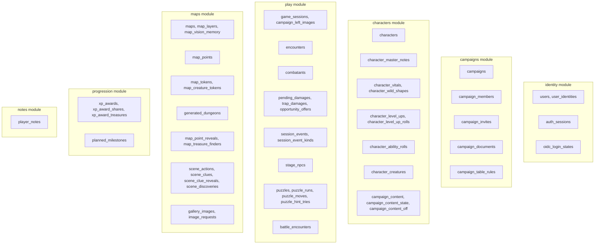
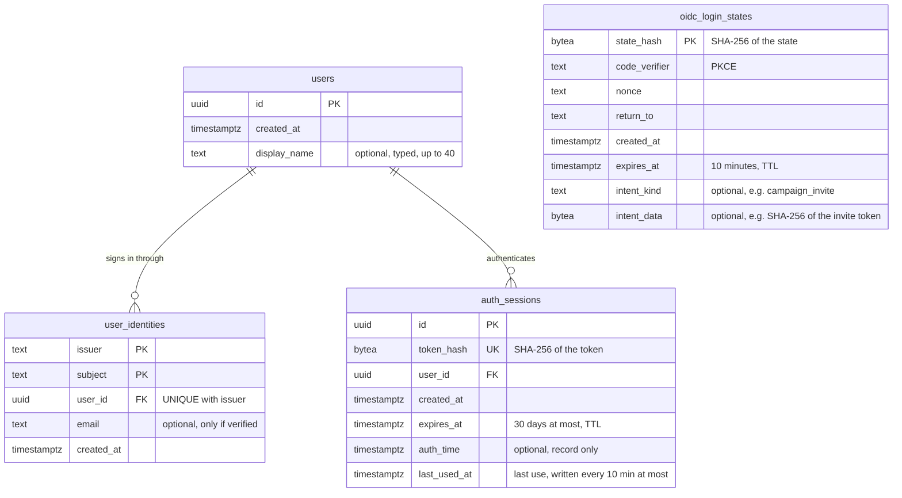
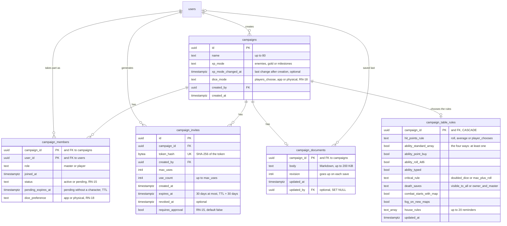
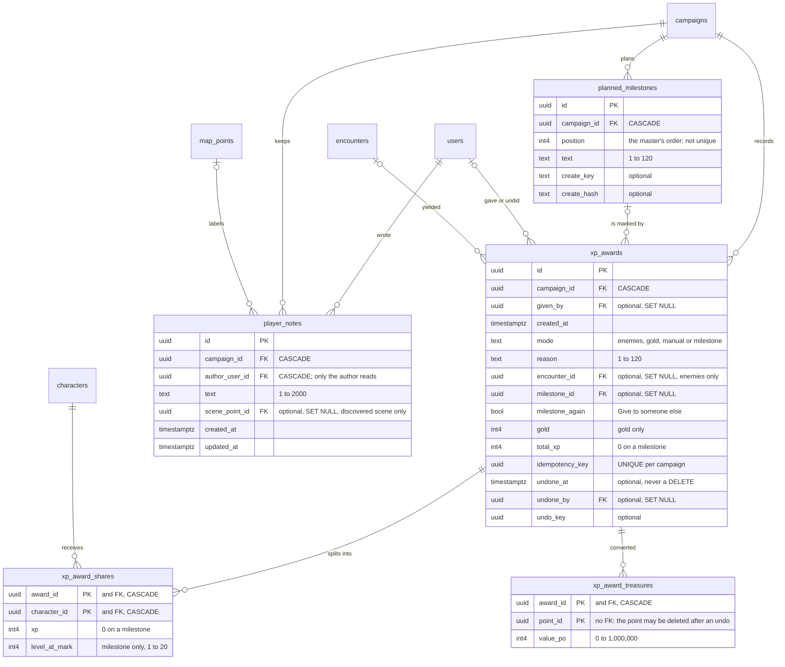

# Data model

The campaign is the center of the database. The schema starts from zero (migration `00001_init` is empty) and each module creates its own tables. This page describes what exists in `backend/migrations/` today: the tables of each module, the columns and constraints that matter, retention, idempotency and the migration conventions. The full per-migration list is in the [archive](archive/etapas.md).

The old app's database is not migrated. The one exception is a one-off, hand-reviewed import of the characters (for example Pensantus) from the old database into `characters`, tracked in the [roadmap](roadmap.md); it is a task, not a tool kept in the repository. See also [Privacy](privacy.md#the-legacy-app-database).

## Differences from the old app

In the old app (`server/src/db/schema.sql`) the campaign did not exist and everything belonged directly to the user. This table is only for readers who know the old schema; no row of it is migrated, except the characters above.

| Old app | Now | Why |
| --- | --- | --- |
| `users.role` is global (default `master`) | The role is `campaign_members.role` | A user can be master in one campaign and player in another (RN-05). |
| `characters.type` accepts `npc`, `player`, `boss`, `minion` | `characters.kind` accepts `player`, `enemy`, `boss`, `minion`, `story` | `npc` becomes two kinds: enemy (full sheet) and story (basic sheet). |
| A character links to the master by `master_user_id` | `characters.campaign_id` names the campaign; the owner is `player_user_id` (player character) or `master_user_id` (NPC) | A partial unique index guarantees one living character per player per campaign (RN-03). |
| No character copy | `characters.sheet_locked_at` (built); `characters.copied_from_id` and `campaign_characters` (planned with MR-021 and MR-022) | The lock has a date (RN-01); the copy remembers where it came from (RN-03). |
| `master_notes` on the character row | Its own table, `character_master_notes` | The query that builds the player's sheet never touches that table, so it cannot leak (RN-11). |
| `character_join_tokens.token` in plain text, per character | `campaign_invites.token_hash`, per campaign, with expiry | Whoever reads the database cannot use the invite (RN-07). |
| `maps.user_id` | `maps.campaign_id` | The map belongs to the campaign. |
| `maps.background_image` stores the image in base64 | Image in the blob store; the map points to a gallery image | Every map read would otherwise send the whole image. Leaving São Paulo costs US$ 0.19 per GiB, and a URL lets the browser cache. |
| Gallery only in the user's browser | `gallery_images`, tied to the campaign | Available on any device. |

The old app's tables have these counterparts: `users` (minus `role`), `auth_sessions` and `oauth_handshakes` (now `oidc_login_states`) have the same idea; `characters`, `maps` and `campaign_invites` (replacing `character_join_tokens`) are similar but reshaped as above; `map_points` were inside the map there; every other table in this page has no counterpart in the old app (the old campaign guide lived in the browser with the campaigns, and the old gallery too).

## Tables by module

Each table belongs to one module, which is the only code that writes it. A module reads another module's data through that module's interface, not by joining its tables (see [Architecture](architecture.md)).

## Conventions

These rules apply to every table. The sections below only repeat them when a table breaks or sharpens one.

- **Text with `CHECK`, not `ENUM`.** A closed set of values (`role`, `status`, `kind`, `mode`...) is a `TEXT` column with a `CHECK`. Adding a value is a simple migration. Where the set grows often (`session_events.kind`), it is a reference table instead (see [Reference tables](#reference-tables)).
- **Sizes are checked twice.** The API limit (in characters) is enforced by the server, and a looser `CHECK` (in bytes) is the last defence.
- **JSON documents.** A character's `sheet` and `story`, a map point's `trap`, a puzzle's `config` and `solution` and similar columns are JSON (protojson, with the `.proto` field names, which never change: `buf breaking` enforces it). No computed number is stored: the `rules` module computes everything on each read (ADR-0008). No index looks inside a document.
- **Foreign keys state their `ON DELETE`.** Deleting a campaign cascades to everything it owns. Deleting a user account cascades to what only that user can use (identities, sessions, notes) and sets `NULL` where history must survive (`actor_user_id`, `uploaded_by`, `given_by`). IDs that would close a reference cycle (`map_points` and `game_sessions` reference each other) are plain `UUID` columns without a foreign key, and the server checks them.
- **Indexes are only where something searches.** A foreign key that is only searched when a parent row is deleted usually has no index (`campaigns.created_by`, `characters.player_user_id`...); a table that is small enough makes that scan cheap. Where a cascade or an `ON DELETE SET NULL` scans a big table, the index exists (`puzzle_moves.user_id`, `image_requests` foreign keys, and by `character_id` and `actor_user_id` on `session_events`, `attacker_id` and `target_id` on `pending_damages`, `character_id` and `user_id` on `combatants`). `TestCascadeForeignKeysOfBigTablesAreIndexed` keeps those three tables covered.
- **Secrets are stored as hashes.** Session tokens, invite tokens and OIDC `state` are stored as SHA-256 only. Whoever reads the database cannot use them.
- **Personal data is minimal.** The only personal data in `users` is the display name the person types. Free text a person writes (names, notes) is listed in [Privacy](privacy.md).

### Retention and TTL

CockroachDB row-level TTL deletes expired rows with a daily job (hourly for login states). Queries keep filtering the expiry column, because an expired row exists until the job passes: a pending member past `pending_expires_at` is no member for authorization or for the master's list, and cannot clear the deadline, even before the job deletes the row. A new invite accepted by that person deletes the stale row first.

| Table | Expression | Effect |
| --- | --- | --- |
| `auth_sessions` | `expires_at` | Daily. A `CHECK` also forbids a session longer than 30 days. |
| `oidc_login_states` | `expires_at` (10 minutes) | Hourly. |
| `campaign_invites` | `expires_at + INTERVAL '30 days'` | An invite disappears 30 days after it expires. (After a later `ALTER TABLE`, CockroachDB shows the same expression as `expires_at + '30 days'::INTERVAL`; the TTL is the same.) |
| `campaign_members` | `pending_expires_at` | A pending member who never created the character disappears 30 days after joining (RN-15). The column is `NULL` for everyone else. |
| `characters` | `CASE WHEN kind = 'player' AND player_user_id IS NULL AND campaign_id IS NULL THEN created_at END` | Deletes only the orphan: a player character with no player (account deleted) and no campaign (campaign deleted). Nobody can reach it, and it still holds its author's free text. `TestOrphanedPlayerCharactersAreDeletedByTheDatabase` reads the table's configuration and checks the expression on real rows. |

Every `ADD COLUMN` on `characters` must set the TTL expression again at its end: CockroachDB rewrites the expression when a column is added, and without it the second run of the migration would leave the table different (`TestMigrationsAreSafeToRerun`). Migrations `00122` and `00179` do it.

### Idempotency columns

A retry must never create a second row, even when two calls with the same key run at the same time. The key is always protected by a unique index; the request hash catches the same key reused for a different request.

| Where | Columns | Rule |
| --- | --- | --- |
| `session_events` | `idempotency_key`, `idempotency_hash` | `UNIQUE (game_session_id, idempotency_key)`; `NULL` for an event without a key (NULLs do not collide). `idempotency_hash` is the hash of the whole request but its key, kept on the combat's changes (`CombatService`, Wild Shape, the familiar's eyes, the creature's casting and the trap fired by hand in a combat): the same key with the same request replays, with another request is `invalid_argument`. `NULL` on an event made before the column existed, which replays as it always did. |
| `xp_awards` | `idempotency_key`, `idempotency_hash`, `undo_key`, `milestone_again` | `UNIQUE (campaign_id, idempotency_key)`; `idempotency_hash` is the hash of the award's mode, reason, combat, amount, milestone, characters and treasures (the sets in any order), so a key reused for another award is `invalid_argument`; `NULL` on an award from before it existed, compared by what it left. The undo has its own key, which also accepts a retry; `milestone_again` lets the server refuse a key reused for another kind of request. |
| `image_requests` | `idempotency_key`, `idempotency_hash` | Unique per campaign (1 to 64 characters): a retry with the same key and the same request (`idempotency_hash`, the hash of the whole request but its key) returns the first row; the same key with another request is `invalid_argument`. `NULL` on a request from before the hash, replayed as it was. |
| `puzzle_moves`, `puzzle_hint_tries` | `idempotency_key` | `UNIQUE (run_id, idempotency_key)`: a repeated move returns the round as it is now. |
| `characters` | `create_key` (UUID), `create_hash` | Used by "Create NPC" from a creature (MR-042) and `CreateCharacter`. Partial unique index `(campaign_id, create_key)` where `create_key IS NOT NULL`. For the creature NPC the key is a UUID v5 of the campaign and the creature, so there is one such NPC per campaign and creature. For `CreateCharacter` it is a UUID v5 of the caller and the app's key, so it is unique per caller: another member sending the same key makes a character of their own. |
| `map_points` | `create_key`, `create_hash` | "Put on the map" of the treasure generator (`TreasureService.PlaceTreasure`, MR-044). The key carries the campaign ID (`<campaign>:<key>`) and has a partial unique index; the hash covers the whole request (map, square, mode, level, seed, name and content version). Only points made by that method have them. |
| `campaigns`, `maps`, `scene_actions`, `scene_clues`, `player_notes`, `game_sessions`, `puzzles`, `planned_milestones`, `campaign_content`, `character_creatures` | `create_key`, `create_hash` (`TEXT`, optional) | The idempotency key of the RPC that creates the row and the hash of the whole request except the key (see [Architecture](architecture.md#api-contracts-protobuf), rule 9). The key stores the owner and the app's key (`<user>:<key>`, `<campaign>:<key>` or `<campaign>:<author>:<key>`), so it is unique per owner. A partial unique index `<table>_create_key_idx` on `(create_key)` makes it hold under concurrency. `NULL` on rows made without a key. |

All keys and hashes are opaque values with no personal data.

### Reference tables

`session_event_kinds` (one row per `kind`) is the reference table of the session history's event types. `session_events.kind` points to it by a foreign key, so a new event type is an `INSERT ... ON CONFLICT DO NOTHING` in a migration, and no `session_events` row is read again. (An older `CHECK` listing the types was dropped and re-added in ten migrations, and each time CockroachDB checked every row of the fastest-growing table.) Nothing deletes from it, and the test databases copy it with its rows (`dbtest`). `TestSessionEventKindsMatchTheTable` (`play`) and `TestEveryEventKindOfTheCodeIsInTheTable` (`migrations`, which reads every `event...` constant under `internal/`) check that the code's list and the table's list are the same.

## identity module

`oidc_login_states` links to no account: the sign-in has not finished, so nobody knows who it is yet.

- **`users`** holds the account only: `id` and `created_at`. `display_name` is optional (`NULL` until the person chooses), 1 to 40 characters (a `CHECK`), and never comes from the sign-in provider. Name and photo from the provider are never stored.
- **`user_identities (issuer, subject, email)`** links the account to an OIDC sign-in. `(issuer, subject)` is the primary key, because `sub` is only unique within a provider. So the code does not depend on Google, and an account can have another way to sign in (ADR-0009) without changing `users`. `UNIQUE (user_id, issuer)`: an account has at most one identity per provider, so two Google accounts never merge. `email` is optional: it is stored only when the provider says it was verified, and is updated (or erased) at each sign-in.
- **`auth_sessions`** has an `id` (to list and revoke a session, ADR-0009), the SHA-256 `token_hash` (unique) and `auth_time` (record only). `last_used_at` (`NOT NULL`, default `now()`) is the last use, for the 14-day inactivity limit; it is written at most every 10 minutes and is left out of the `token_hash` lookup index. An index on `user_id` serves "sign out of all devices" and account deletion.
- **`oidc_login_states`** has the hash of `state` as its key. `intent_kind` and `intent_data` hold the sign-in intent: what to finish right after sign-in, such as accepting an invite (see [Architecture](architecture.md#accepting-an-invite-through-sign-in)). Both are `NULL` on an ordinary sign-in. For an invite, `intent_data` is the SHA-256 of the token, never the token. A `CHECK` requires both together, the kind with 1 to 32 characters and the data with at most 256 bytes.
- Every foreign key to `users` is `ON DELETE CASCADE`: deleting the account deletes identities and sessions.

## campaigns module

- **`campaign_members`** has no `id`: the primary key is `(campaign_id, user_id)`, which answers "is this person a member?" with one read. The index on `user_id` answers "which campaigns is she a member of?".
- **`role`** is `master` or `player` (`CHECK`). So are `campaigns.xp_mode` (`enemies`, `gold` or `milestones`, RN-09) and the other closed sets.
- **`campaigns.created_by`** is who created the campaign, today always the master. Deleting that account deletes the campaign, and with it the members and invites (see [Privacy](privacy.md#delete-the-account)). Deleting a player's account does not delete his character: the membership goes, but the character stays tied to the master (RN-16). With more than one master (RN-13, proposed), deleting the creator's account must delete the campaign only when the last master leaves; that will change the `ON DELETE` of `created_by` from a plain `CASCADE` to a rule that first checks whether another master remains.
- **Names.** `campaigns.name` is up to 80 characters and `display_name` up to 40, both with a length `CHECK`; the server also trims the ends, returns the name in Unicode form NFC and refuses line breaks, control characters, invisible characters (zero width, text direction, the line and paragraph separators) and a name with no visible character. A table content entry's name has the same rules.
- **`campaign_invites`** has `max_uses`, `use_count`, `expires_at` and `revoked_at`. Two `CHECK`s guarantee that `use_count` never exceeds `max_uses`, even with two players accepting at once, and that no invite lasts more than 30 days. The token is stored only as SHA-256 in `token_hash`, `UNIQUE`.
- **Invite with approval (RN-15, MR-024).** `requires_approval` (default `false`) says whether the person who accepts joins directly or stays pending. `campaign_members.status` (default `active`) is `active` or `pending` (`campaign_members_status_valid`); a second `CHECK` (`campaign_members_only_players_pending`) guarantees that only a player is pending, never the master. A pending member is not a member for anything, except creating and editing his own character (see [Architecture](architecture.md#pending-member)). When the master approves the character the row becomes `active`; when he refuses, the row is deleted, in the same transaction that changes or deletes the character.
- **Pending without a character disappears in 30 days (RN-15).** `pending_expires_at` is `joined_at + 30 days` while the membership is pending and the person has not created the character, and `NULL` in every other case: a `CHECK` (`campaign_members_expiry_only_pending`) forbids a deadline on an active member. Creating the character, and becoming active (master approval, or an ordinary invite), clear the column in the same transaction. The master's list ("pending without a character") is exactly `status = 'pending' AND pending_expires_at > now`; a pending member past the deadline is outside every membership read (`GetMembership`) until the TTL job deletes the row.
- **Dice (RN-18).** `campaigns.dice_mode` (default `players_choose`) says who decides how players roll: `players_choose`, `app` (everyone in the app) or `physical` (everyone with their own dice, typing the total). `campaign_members.dice_preference` (default `app`) is each member's choice, the master too; the membership belongs to the campaign, so the preference only counts there. It only matters under `players_choose`; under the other modes it is kept so it returns when the master goes back to letting people choose. Neither column stores a roll.
- **`campaigns.xp_mode_changed_at`** is when the master last changed the XP mode after the campaign was created (RN-09).
- **`campaign_documents`** (MR-018) holds the campaign document: at most one row per campaign, `campaign_id` as primary key. A campaign without a row has an empty document at revision 0; the first save writes the row at revision 1, and each later save raises the revision by 1, only if it is still the one the master read (see [Architecture](architecture.md#campaign-document)). `body` is the Markdown as written, up to 204,800 bytes (200 KiB; the `campaign_documents_body_size` `CHECK` uses `octet_length`, which counts bytes, the same unit as the API). `updated_by` is who saved last: deleting that account keeps the document with no editor (`SET NULL`); deleting the campaign deletes the document (`CASCADE`). The IDs in the text's links (`map:`, `character:`, `image:`) are not foreign keys: the server does not read them, and a link to something deleted just shows as unavailable.
- **`campaign_table_rules`** (MR-025, RN-24) holds the table rules: one row per campaign (primary key `campaign_id`, `CASCADE`). **Without a row the defaults apply**, which are what the app did before (the code reads a missing row as the zero value of `tablerules.Rules`), so no campaign needs a backfill and a master who never opens "Regras da mesa" never gets a row.
  - `hit_points_rule` is `roll`, `average` or `player_chooses` (the default).
  - Four booleans are the ways to make ability scores (`ability_standard_array`, `ability_point_buy`, `ability_roll_4d6`, `ability_typed`), all on by default, with a `CHECK` that at least one stays on.
  - `critical_rule` is `doubled_dice` (default) or `max_plus_roll`; `death_saves` is `visible_to_all` (default) or `owner_and_master`. Combat applies both.
  - `combat_starts_with_map` (default `true`: `StartEncounter` reads it in its own transaction when the request does not choose the combat mode, RN-25) and `fog_on_new_maps` (default `false`: `maps` reads it when creating a map) complete the three choices that a table style fills.
  - `house_rules` is a `TEXT[]` of up to 20 reminders (the server also limits each to 200 characters), which the app only displays.
  - **The dice mode stays in `campaigns.dice_mode`**: the table style writes it there, in the same transaction. **The style itself is never stored**: it comes from the dice mode, `combat_starts_with_map` and `fog_on_new_maps`, and "Personalizado" is whatever matches none of the three.
  - Free text exists only in the house rules, which the master writes for the table (fiction, no personal data).

## characters module

```mermaid
erDiagram
    characters {
        uuid id PK
        uuid campaign_id FK "optional, SET NULL"
        text kind "player, enemy, boss, minion or story"
        uuid player_user_id FK "player only, SET NULL"
        uuid master_user_id FK "NPC only, CASCADE"
        text status "active, dead or pending"
        text name "up to 80"
        jsonb sheet "CharacterSheet, up to 128 KiB"
        jsonb story "CharacterStory, up to 128 KiB"
        bool story_editing_allowed "story release"
        int4 sheet_schema
        int4 revision "goes up on each edit"
        timestamptz sheet_locked_at "optional, RN-01"
        timestamptz died_at "optional, RN-03"
        uuid create_key "idempotency of Create NPC (MR-042) and CreateCharacter"
        text create_hash
        timestamptz created_at
        timestamptz updated_at
    }

    character_master_notes {
        uuid campaign_id PK "and FK to campaigns"
        uuid character_id PK "and FK to characters"
        text notes "1 to 20000"
        timestamptz updated_at
    }

    character_vitals {
        uuid character_id PK "and FK to characters"
        int4 hit_points_current "0 or more, cut to the sheet maximum"
        int4 hit_points_temporary "0 or more"
        int4_array spell_slots_used "used per level, up to 9"
        int4 pact_slots_used "pact slots used"
        int4 hit_dice_used "hit dice used"
        jsonb resources_used "spent uses of the resources, {key: n}"
        uuid familiar_sight_creature_id FK "the familiar the player sees through, SET NULL"
        bool familiar_sight_in_combat "started in a combat"
        text_array familiar_sight_conditions "conditions the start gave"
        int4 revision "goes up on each correction"
        timestamptz updated_at
    }

    character_wild_shapes {
        uuid character_id PK "and FK to characters, CASCADE"
        text beast "the beast, monster:wolf"
        int4 hp "the beast HP, 1 or more"
        timestamptz updated_at
    }

    character_level_ups {
        uuid id PK
        uuid campaign_id FK "CASCADE"
        uuid character_id FK "CASCADE"
        text class_key "the class that gained the level"
        int4 from_level "total level before"
        int4 to_level "total level after, from_level + 1"
        text hp_method "average, rolled_in_app or rolled_physical"
        int4 hp_value "1 to 12: what the level took"
        jsonb choices "LevelUpChoices: only what is new"
        timestamptz created_at
    }

    character_level_up_rolls {
        uuid character_id PK "and FK, CASCADE"
        int4 to_level PK "total level after"
        text class_key "the class that rolled"
        int4 die "6, 8, 10 or 12"
        int4 value "1 to die"
        timestamptz created_at
    }

    character_ability_rolls {
        uuid campaign_id PK "and FK, CASCADE"
        uuid user_id PK "and FK, CASCADE"
        jsonb sets "six sets of four dice"
        text source "app or typed"
        timestamptz rolled_at
    }

    character_creatures {
        uuid id PK
        uuid campaign_id FK "CASCADE"
        uuid character_id FK "the owner, CASCADE"
        text monster_key "SRD creature"
        text name "1 to 40, free text from the player"
        text source "familiar, animate_dead, conjure_animals or master"
        text attack "none, reaction or full"
        uuid summon_group_id "creatures of one casting"
        uuid concentration_cast_id "optional, lasts while concentrating"
        int4 hp_current
        int4 hp_max
        timestamptz created_at
        timestamptz dismissed_at "optional"
        text dismissed_reason "optional"
    }

    campaign_content {
        uuid campaign_id PK "and FK to campaigns, CASCADE"
        text content_key PK "kind:name@mesa, never changes"
        text kind "class, subclass, race, subrace, background or spell"
        text name_pt "1 to 80"
        jsonb data "protojson of the kind, up to 64 KiB (CHECK 128)"
        int4 revision "campaign revision at the last change"
        timestamptz archived_at "optional, nothing is deleted"
        timestamptz created_at
        timestamptz updated_at
    }

    campaign_content_state {
        uuid campaign_id PK "and FK to campaigns, CASCADE"
        int4 revision "goes up on each write, same transaction"
        timestamptz updated_at
    }

    campaign_content_off {
        uuid campaign_id PK "and FK to campaigns, CASCADE"
        text content_key PK "SRD or table key, turned off for the players"
        timestamptz created_at
    }

    users |o--o{ characters : "plays or owns the NPC"
    campaigns |o--o{ characters : "gathers"
    campaigns ||--o{ character_master_notes : "keeps"
    characters ||--o{ character_master_notes : "has"
    characters ||--o| character_vitals : "has"
    characters ||--o| character_wild_shapes : "is in the form of"
    characters ||--o{ character_level_ups : "gained a level"
    campaigns ||--o{ character_level_ups : "records"
    characters ||--o{ character_level_up_rolls : "has the stored die"
    campaigns ||--o{ character_ability_rolls : "keeps the 4d6 of"
    users ||--o{ character_ability_rolls : "rolled for the next sheet"
    characters ||--o{ character_creatures : "has"
    campaigns ||--o{ character_creatures : "keeps"
    character_creatures |o--o{ character_vitals : "is seen through"
    campaigns ||--o{ campaign_content : "has the table content"
    campaigns ||--o| campaign_content_state : "counts the content writes"
    campaigns ||--o{ campaign_content_off : "turns options off for the players"
```

### characters

- **The campaign is on the character row.** `characters.campaign_id` replaces, for now, a `campaign_characters` link table. With a link table, guaranteeing RN-03 would need to copy `kind` into it and a composite foreign key, and still could not guarantee "one living character per player". With the column, RN-03 is a partial unique index with `status <> 'dead'`, so a pending character (MR-024) also counts as living. An NPC stays in the campaign where it was created; using the same NPC in other campaigns (MR-022, planned) brings the link table back, only for NPCs, without redoing anything.
- **The owner is in two columns**, each with the right `ON DELETE`: `player_user_id` (player characters only) with `SET NULL`, and `master_user_id` (NPCs only) with `CASCADE`. When the player deletes the account the character stays with the campaign's master (RN-16); when the master deletes the account his NPCs go with it. `campaign_id` uses `SET NULL`: when the campaign is deleted, the player character stays with the player. A `CHECK` (`characters_owner`) guarantees that a player character has no master owner, and an NPC has a master and no player.
- **State** is `status` plus `sheet_locked_at`; the API computes `CharacterState` from the two (see [Sheet lifecycle](product/rules.md#character-lifecycle)). `status` is `active`, `dead` or `pending`. The dead character changes state, never row (RN-03), and gets `died_at` (`CHECK characters_dead_since`). Other `CHECK`s guarantee that only a player character dies, is pending, is locked or gets the story release. The character created by a pending member is born `pending` (MR-024); the session does not lock it (`LockSheets` locks only `active`), and it cannot die: the master approves it (`active`, same revision) or refuses it.
- **The sheet is a document.** `sheet` is the protojson of `CharacterSheet`: the player's choices, by content key such as `class:wizard`. `story` is the protojson of `CharacterStory`: personality, appearance, history and allies. `CHECK`s guarantee that both are JSON objects of up to 128 KiB; the API limits, counted in characters, are well below. `sheet_schema` marks the sheet document's version, for a future v2.
- **The basic sheet (NPC)** keeps `initiative_bonus` and `attacks` (up to 3), and, when it comes from a creature, `monster_key` and `ability_scores`. `portrait_image_id` (a gallery image of the campaign) is a field of the sheet JSON, not a column: a player's sheet refuses it, the server checks the image belongs to the campaign, and deleting the gallery image removes the field from the sheets that have it, in the same transaction, raising their `revision`.
- **The NPC the app keeps for each creature put in combat as monsters** (RN-29) is **one per campaign and creature**, made the first time and reused by every combat. It also carries `combat_only` in the sheet (only the server writes it): `ListCharacters` uses it not to show the NPC to the master, and it refuses the NPC as a participant, on the stage and as a token (no extra column). The monsters in combat are copies of it: each one's name ("Bandido 1") and HP stay on the combatant row, and the NPC is never deleted (combatants, XP and the summary point to it).
- **The basic sheet has no fly speed**: a monster that flies walks with the speed `npcSheetFromCreature` chooses. Sheets saved with `attack_bonus` and `damage` as text are converted on read, with no migration (see [Architecture](architecture.md#characters-module-characters-and-sheets)). The challenge rating and the XP value of an NPC (`challenge_rating`, `xp_value`) are sheet fields too (`FullSheet` for enemy and boss, `BasicSheet` for minion): no column. The server checks the challenge rating against the `rules` list and the XP (0 to 1,000,000), and a player's sheet refuses both.
- **`story_editing_allowed`** is the story release the master gives, character by character (RN-01). The start of each session turns off all the campaign's releases.
- **`revision`** goes up on each change of name, sheet or story. A save with an old revision gets `aborted` in the API, so two people editing at once do not erase each other's work. Locking, dying and releasing the story do not touch the revision.
- **Refused character (MR-024).** `RejectCharacter` immediately deletes the pending character's row, with its story, and the player's pending membership. It is the only character deletion outside account deletion, and the query deletes only rows with `status = 'pending'`: an approved character changes state, never row (RN-03).
- **Index**: `(campaign_id, player_user_id)` serves the lists and the lock. There is no index on `player_user_id` or `master_user_id` alone: only account deletion searches by them.
- **`character_master_notes`** has the primary key `(campaign_id, character_id)`: the same NPC in two campaigns (MR-022) will have separate notes. Empty notes delete the row. Notes disappear with the campaign or the character, including a refused pending character; that deletion searches the notes by `character_id` without an index, which is cheap on a small table.
- **Campaign content** (`campaign_content`, `campaign_content_state`, `campaign_content_off`) is described below.

### Vitals, level-ups and creatures

- **`character_vitals`** keeps what changes during play and lasts from one session to the next (RN-02): `hit_points_current`, `hit_points_temporary`, `spell_slots_used` (an `INT4[]`: item k is the number of level-k slots used, up to 9 levels), `pact_slots_used` (the warlock's pact slots), `hit_dice_used` (the total of hit dice spent, summing all classes) and `resources_used` (a JSONB `{resource key: spent uses}`: Second Wind, Action Surge, Rage...; the totals come from the sheet and the stored value is cut to them on read, like slots), with `revision` (goes up on each correction) and `updated_at`. The primary key is `character_id` itself, `ON DELETE CASCADE`. Only player characters have a row; an NPC's combat HP lives on `combatants`. The name is "vitals", not "state", because a character's state is already the lifecycle.
  - **Maximums are not stored.** `rules.Derive` computes max HP, slots per level, pact slots and hit dice on each read, and the server cuts the stored value to today's maximum **on read only**: a correction writes back the stored usage of slots and resources, changing just what it sets, so a sheet that loses a level or a resource for a while gets its usage back with it. So there is no maximum `CHECK`, only a minimum: all numbers are 0 or more, and the array has at most 9 items.
  - **Without a row the character is whole:** full HP, nothing used. The row is born at the master's first correction.
  - `familiar_sight_creature_id` (FK to `character_creatures`, `SET NULL`, with a partial index for the `SET NULL`), `familiar_sight_in_combat` (started in a combat: ends at the start of the next turn) and `familiar_sight_conditions` (the conditions the start gave the combatant) say that the player sees through the familiar (MR-036).
- **`character_wild_shapes`** (MR-037) is the druid's Wild Shape: one row per character **in beast form** (none in its own form). `beast` is the SRD creature (`monster:wolf`) and `hp` the beast's current HP, 1 or more (at 0 the form ends and the row disappears; the maximum is the beast sheet's, never stored). The character's own HP (`character_vitals.hit_points_current`) stays still and only takes the damage that carries over. For the API it is part of the vitals (`CharacterVitals.wild_shape`), and changing the form raises the vitals' `revision` in the same transaction. It is a separate table, not vitals columns, because of locking: a combat write changes the vitals row and then reads the sheet through another connection (AC, attacks), and that read now needs the form; with the form on the same row it would wait on the write of the very transaction that asked for it. It disappears with the character (`CASCADE`).
- **`character_level_ups`** (MR-040) is the log of each guided level-up: one row per level-up, written in the same transaction that saves the sheet and never changed afterwards. `campaign_id` and `character_id` are `ON DELETE CASCADE`. `class_key` is the class that gained the level, `from_level` and `to_level` the total levels (`to_level = from_level + 1`, `CHECK`), `hp_method` (`average`, `rolled_in_app` or `rolled_physical`) and `hp_value` (1 to 12) repeat the level's HP so the history can be read without opening the JSON, and `choices` is the protojson of `LevelUpChoices`: only what was new (the ability score increase, the subclass, cantrips, spells, prepared spells, options, skills and expertise) and the HP, all content keys and numbers, no free text. The master reads the campaign's log newest first, in pages of up to 50 (`ListLevelUps`, with `page_token`), through the index `(campaign_id, created_at DESC, id DESC)`; a second index `(character_id, created_at)` serves one character's log.
- **`character_level_up_rolls`** holds the hit die the server rolled for the next level, kept until the level-up uses it: one row per `(character_id, to_level)`, **not** per class. The server rolls the next level's die once and returns the same result on later calls, so the player does not roll again until he likes the number (RN-18), and a two-class character does not roll a d6 and a d12 for the same level and keep the better. `class_key` is the class that rolled, and the roll is only valid for it. If the master lowers the level on the sheet, the roll for a level above stays stored and still counts when the character gets there. The level-up uses the row and deletes it; the value remains in `character_level_ups`. `die` (6, 8, 10 or 12) and `value` (1 to `die`) are `CHECK`ed.
- **`character_ability_rolls`** (MR-025, RN-24) keeps the six sets of 4d6 the server rolled (or the player typed, with physical dice) for a player's next sheet in the campaign: one row per player and campaign (`PRIMARY KEY (campaign_id, user_id)`, both `CASCADE`). `sets` is the JSON of the six sets of four dice, such as `[[6,5,5,2],...]` (the lowest die of each set is dropped; the result is the sum of the other three), and `source` is `app` or `typed` (RN-18). The server returns the same sets until that player's `CreateCharacter` uses them, in the same transaction that creates the sheet, which deletes the row: the next sheet rolls again. Numbers only.
- **`character_creatures`** (MR-037) are a player character's creatures: the familiar, animals and undead that a spell summoned, those the master gave. They last from session to session until the player or the master dismisses them (the app does not count the spell's duration). `monster_key` is the SRD creature (the sheet comes from `rules`, never stored); `name` is the name the player gave, **free text of 1 to 40 characters** (listed in [Privacy](privacy.md)); `source` says where it came from, and `attack` what the spell lets it do (`none` for the familiar, `reaction` for the Pact of the Chain one, `full`). `summon_group_id` is that of the creatures of one casting (initiative and undo), and `concentration_cast_id` marks those that last only while the caster concentrates (Conjure Animals): when concentration ends they are dismissed. `hp_current` and `hp_max` (the maximum is the creature sheet's, copied at birth) are its HP outside combat, corrected by the master (RN-02). A dismissed creature **is not deleted**: it keeps `dismissed_at` and `dismissed_reason` (`owner`, `master`, `defeated` at 0 HP, `concentration`, `replaced` by a new familiar, `undone`), so the master's "Undo" can bring it back. It cascades with the campaign and with the character. Indexes: the living ones of a character (partial, `dismissed_at IS NULL`), those of a casting and those of a campaign.

### Table content (MR-025, RN-23, ADR-0018)

- **`campaign_content`**: one row per **entry** (class, subclass, race, subrace, background or spell), with the key `<kind>:<name>@mesa` (the server builds it from the name at creation and it never changes), the name in Portuguese, `data` (the protojson of the kind's message, in `rules/v1/table_content.proto`, with the keys of the features the server made), the campaign revision at the entry's last change and `archived_at`. The key is unique per campaign, entries disappear with the campaign (`CASCADE`) and **nothing is deleted**: what a sheet already uses must keep working, so the way out is to archive. The limits are 300 entries per campaign and 64 KiB of `data` per entry (the server rule, which shows the error on the field; the 128 KiB `CHECK` is the last defence, with room for JSONB being longer than compact protojson). Archiving and unarchiving are not changes of the entry: only `archived_at` changes (`revision` and `updated_at` stay, and the campaign revision goes up, for the cache); `updated_at` is the date of the last real change, the one the "A classe mudou" warning shows.
- **`campaign_content_state`** holds the campaign's content revision: one row per campaign, created by the first write (no row means revision 0). It goes up by one **in the same transaction** as every write; every write starts by raising it, so two writes to the same campaign run one after the other, and every content read reads this row inside the caller's transaction (see [Architecture](architecture.md#live-table-content)). It lives in `characters` and not in `campaigns` so `characters` does not write a column of another module.
- **`campaign_content_off`**: the options the master **turned off** for the players ("Opções para os jogadores"), one row per turned-off option, `(campaign_id, content_key)` as primary key with `created_at`. Everything is on by default, so **no row means on**, and turning on again deletes the row. The key is that of an SRD or table class, subclass, race, subrace, background or spell (`class:wizard`, `race:anao@mesa`); it is not a foreign key (SRD keys live in the rules snapshot, not in a table), and the server checks the key exists before writing. `TableSource` reads it in the same transaction as the revision and adds it to the content (`Overlay.Off`); what is in it never reaches a player, in any read. Each write raises the campaign revision in the same transaction, so cached content, per (campaign, revision), is always read with the set that goes with it.
- **The revision a sheet was last saved with**, and its warnings (`known_issues`), live **inside the sheet document** (`FullSheet.content_revision` and `known_issues`, written by the server on each save), with no column: an entry that changed after it becomes the "A classe mudou" warning. (A column on `characters` was tried and dropped: the table has a row-level TTL, and any repeated `ALTER` rewrites the TTL expression, which `TestMigrationsAreSafeToRerun` sees as a schema change.) Only names and texts the master writes, no personal data (see [Privacy](privacy.md)).

## play module

```mermaid
erDiagram
    game_sessions {
        uuid id PK
        uuid campaign_id FK
        int4 session_number "UNIQUE per campaign"
        timestamptz started_at
        timestamptz ended_at "empty while open"
        uuid current_map_id FK "optional, SET NULL"
        uuid shown_image_id FK "optional, SET NULL, MR-028"
        bool shown_image_keep "switch Deixar com os jogadores"
        uuid open_scene_point_id FK "optional, SET NULL, MR-015"
    }

    campaign_left_images {
        uuid campaign_id PK "and FK, CASCADE"
        uuid image_id PK "and FK to gallery_images, CASCADE"
        timestamptz left_at
    }

    session_event_kinds {
        text kind PK "one kind per row; reference data"
    }

    session_events {
        uuid id PK
        uuid game_session_id FK
        int4 seq "UNIQUE per session, from 1"
        text kind FK "session_event_kinds"
        uuid actor_user_id FK "optional, SET NULL"
        uuid character_id FK "optional, SET NULL"
        uuid encounter_id FK "optional, CASCADE"
        jsonb payload "numbers before and after, up to 4 KiB"
        uuid idempotency_key "optional, UNIQUE per session"
        timestamptz created_at
    }

    stage_npcs {
        uuid id PK
        uuid game_session_id FK "CASCADE"
        uuid character_id FK "CASCADE"
        int4 position "order of entry, from 0"
        bool speaking "at most one per session"
        timestamptz created_at
    }

    encounters {
        uuid id PK
        uuid game_session_id FK "CASCADE"
        uuid map_id FK "optional, SET NULL"
        uuid map_point_id FK "optional, SET NULL"
        text name "1 to 80"
        text mode "grid or theatre, chosen at the start"
        text status "setup, active or ended"
        int4 round "0 in setup"
        uuid current_combatant_id "whose turn it is, no FK"
        int4 grid_columns "copied from the map, 4 to 200; 0 in theatre"
        int4 grid_rows "1 to 400; 0 in theatre"
        int4 revision "goes up on each change"
        timestamptz created_at
        timestamptz started_at "optional"
        timestamptz ended_at "optional"
    }

    combatants {
        uuid id PK
        uuid encounter_id FK "CASCADE"
        uuid character_id FK "CASCADE"
        uuid user_id FK "optional, SET NULL"
        text label "1 to 40, Goblin 2"
        text kind "player, npc or creature"
        bool hidden "RN-10, an NPC is born hidden"
        int4 initiative "total, optional"
        int4 initiative_bonus
        int4 initiative_face "the d20, optional"
        bool tie_ordered "RN-19"
        int4 order_index "turn order"
        int4 grid_col "optional"
        int4 grid_row "optional"
        int4 speed_ft
        int4 movement_used_ft "in feet, rounded down"
        int4 movement_used_dft "in tenths of a foot, the real value (RN-21)"
        int4 last_move_dft "last on-foot move of the turn: the jump run-up"
        text side "party or enemy, the master's Ally"
        text size "tiny to gargantuan, Medium by default"
        int4 speed_fly_ft "0: does not fly"
        int4 jump_long_dft "long jump with a run-up"
        int4 jump_high_dft "high jump with a run-up"
        text cover_mark "none, half, three_quarters, total: the master's mark"
        bool disengaged "Disengage this turn"
        bool action_surged "Action Surge used this turn"
        bool dashed
        bool action_used
        bool bonus_action_used
        bool reaction_used
        int4 attacks_made "attacks of the Attack action this turn"
        int4 ac_bonus "Shield: +5 until the next turn, 0 to 30"
        bool death_save_rolled "this turn's death save"
        int4 hp_current "NPC and creature only"
        int4 hp_max "NPC and creature only"
        int4 hp_temp "NPC and creature only"
        int4 xp_value "XP when defeated, NPC only, 0 to 1,000,000"
        bool defeated
        int4 death_successes
        int4 death_failures
        text_array conditions "RN-22"
        text concentration_spell "optional"
        uuid creature_id FK "creature only, character_creatures, CASCADE"
        text monster_key "creature only"
        text summon_attack "creature only: none, reaction or full"
        uuid summon_group_id "creature only, the casting"
        bool dismissed "dismissed creature: out of the order but kept"
        timestamptz created_at
    }

    pending_damages {
        uuid id PK
        uuid encounter_id FK "CASCADE"
        uuid attacker_id FK "combatants, CASCADE, optional (trap)"
        uuid trap_point_id "the trap, optional, no FK"
        uuid target_id FK "combatants, CASCADE"
        text attack_key "weapon or cantrip"
        text status "awaiting_reaction, awaiting_roll, rolled, applied or discarded"
        bool critical "critical hit"
        int4 dice_count "dice to roll: doubled on a critical, or the usual ones under max plus roll"
        int4 critical_max "the dice maximum a critical adds without rolling, 0 otherwise"
        bool critical_max_rule "the table was on max plus roll"
        int4 dice_sides
        int4 dice_bonus
        text damage_type "damage-type:fire"
        int4_array faces "what the app rolled"
        bool physical "typed total"
        int4 amount "the damage that counts, optional"
        uuid cast_id "the casting, optional, no FK"
        bool healing "healing, not damage"
        bool half "passed the save: half"
        int4 applied_amount "what the master applied, optional"
        int4 attack_total "the strike total, while waiting for the reaction"
        int4 attack_armor_class "the AC the strike was compared with, optional"
        int4 roll_total "the roll total before halving"
        timestamptz created_at
        timestamptz resolved_at "optional"
    }

    trap_damages {
        uuid id PK
        uuid game_session_id FK "CASCADE"
        uuid trap_point_id "no FK"
        uuid fire_id "the trigger"
        uuid character_id FK "CASCADE"
        text status "rolled, applied or discarded"
        int4 dice_count
        int4 dice_sides
        int4 dice_bonus
        int4 critical_max "the maximum a critical adds without rolling"
        text damage_type "damage-type:fire"
        int4_array faces
        int4 roll_total
        bool half "passed the save"
        int4 amount "the damage that counts"
        int4 applied_amount "what the master applied, optional"
        timestamptz created_at
        timestamptz resolved_at "optional"
        text settle_key "the scoped idempotency key of the call that settled it, optional"
        text settle_hash "the hash of that request, optional"
    }

    opportunity_offers {
        uuid id PK
        uuid encounter_id FK "CASCADE"
        uuid move_id "the offers of one move, no FK"
        uuid mover_id FK "combatants, CASCADE"
        uuid reactor_id FK "combatants, CASCADE"
        int4 left_col "where it left the reach; NULL if the master offered"
        int4 left_row "NULL if the master offered"
        text state "pending, attacked, declined, skipped or withdrawn"
        uuid attack_pending_id FK "pending_damages, SET NULL, optional"
        timestamptz created_at
        timestamptz answered_at "optional"
    }

    puzzles {
        uuid id PK
        uuid campaign_id FK "CASCADE"
        text kind "lights, lock, pillars, riddle, sequence or cipher"
        text name
        jsonb config "the public configuration of the kind"
        jsonb solution "master only"
        int8 seed
        jsonb start
        int4 minimum_moves "optional"
        text clue
        jsonb hints "the list, 10 at most"
        text solve_action "notify, open_door, reveal_point or reveal_clue"
        jsonb solve_target "optional"
        text hint_skill "optional, the skill of the check hint"
        int4 hint_dc "optional, the DC: master only"
        jsonb parts "the split information, 8 at most"
        jsonb on_wrong "optional, the On wrong"
        text create_key "optional"
        text create_hash "optional"
        timestamptz archived_at "optional"
        timestamptz created_at
        timestamptz updated_at
    }

    puzzle_runs {
        uuid id PK
        uuid game_session_id FK "CASCADE"
        uuid puzzle_id FK "CASCADE"
        int8 seed
        jsonb start
        jsonb state
        int4 released_hints
        timestamptz shown_at "optional"
        timestamptz closed_at "optional"
        timestamptz solved_at "optional"
        uuid solved_by_character_id FK "SET NULL"
        text solve_outcome "optional"
        text solve_message "optional, what the players read"
        uuid last_mover_character_id FK "SET NULL"
        jsonb last_move "optional"
        timestamptz last_moved_at "optional"
        int4 moves_made
        int4 revision
        int4 plays "how many times the master played the sequence"
        timestamptz play_started_at "optional, the last play"
        int4 round_start_seq "the round's moves come after it"
        timestamptz round_started_at "optional, when the round started"
        timestamptz created_at
        timestamptz updated_at
    }

    puzzle_moves {
        uuid id PK
        uuid run_id FK "CASCADE"
        int4 seq "UNIQUE with run_id"
        uuid user_id FK "SET NULL"
        uuid character_id FK "SET NULL"
        uuid idempotency_key "UNIQUE with run_id"
        jsonb move
        int4 revision
        bool solved
        bool wrong "a wrong answer or bell"
        timestamptz created_at
    }

    puzzle_hint_tries {
        uuid id PK
        uuid run_id FK "CASCADE"
        uuid user_id FK "SET NULL"
        uuid character_id FK "SET NULL"
        uuid idempotency_key "UNIQUE with run_id"
        int4 hint_index "UNIQUE with run_id and user_id"
        bool passed
        int4 granted_count "optional, the hints the player reads after passing"
        int4 d20
        int4 modifier
        int4 total
        bool physical
        timestamptz created_at
    }

    battle_encounters {
        uuid map_point_id PK "FK to map_points, CASCADE"
        uuid campaign_id FK "CASCADE"
        uuid map_id FK "CASCADE"
        jsonb encounter "BattleEncounter: creatures, quantities, names, HP, hidden"
        timestamptz created_at
        timestamptz updated_at
    }

    campaigns ||--o{ game_sessions : "holds"
    maps |o--o{ game_sessions : "is the current map of"
    gallery_images |o--o{ game_sessions : "is shown in"
    map_points |o--o{ game_sessions : "is the open scene of"
    campaigns ||--o{ campaign_left_images : "left with the players"
    gallery_images ||--o{ campaign_left_images : "is left in"
    game_sessions ||--o{ session_events : "records"
    session_event_kinds ||--o{ session_events : "gives the kind of"
    users |o--o{ session_events : "made"
    characters |o--o{ session_events : "is the subject of"
    encounters |o--o{ session_events : "has the events of"
    game_sessions ||--o{ stage_npcs : "puts on stage"
    characters ||--o{ stage_npcs : "is on stage"
    game_sessions ||--o{ encounters : "has"
    maps |o--o{ encounters : "is the stage of"
    map_points |o--o{ encounters : "started at"
    encounters ||--o{ combatants : "includes"
    characters ||--o{ combatants : "acts as"
    character_creatures |o--o{ combatants : "fights as"
    users |o--o{ combatants : "plays"
    encounters ||--o{ pending_damages : "has"
    combatants ||--o{ pending_damages : "attacks"
    combatants ||--o{ pending_damages : "suffers"
    encounters ||--o{ opportunity_offers : "has"
    combatants ||--o{ opportunity_offers : "moves"
    combatants ||--o{ opportunity_offers : "reacts"
    pending_damages |o--o| opportunity_offers : "opens"
    game_sessions ||--o{ trap_damages : "keeps"
    characters ||--o{ trap_damages : "suffers"
    campaigns ||--o{ puzzles : "has"
    game_sessions ||--o{ puzzle_runs : "plays"
    puzzles ||--o{ puzzle_runs : "is played in"
    puzzle_runs ||--o{ puzzle_moves : "keeps"
    puzzle_runs ||--o{ puzzle_hint_tries : "keeps"
    characters |o--o{ puzzle_moves : "played"
    users |o--o{ puzzle_hint_tries : "tried"
    characters |o--o{ puzzle_hint_tries : "rolled"
    map_points ||--o| battle_encounters : "keeps"
    campaigns ||--o{ battle_encounters : "has"
    maps ||--o{ battle_encounters : "has the points of"
```

### Sessions and what they show

- **`game_sessions`** holds only IDs and times, no personal data. `session_number` counts the campaign's sessions from 1, with `UNIQUE (campaign_id, session_number)`. A session is open while `ended_at` is empty, and a partial unique index leaves at most one open per campaign. It disappears with the campaign. Starting a session writes the row, locks the sheets and turns off the story releases, all in the same transaction; the last two parts belong to the `characters` module, which `play` calls through an interface (see [Architecture](architecture.md#play-module-game-sessions)).
- **What the session shows** is on the session row: `current_map_id`, the current map, and `shown_image_id`, the image the master shows the players (MR-028). Both are optional and independent, and a new session starts with neither. The foreign keys are `ON DELETE SET NULL`: deleting the map, or the image, takes it off the screen. There is no index on these columns: only deleting a map or image searches for them, and `game_sessions` is small (one row per game night). The target tables belong to the `maps` module; `play` keeps only the ID, and checks and reads the map and image through the `MapKeeper` interface (see [Architecture](architecture.md#what-the-session-shows)).
- **Images left with the players** (`campaign_left_images`, MR-028) belong to the campaign, not the session: they remain after the session ends, until the master takes them away. The primary key is (`campaign_id`, `image_id`): it lists a campaign's images and prevents leaving the same one twice; `left_at` gives the order. Deleting the campaign or the gallery image deletes the row (`CASCADE`). There is no index on `image_id`: only deleting an image searches for it. The switch of the image still on display is `game_sessions.shown_image_keep`: on, stopping the display, swapping or ending the session copies the image into this table, in the same transaction.
- **The open scene**: `game_sessions.open_scene_point_id` is the `scene` point the master opened in the session, one at a time, like `current_map_id` and `shown_image_id`. `NULL` is no scene; a new session starts with none. Opening a hidden point does not reveal it on the map (RN-10). Deleting the point closes the scene (`SET NULL`); changing the point's kind makes the scene read as closed. What counts as "scene open again" is the last `scene_opened` of the session: a roll only counts toward the action's attempt limit (`scene_actions.max_attempts`; extra attempts the master gives are `scene_attempt_granted` events) if it comes after it, so closing and opening the scene resets the counts without deleting any history row.
- **The stage** (`stage_npcs`, MR-031) is a small table, not columns of `game_sessions`: one row per NPC on stage, with `game_session_id` and `character_id` (both `ON DELETE CASCADE`: a deleted NPC leaves the stage), `position` (the order of entry, from 0; a new NPC takes the highest position plus one, so removing one leaves a gap that does not change the order), `speaking` and `created_at`. `UNIQUE (game_session_id, character_id)` prevents the same NPC twice, and the partial unique index `stage_npcs_one_speaker` leaves at most one speaking. The limit of 4 is checked in the inserting transaction, with the session row locked, like a scene's actions. `id` is the place on the stage, made when the NPC enters: it is what the player's copy carries instead of the character ID, which is the master's secret (RN-20). Closing or changing the scene deletes the session's rows; an ended session just stops being read. Each change is a `session_events` `stage_changed` with a payload of IDs only (`change`: `put`, `taken_off`, `speaker` or `cleared`, and the `character_id`).

### Session history

**`session_events`** (ADR-0007) is the session history: each change made at the table becomes a row that is never altered, written in the same transaction as the change.

- `seq` numbers each session's events from 1, in the order they happened: the next is the highest plus 1, read with the session row locked (`FOR UPDATE`), and `UNIQUE (game_session_id, seq)` is the final guarantee.
- `idempotency_key` is the UUID the app sends with the change; see [Idempotency columns](#idempotency-columns).
- `payload` is a small JSON (an object, up to 4 KiB, by `CHECK`) with the numbers before and after: no free text, no names. `actor_user_id` is who made the change (`ON DELETE SET NULL`: a deleted account vanishes from the history) and `character_id` the character (`SET NULL` if it is deleted, which keeps the history). Account IDs inside payloads do not disappear with the account (see [Privacy](privacy.md)).
- `encounter_id` (optional, `CASCADE`) says which combat the event belongs to, for the log and the undo; it is `NULL` on HP corrections and on events from before it existed. A partial index serves a combat's events in order. Two partial indexes, by `character_id` and by `actor_user_id` (where not `NULL`), serve the `SET NULL` when a character or an account is deleted, so that deletion does not scan the history.
- **The event types** are the rows of `session_event_kinds`. They are: the master's HP correction (`character_vitals_adjusted`, RN-02); the combat (`encounter_started`, `initiative_submitted`, `initiative_order_set`, `combat_begun`, `turn_ended`, `turn_part_ended`, `combatant_moved`, `combatant_hidden_set`, `combatants_added`, `combatant_removed`, `encounter_ended`); the actions (`attack_rolled`, `damage_rolled`, `damage_applied`, `damage_discarded`, `action_taken`, `hit_points_adjusted`, `action_undone`: the undo is a compensating row, the undone one stays); spells and the rest (`spell_cast`, `reaction_used`, `reaction_declined`, `death_save_rolled`, `death_confirmed`, `conditions_set`); XP and scenes (`xp_awarded`, `xp_award_undone`, `milestone_marked`, `scene_opened`, `scene_closed`, `scene_check_rolled`, `scene_attempt_granted`); the table (`clue_revealed`, `stage_changed`); traps, treasure, cover and sides (`trap_noticed`, `trap_searched`, `trap_triggered`, `trap_disarmed`, `trap_revealed`, `treasure_found`, `treasure_unfound`, `cover_set`, `side_set`); opportunity attacks (`opportunity_offered`); creatures (`creature_summoned`, `creature_dismissed`, `wild_shape_started`, `wild_shape_ended`, `familiar_sight`); doors (`door_opened`); and puzzles (`puzzle_shown`, `puzzle_solved`, `puzzle_reset`, `puzzle_closed`).
- **Payload rules.** Payloads hold only IDs, keys and numbers: a weapon's name never enters (the log reads it from the sheet); the reason of an XP award stays in `xp_awards`, never in the payload. Action events carry the round, `secret` (a hidden combatant was in it: the player never receives the row, even if the master shows the combatant later, RN-20) and the "before" of everything the undo restores (`combat_events.go`). Notable payloads:
  - `combatant_moved` carries cost and distance also in tenths of a foot (`cost_dft`, `distance_dft`), the jump (`jump`: `long` or `high`, and `height_dft`), whether a jump landed on difficult terrain (`landing_difficult`, shown only in the master's log) and where the combatant left from (`from`: the square, the movement already walked, the run-up and the cover mark), which the undo restores (`UndoLastAction` undoes this kind). Spending movement by number (`SpendMovement`, in a gridless combat) writes a `combatant_moved` with no square.
  - `side_set` carries the combatant and the new and previous side (`party` or `enemy`); `cover_set`, the combatant and the new and previous mark (`none`, `half`, `three_quarters`, `total`); `attack_rolled` and `spell_cast` carry the cover the target had (`cover`, `cover_source`, `cover_bonus`) and the AC already with it (`target_ac`, which only the master reads); `action_taken` carries `disengaged_before`.
  - In a map with fog, the payload of action events with an NPC in it carries `fogged` and `seen_by`, the account IDs of the players who saw **all** the NPCs of the event when it happened (in a move, in either of the two squares); the combat log gives the row only to those players and never recomputes the list (`combat_fog.go`). A map cover that only some players would read the same way carries `cover_restricted` and `cover_seen_by` (in the event and in each target of a spell); the opportunity attack keeps the square the target left from in `col` and `row`.
  - `opportunity_offered` with `by_hand` (a gridless combat: the master's offer, no square) closes the undo chain, unlike a move's offers; "Retirar a oferta" is a `reaction_declined` with `withdrawn`, which the undo puts back.
  - `door_opened` carries the combatant, the door's square, where it came from and the round; the move's undo does not undo it (an open door stays open) and it never closes the undo chain. It is written in the move's transaction, before the move's own event.
  - `scene_opened`: the `point_id` and how many actions the scene had; `scene_closed`: the `point_id`; `scene_check_rolled`: the `point_id`, the `action_id`, the check key, the d20, the bonus, the total, whether it was a physical die, whether the scene showed the DC to the players at that moment (`dc_shown`, what the session summary counts) and, when the action had a DC, `passed`; `scene_attempt_granted`: `point_id` and `action_id`; `clue_revealed`: `clue_id`, `point_id` and the `character_ids` that did not yet have the clue (never its text). No person, action or scene names, and no DC.
  - `puzzle_shown`, `puzzle_solved`, `puzzle_reset` (also "Gerar outro começo") and `puzzle_closed` carry `puzzle_id` and `run_id`; `puzzle_solved` also carries `outcome` (what "Ao resolver" did), and the character that solved is the event's `character_id`. State, solution and moves never enter: they stay in `puzzle_moves`. Moves are not events.

### Combat

- **`encounters`** are a session's combats. `status` is `setup` (choosing who fights and rolling initiative), `active` (turns run) or `ended`, by `CHECK`. A session has at most one that has not ended (partial unique index `encounters_one_open_per_session`); ended ones stay, as a record, and the session's latest combat (`GetLatestEncounter`) is the open one whatever the clock that stamped `created_at` said, then the ended ones by `created_at`. `round` is 0 in `setup` and counts from 1. `current_combatant_id` is whose turn it is and **has no foreign key**: combatants point to the combat, and the service passes the turn before deleting the current combatant. `map_id` and `map_point_id` (both `SET NULL`) say where and from where the combat started; `grid_columns` and `grid_rows` are **copied** from the map's grid when the combat is born, so changing the grid later moves nobody. `revision` goes up on each change. It disappears with the session, and the session with the campaign (`CASCADE`).
  - **`mode`** (MR-025, RN-25) is `grid` (the combat on the map, the only one that existed at first, and the default) or `theatre` (gridless combat, "theatre of the mind"): the master chooses at the start and nothing changes it later. In `theatre`, `map_id` and `map_point_id` are `NULL`, `grid_columns` and `grid_rows` are 0 (`CHECK encounters_grid_valid` requires this, and only this, in that mode; `grid` keeps the usual limits, 4 to 200 columns, 1 to 400 rows) and no combatant has a square (`combatants.grid_col` and `grid_row` stay `NULL` through the whole combat). Spent movement stays in `combatants.movement_used_dft`, the same field in both modes (see [Architecture](architecture.md#combat-without-a-grid-theatre-of-the-mind)).
- **`combatants`** are who fights. `kind` is `player`, `npc` or `creature` (a character's creature, MR-037: its `character_id` is the **owner's**, `user_id` is the owner's player, and `creature_id`, `monster_key`, `summon_attack` and `summon_group_id` exist only in that kind, by `CHECK`; `dismissed` hides the combatant of a creature whose concentration ended, without deleting it, for the master's undo; creatures with the same `summon_group_id` roll one initiative). Copies of the same NPC share the `character_id`, each with its own `label` ("Goblin 2", up to 40 characters) and its own initiative (RN-19). `user_id` is the player of a player combatant (`SET NULL` if the account is deleted, RN-16).
  - `hidden` is the master's switch: the server never sends a hidden combatant to a player (RN-10, RN-20), and every new NPC is born hidden.
  - Initiative: `initiative` is the total, `initiative_face` the d20 (both null until rolled, `CHECK`), `initiative_bonus` the bonus copied from the sheet, `order_index` the place in turn order and `tie_ordered` says the master settled a tie (RN-19).
  - Position: `grid_col` and `grid_row` (both null while without a square). `speed_ft` is the speed copied on entry; `movement_used_ft` (feet, rounded down, for the published app), `movement_used_dft` (tenths of a foot: the real value, RN-21), `last_move_dft` (the turn's last on-foot move, the run-up of a jump), `disengaged`, `action_surged` (Action Surge, once per turn), `dashed`, `action_used`, `bonus_action_used`, `reaction_used`, `attacks_made` (the Attack action's attacks), `ac_bonus` (the Shield's +5, back to 0 at the start of the character's next turn) and `death_save_rolled` are the current turn; all return at the start of the combatant's turn (`ResetCombatantTurn`).
  - Also copied from the sheet on entry (MR-034): `size` (the race's size, or `BasicSheet.size`; Medium by default), `speed_fly_ft` (0 for one that does not fly) and the jump limits with a run-up (`jump_long_dft`, `jump_high_dft`, from `rules/combat.JumpLimits`; standing is half). `side` (`party` or `enemy`: a player character enters `party`, an NPC `enemy`, and the master changes it with `SetCombatantSide`) and `cover_mark` (the cover the master marked by hand, which disappears when the combatant moves) belong to the master and the combat, not the sheet.
  - **Only the NPC and the creature have HP here** (`hp_current`, `hp_max`, `hp_temp`, checked by `CHECK` according to `kind`; the creature's returns to `character_creatures` when the combat ends): a player character's stays in `character_vitals`, one source only (RN-02), and the combat never changes the NPC's sheet (RN-04). `xp_value` is the XP an NPC gives when defeated, copied from the sheet on entry (MR-016), so editing the sheet later does not touch a running combat; only the master receives it (RN-20).
  - `defeated` is set by damage and by the master's "Dano/Cura": an NPC at 0 HP is defeated, and healed above 0 returns to the order. A player character at 0 HP is **not** `defeated` (it stays in the turns, for death saves): the "Caído" that `GetEncounter` shows comes from `character_vitals`. Only the death the master confirms (`ConfirmDeath`) makes it `defeated`, and then it leaves the order and the character becomes `dead` in `characters`. `death_successes` and `death_failures` (0 to 3) keep the death saves (RN-03) and stay on the row after the combat, for the summary; `conditions` (SRD keys, up to 20) and `concentration_spell` (the spell's key) are the RN-22 labels, without effect.
  - Indexes: `character_id` (deleting a character removes its combatants), `user_id` (partial, `user_id IS NOT NULL`: deleting an account clears it), the combatant of a creature (partial, `creature_id IS NOT NULL`: dismissing a creature takes it out of the combat) and combatants in turn order.
- **`pending_damages`** (MR-012, MR-014) keeps the damage of a strike that hit, from the d20 to the end. `status` is `awaiting_reaction` (the strike hit a character who can cast Shield and waits for the answer), `awaiting_roll` (hit, damage still to roll), `rolled` (rolled, on a player character, waiting for the master), `applied` or `discarded`.
  - `dice_count` (already doubled on a critical, or the usual dice when the table uses "max plus roll"), `dice_sides` and `dice_bonus` are the damage to roll, and `critical_max` the amount a critical adds without rolling (the maximum of the dice, only under that rule; 0 otherwise), **copied from the sheet** when the strike hits, so changing the sheet later does not touch an open roll; zero dice is a fixed number. `critical_max_rule` records that the rule was that when the hit was opened, so a fixed-damage critical also states the rule. `faces`, `physical` and `amount` are what was rolled (or the typed sum with physical dice) and the damage, null until rolled. `damage_type` is the content key, such as `damage-type:fire`.
  - A spell opens rows that share `cast_id` (a label, no foreign key: the `spell_cast` event says what the casting was, and an area rolls the damage once for all); `healing` marks a heal, `half` the target that passed the save (`amount` is half, rounded down, and `roll_total` the whole roll), `applied_amount` what the master applied when it was not `amount`, and `attack_total` the strike total while waiting for the Shield reaction (to compare it again with AC plus 5, without rolling anything). `attack_armor_class` is the AC the strike was compared with (sheet, `ac_bonus` and the target's cover, MR-034), so Shield compares the strike with it plus 5; null on damage opened before it existed (Shield falls back to the sheet's AC); never sent to a player (RN-20).
  - **Trap damage in a combat:** `attacker_id` is `NULL`, `trap_point_id` says the trap, `attack_key` is `trap`, and the row is born already rolled (the server rolls when the trap fires): `rolled` for a player character (waits for the master, RN-02) and `applied` for an NPC or creature (took it at once). A `CHECK` requires an attacker or a trap.
  - It disappears with the combat or either combatant (`CASCADE`). Indexes by `target_id` and by `attacker_id` (partial, `attacker_id IS NOT NULL`: a trap has none) serve that cascade.
- **`trap_damages`** (MR-035, RN-02) is the damage a triggered trap did to a player character when **there is no combat** on the map, one row per damage part. The server rolls when the trap fires: `dice_count` (doubled on the trap attack's critical), `dice_sides` and `dice_bonus` are the rolled damage, `faces` what came out, `roll_total` the whole roll and `amount` what counts (half, rounded down, for one who passed a save that halves the damage). `status` is `rolled` (waits for the master), `applied` or `discarded`, and `applied_amount` is the amount the master applied when it was not the rolled one. `fire_id` labels the damages of one trigger; `trap_point_id` has no foreign key (the same cycle reason as `pending_damages`). It disappears with the session or the character (`CASCADE`); the index is by session. `settle_key` (unique where set) and `settle_hash` keep the idempotency key, scoped to the campaign, and the hash of the call that applied or discarded it: the damage can be settled with no session open, where no session event can hold the key, so a retry gets the first answer and the same key for another damage, amount or action is refused. It survives the end of the session (the session stays stored): the master reads those waiting in the whole campaign. The end of a combat turns the trap damage still waiting in `pending_damages` into rows here. Fantasy, numbers and IDs only.
- **`opportunity_offers`** (MR-034, RN-21) keeps the opportunity attack a move offered to a hostile reactor: who moved, the reactor, the square of the line where he left the reach (where he returns if the attack takes him to 0 HP) and the `state`. `pending` waits for the answer, and the mover's turn waits too; `attacked` is the attack made (`attack_pending_id` is the damage it opened, and goes away, `SET NULL`, if the undo deletes the damage); `declined` and `skipped` are the controller's "Não atacar" and the master's "Seguir sem esperar" (which is also what happens when the master ends the mover's turn); `withdrawn` is the master's "Retirar a oferta", and the undo puts the offer back to `pending`. In a gridless combat (`encounters.mode = 'theatre'`) the master makes the offer (`OfferOpportunity`): nobody left a square, so `left_col` and `left_row` are `NULL` (both or neither) and `move_id` is just the offer's identifier. `move_id` is the same across a move's offers: the move's undo deletes them. Indexes: the pending ones of a combat (partial), those of a move (the undo), of the mover and of the reactor (the cascades) and the one of the damage (the 0 HP rule). No personal data: ids, squares and a state.

### Battle encounters

**`battle_encounters`** (MR-043, RN-29) is the encounter saved on a battle point: one row per point (`map_point_id` is the primary key, with `CASCADE`: deleting the point, the map or the campaign deletes the row; saving again replaces the row, and saving the same again writes nothing). `campaign_id` and `map_id` are copies of the point, for the list of a map. `encounter` is the protojson of the API's `BattleEncounter`: the list of SRD creatures with quantities (1 to 40, up to 20 creatures) and each one's base name, how the monsters' HP are chosen (average or rolled) and whether they start hidden. XP and difficulty are never stored: they are counted again on read, against the day's party. The table is **master only** (RN-10): the `maps` module does not read it, so no map, point or player-stream read reaches it, and the RPCs that read it answer `not_found` to anyone who is not the master. Indexes: `(map_id)` (the points of a map that hold an encounter, and the map cascade) and `(campaign_id)` (deleting a campaign does not scan the table). Fiction only (creature keys, numbers and names the master writes for the monsters); no personal data.

### Puzzles (MR-038, RN-27)

Four tables.

- **`puzzles`** is the puzzle as the master makes it, **master only** (RN-10): no player reads this table, and the solution even less. `config` is the protojson of the kind's public configuration (the panel size; wheels and alphabet; pillars, symbols and links), `solution` that of the answer (the lock's wheels, the pillars' mural; lights have none, the goal is everything off) and `start` that of the starting state. The start of lights and pillars comes from `seed` through the `rules/puzzle` package, so the same seed and configuration always give the same start, never already solved; the lock's start is what the master chose. `kind` has no `CHECK`: the code says which kinds exist (`lights`, `lock`, `pillars`, `riddle`, `sequence` and `cipher`), so a new kind needs no migration. `solution` also keeps the riddle's answers, the sequence's steps and the cipher's message and key (which the player never reads); `config` the ciphertext and the key clue's ID. `hint_skill` and `hint_dc` (both or neither) are the skill and DC of the check hint (the DC is master only), `parts` the split information (a list of `{character_id, text}`, 8 at most) and `on_wrong` the JSON of "Ao errar" (the trap point, attempts per player, move limit and time limit). "Ao resolver" is `solve_action` (`notify`, `open_door`, `reveal_point` or `reveal_clue`) plus `solve_target` (JSON; its IDs have no foreign key). A puzzle is archived (`archived_at`), never deleted, and is only edited until first shown. Index: the campaign's list, newest first (`campaign_id, created_at DESC`).
- **`puzzle_runs`** is the puzzle in a session, and what everyone reads: one row per (session, puzzle) (`UNIQUE`), created when the master shows it (or prepares another start before showing: `shown_at` null). `state` only changes through relative moves (tap, rotate), so two simultaneous moves both count; once solved (`solved_at`), the state freezes, and only the master's "Recomeçar", "Gerar outro começo" and "Fechar" touch it again. "Recomeçar" returns to `start`; "Gerar outro começo" replaces the round's `seed` and `start`, without touching the puzzle. `solve_outcome` is what "Ao resolver" did and `solve_message` what the players read (the master's text or a generic line), stored in the transaction of the move that solved it; the last mover is `last_mover_character_id`, `last_move`, `last_moved_at`; plus `moves_made` and `revision`. The round on which "Ao errar" limits count is `round_start_seq` (the round's moves are those of `puzzle_moves` after this `seq`) and `round_started_at` (where the time limit counts from; null while the round is only prepared); the sequence's play is `plays` (how many times the master played it) and `play_started_at` (when the last began: the steps the players read come from it and the clock). Every change locks the session row and then the run's, in that order. It disappears with the session or the puzzle; the characters become null if they leave. Index: `(puzzle_id) INCLUDE (shown_at)`, for "which puzzles have been shown" and the cascade.
- **`puzzle_moves`** keeps each move of the round, in the order the server applied them, with the app's `idempotency_key`: a repeated move finds the row and returns the round as it is now, without playing again. `seq` counts 1, 2, 3... within the round; `UNIQUE (run_id, seq)`; the `move` is relative (what was done, never what the state became), plus the `revision` after it and `solved` (the move that solved it). With `wrong`, it is where each player's attempts in the round are counted (the wrong moves after `puzzle_runs.round_start_seq`, per user). The `move` of a riddle or a cipher keeps what the player typed. Indexes on `(user_id)` and `(character_id)`: deleting the account or character nulls them without scanning the moves.
- **`puzzle_hint_tries`** has one row per attempt by a player to earn the next hint by rolling the skill the master chose: the run (`CASCADE`), user and character, `idempotency_key`, `hint_index` (the attempt's hint; `UNIQUE (run_id, user_id, hint_index)`: one attempt per player per hint), `passed`, `granted_count` (how many hints the player reads after passing; null on failure), the d20, the modifier, the total and whether it was a physical die. The DC is not stored, only whether it was reached. The hints a player reads are those the master released (`released_hints`) or those he earned (`granted_count`), the larger of the two. Indexes on `(user_id)` and `(character_id)`, like `puzzle_moves`.

`puzzle_moves` and `puzzle_hint_tries` keep the `user_id` (the account ID) of who played or tried, which is personal data (see [Privacy](privacy.md)); `SET NULL` nulls it when the account is deleted. The rest is fantasy, numbers and IDs.

## maps module

```mermaid
erDiagram
    gallery_images {
        uuid id PK "no DEFAULT: the API creates it"
        uuid campaign_id FK "CASCADE"
        uuid uploaded_by FK "optional, SET NULL"
        text name "1 to 80"
        text content_type "image/jpeg or image/png"
        int4 width "1 to 8192"
        int4 height "1 to 8192"
        int4 byte_size "up to 10 MiB, counts toward the quota"
        timestamptz created_at
        bool generated "made by AI (MR-039), default false"
        uuid parent_image_id FK "the image this one is an adjustment of, optional, SET NULL"
        text generated_kind "scene, map_scene, isometric, textured_map or empty"
        uuid copy_of_image_id FK "the fog map image this one copies, optional, SET NULL"
    }

    image_requests {
        uuid id PK
        uuid campaign_id FK "CASCADE"
        uuid requested_by FK "optional, SET NULL"
        text idempotency_key "unique per campaign, 1 to 64"
        text kind "scene, edit, map_scene, isometric or textured_map"
        text prompt "the master's text, 1 to 500"
        text style "oil_painting, watercolor... or empty"
        text aspect_ratio "one of the model's 10"
        text model
        text_array reference_ids "object images, IDs"
        text_array character_ids "character images, IDs"
        uuid source_image_id FK "the adjustment starts from it, SET NULL"
        int4 number "Imagem n"
        text quota_month "2026-10, in UTC-3"
        text status "pending, done, refused, failed, canceled"
        text reason "no_image, refused, unavailable..."
        bool refunded "the slot came back"
        uuid image_id FK "the stored image, SET NULL"
        timestamptz created_at
        timestamptz sent_at "left the server, optional"
        timestamptz finished_at "optional"
        uuid map_id FK "the map of a request made from a map, SET NULL"
        uuid map_image_id FK "the map image when it was requested, SET NULL"
        int4 map_grid_columns "the map grid when it was requested"
        int4 map_grid_factor "the map calibration when it was requested"
        int4 map_width "the map image size, in pixels"
        int4 map_height "same"
        text map_plan_hash "hash of the floor and walls in the drawing"
        float8 pad_x0 "the map rectangle in the drawing, as fractions: left"
        float8 pad_y0 "top"
        float8 pad_x1 "right"
        float8 pad_y1 "bottom"
        uuid used_map_image_id "the image Use put on the map, optional"
        text image_name "the name the image will have in the gallery"
    }

    maps {
        uuid id PK
        uuid campaign_id FK "CASCADE"
        text name "1 to 80"
        uuid image_id FK "RESTRICT"
        timestamptz revealed_at "empty: hidden"
        int4 grid_columns "the rules grid (drawing columns x factor), 4 to 200, optional"
        int4 grid_factor "calibration: 1.5 m squares per drawing square, 1 to 20, default 1"
        bool fog_enabled "fog of war, default false"
        bool fog_on_first_grid "the table rule was on at birth; fog turns on with the first grid"
        text base_light "dark, dim or bright"
        bool group_vision "Group vision, default false"
        int4 layers_revision "goes up with the layers"
        int4 light_revision "goes up with the painted light, master only"
        int4 vision_epoch "generation of the players' memory"
        int4 revision "goes up with name or image"
        timestamptz created_at
        timestamptz updated_at
    }

    map_layers {
        uuid map_id PK "and FK to maps, CASCADE"
        bytea difficult_terrain "1 bit per square"
        bytea walls "1 bit per square"
        bytea cover "2 bits per square"
        bytea light "2 bits per square"
        bytea doors "4 bits per square"
        timestamptz updated_at
    }

    generated_dungeons {
        uuid map_id PK "and FK to maps, CASCADE"
        int4 generator_version "the algorithm that made the cells"
        int8 seed "the generator's uint64"
        int4 width "15 to 199"
        int4 height "15 to 399"
        jsonb options "DungeonOptions as used"
        bytea cells "2 bits per square"
        jsonb rooms "rooms, doors, stairs and the entrance, master only"
        uuid image_id "the image the generator drew"
        timestamptz created_at
    }

    map_vision_memory {
        uuid map_id PK "and FK to maps, CASCADE"
        uuid user_id PK "and FK to users, CASCADE"
        bytea seen "1 bit per square seen"
        int4 epoch "the maps.vision_epoch of the bitmap"
        timestamptz updated_at
    }

    map_points {
        uuid id PK
        uuid map_id FK "CASCADE"
        text kind "battle, submap, scene, trap, treasure or light"
        text name "1 to 80"
        text description "up to 2000"
        text hooks "Ganchos e anotações, master only, up to 4000"
        bool show_dc "Show the DC to the players, scene only; default false"
        int4 x_bp "0 to 10000"
        int4 y_bp "0 to 10000"
        uuid target_map_id FK "submap or battle, SET NULL"
        text stairs "up or down, generated-dungeon stairs only"
        timestamptz revealed_at "empty: hidden"
        jsonb trap "trap only: the effect in parts"
        text trap_state "armed, triggered or disarmed"
        timestamptz trap_triggered_at "first time it fired"
        int4 treasure_value_po "treasure only, 0 to 1000000"
        timestamptz treasure_found_at "found"
        uuid treasure_session_id "session where it was found"
        uuid treasure_converted_award_id "XP award that converted it"
        text create_key "idempotency of Put on the map (MR-044), with the campaign ID"
        text create_hash "hash of the Put on the map request"
        text light_preset "light only"
        int4 light_bright_ft "radii in feet"
        int4 light_dim_ft "radii in feet"
        timestamptz created_at
        timestamptz updated_at
    }

    map_point_reveals {
        uuid point_id PK "and FK to map_points"
        uuid character_id PK "and FK to characters"
        text how "noticed, searched or master"
        timestamptz at
    }

    map_treasure_finders {
        uuid point_id PK "and FK to map_points"
        uuid character_id PK "and FK to characters"
    }

    map_tokens {
        uuid map_id PK "and FK to maps"
        uuid character_id PK "and FK to characters"
        int4 x_bp "0 to 10000"
        int4 y_bp "0 to 10000"
        bool hidden "an NPC is born hidden"
        text carried_light "key of the light it carries, optional"
        timestamptz updated_at
    }

    map_creature_tokens {
        uuid map_id PK "and FK to maps, CASCADE"
        uuid creature_id PK "and FK to character_creatures, CASCADE"
        int4 x_bp "0 to 10000"
        int4 y_bp "0 to 10000"
        timestamptz updated_at
    }

    scene_actions {
        uuid id PK
        uuid point_id FK "CASCADE, scene point"
        int4 position "order in the list, from 0"
        text key "skill:..., ability:... or save:..."
        text name "up to 60, empty: unnamed"
        int4 dc "1 to 30, optional; the master sees it, the player only with show_dc"
        int4 max_attempts "attempts per player: 1 to 5, 0 unlimited; default 1"
        timestamptz created_at
        timestamptz updated_at
    }

    scene_clues {
        uuid id PK
        uuid point_id FK "CASCADE, scene point"
        int4 position "order in the list, from 0"
        text text "1 to 500; master reads only"
        timestamptz created_at
        timestamptz updated_at
    }

    scene_clue_reveals {
        uuid id PK
        uuid campaign_id FK "CASCADE"
        uuid clue_id FK "SET NULL; unique with user_id"
        uuid point_id FK "SET NULL"
        uuid user_id FK "CASCADE, the player"
        uuid character_id FK "SET NULL, the chosen one"
        text text "copy of what the player received"
        timestamptz revealed_at
    }

    scene_discoveries {
        uuid campaign_id PK "and FK, CASCADE"
        uuid point_id PK "and FK, CASCADE, scene point"
        timestamptz discovered_at
    }

    campaigns ||--o{ gallery_images : "keeps"
    users |o--o{ gallery_images : "uploaded"
    gallery_images |o--o{ gallery_images : "is an adjustment of"
    gallery_images |o--o{ gallery_images : "is a copy of"
    campaigns ||--o{ image_requests : "requests"
    users |o--o{ image_requests : "requested"
    gallery_images |o--o{ image_requests : "is the result of"
    gallery_images |o--o{ image_requests : "is the source of an adjustment"
    maps |o--o{ image_requests : "is where it started"
    campaigns ||--o{ maps : "owns"
    gallery_images ||--o{ maps : "is the image of"
    maps ||--o| map_layers : "has the layers"
    maps ||--o| generated_dungeons : "came from a generated dungeon"
    maps ||--o{ map_vision_memory : "remembered by"
    users ||--o{ map_vision_memory : "saw"
    maps ||--o{ map_points : "has"
    maps |o--o{ map_points : "is the submap of"
    map_points ||--o{ scene_actions : "has the actions"
    map_points ||--o{ scene_clues : "has the clues"
    scene_clues |o--o{ scene_clue_reveals : "was revealed in"
    map_points |o--o{ scene_clue_reveals : "is the scene of"
    users ||--o{ scene_clue_reveals : "received"
    campaigns ||--o{ scene_clue_reveals : "keeps"
    campaigns ||--o{ scene_discoveries : "discovered"
    map_points ||--o{ scene_discoveries : "was discovered as"
    map_points ||--o{ map_point_reveals : "is known by"
    characters ||--o{ map_point_reveals : "knows"
    map_points ||--o{ map_treasure_finders : "was found by"
    characters ||--o{ map_treasure_finders : "found"
    maps ||--o{ map_tokens : "has"
    characters ||--o{ map_tokens : "is on"
    maps ||--o{ map_creature_tokens : "has"
    character_creatures ||--o{ map_creature_tokens : "is on"
```

### Gallery and images

- **`gallery_images` keeps only the image's description; the file lives in the blob store** (on disk in the local environment, in Cloud Storage in production), under `campaigns/<campaign_id>/images/<id>` and `…/<id>.thumb` (and `…/<id>.ref`, the 1024 px reference that goes to the AI, only for images larger than that: see [Architecture](architecture.md#ai-generated-images-mr-039-rn-28-adr-0019)). So `id` has no `DEFAULT`: the API creates the ID before writing the files, whose keys carry it. The files go first and the row last, so every row has its files; deleting does the opposite (see [Architecture](architecture.md#maps-module-gallery-and-images)).
- **The stored image is not the one uploaded:** the server encoded it again, without metadata, as JPEG or PNG. `content_type`, `width`, `height` and `byte_size` describe the stored image, and the `CHECK`s repeat the API limits (`image/jpeg` or `image/png`, 1 to 8,192 px per side, up to 10 MiB). `byte_size` counts toward the campaign quota: 300 images and 500 MiB, checked in the `INSERT` transaction.
- **`name`** comes from the file name and the master changes it later (1 to 80 characters, `CHECK`). It is free text, like the campaign name.
- **`uploaded_by`** is who uploaded, for when a campaign has more than one master (RN-13). It does not go out in the API. `ON DELETE SET NULL`: the image stays with the campaign when the account leaves. No index, like `campaigns.created_by`.
- **`campaign_id` with `ON DELETE CASCADE`:** deleting the campaign deletes the rows, not the files. Deleting the campaign (or the master's account) must also delete the blob-store prefix `campaigns/<campaign_id>/` (see [Privacy](privacy.md)). Indexes: `(campaign_id, created_at DESC)` with `byte_size` included (the gallery newest first, and quota use), and the parent of an image (the adjustment chain).
- **`generated`, `parent_image_id` and `generated_kind` (MR-039).** An image the `ImageGenerationService` stored has `generated = true` and is hidden from players like any image (RN-10). An adjustment points to the image it started from (`parent_image_id`, `ON DELETE SET NULL`: deleting the parent leaves the child whole, without the link); the adjustment chain is the tree of those links (`ListImageEdits`, a recursive query). `generated_kind` says how the generated image was made (`scene`, `map_scene`, `isometric`, `textured_map`; empty on an upload), and an adjustment inherits that of the chain's root: a `textured_map` image shows the whole map, including what the players have not discovered, so the app never shows it to players with one tap (the gallery, the session picker and the document's picker ask first), and only it and its adjustments can become the map image (RN-10).
- **`copy_of_image_id`** marks the copy of a fog map's image made to show it to the players, or to be an NPC's portrait (RN-10: the original never reaches a player): showing the same image again finds that copy instead of making another one (a file and a slot of the quota each time). A copy that has itself become the background of a map with the fog on is never reused. `ON DELETE SET NULL`: deleting the original keeps the copy, a complete image on its own. A partial index (`WHERE copy_of_image_id IS NOT NULL`) serves the search.
- **`image_requests` is the request and the month's count.** A campaign's monthly slot is the month's rows (`quota_month`, "2026-10", on fixed UTC-3 time, because Brazil has had no daylight saving since 2019) that were not refunded (`refunded`). A row's life:
  - `pending` without `sent_at`: the slot is reserved and the request has not left ("Cancelar" gives the slot back);
  - `pending` with `sent_at`: it left ("Cancelar" only stops the waiting, the slot stays spent and the image, if it comes, goes to the gallery);
  - `done` (with `image_id`);
  - `refused` or `failed`: nothing was generated (`refunded = true`, with the `reason`);
  - `canceled`.

  A `pending` row that never left the server more than 10 minutes ago (it restarted midway) fails and gives the slot back; one that left (`sent_at`) and is still `pending` 10 minutes later fails as `timeout` **with the slot spent** (the call may have been billed), and if the image still arrives it enters the gallery and the request becomes `done`, once only, in the same transaction as the `INSERT`. Both happen when someone reads the request, the month's state or asks for another image. `idempotency_key` (unique per campaign) makes a new request with the same key return the first row. `prompt` is the master's text, as written (1 to 500 characters, `CHECK`); it is his data, with no TTL, and disappears with the campaign (`CASCADE`). `reference_ids` and `character_ids` are the IDs of the gallery images sent as reference, as text (no foreign key: an image deleted later only makes the request fail again with "an image was deleted"); `character_ids` also keeps the portraits of the marked NPCs. `image_name` is the name the image will have in the gallery, the master's or the server's default, because the player it is shown to reads it (never "Imagem n"). Indexes: `(campaign_id, quota_month)` (a month's requests and the "Imagem n" number), the idempotency key (unique per campaign), `created_at` (the server-wide daily cap counts the day's rows of all campaigns without scanning the table) and partial indexes (`WHERE ... IS NOT NULL`) on the four image and map foreign keys (`image_id`, `source_image_id`, `map_id`, `map_image_id`): deleting an image or map searches for the requests pointing to it, and "Usar como imagem do mapa" and the adjustment chain search a request by image.
  - **Requests made from a map** have `kind` `map_scene`, `isometric` or `textured_map` and `map_id` (`SET NULL` when the map is deleted). `map_image_id`, `map_grid_columns`, `map_grid_factor`, `map_width` and `map_height` are the map as the request saw it: "Usar como imagem do mapa" is only valid if the map still has that image, those columns and that factor (`map_image_id` becomes `NULL` if the image is deleted, and then the refusal holds). `map_plan_hash` is the hash of the floor and walls the drawing showed (a painted wall or a revealed secret door changes it); `pad_x0`, `pad_y0`, `pad_x1` and `pad_y1` are the fractions of the map rectangle in the textured-map drawing, with which the model's answer is cropped. `used_map_image_id` is the image that "Usar como imagem do mapa" put on the map (its own, or the copy of a fog map): a repeated "Usar" answers the same while it is still the map's image, without copying again. The reference drawing is stored nowhere: it is redone from the map on each request and goes only to the AI service.

### Maps, points and layers

- **`maps`** points to the image with `ON DELETE RESTRICT`: an image used in a map cannot be deleted, and `DeleteGalleryImage` answers `failed_precondition` with the detail `ImageInUse`, which names the maps (MR-019). The server also checks the image belongs to the same campaign. Deleting the campaign deletes maps and images in the same statement, and CockroachDB checks the `RESTRICT` at its end, when both are gone (`TestDeletingTheCampaignDeletesItsMaps`). Indexes: maps by `(campaign_id, created_at)` and by `image_id` (the `RESTRICT` and the answer naming the maps).
  - `revealed_at` is when the master revealed the map to the players; empty, the map is hidden, and every map is born hidden. The player sees the revealed map, or the session's current map (`game_sessions.current_map_id`), even hidden; choosing the current map reveals it.
  - `revision` goes up when the name or image change (revealing does not touch it); a save with an old revision gets `aborted`, like the sheet.
  - `grid_columns` is the battle grid (MR-013, RN-21): how many 1.5 m squares fit in the image width, 4 to 200, or `NULL` without a grid (a `CHECK`). Rows are not stored: they follow the image's aspect ratio (`round(columns × height / width)`). Changing the grid touches `updated_at`, not `revision`. It is the grid **of the rules**, the one every layer, the fog and the combat use. With the calibration (`grid_factor`, MR-025, RN-25: `INT4`, default 1, 1 to 20, and `grid_columns` a multiple of the factor, by `CHECK`) the drawing's columns are `grid_columns / grid_factor` and the rules' rows are the drawing's (the image's aspect ratio) times the factor. Other drawing columns, or a smaller factor or one that is not a multiple of the old one, erase the painted layers and the players' memory, like replacing the image; a factor that is a multiple of the old one, with the same drawing columns, **multiplies** them (each square becomes a block, `rules/grid` `Scaled`). Both are refused while a combat is on the map; removing the grid turns the fog off and returns the factor to 1.
  - Fog (MR-036): `fog_enabled` (off by default), `base_light` (`dark`, `dim` or `bright`; `dark` by default) and `group_vision` ("Visão do grupo", off) are the fog settings. It only turns on with a grid (the server checks). Turning the fog off erases nothing. `fog_on_first_grid` means the table rule "fog on new maps" was on when the map was born and has not been applied yet; the fog turns on with the first grid (RN-24). `layers_revision` and `light_revision` go up once per change of the painted layers (the light, which no player reads, on its own counter; the master reads the sum); they are counters apart from `revision` so that painting never makes another tab's `UpdateMap` fail with `aborted`. `vision_epoch` is the generation of the players' memory; it goes up with each clearing.
- **`map_layers`** keeps the layers painted on a map (MR-034, MR-036): `map_id` is the primary key (and `CASCADE` with the map), and `difficult_terrain`, `walls`, `cover`, `light` and `doors` are `BYTEA` in the `rules/grid` packed format (row by row). 1 bit per square for terrain and wall, 2 bits for cover and light, and **doors** (MR-010, RN-26) 4 bits per square (square `n` is the low nibble of byte `n / 2` when `n` is even and the high one when odd; 0 none, 1 open, 2 closed, 3 locked, 4 portcullis, 5 secret; up to 40 KB on the largest grid). They are in a separate table because `maps` is almost always read whole and the five layers add up to tens of KB on a 200 × 400 grid. A map with nothing painted has no row, and a layer with nothing painted is `NULL`. The server measures each layer against the grid when writing and reads as "nothing painted" one that does not fit; changing the drawing's columns or the image deletes the row, and a calibration that is a multiple of the old one rewrites the five layers at scale, in the same transaction.
- **`map_vision_memory`** (MR-036): what each player **has already seen** of a map with fog on, one row per `(map_id, user_id)` (the primary key). `seen` is a bitmap in the `rules/grid` format (1 bit per square, per row; at most 10 KB on a 200 × 400 grid); a wall seen next to a seen square counts as seen. It only grows, in the writes that change what someone sees (never in a read), and keeps **squares, never creatures**: a remembered square shows no NPC. The master erases it with `ForgetMapVision` ("Esquecer o que foi visto"), and changing the grid columns or the map image erases it along with the layers (`clearLayers`), because the bitmap only serves the grid it was made on; a calibration that is a multiple of the old one rewrites it at scale instead (each seen square becomes a block, in today's epoch), so the player does not forget what he saw. It disappears with the map or the player (`CASCADE`). `epoch` is the `maps.vision_epoch` the bitmap was made in: each clearing (grid or image changed, "Esquecer o que foi visto") raises the map's epoch, and a row of an old epoch reads empty and is never written back (the write checks the epoch inside the command itself). No index: the primary key covers who reads (`map_id`, `user_id`) and who deletes by map.
- **`map_points`**: `kind` is `battle`, `submap`, `scene`, `trap`, `treasure` or `light` (`CHECK`); `name` (1 to 80) and `description` (up to 2,000 characters, several lines) are the master's free text for the players; `x_bp` and `y_bp` are the position in base points of the image's width and height, 0 to 10000 (`CHECK`), so they do not depend on the image size. Indexes: points by `(map_id, created_at)` and by `target_map_id` (the `SET NULL`), plus two partial indexes on treasures (those found in a session and those converted by an XP award).
  - `target_map_id` is the map a submap point leads to, or the combat map of a battle point (MR-013): only on a `submap` or `battle` (`CHECK map_points_only_submaps_and_battles_lead`), never the map itself (`CHECK map_points_not_own_target`), and always of the same campaign (checked by the server). Deleting the target map leaves the point without a target (`SET NULL`); deleting the point's map deletes the point (`CASCADE`).
  - `revealed_at` works like the map's, and every point is born hidden. For a **trap**, `revealed_at` is "revealed to all"; it is also seen by whoever has a row in `map_point_reveals` and by everyone when `trap_triggered_at` is set. A **treasure** is seen by everyone when `treasure_found_at` is set. A **light** is never sent to a player.
  - Data of the newer kinds, `NULL` in the other kinds (one `CHECK` per kind): `trap` (JSONB, in the format of the API's `TrapSpec` message without the state: the source preset, DC to notice and to find, the area of 1 to 4, the trigger and the effect in parts), `trap_state` (`armed`, `triggered`, `disarmed`) and `trap_triggered_at` (the first time it fired; no firing, disarming or re-arming clears it, only a combat firing's "Desfazer", which returns it as it was: a trap that fired is public even disarmed or re-armed, and one that was undone is hidden again if it was hidden before); `treasure_value_po` (0 to 1,000,000), `treasure_found_at`, `treasure_session_id` (the session open when it was found), `treasure_converted_award_id` (the XP award that converted it; with it set, the value and the mark are locked); `light_preset`, `light_bright_ft` and `light_dim_ft` (0 to 120, multiples of 5, not both 0). A found (or converted) treasure cannot be deleted, nor can its map (the server refuses). The two `treasure_…` IDs have no foreign key, on purpose: `map_points` and `game_sessions` already reference each other (the open scene), and a reference to `game_sessions` or `xp_awards` would close a cycle that the table copy of the test databases cannot build; a session and an award only disappear with the campaign, which takes the points with it. The point's description is the master's text for the trap and the treasure too. Changing the kind erases the old kind's data, except for a treasure that was found: its kind cannot change until the master unmarks it (`TREASURE_FOUND`), because the finders and the found mark are the session's record.
  - `stairs` is `'up'` or `'down'` on a generated-dungeon staircase (MR-010); `NULL` on every other point. It goes to the app as `MapPoint.stairs`, to whoever receives the point.
  - `hooks` are the master's "Ganchos e anotações": up to 4,000 characters (`CHECK`), only on a `scene` point. It is saved with the point, like the description, and never goes to a player (RN-20). Changing the point's kind clears the hooks and deletes the actions and clues. `show_dc` is the switch "Mostrar a CD aos jogadores", off by default; only a scene point turns it on, and a point that stops being a scene loses it.
  - **Limits**: 200 maps per campaign and 200 points per map, checked in the `INSERT` transaction (`resource_exhausted`). The lists are not paginated.
- **`map_point_reveals`** (RN-10): who knows a trap, one row per `(point_id, character_id)`: `how` is `noticed` and `searched` (written in play) or `master` (`RevealTrap`), `at` is when. There is no undo. It disappears with the trap or the character (`CASCADE`); no index by `character_id`, like `map_tokens`.
- **`map_treasure_finders`** (MR-041): who found a treasure, `(point_id, character_id)`. Marking again replaces the set; unmarking deletes. It disappears with the treasure or the character.
- **`map_tokens`**: the primary key is `(map_id, character_id)`, one token per character per map. The character is a living character of the campaign, player or NPC, checked by the `characters` module; a character who dies stays in the table, but `GetMap` does not list it. `hidden` is born `false` for a player character and `true` for an NPC (the master reveals when he wants). It disappears with the map or the character (`CASCADE`); no index by `character_id`, because only deleting a character searches for it. `carried_light` is the key of the light the character carries (`light:torch`), or `NULL`; only the master and the character's owner receive it.
- **`map_creature_tokens`** (MR-037): the token of a character's creature on the exploration map; the primary key is `(map_id, creature_id)`, one per creature per map. A table of its own because `map_tokens`' key is `(map_id, character_id)` and a character has many creatures. There is no `hidden`: it is a **group token**, which no player stops seeing. The creature is a living creature of a campaign character (`maps` asks `characters` through `MapCreatures`); it disappears with the map or the creature (`CASCADE`, with an index on `creature_id`), and a dismissed one is not listed although the row stays. Combat only moves a token that already exists, at the end of the fight; the master creates it (`PlaceMapToken` with `creature_id`). IDs and a position only.
- **`generated_dungeons`** (MR-010, RN-26): one row per map made by `DungeonService`; the primary key is `map_id` (`CASCADE`: deleting the map deletes the record). It is **master only**: the player never reads the table or anything from it (the room list, the seed and the options give the dungeon away, RN-10). It keeps everything the map was made from: the `seed` (the generator's `uint64` as `INT8`, the same 64 bits), the algorithm's `generator_version`, `width` and `height`, the `options` as used (the `DungeonOptions` message in JSON, with defaults filled in and the odd sizes) and the `rooms` (a `GetDungeonRoomsResponse` with only the rooms: the floor, the middle square and the exits, with each door's true kind and the trap mark, which the master's room list shows; also the doors, stairs and the entrance). `cells` is the final grid of square types, 2 bits each (0 rock, 1 room, 2 corridor, 3 door; square `n` is in bits `2 × (n mod 4)` of byte `n / 4`, from the low bit; up to 20 KB on the largest grid): "Redesenhar" uses them, with today's layers, to know what is solid rock. Because the cells are stored, a new generator version never changes an existing map. The `CHECK`s verify the size (15 to 199 by 15 to 399) and that `cells` has `⌈width × height / 4⌉` bytes (integer division in CockroachDB gives a decimal, so the `CHECK` compares by multiplication). `image_id` is the image the generator drew (`ON DELETE SET NULL`; null means "unknown" and never matches an image): "Redesenhar" only replaces and deletes that image, and refuses a map whose image is another. No personal data.

### Scenes, clues and notes

- **`scene_actions`** (MR-015) are a RP scene's actions, one row per action: `point_id` is a `scene` point (`ON DELETE CASCADE`; the API only accepts an action on a point of that kind, and deletes the actions when the point changes kind), `position` orders the point's actions from 0 (not unique: moving renumbers the list in a transaction), `key` is `skill:<skill>`, `ability:<ability>` or `save:<ability>` (the `CHECK` only lets that format through, and the API checks the key in the rules catalog, `rules.Content.SceneCheckName`: attack, spell and combat ability never enter, MR-015), `name` is the name the master gave ("Convencer o guarda", up to 60 characters, empty for none) and `dc` goes from 1 to 30 or is `NULL`. At most 20 actions per point, checked in the `INSERT` transaction. The master always receives the DC; the player only when `map_points.show_dc` is on (RN-20). `max_attempts` is how many times each player may roll the action while the scene is open: 1 by default, 1 to 5, or 0 for unlimited; the rolls and the attempts given live in `session_events`, so lowering the limit deletes nothing. Index: `(point_id, position)`.
- **`scene_clues`** are the clues: `position` orders the list from 0 (not unique: moving renumbers), `text` is 1 to 500 characters (`CHECK`). At most 30 per point, checked in the `INSERT` transaction with the point locked, like actions. Only the master reads them; deleting the point deletes the clues (`CASCADE`). Index: `(point_id, position)`.
- **`scene_clue_reveals`** records each reveal, one row per clue and player (unique index on `(clue_id, user_id)`: revealing again changes nothing). **The row keeps a copy of the text**, so what the player received stays as it was said at the table even if the master edits or deletes the clue, or deletes the scene (`clue_id` and `point_id` become `NULL` by `SET NULL`, and the note loses only the label). `user_id` is the player who owns the note (`CASCADE` on account deletion, like `player_notes`); `character_id` is the character the master chose, for "Só a Brisa". There is no "hide again". Indexes: a player's clues per campaign and a point's.
- **`scene_discoveries`** has key `(campaign_id, point_id)`, and the first time counts. `maps` writes it when a scene point is revealed (`SetMapPointRevealed`, or `UpdateMapPoint` with `revealed`) and `play` writes it when the master opens the scene (`OpenScene`, even on a hidden point), in each one's transaction. It holds for the whole group and does not disappear when the point is hidden again. The list of scenes the player may label joins with `map_points` and only shows what is still a `scene`.
- **`player_notes`** are the notes: `text` of 1 to 2,000 characters (`CHECK`), `scene_point_id` optional (the API only accepts a discovered scene; deleting the point removes the label, `SET NULL`). At most 300 per player per campaign, checked in the `INSERT` transaction; received clues do not count. Every query filters by the author, so another person's note is never found, not even by the master. Deleting the account or the campaign deletes the notes (`CASCADE`). There is no leaving a campaign or being removed as an active member yet; when there is, deleting the member's notes goes in the same transaction. Index: `(campaign_id, author_user_id, updated_at)`: a player's notes, newest first.

## progression and notes modules

### progression (MR-016, RN-09, RN-12)

- **`xp_awards`** is the campaign's XP history: one row per "Dar XP" or "Registrar marco". `mode` is `enemies` (the XP of the defeated NPCs of an ended combat), `gold` (1 XP per gp), `manual` (the number the master typed) or `milestone` (no XP: marks the characters "can level up"), by `CHECK`. `reason` (1 to 120 characters) is what the master wrote; the whole campaign reads it, and it never goes into a `session_events` payload. `encounter_id` (`ON DELETE SET NULL`) is the combat of an enemies award, `gold` the gp of a gold award, `total_xp` what was split (0 on a milestone; the `CHECK`s tie each field to the mode). `idempotency_key` is the app's UUID (`UNIQUE (campaign_id, idempotency_key)`): the same key again returns the award it made. **It is never deleted or rewritten** (ADR-0007): undoing the last award fills `undone_at`, `undone_by` and `undo_key` (the undo's key, which also accepts a retry), and the XP returns through the sheets. The partial unique index `xp_awards_one_per_encounter` (`encounter_id` where `mode = 'enemies'` and `undone_at IS NULL`) guarantees one award per combat, unless undone. `given_by` and `undone_by` become null (`SET NULL`) if the account is deleted. Other indexes: the campaign history newest to oldest, a milestone's awards (whether it is reached, when and for whom) and a character's awards.
- **`xp_award_shares`** is what each character received: `xp` (the XP the sheet gained from the split of the total, rounded down: a sheet holds at most 1,000,000 XP, so a share can be less than the split; 0 on a milestone; the undo takes back exactly this) and, only on a milestone, `level_at_mark`, the character's total level when marked. The "Pode subir de nível" mark lasts while the sheet's level does not exceed `level_at_mark`: it is compared on read, and nothing is written when the master raises the level. It disappears with the award or the character (`CASCADE`).
- **`planned_milestones`** holds the planned milestones of a milestone campaign: `text` (1 to 120 characters, the master's fiction) and `position` (his order; moving renumbers the list in a transaction). Deleting the campaign deletes the milestones (`CASCADE`). A milestone is **reached** while some `xp_awards` with the same `milestone_id` has not been undone: undoing the only one makes it planned again, with nothing to keep in sync. `xp_awards.milestone_id` is `SET NULL` for safety, but the API never removes a milestone that had any award (live or undone), so an award never loses the link. `milestone_again` marks an award as "Dar a mais alguém" rather than the one that reached the milestone; it lets the server refuse an idempotency key reused with another kind of request. Index: the campaign's list in order (`campaign_id, position`).
- **`xp_award_treasures`** (MR-041) keeps, for a "Voltar à cidade" award, the treasure converted (`point_id`) and the value in gp it had then (`value_po`, 0 to 1,000,000); the key is `(award_id, point_id)`. `award_id` disappears with the award (`CASCADE`). `point_id` has **no foreign key**, on purpose: after an undo the treasure goes back to the master, who may delete it (only after unmarking it, like any found treasure), and the history of the undone award still says what it converted. The real lock is `map_points.treasure_converted_award_id`, which `progression` fills, through the `Treasures` interface that `maps` implements, in the award's transaction (the point row is locked with `SELECT … FOR UPDATE`, so two awards for the same treasure convert once only) and clears when the award is undone. `maps` checks it without importing `progression` (the column has no foreign key). IDs and numbers only.
- **The XP itself** stays in `FullSheet.experience_points`, in the sheet JSON (`characters` module): the award adds each one's share there, in the same transaction, and the undo subtracts (never below 0). The sheet lock (RN-01) does not prevent it, because it is a master's act. The sheet revision goes up, so an edit the player opened before is refused as old.

### notes

`player_notes` is described under [Scenes, clues and notes](#scenes-clues-and-notes) (its ER diagram is in the progression diagram above for space; it belongs to the `notes` module).

## Migrations

Migrations live in `backend/migrations/`, numbered `NNNNN_description.sql` and applied by goose (`make migrate`; `cmd/migrate` in production).

- **One change per migration**: a `CREATE TABLE IF NOT EXISTS` with the constraints inside, a `CREATE INDEX IF NOT EXISTS` or an `ALTER TABLE`. An exception is a migration that creates several indexes, each in its own `CREATE INDEX IF NOT EXISTS`, so it is also safe to rerun.
- **Idempotent**: CockroachDB commits before each DDL, so every migration is atomic and safe to run again. `TestMigrationsAreSafeToRerun` runs all of them twice to prove it. A backfill only touches rows still in the old state.
- **Indexes in their own migration**, not inside `CREATE TABLE`, because sqlc reads migrations with the PostgreSQL parser, which does not know CockroachDB's inline index syntax (see [CONTRIBUTING](../CONTRIBUTING.md#queries-with-sqlc)). Covered columns use `INCLUDE`; row TTL goes in `WITH (...)`.
- **Numbering has gaps**: `00118`–`00119`, `00171`–`00172`, `00174`–`00175` and `00177` do not exist (the numbers were never used in any branch of the history). goose accepts gaps, so there is nothing to fill; a new migration takes the next number after the highest, never an unused one.
- **Ownership**: each module's migrations only create and change that module's tables.
- **A migration never rereads a big table**: that is why event types are a reference table and not a `CHECK` (see [Reference tables](#reference-tables)).

The full list of migrations, with what each added, is in the [archive](archive/etapas.md).

### Migration lock

`migration_lock` is not a migration. It is the lock of `migrate up` and `migrate down` (one row, `id = 1`, with `holder` and `expires_at`), created by the lock's own code (`backend/migrations/lock.go`) before goose, because the lock must exist before the first migration. Whoever runs first writes the row with a validity of 60 s and renews it every 20 s; a second `migrate` waits (up to 10 minutes) and then exits with a clear message. A run that crashed leaves the row, and the next one takes it when the validity passes. Times are the database clock's (`now()`), not the runner's. See [Operations](operations.md#the-connection-pool).

## See also

- [Glossary](product/glossary.md)
- [Business rules](product/rules.md)
- [Architecture](architecture.md): the modules that own each table.
