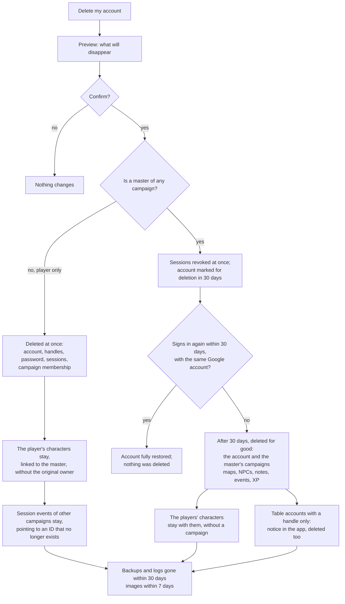

[Português (Brasil)](pt-BR/privacidade.md)

# Privacy and data protection

MeuRPG collects only what the table needs to play, keeps everything in São Paulo, and treats each data subject right as a feature. This document says which personal data exists in the system, why, for how long, and what every PR must respect.

> **This is not legal advice.** It is engineering guidance, written by developers. The full decision is in ADR-0010 (private repository): "privacy by design, LGPD as the base and GDPR as the yardstick". The ADR is still a **proposal** until Samuel accepts it. The privacy notice for people who use the app is a separate document, not written yet (outline at the end of this page).

## In short

- **The law that applies is the LGPD** (Brazilian Law 13.709/2018). The European GDPR does not apply today, because we do not offer the app to the European Union. Even so, on each topic we follow the stricter of the two.
- **We are a small-scale processing agent** (ANPD Resolution CD/ANPD no. 2/2022). Even though we are exempt, we appoint a data protection officer (encarregado) and publish a contact channel. Samuel is the controller, Vinicius is the data protection officer, and the channel is a dedicated e-mail address until the domain exists.
- **Players do not need to give an e-mail or a real name** (RN-17). A player signs in with an anonymous login, using the game master's nickname together with the player's own nickname, with no Google account (see [Business rules](product/rules.md)). Not built yet: today every account signs in with Google.
- **The legal basis is the contract**, not consent. The app needs this data to work. Security and logs rely on legitimate interest.
- **No third-party cookies, analytics, pixels or CDN fonts.** The only cookies are the session cookie and the short-lived login cookie, both strictly necessary, so there is no banner.
- **The MVP is for people aged 18 or older**, by self-declaration (see [Minors](#minors)).
- **Only our own table in the MVP.** The app is not open to other tables and charges nothing in the MVP. Opening it changes the size class of the processing agent and the GDPR analysis, so the decision comes back before that happens.

## Privacy checklist for PRs

Copy this into any PR that touches data, logs, screens or vendors:

- [ ] **Logs:** no headers, query, body, IP, token, e-mail, handle or free text. The log middleware records only method, path, protocol, status and duration.
- [ ] **URLs:** no secret or personal data in a path or query string. Tokens go in the fragment (`#t=`). Platform logs keep the whole URL.
- [ ] **Connect GET:** only a method whose request carries no ID or personal data gets `idempotency_level = NO_SIDE_EFFECTS`. With GET, the whole message goes in the URL. A read that takes an ID is `IDEMPOTENT` and stays on POST.
- [ ] **Responses with personal data** go out with `Cache-Control: no-store`.
- [ ] **New column or table with personal data:** added to the [inventory](#personal-data-inventory) with purpose and retention, and the module implements export and erasure (the catalog test passes).
- [ ] **Only what is needed:** every new field has a reason. An optional field says why it exists.
- [ ] **New free text:** the screen warns "é ficção; não escreva dados reais de pessoas" ("it is fiction; do not write real data about people"). Free text never goes into `session_events`, logs or Jev.
- [ ] **Response for a player:** does not include master notes (RN-11) or a hidden point of interest (RN-10).
- [ ] **`session_events`:** the payload has only IDs, numbers and codes. Never a name, handle or text.
- [ ] **Images:** they enter only through the gallery upload (`POST /uploads/images`), which re-encodes the image with no EXIF, GPS or other metadata and stores it in our storage. No external image URLs. See [What the maps module does](#what-the-maps-module-does).
- [ ] **Browser:** no third-party script, font, pixel or iframe.
- [ ] **No Web Storage:** no `localStorage`, `sessionStorage`, IndexedDB, cookie written by JavaScript, or Worker keeping a token or personal data. The only storage on the device is the `__Host-` session cookie, `HttpOnly`. `web/src/no-web-storage.spec.ts` checks this automatically.
- [ ] **New vendor or data leaving the server:** update the [processors table](#processors-and-where-data-lives) and open the contract and international-transfer question.
- [ ] **Secrets:** only in Secret Manager. Nothing in code, tests or fixtures.
- [ ] **Impact trigger:** did you answer the [impact questions](#impact-questions)? A "yes" calls for a risks section in the PR.

## Personal data inventory

"Until deleted" means: until the person deletes the account or the item. After that, the data still disappears from backups and logs within 30 days. The handle, password, re-entry link and identity-log rows belong to the player login without Google (RN-17), which is not implemented yet.

| Data | Where it lives | Purpose | Legal basis | Retention |
|---|---|---|---|---|
| Google `sub` (game master, or a player who linked Google) | `user_identities.subject`, with `user_identities.issuer` | Recognise the account at sign-in | Contract | Until deleted |
| Google e-mail | `user_identities.email` | Security contact only (incident, data subject request). Never shown to other users. Stored only if the provider says it was verified, and updated or erased at every sign-in | Contract; legitimate interest | Until deleted |
| Google name and photo | — | We do not collect them. The display name is typed in the app | — | — |
| Display name | `users.display_name` | Show the person to the other members of their campaigns. Typed in the app, 1 to 40 characters; never comes from the sign-in provider | Contract | Until the person clears it (empty name in `UpdateProfile`) or deletes the account |
| Inactivity preference (idle time before automatic deletion) | `users` (column to be defined) | Apply RN-16; the person chooses their own period | Contract | Until the person changes the preference or deletes the account. Default of 1 year when the person does not choose |
| Handle | `table_handles` | Identify the player at the table | Contract | Until the person leaves the table or deletes the account |
| Password hash (argon2id), failure counter | `password_credentials` | Authenticate; lock out attempts | Contract; legitimate interest | Until the password is removed or the account is deleted |
| Session token hash, dates, `auth_time` and last use | `auth_sessions` (`token_hash`, `created_at`, `expires_at`, `auth_time`, `last_used_at`) | Keep the sign-in; `last_used_at` ends a session idle for 14 days; `auth_time` is for audit only | Contract | At most 30 days; an expired row disappears through the database TTL within 1 day. `last_used_at` is an hour, written at most every 10 minutes, with no IP or device; it goes with the row |
| OIDC sign-in state (`state` only as a hash, `code_verifier`, `nonce`, `return_to` without fragment) | `oidc_login_states` | Sign in with the OIDC provider | Contract | 10 minutes; erased at the callback, or by the database TTL within 1 hour |
| Sign-in intent: the kind (`campaign_invite`) and the hash of the invite token, never the token | `oidc_login_states` (`intent_kind`, `intent_data`) | Accept the invite right after sign-in, without storing anything in the browser | Contract | At most 10 minutes, with the rest of the sign-in state: erased at the callback, or by the database TTL within 1 hour |
| Invite: token hash, uses, expiry, whether it requires approval (RN-15) and who created it | `campaign_invites` | Join the campaign (RN-07) | Contract | 30 days after it expires, by the database TTL. An invite is valid for at most 30 days, so the row lives at most 60. It goes earlier if the campaign, or the account of whoever created it, is deleted |
| Re-entry link (hash only) | `reentry_links` | Recover access | Contract | 30 days after it is used or expires |
| Identity log (re-entry, linking and merging of accounts) | Database | Security and audit | Legitimate interest | 180 days, UUIDs only |
| IP in the rate limiters (the `/auth/login` one and the one for the whole API) | Memory | Slow down brute force and abuse | Legitimate interest | Minutes (the bucket of an idle IP disappears within 2 minutes) |
| IP, user agent and URL in the Cloud Run logs | Cloud Logging, São Paulo | Operate and protect the platform | Legitimate interest | 30 days |
| `user_id` (account UUID), `campaign_id` and other game IDs, in the API log (no IP, e-mail or name) | Cloud Logging, São Paulo (production); stdout in the local environment | Find the cause of an error and follow a game session | Legitimate interest | 30 days in production (Cloud Logging default); see [API logs](#api-logs) |
| Members and roles (who, in which campaign, with which role, since when, the dice preference `dice_preference` (RN-18: "in the app" or "own dice", a table choice with no significant personal data), whether the member still awaits master approval, and until when, if the character was not created yet) | `campaign_members` | Control access (RN-05, RN-15) | Contract | While the campaign exists; erased when the account is deleted. A pending membership (invite with approval) is erased the moment the master rejects the character. A pending membership with no character is erased on its own 30 days after joining, by the database TTL on `pending_expires_at`, up to 1 day later; the master can also remove it earlier. Creating the character or becoming a member removes the deadline |
| Campaign name, XP mode and dice mode (RN-18) | `campaigns` | Play. The name is free text: the screen warns "é ficção; não escreva dados reais de pessoas" | Contract | While the campaign exists; erased when the master who created it deletes the account |
| Character sheet: game choices and its free text (character name, equipment, languages, traits and the "Outro" background: the name, trait and equipment the player writes) | `characters` (`name`, `sheet`) | Play. No real name or e-mail of the player (PRIV-21) | Contract | While the character exists: there is no character deletion in the normal flow (RN-03). The exception is a character pending approval (RN-15, MR-024): if the master rejects it, it is erased at once, with its story and master notes, because it never became part of the campaign. When the player deletes the account, the character stays with the campaign, with no link to the account (RN-16); when the campaign is erased, it stays with the player. With no player and no campaign, the database TTL erases the row within 1 day. An NPC disappears with the master's account |
| Character story (personality, appearance, history, allies) | `characters.story` | Play | Contract | Same as the sheet. After the sheet is locked, the player corrects it when the master unlocks it (RN-01) |
| Master notes | `character_master_notes` | Prepare the game; never reach the player (RN-11) | Contract | While the campaign and the character exist; empty notes erase the row |
| Campaign document: the master's free text (preparation, secrets, links to maps, sheets and gallery images), when it was saved and who saved it last | `campaign_documents` (`body`, `updated_at`, `updated_by`) | Prepare the game (MR-018). Only the master reads and writes. It is free text and may hold personal data, so the screen warns "é ficção; não escreva dados reais de pessoas" | Contract | While the campaign exists: erasing the campaign, or deleting the account of the master who created it, erases the document. Deleting the account of whoever saved it last only removes the link (`updated_by` becomes empty); the text stays with the campaign |
| Game sessions: when they started and ended, the current map and the image shown to the players, and whether the master leaves it with them | `game_sessions` (`current_map_id`, `shown_image_id`, `shown_image_keep`) | Lock the sheets (RN-01) and the live table: what the session shows everyone (MR-012, MR-028) | Contract | While the campaign exists. Only IDs and times: nothing about a person. Erasing the map or the image clears the column (`SET NULL`) |
| Images the master left with the players: only the gallery image ID, the campaign and when it was left | `campaign_left_images` | Let the players keep seeing a portrait, a letter or a floor plan after the master stops showing it (MR-028) | Contract | Until the master removes the image from the list ("Tirar"), erases it from the gallery or erases the campaign: the row goes at once, and the image is no longer served to the player. The list outlives the session on purpose: it is what the master asked for by "leaving" it. Only IDs and a time: nothing about a person; the image name (free text from the master, see the shown image) goes to the player as a caption |
| The stage: which NPCs the master put "on stage" in a session, in what order and who is speaking | `stage_npcs` (IDs, `position`, `speaking`) and the `stage_changed` `session_events` (IDs only) | Show the players who is "there" in an RP scene (MR-031) | Contract | While the session exists; closing or changing the scene erases the rows at once. Nothing about a person: fiction and IDs. The player receives only the NPC's name and portrait, never the character ID or the sheet (RN-20) |
| Gallery images (maps, portraits, illustrations), already stripped of metadata, with the name (from the file name, editable) and who uploaded them | The files in the blob store: a Docker volume in the local environment, a private Cloud Storage bucket in São Paulo in production. The description in `gallery_images` | Play: maps and the campaign document (MR-019) | Contract | Until the master erases the image: the row and the files go at once (in Cloud Storage the file stays 7 more days in soft delete). When the campaign is erased, the rows go with it; the files go only once campaign deletion starts erasing them (see [To be defined](#to-be-defined)) |
| Maps: the name, the gallery image, the battle grid (how many columns), whether it is revealed and when | `maps` | Play (MR-008, MR-009) | Contract | Until the master erases the map; it goes with the campaign. The name is the master's free text, which players read once revealed |
| Points of interest: type, name, description for the players (up to 2,000 characters), position, the submap, whether it is revealed | `map_points` | Play (MR-008, MR-009) | Contract | Until the master erases the point; it goes with the map. Name and description are the master's free text: fiction, which the player reads only once revealed, or in an RP scene the master opened (a hidden point stays hidden on the map); they never go to the log. **Trap, treasure and light (MR-035, MR-041, MR-036):** the name and description of a trap or treasure are the same free text from the master, fiction, which the player reads only when the trap was revealed to them or the treasure was found; the rest is numbers, SRD content keys and IDs (`trap` with the DCs and the effect, only the master reads it; the value in gp; the session where it was found; the light radii); the only free-text duration is a condition's ("1 hora", up to 60 characters, one line), also the master's. None of this goes to the log or `session_events` |
| The painted layers of a map (MR-034, MR-036): four square bitmaps (difficult terrain, wall, cover, light) | `map_layers` | The battle map and fog of war (MR-034, MR-036) | Contract | Until the master erases the map, or changes the grid or the image (which erases them); they go with the map. Only squares, no text or personal data. A player reads wall, terrain and cover of a map without fog, never the light |
| What each player saw of a map with fog of war (MR-036): one bitmap of squares per player and map, the epoch it was made in and when it changed | `map_vision_memory` | Show the player, darkened, what their character has already seen, without creatures | Contract | Written only while players see the map. Until the master clears it ("Esquecer o que foi visto"), changes the map's grid or image (the epoch rises and anything from an old epoch reads as empty), erases the map, or erases the player's account or the campaign (`CASCADE`). **Today a player cannot leave the campaign or be removed after being accepted** (only a pending member is removed), so no other path erases the memory; when one exists, the memory must go with it, like the notes. Only squares, no text: it is the trail of where each character walked. The server reads the bitmap; the player receives only the state of each square ("remembered" is one of them) and the master, in "Ver como", receives exactly the same, never the raw bitmap |
| Who knows a trap and who found a treasure (MR-035, MR-041, RN-10) | `map_point_reveals`, `map_treasure_finders` | Hide from the player what their character has not discovered; the session summary | Contract | Until the master erases the trap or treasure; they go with the point and with the character. Only point and character IDs, one word (`noticed`, `searched`, `master`) and a time. The `trap_revealed`, `treasure_found` and `treasure_unfound` events carry IDs and the value in gp, never a name or text |
| The notice of a noticed trap (MR-035, RN-10): the `trap_noticed` history row (point and character IDs) and the `trap_noticed` stream hint (map and point IDs) | `session_events`, stream | Tell the player their character noticed the trap | Contract | Goes with the session. Only the player who noticed receives it, in the hint and in `ListTrapActivity`; the master reads the row, never the hint. No DC and no other player's name |
| The damage a triggered trap did to a character outside combat, until the master applies or discards it (MR-035, RN-02) | `trap_damages` | Let the master decide the damage on a player character (RN-02) | Contract | Goes with the session or the character. Only IDs, the dice rolled, the damage type and numbers; the `trap_noticed`, `trap_searched` (the skill, the roll and the IDs found), `trap_triggered` and `trap_disarmed` events carry IDs and numbers, never a name or text |
| The actions of an RP scene (MR-015): the check key, the name the master gave (up to 60 characters, optional), the DC (optional), the attempts per player (`max_attempts`), the point's "Mostrar a CD aos jogadores" switch (`map_points.show_dc`) and the order; the scene open in the session (`game_sessions.open_scene_point_id`) | `scene_actions`, `game_sessions` | Play RP scenes (MR-015, RN-18, RN-20) | Contract | Until the master erases the action; they go with the point (`CASCADE`), which goes with the map. The name is the master's free text: fiction, never goes to the log or `session_events`. The master always receives the DC, and the player only when the scene shows it. The scene rolls (`scene_check_rolled`) and attempts granted (`scene_attempt_granted`) keep only IDs and numbers, and whether the scene showed the DC at the time; the session summary adds them up, storing nothing new |
| The "Ganchos e anotações" of an RP scene (MR-029): a text from the master, Markdown, up to 4,000 characters, and the clues the master prepares (1 to 500 characters, up to 30 per scene), with their order | `map_points.hooks`, `scene_clues` | Run the scene (MR-029). **Only the master reads it**: no player, no response or stream event carries the hooks or a clue not revealed to them (RN-20, `TestRN20_PlayersNeverGetHooksOrUnrevealedClues`). It is free text and may hold personal data, so the screen shows the warning "é ficção; não escreva dados reais de pessoas" (`fiction-notice`) | Contract | Until the master erases or edits them; they go with the point (`CASCADE`), which goes with the map and the campaign; the hooks, actions and clues go when the point stops being a scene point. Never enter a log or `session_events` |
| The clues the master revealed to each player (MR-029): the campaign, the clue, the scene, the player, the chosen character, **a copy of the text** and when | `scene_clue_reveals` | Let the player read the clue in the notes (MR-030): what was said to the table stays said, even if the master edits or erases the clue | Contract | Only the player who received it and the master (who sees to whom it was revealed) read them. Erased when the player's account or the campaign is deleted (`CASCADE`); when the clue or scene is erased, the copy stays and loses only the link (`SET NULL`). The `clue_revealed` event carries IDs only, never the text |
| The scenes the group discovered (MR-030): the campaign, the point and when | `scene_discoveries` | Let the player tag a note only with a scene they have already seen; the name of any other scene never reaches them | Contract | Goes with the point or the campaign. Only IDs and a time |
| The player's private notes (MR-030): the campaign, the author, the free text (1 to 2,000 characters, up to 300 per campaign) and the optional scene tag | `player_notes` | Let the player note what happens without leaving the app. **Only the author reads them**: neither the master nor another player (`TestMR030_PlayerNotesArePrivate`). It is free text and may hold personal data of the author or of third parties, so the screen shows the warning "é ficção; não escreva dados reais de pessoas" | Contract | Until the player erases the note; erased when the account is deleted (`CASCADE`, `TestMR030_DeletingTheAccountDeletesTheNotes`) and with the campaign. Today there is no way to leave the campaign as an active member; when there is, the notes go with the member. Never enter a log, an event or `session_events` |
| Puzzles (MR-038, RN-27): the name, the clue and the hints (the master's free text, of 80, 500 and 300 characters, up to 10 hints), the configuration, the solution and the starting state, the "Ao resolver" and "Ao errar" with the IDs of their targets, the skill and DC of the hint, and the split information (up to 8 parts of 300 characters and the character for each); and, per session, the live state, which character played last and solved it, each move with the user (account ID: personal data), the character and the anti-repeat key, **what the player typed** (the riddle answer and the decoded cipher message, up to 600 characters, in the move's `move` and in the last move of the round) and each attempt to earn a hint by a check (user, character, d20, bonus and total) | `puzzles`, `puzzle_runs`, `puzzle_moves`, `puzzle_hint_tries` | Create, show and solve puzzles live. **The player never reads the solution (the riddle answers, the sequence before tapping, the plain message and key of the cipher, the lock's solution), the minimum number of moves, the hints not released or earned, the hint DC, the part of the clue that belongs to another player, what another player typed, or the action and target of "Ao resolver" and "Ao errar"** (RN-10, RN-27, `TestRN10_PlayersNeverReceiveTheAnswer` and `TestRN10_PlayersNeverReceiveWhatTheNewKindsHide`, by key list): the player reads the state, the clue, the released hints and those they earned, their own part of the clue and the name of whoever holds the others, the name of the character who played last, their own counters (attempts, moves, time), the board and the pillar links, the sequence steps only while the master plays them, the name of a trap's point after it fires and, once solved, the "Ao resolver" text. **The typed text is the player's own data**: the master reads it in the live view ("Toren tentou ..."), and no other player does. The master's free text is fiction | Contract | Until the master erases the campaign (`CASCADE`); a puzzle is archived, not erased. Moves, with what was typed, and hint attempts stay while the session exists (they go with it, `CASCADE`); the last move of each round, with its text, is overwritten by the next move. Deleting the account removes its ID from moves and attempts (`SET NULL`), but the typed text stays anonymous until the session goes. The session history (`puzzle_shown`, `puzzle_solved`, `puzzle_reset`, `puzzle_closed`, and the `trap_triggered` that a wrong move fires) carries only IDs and what the "Ao resolver" did: never the text, the state, the solution or the moves. Nothing goes to a log |
| The encounter the master saves on a battle point (MR-043): the SRD creatures (keys) with quantities, the base name given to each monster group (up to 30 characters, the master's free text), how HP is chosen and whether the monsters start hidden | `battle_encounters` | Prepare the combat and "Começar este combate". **Only the master reads and writes it** (RN-10): the player never receives the encounter, the creatures, the XP or the difficulty (`TestRN10_PlayersNeverGetTheBuilderOrTheSavedEncounter`); the RPCs answer `not_found` to anyone who is not the master and no map or point read touches it. It is fiction: the base name is free text, but with no data about a person (the screen warns) | Contract | Until the master erases or replaces the encounter; it goes with the point, the map or the campaign (`CASCADE`). The XP and difficulty are not stored. Nothing goes to a log |
| Tokens: the character (ID), the position, whether hidden, the light carried (the key of an SRD preset, `light:torch`) | `map_tokens` | Play (MR-012, MR-036) | Contract | Until the master removes the token; it goes with the map or the character. Only IDs, numbers, a content key and a yes/no. The light carried goes only to the master and the character's owner |
| HP, spell slots, hit dice and resource uses of the player character (numbers: current and temporary HP, slots used per level, pact slots used, hit dice used, the uses spent of each resource by key, when the master corrected) | `character_vitals` | Play (RN-02): what changes during the session and lasts until the next | Contract | While the character exists (the row goes with it, `CASCADE`). Only numbers and content keys: nothing about the person |
| The record of each guided level-up (MR-040): the campaign, the character, the class, the level before and after, how HP was decided and how much it was worth, what the player chose (ability score increase, subclass, cantrips, spells, prepared, options, skills, content keys only) and when; and the hit die the server rolled and kept until the level-up uses it (the result) | `character_level_ups`, `character_level_up_rolls` | Show the master "O que mudou" and keep the die result "no registro" (RN-18, RN-12) | Contract | While the character exists: the row goes with it and with the campaign (`CASCADE`); the stored die goes when used. Only numbers and content keys, no free text. The master reads the character's name and the player's display name in the list, which they already see; the player does not read the record |
| A campaign's table rules (MR-025, RN-24): the campaign, the HP of level-up, the ways to make ability scores, the critical hit, the visibility of death saving throws, combat with or without a map, the fog of new maps, up to 20 house rules (the master's text, up to 200 characters each) and when it changed | `campaign_table_rules` | Follow the table's choice in each sheet, level-up and map, and show the rules to the table on the "Regras da mesa" page | Contract | Until the campaign is deleted (`CASCADE`). No person ID. The house rules are the master's free text (fiction, like the campaign document): the screen warns not to write real data about people; every active member reads them |
| The 4d6 the server rolled, or the player typed with physical dice, for their next sheet (MR-025, RN-24): the campaign, the player's account, the six sets of four dice, who rolled (app or typed) and when | `character_ability_rolls` | Rolled ability scores cannot be re-rolled until the player likes the result (the server returns the same sets) | Contract | Until the sheet that uses them is created (the row is erased in the same transaction); a row nobody used goes with the campaign or the account (`CASCADE`). Only numbers and IDs; only the player reads them |
| Session combats (MR-013): the combat name (the master's free text), who fights (the character and, for player combatants, the player's account), the rolled initiative (the d20, bonus and total), each one's position on the grid, movement and turn economy, the HP of NPC copies, whether hidden, attacks made and the Shield AC bonus on the turn, and the RN-22 and RN-03 marks (conditions, concentration, death saving throws) | `encounters`, `combatants` | Play combat: turn order, the turn, movement on the grid (RN-19, RN-20, RN-21) | Contract | While the campaign exists: it goes with the session (`CASCADE`), which goes with the campaign; an erased character takes its combatant along. Deleting the player's account removes the link (`user_id` becomes empty, the character stays with the master, RN-16). The combat name and the labels ("Goblin 2") are the master's fiction and never go to the log. Position and rolls are stored per session and say nothing about the person |
| Session events: who made the change (account ID), the character (ID), which combat it belongs to (ID), the numbers before and after, the idempotency key and the time (and, in "Pôr no combate", a short hash of the base name, to check a repeat, never the name; for a monster, what it spent of its stat block, as keys and numbers, in `combatants.monster_state` and in the event, the master's alone) | `session_events` | Session history (ADR-0007): audit, undo and the combat log; today the master's correction (RN-02) and combat changes (initiative, order, turns, movement, who leaves or enters, the rolls: the d20 and damage dice, the result, the damage and type, an NPC's HP before and after, the turn economy, spells (the key, level, d20 and each target's save), reactions, death saving throws, conditions, concentration and undo; XP awards and milestones, with the IDs, mode, total and each one's share, without the reason; and RP scenes: the point opened or closed and, for each roll, the action (the check's ID and key, such as `skill:investigation`), the character (ID), the d20, the bonus, the total and whether it beat the DC, without the DC, without an action name and without the master's text) | Contract | While the campaign exists: it goes with the session, which goes with the campaign. Deleting the account removes its ID from the events (`SET NULL`). Never free text or a name. In a combat on a fog-of-war map (MR-036), the payload of an action event with an NPC also carries the IDs of the accounts of the players who saw it at the time (`seen_by`): only IDs, the same ones `actor_user_id` already stores, and they go with the session. **Today they do not go with the account:** `actor_user_id` becomes `NULL` when the account is deleted, but the IDs inside the payload (`seen_by`, `cover_seen_by`) stay; the RN-16 account-deletion flow (not built yet) must erase them from the event payload |
| The damage of an attack or spell that hit, and healing (MR-012, MR-014): the attack (the weapon or spell key), the dice, the faces the app rolled or the typed sum, the total, the amount the master applied, the type and the state, between two combatants | `pending_damages` | Hold the damage until the master applies or discards it, and find it again after a resubmission or reload (RN-02) | Contract | While the combat exists: it goes with it, with the session and with the campaign. Only IDs, numbers and content keys: nothing about the person |
| The opportunity attack a movement offered (MR-034, RN-21): who moved and the reactor (two combatants), the square they left reach from, the state and the times | `opportunity_offers` | Wait for the answer of whoever controls the reactor, and send the mover back to the square if the attack takes them to 0 HP | Contract | While the combat exists: it goes with it, with the session and with the campaign. Only IDs, squares and a state: nothing about the person |
| Live session stream subscriptions: account ID, whether it is the master, the campaign | Server memory | Deliver each change only to whoever may see it (ADR-0005) | Contract | While the stream is open (at most 30 minutes); never in the database or the log |
| XP history (MR-016, RN-09): who gave it (account ID), when, the mode, the reason (the master's free text, up to 120 characters), the combat, the gp, the total, who undid it and when, the idempotency key, each character's share (ID, XP, a milestone's level) and, in a "Voltar à cidade", the treasures converted (point ID and gp, no text) | `xp_awards`, `xp_award_shares`, `xp_award_treasures` | Give XP, show the history to the whole campaign (everyone sees it, master and players) and undo the last award | Contract | While the campaign exists: it goes with it (`CASCADE`); a character's share goes with the character. Deleting the account of whoever gave or undid only removes the link (`SET NULL`). Nothing is erased on undo (ADR-0007). The planned milestones (`planned_milestones`) keep the free text the master writes beforehand (1 to 120 characters, fiction, with the same warning on screen): only the master reads it until the milestone is reached, and the text becomes the award's reason (read by the whole campaign); it goes with the campaign (`CASCADE`), and never goes to `session_events` or the log. The reason is fiction: the screen warns "é ficção; não escreva dados reais de pessoas", and it never goes to `session_events`, the log or Jev. The display name of whoever gave the award appears in the history, only to the campaign's members |
| The XP an NPC gives (challenge rating and `xp_value` on the sheet; `combatants.xp_value`) | `characters` (`sheet`), `combatants` | Add up the XP of the defeated at the end of combat (MR-016) | Contract | Like the sheet and the combat. Only numbers: nothing about a person. Only the master receives them (RN-20) |
| Combatants | `combatants` | Combat (MR-013) | Contract | While the campaign exists |
| The character's creatures (MR-037): the name the player gave each one (**free text**, 1 to 40 characters: "Nanquim"), the SRD creature type, where it came from, what it can attack, the summoning group, the HP, and when and why it was dismissed | `character_creatures` (`name`, `monster_key`, `source`, `attack`, `hp_*`, `dismissed_*`) and, in combat, the combatant's `label` | Play with the character's familiar, animals and undead | Contract | While the character or campaign exists; they go with them (cascade). A dismissed creature stays stored (for the master's "Desfazer") until then. The name is fiction: the screen warns "não escreva dados reais de pessoas". Only the master and the owning player read the list and the HP; the name never goes to the log or the `session_events` payload (only IDs and creature keys) |
| Table content (MR-025, RN-23): the classes, subclasses, races, subraces, backgrounds and spells the master registers for the campaign: the name in Portuguese (1 to 80 characters), the texts and rule numbers (**the master's free text**: descriptions, features, equipment, a reaction's trigger), the key, the revision and the archive date; and, in each sheet, the content revision it was saved with | `campaign_content` (`content_key`, `name_pt`, `data`, `revision`, `archived_at`), `campaign_content_state` and `FullSheet.content_revision` (in the sheet JSON) | Play with the table's material (the sheet calculates with it) | Contract | While the campaign exists; it goes with it (cascade). Nothing is erased earlier: the master archives. It is fiction and game rule: the editor screen warns "não escreva dados reais de pessoas", as with the other free texts. Members read the campaign's playable entries in full; the master also reads the archived ones, which no player receives. No name or text goes to the log: only IDs and keys, and the entry count |
| Wild Shape and the familiar's eyes (MR-037, MR-036): the beast the druid is in and its HP, the familiar the player is seeing, whether it started in a combat and which conditions it gave; and each creature's token on the exploration map (a map ID, a creature ID and a position) | `character_wild_shapes`, `character_vitals` (`familiar_sight_*`), `map_creature_tokens` | Play the beast form and the familiar's sight, and show the creature to the group | Contract | While the character, creature or map exists; they go with them (cascade). Only IDs, keys and numbers, nothing about a person: the creature's name never goes to the event. The beast's HP is only for the master and the owning player (RN-20) |
| Database backups | Cockroach Labs | Disaster recovery | Legitimate interest | 30 days |
| Session cookie `__Host-meurpg_session` | User's device | Keep the sign-in | Strictly necessary | Until sign-out, which erases the session on the server, or 14 days without use, or 30 days. "Sair dos outros dispositivos" (profile) erases the other sessions at once |
| Login cookie `__Host-meurpg_login` (the `state`) | User's device | Bind the sign-in to the browser that started it (against login CSRF) | Strictly necessary | 10 minutes; erased at the callback |

**The new app (`web/`) stores nothing in the browser besides these two cookies**, both `HttpOnly` and never read by the page's JavaScript. No `localStorage`, `sessionStorage`, IndexedDB, cookie written by JavaScript, or Worker keeping a token or personal data, with no exceptions, and an automatic guard (`web/src/no-web-storage.spec.ts`) that scans the source for these APIs. See [Architecture](architecture.md#nothing-in-the-browser-besides-the-session-cookie).

**In the legacy app (discontinued)**, `users.name` was stored, and there were two columns with no purpose: `characters.email` and `sheet.playerName`. There is no data migration: all three simply do not exist in the new schema (see [Data model](data.md)). In the legacy app, maps were kept as base64 in the database, and the gallery and campaigns were kept in `localStorage`.

**Bug in the legacy app (discontinued):** sign-out and "Excluir conta" called routes that did not exist in NestJS (`POST /api/auth/logout` and `DELETE /api/auth/account`). Sign-out only cleared the browser, and the token stayed valid on the server until it expired. Deletion failed, so the right to erasure (art. 18, VI) did not work there. It is not fixed in the legacy app; the new system implements both from the first deploy with sign-in and proves them with an automated test.

### API logs

API logs keep the `user_id` (an account UUID, a pseudonym) and game IDs, and nothing that identifies the person by itself. Each line has `request_id`, `user_id` and `campaign_id` when they exist, and the `rpc`, stream and event lines say what was done, with only IDs and enums (see [Architecture](architecture.md#logs)).

| Log data | Why | Retention |
| --- | --- | --- |
| `user_id` (account UUID) | Follow a game session and find the cause of an error. It is pseudonymous personal data: it becomes a person only with the database, and it leaves the database with the account | The log's: in production, the Cloud Logging default (30 days in the `_Default` bucket); in the rehearsal ELK, the one in [Operations](operations.md) |
| `campaign_id`, `session_id`, `character_id` and other IDs | The same | The log's |
| `request_id` | Join the lines of one request; returns to the browser in the `X-Request-Id` header | The log's |
| Request path and result code | Operate the service | The log's |

What is **not** in the API logs: the IP, the user agent, cookies and headers, the URL query, e-mail, any name (display, character, NPC, campaign), any typed text (documents, notes, clues, prompts, content entries) and request or response bodies. A guard in the handler drops attributes with names such as `email`, `token`, `name` or `text` (the list is in [Architecture](architecture.md#what-never-goes-in-the-log)). The IP and user agent appear only in the request log that Cloud Run itself writes, the Cloud Run row of the table above.

When an account is deleted, the logs are not rewritten: their `user_id` stops pointing to anyone once the account leaves the database, and the line expires with the retention. A log is never a source for answering a data subject request.

### What the identity module does

The game master's sign-in (`backend/internal/identity`) meets the items of this page as follows:

- **Scope `openid email`.** Name and photo are never requested or stored, even when the provider sends them.
- **Logs without personal data.** A failed sign-in logs only a reason (`state_mismatch`, `invalid_id_token`...). Token, `code`, `state`, cookie, e-mail, `sub`, account ID and IP never go to the log. A test checks this.
- **`GetMe` returns only the account ID** and the time the session ends. The request is empty, so Connect GET puts no personal data in the URL.
- **No-cache responses.** `GetMe`, `SignOut`, `SignOutOtherSessions`, `CountOtherSessions` and the `/auth/*` routes go out with `Cache-Control: no-store`; the `/auth/*` routes also with `Referrer-Policy: no-referrer`.
- **Deleting the account** erases identities and sessions with it, by `ON DELETE CASCADE`.
- **The API rate limits.** The per-IP limit for the whole API (`platform/ratelimit`, [Architecture](architecture.md#abuse-limits)) keeps the client IP only in the instance's memory, like the login one, and never in the database or the log; refusals become a `WARN` line with the name of the limit and, for per-user limits, the `user_id` that is already on every line, never the IP. The `CAMPAIGN_CREATORS` list (e-mails of who may create campaigns) is server configuration and does not go to the log; each account's verified e-mail stays only in the identities table (RN-30).
- **Attempt limit on `/auth/login`.** To count attempts, the server keeps the client IP (the `/64` prefix, for IPv6) only in the instance's memory, never in the database or the log. It is the "IP in the rate limiters" row of the inventory: it disappears within 2 minutes after the last attempt, or when the instance stops.
- **devidp test users** (the development OIDC provider, see [CONTRIBUTING.md](../CONTRIBUTING.md#local-sign-in-with-the-devidp)) are fictional, with e-mails at `example.com`. It does not exist in production, so no real data passes through it.

### What the campaigns module does

The `campaigns` module (`backend/internal/campaigns`) and the `identity` display name meet the items of this page as follows:

- **Typed display name.** `users.display_name` starts empty and changes only through `UpdateProfile`. The name the sign-in provider sends is never stored (a test checks it with a fake provider that sends a name). An empty name erases it, which serves correction and erasure (art. 18, III and VI).
- **`GetMe` does not return the e-mail.** The verified e-mail stays only as a security contact, in `user_identities`, and leaves in no response.
- **The invite exists only as a hash in the database.** The token goes in the URL fragment (`/invite#t=...`), and the app sends it in the body of `AcceptInvite`, never in a query string. A test checks that the invite row does not contain the token.
- **Invite accepted through sign-in, with nothing in the browser.** Whoever opens the invite while signed out sends the token in the body of `POST /auth/login`. The server stores only the hash, inside the sign-in state (at most 10 minutes, single use), and the app uses no `localStorage`, `sessionStorage` or service worker for this. `GET /auth/login` refuses the token in the URL, and `return_to` loses its fragment. `TestSignInWithAnInviteJoinsTheCampaign` reads the `oidc_login_states` row and checks that no column holds the token; the log tests check that neither the token nor the hash goes to the log.
- **No GET with data in the URL.** Only `ListMyCampaigns`, whose request is empty, accepts GET. The other calls carry the campaign ID and stay on POST.
- **No-cache responses.** Every `CampaignService` response, errors included, goes out with `Cache-Control: no-store`.
- **A non-member cannot discover the campaign.** The response is `not_found`, the same as for a campaign that does not exist (ADR-0011).
- **Logs without personal data.** The module logs only database failures, with the driver's error message, which does not carry the row's values. Name, token and IDs are never passed to the log.
- **Deleting the account** erases the membership in campaigns; for a master, it also erases the campaigns they created, with members and invites (`ON DELETE CASCADE`). `TestDeletingAnAccount` checks it.
- **The campaign document leaves only to the master** (MR-018). A player receives `permission_denied`; a non-member and a pending member get `not_found` (`TestMR018_PlayersCannotReadTheDocument`). It is free text, like the master notes: it may hold someone's personal data, so the document screen warns "é ficção; não escreva dados reais de pessoas". The text never goes to the log, and a validation error names the field, never the text. It goes with the campaign; deleting the account of whoever saved it last keeps the text and erases the link to the account (`TestCampaignDocumentGoesWithTheCampaign`). The links in the text carry only IDs: the app opens each one through the usual calls, with each one's authorization, and an image comes only from the gallery (`image:<id>`), never from an external URL.
- **A pending member sees only the campaign name** (RN-15, MR-024). Whoever accepted an invite with approval does not see the members, invites or other people's characters: only the campaign name and their own character, until the master approves. When rejected, the pending membership is erased at once (`TestMR024_MasterRejectsAndThePlayerStaysOut`).

### What the characters module does

The `characters` module (`backend/internal/characters`) and the start of `play` meet the items of this page as follows:

- **No real player data on the sheet.** There is no player name or e-mail field (PRIV-21); the name shown next to the character is the `identity` display name. All the free text (character name, equipment, story) is fiction, and the screen warns "é ficção; não escreva dados reais de pessoas".
- **Master notes never reach the player.** They live in a separate table and leave only through the master's calls. `TestRN11_PlayersNeverReceiveMasterNotes` checks every response a player can request.
- **A player sees only their own characters.** Another player's character and NPCs are `not_found` to them, with the same message as a character that does not exist. A pending member (RN-15) sees only their own pending character.
- **A rejected character disappears at once.** When the master rejects a pending character (MR-024), `RejectCharacter` erases, in the same transaction, the character (sheet, story and master notes about it) and the player's pending membership: the character never became part of the campaign, so there is no purpose in keeping it. `TestMR024_MasterRejectsAndThePlayerStaysOut` checks that no row is left.
- **No GET with data in the URL, and no cache.** Every read carries an ID, so it stays on POST (`IDEMPOTENT`), and every response, errors included, goes out with `Cache-Control: no-store`.
- **Logs and errors without free text.** The module logs only database failures. A validation error names the field, never what was typed (`TestUpdateCharacterValidation`), and a stored sheet that fails to open produces an error without its content.
- **Correcting the story.** The player edits the story while the character is a draft; after the lock, when the master unlocks it (RN-01). A correction request outside that goes through the data protection officer's channel.
- **Deleting the account.** The foreign keys already do the characters' part: `player_user_id` uses `ON DELETE SET NULL` and an NPC goes with the master's account (`CASCADE`); `TestRN16_DeletingAccountsKeepsPlayerCharacters` checks it. A player character left with no player and no campaign is erased by the database TTL (`TestOrphanedPlayerCharactersAreDeletedByTheDatabase`).
- **Not built yet:** the export (`ExportMyData`) and the deletion preview with the choice to erase one's own characters. They come with the `PrivacyService`.

### What the live session does

The live session of `play` (see [Architecture](architecture.md#live-session)) meets the items of this page as follows:

- **The notice does not open a connection.** `ListOpenGameSessions` has an empty request, so it accepts GET without putting data in the URL; the response carries the names of the person's own campaigns and goes out with `Cache-Control: no-store`.
- **A player sees only their own character's numbers.** The filter runs on the server, in the snapshot (`GetLiveSession`) and in the stream: each event carries its audience, and the hub delivers it only to that audience (`TestPlayersSeeOnlyTheirOwnVitals`). Master notes never leave through the live session (`TestRN11_LiveSessionNeverCarriesMasterNotes`).
- **RP scene rolls stay in `session_events`, with numbers only** (MR-015): `scene_check_rolled` stores the point and action IDs, the check key, the d20, the bonus, the total and, when the action had a DC, `passed`; the name the master gave the action ("Convencer o guarda") and the DC belong to the master and do not enter the history. The player receives only their own rolls, with no `passed` or DC (RN-20). The action name and the point description are the master's free text, fiction like the rest of the map (`scene_actions.name`, up to 60 characters, no personal data; the "é ficção" warning already applies to the field).
- **Revealing a clue is an event with IDs only** (MR-029): `clue_revealed` stores the clue ID, the scene ID and the IDs of the characters who just received it, never the clue's text or a name. The `notes_changed` notice goes only to the players who received it and carries nothing; the app reads the notes again (`TestMR029_ARevealedClueReachesOnlyTheChosenPlayers`).
- **`session_events` has only IDs and numbers.** The payload stores HP, slots and hit dice before and after, and, in combat, combat IDs and numbers (the round, the d20, the faces and damage, the square, the feet walked) and content keys (the weapon, the action, the damage type), with no name or text: the name of a weapon or combatant is read by the combat log from the sheet when it answers, and who it shows to whom is decided on the server (RN-20); the RN-11 test checks that no event carries character text.
- **The stream stores nothing.** Subscriptions stay in server memory only while the stream is open, and the log records one line per stream, when it ends, with the path and duration, like any request (and, at `debug`, `stream opened` and `stream closed`, with the campaign, the messages sent and the reason it ended; see [API logs](#api-logs)).
- **Whoever leaves stops receiving.** Every 60 seconds the stream checks the sign-in session and the membership again; sign-out, a revoked session or leaving the campaign end the stream (`TestWatchGameSessionChecksAgain`).

### What the maps module does

The gallery (`backend/internal/maps`, MR-019) meets the items of this page as follows:

- **No metadata is stored.** The server decodes each uploaded image and encodes it again from the pixels, so EXIF (with the GPS position, the phone model and the date), XMP, ICC profiles, the text chunks of a PNG and anything hidden after the image are left behind. The original file is never written. The tests build a JPEG with EXIF and GPS, a PNG with `tEXt` and `eXIf` and a WebP with an EXIF chunk, and check that the stored file has none of it (`TestProcessRemoves*`, in `maps/images`, and `TestMR019_MasterUploadsAnImageWithoutItsMetadata`).
- **Where they live.** In the local environment, in a Docker volume; in production, in a private Cloud Storage bucket in São Paulo, with no public URL: only the API reads the bucket, and delivers the image to whoever may see it.
- **Who sees them.** The gallery (the list) is the master's alone, and the master downloads every image of the campaign. A player downloads an image only while seeing it: the background of a map they see, or the image the master shows in the session, or an image the master left with the players (RN-10, MR-028), or an NPC's portrait while the NPC is on the stage of the open scene (MR-031). An NPC's portrait is a gallery image like the others (the ID sits in the NPC's sheet JSON, which the player never reads) and disappears for the player, with `404`, the moment the master takes the NPC off stage, closes the scene or ends the session. Erasing the image clears the portrait from the sheet. Keeping the ID is not enough: the route checks on every request, and answers `404` after the map is hidden again, the image stops being shown without having been left, or the master removes it from the list. A non-active member gets `404`, the same as for an image that does not exist.
- **The image pieces of a fog-of-war map are personal (MR-036, RN-10).** The player never receives the whole image of a fog map: they receive pieces of 16 × 16 squares, each with the pixels of the squares they saw or remember and opaque black elsewhere (never low alpha; the PNG is written from pixels only, with no metadata). The guarantee is the `TestRN10_TileOracle` test: two images that differ only in squares the player does not know give them byte-identical pieces. For that, the server shrinks the image square by square and darkens, on the known side, 1 pixel of each border with an unknown square (PNG) or every 16 × 16 pixel block that touches an unknown square (JPEG): on a JPEG map the edge of the fog is darker, by up to one block. A piece goes out with `Cache-Control: private, no-cache`, `ETag` and `Vary: Cookie`, like a player's image: the browser asks on every use and receives `404` when the player loses the map; no proxy stores it. On the server, pieces live only in memory (the working copy of the image, the piece cache and the pieces each player has, with no disk or database), keyed by the image, the grid, the piece and the known squares around it, never by user: they are not personal data, and two players with the same view of a piece share the same piece. No new data enters the inventory. Tests: `TestRN10_TileOracle`, `TestRN10_TilesCarryOnlyWhatThePlayerSaw`, `TestRN10_TileAuthorization`.
- **Cache only on the device.** The image goes out with `Cache-Control: private`: no proxy stores it. The master's browser keeps a copy for one year (the bytes of an ID never change); the player's browser keeps it but asks again on every use (`no-cache`), so it stops showing the image as soon as it is no longer visible to them. `Vary: Cookie` stops a copy from answering for another person in a browser used by two people. What was already drawn on the screen, saved or photographed remains out of our reach.
- **Erasing** removes the row and the files at once. In Cloud Storage, soft delete keeps the file for 7 more days, within this page's 30-day limit.
- **Logs without personal data.** The file name and the image name never go to the log, and the module's logs carry no IDs: storage errors go out without the file path. The image ID appears in the `/images/<id>` path of the request log (and in the platform logs), like any URL: it is a random UUID that says nothing about anyone and gives no access to the image, because the session and the campaign membership are checked on every request.
- **An image can be a photo of a person.** So, next to every "Enviar imagem" (the gallery, the empty gallery and the image picker), the screen warns, as with free text: "Use imagens do jogo. Não envie fotos de pessoas sem a autorização delas." (`ImagePrivacyNote`, in `web/src/app/shared/gallery-picker/`).
- **Not built yet:** erasing the files when a campaign is erased (today it only happens through deletion of the master's account, and only the rows go). Deleting the campaign or the account must erase the storage prefix `campaigns/<id>/`; it comes with the `PrivacyService`.

The maps (MR-008, MR-009, MR-012) and what the session shows (the current map and the shown image, MR-028) meet them as follows:

- **Free text only from the master, and fiction.** The map name and each point's name and description are written by the master for the players to read. They never go to the log, and error messages state the rule, never the text. The screen warning is the same as elsewhere: "é ficção; não escreva dados reais de pessoas".
- **Who sees what is decided on the server (RN-10).** The player receives only the revealed map (or the session's current map), the revealed points and the visible tokens; what they do not see stays out of the response, with no ID, name or description (`TestMR009_PlayersNeverReceiveHiddenPoints`). The gallery image name of a map goes only to the master.
- **The token shows the character to whoever sees it.** The player receives the name and ID of each character whose token is visible to them, including other players' characters and revealed NPCs; it is what the table sees at the table. The ID opens nothing: another character's sheet stays `not_found` to them. Nothing from the sheet, not even the master notes, goes in the token.
- **The shown image goes with its name, as a caption.** The name comes from the uploaded file name, so it may carry a note from the master; the master can rename it before showing. The player receives only the image ID, and downloads the image only while it is shown, or while the master leaves it with the players, the master's choice with the "Deixar com os jogadores" switch (the `campaign_left_images` list stores only IDs, and the master removes each image whenever they like). The player's browser asks again on every use, and the route answers `404` afterwards.
- **Stream events carry only IDs and positions.** `map_changed` carries only the map ID (the app reads the map again, filtered), `token_moved` the character ID and the position, `current_map_changed` the map ID; `shown_image_changed` carries the shown image, which every session member may see, and `left_images_changed` carries nothing (the app reads the list again). A change only to hidden things goes only to the master.

## Data subject rights and how we meet them

Almost everything is self-service, inside the app, signed in. The session already proves who the person is. Anything that is not self-service is answered within **15 calendar days**, through the data protection officer's (DPO, "encarregado") channel.

| Right | LGPD | How | API (sketch) |
|---|---|---|---|
| Confirmation and access | Art. 18, I and II | "Meus dados" screen, JSON download | `PrivacyService.ExportMyData` |
| Portability | Art. 18, V | The same JSON, with a schema version | `PrivacyService.ExportMyData` |
| Correction | Art. 18, III | Edit display name and handle. After the sheet is locked (RN-01), the player corrects the character's story when the master unlocks it; if the master does not, the request goes through the DPO channel, within 15 days | `IdentityService.UpdateProfile` |
| Deletion | Art. 18, VI | "Excluir minha conta", with a preview of what disappears | `PrivacyService.PreviewAccountDeletion`, `PrivacyService.DeleteMyAccount` |
| Who we share with | Art. 18, VII | List of processors in the privacy notice | — |
| Objection, questions, other requests | Art. 18, §2 | DPO channel; later, a form in the app | `PrivacyService.SubmitPrivacyRequest` |
| Withdraw consent | Art. 18, IX | Nothing depends on consent today. Any optional feature added later will have an off switch | — |

**A player who lost access** (account with a handle only) asks the master for a re-entry link and makes the request signed in. If the master cannot help, the player writes to the DPO channel.

### Delete the account

**Not built yet:** there is no call or screen to delete an account or export data; only the database cascades exist. The flow below is the design.

Players and masters are treated differently (RN-16).

- **Player:** deletion is immediate and final. Account, handles, password, sessions and campaign membership disappear at once. The player's characters are **not deleted**: they stay linked to the campaign master, without the original owner (see the tension with identity, below).
- **Master:** the account goes on hold. Sessions are revoked at once, so nobody can use the account, but the account row itself (the `issuer`/`subject` pair from the sign-in provider, see [Data model](data.md)) is only deleted for good after **30 days**. If the master signs in again with the **same Google account** within those 30 days, the account is fully restored: nothing was lost. After 30 days without that return, everything is deleted: the account and the master's campaigns (maps, NPCs, notes, events, XP).
- **After any deletion**, what is left (orphaned table accounts, backups, logs, images) disappears completely within 30 days of the actual deletion.
- **Inactivity:** each person chooses in their own profile how long of inactivity leads to automatic deletion of the account. The default is 1 year.

Characters already follow this design in the database. A player character left with no player and no campaign (the player deleted the account and the campaign was deleted, in either order) is deleted by the database TTL within 1 day: nobody can reach it any more, and keeping its free text would have no purpose (see [Data model](data.md#tables-by-module)).

That is why session events store only IDs: when the data's owner disappears, the event becomes anonymous without anyone editing the history. The master's 30-day hold uses a "delete at" mark on the account, checked at sign-in, instead of deleting the row at once.

### The tension between keeping the character and erasing the identity

Keeping a deleted player's character linked to the master (RN-16) must not become a way of keeping that person's identity after they asked to disappear. The link to the deleted account is removed (the `users` and `user_identities` rows go, as in any deletion), but the character itself has free-text fields (story, appearance, personality, quotes, allies) that the person wrote and that may contain personal data about them or third parties, despite the notice "it is fiction; do not write real data about people".

How it is handled:

1. On deletion, the character becomes the campaign master's: the previous owner is unlinked, with no identifier pointing back to the deleted account.
2. Before the deletion is confirmed, the screen warns: "seus personagens continuam na(s) campanha(s), com o mestre; você pode apagá-los agora, se preferir".
3. If the person chooses to delete the characters instead of leaving them with the master, the character (free text included) disappears like any other data of theirs.
4. The free text left with the master is not filtered or redacted automatically. It is game content, and the master decides what to do with it, the same way as with an NPC. This is a product choice, not a legal guarantee that no personal data remains, so it stays a question for the lawyer (see [To be defined](#to-be-defined)).

See [ADR-0010](adr/0010-privacidade-lgpd-gdpr.md), section 4.3.

## Processors and where data lives

Data lives in São Paulo (`southamerica-east1`). Access by a vendor outside Brazil still counts as an international transfer, so each processor needs a contract and a transfer mechanism (ANPD Resolution CD/ANPD no. 19/2024).

| Vendor | What it does | Data | LGPD contract |
|---|---|---|---|
| Google Cloud | Cloud Run, Cloud Logging, Cloud Storage, Secret Manager | Everything, in São Paulo | Data Processing Addendum with the Brazilian standard clauses |
| Cockroach Labs | Managed CockroachDB, on Google Cloud in São Paulo | The database and its backups | **To be defined:** the current contract covers the GDPR |
| Google (sign-in) | Sign in with Google | Google controls its own account; we receive only `sub` and e-mail | Not our processor |
| Render | Legacy app (discontinued): NestJS. `server/` will be removed from the repository (see [Legacy app](legacy-app.md)) | What went through the legacy app's API | **Temporary gap.** Ends when `server/` is removed |
| GitHub Pages | Legacy app (discontinued): Angular, kept in `src/` only as a reference until it leaves in a separate PR | IP of visitors | **Temporary gap.** Ends when `src/` is removed |
| Google (Gemini API) | Generates the images the master asks for (MR-039, RN-28, ADR-0019), with an AI Studio key, through the server | The text the master writes, the style, the gallery images the master picks as reference and, in a refinement, the previous image. Never a person's name, e-mail or sheet. Google may keep the data briefly, or in cache, **in any country**: it counts as an international transfer | [Gemini API Paid Services terms](https://ai.google.dev/gemini-api/terms) (no image model has a free tier). **To be defined:** registration as processor and the transfer mechanism (Resolution CD/ANPD no. 19/2024) |
| Cloudflare Workers AI | Jev, after the MVP | Only game context, no personal data | **To be defined** before Jev |
| Have I Been Pwned | Checks whether a new password has leaked | 5 characters of the password hash, leaving the server. Identifies nobody | Not a processor |

### The legacy app database

The legacy app's CockroachDB (used by NestJS) can be deleted. It is not the new system's database: it is a separate cluster that only needs to be decommissioned. Before deleting it, a one-off task imports only the characters from there into the new database (see [Data model](data.md)); the rest (campaigns, maps and sessions of the legacy app, if any) is not imported. After decommissioning, its backups disappear within the provider's period (30 days). This is a [roadmap](roadmap.md) task (Etapa 11); only the date is missing.

### What generated images send to Google (MR-039, RN-28)

- **What goes:** the text the master writes (as written), the style, the aspect ratio, the gallery images the master picks as reference (already re-encoded, without metadata, ADR-0012) and, in a refinement, the previous image with the first image's text and the refinements already made. **What never goes:** a person's name, e-mail, sheet, player name, ID. The server adds none of this (the request has no field for it) and a test checks the body. The free text belongs to the master and goes as written: the screen says what goes ("Não escreva nomes de pessoas") and reminds the master that a photo of a person must not go as a reference, as in image upload.
- **What goes for each way of generating from a map.** On top of the above (text, style, aspect ratio, references and the portraits of the marked NPCs), the request carries the **reference drawing**, made by the server from the map's layers, never from the image the master uploaded (it may show a secret door or a hidden enemy painted on it):

  | Way | The drawing | The room list |
  |---|---|---|
  | Scene art (from a map) and isometric view | Only floor and walls of the squares the players' characters see now, the rest in black (squares are cropped to the rectangle of what is seen), a blue disc per player character and a red one per NPC they see, and the unrevealed secret door as a wall. No door, no number, no name, no hidden token, no point, trap or treasure | No |
  | Textured map | The whole map, floor and walls only, the secret door as a wall, completed with rock up to the model's aspect ratio; no creatures | Only for a generated dungeon: "Sala 3: 7 x 5 squares" (the number and size of each room, nothing else) |

  NPC portraits go only in the scene art and the isometric view (the textured map carries none), and only those of the NPCs the players see now; the portrait of an NPC on the map that they do not see is refused as a character image too, and, for the textured map, the portrait of any NPC on the map is refused as an object image. The NPC's name and the name of a player's character never go (the call's text has no field for them; `TestMR039_TheSceneArtAndTheIsometricViewOfAMap` checks the text), and the drawing is stored nowhere: it is redone at each request. What the app shows the master before asking (the thumbnail drawing and the NPC list) is the master's alone.
- **What the screen says.** The "Gerar imagem" dialog says, under each field, what goes to Google: the text and the reference images ("Não escreva nomes de pessoas."; "Não use foto de pessoa."), the style, the aspect ratio and, in a refinement, the previous image and the earlier request (the screen says this under the refinement field: "O ajuste que você escrever vai ao Google, junto com a imagem anterior e o seu pedido de antes."); for a map, the drawing of what the players see (or of the whole map, for the textured map) and, only there and only for a generated dungeon, the room list. The SynthID watermark is mentioned once, in the footer. An NPC's name appears only in the master's list and never goes.
- **What Google keeps.** The call goes with `store=false` (the Interactions API; the default would keep the interaction for 55 days on the paid tier), so nothing is stored on our account. Under the paid-services terms, Google may still keep data briefly or in cache, in any country (hence the international transfer row above). To be defined: whether the master's free text needs a mention in the privacy notice outline.
- **Minimum age in the terms.** The terms require users to be 18 or older. The MVP is already for people over 18 only (ADR-0010), and the master is the one who asks for the image. A minor player, if there is one, never calls the service (only the master generates) and the minor's name never goes.
- **The SynthID watermark.** Every generated image carries an invisible mark showing it was made by AI; the app says this once, on the generate screen. We store the image as Google returned it, re-encoded through the same path as an upload (re-encoding is not a way to remove the mark: we do not touch it on purpose).
- **An image's reference** (a 1024 px JPEG made from the image, stored beside it in the blob store) is derived from the image after metadata is removed (ADR-0012), has the same retention and is deleted together with it.
- **What stays in the database.** The `image_requests` row: who asked, the master's text, the style, the reference images, the model, the state and, for a request made from a map, the map and its size and grid at request time: IDs and numbers, no text. The text is the master's data, and goes with the campaign. None of this goes to the log: the text is never written at any level, and the API key is never written.

### Logs in ELK

The ELK that stores the API logs (Elasticsearch in the rehearsal environment and, if it comes, in production; see [Operations](operations.md#logs-in-elk)) deletes each line after 14 days, through the ILM policy `meurpg-logs`, within the 30-day cap on logs. Who reads: only the operations team, through `meurpg_reader` (read-only on `logs-meurpg-*`) or Kibana with a login. The log holds `user_id` and `campaign_id`, which are pseudonymous identifiers, and no e-mail, name or free text (the logging contract forbids them). Deleting an account does not delete lines already written: they disappear by themselves within 14 days. Run by us, ELK is not a processor; if production uses Elastic Cloud, it joins the processors table above.

## Cookies and the browser

- The `__Host-` session cookie is strictly necessary. The LGPD (ANPD cookie guide) and the EU ePrivacy Directive (art. 5(3)) exempt it from consent. That is why there is no banner.
- No analytics. If there ever is, the preference is to count on the server, with aggregate numbers and no identifier. Any tool with a cookie or an identifier needs consent before it loads, with "refuse" as easy as "accept".
- Fonts and icons are served by our own server. In the legacy app, `index.html` fetches fonts from Google, which sends every visitor's IP there.

## Minors

The MVP is for people over 18, declared on joining. We store only the date of the declaration, never the date of birth. The invite is personal, and the app has no table search, no public profile and no chat with strangers. These features only arrive after an ECA Digital (Law 15.211/2025) assessment done with a lawyer.

If players or masters are under 18, the position (ADR-0010, section 8) is:

- the MVP stays for people over 18 only, by self-declaration, as described above;
- a minor already at the table plays without an account of their own (the master looks after the sheet, with no personal data of the minor), until there is a flow with the guardians reviewed by a lawyer;
- before opening to the public: a lawyer, an ECA Digital assessment (Law 15.211/2025; Decree 12.880/2026) and an age check that follows the ANPD's final guidance.

Self-declaration is not forbidden for us (the ECA Digital ban, art. 9, §1, is about content unsuitable for minors), but the ANPD considers it unreliable; that is why it only works while the app is closed, by invitation. The GDPR (art. 8) only requires a minimum age when the basis is consent, and we use contract. There are no minors at the table today.

## Incidents

- **We assess within 24 h** whether an incident may cause relevant risk or harm. A leaked password hash or session counts as "authentication data" in the ANPD's criteria.
- **We notify within 72 calendar hours**, the ANPD and the affected people, by message in the app and e-mail. The law gives 3 business days; 72 h fits within that and within the GDPR's deadline too.
- **We record every incident for 5 years**, even those that need no notification.

The runbook lives in the private repository.

## Impact questions

Every PR answers them. One "yes" needs a short section of risks and measures in the PR. Two "yes" answers need a data protection impact report (RIPD) before the merge.

1. Does it collect a new type of personal data? A sensitive datum, a document, a photo of a person or a location?
2. Does it involve a child or teenager, or age verification?
3. Does it send data to a new third party, or outside Brazil?
4. Does it decide anything about people automatically, build a profile, or use AI with personal data?
5. Does it observe behaviour (analytics, tracking)?
6. Does it make something public or easy to find (public profile, table search, chat)?
7. Does it change the scale (opening to other tables)?
8. Does it use data for a new purpose, or cross databases?

## To be defined

- Create the DPO channel e-mail (an address just for this, until there is a domain) and publish it in the privacy notice.
- LGPD contract with Cockroach Labs; contracts for Render, GitHub Pages and Cloudflare while they are used.
- Check in the CockroachDB Cloud console that backups stay in São Paulo and are kept for 30 days at most. The current plan, the legacy Unlimited, stays; changing plan loses Unlimited, and whether to migrate to Cloud SQL or another product is under evaluation (see [Operations](operations.md)).
- Before reading rule PDFs with AI (MR-027, after the MVP): choose the processor, say what leaves the server, and handle the copyright of official books (the result only appears to the table). The PDF is not stored: it exists only while being processed and is deleted right after, with a short TTL on the stored file to guarantee deletion even if processing fails. When MR-027 is built, the PDF joins the inventory above with that period.
- Registration of Google (Gemini API) as processor and its transfer mechanism, and whether the master's free text needs a mention in the privacy notice (see the Gemini rows above).
- Lawyer review of the privacy notice, the terms of use and the treatment of free text left with the master, before the first public deploy.
- At the first deploy, create the images bucket in São Paulo, private, with 7-day soft delete and access only for the API's service account (see [Operations](operations.md)).
- Delete a campaign's image files when it is deleted (the `campaigns/<id>/` prefix), together with the account deletion of `PrivacyService`.

## Privacy notice outline

This is the skeleton of the text for people who use the app. Plain Portuguese, with a version and a date. A relevant change is announced in the app.

1. Who we are: controller, DPO and contact channel.
2. What data we collect, by account type: master with Google, player with a handle only, player with Google.
3. What we use each datum for, and the legal basis.
4. What the master sees and can do, including the re-entry link and the fact that, at their own table, the master can enter as the player.
5. Who we share with: processors, countries, safeguards and the international transfer section.
6. How long we keep data, including backups and logs.
7. Cookies and browser storage.
8. Your rights: how to ask, how fast, and how to complain to the ANPD.
9. Security and what we do in case of an incident.
10. Minimum age.
11. Changes to this notice.

The terms of use come with it: who may use the app (18+), the master's role, conduct (it is fiction; do not publish real data about third parties), user content, no availability guarantee, account deletion, Brazilian law and courts.

## See also

- [Architecture](architecture.md): modules, sign-in and where each piece runs.
- [Data model](data.md): the tables cited here.
- [Operations](operations.md): secrets, logs and alerts.
- [Business rules](product/rules.md): RN-10 and RN-11, which also protect what the player sees; RN-16, account deletion and inactivity; RN-17, player sign-in without Google.
- `docs/adr/` (private repository): ADR-0002 (session), ADR-0009 (player sign-in without Google), ADR-0010 (privacy), ADR-0011 (roles per campaign).
