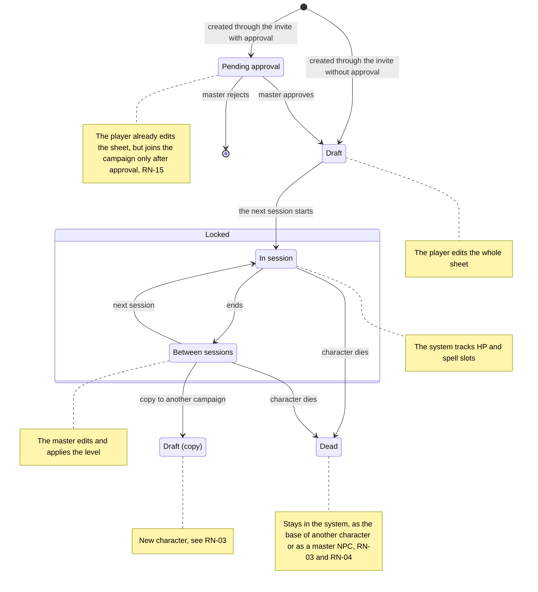
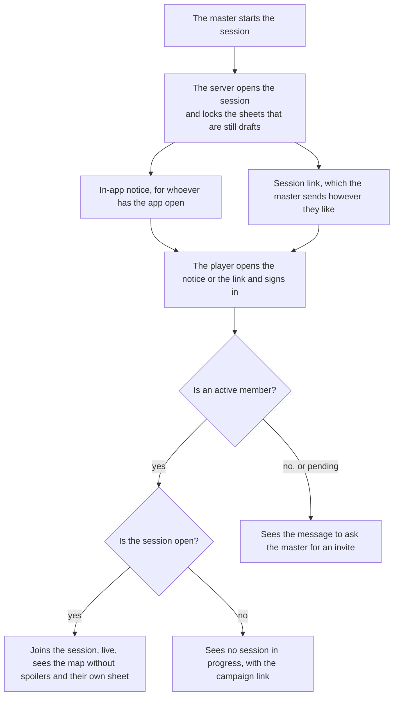

[Português (Brasil)](../pt-BR/produto/regras.md)

# Business rules

Each rule has an ID (RN-xx) so that the stories, the tests and the code can point to it. The table gives the statement of each rule; the section of each rule below it says how the system meets it, naming the behaviour and the tests.

| ID | Rule | Detail |
| --- | --- | --- |
| RN-01 | **Sheet lock.** The player edits their own sheet until the first session of the campaign starts. After that, only the master and the system change it. A character created later (the replacement for a dead one, or one for someone who joined late) stays editable until the next session starts. | [Detail](#rn-01-sheet-lock) |
| RN-02 | **Hit points and spell slots.** During the session, the system tracks hit points and spell slots from the actions: damage, healing, a spell cast, a rest. The master can also correct hit points and spell slots by hand at any time in the session: the master has the final word. | [Detail](#rn-02-hit-points-and-spell-slots) |
| RN-03 | **One character, one campaign.** A player's character stays in one campaign. Within the campaign, the player creates a new character only when the current one dies. A dead character is not deleted: it stays in the system, as the base for another character of the player, or as a master's NPC in another campaign (RN-04). | [Detail](#rn-03-one-character-one-campaign) |
| RN-04 | **Reusable NPCs.** The master uses their own characters in as many campaigns as they want. That includes a dead player character (RN-03), which the master may reuse as an NPC in another campaign. | [Detail](#rn-04-reusable-npcs) |
| RN-05 | **Roles per campaign.** A user can be master in one campaign and player in another. | [Detail](#rn-05-roles-per-campaign) |
| RN-06 | **Session start notice.** When the master starts the session, the members get a notification in the app, for whoever has the app open. The session link requires the person to be signed in (with Google, or with the sign-in without Google of RN-17) and opens the session only for members. | [Detail](#rn-06-session-start-notice) |
| RN-07 | **An invite is not the session link.** The invite adds someone to the campaign; the session link only takes a member to it. When generating the invite, the master chooses how many uses it has and how long it lasts, and can revoke it at any time. | [Detail](#rn-07-an-invite-is-not-the-session-link) |
| RN-08 | **Import format.** The player or the master chooses the format: the D&D Beyond sheet or the Portuguese-language sheet, both as fillable PDF. There is no DOCX import. | [Detail](#rn-08-import-format) |
| RN-09 | **XP mode.** Each campaign gives XP for defeated enemies, for gold or for milestones. In the first two modes, the master also gives XP whenever they want. | [Detail](#rn-09-xp-mode) |
| RN-10 | **Map without spoilers.** The player sees only the points of interest the group has already discovered. | [Detail](#rn-10-map-without-spoilers) |
| RN-11 | **Master notes.** Only the master reads and edits the master notes. | [Detail](#rn-11-master-notes) |
| RN-12 | **Level up.** The player levels up through the guided edit of the sheet that RN-01 allows while they "Pode subir de nível" ([MR-040](stories.md#mr-040-level-up-from-the-sheet): the "Pode subir de nível" block of the sheet and the page of steps Habilidades, Vida, Escolhas, Magias and Resumo, without the steps that have nothing to choose). | [Detail](#rn-12-level-up) |
| RN-13 | **More than one master.** A campaign can have more than one master, and a master can hand the campaign over to another. | [Detail](#rn-13-more-than-one-master) |
| RN-14 | **Creating a campaign needs a full master account.** Any account can play. To create a campaign, the account must be a full master account, which in the MVP exists only with Google. Other ways to sign in become a full master account after the MVP. | [Detail](#rn-14-creating-a-campaign-needs-a-full-master-account) |
| RN-15 | **Invite with approval.** Through the invite link, the player creates their own character right away. The master approves or rejects that character before it counts for the campaign. | [Detail](#rn-15-invite-with-approval) |
| RN-16 | **Account deletion and inactivity.** When a player deletes their account, their characters stay linked to the campaign's master and are not deleted. | [Detail](#rn-16-account-deletion-and-inactivity) |
| RN-17 | **Player sign-in without Google.** The player signs in with an anonymous login, with no e-mail or real name: the master's nickname together with the player's nickname identifies the account uniquely (the handle is per table, not per campaign, as [ADR-0009](../adr/0009-login-do-jogador-sem-google.md) proposed). | [Detail](#rn-17-player-sign-in-without-google) |
| RN-18 | **Physical or app dice.** The master chooses whether the campaign lets players choose the dice. If it does, each player chooses between rolling in the app or rolling the physical die and typing the result. | [Detail](#rn-18-physical-or-app-dice) |
| RN-19 | **Initiative.** In a battle with several identical NPCs, each rolls its own initiative; the group does not roll together. | [Detail](#rn-19-initiative) |
| RN-20 | **What players see of enemies in combat.** Players do not see enemy hit points (HP) as a number. They see one word: "Ileso" (unhurt), "Ferido" (hurt), "Muito ferido" (badly hurt, half the HP or less) or "Derrotado" (defeated). | [Detail](#rn-20-what-players-see-of-enemies-in-combat) |
| RN-21 | **Grid movement.** On the map grid, each square is 1.5 m and movement is a **circle**: the distance between two squares is the straight line between their centres (a diagonal step costs about 2.1 m, not 1.5 m), and what a combatant can reach is the circle of its remaining movement. | [Detail](#rn-21-grid-movement) |
| RN-22 | **Conditions and concentration.** The app marks conditions (prone, poisoned...) and concentration, and reminds: when a concentrating character takes damage, it reminds the concentration check. | [Detail](#rn-22-conditions-and-concentration) |
| RN-23 | **Table content.** The master registers classes, subclasses, races, subraces, backgrounds and spells that hold only in their campaign, next to the SRD 5.1. Members read the campaign's content; only the master writes. | [Detail](#rn-23-table-content) |
| RN-24 | **Table rules.** At the top of the "Regras da mesa" page is the **table style**: "Tudo no app" (dice in the app, combat with a map, fog on in new maps), "Mesa física" (physical dice, combat without a map by default, fog off) or "Teatro da mente" (each player picks the dice, combat without a map, no fog), and "Personalizado" when the choices match none. | [Detail](#rn-24-table-rules) |
| RN-25 | **The grid and combat without a grid.** The rules count in 1.5 m squares on every map (RN-21). A map drawn with bigger squares is calibrated: "each square of this drawing is worth 3 m" makes the app count four 1.5 m squares in each one, and a 1.5 m reach stays the neighbour. | [Detail](#rn-25-the-grid-and-combat-without-a-grid) |
| RN-26 | **Doors.** A closed door blocks movement, sight and light, like a wall, and counts as a wall for cover. A character who walks into it opens it, unless it is locked; the master opens, closes and locks any door, in the editor and in the session. | [Detail](#rn-26-doors) |
| RN-27 | **Puzzles.** The player never receives the answer to a puzzle: only the state (the lights, the wheels, the symbols, the ciphered message), the master's clue, the loose hints, who made the last move (the character's name) and, once solved, what happened (the text the master wrote in "Ao resolver" or a generic line). | [Detail](#rn-27-puzzles) |
| RN-28 | **AI-generated images.** Only the master generates and edits, with a limit of images per campaign per month. | [Detail](#rn-28-ai-generated-images) |
| RN-29 | **Monsters in combat.** A monster from the bestiary (MR-042) enters combat as an NPC: the player sees only the state word (RN-20), the master sees the SRD creature sheet, and it counts in the XP by enemies by its challenge rating (CR, ND). | [Detail](#rn-29-monsters-in-combat) |
| RN-30 | **Limits on what an account creates.** An account is master of at most 10 campaigns (`MAX_CAMPAIGNS_PER_USER`), and the whole server generates at most 100 images per day (`IMAGE_DAILY_LIMIT`) and keeps at most 5 image requests alive at once (the one being made and four waiting), on top of each campaign's 20 per month (RN-28). | [Detail](#rn-30-limits-on-what-an-account-creates) |

## RN-01: Sheet lock

The player edits their own sheet until the first session of the campaign starts. After that, only the master and the system change it. A character created later (the replacement for a dead one, or one for someone who joined late) stays editable until the next session starts. The character story (personality, appearance, backstory, allies) has its own lock: after the lock, the player edits it only when the master releases it, character by character, until the next session starts or until the master locks it again. The numbers the system calculates are never editable. **Exception ([MR-040](stories.md#mr-040-level-up-from-the-sheet)):** while the character "Pode subir de nível" (can level up, RN-12), the player may edit the sheet, but only to add what the next level gives: one class level and its choices. Everything else stays locked, and the server checks it with the rules engine.

**How the system meets it**

The server refuses player edits when `sheet_locked_at` is set. The story release is `story_editing_allowed`, which only the master changes and which the start of every session switches off. The screen shows the sheet read-only. `PlayService.StartGameSession` locks, in the same transaction, every living player character that is still a draft, so a character created later locks at the next session. The refusal is `failed_precondition` with the `CharacterBlocked` detail (`SHEET_LOCKED`, `CHARACTER_DEAD` or `STORY_LOCKED`); the master releases the story with `SetStoryEditing`. **The level-up exception:** the guided edit is `CharacterService.LevelUpCharacter`, owner only (the master keeps the sheet editor, `UpdateCharacter`), and only while `can_level_up` is true, also on a locked sheet. The client never sends the whole sheet: it sends the choices (`LevelUpChoices`), and the server builds the new sheet from the stored one, runs `rules.Validate` and `rules.CheckLevelUp`, and saves with the revision check (`aborted` if the sheet changed). **What the edit may change, and only this:** one level of a class the character already has (joining a new class is multiclassing and stays with the master); the ability score improvement, only at a level that has "Incremento no Valor de Habilidade" (+2 to one ability or +1 to two, none above 20; SRD 5.1 has no feats), which goes to `extra_ability_bonuses`; the hit points of the level (the average, the die rolled in the app, or the physical die typed in, from 1 up to the class die; average and rolled can be mixed, and the first rolled die on a fixed-HP sheet fills the earlier levels with their averages, so nothing else changes); exactly the cantrips and the known or spellbook spells (two per level for the Wizard) that the class table gives, and new prepared spells, none removed, up to the new maximum; the subclass, if this is its level; and the options the features of the new level offer (a fighting style, a metamagic), the skills and the expertise it gives. **What stays locked, refused by the server with the field and a reason (`LevelUpRefusal`):** name, race, background, base scores, armor, shield, weapons, the other classes, and everything the earlier levels already had; the new sheet also cannot end up with a problem the old one did not have (a spell outside the class list, above the level, or too many prepared). What the list does not cover stays with the master in the editor ("o mestre acrescenta pelo editor"; the server options list what belongs to the level in `master_adds`): multiclassing; a custom subclass (free name); the Warlock's Mystic Arcanum (levels 11, 13, 15 and 17), the Wizard's Spell Mastery and Signature Spells (18 and 20), the Additional Magical Secrets of the College of Lore (6) and the Ranger's favored enemies and terrains; and **swapping a known spell for another**, which the SRD allows Bards, Rangers, Sorcerers and Warlocks on level-up: the guided level-up only adds spells, never takes one away. Inside the list, the level-up covers the Warlock's new invocations (by the class table), the Bard's Magical Secrets (levels 10, 14 and 18: two of the new spells may be from any class), the extra cantrip of the Circle of the Land and the skills of the College of Lore. A stored sheet that no longer passes today's rules (a key the content lost) gets the refusal `SHEET_NEEDS_MASTER`: the app says to ask the master to fix the sheet. The player's refusal by lock stays `failed_precondition` with `CharacterBlocked`, with three more reasons: `CANNOT_LEVEL_UP` (not "Pode subir de nível", is an NPC or is at level 20), `DICE_FORCED_PHYSICAL` and `DICE_FORCED_IN_APP` (RN-18). **The hit die (RN-18):** the die rolled in the app is rolled **by the server** (`RollLevelUpHitPoints`) and kept for that character and level (one roll per level, even with two classes, and it only counts for the class that rolled): asking again returns the same result, never another, so the result "stays on the record". A campaign that forces the physical die refuses the app die; one that forces the app refuses the typed number; with "each player chooses", each roll follows its own choice. Every level-up is recorded for the master (`ListLevelUps`, "O que mudou"). Tests: `TestLevelUpPensantus`, `TestLevelUpToren`, `TestLevelUpRefusals` (in `rules`) and `TestMR040_ThePlayerLevelsUpALockedSheet`, `TestMR040_TheRestStaysLocked`, `TestMR040_TheRulesRefuseWhatTheLevelDoesNotGive` and `TestMR040_TheHitPointRollIsKept` (in `characters`).

## RN-02: Hit points and spell slots

During the session, the system tracks hit points and spell slots from the actions: damage, healing, a spell cast, a rest. The master can also correct hit points and spell slots by hand at any time in the session: the master has the final word.

**How the system meets it**

Each action becomes an event on the server, which recalculates and tells the live table. The master's correction is also an event, and it skips the automatic calculations. **The master's correction:** current HP, temporary HP, spell slots (and pact slots) used and hit dice used live in `character_vitals` and last from one session to the next; the maximums come from the sheet (`rules.Derive`), and the stored value is clamped to the maximum on every read. The master corrects with `PlayService.AdjustCharacterVitals`, only with an open session (without one, `failed_precondition` with `NO_OPEN_SESSION`), each value from 0 up to the maximum (the "Ajustar" sheet also gives back spent uses of class and race resources, such as Wild Shape or Rage, and sets the beast's hit points while a druid is in Wild Shape); the correction and a `session_events` row are written in the same transaction, and the stream tells the master and the character's owner at once. A retry with the same `idempotency_key` changes nothing. A player sees only the numbers of their own character (never the others'); the master sees everyone's. **The calculations** are pure, in `rules/combat`: `ApplyDamage` (temporary HP first, floor at 0), `ApplyHeal` (up to the maximum) and `SpendSlot`, `SpendPactSlot` and `SpendResource`. **Combat damage:** an attack that hits opens a pending damage (`pending_damages`). On an NPC the damage is applied at once (temporary HP first; at 0 HP it is defeated and leaves the order); on a player character the rolled damage **waits for the master**, who applies it ("Aplicar 5 de dano") or discards it ("Não aplicar"), and only then do the `character_vitals` change, through the same path as the correction, with the same limits (0 to the maximum). At 0 HP the character is down (everyone sees the word "Caído", never the numbers) and makes death saving throws (RN-03). The master changes an NPC's HP by hand with `AdjustCombatantHitPoints` (damage, healing or a value, and temporary HP) and undoes the last action with `UndoLastAction`: each becomes an event, and the undo is a compensating event. **Spells, resources and healing:** `CastSpell` spends the spell slot (or pact slot) **at casting**, together with the action or bonus action, through the same `character_vitals` and in the same transaction (a resend with the same key does not spend again; an NPC's slots are not counted). A spell's damage follows the attack damage path (an NPC applies at once, a character waits for the master); a **heal** rolls the die with the spellcasting modifier and heals **at once**, up to the maximum, on an NPC and on a character, and whoever was at 0 HP gets up (RN-03). Class and race uses (Second Wind, Action Surge, Rage...) also live in `character_vitals` (`resources_used`, clamped to the sheet's maximum) and the master's correction gives them back (`AdjustCharacterVitals.resources_used`; rests do not exist yet); Second Wind heals 1d10 + the fighter level. The master applies **a different amount** than the rolled one (`ApplyPendingDamage.amount`, 0 to 9,999: a resistance, a resistance he does not accept): the log keeps both for him, and the player sees only what they took. Tests: `TestMR014_CastingSpendsTheSlot`, `TestTimelineRound3MagicMissile`, `TestSaveSpellRollsOnceForTheCast`, `TestHealingSpellRevivesAndResetsDeathSaves`, `TestSecondWindAndActionSurge`, `TestMasterAppliesADifferentAmount`, `TestCombatUndoTakesBackEveryNewAction`, `TestMR012_DamageToAnNPCIsAppliedAndDefeatsIt`, `TestRN02_DamageToAPlayerWaitsForTheMaster`, `TestCombatUndoRestoresTheLastAction`. **A trap's damage (MR-035):** the server rolls the damage when the trap fires, and it follows the attack damage path: on an NPC or a creature it lands at once; on a player character it **waits for the master**, who applies it (changing the amount first, if he wants) or discards it. In combat it is a `pending_damages` row with no attacker (`trap_point_id`), applied with `ApplyPendingDamage`; outside combat, a `trap_damages` row, applied to the vitals with `ApplyTrapDamage`. An NPC outside combat has no stored HP: the damage is only a history row. When the combat ends, whatever still waits becomes `trap_damages`, which outlives the session until the master applies or discards it. Tests: `TestMR035_AMoveStopsAtTheFirstSquareOfTheArea`, `TestMR035_TheMasterFiresATrapByHand`, `TestMR035_OutsideACombat`, `TestMR035_AnEndedCombatKeepsTheTrapDamageForTheMaster`. **The character's creatures (MR-037):** a creature's HP is its own, not the character's; the master corrects it outside combat with `AdjustCreatureHitPoints` and, in combat, with the combatant's "Dano/Cura" (`AdjustCombatantHitPoints`); an attack's damage lands on the creature at once, as on an NPC, without waiting for the master (the wait in RN-02 is for character HP), and at 0 HP it is dismissed. Test: `TestMR037_ACreatureAtZeroLeavesAndTheHitPointsGoBack`.

## RN-03: One character, one campaign

A player's character stays in one campaign. Within the campaign, the player creates a new character only when the current one dies. A dead character is not deleted: it stays in the system, as the base for another character of the player, or as a master's NPC in another campaign (RN-04). To play another campaign, at the same time or in a continuation years later, the player makes a copy.

**How the system meets it**

The copy is a new character with `copied_from_id` pointing to the original. It starts editable and locks at the first session of the new campaign. A dead character changes state, never row: there is no character deletion in the normal flow. `characters.campaign_id` is the character's campaign, the master marks the death with `MarkCharacterDead` (`status = 'dead'` and `died_at`), and the partial unique index `characters_one_living_player_character` allows only one living character per player in each campaign, even with two simultaneous calls. The second creation gets `failed_precondition` with `LIVING_CHARACTER_EXISTS` and the ID of the living one (the copy is [MR-021](stories.md#mr-021-copy-a-character)). In combat, the third failed death saving throw does not kill by itself: the character dies only when the master confirms, and the confirmation is the same `MarkCharacterDead`; from then on everything above holds. The death save calculations are in `rules/combat` (`DeathSave`, `DamageWhileDown`): three failures give the result `dying`, never death. **How the system meets it:** a character at 0 HP is "Caído" and, at the start of their turn, owes a death saving throw (`death_save_due`; the player's `EndTurn` waits, with `DEATH_SAVE_DUE`, and the master passes the turn anyway). `RollDeathSave` (app d20 or typed, on every roll, RN-18): 10 or more is a success, less is a failure, a natural 1 is two failures, a natural 20 returns with 1 HP (through the `character_vitals`, the counts reset and the character can act); three successes make the character "Estável"; three failures make it "Morrendo" for the master (for the players the word stays "Caído", with the counts, which are public: the app never says someone died before the master does). Damage that hits someone at 0 HP does not lower HP: it counts a failure (two on a critical hit); on a stable character, the successes reset first. Any healing above 0 resets the counts (a spell, Second Wind, the master's correction, an undo). `ConfirmDeath` (master only, only with three failures) triggers the effect of `MarkCharacterDead` in the same transaction, removes the combatant from the order (the turn passes if it was theirs) and goes to the log; it **cannot be undone**, because the character is already dead in `characters` (to bring them back the master uses the character service itself). The counts live on the combatant row: an ended combat keeps them for the summary ("Caída: 1 sucesso, 1 falha"), and a new combat starts at 0 and 0. Whoever drops to 0 HP on their own turn rolls the first save on the next turn. Outside combat the app does not roll death saves. Tests: `TestRN03_DeathSavesAndTheMasterConfirms`, `TestRN03_NaturalOneTwentyAndStable`. **On the screens:** on the turn of someone who is down, the hero says "Brisa está caída", with the marks (success ✓, failure ✕) and "Rolar teste contra a morte" (in the app or typed, on every roll); after the roll the result appears in a live region with "Encerrar turno". Only the master sees "Morrendo · 3 falhas" and the question "Confirmar a morte" / "Ainda não" (focus on "Ainda não"); the players see "Caída" and the counts. Test: `combat.spec.ts` ("caído: o teste contra a morte").

## RN-04: Reusable NPCs

The master uses their own characters in as many campaigns as they want. That includes a dead player character (RN-03), which the master may reuse as an NPC in another campaign.

**How the system meets it**

The NPC is a template. HP and position in each combat live on the combatant, so a combat in one campaign does not change the NPC in the others. An NPC has an owner, the master who created it (`characters.master_user_id`), and stays in the campaign where it was created; using the same NPC in other campaigns is [MR-022](stories.md#mr-022-reuse-npcs), and nothing in the model prevents it. Players neither see nor create NPCs.

## RN-05: Roles per campaign

A user can be master in one campaign and player in another.

**How the system meets it**

The role lives in `campaign_members`, not on the user.

## RN-06: Session start notice

When the master starts the session, the members get a notification in the app, for whoever has the app open. The session link requires the person to be signed in (with Google, or with the sign-in without Google of RN-17) and opens the session only for members.

**How the system meets it**

The app shows the notification on screen; there is no browser push notification (with the app closed) in the MVP. A non-member sees "peça um convite ao mestre". While the tab is visible, the app asks every 30 seconds which sessions are open in the person's campaigns (`PlayService.ListOpenGameSessions`, only for active members), without keeping a connection open; the session page opens only for members (`GetLiveSession` and `WatchGameSession` answer `not_found` to a non-member, including a pending member, and `failed_precondition` with `NO_OPEN_SESSION` when there is no session). On screen: the notice under the app bar, the "Ao vivo" link in the bar and the session page (`/campaigns/<id>/session`). The notice is not shown on the campaign page itself: there, the "Sessão" card is the announcement, and a player's card follows the same poll ("Entrar na sessão" appears when a session starts and goes away when it ends, without reloading the page).

## RN-07: An invite is not the session link

The invite adds someone to the campaign; the session link only takes a member to it. When generating the invite, the master chooses how many uses it has and how long it lasts, and can revoke it at any time.

**How the system meets it**

The invite expires and is stored only as a hash. Default: 1 use, 7 days. The master chooses 1 to 20 uses and 5 minutes to 30 days. The session link carries no secret: it is `/campaigns/<id>/session`, and the server decides whether the person gets in, checking membership on every call and, on the stream, again every 60 seconds.

## RN-08: Import format

The player or the master chooses the format: the D&D Beyond sheet or the Portuguese-language sheet, both as fillable PDF. There is no DOCX import.

**How the system meets it**

The importer reads the PDF fields and shows the result for review before saving.

## RN-09: XP mode

Each campaign gives XP for defeated enemies, for gold or for milestones. In the first two modes, the master also gives XP whenever they want.

**How the system meets it**

By enemies: sums the XP of the defeated enemies and splits it among the group, as in the Dungeon Master's Guide (a bestiary monster counts by the creature's challenge rating, RN-29). By gold: 1 XP per gold piece (GP), as in the old editions. By milestones: the master raises the group's level. By enemies, the master chooses whether to use the challenge rating (CR) or to type the XP, and decides at the end of the combat who receives it. By milestones, the master defines beforehand the moments when a whole level is given (the planned milestones, below); "Registrar um marco fora da lista" remains for what nobody planned. **The mode changes after the campaign is created (RN-24):** `SetCampaignXpMode`, master only; if XP was already given (an award that was not undone, a milestone included), it refuses with the `XpModeChangeBlocked` detail (how many awards and how much XP) until `confirm` comes. Nothing is converted: the XP already given and the history stay, and the new mode applies from then on. **The mode also decides "Pode subir de nível" (RN-12):** by enemies or gold, the sheet's XP reaching the next level; by milestones, the mark. Changing the mode therefore changes the level-up notices that are waiting: whoever was ready by XP is not ready by milestones until the master marks, and whoever had the mark is not ready by XP until the XP reaches the level (nothing is written to the sheets: the notice is read from the mode on every read). An award and a mode change take turns (the award re-reads the mode inside its own transaction), so no award escapes the confirmation. The mode otherwise only decides which awards fit the campaign; going back to the earlier mode asks the same way. Tests: `TestRN09_TheXPModeChangesAfterCreation`, `TestRN09_ChangingTheXPModeAsksOnceXPWasAwarded`, `TestRN09_AnUndoneAwardDoesNotCount`. By gold, the GP come from treasures placed beforehand on the map and are converted, 1 XP per GP, when the group returns to town ([MR-041](stories.md#mr-041-treasure-and-xp-by-gold): "Voltar à cidade" in "Experiência" and in "Dar XP"); typing the GP still works. **The generated treasure (MR-044):** the treasure generator puts on the map a hidden point whose value is only the treasure's **gold** (the coins, the gems and the art objects, 10 SP = 1 GP); the magic items stay in the description and **never become XP** (an item is not gold: adding its value would give "free" XP). In a gold campaign the point converts in "Voltar à cidade" like any treasure (`TestMR044_AGoldCampaignConvertsTheGoldOnly`); in the others it only goes into the session summary (see [Architecture](../architecture.md#treasure-generator-mr-044)). **The calculations:** the SRD tables are hand-written content, `effects/advancement.json` (the XP of each level, 1 to 20, and the XP of each challenge rating, "ND", 0 to 30), checked on load. The functions are pure, in `rules`: `XPForChallenge` (CR to XP), `SplitXP` and `LevelForXP`. **The split** is the total divided by the number of characters, rounded down (100 XP for 3 gives 33 each); CR 0 is worth 10 in the table, and the master types 0 for a creature that does not attack. Tests: `TestXPForChallenge`, `TestSplitXP`, `TestLoadAdvancementRefusesBrokenTables`. **XP given (module `progression`).** The master gives XP with `AwardXP`: by enemies (the sum of the XP of the defeated NPCs of an ended combat, one award per combat, unless undone), by gold (1 XP per GP) or loose (the number typed), and each chosen character receives their share on the sheet, in the same transaction. The mode must fit the campaign (by enemies: enemies and loose; by gold: gold and loose; by milestones: only the milestone) and whoever receives must be a living player character of the campaign. An NPC's XP is the `xp_value` of its sheet (the challenge rating fills it in, and the master may type another), copied to the combatant when it enters the combat; only the master receives it (RN-20). The master undoes only the last award, which stays in the history as "Desfeito" (nothing is erased, ADR-0007). The undo takes back the XP each sheet gained, which is less than the share when the sheet hit its limit of 1,000,000 XP. The whole campaign reads the history (who gave, when, why, how much each received), and the players get the live `xp_changed` notice. **How it works:** the CR is optional and the XP field accepts any number, so both ways count equally; the one who splits is the list of characters the master sends, which the screen proposes with those who fought and did not die (by enemies); a split that does not close rounds down and the server says how much was lost; the milestone marks the characters the master chooses, without XP, and the mark lasts until the sheet's level goes up (the level-up notice); everyone in the campaign sees the history. **XP from treasure.** "Voltar à cidade" is an `AwardXP` of mode `GOLD` with `treasure_point_ids`: the server sums the GP of the found treasures that no award converted, 1 XP per GP, and splits among the characters the master chooses as in any award (equal, rounded down; "found by" does not weigh on the split). Each treasure is converted once (two awards at the same time: one wins), and only in a gold campaign (in the others the treasure stays on the map and in the session summary). Undoing the award, if it is the last, returns the treasures to "found, not converted"; after a newer award they stay converted until that one is undone, and the master corrects by hand. Tests: `TestMR041_VoltarACidadeConvertsTreasuresIntoOneGoldAward`, `TestMR041_ATreasureIsConvertedOnce`, `TestMR041_UndoFreesTheTreasures`, `TestMR041_VoltarACidadeRefusesWhatDoesNotFit`. **The planned milestones.** In a milestones campaign, the master writes the milestones beforehand, a list of texts of up to 120 characters (at most 100 per campaign, counting the reached ones), in any order (`AddMilestone`, `UpdateMilestone`, `MoveMilestone`, `RemoveMilestone`, one change per call; the table is `planned_milestones`). When the group reaches a milestone, the master marks it and chooses who levels up (`MarkMilestoneReached`): it is the earlier `MarkMilestone`, with the milestone's text as the reason and linked to the milestone, so "Pode subir de nível" (RN-12), the history, the session event and `xp_changed` are the same. The order is never enforced: a milestone can be marked out of order. A milestone is reached only once; "Dar a mais alguém" (`GiveMilestoneTo`) gives the same milestone to someone who was left out, as a new award for that character in the history, without a second milestone. "Reached" is not a column: it holds while some award of the milestone has not been undone. Undo is still the last award's (`UndoLastXPAward`): undoing the only mark makes the milestone go back to planned, in the same place of the list; undoing a mark from "Dar a mais alguém" removes the milestone only from that character, and it stays reached for the others. A reached milestone is never edited, moved or removed, only undone. **Who sees what (RN-20):** the planned ones belong to the master alone; the player receives only the reached ones, with the day, the time and who leveled up, as in the history, and never the name of a milestone that did not happen. A milestone registered off the list appears among the reached ones, but cannot receive "Dar a mais alguém". A campaign that counts XP refuses all this with `MODE_NOT_ALLOWED`. Tests: `TestMR016_PlannedMilestones`, `TestMR016_ReachingAPlannedMilestoneLetsTheChosenLevelUp`, `TestMR016_GiveAReachedMilestoneToSomeoneElse`, `TestMR016_UndoOfAPlannedMilestone`, `TestMR016_AMilestoneMarkedOffTheListIsReachedToo`, `TestRN20_PlayersSeeOnlyReachedMilestones`, `TestMR016_PlannedMilestonesNeedAMilestonesCampaign` and the `TestAuthorizationMatrix` matrix; on screen, the `@MR-016`, `@RN-12` and `@RN-20` tests of `e2e/tests/milestones.spec.ts`. **The screens.** The NPC has "Nível de desafio (ND)" and "XP ao derrotar" in the editor (minion: section "Ao ser derrotado"; enemy and boss: in the Básico step): changing the CR always redoes the XP from the table, a typed value stays while the CR does not change, and "Usar 50 XP" goes back to the table's. At the end of the combat, the master sees each defeated one's XP, the sum, who receives (by default those who fought and did not die; the dead cannot be ticked) and the written split ("350 XP ÷ 3 = 116,67, arredondado para baixo. 2 XP se perdem na divisão."); "Dar 116 XP a cada um" gives the combat award, and "Agora não" leaves the line "XP do combate ainda não dado", which opens "Dar XP" with the reason and the total filled in. "Dar XP" at any time (campaign and session) asks for the reason (up to 120 characters) and the value (1 to 1,000,000), or the gold pieces in gold mode; errors appear when leaving the field. The campaign page has "Experiência" for all members: each character's XP, what is missing, the history and, for the master only, "Desfazer" on the last award, with the question in place and focus on "Voltar". In a milestones campaign no screen shows an XP number: the label and the milestone lists ("Registrar marco" became "Registrar um marco fora da lista"). The sheet shows the XP as a read-only block, and the player no longer types the XP once the sheet locks. Tests: `e2e/tests/xp.spec.ts` (`@MR-016`) and the Vitest ones for `core/progression`, `shared/xp`, `campaign-detail/experience`, `combat-xp` and `defeat-xp`.

## RN-10: Map without spoilers

The player sees only the points of interest the group has already discovered.

**How the system meets it**

The server filters the response. The map and the point are born hidden, and the master reveals and hides each one (`SetMapRevealed`, `SetMapPointRevealed`); an NPC's token is born hidden and a player character's, visible (`SetMapTokenHidden`). The player sees the revealed map and the session's current map (choosing the current map reveals it); on it, only the revealed points and the visible tokens; a submap point only leads to a map the player also sees. Any other map is `not_found`, the same as a map that does not exist. **In combat on a fog map**, the player also receives only the NPCs their character sees (RN-20). What the player does not see is left out of the response, never blank: no ID, no name, no description. **Converted treasure:** the XP history the player reads carries, for a "Voltar à cidade", only how many treasures there were and the total in GP (`treasure_count`, `gold`), never which ones nor each one's value; the list (`treasures`) is the master's. A hidden point never reaches the player's phone. **A generated treasure (MR-044):** the four `TreasureService` calls are master only (the player, a pending member and a non-member get `not_found`), and the point `PlaceTreasure` makes is born hidden: neither it, nor the description, nor the gold reach the player on the map, in the live session or on the stream while it is hidden; **once revealed, the player sees only the point and the name; once found by the group, also the description and the gold** (MR-041) (`TestRN10_APlayerNeverSeesAPlacedTreasureUntilRevealed`, `TestTreasureAuthorizationMatrix`). **A generated dungeon:** the room list, the record (the seed, the options, the generator version) and the `DungeonService` calls are master only, and the player gets `not_found` from all of them, before and after the map is revealed (`TestRN10_PlayersReadNothingOfADungeon`). The stream follows the same rule: a change only in hidden things reaches only the master (`TestMR009_PlayersNeverReceiveHiddenPoints`, `TestRN10_PlayersCannotOpenHiddenMaps`; see [Architecture](../architecture.md#who-sees-what-on-the-map)). **Images** follow the same idea, with the gallery (MR-019): the gallery, with all the campaign's images, is master only (`TestMR019_PlayersCannotListTheGallery`). The player downloads an image (`GET /images/{id}`) only while seeing it: the background of a map they see, or the image the master shows in the session (MR-028), which reveals nothing more. Keeping the ID is not enough: the route checks on every request, and the player's browser asks again on every use (`TestRN10_PlayersOnlyFetchImagesTheyCanSee`). The master may leave an image with the players ("Deixar com os jogadores", MR-028): it goes to the campaign's left-images list (`campaign_left_images`) and the player downloads it until the master takes it back (`TakeBackLeftImage`), also after the session (`TestMR028_MasterLeavesAnImageWithThePlayers`, and the new part of `TestRN10_PlayersOnlyFetchImagesTheyCanSee`: left, served; taken back, `404` again). A non-active member, or a player who does not see the image, gets `404`, the same as an image that does not exist (see [Architecture](../architecture.md#serving-images)). **RP scenes (MR-015):** the master may open a hidden scene point (`OpenScene`); it is not revealed: the open scene reaches the players (`GetOpenScene`, with the name, the description and the actions), and the point stays off their map. The `MapPoint` of a revealed point carries the scene actions, without the DC. Tests: `TestMR015_AHiddenPointCanBeOpenedAndStaysHidden`, `TestMR015_PlayerSeesTheMastersActionsWithTheirBonus`. **The stage and the portraits (MR-031):** an NPC's portrait is a gallery image (field `portrait_image_id` of the NPC sheet), and the player downloads it only while the NPC is on the stage of the open scene: out of the scene, with the scene closed or swapped, or with the session ended, it is `404`, the same as an image the player cannot see, also on `If-None-Match`. Taking the NPC off the scene cuts access at once. Tests: `TestMR031_PortraitsAreVisibleOnlyOnStage`, `TestMR031_DeletingAPortraitClearsIt` (see [Architecture](../architecture.md#npcs-on-stage)). **Discovered scenes, clues and hooks (MR-029, MR-030):** a scene is "discovered" when the master reveals the point on the map or opens it in a session (even hidden); it holds for the whole group and does not go away if the point is hidden again; it is the only rule that lets the player use a scene's name away from the map (the label of a note), and only for a scene of a map the player can open: a scene on a map that is neither revealed nor the session's current one is not listed, however it was discovered. Any scene point opens, even without actions: the scene belongs entirely to the master, and the server does not refuse. The player sees only the scene's NPCs and may tap one to see it larger, with nothing else ([MR-031](stories.md#mr-031-npcs-in-the-scene)). Tests: `TestMR030_TagsOnlyDiscoveredScenes`, `TestScenesWithNoActionsOpen`. **Traps, treasures, lights and layers (MR-034 to MR-036 and MR-041):** a trap that has not been revealed to the player's character never reaches them, neither ID nor position, in any response or stream event; it arrives only when the master revealed it to that character (`RevealTrap`, and when the character notices or finds it in play), when it has already fired (then everyone sees it, even if the master disarms it later) or when the master revealed it to everyone; and then only with name, description, position, area and state, never the DC to notice, the DC to find, the trigger, the effect or the preset, which only the master receives. A reveal to some characters notifies only their players, and the player of another character does not even get a `map_changed` because of it. A treasure follows the hidden-point rule and, once found, everyone who sees the map sees it with the description, the value and who found it (before it is found, even revealed, it carries neither description nor value). A light point never goes to a player (they see the light, not the point), and the painted light layer never either: of what is painted, the player of a map they see, without fog, receives only wall, difficult terrain and cover (things that can be seen), and with fog on, the layers of what the character sees (below). The light a character carries goes only to the master and to its owner. **The fog per player (MR-036):** on a map with fog on, the player receives only what their character **sees now or has already seen**, and the server decides with the `rules/vision` calculation (the walls and the light the master painted, the light points and the lights characters carry, the sheet's darkvision). It does not reach them: the ID, the URL or the thumbnail of the map image (the route refuses the file), a point whose squares they neither see nor remember, the token of an NPC outside what they see now, the light layer, or a wall far from what they see. A player character's token always arrives (the group knows where its people are). A token the master hid still lights the map (the carried light holds, and the player sees the brightness, not who carries it), as at a table. While a combat runs on the map, the NPC tokens are left out of the player's reads (the combatants are covered by the combat rule above). Memory is written only while the players see the map, and every clear invalidates it (an epoch, no race with an update in progress). A fog map's image is the master's alone: showing it in the session, leaving it with the players, or using it as a portrait or as the background of a map without fog gives a copy. What was already seen stays, darkened and without creatures, until the master clears it ("Esquecer o que foi visto") or changes the grid or the image. The counts are those of what the player receives; asking for what they do not see gives the same `not_found` as asking for what does not exist. The stream follows the rule: an NPC's movement arrives only as `vision_changed`, and only to whoever sees it. The master sees everything, and can open the map "as" a character (`as_character_id`) to see exactly what that player receives. **The image, in tiles:** the player never receives the whole image of a fog map, only tiles of 16 × 16 squares, assembled on the server with the pixels of the squares they saw or remember and opaque black elsewhere (two images that differ only in squares they do not know give them identical tiles; the fog edge is darkened 1 pixel in a PNG and up to 16 pixels in a JPEG), from a route that checks the map on every request (`404` for whoever does not see the map, is not a member or is pending; the master reads the whole image as always); a tile with no known square does not exist. Tests: `TestRN10_TileOracle` (the guarantee test), `TestRN10_TilesCarryOnlyWhatThePlayerSaw` (decodes the tile and checks each pixel), `TestRN10_TileAuthorization`, `TestRN10_TilesAreInvalidated` (see [Architecture](../architecture.md#per-player-image-tiles)); `TestRN10_FogPlayersReceiveOnlyWhatTheirCharacterSees` (reads each response of four players in the drawings' cave as the app's JSON), `TestMR036_FogViewsMatchTheCaveOracle`, `TestMR036_SeeAsAPlayersCharacter`, `TestMR036_WhatWasSeenStays`, `TestMR036_VisionChangedReachesTheRightPlayers`, `TestRN10_FogMapImageIsCopiedWhenShared`; `TestRN10_PlayersNeverReceiveTrapsLightsOrHiddenTreasure`, which reads as the app's JSON each response (`ListMaps`, `GetMap`, `GetMapLayers`, the session photo) and the stream of two players, `TestMR034_PlayersReadOnlyWhatTheyMay`, `TestMR036_CarriedLight`. **Traps in play (MR-035):** a trap that no player character knows (neither revealed to all nor fired) never reaches the player, neither its existence, position, name nor DCs, in any response, stream event or log row: noticing and searching are decided on the server, from what the character can see, and reveal only to that character; the result of a search reads the same when there is nothing and when the test failed; `GetMoveOptions` marks only the trap the character knows; a move cut short by an unknown trap only says that it stopped, and the trap becomes public because it fired. The player reads "passou" or "falhou", never the DC, and a character's owner sees their own d20. Tests: `TestRN10_NoPlayerResponseNamesAnUnrevealedTrap` (reads as the app's JSON the map, the combat, the move options, the log, the live session and the stream of two players, before and after a third one learns of the trap), `TestRN10_AMoveStoppedByAnUnknownTrapReadsAsTheTrapFiring`, `TestMR035_Searching`. **The systematic test:** `TestLeakMatrix` (`backend/internal/leaktest`) builds a campaign with one hidden thing of each kind, marked with texts and numbers that do not appear by chance, and requests every read, every stream event, every image and every fog tile as each person (two players, a pending member, a stranger and someone without a session); the completeness guard fails for a new procedure that is not classified (see [Architecture](../architecture.md#leak-tests-rn-10)).

## RN-11: Master notes

Only the master reads and edits the master notes.

**How the system meets it**

The notes live in a separate table, `character_master_notes`, and come out only through `GetMasterNotes` and `UpdateMasterNotes`, which only the master calls. No other response carries them. In the old app, the player could read and edit them: it is a known bug, never fixed there; the new system proves it does not exist with an automated test (`TestRN11_PlayersNeverReceiveMasterNotes`).

## RN-12: Level up

The player levels up through the guided edit of the sheet that RN-01 allows while they "Pode subir de nível" ([MR-040](stories.md#mr-040-level-up-from-the-sheet): the "Pode subir de nível" block of the sheet and the page of steps Habilidades, Vida, Escolhas, Magias and Resumo, without the steps that have nothing to choose). The master can also apply the new level on the sheet. The full level-up screen of [MR-017](stories.md#mr-017-level-up) is for after the MVP.

**How the system meets it**

The system tells the master when a character reaches the XP of the next level. `DerivedSheet.next_level_xp` carries the XP of the next level (0 at level 20), calculated by `rules` from the total level (`NextLevelXP`: 300 for level 2, 900 for 3, 2,700 for 4...). `GetCharacter` carries `can_level_up` and `level_up_reason` (`XP` or `MILESTONE`) for the master and the owner, of a living player character, and `GetCampaignExperience` carries the same for the whole group. In a campaign by enemies or by gold, it holds when the sheet's `experience_points` reach the XP of the next level; in a milestones campaign, it holds with a milestone mark (planned or not) whose level the sheet's level has not yet passed (the mark goes away by itself when the level goes up). Nobody levels up from level 20. Who sees the notice: the master and the player. **The screens:** the label "Pode subir de nível" (arrow and words, never color alone) appears in the campaign's "Personagens dos jogadores" list, in "Experiência" and on the sheet. In a campaign by enemies or by gold, the sheet shows the "2.716 XP" block with the bar and the sentence "Chegou aos 2.700 XP do nível 4. O mestre sobe o seu nível na ficha." (for the master: "Suba o nível na ficha."); in a milestones campaign, only the label. The sheet listens to the session's `xp_changed` and updates by itself, and the mark goes away when the master raises the level in the editor. **The guided level-up:** when the player levels up through `LevelUpCharacter`, "Pode subir de nível" goes away by itself, as when the master raises the level in the editor: in an XP campaign because the sheet's XP no longer reaches the next level, in a milestones campaign because the sheet's level passed the mark's (`TestMR040_CanLevelUpClearsAfterwards`). The level-up sends the open sessions the same content-free notice as for XP, `xp_changed`, and the master reads what changed in `ListLevelUps`. **The level-up screen:** the button "Subir para o nível N" is the owner's only, on the locked sheet; the route without the mark answers that leveling up is not possible yet (the refusal `CANNOT_LEVEL_UP`), and the master, that the level-up is the player's. Tests: `TestDerivedNextLevelXP`, `TestLevelUpReason`, `TestXPCanLevelUpInAnXPCampaign`, `TestMR016_MilestoneMarksWithoutXP` and, on screen, the `@RN-12` tests of `e2e/tests/xp.spec.ts` and `e2e/tests/levelup.spec.ts`.

## RN-13: More than one master

A campaign can have more than one master, and a master can hand the campaign over to another.

**How the system meets it**

More than one `role = master` row in `campaign_members` for the same campaign. The campaign is deleted only when the last master leaves (see [Privacy](../privacy.md#delete-the-account)). See [ADR-0011](../adr/0011-autorizacao-papeis-por-campanha.md).

## RN-14: Creating a campaign needs a full master account

Any account can play. To create a campaign, the account must be a full master account, which in the MVP exists only with Google. Other ways to sign in become a full master account after the MVP.

**How the system meets it**

`CreateCampaign` refuses anyone without a linked Google identity. This confirms, for the MVP, the proposal of [ADR-0009](../adr/0009-login-do-jogador-sem-google.md).

## RN-15: Invite with approval

Through the invite link, the player creates their own character right away. The master approves or rejects that character before it counts for the campaign.

**How the system meets it**

The character is born in a "pending approval" state, editable by the player; it becomes part of the campaign only when the master approves it (see [Character lifecycle](#character-lifecycle), RN-01). On each invite the master can tick "Exigir aprovação do mestre" (`requires_approval`; unticked, the invite works as usual). Whoever accepts such an invite becomes a pending member (`campaign_members.status = 'pending'`) and goes straight to create the character, which is born `CHARACTER_STATE_PENDING`. A pending member is not a member: apart from seeing the campaign name, creating, reading and editing their own character, and (RN-24) reading the table rules (`GetTableRules`) and making abilities with the 4d6 the server keeps (`GetAbilityRolls`, `RollAbilityScores`), the server answers `not_found`, like for someone who is not in the campaign (see [Architecture](../architecture.md#pending-member)). A session does not lock the pending character, and it cannot die. The master approves it (`ApproveCharacter`: the character becomes a draft and the player a member) or rejects it (`RejectCharacter`: the character and the pending membership are deleted, and the player needs a new invite), in a single transaction. The master sees who is pending without a character (`ListPendingMembers`, with when they joined and when it expires on its own) and can remove them (`RemovePendingMember`; it refuses someone who is already a member or already has a character, who is refused through `RejectCharacter`). A pending membership without a character is deleted on its own 30 days after joining, by the database TTL on `campaign_members.pending_expires_at`. The deadline binds from the moment it passes, before the TTL job runs: that person no longer counts as a member, and creating a character does not bring the membership back. An ordinary invite (without approval, and valid now) accepted by a pending player makes them a member at once, spends one use and approves their character, if one was waiting, because it counts as the master's approval. An invite with approval accepted by a pending player changes nothing.

## RN-16: Account deletion and inactivity

When a player deletes their account, their characters stay linked to the campaign's master and are not deleted. When a master deletes their account, they have 30 days to come back by signing in again with the same account (the same `issuer`/`subject`, see [Privacy](../privacy.md#delete-the-account)); after that period, everything is deleted. In any deletion, everything is gone for good 30 days later. Each person chooses in their own profile how much inactivity leads to deleting the account; the default is 1 year.

**How the system meets it**

The player's character becomes the master's, with no link to the deleted account, or is deleted along with it if the person prefers. The master's 30-day wait is a "delete at" mark on the account, checked at sign-in. See [Privacy](../privacy.md#delete-the-account) for the full flow, including the caveat about personal data in the character's free text. The character side already holds in the database: `player_user_id` uses `ON DELETE SET NULL` (the character stays in the campaign, with the master) and the NPC goes with the master's account (`CASCADE`). A player character left with no player and no campaign is deleted by the database TTL. Choosing to delete one's own characters, the 30-day wait and inactivity come with account deletion.

## RN-17: Player sign-in without Google

The player signs in with an anonymous login, with no e-mail or real name: the master's nickname together with the player's nickname identifies the account uniquely (the handle is per table, not per campaign, as [ADR-0009](../adr/0009-login-do-jogador-sem-google.md) proposed). The player signs in without a password; when the first 30-day session expires, they must set a password or link Google to continue.

**How the system meets it**

The handle lives in `table_handles`, unique within the master's table (`dm_user_id`). The password follows option 3 of ADR-0009.

## RN-18: Physical or app dice

The master chooses whether the campaign lets players choose the dice. If it does, each player chooses between rolling in the app or rolling the physical die and typing the result. If it does not, everyone uses the type the master picks.

**How the system meets it**

A campaign setting and a per-player preference in it. The rules engine accepts both (ADR-0008). The setting is `campaigns.dice_mode` (`players_choose`, the default, `app` or `physical`) and the preference is `campaign_members.dice_preference` (`app`, the default, or `physical`), with `SetCampaignDiceMode` (master only) and `SetMyDicePreference` (any active member, the master too). The preference only counts with `players_choose`; with the other modes it is kept but ignored, and `EffectiveDiceMode` says where the player rolls. A change applies from the next roll. NPCs always roll in the app. The `platform/dice` package reads expressions (`1d20+6`), rolls with `crypto/rand` and checks the sum typed from a physical die: the player types the sum of the dice, without the modifier, and the app adds the modifier; the sum must fit between the minimum and the maximum of the dice. The screens are the master's "Dados" panel and the player's "Como você rola os dados", on the campaign page. Combat rolls follow the rule. **With "each player chooses", the player chooses at each roll ("Rolar no app" or typing the result); the stored preference is only the default the screen highlights. Only a mode the master forced bars the other:** with "everyone rolls in the app" a typed value is refused, and with "everyone rolls their own dice" the app roll is refused (`WRONG_DICE_MODE`), for initiative, attack and damage. In detail: the attack d20 and the player's damage come from the app (`roll_in_app`) or are typed (`d20_face` from 1 to 20; `typed_sum`, the sum of the damage dice, from N to N × faces, where N is double the dice on a doubled-dice critical and the usual dice on "maximum plus a roll", RN-24), as the player chooses, unless a mode is forced (above); the NPC rolls in the app, and the master can type the value. Test: `TestRN18_PhysicalRollsAreTypedSums`. The attack screens (the "Atacar" sheet, "Digite o resultado do dado", the master's card) are covered by `combat.spec.ts` (`@RN-18`). **Spells and the rest:** the d20 of a spell attack (`roll_in_app` or `d20_face`, the latter only for one target), spell damage and healing, the Second Wind d10 ("Retomar o Fôlego") and the death saving throw follow the rule at each roll, with the same `WRONG_DICE_MODE` when the master forced a mode. A spell target's saving throw is always rolled by the server with the sheet's bonus (an NPC's, like theirs: in the app); the master has the last word, through the amount they apply. The hit points rolled when a character is created (see [MR-004](stories.md#mr-004-character-sheet-in-the-pdf-format)) are not part of this rule: they roll in the browser and are not recorded. **The 4d6 abilities of a new sheet are part of it** (RN-24): the server rolls and keeps them, and with physical dice the player types the four dice of each set, once; a table that forces the app refuses typed dice, and one that forces physical dice refuses the server's roll. **RP scenes:** the d20 of a scene action (`RollSceneCheck`) follows the rule at each roll, like the attack: in the app (`roll_in_app`) or typed (`d20_face`, 1 to 20; the server adds the sheet's bonus), with `WRONG_DICE_MODE` when the master forced the other mode. Test: `TestRN18_SceneRollsFollowTheDiceMode`. **On screen:** the scene's "Rolar" sheet uses the same `roll-picker` as combat: "Rolar no app" and "Digitar o resultado" (the field accepts 1 to 20 and shows the total live), in the order of the "Como você rola os dados" preference, and only the way a forced mode allows when the master forced one; a `WRONG_DICE_MODE` becomes "A campanha mudou a forma de rolar os dados. Recarregue a página.". The idempotency key is made once per roll and resent on retry. Test: `scenes.spec.ts` (`@RN-18`).

## RN-19: Initiative

In a battle with several identical NPCs, each rolls its own initiative; the group does not roll together.

**How the system meets it**

Each combatant (`combatants`) has its own initiative, identical NPCs too, and the turn order comes from them. It holds with app dice or physical dice (RN-18). When combat starts (`CombatService.StartEncounter`), the server rolls the initiative of every NPC copy at once (d20 + the sheet's bonus, with `crypto/rand`), one roll each; the player rolls their own (`SubmitInitiative`, in the app or typing the physical d20, per RN-18). The order is highest total, then highest bonus, and when both tie the master decides (`SetInitiativeOrder`). Combat starts only with all initiatives in (`BeginCombat`). **Shared turn:** combatants side by side in the order with the same total, players and NPCs, form a group that plays a single turn: everyone's turn starts together, each with their own economy, each one's player ends their own part (`EndTurn`) and the master can end anyone's, and the turn passes when the last one ends. Someone alone on a total is a group of one and everything works as before. The group comes from the order and the totals, not from a field; it holds for whoever the turn started for and does not change midway: reordering a tie (`SetInitiativeOrder`) keeps the group; a reinforcement with the same total enters the box but acts only on the group's next turn; whoever leaves, dies or is defeated leaves the turn and, if nobody else acts, the turn passes; hiding a member changes nothing. `tie_unresolved` remains only for the order in which the group is listed. Tests: `TestMR013_PlayersWithTheSameInitiativeShareATurn`, `TestMR013_TheTurnPassesWhenTheLastMemberEnds`, `TestMR013_EachMemberHasItsOwnEconomy`, `TestRN19_EachNPCRollsItsOwnInitiative`, `TestMR013_TurnOrderAndMovementLeft`, `TestRN19_OrderByInitiativeThenBonusThenTheMastersPlaces`.

## RN-20: What players see of enemies in combat

Players do not see enemy hit points (HP) as a number. They see one word: "Ileso" (unhurt), "Ferido" (hurt), "Muito ferido" (badly hurt, half the HP or less) or "Derrotado" (defeated). They do not see enemy armor class (AC) or the rolls the master makes for NPCs either. They see whether they hit or missed and the damage they take. The same holds outside combat: a scene action's DC, other players' rolls, hooks, unrevealed clues and other players' notes never reach a player.

**How the system meets it**

Same idea as RN-10 and RN-02: the server filters the response, and the number, the AC and the NPC's roll never reach the player's phone. What goes out is the state word and the result (hit, miss, damage). The master sees everything.

**Combatants.** The player's `GetEncounter` carries only the word for an NPC (`CombatantState`: `UNHURT`, `HURT`, `BADLY_HURT` at half the HP or less, `DEFEATED`), never the HP, the rolled initiative or the bonus. A hidden NPC does not come at all: not in the order, not on the map, and its turn shows as "Vez do mestre". Stream events follow the same filter. Tests: `TestRN20_PlayersNeverReceiveHiddenCombatantsOrNPCNumbers`.

**Joint turn.** A player sees a group only if it has a player character. The box, the total and each part's state ("Ainda age" / "Encerrou") reach everyone, and a player's economy reaches only that player, the master and the players of the same group. A group of NPCs only belongs to the master: the player sees the NPCs by name in the order, with no box and no total, and on their turn reads "Vez dos Goblins" (never one picked at random; the server sends only the ids the player sees, and the NPC groups, to get the plural in "Depois de você: os Goblins", with no total). A hidden member never goes to the player: Toren's group with a hidden Goblin is Toren alone, and the turn waits for the master's part without naming it ("Falta o mestre"). The finished part of an NPC-only group, or of a hidden member, is a master-only line in the log. A member that leaves the turn without ending its part (removed, a confirmed death, an NPC taken to 0 HP) no longer holds the group: the turn passes when the last living member ends theirs. Tests: `TestRN20_NPCOnlyGroupsStayTheMasters`, `TestRN20_AHiddenMemberIsNeverNamed`, `TestAConfirmedDeathInAJointTurnDoesNotHoldThePass`, `TestADefeatedNPCInAJointTurnDoesNotHoldThePass`.

**What this does not hide.** The player never receives an NPC's number. But in a group with a player character and a visible NPC (Brisa's allied NPC, for example), splitting the turn with the player shows that the two tied, and so the NPC's total. The design accepts this. Two small signals also remain, accepted for now: copies of an NPC are numbered together ("Goblin 1" to "Goblin 3"), so if the master reveals Goblin 2 and hides 1, the player can deduce that another exists; and the combat revision number also rises when something hidden changes. To avoid the hint, the master hides the last copies, as in the reference combat (Goblin 3).

**Actions.** `RollAttack` compares the d20 with the AC on the server and returns only "Acertou", "Errou" or "Crítico", with the player's own roll. No player response carries anyone's AC. The master's does, in `Combatant.armor_class` and `AttackRoll.target_armor_class`, for the order line "CA 15" and for "Acertou contra CA 18 do Toren". The combat log (`ListCombatLog`) omits any line involving a hidden combatant (not even "waits hidden"; when the master reveals it, only the new lines appear). It also omits an NPC's dice and HP, and carries only the result and the damage the player takes or deals. Tests: `TestRN20_PlayersNeverReceiveCAOrHiddenLogEntries`, which reads the player's responses (`RollAttack`, `RollDamage`, `GetTurnOptions`, `ListCombatLog`, `GetEncounter`) as the JSON the app receives and looks in them for the AC, NPC HP and the hidden combatant; and `TestTimelineRound1And2Log`, which replays rounds 1 and 2 of the reference combat and checks the master's log and a player's.

**Spells and reactions.** A target's saving throw goes to the player as a word (passed or failed). Its dice go only to the master and the owner of the target character (never an NPC's), and the DC goes to the master and the caster. Whether an NPC's save bonus is known is the master's business. A cast that touches a hidden combatant, and a hidden creature's hit on the Shield spell, leave no line for the player. The reaction prompt of the hit character (`reaction_prompts`) carries neither the attacker nor the hit's total. The player does not see hidden targets in the target list and cannot aim at them (`not_found`). Conditions are those of the combatants the player sees. The Shield spell's +5 holds until the character's next turn for every hit on it: the other hits already waiting for the reaction or for their damage are compared again with the new AC, the ones under it are discarded, and an undo of the spell brings them back. Tests: `TestRN20_PlayersNeverReceiveSpellAndReactionSecrets`, `TestShieldAlsoStopsTheOtherHitsAwaitingTheReaction`.

**Spells that read HP.** Sleep, Color Spray, Power Word Stun, Power Word Kill, Spare the Dying and Heal (Sono, Leque Cromático, Palavra de Poder Atordoar, Palavra de Poder Matar, Estabilizar, Cura Completa) are resolved by the server with the real HP (an NPC's comes from the combat, a player character's from the live sheet), in the same transaction as the cast, and the player still sees only the word. The caster sees the roll of their own total, `5d8 (2, 4, 1, 5, 3) = 15` (with a physical die, only the typed total), and which targets were affected and which not, as a word ("adormeceu", "não foi afetado"), never a target's HP, what remained of the total, or the reason. The master sees the total, each creature's HP before, the order in which the total passed through them, what remained after each and the reason a target was not affected (more than the total, above the limit, already unconscious, not at 0 HP). The other players see in the log only who was affected and the condition as a label. The order of targets the player receives is the order the caster listed, not the order of the total, because the total's order would reveal who has the least HP. A player character's HP is already public at the table, but the response does not repeat it. Power Word Kill on an NPC defeats it (0 HP). On a player character it takes them to 0 HP with three death-save failures, and the master confirms the death with `ConfirmDeath` (the server never kills a character on its own, RN-03). "Desfazer última ação" restores everything (HP, failures, conditions, slot). On screen, the sheet of the player who cast Sleep shows only who fell asleep and who was unaffected, in word and icon, and their own total roll. The player log has the sentence without a number. Only the master's log has the card with the total, each creature's HP, what remains and the reason. The screen computes nothing: it writes the fields the server sent, and what did not come (HP, order, amount healed on an NPC) does not appear. Tests: `TestMR014_SleepUsesTheRealHitPoints` (the E8-03 numbers: a total of 15 puts the 7-HP Goblin to sleep and leaves the 27-HP Captain awake; it reads the player's and the master's responses and log as JSON and proves the player never receives HP), `TestMR014_SleepSkipsTheUnconsciousAndTheOneAtZero`, `TestMR014_ColorSprayBlindsByThePool`, `TestMR014_PowerWordStunAndKillOnNPCs`, `TestMR014_PowerWordKillOnAPlayerCharacterWaitsForTheMaster`, `TestMR014_SpareTheDyingWorksOnlyAtZero`, `TestMR014_CompleteHealHealsAndEndsBlindnessAndDeafness`, `TestRN18_PoolSpellsFollowTheDiceMode`, and the e2e `hp-spells-log.spec.ts`, `cast-flow.spec.ts`, `cast-result.spec.ts`, `pool-card.spec.ts` and `combat.spec.ts` (`@RN-20`: "Sono em dois goblins e no Capitão").

**RP scenes (MR-015).** An action's DC belongs to the master, like AC in combat. A player never receives another player's roll (their log has only their own rolls, and the stream notifies them only of their own). The master sees the DCs and all the rolls, with the result.

- *DC per scene.* The scene's point has the switch "Mostrar a CD aos jogadores" (`map_points.show_dc`, off by default, changed with `UpdateMapPoint` like the hooks). Off, the player receives no DC (the scene, the map and the roll response carry none) and is not told whether a roll passed. On, the player receives the DC of each action that has one (`SceneActionView.dc`, `SceneAction.dc`) and whether their own rolls passed, only those made while the scene showed the DC (`SceneRoll.passed`). Turning the switch on later does not reveal old rolls, and these are exactly the rolls the session summary counts. An action with no DC shows nothing more, on or off. The master always sees the DC. Each roll records whether the scene showed the DC when it was made (`dc_shown`, in the `scene_check_rolled` event), and only that mark is counted by the session summary.

- *Attempts.* Each action has an attempt limit per player (`scene_actions.max_attempts`: 1 by default, 1 to 5, or 0 for no limit), which the master changes with `UpdateSceneAction`. An action with no limit still stops at 200 rolls per character each time the scene is opened, so no one can fill the session log. `RollSceneCheck` refuses a character who spent theirs with `ALREADY_ROLLED` (meaning "no attempt left"). Closing and reopening the scene resets every count. Lowering the limit below what someone already spent leaves them without attempts and erases nothing. The player receives the limit and how many attempts remain on each action (`SceneActionView.max_attempts` and `attempts_left`), only their own. "Dar mais uma tentativa" (`GrantSceneAttempt`, master only, one character and one action of the open scene) adds one attempt in this opening of the scene and is a `scene_attempt_granted` event (ids only). The player learns of it from the `scene_changed` hint, which carries no content.

- *On screen.* With the switch off (the default), the player screen has no DC, no word "CD" and no "passou" anywhere (not even in the result sheet, which has only the total and the math). The master's screen shows each action's DC and, on each roll of an action with a DC, "Passou · CD 12" or "Não passou · CD 13", and says at the top of "Ações" "Só você vê a CD". With the switch on, the player sees the label "CD 12" on the action and, after rolling, "Passou · CD 12" or "Não passou · CD 10" (icon and words, never colour alone; also in the result sheet), only on actions that have a DC and only on their own rolls made with the switch on. The master sees "Os jogadores veem a CD". The player reads the attempts they have left ("Restam 2 de 3 tentativas") and never another player's. The master sees "Tentativa 1 de 3" on each roll and can grant one more. The session summary on screen counts only rolls made with the DC showing, and the player's card shows the winners without the "de N" and no table.

Tests: `TestMR015_ShowTheDCToPlayers`, `TestMR015_AttemptsPerAction`, `TestMR015_OneMoreAttempt` and `TestRN20_APlayerNeverGetsADCOrAnotherPlayersRoll`, which reads the player's responses and events as the JSON the app receives (with the switch off); `scenes.spec.ts` (`@RN-20`, both screens, switch on and off) and `session-summary.spec.ts` (`@RN-20`: a roll with the DC hidden does not count and the player receives no table).

**Hooks, clues and notes (MR-029, MR-030).** A player never receives the master's hooks, a clue not revealed to them, another player's note or the name of a scene the group has not discovered, in any response or stream event. The master chooses whom to reveal each clue to (the screen pre-selects nobody: the button says who receives it, and is dashed and disabled with nobody selected; players agree at the table what to share). Each player receives a clue once, and there is no "hide again". Only the recipients hear `notes_changed`. Notes belong only to whoever wrote them: the master does not read them (`not_found`). Hooks and stored clues appear only to the master, on the map and in the open scene. On screen, the player screen has no hooks, no clue not revealed to them and no undiscovered scene's name (the notes' scene picker lists only discovered scenes). The "Anotações" button and the sheet panel exist only for the player; the master never receives them. Tests: `TestRN20_PlayersNeverGetHooksOrUnrevealedClues`, which reads as the JSON the app receives the map and its points, `GetOpenScene`, `ListNotes`, `ListNoteScenes`, the session snapshot and each player's stream; `TestMR029_ARevealedClueReachesOnlyTheChosenPlayers`, `TestMR030_PlayerNotesArePrivate`; and `notes.spec.ts` (`@RN-20`), which reads the player's page and looks in it for the hooks, the unrevealed clue and the hidden scene's name.

**NPCs on stage (MR-031).** The player receives from an NPC on stage only the name, the portrait (the URL) and whether it speaks. Never the type, HP, AC, XP, sheet, notes or the character id (the stage entry carries its own id, which names nobody). On screen, the player's stage shows only image and name (each figure's button is called "Ver Mira maior"), and the "see bigger" sheet only the name and portrait. When the NPC leaves, its image returns `404` to the player and the screen falls back to initials, with no broken icon. Tests: `TestMR031_APlayerSeesOnlyNameAndPortrait`, which reads every player response and event as the app's JSON; `stage.spec.ts` (`@RN-20`).

**Combat highlights (MR-032).** Highlights never name an NPC, and damage to a hidden NPC enters only as a number. Every member receives the categories with the winners' numbers. The master receives the table with each player's numbers, and the player receives from it only their own character's line. The HP that really changed count (damage beyond 0 does not count; neither does undone or unapplied damage). The text of a planned milestone that was reached and then undone stays in the XP history that the whole campaign reads: the players had already seen it when the milestone was reached, and the history is never rewritten (ADR-0007). A milestone that was never reached never reaches a player. Tests: `TestMR032_HighlightsOfTheAmbush`, `TestMR032_HighlightsSkipTheUndoneAndCountWhatHappened`.

**Session summary (MR-032).** The "Resumo da sessão" (`GetSessionSummary`, of a finished session) sums the highlights of all the session's combats and adds "Mais testes passados fora do combate". That number counts only rolls made while the scene showed the DC, and only for actions that have one. A roll in a scene that hid the DC counts nowhere, for anyone, because the scene never told the player whether it passed, and the summary does not either. The master receives all the numbers and the per-player table ("Pensantus: 3 de 4"). The player receives the winners of each category with their number (without the "de N"), their own result, and never another player's attempts. Tests: `TestRN20_SessionSummaryHidesWhatTheSceneHid`, which reads every player response as JSON, and `TestMR032_SessionSummary`.

**Cover never leaks the AC (MR-034).** The cover the target has against the attacker (the target list, `AttackRoll`, the spell result, the log) goes to the player only as the degree and the origin ("Meia cobertura, do mapa"), never as an AC or as "+2 sobre 14". The AC with cover ("CA 17: 15 + 2 de meia cobertura") is the master's only, in the log and in `AttackRoll.target_armor_class` (and it is what Shield uses to re-evaluate the hit: the pending damage's `attack_armor_class`). A target the player cannot see does not appear in the list at all (not even as "behind the wall"). The master's mark (`Combatant.cover_mark`) is a degree that everyone who sees the combatant reads, with no number. Test: `TestMR034_CoverRaisesTheArmorClassOfTheTarget`, which reads the player's responses and log as the app's JSON and looks in them for the AC.

**The character's creatures (MR-037).** The creature is on the group's side, and its HP is a number only for the owner player and the master. Other players receive the state word (`UNHURT`, `HURT`, `BADLY_HURT`, `DEFEATED`) in the order, the log and the stream, never `hit_points_*` or `hit_points_after`. For another player's creature, `ListCharacterCreatures` and `GetTurnOptions` are `not_found` and `permission_denied`. The creature's initiative, owner (`owner_character_id`), type and Portuguese name are public (the group knows whose it is). The cast's group and what it can attack go only to the owner and the master. `Combatant.mine` stays true only for the player's own character; `controlled_by_me` covers creatures. Test: `TestRN20_CreatureHitPointsOnlyToOwnerAndMaster`, which reads as the app's JSON the order, the log and the stream of other players and proves no creature HP goes out.

**The beast's HP.** A druid in Wild Shape has a separate pool of beast HP, and it is a number only for the master and the druid's player, like the character's HP (`Combatant.wild_shape_hit_points_*`, `CharacterVitals.wild_shape`, and the `vitals_changed` stream, which goes only to them). Everyone who sees the combatant receives *which* beast it is (`wild_shape_beast_key`; the group sees the wolf) and never its HP. The beast's AC is the master's only, like any combatant's. The familiar's eyes (`familiar_sight_creature_id`) are also only the master's and the owner's, although the blinded and deafened conditions they give are public labels, like every condition. Tests: `TestMR037_WildShapeInCombat` (the copy of the master, the owner and two other players) and `TestMR036_FamiliarSightInCombat`.

**The creatures on the sheet and on screen.** The list and the HP of a creature reach only the owner player and the master. For another player `ListCharacterCreatures` answers `not_found`, and the owner's sheet is also `not_found` for them, so the screen never has to hide a number: the "Criaturas" panel simply does not exist. The owner and the master read a creature's HP (and, in Wild Shape, the beast's). Other players read only the state word ("Ileso", "Ferido", "Muito ferido") and never the AC, the actions, the cast group or the movement. The AC the owner reads on a creature is the SRD book's (the creature sheet), not one the combat sends. Tests: `creatures-panel.spec.ts` (the panel does not exist when the server answers `not_found`), `creatures.spec.ts` (`@RN-20`, the owner and the master read the number) and `creatures-combat.spec.ts` (`@RN-20`), with the third player (Toren, the "E-mail Não Verificado" account): he reads the state of someone else's creatures, and the test checks that his JSON carries no `hitPointsCurrent`, `hitPointsMax`, `armorClass`, `creatureAttack`, `summonGroupId`, `movementLeftDft`, `creatureId`, `initiativeFace` or `initiativeBonus`, and that his screen shows no HP, AC or their actions.

**Bestiary monsters (RN-29).** The bestiary is the public SRD, so a player who knows the creature can look up its numbers. The app never tells the player which creature a monster is, beyond the name the master gave it (the default is the creature's Portuguese name; whoever wants secrecy gives another base name). The creature, the CR and the rolled HP are the master's only. Tests: `TestRN20_PlayersNeverReceiveAMonstersNumbers`, `TestMR042_OnlyTheMasterReadsTheCreatureAndItsHitDice`.

**Combat on a map with fog (MR-036, RN-10).** On a map with fog on, each player sees only the NPCs their character sees now (with "Visão do grupo", the ones the group sees). For that player, an NPC they do not see is like a hidden one: out of the order, with no name, state or square; its turn is "Vez do mestre"; and naming it (attack or spell target, opportunity attack, movement) is `not_found`. Target lists, NPC groups, reaction and opportunity prompts and the squares movement refuses neither count nor name it, and the cover the player sees counts only the creatures they see. Player characters and their creatures never disappear. Attacking an enemy the character cannot see is not possible in the app: the player tells the master, who resolves it.

- *The log keeps who could see the line when it happened* (`seen_by`, user ids only). The line is the player's if they saw all its NPCs at that moment, and stays theirs after the NPC vanishes into the dark. One they did not see never appears later.

- *The stream follows the same filter.* `combatant_moved` of an NPC goes only to whoever sees the new square. `turn_changed` goes to each player as they see the turn. Whoever saw only the square the NPC left receives `encounter_changed` with no content (and nobody else receives anything). `combat_log_changed` of a line goes only to whoever can read it. What a hidden NPC does (a move, a Shield cast against its attack) counts for no player and is told to none, even to one who sees its squares; undoing an action is told to the players who were told of it, and to no one else.

- *Channels that remain, said plainly.* The player knows that *something* happened in the combat when they receive an `encounter_changed` for an NPC they saw leave. An edit the master makes only to hidden combatants (hit points, conditions, side, cover, new hidden monsters) sends the players no notice at all. And the combat `revision`, for the player of a fog map, counts only the events they could see (the `revision` of the players' `encounter_changed` notices says 0), so it does not count the steps in the dark.

- *The cover the player reads* is that of the terrain they know and of the creatures they see. A pillar on a square in the dark, or an Ogre they do not see, does not become "cobertura do mapa" (the real AC, only the master reads). The opportunity attack requires the reactor to see who moves, with their own senses (in Wild Shape, the beast's).

- *Traps.* The trigger is public: once the master fires a trap, every player reads its name in the combat log, even if its square is in the dark (the map still hides the square). What it did to an NPC the player did not see, or to one the master had hidden when it fired, does not appear in their line, not even after the NPC is revealed; and the line never carries an NPC's character id.

Tests: `TestRN10_FogCombatEachPlayerSeesOnlyTheirNPCs`, `TestRN10_FogCombatGroupVisionAndTheStream`, `TestRN10_FogCombatMovesPlanOnWhatThePlayerKnows`, `TestRN10_FogCombatTheLogKeepsWhoSawIt`, `TestRN10_FogCombatReactorsMustSeeTheMover`, `TestRN10_FogCombatEveryReactorSeesWithItsOwnEyes`, `TestRN10_FogCombatCoverIsToldOnWhatThePlayerKnows`, `TestRN10_FogCombatAnOpportunityAttackOnANPCThatRetreatsIntoTheDark`, `TestRN10_FogCombatANewSightIsReadWhenTheCombatChangedMeanwhile`, `TestRN10_FogCombatNamingAnUnseenNPCIsNotFoundOnEveryCall`, `TestRN10_FogCombatAReplayKeepsTheFilter`, `TestRN10_FogCombatTheMapOfARunningCombatCannotBeDeleted`, `TestRN10_FogCombatATrapThatCaughtAnNPCOutOfSightIsNotItsLineToThePlayer`, `TestRN10_FogCombatAWolfFormReactorSeesWithTheBeastsEyes` (see [Architecture](../architecture.md#per-player-combat-under-fog)).

## RN-21: Grid movement

On the map grid, each square is 1.5 m and movement is a **circle**: the distance between two squares is the straight line between their centres (a diagonal step costs about 2.1 m, not 1.5 m), and what a combatant can reach is the circle of its remaining movement. The app stops a player from moving farther than the turn's movement: it warns and refuses. The master moves anyone anywhere. Official rules apply: each difficult-terrain square entered costs 1.5 m more; walls the master paints block movement (and sight); moving through the space of a creature that is not an enemy costs as difficult terrain, moving through an enemy's space is not allowed (unless sizes differ by two), and nobody ends a move in another creature's space; leaving an enemy's reach provokes an opportunity attack, which the app offers to whoever can make it (except after Disengage); and cover is marked on the map (half +2, three-quarters +5 to AC and Dexterity checks), worked out for each attack from the line between the two.

**How the system meets it**

The turn's speed comes from the rules engine (MR-013). The server checks the player's path and refuses what exceeds the movement. For the master the check does not apply. The grid belongs to the map (`MapService.SetMapGrid`) and combat does not start without it. The maths lives in `rules/grid`, and `play` calls it without redoing the geometry (see [Architecture](../architecture.md#grid-vision-and-presets) and [Movement in combat](../architecture.md#movement-in-combat)).

**Distance.** Movement distance is the straight line between centres (5 ft per square, exact to a tenth of a foot: a square's diagonal is 7.1 ft). A move is one straight line. To go around something, the player moves in parts, and the remaining movement still counts. What can be reached in one move is the circle of the remaining movement.

**Difficult terrain.** Each difficult-terrain square the line enters (the arrival square included, the departure square not) costs 5 ft more, once per square, even when the square is difficult for more than one reason (rubble with a creature on it, SRD). A straight step into rubble costs 10 ft, double. A flyer ignores the map's difficult terrain but still pays to pass through a creature's space.

**Other creatures (SRD).** Passing through the square of a creature that is not hostile to the character costs 5 ft more, as difficult terrain. The square of a hostile creature can be crossed only if the creature is at least two sizes larger or smaller, and costs the same. No move ends in another creature's square, except a Tiny creature in a square that holds only Tiny creatures (four fit). A square holding a creature the character cannot see does not count in what the character plans (fog of war). The server runs the plan with what is really there and stops the character before the obstacle.

**Walls and cover squares.** Walls (they block movement, sight and light) and **three-quarters-cover squares** (a column, an arrow slit; they block movement like a wall but not sight or light) refuse a move through them, and also a move that squeezes through the corner between two of them. Half-cover squares (a low wall, crates) are crossed at no cost.

**Attack and spell range** counts the squares between centres **rounded down**: a diagonal neighbour is at 5 ft, so a 5 ft reach holds on all eight sides, and 4 squares on the diagonal are 25 ft. Only movement uses the exact line. A weapon with the reach property (glaive, halberd, lance, pike, whip) reaches 10 ft, for the attack and for the opportunity attack alike (`TestAReachWeaponHitsAtTenFeet`).

**Jump** (`rules/combat.JumpLimits`): long jump distance equals Strength in feet with a running start (movement just before, in this turn, of at least 3 m on foot) and half standing; high jump height is 3 feet plus the Strength modifier (never below 0) with a running start and half standing. A long jump costs only its length (it passes over difficult terrain and creatures), does not cross a wall and does not end in another creature's square.

**Cover** between two squares is the best among the squares the line crosses, not counting the attacker's or the target's. A wall on the line is total cover, a square with another creature gives half cover, and degrees do not add up (the most protective applies).

**Opportunity attack.** For a straight move from one square to another and a hostile reactor with reach R ft, `LeavesReach` walks the whole line, the departure square included, and says whether the character was within reach and ends outside it (including one who crosses the reach from side to side), and which was the last square within it (where the server leaves the character if the attack drops them to 0 HP). Whoever never touches the reach, or ends inside it, does not trigger.

**Fog and traps.** The server runs the plan with what is really there (`MoveUntil`) and stops before a wall, before a creature that cannot be crossed, before the first square the remaining movement cannot pay (hidden rubble made the path costlier; refusing with `TOO_FAR` would reveal the rubble), or at the first square of a trap's area, which triggers right there even when a creature occupies the square and the character ends one square earlier. The player **does no movement maths in the browser**: the server sends the reach (each square and its cost) and the browser only draws it.

**How the server enforces it.** `MoveCombatant` refuses the player who moves out of their turn (`NOT_YOUR_TURN`), before combat starts (`NOT_ACTIVE`), without a square (`NOT_PLACED`) or with the character at 0 HP (`COMBATANT_DOWN`, as every action does; `GetMoveOptions` only reads and still answers). A character the master marked dead in the middle of the combat is out of the fight: it never makes the master's moves of the NPCs fail. It charges the exact length of the line **in tenths of a foot** (`movement_used_dft`: a straight square is 50, a diagonal step 71; the fields in feet stay filled, rounded down, for the already-published app), with terrain and creatures in the count: a wall, column or squeezed corner is `MOVE_BLOCKED`; an enemy that cannot be crossed is `ENEMY_IN_THE_WAY`; ending on another creature's square is `SQUARE_OCCUPIED`; and exceeding the remaining movement (speed, doubled after Dash, minus what was already walked) is `TOO_FAR`, with what is missing in feet and tenths of a foot (`missing_dft`). The master puts anyone on any grid square, wall included, without spending movement. Whoever has a fly speed (`speed_fly_ft`, copied from the sheet like the speed) uses the better of the two and moves as a flyer (ignores difficult terrain); swimming and climbing are left out.

**Sides and size.** Each combatant has a **side** (`side`: `party` for player characters and their creatures (MR-037), `enemy` for NPCs) and a **size** (`size`, from the character's race or the optional `BasicSheet.size`, which defaults to Medium); both follow the creature rules above. The master marks an NPC as "Aliado" with `SetCombatantSide` (event `side_set`). The player plans with the combatants they can see (those not hidden; with fog, those the character sees), and the server runs the real move with all of them: it stops before a hidden creature, charges only the real cost up to there and answers only `stopped_early` ("Algo bloqueia o caminho"), without saying what it was (RN-10, D1).

**`GetMoveOptions`** (`IDEMPOTENT`) returns, for the player's own combatant on their turn (or any combatant, for the master), every square reachable in a straight move with its cost and, for squares inside the circle that it refuses, the reason (`WALL`, `ENEMY`, `OCCUPIED`, `TOO_COSTLY`), so the screen can explain without calculating.

**Jump** (`MoveCombatant` with `jump`): the limits come from the sheet when the combatant enters (`jump_long_dft`, `jump_high_dft`) and are the only source. `GetTurnOptions` returns exactly what the server charges (`options.jumps`, with `running_start`). A combat that started before migration `00098` has no jump until the combatants enter again. The running start is the **on-foot** moves in a row, in this turn, that add up to at least 3 m (`last_move_dft`; two 1.5 m stretches count as 3 m): an action, an attack, a spell, a jump or a flight in between breaks it (and undo gives it back). A high jump spends the feet without moving anyone. The `combatant_moved` event keeps the jump's kind and height, and the **master's** log (and only theirs) reminds, when a jump lands on difficult terrain, "Acrobacia CD 10 ou cai Derrubado" (the app does not roll).

**Cover in play** (for weapon attacks, spell attacks and Dexterity-save spells, except spells the SRD says ignore cover, like Sacred Flame: the content marks them with the `ignores_cover` type in `effects/spells.json`, and refusal by total cover still holds). When a player attacks, creatures hidden from the players do not count as cover (RN-10); when the master attacks, all count. The server adds to AC or to the save the larger of the map's cover (the line between the attacker's square and the target's, `CoverBetween`, with creatures in the way) and the master's mark on the target (`SetCombatantCover`, event `cover_set`, which disappears when the combatant moves). Degrees do not add up. Total cover (a wall on the line, or the mark) takes the target out of attacks and single-target spells (`TARGET_COVER_TOTAL` for the player; the master decides), and the target list shows the cover and its origin ("do mapa", "marcada pelo mestre").

**Disengage** (`standard:disengage`) sets the `disengaged` flag for the turn, like Dash (cleared at the start of the turn, given back by undo); the opportunity attack reads it. The master's "Desfazer última ação" undoes moves, jumps (and the running start), the cover a move erased and the Disengage flag.

**Opportunity attack on the server.** A move on foot or a long jump (which spends movement; a high jump moves nobody and does not provoke) that is neither the master's placement outside the mover's turn nor a **forced** move (`forced`, master only: a Misty Step, a token set in the right place; a player who sends it gets `permission_denied`), and that leaves the reach of a **hostile** combatant (the other `side`) who **sees** the mover (sees means the mover is not hidden), **has the reaction** free, is not **incapacitated** (the conditions Incapacitado, Paralisado, Petrificado, Atordoado, Inconsciente, and Cego, which removes sight), is not prone or defeated, can attack with the reaction (a creature with `summon_attack` `none` cannot) and has a melee attack, **lands at once** and gives that combatant an **offer** (`opportunity_offers`, the `opportunity_offered` event, only ids and the square). Whoever is in the same turn group as the mover also reacts (the SRD allows reactions on any turn). The reach is the **longest melee reach on the sheet**, at least **5 ft** (a constrictor snake from Conjure Animals reaches 10 ft; the range of a thrown weapon, which has long range, does not count), computed by `LeavesReach`: crossing the reach from side to side also provokes. Whoever used Disengage this turn does not provoke. There is one offer per reactor per move, with the square on the line where the mover **left** the reach.

**The mover's turn waits.** While an offer on them is pending, **or the damage of the attack that answered it is still to be rolled, applied or discarded**, the player cannot end the turn, act, attack, cast or move (`OPPORTUNITY_PENDING`, "Esperando a reação do mestre"), and the same holds for the same player's creatures in the same turn group ("o jogador não age"). The master is never held. An offer nobody can answer any more (the mover was defeated or left, the reactor was defeated, fell, became incapacitated or spent the reaction on something else) becomes `skipped` by itself and stops holding the turn.

**Who answers.** The reactor's controller (the player of a character or of one of their creatures; the master, for an NPC) attacks (`RollAttack` with `opportunity_offer_id`: a reaction attack **without the reach check**, which spends the reactor's reaction and follows the usual damage and Shield path), declines (`DeclineOpportunity`), or the master "follows without waiting" (`SkipOpportunity`, for the player who is away). Answering twice, or an offer of an undone move or of a turn that has passed, is `aborted`; the wrong person gets `permission_denied`. The attack counts **cover** with the mover on the square where they left the reach, not the one they arrived at (the wall of a door they passed through is not cover). If the attack's damage takes the mover to **0 HP**, they go back to the square where they left the reach (undoing the damage puts them where they were); if another combatant is on that square, they stay where they are and the master's log says so (`return_blocked`). A master who ends the mover's turn passes over pending offers.

**Who sees what (RN-10, RN-20).** The master sees all, with names. The reactor's controller sees the offer (with their melee attacks). The mover's player sees that the turn waits and, when they see the reactor, its name (a hidden reactor provokes all the same, and the player reads only "Esperando o mestre": no name, no id). The other players see nothing. `GetMoveOptions` marks each square that would provoke with the reactors **the asker can see**. For the player it is a **warning** built only from what they see (hostile, visible, not defeated, visible conditions, reach 5 ft), independent of the reaction, the sheet and an NPC's health, so it may err on the side of excess ("pode provocar"); for the master it is exact. The server's decision when moving is always the exact one. A **normal** move by the master with the combatant whose turn it is provokes like any other; `forced` is what they use to position without provoking.

**Undo.** Declining and "follow without waiting" also have a log line (tied to the move's line), for the master's "Desfazer". Undoing the move takes the pending offers with it. A move whose offer was already answered can be undone only after undoing the answer (only the last action undoes), and undoing the answer returns the offer to the queue.

**On screen.** The browser does no rule maths: the "Mover" page reads `GetMoveOptions` and draws what it sends, the circle of the remaining movement (dashed) with each reachable square tinted and the cost in metres, one decimal, beside the chosen square. A square the server refuses inside the circle says the reason (wall, enemy, occupied, extra cost) without naming what is in the way, and one outside the circle says only "Longe demais", without inventing a number the server did not send. What is left of the movement counts in the next part ("Você já andou 3,0 m"). A move that may provoke warns before confirming ("Sair do alcance do Goblin 2 pode provocar um ataque de oportunidade", and the text action "Desengajar"), and one that enters a trap the character knows asks ("Isso entra no Fosso escondido. Mover assim mesmo?"). "Saltar" swaps walking for a long jump (a square within the circle of the limit) or a high jump (in steps of 0.3 m, rounded down, never above the limit), with the limits and the running start as the server says. A move the server cuts ("Você parou antes: algo bloqueou o caminho.") never says what cut it. The opportunity attack is an `alertdialog` for whoever controls the reactor ("O Goblin 2 está saindo do seu alcance. Ataque de oportunidade?", "Não atacar" with focus), a master card for an NPC ("Não atacar" with focus, "Atacar com Cimitarra", and "Seguir sem esperar" for the player who does not answer), and, for the mover, "Esperando a reação do mestre" (or "Esperando o mestre", with no name, if they cannot see the reactor) with actions disabled and the reason written. See [Design](../design.md#combat). Fog of war on screen is not part of this rule's screens yet.

**Tests:** `TestRN21_TheCircleCostsTheExactLine`, `TestRN21_WallsColumnsAndSqueezesBlockAMove`, `TestRN21_DifficultTerrainAndOtherCreaturesCostMore`, `TestRN21_GetMoveOptionsDrawsTheCircle`, `TestMR034_JumpsAndTheRunningStart`, `TestMR034_ReachIsCountedInSquaresBetweenCentresRoundedDown`, `TestMR034_SidesAndTheMastersMarks`, `TestRN21_DisengageSetsAFlagForTheTurn`, `TestRN21_TheFeetFieldsAreTheTenthsRoundedDown`, `TestRN10_ACreatureThePlayerDoesNotSeeCutsTheMoveShort`, `TestMR034_TheRunningStartAddsUpOnFootAndAnythingBreaksIt`, `TestMR034_NothingMovedKeepsTheMarkAndTheRun`, `TestMR034_TheJumpLimitsShownAreTheOnesEnforced`, `TestMR034_AMoveBeforeTheUndoKnewMovesCannotBeUndone`, `TestMR034_SacredFlameGetsNoCover`, `TestMR014_EscudoJudgesTheHitByTheArmorClassCoverRaised`, `TestRN20_AHiddenCreatureOnTheLineIsNoCoverForAPlayer`, `TestRN21_PlayerMovementIsLimitedTheMasterIsNot`, `TestMR013_TurnOrderAndMovementLeft`; for opportunity attacks `TestRN21_LeavingAnEnemysReachOffersAnAttack`, `TestRN21_WhoProvokesAnOpportunityAttack`, `TestMR034_GetMoveOptionsWarnsWhichSquaresProvoke`, `TestMR034_TheAnswersToAnOffer`, `TestMR034_TheMoversTurnWaits`, `TestMR034_ZeroHitPointsSendsTheMoverBack`, `TestMR034_AMissLeavesTheMoverWhereItWent`, `TestRN20_AHiddenReactorIsNeverNamedToAPlayer`, `TestMR034_OpportunityAuthorizationMatrix`, `TestMR034_TheCoverOfAnOpportunityAttackIsFromWhereTheMoverLeft`, `TestMR034_TheWaitLastsUntilTheDamageSettles`, `TestMR034_ZeroHitPointsStaysWhereTheLeftSquareIsTaken`, `TestMR034_AForcedMoveIsTheMastersAndNeverProvokes`, `TestRN20_ThePlayersWarningDoesNotDependOnAnNPCsReaction`, `TestMR034_DecliningAndSkippingLeaveAnUndoableEntry`, `TestMR034_OffersNobodyCanAnswerStopHoldingTheTurn`, `TestRN21_AReactorsReachIsItsLongestMeleeReach`, `TestMR013_AJointTurnsReactorsAndCreaturesFollowTheWait`, `TestMR034_TheWaitHoldsTheSamePlayersCreaturesInTheTurn`.

## RN-22: Conditions and concentration

The app marks conditions (prone, poisoned...) and concentration, and reminds: when a concentrating character takes damage, it reminds the concentration check. It does not apply the effects by itself; the master decides. Applying effects automatically is left for after the MVP.

**How the system meets it**

Conditions and concentration live on the combatant (ADR-0007, ADR-0008). The reminder number is `rules/combat.ConcentrationDC`: the larger of 10 and half the damage.

**Server.** `SetCombatantConditions` replaces a combatant's set of conditions (SRD keys such as `condition:poisoned`; master only; the player only ends the concentration of their own character). A concentration spell cast puts its name in `concentration_spell`, and a second one replaces it (the log says which ended). When the master applies damage to someone concentrating, the response and the log carry `concentration_dc` ("Teste de concentração: CD 10"), only for the master and the target's player. Players see the conditions (with Portuguese names) of the combatants they see, never those of a hidden one. No effect is applied. Test: `TestRN22_ConditionsAndTheConcentrationReminder`.

**Screens.** "Condições..." in the ⋮ of each row of the master's order opens the 15 SRD conditions as checkboxes (`condition:prone` is called "Derrubado") and "Encerrar concentração". Conditions appear as labels under the name (master's order, player's strip) and as a dot on the token. The player sees their own concentration and ends it. After damage is applied to someone concentrating, the master's card shows "Teste de Constituição, CD 10". Tests: `combat.spec.ts` ("condições e concentração", "outro valor").

**Concentration that summons (MR-037).** Losing concentration on Conjure Animals **dismisses the animals**. `EndConcentration` (the caster's player or the master) ends the concentration and dismisses the creatures of that casting (those with `concentration_cast_id`), each leaving combat and its owner's list with a `creature_dismissed` event. `SetCombatantConditions` with `end_concentration` and casting another concentration spell do the same. The app still only reminds the check when the caster takes damage (above), and the master decides whether concentration dropped. The master's undo gives back the concentration and the same creatures (same id, HP and conditions). Test: `TestMR037_ConcentrationEndingDismissesTheCastingsCreatures`.

## RN-23: Table content

The master registers classes, subclasses, races, subraces, backgrounds and spells that hold only in their campaign, next to the SRD 5.1. Members read the campaign's content; only the master writes. A change takes effect at once, locked sheets included: the sheet recalculates, and whatever fell outside the rules shows on it as a notice ("A classe mudou"), without blocking other edits. Nothing is deleted: the master archives, and an archived entry keeps working on the sheets that already use it but no longer appears as a new choice; the master can unarchive. **What players see:** every playable option, whole (numbers and effects). On the "Opções para os jogadores" screen (one switch per option, with how many sheets use it, "Ligar todas" and "Desligar todas" per kind, saved at once) the master turns each class, subclass, race, subrace, background and spell on or off, SRD and table alike. What is off never appears to players; sheets that already use the option keep working. With the session open, the players' open screens read the lists again (the hint goes to everyone, carries no content, and each screen reads with the role of whoever opened it; a session that opens with the screen already up takes up to 30 s to connect). Players look up every enabled spell under "Magias" ([MR-045](stories.md#mr-045-look-up-spells)) and pick on the sheet only from their class's list (with multiclass, each class's list by the level in it). When the master changes an entry, only the owners of the sheets that use it are notified. A sheet that uses table content does not move to another campaign (once copy character and reuse NPCs exist, MR-021 and MR-022). **The target of a table spell:** one creature, several (with one more per level above, if the master wants), an **area** (cone, cube, cylinder, line or sphere, sized in meters in steps of 1.5 m) or only the caster; the mechanics, if the master wants, are an attack or a saving throw, the damage (with more dice per level above or per cantrip tier) and healing. In combat, a table area spell works like the SRD's: the caster picks the creatures it catches, with no area drawn on the map. **Option switches in detail:** a switched-off option is treated as archived for players in every read: the catalog, the table entries, the spell list and details, the level-up options and references inside other entries. A switched-off parent hides its children (a class hides its subclasses; a race, its subraces). The master sees everything, marked `off`. A new choice of a switched-off option is refused for a player (`SWITCHED_OFF_CONTENT` on create and edit, `SWITCHED_OFF_CHOICE` on level up, and the preview of a level up that picks one carries no `after` sheet for the player, whatever else the choices get wrong); an unrelated edit is never refused. The master is not refused for switched-off options, and a player's sheet that the master edits keeps them. A switched-off parent hides its children only from sheets that do not have the parent, so a sheet that already has a switched-off class still reaches its subclass level (the subclass follows its own switch); the same holds for subraces. The master is never given an archived entry as a new choice (`ARCHIVED_CONTENT`, which the screen names). A player's sheet keeps, when edited or leveled up, what the master archived or switched off afterward (`ListContent` with `character_id`, only for the player's own sheet).

**How the system meets it**

Each entry is a database row of the campaign, with a key that never changes, even when the name does (`<kind>:<name>@mesa`, such as `class:cavaleiro-runico@mesa`), validated by the same code that loads the SRD (ADR-0008); kind and key do not change after creation. The campaign's content revision (a `characters` table, `campaign_content_state`) rises with every change, and the sheet's content version becomes `srd51@…+fx.N+mesa.<revision>`. **Table content never runs code:** effects come from a closed menu (modifier, proficiency, resource with uses and recharge, sense, roll mode, action, extra attack, choice among SRD options, note and granted spell, such as "knows the cantrip Light" or a spell once a day), with no `handler`, and a text-only feature always holds. Budgets for the whole set: 2,000 effects, 500 distinct formulas and 60 traits per race and subrace, besides the 60 per class. A table class brings the 20-level table (proficiency bonus, features, cantrips and spells known, slots or pact slots), the hit die, saving throws, skills, proficiencies, the ability score improvement levels (4, 8, 12, 16 and 19 by default) and spellcasting (none, full, half or pact). The one-third caster is a subclass that casts, as in the 2014 SRD, and the subclass can have always-prepared spells. A table spell has the spell level, school, casting time, range, components, duration, concentration and ritual, the classes that learn it, the text and **the target** (with its text in Portuguese and in meters: "Uma criatura", "Várias criaturas", "Só quem conjura", "Cone de 4,5 m"). The target of every spell, SRD or table, is computed on the server: for the SRD, the structured area of the 5e-database (`area_of_effect`) and, only for spells without it, the text; for the table, what the master wrote. Table spells never read HP or summon (that is hand-written content, SRD only). Limits: 300 entries per campaign, 64 KiB per entry, 60 features per class. Copying content to another campaign is [MR-026](stories.md#mr-026-propose-a-new-race-or-class), after the MVP. See ADR-0018 and [MR-025](stories.md#mr-025-register-table-content). The engine is `Content.With` (keys `@mesa`, the closed effect menu, the 20-level class, the one-third caster, spells with a target; a sheet does not break on a missing key; see [Architecture](../architecture.md#table-content-contentwith)). Master writes (create, edit, archive, unarchive) each check the campaign's **whole** content before taking effect, and a refused check changes nothing; the revision rises by one in the same transaction as each write. `ListTableEntries` and the per-campaign catalog never give a player an archived entry, and only the master sees how many sheets use each. The live source reads the revision in the caller's transaction and caches contents by (campaign, revision). The "A classe mudou" notice on the sheet (locked too) shows only while the sheet has a new notice tied to an entry that changed, with the date and the exact sentences, which only the owner and the master read. For each changed entry it shows only the new notices that depend on it, it disappears by itself when what it says is fixed (saving the sheet does not clear it), and archiving or unarchiving does not trigger it. An archived entry is refused as a new choice on create, edit and level up. The check that a sheet with an `@mesa` key does not move to another campaign is ready (`CheckSheetCanMove`), waiting for MR-021 and MR-022 (see [Architecture](../architecture.md#live-table-content)). The spell **target** and the "Magias" page (`ContentService.ListSpells`, [MR-045](stories.md#mr-045-look-up-spells)) offer search by name in Portuguese or English, filters by class (a table class's list and the one-third caster's included), level and school, and "only those I can learn" by class and level in it (multiclass included); a player never reads an archived spell. A table spell in combat goes through the same `CombatSpell` as the SRD's (attack, half-damage save, healing, area against several targets, "several creatures" with one more per level, cantrip tier, concentration, slots and log), with range Self and Touch (see [Architecture](../architecture.md#spell-targets-and-the-magias-page)). The background **"Outro"** follows the SRD 5.1 rule "Customizing a Background" (two skills, two tools or languages, one feature and the equipment; the sheet calculates with it). The class editor starts from the **server's numbers** (`GetClassTableDefaults`: proficiency bonus, ability score improvement levels and the 20-row table of each way of casting, the subclass's one-third table included) and from the **closed menu as data** (`GetEffectMenu`: the nine effect kinds, lists with Portuguese names, lists of SRD options, formula functions and limits), so the browser neither calculates nor writes any list. Every refusal of a class or subclass points to the **exact editor field** with a stable reason (`table_class.levels[4].slots[2]`, `table_class.casting.list_from`, `table_subclass.always_prepared[1].spell_key`, the `value`, `when` or `max` of a formula; a field the effect kind does not read is also refused). The same holds for spells, races, subraces and backgrounds (`table_spell.range.distance_ft`, `table_race.ability_bonuses.wisdom`...), and the server returns **all** violations of an entry at once. `ListContent` names languages, proficiencies and damage types, and writes return `characters_using`. Multiclass at creation (Maga 3 and Clériga 1, each class with a table subclass; a table class with an SRD one; the one-third caster with a Wizard) is accepted, with the SRD prerequisites as a sheet notice, hit points by the table rule summing the classes, and the multiclass slots. Level up with a table class covers hit points, fighting style, the subclass with always-prepared spells, the ability score improvement and the table's slots; with a casting subclass it says how many spells the subclass adds and from which list (`LevelUpSubclass.spells`). In combat, a table spell from a one-third caster's list works with the subclass's Intelligence and DC (the Lâmina de Nanquim). The "A classe mudou" sentences cover common changes (skills, cantrips, spells known and prepared, the subclass level, multiclass, and an option the class no longer offers). The subclass lists its always-prepared spells (`Subclass.always_prepared`) and a proficiency says what it is (`NamedKey.kind`). **Option switches:** `SetOptionSwitches` (up to 700 per call; everything on by default; table `campaign_content_off`) and `ListOptionSwitches` (the state of each option and how many player sheets use it). Every write to table content and every switch notifies the live session (`content_changed`, no content, RN-10: each reader reads with their own role and open sheets read "A classe mudou" again; at most one hint per campaign every 250 ms). In the app: the "Conteúdo da mesa" page (`/campaigns/:id/content`: the list by kind with each count, each entry's state in words, "Mostrar" and search; on a phone the master only reads and archives), editors for class, subclass (the 20-level table from the server's defaults, features with the effect menu, the one-third subclass, always-prepared spells, refusals on the cell or feature), spell (the "Alvo" group, area with shape and size in steps of 1.5 m, range with "Pessoal" and "Toque", optional mechanics), race, subrace and background, each server refusal back on its field, "Esta entrada mudou enquanto você editava" with "Recarregar", archive and unarchive (no "Apagar"), "Fichas com aviso" after an edit, and the player's whole reading of every enabled entry (see [Design](../design.md#table-content-the-list-the-editors-and-the-effect-picker-mr-025) and [Architecture](../architecture.md#table-content-in-the-browser)). The character editor and level up work with table content (the "Da mesa" tag, the "Outro" background, multiclass at creation with one block per class, the spells of each list, the one-third caster at level up) and the "A classe mudou" notice on the sheet (see [Design](../design.md#the-character-editor-and-level-up-with-table-content-mr-025-mr-040)).

## RN-24: Table rules

At the top of the "Regras da mesa" page is the **table style**: "Tudo no app" (dice in the app, combat with a map, fog on in new maps), "Mesa física" (physical dice, combat without a map by default, fog off) or "Teatro da mente" (each player picks the dice, combat without a map, no fog), and "Personalizado" when the choices match none. A style only fills in these defaults, which stay editable one by one (the remaining ideas are [MR-046](stories.md#mr-046-table-style-feature-by-feature), after the MVP). Then the master chooses, per campaign: how hit points are gained on level up (roll, the average, or the player chooses between the two); how the abilities of a new sheet are made (the master ticks the ways that hold: the standard array 15, 14, 13, 12, 10 and 8, point buy with 27 points, 4d6 dropping the lowest, or typing, from 3 to 18 before the race bonus); the critical hit (doubled dice, as in the SRD, or the maximum of the dice plus a roll); and whether a character's death saves are seen by everyone or only by the owner and the master. The XP mode (RN-09) can change after the campaign is created, with a confirmation if anyone has already earned XP (`SetCampaignXpMode` records the time of the change). A house rule is only a reminder on the "Regras da mesa" page, which the app does not enforce: drinking a potion is a bonus action. Out of scope: flanking, which asks for advantage on attacks (the app does not apply it yet), and "a natural 1 always misses", which is already SRD.

**How the system meets it**

The server checks each choice. The level's hit points follow the rule (the rolled value stays recorded, MR-040). A new sheet only accepts abilities made a permitted way. The 4d6 are rolled and stored by the server, once, and in a physical-dice campaign (RN-18) the player types the dice, also once. The critical hit holds on combat attacks and spells. Hidden death saves leave the combat and the log of anyone who is not the owner or the master. The three dice ways (standard array, point buy and 4d6) come from the SRD 5.2.1 (the 2024 rules, CC BY 4.0, p. 20), with credit in the `NOTICE` and on the "Créditos" page and the label "SRD 5.2.1 (regras de 2024)" on screen; they equal the 2014 ones, and the SRD 5.1 has no way of making abilities. The "Regras da mesa" page (master only; the reminder is a line of text, with no switch) gathers this with the dice (RN-18), the grid (RN-25) and table content (RN-23). Rules are stored per campaign (`campaign_table_rules`; without a row the defaults hold), read by `GetTableRules` (every member, a pending member included, to choose the way, RN-15) and written by `SetTableRules` (master only, all at once, together with the dice mode). The table style is computed, never stored, and the reply carries the three ready styles for the screen to fill in. The numbers of the ways (the standard array, the point-buy costs, the budget and the typing range) come in the `GetTableRules` reply, so the app does no math. **Level-up hit points** are enforced: `LevelUpCharacter` and `RollLevelUpHitPoints` refuse the method the rule does not allow, and `GetLevelUpOptions` says which holds. **Abilities of a new sheet** are checked only when a **player** creates the sheet, against the way they say they used (`ability_method`); an app that does not send the way is accepted only while the table allows every way. The 4d6 are rolled and stored by the server (`RollAbilityScores`, `GetAbilityRolls`; with physical dice the player types the dice, once). The server records how the base values were made on the sheet (`ability_origin`: the way and, for 4d6, the six stored results; the client never sets it). While the sheet is the player's draft, the **player's** edit that changes the base values is checked against that way (the standard array stays a permutation, point buy stays within 27 points, the 4d6 stay the six results, typing stays 3 to 18); the master's edits are free, and a sheet without a record is not checked. Test: `TestRN24_ADraftEditFollowsTheRecordedMethod`. **Manual bonuses:** the manual ability bonuses (`extra_ability_bonuses`) cannot get around the way. On creation and on editing **the player's** draft (with a stored way) the sum of positive bonuses does not exceed what the race lets the player place (the half-elf's "+1 in two of your choice", or the choice of a table race), plus 2 for each Ability Score Improvement the classes have already reached (level up and the editor write them in the same field); another race gives 0. Negatives are free, and so is the master. The refusal is `AbilityScoresRefusal` with the reason `EXTRA_BONUSES`. **Creation hit points:** a player's sheet above level 1 stores hit points per level (`hit_points`); at creation the server checks that the table's rule holds (with "roll", every level after the first is a roll; with "average", none), with the refusal `HIT_POINTS_RULE`; later edits of the draft are not checked. **Fog in new maps** turns on with the map's first grid (fog is made of squares), not at creation. The "combat with a map" rule holds: `StartEncounter` with no mode reads it, in its own transaction, and a table that starts without a map has combat without a grid (RN-25). **The critical hit and death saves in combat:** the server reads the table rules at each roll, in its own transaction (changing the rule mid-combat holds from the next roll; a damage already open stays as opened). The **critical hit** holds on every critical hit in combat: the weapon attack, the spell attack (cantrip and attacking spell), a creature's and an NPC's (and a monster's, once it enters combat), in map mode and in theatre. With "doubled dice" (default) the damage rolls twice the dice; with "maximum plus a roll" it rolls the dice once and adds their maximum; the bonus enters once in both. The pending damage states the rule (`critical_rule`) and what comes unrolled (`critical_max`), so the app shows the hint ("role os dados duas vezes" or "o máximo mais uma rolagem") without doing math, and a physical-dice player types only the sum of the dice rolled. A trap's critical attack (in and out of combat) follows the same table rule. The damage of a feature the app does not roll (Sneak Attack, Divine Smite) is what the master or the player adds when applying the amount: the table decides it by hand (the app neither doubles nor maximizes it). **Hidden death saves:** only the owner and the master receive the counts, each d20, the failures a hit at 0 HP adds and the natural 20; every other player receives the word "Caído" on the combatant, in the order, in the log, in the stream, in the session summary and in the highlights (neither of those two carries death saves). Everyone keeps the **result**: "Estável" (and the log line saying the character stabilized, with no d20 or counts) and "Morto" (the death the master confirms). With "visible to everyone" nothing changes. Changing who sees death saves also holds from the next roll: each roll and each failure added by a hit at 0 HP stores in its own event whether it was hidden, and the log filters by that mark, so changing the rule never reveals or hides what was already written (the combatant's counts, which are the state of now, follow the rule of now). Tests: `TestRN24_TheCriticalFollowsTheTablesRule`, `TestRN24_HiddenDeathSavesAreTheOwnersAndTheMasters` and the other `TestRN24_` of `play` (see [Architecture](../architecture.md#table-rules-in-combat)). In the app: the "Regras da mesa" page, the player's "Habilidades" step with the ways the table allows, the 4d6 asked of the server and level-up hit points that follow the rule (see [MR-025](stories.md#mr-025-register-table-content)). The damage step states the critical rule ("role os dados duas vezes" or "o máximo mais uma rolagem", with the maximum as the fixed part) when the player rolls physical dice, on attack, spell and the master's card, with no math in the browser. Hidden death saves show to the other player only as "Caído" (and "Estável", "Morto"), with the notice in the log, and to the owner and the master with the marks and who else sees them. "Combate com mapa" is the default of the "Iniciar combate" dialog. Test: `e2e/tests/theatre.spec.ts` (`@RN-24`). The bestiary and the monsters in combat are in [MR-042](stories.md#mr-042-bestiary).

## RN-25: The grid and combat without a grid

The rules count in 1.5 m squares on every map (RN-21). A map drawn with bigger squares is calibrated: "each square of this drawing is worth 3 m" makes the app count four 1.5 m squares in each one, and a 1.5 m reach stays the neighbour. Without a grid, combat is "theatre of the mind" ("teatro da mente"): the master starts combat with no map, judges reach and distance, and the player spends movement by number ("Restam 6 m").

**How the system meets it**

Calibration belongs to the map, in `SetMapGrid`: the master says how many 1.5 m squares each square of the drawing is worth (`square_factor`: 1 is 1.5 m, 2 is 3 m, 3 is 4.5 m, up to 20), and the rules grid (`grid_columns`, `grid_rows`) is the drawing's times that number; `Map` also returns the drawing's columns and rows (`drawn_columns`, `drawn_rows`). A 1 m square does not exist: the rules are in 5 feet. The rules grid stays at most 200 × 400 squares, and a calibration that would pass that is refused with the limit in the text. **Changing the calibration keeps what was painted, scaled, when nothing is lost:** with the same drawing columns and a number that is a multiple of the old one (from 1 to 2, from 2 to 6...), each painted square (walls, difficult terrain, cover, light, **doors**) and each square a player remembers having seen becomes a block of (new ÷ old) × (new ÷ old) squares. A door becomes a passage as wide as the drawing's square (every square of the block carries the same door, and the door rule never required floor beside it). On a calibrated map, the door is the drawing's square: painting a door square paints the whole block, and opening by walking opens the whole block, with one log entry. If the rules' columns and rows do not change (24 of 1.5 m to 12 of 3 m), nothing is erased. Replacing the image of a calibrated map is refused if the new one's proportion would take the grid past 400 rows. Any other change (other columns, a smaller number, one that is not a multiple) erases the layers and the memory, as changing the grid always did, and the app asks first ("Mudar a grade?"). Points and tokens are in base points of the image and do not move; a trap's `area_size` stays in 1.5 m squares. Calibration is refused while a combat is on the map. The layers revision rises, players who see the map receive `map_changed` and the fog recalculates (RN-10: the player still receives only what they see or remember, on the new grid). **Combat without a grid** (`encounters.mode`: `grid` or `theatre`, from `StartEncounter(mode)`; without it the table rule "combat with a map", RN-24, holds, so an app that does not send the field keeps combat on the map when the table wants a map): there is no position and no map, no combatant has a square, and the server checks neither reach, distance nor spell range. The target list of an attack, a spell or anything else has every combatant the rules allow (a hidden NPC never enters, RN-10). `SpendMovement` spends movement in whole feet in the same `movement_used_dft`, never more than the turn has (the speed, doubled after Dash), and answers what remains; the master spends for any combatant the same way. The opportunity attack is an offer from the master (`OfferOpportunity`: who left whose reach), with the usual question and reaction rules, and the master withdraws it (`WithdrawOpportunity`) or goes on without waiting. Cover is what the master marks (`SetCombatantCover`). Move, jump, put on the map, `GetMoveOptions` (empty and valid), traps, fog, doors, summoned creatures' places and the familiar's eyes do not exist in this mode and answer a typed refusal (`NEEDS_A_MAP`) or an empty reply. The rest (initiative, turns, actions, attacks, spells, damage, reactions, conditions, death saves, highlights, log, undo, XP) is the same. Tests: `TestRN25_*` (combat without a grid), `TestMR025_*` (calibration). In the app: "Calibrar o quadrado" in the map editor's "Grade" panel, which asks only when the change erases what was painted or seen. The start dialog offers "Com mapa" or "Sem mapa (teatro da mente)" (the default comes from the table rule, and a map without a grid counts as without a map). Combat shows the order as a list, "Gastar movimento" with what remains stated by the server, the opportunity-attack offer open on the NPC card and the player's answer, and cover marked by the master (total cover puts the target out of reach). See ADR-0017, [Architecture](../architecture.md#combat-without-a-grid-theatre-of-the-mind) and [Design](../design.md).

## RN-26: Doors

A closed door blocks movement, sight and light, like a wall, and counts as a wall for cover. A character who walks into it opens it, unless it is locked; the master opens, closes and locks any door, in the editor and in the session. A portcullis (grade) blocks passage, not sight or light. A secret door is a wall for the players until the master reveals it; after that it is a closed door.

**How the system meets it**

Doors are a map layer, per square: none, open, closed, locked, portcullis or secret (`map_layers.doors`, 4 bits per square: 0 none, 1 open, 2 closed, 3 locked, 4 portcullis, 5 secret). Closed, locked and secret doors block sight and light (vision adds them to the walls) and count as wall for cover; the portcullis blocks only movement. The real move (`MoveUntil`) opens the closed doors the line crosses: `play` writes the layer through `maps` **in the move's own transaction**, bumps the layers revision, writes one `door_opened` event per door, and the log says "Toren abriu a porta" to whoever saw the character walk. The move stops **before** a locked door, a portcullis or a secret door, charges only what was walked and answers `locked_door` (when the first step is already the locked door, it is refused with `DOOR_LOCKED`; a player who cannot see the door, under fog, gets only `stopped_early`). **Any combatant opens closed doors by walking**, including the NPCs the master moves (the master's move is free and no wall stops it, but doors count for everyone: a locked door, a portcullis or a secret door stop it, and the master unlocks by painting; a forced move, such as a teleport, does not walk). "Undo" of a move puts the character back and **leaves the door open** (an open door stays open; the log line stays too). The "opened the door" line goes only to whoever saw or remembers the door at that moment (fog map) and to the player of whoever walked. The player plans with doors as they know them: a locked door looks closed (they find out by trying) and a secret door is wall, in the walls layer, never in the doors layer. The master plans with everything. **Locked:** after trying, the app does not remember that it is locked, and `GetMoveOptions` keeps offering the squares behind it (the real move stops again). **A door painted over a creature:** the server does not check; on a fog map the creature stays hidden until the door opens, and the app warns the master before painting a door on an occupied square. Painting a change no player sees (locking a closed door, a secret door over a wall) changes neither the number nor the notices the players get. The player receives the unrevealed secret door as a wall, in the walls layer, and never the doors layer with it (RN-10, with a test that proves it). The dungeon generator (MR-010) fills the layer; a trapped door from the generator stays the same door (closed stays closed, locked stays locked, secret stays secret) and gets a notice to the master in the room list (`DungeonExit.trapped`; the map gets no trap point). **On screen:** the editor has the "Porta" tool (one tap per drawing square: it opens a gap in a wall with floor on both sides, switches the type of a door, "Tirar a porta" puts the wall back; on a calibrated map the tap is judged and painted over the whole block, as the server does) and asks before putting a closed, locked or secret door on a square with a token; the master opens, closes and locks a door in the session from the door sheet and reveals the secret one after a question; the player sees only "Porta fechada" (the caption never says "trancada" or "secreta" to them) and, when a locked door stops them, the "Mover" page says "A porta está trancada.". Tests: `TestRN10_PlayersNeverSeeASecretDoor`, `TestRN10_FogFiltersTheDoors`, `TestMR010_AMoveOpensAClosedDoor`, `TestMR010_ALockedDoorStopsTheMove`, and those in `e2e/tests/doors.spec.ts` (`@RN-26 @RN-10`).

## RN-27: Puzzles

The player never receives the answer to a puzzle: only the state (the lights, the wheels, the symbols, the ciphered message), the master's clue, the loose hints, who made the last move (the character's name) and, once solved, what happened (the text the master wrote in "Ao resolver" or a generic line). In the rotating symbols they also read the mural to copy and the rule of how the pillars turn together (the approved design, E10-06): the challenge is the moves, not guessing the target; the lock's solution is never sent, and the goal of the lights (all off) is implicit. Every move goes to the server, which checks whether it solved the puzzle; once solved, the puzzle stops, the master is told, and what they chose in "Ao resolver" happens (just the notice, open a door, reveal a map point, or reveal a clue to whoever solved it).

**How the system meets it**

Six types: "Apagar as luzes" (a grid 3 to 7 on a side; each tap toggles the tapped light and its four neighbours), the combination lock (2 to 6 wheels of digits, letters or our own runes, with the solution and the master's clue), the rotating symbols (3 to 6 pillars with 3 to 6 symbols of our own, which can turn together with their neighbours), the riddle (the typed answer, compared without capitals or accents with the answers the master accepts), the sequence to repeat (the master plays it, the players repeat it) and the cipher (a message ciphered by substitution; the key is a clue of the adventure). The start of "Apagar as luzes" and of the symbols is generated by the server and is never already solved; "Recomeçar" goes back to the same start, and "Gerar outro começo" is a separate action. The lock's start is chosen by the master ("Gerar outro começo" does not apply to it). Hints: the master writes them and releases them one by one, or a player gets the next one by passing a skill check against the master's DC (RN-18). Split information: each player sees only the part of the clue the master gave them. Consequences, if the master wants them: a wrong move triggers a map trap, spends one of the player's attempts, or counts toward a move or time limit, which stops the puzzle. The tap and turn moves are relative, so two at the same time both count; every move has an idempotency key, which stands for that move (the same key with another move is refused). The master's "Recomeçar", "Gerar outro começo", "Mostrar a próxima dica" and "Tocar a sequência" carry the version of the puzzle the master saw, so a repeated tap (or one whose answer was lost) does not release a second hint nor wipe the moves made since: the app reads the puzzle again. The session log keeps only when the puzzle was shown, solved, reset and closed (ADR-0007); the moves live in their own table. The rest of the ideas is [MR-047](stories.md#mr-047-more-puzzles), after the MVP.

**What is hidden and what is stored.** The lock's solution, the minimum moves, the path, the hints not yet released and the "Ao resolver" (the action and the target; only the text, after it is solved) never go to a player. The player receives the mural and the pillar links (`PuzzleRun.mural` and `config.pillars.links`) and, once solved, `solved_message`: the master's text (up to 200 characters, `PuzzleOnSolve.message`) or "Uma porta se abriu.", "<point name> apareceu no mapa." ("Algo apareceu no mapa." when the players do not see the point, because its map is hidden from them) or "Você ganhou uma pista." (the clue itself goes only to whoever solved it). A builder just for the player, `playerRunProto`, does this, and `TestRN10_PlayersNeverReceiveTheAnswer` checks it by allowlist: for each message, the exact keys of the app's JSON a player can receive (a new key fails until someone decides it may go). Each puzzle is a row of `puzzles` (master only) and, in each session, one of `puzzle_runs` (everyone's state); each move is a row of `puzzle_moves` with the idempotency key. The move that solves freezes the run, tells the master (the stream hint `puzzle_changed` and `outcome` in the master's view) and runs the "Ao resolver" in the same transaction: opening a door opens any door state (the puzzle is the key) and bumps the layers revision, revealing a point shows it to everyone, and revealing a clue gives it only to the player of the character who made the move. The session records only `puzzle_shown`, `puzzle_solved`, `puzzle_reset` and `puzzle_closed`.

**Riddle.** The master writes the riddle (up to 500 characters) and 1 to 10 accepted answers (up to 80 characters each); the player types up to 600 characters, and the server compares without capitals, accents, punctuation or extra spaces ("  A Sombra! " is "a sombra"). The player never receives the answers, nor what another player typed: their move only shows that it was wrong, and the typed text goes only to the master (`MasterPuzzleRun.last_move`).

**Sequence.** 3 to 8 bells and 3 to 12 steps, with at least two different bells. "Tocar a sequência" (master only) shows the steps gradually, one every 1.2 s counted on the server clock: each read carries only the steps already shown (`SequencePlayback.shown`) and the time to the next (`next_in_ms`), the `puzzle_changed` hint goes out on each step, and after the end the sequence is never sent again (to see it again, the master plays it again). The players play only after the sequence has been played and while it is not playing; a wrong bell zeroes the attempt's progress (`last_move.step` says at which step it failed) and any player can ring, each with their own character.

**Cipher.** The master writes the message and the key (a shift of 1 to 25 letters or a keyword of 3 to 26 different letters); the server ciphers (only the letters A to Z, without accents and in capitals) and the player reads the ciphered message, never the key or the plain text. The key is a scene clue that the master links to the puzzle (`key_clue_id`): the player reads only that it exists (`has_key_clue`) and, when their character already found it, its ID, to read the text in the notes; other players do not. The player types the deciphered message, compared like the riddle's.

**Hint by skill check.** The master sets a skill and a DC (1 to 30; the player never receives the DC); the player rolls (in the app or with the physical die, RN-18, in the mode the campaign asked for) and, on a pass, **only they** get the next hint they do not yet read, after the ones the master released and the ones they already earned; on a fail they cannot try the same hint again until the master releases it (another player who passes earns their own). Each attempt is stored (`puzzle_hint_tries`) and the master reads them.

**Split information.** Up to 8 parts of 300 characters, each for a living, active player character (a still-pending member has no character at the table); each player reads only their part and the name of whoever has the others, never their text. A part whose owner died has no reader, and the master sees it marked ("Parte de um personagem morto").

**Consequences ("Ao errar", all optional and combinable).** A wrong move (answer, bell or message) triggers a map trap point in the same transaction as the move, once only (like the trap the master triggers by hand: nobody is caught and the master decides the effect; to trigger it again, the master arms it again), spends one of the player's attempts (1 to 10 per round) and counts toward the move limit (1 to 200, all moves of any kind) and the time limit (10 s to 4 h, since the puzzle is shown or reset; in the sequence, since the round's first ring, so the clock never runs out before anyone can play). On reaching a limit the puzzle **stops** (not solved), the master reads the reason (`stop_reason`: moves or time) and the player a neutral line. A round begins when the puzzle is shown and at each "Recomeçar": it gives back the attempts and the counters. The player reads the trap only by the point's name, after it is triggered and only if they see the point (the map on their screen and, with fog, the square). During a combat without a map (RN-25) nothing triggers, and the wrong move counts all the same; during a combat on the trap's map, the trigger belongs to the combat (it goes into its log), and the master can extend it to whoever the trap caught, as with any trap.

## RN-28: AI-generated images

Only the master generates and edits, with a limit of images per campaign per month. Only these go to the AI service: the map drawing, the room list of a generated dungeon (in the textured map), the text the master writes and the reference images they pick from the gallery (the scene's map, the portraits of the NPCs and enemies in the scene), never personal data (a person's name, e-mail, a player's sheet). **The isometric view and the scene art made from a map show only what the players see now**: the reference drawing carries the squares some character sees, the creatures the players see and the unrevealed secret door as a wall, and the choice of NPCs and enemies offers only those they see; the other rooms and the hidden enemies stay out, so the image adds immersion instead of spoiling the discovery. On a map without fog, the whole map goes, except what is hidden from the players. There are three modes: the scene art, the isometric view of a map and the textured map, which matches the grid. In the scene art and the isometric view, the master picks which NPCs and enemies appear (only those the players see now; the portrait of an NPC that has a token on the map and that they do not see does not enter as a character image either, and a gallery image that is not an NPC portrait remains the master's choice); the textured map carries no creature (neither NPC nor character image), because the image can become the map the players read. The generated image goes into the campaign gallery, hidden from the players like any image (RN-10). The textured map starts from the whole map, because the fog already hides it from each player, and can become the map's own image without erasing the layers or what the players already saw; in its reference drawing, an unrevealed secret door goes as a wall.

**How the system meets it**

The server reserves the month's slot in a short transaction, calls the model outside it and then stores the image by the same path as an upload (re-encoded, no metadata, ADR-0012) or gives the slot back when the call certainly was not billed (a refusal, a response without an image, a key the service refused); a timeout, a connection cut after the request left, an answer that cannot be read and a picture the server cannot store keep the slot spent; every request has an idempotency key. The default is 20 per campaign (`IMAGE_MONTHLY_LIMIT`). An edit sends again the previous image, the original request and the new one, with nothing stored in the service (`store=false`). The scene art and the adjustment of a generated image are covered, with "Cancelar" before the request leaves the server (it gives the slot back) and after (it only stops the wait: the slot stays spent and the image, if it arrives, goes to the gallery). The stored image is hidden in the gallery (RN-10) and a refusal from the service appears in Portuguese. The body that goes to Google is checked by tests (`TestRN28_NothingPersonalGoesToTheModel`, `TestMR039_*`). **From a map:** the players' view of a map (`playersSeenOf`) is the union of what their characters see now, without the memory; on a map without fog, the whole map minus what is hidden. The reference drawing (`maps/refimg`) is floor and walls, black where nobody sees, one disc per creature they see, the secret door as a wall, never a door or a name. The three modes are `GenerateMapImage`. The server accepts only NPCs the players see, in the scene art and the isometric view (the textured map carries no creature), and none during a combat on the map. For the textured map, the server picks the model's aspect ratio closest to the grid, completes the map drawing with rock up to it, crops the map out of the result and fits it to the size of the map image; swapping the image for it keeps the grid, the layers and the players' memory. "Usar como imagem do mapa" (`UseGeneratedImageAsMapImage`) keeps the layers and the memory and is refused with a reason when the map changed (the image, the grid or the calibration, or the walls the drawing showed: a painted wall, a revealed secret door); on a fog map, the map's image stays only the map's (a copy, if the image is also shown or is a portrait, as in `UpdateMap`). A map whose image is over 16 megapixels (4,000 × 4,000 px, any grid) does not become a textured map. The limit number is in [Operations](../operations.md#generated-images-the-gemini-api). See ADR-0019, [MR-039](stories.md#mr-039-ai-generated-images-for-dungeons-and-scenes) and [Architecture](../architecture.md#ai-generated-images-mr-039-rn-28-adr-0019).

## RN-29: Monsters in combat

A monster from the bestiary (MR-042) enters combat as an NPC: the player sees only the state word (RN-20), the master sees the SRD creature sheet, and it counts in the XP by enemies by its challenge rating (CR, ND). The hit points are the creature's average, or rolled by the master.

**How the system meets it**

Each monster put in a combat is an `npc` combatant with the SRD creature key, a copy of a hidden NPC of the campaign, **one per creature** (per campaign and creature, made the first time and reused, never in the master's list nor as a participant), which the app creates by itself; the name and the hit points of each monster live on the combatant; so RN-20, hidden NPCs, XP by enemies and `AddCombatants` hold unchanged. "Criar NPC" makes a basic NPC sheet from the creature, for a named NPC: the server does it (`CreateNpcFromCreature`) and the screen is the master's bestiary. The monster combatants ("Pôr no combate") are done on the server (`AddMonsters`) and on screen (the bestiary sheet, the CR and "Ficha da criatura" for the master, the log line only they read, and the XP by CR): the player reads only the state word and never the hit points, the AC or the initiative, the hidden one does not reach them, the creature's attack follows the table's critical rule, and the XP by enemies adds each one's CR (3 Bandits, CR 1/8, give 3 × 25 = 75 XP: 18 to each of four, 3 left over). Multiattack follows the SRD 5.1 (the snapshot numbers that were wrong are in `effects/corrections.json`): the app stores N attacks, any of the sheet's, and the master plays the mix; the NPCs from "Criar NPC" follow it too. Only the master reads the creature and the monster's CR and the rolled hit points (a log line, also before the combat). The encounter builder (MR-043) uses the same path: `StartEncounter` with `monsters` ("Começar este combate") puts the monsters of the encounter saved at a battle point through the same code, in the same transaction as the start, and the player never receives the saved encounter or the builder (master only; `not_found` for the others). Tests: `TestMR042_ThreeBanditsJoinTheCombat`, `TestMR042_MonstersRollTheirHitPoints`, `TestMR042_AddMonstersRefusals`, `TestMR042_OneNpcPerCreatureIsReused`, `TestMR042_TwoAddsAtOnceKeepOneNpc`, `TestMR042_AMonstersNpcIsNeverAParticipant`, `TestMR042_ARetryIsCheckedAgainstWhatWasAdded`, `TestMR042_AMonstersCriticalFollowsTheTablesRule`, `TestMR042_OnlyTheMasterReadsTheCreatureAndItsHitDice`, `TestMR042_TheStreamCarriesNoMonster`, `TestMR042_MultiattackFollowsTheSRDCount`, `TestMultiattackCountsFollowTheSRDText`, `TestRN20_PlayersNeverReceiveAMonstersNumbers`, `TestMR042_MonstersGiveXPByTheirChallengeRating`, `TestMR042_ThreeBanditsGiveTheirXPToTheParty`, `TestMR042_MonstersInTheatreHaveNoSquare`.

## RN-30: Limits on what an account creates

An account is master of at most 10 campaigns (`MAX_CAMPAIGNS_PER_USER`), and the whole server generates at most 100 images per day (`IMAGE_DAILY_LIMIT`) and keeps at most 5 image requests alive at once (the one being made and four waiting), on top of each campaign's 20 per month (RN-28). Optionally, only a list of verified e-mails (`CAMPAIGN_CREATORS`) can create campaigns; whoever joins by invite plays without being on it. Empty, anyone can create. The screen says the reason in place, with no generic error. These numbers are defaults chosen by engineering, configurable by the variables above.

**How the system meets it**

The campaign cap is counted in the transaction that inserts the campaign, so two creations at the same time do not exceed it; the refusal is `resource_exhausted` (`LIMIT_REACHED`, with the cap) or, outside the list, `permission_denied` (`NOT_ALLOWED`), in the `CampaignCreationRefused` detail. The day's image cap is read in the transaction that reserves the slot, and the refusal is the reason `DAILY_LIMIT_REACHED` (the day is Brasília's). Alongside, rate limits per IP and per user stop a script ([Architecture](../architecture.md#abuse-limits)).

## Flows and states

Three flows hold the newer rules: who can touch the sheet at each moment (RN-01, RN-03 and RN-15), how the player reaches the session (RN-06 and RN-07) and what happens to the sheet when the character dies (RN-03).

### Character lifecycle

The API shows these states as `CharacterState`, computed from the `status` and `sheet_locked_at` columns (see [Data model](../data.md#tables-by-module)):

| State in the diagram | `CharacterState` | Columns |
| --- | --- | --- |
| Pending approval | `CHARACTER_STATE_PENDING` | `status = 'pending'`: created by a pending member, through the invite with approval (RN-15, MR-024). Approved, it becomes `active` (draft); rejected, the row is deleted |
| Draft, Draft (copy) | `CHARACTER_STATE_DRAFT` | `status = 'active'`, `sheet_locked_at` empty |
| Locked: In session or Between sessions | `CHARACTER_STATE_LOCKED` | `status = 'active'`, `sheet_locked_at` set; the two differ only in whether a session is open |
| Dead | `CHARACTER_STATE_DEAD` | `status = 'dead'`, with `died_at` |

NPCs are always in `CHARACTER_STATE_DRAFT`: they never lock or die, and the master always edits them.

The lock is per campaign: the copy starts as a draft and locks only at the first session of the new campaign. A character pending approval does not lock while it waits, and cannot die; once approved, it becomes a draft and locks at the next session, like any other (RN-15). A character created after the first session stays a draft until the next session starts. After the lock, the character's story changes only when the master unlocks it (RN-01). The full level-up screen comes after the MVP (RN-12); before it, the player levels up through the guided sheet edit (RN-01, MR-040). A dead character is never deleted (RN-03): it only changes state.

### Joining the session

The notice and the link only lead to the door. The server decides whether the person gets in, by checking that they are an active member of the campaign: a pending member (RN-15) is not a member yet, and sees the same message as someone from outside.

## See also

- [Stories and acceptance criteria](stories.md): the stories that implement each rule.
- [Architecture](../architecture.md): modules and error codes that apply these rules.
- [Data model](../data.md): where `sheet_locked_at`, `copied_from_id` and the other columns cited here live.
- [Glossary](glossary.md)
