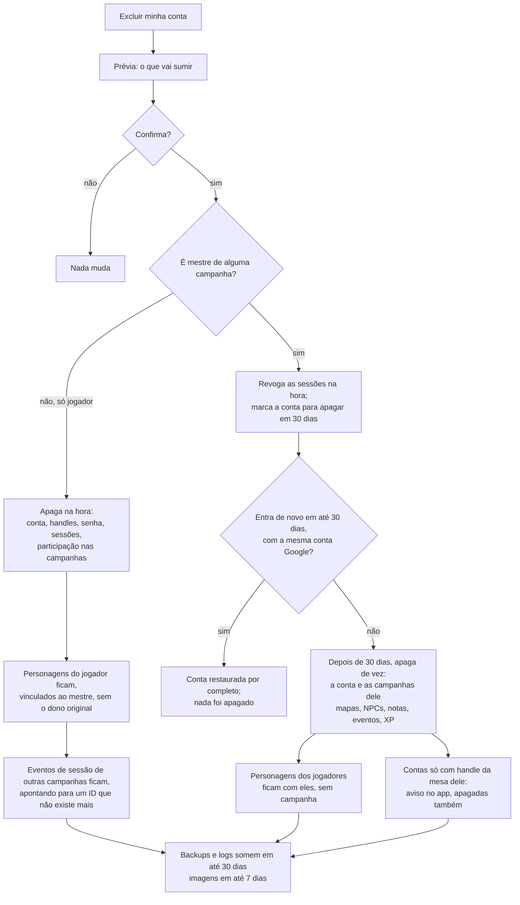

> A versão em inglês ([privacy.md](../privacy.md)) é a canônica.

# Privacidade e proteção de dados

O MeuRPG coleta só o que a mesa precisa para jogar, guarda tudo em São Paulo e trata cada direito do titular como uma funcionalidade. Este documento diz que dados pessoais existem no sistema, por quê, por quanto tempo, e o que todo PR precisa respeitar.

> **Não é parecer jurídico.** É orientação de engenharia, escrita por devs. A decisão completa está na ADR-0010 (repositório privado): "privacidade desde a concepção, LGPD como base e GDPR como régua". Ela ainda é **proposta**, até o Samuel aceitar. O aviso de privacidade para quem usa o app é outro documento, ainda a escrever (roteiro no fim desta página).

## Em resumo

- **A lei que vale é a LGPD** (Lei 13.709/2018). O GDPR europeu hoje não se aplica, porque não oferecemos o app para a União Europeia. Mesmo assim, em cada tema, seguimos a regra mais rigorosa das duas.
- **Somos agente de tratamento de pequeno porte** (Resolução CD/ANPD nº 2/2022). Mesmo dispensados, indicamos um encarregado e publicamos um canal de contato. O Samuel é o controlador, o Vinicius é o encarregado, e o canal é um e-mail só para isso até existir o domínio.
- **O jogador não precisa dar e-mail nem nome real.** (RN-17) O jogador entra por um login anônimo, com o apelido do mestre junto do apelido do jogador, sem conta Google (ver [Regras de negócio](produto/regras.md)). Ainda não construído: hoje toda conta entra com o Google.
- **A base legal é o contrato**, não o consentimento. O app precisa desses dados para funcionar. Segurança e logs usam legítimo interesse.
- **Sem cookies de terceiros, analytics, pixel ou fonte de CDN.** Os únicos cookies são o de sessão e o de login, de vida curta, ambos estritamente necessários, então não há banner.
- **O MVP é para maiores de 18 anos**, por autodeclaração (ver [Menores de idade](#menores-de-idade)).
- **Só a nossa mesa no MVP.** O app não abre para outras mesas nem cobra nada no MVP. Abrir muda o porte do agente de tratamento e a análise do GDPR, então a decisão volta antes disso.

## Checklist de privacidade para PRs

Copie no PR que mexe em dados, logs, telas ou fornecedores:

- [ ] **Logs:** nada de headers, query, body, IP, token, e-mail, handle ou texto livre. O middleware de log registra só método, path, protocolo, status e duração.
- [ ] **URLs:** nenhum segredo nem dado pessoal em path ou query string. Token vai no fragmento (`#t=`). Os logs da plataforma guardam a URL inteira.
- [ ] **GET do Connect:** só ganha `idempotency_level = NO_SIDE_EFFECTS` o método cuja requisição não leva ID nem dado pessoal. No GET, a mensagem inteira vai na URL. Leitura com ID leva `IDEMPOTENT` e fica em POST.
- [ ] **Respostas com dado pessoal** saem com `Cache-Control: no-store`.
- [ ] **Coluna ou tabela nova com dado pessoal:** entrou no [inventário](#inventário-de-dados-pessoais) com finalidade e retenção, e o módulo implementa export e exclusão (o teste de catálogo passa).
- [ ] **Só o necessário:** cada campo novo tem um motivo. Campo opcional diz por que existe.
- [ ] **Texto livre novo:** a tela avisa "é ficção; não escreva dados reais de pessoas". Texto livre nunca vai para `session_events`, logs ou o Jev.
- [ ] **Resposta para jogador:** não inclui notas do mestre (RN-11) nem ponto de interesse escondido (RN-10).
- [ ] **`session_events`:** o payload só tem IDs, números e códigos. Nunca nome, handle ou texto.
- [ ] **Imagens:** só entram pelo envio da galeria (`POST /uploads/images`), que codifica a imagem de novo, sem EXIF, GPS nem outro metadado, e a guarda no nosso armazenamento. Nada de URL de imagem externa. Ver [O que o módulo maps já faz](#o-que-o-módulo-maps-já-faz).
- [ ] **Navegador:** nenhum script, fonte, pixel ou iframe de terceiros.
- [ ] **Sem Web Storage:** nada de `localStorage`, `sessionStorage`, IndexedDB, cookie gravado pelo JavaScript, ou Worker guardando token ou dado pessoal — o único armazenamento no aparelho é o cookie de sessão `__Host-`, `HttpOnly`. `web/src/no-web-storage.spec.ts` confere isso automaticamente.
- [ ] **Fornecedor novo ou dado saindo do servidor:** atualizar a [tabela de operadores](#operadores-e-onde-os-dados-ficam) e abrir a pergunta de contrato e de transferência internacional.
- [ ] **Segredos:** só no Secret Manager. Nada em código, teste ou fixture.
- [ ] **Gatilho de impacto:** respondeu às [perguntas de impacto](#perguntas-de-impacto)? Um "sim" pede uma seção de riscos no PR.

## Inventário de dados pessoais

"Até excluir" quer dizer: até a pessoa excluir a conta ou o item. Depois disso, o dado ainda some dos backups e logs em até 30 dias. As linhas de handle, senha, link de reentrada e log de identidade são do login do jogador sem Google (RN-17), ainda não implementado.

| Dado | Onde fica | Para quê | Base legal | Retenção |
|---|---|---|---|---|
| `sub` do Google (mestre, ou jogador que vinculou o Google) | `user_identities.subject`, com `user_identities.issuer` | Reconhecer a conta no login | Contrato | Até excluir |
| E-mail do Google | `user_identities.email` | Só contato de segurança (incidente, pedido do titular). Nunca aparece para outros usuários. Só é gravado se o provedor diz que foi verificado, e é atualizado ou apagado a cada login | Contrato; legítimo interesse | Até excluir |
| Nome e foto do Google | — | Não coletamos. O nome de exibição é digitado no app | — | — |
| Nome de exibição | `users.display_name` | Mostrar a pessoa aos outros membros das campanhas dela. Digitado no app, de 1 a 40 caracteres; nunca vem do provedor de login | Contrato | Até a pessoa apagar (nome vazio no `UpdateProfile`) ou excluir a conta |
| Preferência de inatividade (tempo sem uso até a exclusão automática) | `users` (coluna a definir) | Aplicar RN-16; a pessoa escolhe o próprio prazo | Contrato | Até a pessoa mudar a preferência ou excluir a conta. Padrão de 1 ano quando a pessoa não escolhe |
| Handle | `table_handles` | Identificar o jogador na mesa | Contrato | Até sair da mesa ou excluir |
| Hash de senha (argon2id), contador de falhas | `password_credentials` | Autenticar; travar tentativas | Contrato; legítimo interesse | Até remover a senha ou excluir |
| Hash do token de sessão, datas, `auth_time` e o último uso | `auth_sessions` (`token_hash`, `created_at`, `expires_at`, `auth_time`, `last_used_at`) | Manter o login; `last_used_at` para terminar a sessão parada por 14 dias; `auth_time` só para auditoria | Contrato | No máximo 30 dias; a linha vencida some pelo TTL do banco em até 1 dia. `last_used_at` é uma hora, gravada no máximo a cada 10 minutos, sem IP nem aparelho; some com a linha |
| Estado do login OIDC (`state` só como hash, `code_verifier`, `nonce`, `return_to` sem fragmento) | `oidc_login_states` | Login com o provedor OIDC | Contrato | 10 minutos; apagado no callback, ou pelo TTL do banco em até 1 hora |
| Intenção de login: o tipo (`campaign_invite`) e o hash do token do convite, nunca o token | `oidc_login_states` (`intent_kind`, `intent_data`) | Aceitar o convite logo depois do login, sem guardar nada no navegador | Contrato | No máximo 10 minutos, com o resto do estado do login: apagado no callback, ou pelo TTL do banco em até 1 hora |
| Convite: hash do token, usos, validade, se exige aprovação (RN-15) e quem criou | `campaign_invites` | Entrar na campanha (RN-07) | Contrato | 30 dias depois de expirar, pelo TTL do banco. O convite vale no máximo 30 dias, então a linha vive no máximo 60. Some antes se a campanha, ou a conta de quem o criou, for excluída |
| Link de reentrada (só hash) | `reentry_links` | Recuperar acesso | Contrato | 30 dias depois de usado ou expirado |
| Log de identidade (reentrada, vínculo e junção de contas) | Banco | Segurança e auditoria | Legítimo interesse | 180 dias, só com UUIDs |
| IP nos limitadores de taxa (o do `/auth/login` e o de toda a API) | Memória | Frear força bruta e abuso | Legítimo interesse | Minutos (o balde de um IP parado some em até 2 minutos) |
| IP, user agent e URL nos logs do Cloud Run | Cloud Logging, São Paulo | Operar e proteger a plataforma | Legítimo interesse | 30 dias |
| `user_id` (UUID da conta), `campaign_id` e outros IDs de jogo, no log da API (sem IP, e-mail nem nome) | Cloud Logging, São Paulo (produção); stdout no ambiente local | Achar a causa de um erro e seguir uma sessão de jogo | Legítimo interesse | 30 dias em produção (padrão do Cloud Logging); ver [Os logs da API](#os-logs-da-api) |
| Membros e papéis (quem, em qual campanha, com qual papel, desde quando, a preferência de dados `dice_preference` (RN-18: "no app" ou "próprios dados", uma escolha de mesa, sem dado pessoal de relevo), e se ainda espera a aprovação do mestre, e até quando, se ainda não criou o personagem) | `campaign_members` | Controlar acesso (RN-05, RN-15) | Contrato | Enquanto a campanha existir; apagado ao excluir a conta. A participação pendente (convite com aprovação) é apagada na hora em que o mestre recusa o personagem. A participação pendente sem personagem é apagada sozinha 30 dias depois de entrar, pelo TTL do banco sobre `pending_expires_at`, em até 1 dia a mais; o mestre também pode removê-la antes. Criar o personagem ou virar membro tira o prazo |
| Nome da campanha, modo de XP e modo de dados (RN-18) | `campaigns` | Jogar. O nome é texto livre: a tela avisa "é ficção; não escreva dados reais de pessoas" | Contrato | Enquanto a campanha existir; apagada quando o mestre que a criou exclui a conta |
| Ficha do personagem: escolhas de jogo e o texto livre dela (nome do personagem, equipamento, idiomas, características e o antecedente "Outro": o nome, a característica e o equipamento que o jogador escreve) | `characters` (`name`, `sheet`) | Jogar. Sem nome real nem e-mail do jogador (PRIV-21) | Contrato | Enquanto o personagem existir: não há exclusão de personagem no fluxo normal (RN-03). A exceção é o personagem pendente de aprovação (RN-15, MR-024): se o mestre o recusa, ele é apagado na hora, com a história e as notas do mestre, porque nunca chegou a fazer parte da campanha. Quando o jogador exclui a conta, fica com a campanha, sem vínculo com a conta (RN-16); quando a campanha é apagada, fica com o jogador. Sem jogador e sem campanha, o TTL do banco apaga a linha em até 1 dia. O NPC some com a conta do mestre |
| História do personagem (personalidade, aparência, história, aliados) | `characters.story` | Jogar | Contrato | A mesma da ficha. Depois da trava da ficha, o jogador corrige quando o mestre libera (RN-01) |
| Notas do mestre | `character_master_notes` | Preparar o jogo; nunca vão para o jogador (RN-11) | Contrato | Enquanto a campanha e o personagem existirem; notas vazias apagam a linha |
| Documento da campanha: o texto livre do mestre (preparação, segredos, links para mapas, fichas e imagens da galeria), quando foi salvo e quem salvou por último | `campaign_documents` (`body`, `updated_at`, `updated_by`) | Preparar o jogo (MR-018). Só o mestre lê e escreve. É texto livre: pode ter dado pessoal, por isso a tela avisa "é ficção; não escreva dados reais de pessoas" | Contrato | Enquanto a campanha existir: apagar a campanha, ou excluir a conta do mestre que a criou, apaga o documento. Excluir a conta de quem salvou por último só desfaz o vínculo (`updated_by` fica vazio); o texto fica com a campanha |
| Sessões de jogo: quando começaram e terminaram, o mapa atual e a imagem mostrada aos jogadores, e se o mestre a deixa com eles | `game_sessions` (`current_map_id`, `shown_image_id`, `shown_image_keep`) | Travar as fichas (RN-01) e a mesa ao vivo: o que a sessão mostra a todos (MR-012, MR-028) | Contrato | Enquanto a campanha existir. Só IDs e horários: nada sobre uma pessoa. Apagar o mapa ou a imagem zera a coluna (`SET NULL`) |
| Imagens que o mestre deixou com os jogadores: só o ID da imagem da galeria, a campanha e quando foi deixada | `campaign_left_images` | Os jogadores continuarem vendo um retrato, uma carta ou uma planta depois que o mestre para de mostrar (MR-028) | Contrato | Até o mestre tirar a imagem da lista ("Tirar"), apagá-la da galeria ou apagar a campanha: a linha some na hora, e a imagem deixa de ser servida ao jogador. A lista vive depois que a sessão acaba, de propósito: é o que o mestre pediu ao "deixar". Só IDs e um horário: nada sobre uma pessoa; o nome da imagem (texto livre do mestre, ver a imagem mostrada) vai ao jogador como legenda |
| O palco: quais NPCs o mestre pôs "em cena" numa sessão, em que ordem e quem fala | `stage_npcs` (IDs, `position`, `speaking`) e os `session_events` `stage_changed` (só IDs) | Mostrar aos jogadores quem está "ali" numa cena de RP (MR-031) | Contrato | Enquanto a sessão existir; fechar ou trocar a cena apaga as linhas na hora. Nada sobre uma pessoa: ficção e IDs. O jogador recebe só o nome e o retrato do NPC, nunca o ID do personagem nem a ficha (RN-20) |
| Imagens da galeria (mapas, retratos, ilustrações), já sem metadados, com o nome (vindo do nome do arquivo, editável) e quem enviou | Os arquivos no blob store: um volume do Docker no ambiente local, um bucket privado do Cloud Storage em São Paulo em produção. A descrição em `gallery_images` | Jogar: mapas e documento da campanha (MR-019) | Contrato | Até o mestre apagar a imagem: a linha e os arquivos somem na hora (no Cloud Storage, o arquivo fica mais 7 dias no soft delete). Quando a campanha é apagada, as linhas somem junto; os arquivos, só quando a exclusão da campanha passar a apagá-los (ver [A definir](#a-definir)) |
| Mapas: o nome, a imagem da galeria, a grade de batalha (quantas colunas), se está revelado e quando | `maps` | Jogar (MR-008, MR-009) | Contrato | Até o mestre apagar o mapa; some com a campanha. O nome é texto livre do mestre, que os jogadores leem depois de revelado |
| Pontos de interesse: tipo, nome, descrição para os jogadores (até 2.000 caracteres), posição, o submapa, se está revelado | `map_points` | Jogar (MR-008, MR-009) | Contrato | Até o mestre apagar o ponto; some com o mapa. Nome e descrição são texto livre do mestre: ficção, que o jogador só lê depois de revelado, ou numa cena de RP que o mestre abriu (o ponto escondido continua escondido no mapa); nunca vão para o log. **Armadilha, tesouro e luz (MR-035, MR-041, MR-036):** o nome e a descrição de uma armadilha ou de um tesouro são o mesmo texto livre do mestre, ficção, que o jogador só lê quando a armadilha lhe foi revelada ou o tesouro foi achado; o resto é número, chave de conteúdo do SRD e IDs (`trap` com as CDs e o efeito, só o mestre lê; o valor em PO; a sessão em que foi achado; os raios da luz); a única duração em texto livre é a de uma condição ("1 hora", até 60 caracteres, uma linha), também do mestre. Nada disso vai para o log nem para `session_events` |
| As camadas pintadas de um mapa (MR-034, MR-036): quatro bitmaps de quadrados (terreno difícil, parede, cobertura, luz) | `map_layers` | O mapa de batalha e a névoa de guerra (MR-034, MR-036) | Contrato | Até o mestre apagar o mapa, ou trocar a grade ou a imagem (que as apaga); somem com o mapa. Só quadrados, nenhum texto nem dado pessoal. O jogador lê parede, terreno e cobertura de um mapa sem névoa, nunca a luz |
| O que cada jogador viu de um mapa com névoa de guerra (MR-036): um bitmap de quadrados por jogador e mapa, a época em que foi feito e quando mudou | `map_vision_memory` | Mostrar ao jogador, escurecido, o que o personagem dele já viu, sem criaturas | Contrato | Só é gravado enquanto os jogadores veem o mapa. Até o mestre limpar ("Esquecer o que foi visto"), trocar a grade ou a imagem do mapa (a época sobe e o que é de época velha lê-se vazio), apagar o mapa, ou apagar a conta do jogador ou a campanha (`CASCADE`). **Hoje não há como um jogador sair da campanha nem ser removido depois de aceito** (só o membro pendente é removido), então não há outro caminho que apague a memória; quando houver, ela deve sair junto, como as anotações. Só quadrados, nenhum texto: é o rastro de onde cada personagem andou. Quem lê o bitmap é o servidor; o jogador recebe só o estado de cada quadrado (o "lembrado" é um deles) e o mestre, em "Ver como", recebe exatamente o mesmo, nunca o bitmap cru |
| Quem conhece uma armadilha e quem achou um tesouro (MR-035, MR-041, RN-10) | `map_point_reveals`, `map_treasure_finders` | Esconder do jogador o que o personagem dele não descobriu; o resumo da sessão | Contrato | Até o mestre apagar a armadilha ou o tesouro; somem com o ponto e com o personagem. Só IDs de ponto e de personagem, uma palavra (`noticed`, `searched`, `master`) e um horário. Os eventos `trap_revealed`, `treasure_found` e `treasure_unfound` levam IDs e o valor em PO, nunca um nome nem um texto |
| O aviso de uma armadilha notada (MR-035, RN-10): a linha `trap_noticed` do histórico (IDs do ponto e dos personagens) e a dica `trap_noticed` do stream (IDs do mapa e do ponto) | `session_events`, stream | Dizer ao jogador que o personagem dele notou a armadilha | Contrato | Some com a sessão. Só o jogador que notou a recebe, na dica e em `ListTrapActivity`; o mestre lê a linha, nunca a dica. Nenhuma CD e nenhum nome de outro jogador |
| O dano que uma armadilha disparada fez a um personagem fora de um combate, até o mestre aplicar ou descartar (MR-035, RN-02) | `trap_damages` | Deixar o mestre decidir o dano num personagem de jogador (RN-02) | Contrato | Some com a sessão ou com o personagem. Só IDs, os dados rolados, o tipo de dano e números; os eventos `trap_noticed`, `trap_searched` (a perícia, a rolagem e os IDs achados), `trap_triggered` e `trap_disarmed` levam IDs e números, nunca um nome nem um texto |
| As ações de uma cena de RP (MR-015): a chave do teste, o nome que o mestre deu (até 60 caracteres, opcional), a CD (opcional), as tentativas por jogador (`max_attempts`), a chave "Mostrar a CD aos jogadores" do ponto (`map_points.show_dc`) e a ordem; a cena aberta na sessão (`game_sessions.open_scene_point_id`) | `scene_actions`, `game_sessions` | Jogar as cenas de RP (MR-015, RN-18, RN-20) | Contrato | Até o mestre apagar a ação; somem com o ponto (`CASCADE`), que some com o mapa. O nome é texto livre do mestre: ficção, nunca vai para o log nem para `session_events`. A CD o mestre sempre recebe, e o jogador só quando a cena a mostra. As rolagens da cena (`scene_check_rolled`) e as tentativas dadas (`scene_attempt_granted`) guardam só IDs e números, e se a cena mostrava a CD na hora; o resumo da sessão as soma, sem guardar nada novo |
| Os "Ganchos e anotações" de uma cena de RP (MR-029): um texto do mestre, Markdown, até 4.000 caracteres, e as pistas que ele prepara (de 1 a 500 caracteres, até 30 por cena), com a ordem | `map_points.hooks`, `scene_clues` | Conduzir a cena (MR-029). **Só o mestre lê**: nenhum jogador, nenhuma resposta nem evento do stream leva os ganchos ou uma pista que não foi revelada a ele (RN-20, `TestRN20_PlayersNeverGetHooksOrUnrevealedClues`). É texto livre: pode ter dado pessoal, por isso a tela mostra o aviso "é ficção; não escreva dados reais de pessoas" (`fiction-notice`) | Contrato | Até o mestre apagar ou editar; somem com o ponto (`CASCADE`), que some com o mapa e com a campanha; os ganchos, as ações e as pistas somem quando o ponto deixa de ser de cena. Nunca entram em log nem em `session_events` |
| As pistas que o mestre revelou a cada jogador (MR-029): a campanha, a pista, a cena, o jogador, o personagem escolhido, **uma cópia do texto** e quando | `scene_clue_reveals` | O jogador ler a pista nas anotações (MR-030): o que foi dito à mesa continua dito, mesmo que o mestre edite ou apague a pista | Contrato | Só o jogador que recebeu e o mestre (que vê a quem revelou) as leem. Apagadas ao excluir a conta do jogador (`CASCADE`) ou a campanha; quando a pista ou a cena é apagada, a cópia fica e perde só o vínculo (`SET NULL`). O evento `clue_revealed` leva só IDs, nunca o texto |
| As cenas que o grupo descobriu (MR-030): a campanha, o ponto e quando | `scene_discoveries` | Deixar o jogador etiquetar uma anotação só com uma cena que ele já viu; o nome de qualquer outra cena nunca chega a ele | Contrato | Some com o ponto ou com a campanha. Só IDs e um horário |
| As anotações particulares do jogador (MR-030): a campanha, o autor, o texto livre (de 1 a 2.000 caracteres, até 300 por campanha) e a etiqueta de cena opcional | `player_notes` | O jogador anotar o que acontece sem sair do app. **Só quem escreveu lê**: nem o mestre, nem outro jogador (`TestMR030_PlayerNotesArePrivate`). É texto livre: pode ter dado pessoal dele ou de terceiros, por isso a tela mostra o aviso "é ficção; não escreva dados reais de pessoas" | Contrato | Até o jogador apagar a anotação; apagadas ao excluir a conta (`CASCADE`, `TestMR030_DeletingTheAccountDeletesTheNotes`) e com a campanha. Hoje não há como sair da campanha como membro ativo; quando houver, as anotações saem com ele. Nunca entram em log, em evento nem em `session_events` |
| Os quebra-cabeças (MR-038, RN-27): o nome, a pista e as dicas (texto livre do mestre, de 80, 500 e 300 caracteres, até 10 dicas), a configuração, a solução e o começo, o "Ao resolver" e o "Ao errar" com os IDs dos alvos, a perícia e a CD da dica, e a informação dividida (até 8 partes de 300 caracteres e o personagem de cada uma); e, por sessão, o estado ao vivo, qual personagem jogou por último e resolveu, cada jogada com o usuário (ID da conta: dado pessoal), o personagem e a chave contra repetição, **o que o jogador digitou** (a resposta do enigma e a mensagem decifrada da cifra, até 600 caracteres, no `move` da jogada e na última jogada da rodada) e cada tentativa de ganhar uma dica por teste (usuário, personagem, d20, bônus e total) | `puzzles`, `puzzle_runs`, `puzzle_moves`, `puzzle_hint_tries` | Fazer, mostrar e resolver os quebra-cabeças ao vivo. **O jogador nunca lê a solução (as respostas do enigma, a sequência antes de tocar, a mensagem em claro e a chave da cifra, a solução da fechadura), o mínimo de jogadas, as dicas que não soltou nem ganhou, a CD da dica, a parte da pista que é de outro jogador, o que outro jogador digitou, nem a ação e o alvo do "Ao resolver" e do "Ao errar"** (RN-10, RN-27, `TestRN10_PlayersNeverReceiveTheAnswer` e `TestRN10_PlayersNeverReceiveWhatTheNewKindsHide`, por lista de chaves): lê o estado, a pista, as dicas soltas e as que ganhou, a parte dele da pista e o nome de quem tem as outras, o nome do personagem que jogou por último, os contadores dele (tentativas, jogadas, tempo), o mural e as ligações dos pilares, os passos da sequência só enquanto o mestre a toca, o nome do ponto de uma armadilha depois de disparada e, resolvido, o texto do "Ao resolver". **O texto digitado é dado do próprio jogador**: o mestre o lê na visão ao vivo ("Toren tentou ..."), e nenhum outro jogador. Texto livre do mestre: ficção | Contrato | Até o mestre apagar a campanha (`CASCADE`); um quebra-cabeça é arquivado, não apagado. As jogadas, com o que foi digitado, e as tentativas de dica ficam enquanto a sessão existir (somem com ela, `CASCADE`); a última jogada de cada rodada, com o texto, é sobrescrita pela jogada seguinte. Excluir a conta tira o ID dela das jogadas e das tentativas (`SET NULL`), mas o texto digitado fica anônimo até a sessão sumir. O histórico da sessão (`puzzle_shown`, `puzzle_solved`, `puzzle_reset`, `puzzle_closed`, e o `trap_triggered` que uma jogada errada dispara) leva só IDs e o que o "Ao resolver" fez: nunca o texto, o estado, a solução nem as jogadas. Nada vai para log |
| O encontro que o mestre guarda num ponto de batalha (MR-043): as criaturas do SRD (chaves) com as quantidades, o nome-base que ele dá a cada grupo de monstros (até 30 caracteres, texto livre do mestre), como os PV são escolhidos e se os monstros começam escondidos | `battle_encounters` | Preparar o combate e "Começar este combate". **Só o mestre lê e escreve** (RN-10): o jogador nunca recebe o encontro, as criaturas, o XP nem a dificuldade (`TestRN10_PlayersNeverGetTheBuilderOrTheSavedEncounter`); as RPCs respondem `not_found` a quem não é o mestre e nenhuma leitura de mapa ou de ponto a toca. É ficção: o nome-base é texto livre, mas sem dado de pessoa (a tela avisa) | Contrato | Até o mestre apagar ou trocar o encontro; some com o ponto, com o mapa ou com a campanha (`CASCADE`). O XP e a dificuldade não ficam guardados. Nada vai para log |
| Tokens: o personagem (ID), a posição, se está escondido, a luz que carrega (a chave de uma predefinição do SRD, `light:torch`) | `map_tokens` | Jogar (MR-012, MR-036) | Contrato | Até o mestre tirar o token; some com o mapa ou com o personagem. Só IDs, números, uma chave de conteúdo e um sim/não. A luz carregada só vai ao mestre e ao dono do personagem |
| PV, espaços de magia, dados de vida e usos dos recursos do personagem de jogador (números: PV atual e temporários, espaços usados por nível, espaços de pacto usados, dados de vida usados, os usos gastos de cada recurso por chave, quando o mestre corrigiu) | `character_vitals` | Jogar (RN-02): o que muda durante a sessão e dura até a próxima | Contrato | Enquanto o personagem existir (a linha some com ele, `CASCADE`). Só números e chaves de conteúdo: nada sobre a pessoa |
| O registro de cada subida de nível guiada (MR-040): a campanha, o personagem, a classe, o nível de antes e o de depois, como os PV foram decididos e quanto valeram, o que o jogador escolheu (incremento no valor de habilidade, subclasse, truques, magias, preparadas, opções, perícias, só chaves de conteúdo) e quando; e o dado de vida que o servidor rolou e guardou até a subida o usar (o resultado) | `character_level_ups`, `character_level_up_rolls` | Mostrar ao mestre "O que mudou" e manter o resultado do dado "no registro" (RN-18, RN-12) | Contrato | Enquanto o personagem existir: a linha some com ele e com a campanha (`CASCADE`); o dado guardado some ao ser usado. Só números e chaves de conteúdo, nenhum texto livre. O mestre lê o nome do personagem e o nome de exibição do jogador na lista, que ele já vê; o jogador não lê o registro |
| As regras da mesa de uma campanha (MR-025, RN-24): a campanha, os PV da subida de nível, os jeitos de fazer habilidades, o crítico, a visibilidade dos testes contra a morte, o combate com ou sem mapa, a névoa dos mapas novos, até 20 regras da casa (texto do mestre, de até 200 caracteres cada) e quando mudou | `campaign_table_rules` | Seguir a escolha da mesa em cada ficha, subida de nível e mapa, e mostrar as regras à mesa na página "Regras da mesa" | Contrato | Até a campanha ser excluída (`CASCADE`). Sem ID de pessoa. As regras da casa são texto livre do mestre (ficção, como o documento da campanha): a tela avisa para não escrever dados reais de pessoas; todo membro ativo as lê |
| Os 4d6 que o servidor rolou, ou que o jogador digitou com dado físico, para a próxima ficha dele (MR-025, RN-24): a campanha, a conta do jogador, os seis jogos de quatro dados, quem rolou (app ou digitado) e quando | `character_ability_rolls` | As habilidades rolados não poderem ser rolados de novo até gostar do resultado (o servidor devolve os mesmos jogos) | Contrato | Até a ficha que os usa ser criada (a linha é apagada na mesma transação); uma linha que ninguém usou some com a campanha ou com a conta (`CASCADE`). Só números e IDs; só o próprio jogador os lê |
| Combates da sessão (MR-013): o nome do combate (texto livre do mestre), quem luta (o personagem e, nos combatentes de jogador, a conta do jogador), a iniciativa rolada (o d20, o bônus e o total), a posição de cada um na grade, o movimento e a economia do turno, o PV das cópias de NPC, se está escondido, os ataques feitos e o bônus de CA do Escudo na vez, e as marcas de RN-22 e RN-03 (as condições, a concentração, os testes contra a morte) | `encounters`, `combatants` | Jogar o combate: a ordem dos turnos, a vez, o movimento na grade (RN-19, RN-20, RN-21) | Contrato | Enquanto a campanha existir: some com a sessão (`CASCADE`), que some com a campanha; o personagem apagado leva o combatente junto. Excluir a conta do jogador tira o vínculo (`user_id` fica vazio, o personagem fica com o mestre, RN-16). O nome do combate e os rótulos ("Goblin 2") são ficção do mestre, nunca vão para o log. A posição e as rolagens são guardadas por sessão, e não dizem nada sobre a pessoa |
| Eventos da sessão: quem fez a mudança (ID da conta), o personagem (ID), a que combate pertence (ID), os números antes e depois, a chave de idempotência e a hora (e, no "Pôr no combate", um hash curto do nome-base, para conferir uma repetição, nunca o nome; num monstro, o que ele gastou da ficha, em chaves e números, em `combatants.monster_state` e no evento, só do mestre) | `session_events` | Histórico da sessão (ADR-0007): auditoria, desfazer e o registro do combate; hoje a correção do mestre (RN-02) e as mudanças do combate (iniciativa, ordem, turnos, movimento, quem some ou entra e, as rolagens: o d20 e os dados do dano, o resultado, o dano e o tipo, os PV de um NPC antes e depois, a economia do turno, as magias (a chave, o nível, o d20 e a resistência de cada alvo), as reações, os testes contra a morte, as condições, a concentração e o desfazer; os prêmios de XP e os marcos, com os IDs, o modo, o total e a parte de cada um, sem o motivo, e as cenas de RP: o ponto aberto ou fechado e, a cada rolagem, a ação (o ID e a chave do teste, como `skill:investigation`), o personagem (ID), o d20, o bônus, o total e se passou da CD, sem a CD, sem nome de ação e sem texto do mestre) | Contrato | Enquanto a campanha existir: some com a sessão, que some com a campanha. Excluir a conta tira o ID dela dos eventos (`SET NULL`). Nunca texto livre nem nome. Num combate num mapa com névoa (MR-036), o payload de um evento de ação com um NPC leva também os IDs das contas dos jogadores que o viam na hora (`seen_by`): só IDs, os mesmos que `actor_user_id` já guarda, e somem com a sessão. **Hoje eles não somem com a conta:** `actor_user_id` vira `NULL` ao excluir a conta, mas os IDs dentro do payload (`seen_by`, `cover_seen_by`) ficam; o fluxo de exclusão de conta da RN-16 (ainda não construído) tem de apagá-los do payload dos eventos |
| O dano de um ataque ou de uma magia que acertou, e a cura (MR-012, MR-014): o ataque (a chave da arma ou da magia), os dados, as faces que o app rolou ou a soma digitada, o total, a quantia que o mestre aplicou, o tipo e o estado, entre dois combatentes | `pending_damages` | Guardar o dano até o mestre aplicar ou descartar, e achar de novo num reenvio ou recarregamento (RN-02) | Contrato | Enquanto o combate existir: some com ele, com a sessão e com a campanha. Só IDs, números e chaves de conteúdo: nada sobre a pessoa |
| O ataque de oportunidade que um movimento ofereceu (MR-034, RN-21): quem andou e o reator (dois combatentes), o quadrado em que saiu do alcance, o estado e os horários | `opportunity_offers` | Esperar a resposta de quem controla o reator, e mandar quem anda de volta ao quadrado se o ataque o leva a 0 PV | Contrato | Enquanto o combate existir: some com ele, com a sessão e com a campanha. Só IDs, quadrados e um estado: nada sobre a pessoa |
| Assinaturas do stream da sessão ao vivo: ID da conta, se é o mestre, a campanha | Memória do servidor | Entregar cada mudança só a quem pode vê-la (ADR-0005) | Contrato | Enquanto o stream está aberto (no máximo 30 minutos); nunca no banco nem no log |
| Histórico de XP (MR-016, RN-09): quem deu (ID da conta), quando, o modo, o motivo (texto livre do mestre, até 120 caracteres), o combate, as PO, o total, quem desfez e quando, a chave de idempotência, a parte de cada personagem (ID, XP, o nível de um marco) e, num "Voltar à cidade", os tesouros convertidos (ID do ponto e PO, sem texto) | `xp_awards`, `xp_award_shares`, `xp_award_treasures` | Dar XP, mostrar o histórico a toda a campanha (todos veem, mestre e jogadores) e desfazer o último prêmio | Contrato | Enquanto a campanha existir: some com ela (`CASCADE`); a parte de um personagem some com ele. Excluir a conta de quem deu ou desfez só tira o vínculo (`SET NULL`). Nada é apagado ao desfazer (ADR-0007). Os marcos planejados (`planned_milestones`) guardam o texto livre que o mestre escreve antes (1 a 120 caracteres, ficção, com o mesmo aviso na tela): só o mestre o lê até o marco ser alcançado, e o texto vira o motivo do prêmio (lido por toda a campanha); some com a campanha (`CASCADE`), nunca vai para `session_events` nem para o log. O motivo é ficção: a tela avisa "é ficção; não escreva dados reais de pessoas", e ele nunca vai para `session_events`, para o log nem para o Jev. O nome de exibição de quem deu aparece no histórico, só para os membros da campanha |
| O XP que um NPC dá (nível de desafio e `xp_value` na ficha; `combatants.xp_value`) | `characters` (`sheet`), `combatants` | Somar o XP dos derrotados no fim do combate (MR-016) | Contrato | Como a ficha e o combate. Só números: nada sobre uma pessoa. Só o mestre os recebe (RN-20) |
| Combatentes | `combatants` | Combate (MR-013) | Contrato | Enquanto a campanha existir |
| As criaturas do personagem (MR-037): o nome que o jogador deu a cada uma (**texto livre**, de 1 a 40 caracteres: "Nanquim"), o tipo de criatura do SRD, de onde veio, o que pode atacar, o grupo da conjuração, os PV, e quando e por que foi dispensada | `character_creatures` (`name`, `monster_key`, `source`, `attack`, `hp_*`, `dismissed_*`) e, no combate, o `label` do combatente | Jogar com o familiar, os animais e os mortos-vivos do personagem | Contrato | Enquanto o personagem ou a campanha existirem; somem com eles (cascata). Uma criatura dispensada continua guardada (para o "Desfazer" do mestre) até lá. O nome é ficção: a tela avisa "não escreva dados reais de pessoas". Só o mestre e o jogador dono leem a lista e o PV; o nome nunca vai ao log nem ao payload de `session_events` (só IDs e chaves de criatura) |
| O conteúdo da mesa (MR-025, RN-23): as classes, subclasses, raças, sub-raças, antecedentes e magias que o mestre cadastra para a campanha: o nome em português (1 a 80 caracteres), os textos e os números da regra (**texto livre do mestre**: descrições, características, equipamento, o gatilho de uma reação), a chave, a revisão e a data de arquivo; e, em cada ficha, a revisão do conteúdo com que foi salva | `campaign_content` (`content_key`, `name_pt`, `data`, `revision`, `archived_at`), `campaign_content_state` e `FullSheet.content_revision` (no JSON da ficha) | Jogar com o material da mesa (a ficha calcula com ele) | Contrato | Enquanto a campanha existir; some com ela (cascata). Nada se apaga antes: o mestre arquiva. É ficção e regra de jogo: a tela do editor avisa "não escreva dados reais de pessoas", como nos outros textos livres. Os membros leem as entradas jogáveis da campanha por inteiro; o mestre também as arquivadas, que nenhum jogador recebe. Nenhum nome nem texto vai ao log: só IDs e chaves, e a contagem de entradas |
| A Forma Selvagem e os olhos do familiar (MR-037, MR-036): a fera em que o druida está e o PV dela, o familiar que o jogador está vendo, se começou num combate e que condições deu; e o token de cada criatura no mapa de exploração (um ID de mapa, um ID de criatura e uma posição) | `character_wild_shapes`, `character_vitals` (`familiar_sight_*`), `map_creature_tokens` | Jogar a forma de fera e a visão do familiar, e mostrar a criatura ao grupo | Contrato | Enquanto o personagem, a criatura ou o mapa existirem; somem com eles (cascata). Só IDs, chaves e números, nada sobre uma pessoa: o nome da criatura nunca vai ao evento. O PV da fera é só do mestre e do jogador dono (RN-20) |
| Backups do banco | Cockroach Labs | Recuperar desastre | Legítimo interesse | 30 dias |
| Cookie de sessão `__Host-meurpg_session` | Aparelho do usuário | Manter o login | Estritamente necessário | Até o logout, que apaga a sessão no servidor, ou 14 dias sem uso, ou 30 dias. "Sair dos outros dispositivos" (perfil) apaga as outras sessões na hora |
| Cookie de login `__Host-meurpg_login` (o `state`) | Aparelho do usuário | Amarrar o login ao navegador que o começou (contra login CSRF) | Estritamente necessário | 10 minutos; apagado no callback |

**O app novo (`web/`) não guarda nada no navegador além desses dois cookies**, os dois `HttpOnly` e nunca lidos pelo JavaScript da página. Nada de `localStorage`, `sessionStorage`, IndexedDB, cookie gravado pelo JavaScript, ou Worker guardando token ou dado pessoal, sem exceção, com uma trava automática (`web/src/no-web-storage.spec.ts`) que varre o código-fonte atrás dessas APIs. Ver [Arquitetura](../architecture.md#nothing-in-the-browser-besides-the-session-cookie).

**No app antigo (descontinuado)**, `users.name` era guardado, e havia duas colunas sem finalidade: `characters.email` e `sheet.playerName`. Não há migração de dados: as três simplesmente não existem no schema novo (ver [Modelo de dados](../data.md)). No app antigo, mapas ficavam em base64 no banco, e galeria e campanhas ficavam no `localStorage`.

**Bug do app antigo (descontinuado):** o logout e o "Excluir conta" chamavam rotas que não existiam no NestJS (`POST /api/auth/logout` e `DELETE /api/auth/account`). O logout só limpava o navegador, e o token continuava válido no servidor até expirar. A exclusão falhava, então o direito de eliminação (art. 18, VI) não funcionava lá. Ele não é corrigido no app antigo — o sistema novo implementa os dois desde o primeiro deploy com login e prova com teste automático.

### Os logs da API

Os logs da API guardam o `user_id` (um UUID de conta, pseudônimo) e IDs de jogo, e nada que identifique a pessoa por si só. Cada linha tem `request_id`, `user_id` e `campaign_id` quando existem, e as linhas de `rpc`, de stream e de evento dizem o que foi feito, só com IDs e enums (ver [Arquitetura](../architecture.md#logs)).

| Dado no log | Por quê | Retenção |
| --- | --- | --- |
| `user_id` (UUID da conta) | Seguir uma sessão de jogo e achar a causa de um erro. É dado pessoal pseudônimo: só vira uma pessoa com o banco, e some do banco com a conta | A do log: em produção, o padrão do Cloud Logging (30 dias no bucket `_Default`); no ELK de ensaio, a que está em [Operação](../operations.md) |
| `campaign_id`, `session_id`, `character_id` e outros IDs | O mesmo | A do log |
| `request_id` | Juntar as linhas de uma requisição; volta ao navegador no header `X-Request-Id` | A do log |
| Caminho da requisição e código do resultado | Operar o serviço | A do log |

O que **não** está nos logs da API: o IP, o user agent, cookies e headers, a query da URL, e-mail, qualquer nome (de exibição, de personagem, de NPC, de campanha), qualquer texto digitado (documentos, notas, pistas, *prompts*, entradas de conteúdo) e corpo de requisição ou de resposta. Uma trava no *handler* descarta os atributos com nomes como `email`, `token`, `name` ou `text` (a lista está na [Arquitetura](../architecture.md#what-never-goes-in-the-log)). O IP e o user agent aparecem só no log de requisições que o próprio Cloud Run escreve, a linha da tabela acima sobre o Cloud Run.

Ao excluir a conta, os logs não são reescritos: o `user_id` deles deixa de apontar para alguém quando a conta some do banco, e a linha vence na retenção. Um log nunca é fonte para responder a um pedido do titular.

### O que o módulo identity já faz

O login do mestre (`backend/internal/identity`) cumpre assim os itens desta página:

- **Escopo `openid email`.** Nome e foto nunca são pedidos nem gravados, mesmo quando o provedor manda.
- **Logs sem dado pessoal.** Um login que falha registra só um motivo (`state_mismatch`, `invalid_id_token`...). Token, `code`, `state`, cookie, e-mail, `sub`, ID da conta e IP nunca vão para o log. Um teste confere isso.
- **`GetMe` devolve só o ID da conta** e a hora em que a sessão acaba. A requisição é vazia, então o GET do Connect não põe dado pessoal na URL.
- **Respostas sem cache.** `GetMe`, `SignOut`, `SignOutOtherSessions`, `CountOtherSessions` e as rotas `/auth/*` saem com `Cache-Control: no-store`; as rotas `/auth/*` também com `Referrer-Policy: no-referrer`.
- **Excluir a conta** apaga identidades e sessões junto, por `ON DELETE CASCADE`.
- **Os limites de taxa da API.** O limite por IP de toda a API (`platform/ratelimit`, [Arquitetura](../architecture.md#abuse-limits)) guarda o IP do cliente só na memória da instância, como o do login, e nunca no banco nem no log; as recusas viram uma linha `WARN` com o nome do limite e, para os limites por usuário, o `user_id` que já está em toda linha, nunca com o IP. A lista `CAMPAIGN_CREATORS` (e-mails de quem pode criar campanhas) é configuração do servidor e não vai para o log; o e-mail verificado de cada conta continua só na tabela de identidades (RN-30).
- **Limite de tentativas no `/auth/login`.** Para contar as tentativas, o servidor guarda o IP do cliente (o prefixo `/64`, no IPv6) só na memória da instância, nunca no banco nem no log. É a linha "IP nos limitadores de taxa" do inventário: some em até 2 minutos depois da última tentativa, ou quando a instância para.
- **Usuários de teste do devidp** (o provedor OIDC de desenvolvimento, ver [CONTRIBUTING.md](../../CONTRIBUTING.md#local-sign-in-with-the-devidp)) são fictícios, com e-mails em `example.com`. Ele não existe em produção, então nenhum dado real passa por ele.

### O que o módulo campaigns já faz

O módulo `campaigns` (`backend/internal/campaigns`) e o nome de exibição do `identity` cumprem assim os itens desta página:

- **Nome de exibição digitado.** `users.display_name` nasce vazio e só muda pelo `UpdateProfile`. O nome que o provedor de login manda nunca é gravado (um teste confere com um provedor falso que manda nome). Nome vazio apaga, o que atende a correção e a eliminação (art. 18, III e VI).
- **O `GetMe` não devolve o e-mail.** O e-mail verificado continua só como contato de segurança, em `user_identities`, e não sai em nenhuma resposta.
- **O convite só existe como hash no banco.** O token vai no fragmento da URL (`/invite#t=...`), e o app manda no corpo do `AcceptInvite`, nunca numa query string. Um teste confere que a linha do convite não contém o token.
- **Convite aceito pelo login, sem nada no navegador.** Quem abre o convite sem estar logado manda o token no corpo do `POST /auth/login`. O servidor guarda só o hash, dentro do estado do login (no máximo 10 minutos, uso único), e o app não usa `localStorage`, `sessionStorage` nem service worker para isso. O `GET /auth/login` recusa o token na URL, e o `return_to` perde o fragmento. `TestSignInWithAnInviteJoinsTheCampaign` lê a linha de `oidc_login_states` e confere que nenhuma coluna tem o token; os testes de log conferem que nem o token nem o hash vão para o log.
- **Sem GET com dado na URL.** Só o `ListMyCampaigns`, cuja requisição é vazia, aceita GET. As outras chamadas levam o ID da campanha e ficam em POST.
- **Respostas sem cache.** Toda resposta do `CampaignService`, inclusive erro, sai com `Cache-Control: no-store`.
- **Quem não é membro não descobre a campanha.** A resposta é `not_found`, igual à de uma campanha que não existe (ADR-0011).
- **Logs sem dado pessoal.** O módulo só registra falhas do banco, com a mensagem de erro do driver, que não traz os valores da linha. Nome, token e IDs nunca são passados ao log.
- **Excluir a conta** apaga a participação nas campanhas; para o mestre, apaga também as campanhas que ele criou, com os membros e os convites (`ON DELETE CASCADE`). `TestDeletingAnAccount` confere.
- **O documento da campanha só sai para o mestre** (MR-018). O jogador recebe `permission_denied`; quem não é membro e o membro pendente, `not_found` (`TestMR018_PlayersCannotReadTheDocument`). É texto livre, como as notas do mestre: pode ter dado pessoal de alguém, então a tela do documento avisa "é ficção; não escreva dados reais de pessoas". O texto nunca vai para o log, e um erro de validação diz o campo, nunca o texto. Ele some com a campanha; excluir a conta de quem o salvou por último mantém o texto e apaga o vínculo com a conta (`TestCampaignDocumentGoesWithTheCampaign`). Os links do texto só levam IDs: o app abre cada um pelas chamadas de sempre, com a autorização de cada uma, e a imagem só vem da galeria (`image:<id>`), nunca de uma URL externa.
- **Membro pendente vê só o nome da campanha** (RN-15, MR-024). Quem aceitou um convite com aprovação não vê os membros, os convites nem os personagens dos outros: só o nome da campanha e o próprio personagem, até o mestre aprovar. Recusado, a participação pendente é apagada na hora (`TestMR024_MasterRejectsAndThePlayerStaysOut`).

### O que o módulo characters já faz

O módulo `characters` (`backend/internal/characters`) e o começo do `play` cumprem assim os itens desta página:

- **Sem dado real do jogador na ficha.** Não há campo de nome do jogador nem de e-mail (PRIV-21); o nome que aparece ao lado do personagem é o nome de exibição do `identity`. Todo o texto livre (nome do personagem, equipamento, história) é ficção, e a tela avisa "é ficção; não escreva dados reais de pessoas".
- **As notas do mestre nunca chegam ao jogador.** Ficam numa tabela à parte e só saem pelas chamadas do mestre. `TestRN11_PlayersNeverReceiveMasterNotes` confere cada resposta que o jogador pode pedir.
- **O jogador só vê os próprios personagens.** O de outro jogador e os NPCs são `not_found` para ele, com a mesma mensagem de um personagem que não existe. O membro pendente (RN-15) vê só o próprio personagem pendente.
- **Personagem recusado some na hora.** Quando o mestre recusa um personagem pendente (MR-024), o `RejectCharacter` apaga, na mesma transação, o personagem (ficha, história e notas do mestre sobre ele) e a participação pendente do jogador: o personagem nunca fez parte da campanha, então não há finalidade para guardá-lo. `TestMR024_MasterRejectsAndThePlayerStaysOut` confere que não sobra nenhuma linha.
- **Sem GET com dado na URL e sem cache.** Toda leitura leva um ID, então fica em POST (`IDEMPOTENT`), e toda resposta, inclusive erro, sai com `Cache-Control: no-store`.
- **Logs e erros sem texto livre.** O módulo só registra falhas do banco. Um erro de validação diz o campo, nunca o que foi digitado (`TestUpdateCharacterValidation`), e uma ficha guardada que não abre gera um erro sem o conteúdo dela.
- **Correção da história.** O jogador edita a história enquanto o personagem é rascunho; depois da trava, quando o mestre libera (RN-01). O pedido de correção fora disso vai pelo canal do encarregado.
- **Excluir a conta.** As chaves estrangeiras já fazem a parte dos personagens: `player_user_id` usa `ON DELETE SET NULL` e o NPC vai junto com a conta do mestre (`CASCADE`); `TestRN16_DeletingAccountsKeepsPlayerCharacters` confere. O personagem de jogador que fica sem jogador e sem campanha é apagado pelo TTL do banco (`TestOrphanedPlayerCharactersAreDeletedByTheDatabase`).
- **Ainda não existe:** o export (`ExportMyData`) e a prévia da exclusão com a escolha de apagar os próprios personagens. Vêm com o `PrivacyService`.

### O que a sessão ao vivo já faz

A sessão ao vivo do `play` (ver [Arquitetura](../architecture.md#live-session)) cumpre assim os itens desta página:

- **O aviso não abre conexão.** `ListOpenGameSessions` tem a requisição vazia, então aceita GET sem pôr dado na URL; a resposta leva o nome das campanhas da própria pessoa e sai com `Cache-Control: no-store`.
- **O jogador só vê os números do próprio personagem.** O filtro roda no servidor, na foto (`GetLiveSession`) e no stream: cada evento leva a audiência, e o hub só o entrega a ela (`TestPlayersSeeOnlyTheirOwnVitals`). As notas do mestre nunca saem pela sessão ao vivo (`TestRN11_LiveSessionNeverCarriesMasterNotes`).
- **As rolagens de uma cena de RP ficam em `session_events`, só com números** (MR-015): `scene_check_rolled` guarda o ID do ponto e da ação, a chave do teste, o d20, o bônus, o total e, quando a ação tinha CD, `passed`; o nome que o mestre deu à ação ("Convencer o guarda") e a CD são do mestre e não entram no histórico. O jogador recebe só as próprias rolagens, sem `passed` nem CD (RN-20). O nome da ação e a descrição do ponto são texto livre do mestre, ficção como o resto do mapa (`scene_actions.name`, até 60 caracteres, sem dado pessoal; o aviso "é ficção" já vale para o campo). Nenhum dado pessoal novo, nenhum fornecedor novo.
- **Revelar uma pista é um evento só com IDs** (MR-029): `clue_revealed` guarda o ID da pista, o da cena e os dos personagens que a receberam agora, nunca o texto da pista nem um nome. O aviso `notes_changed` vai só aos jogadores que a receberam e não leva nada; o app lê as anotações de novo (`TestMR029_ARevealedClueReachesOnlyTheChosenPlayers`).
- **`session_events` só com IDs e números.** O payload guarda os PV, espaços e dados de vida antes e depois, e, no combate, os IDs de combate e números (a rodada, o d20, as faces e o dano, o quadrado, os pés andados) e chaves de conteúdo (a arma, a ação, o tipo de dano), sem nome nem texto: o nome de uma arma ou de um combatente o registro do combate lê da ficha na hora de responder, e quem ele mostra a cada um é decidido no servidor (RN-20); o teste da RN-11 confere que nenhum evento carrega texto do personagem.
- **O stream não guarda nada.** As assinaturas ficam na memória do servidor só enquanto o stream está aberto, e o log registra uma linha por stream, quando ele termina, com o caminho e a duração, como toda requisição (e, em `debug`, `stream opened` e `stream closed`, com a campanha, as mensagens enviadas e o motivo do fim; ver [Os logs da API](#os-logs-da-api)).
- **Quem sai deixa de receber.** A cada 60 segundos o stream confere de novo a sessão de login e a participação; logout, sessão revogada ou saída da campanha terminam o stream (`TestWatchGameSessionChecksAgain`).

### O que o módulo maps já faz

A galeria (`backend/internal/maps`, MR-019) cumpre assim os itens desta página:

- **Nenhum metadado é guardado.** O servidor decodifica cada imagem enviada e a codifica de novo a partir dos pixels, então EXIF (com a posição do GPS, o modelo do celular e a data), XMP, perfis ICC, os textos de um PNG e qualquer coisa escondida depois da imagem ficam para trás. O arquivo original nunca é gravado. Os testes montam um JPEG com EXIF e GPS, um PNG com `tEXt` e `eXIf` e um WebP com um bloco EXIF, e conferem que o arquivo guardado não tem nada disso (`TestProcessRemoves*`, no `maps/images`, e `TestMR019_MasterUploadsAnImageWithoutItsMetadata`).
- **Onde ficam.** No ambiente local, num volume do Docker; em produção, num bucket privado do Cloud Storage em São Paulo, sem URL pública: só a API lê o bucket, e entrega a imagem a quem pode vê-la.
- **Quem vê.** A galeria (a lista) é só do mestre, e o mestre baixa toda imagem da campanha. O jogador baixa uma imagem só enquanto a vê: o fundo de um mapa que ele vê, ou a imagem que o mestre mostra na sessão, ou uma imagem que o mestre deixou com os jogadores (RN-10, MR-028), ou o retrato de um NPC enquanto ele está no palco da cena aberta (MR-031): o retrato de um NPC é uma imagem da galeria como as outras (o ID fica no JSON da ficha do NPC, que o jogador nunca lê) e some para o jogador, com `404`, no instante em que o mestre tira o NPC de cena, fecha a cena ou encerra a sessão. Apagar a imagem limpa o retrato da ficha. Guardar o ID não basta: a rota confere a cada pedido, e responde `404` depois que o mapa é escondido de novo, a imagem para de ser mostrada sem ter sido deixada, ou o mestre a tira da lista. Quem não é membro ativo recebe `404`, igual a uma imagem que não existe.
- **As peças da imagem de um mapa com névoa são pessoais (MR-036, RN-10).** O jogador nunca recebe a imagem inteira de um mapa com névoa: recebe peças de 16 × 16 quadrados, cada uma com os pixels dos quadrados que ele viu ou lembra e preto opaco no resto (nunca alfa baixo; o PNG é escrito só dos pixels, sem metadado). A garantia é a do teste `TestRN10_TileOracle`: duas imagens que só diferem em quadrados que o jogador não conhece dão a ele peças idênticas byte a byte. Para isso o servidor encolhe a imagem quadrado por quadrado e escurece, do lado conhecido, 1 pixel de cada borda com um quadrado desconhecido (PNG) ou todo bloco de 16 × 16 pixels que toca um quadrado desconhecido (JPEG): num mapa JPEG a borda da névoa fica mais escura, até um bloco. Uma peça sai com `Cache-Control: private, no-cache`, `ETag` e `Vary: Cookie`, como a imagem de um jogador: o navegador pergunta a cada uso e recebe `404` quando o jogador perde o mapa; nenhum proxy guarda. No servidor, as peças ficam só na memória (cópia de trabalho da imagem, cache de peças e as peças que cada jogador tem, sem disco nem banco), com a chave da imagem, da grade, da peça e dos quadrados conhecidos em volta, nunca do usuário: não são dado pessoal, e dois jogadores com a mesma visão de uma peça dividem a mesma peça. Não entra dado novo no inventário. Testes: `TestRN10_TileOracle`, `TestRN10_TilesCarryOnlyWhatThePlayerSaw`, `TestRN10_TileAuthorization`.
- **Cache só no aparelho.** A imagem sai com `Cache-Control: private`: nenhum proxy guarda. O navegador do mestre guarda uma cópia por um ano (os bytes de um ID nunca mudam); o do jogador guarda, mas pergunta de novo a cada uso (`no-cache`), então para de mostrar a imagem assim que ela deixa de estar visível para ele. `Vary: Cookie` impede que, num navegador usado por duas pessoas, a cópia de uma responda pela outra. Continua fora do nosso alcance o que já foi desenhado na tela, salvo ou fotografado.
- **Apagar** tira a linha e os arquivos na hora. No Cloud Storage, o soft delete guarda o arquivo por mais 7 dias, dentro do prazo de 30 dias desta página.
- **Logs sem dado pessoal.** O nome do arquivo e o nome da imagem nunca vão para o log, e os logs do módulo não levam IDs: os erros do armazenamento saem sem o caminho do arquivo. O ID da imagem aparece no caminho `/images/<id>` do log de requisições (e nos logs da plataforma), como qualquer URL: é um UUID aleatório, que não diz nada sobre ninguém nem dá acesso à imagem, porque a sessão e a participação na campanha são conferidas a cada pedido.
- **Uma imagem pode ser a foto de uma pessoa.** Por isso, ao lado de todo "Enviar imagem" (a galeria, a galeria vazia e o seletor de imagem), a tela avisa, como no texto livre: "Use imagens do jogo. Não envie fotos de pessoas sem a autorização delas." (`ImagePrivacyNote`, em `web/src/app/shared/gallery-picker/`).
- **Ainda não existe:** apagar os arquivos quando a campanha é apagada (hoje só acontece pela exclusão da conta do mestre, e só as linhas somem). A exclusão da campanha ou da conta precisa apagar o prefixo `campaigns/<id>/` do armazenamento; entra com o `PrivacyService`.

Os mapas (MR-008, MR-009, MR-012) e o que a sessão mostra (o mapa atual e a imagem mostrada, MR-028) cumprem assim:

- **Texto livre só do mestre, e ficção.** O nome do mapa, o nome e a descrição de cada ponto são escritos pelo mestre para os jogadores lerem. Nunca vão para o log, e as mensagens de erro dizem a regra, nunca o texto. O aviso na tela é o mesmo do resto: "é ficção; não escreva dados reais de pessoas".
- **Quem vê o quê é decidido no servidor (RN-10).** O jogador só recebe o mapa revelado (ou o mapa atual da sessão), os pontos revelados e os tokens visíveis; o que ele não vê fica de fora da resposta, sem ID, nome ou descrição (`TestMR009_PlayersNeverReceiveHiddenPoints`). O nome da imagem da galeria de um mapa vai só ao mestre.
- **O token mostra o personagem a quem o vê.** O jogador recebe o nome e o ID de cada personagem cujo token está visível para ele, também os dos outros jogadores e os NPCs revelados; é o que a mesa vê na mesa. O ID não abre nada: a ficha de outro personagem continua `not_found` para ele. Nada da ficha, nem as notas do mestre, vai no token.
- **A imagem mostrada vai com o nome, como legenda.** O nome vem do nome do arquivo enviado, então pode trazer uma anotação do mestre; o mestre pode renomear antes de mostrar. O jogador só recebe o ID da imagem, e só baixa a imagem, enquanto ela está mostrada ou enquanto o mestre a deixa com os jogadores, a escolha dele com o interruptor "Deixar com os jogadores" (a lista `campaign_left_images` guarda só IDs, e o mestre tira cada imagem quando quiser). O navegador dele pergunta de novo a cada uso, e a rota responde `404` depois.
- **Os eventos do stream só levam IDs e posições.** `map_changed` leva só o ID do mapa (o app lê o mapa de novo, filtrado), `token_moved` o ID do personagem e a posição, `current_map_changed` o ID do mapa; `shown_image_changed` leva a imagem mostrada, que todos os membros da sessão podem ver, e `left_images_changed` não leva nada (o app lê a lista de novo). Uma mudança só em coisas escondidas vai só ao mestre.

## Direitos do titular e como atendemos

Quase tudo é autoatendimento, dentro do app e logado. A sessão já prova quem é a pessoa. O que não for autoatendimento é respondido em até **15 dias corridos**, pelo canal do encarregado.

| Direito | LGPD | Como | API (esboço) |
|---|---|---|---|
| Confirmação e acesso | Art. 18, I e II | Tela "Meus dados", download em JSON | `PrivacyService.ExportMyData` |
| Portabilidade | Art. 18, V | O mesmo JSON, com versão de schema | `PrivacyService.ExportMyData` |
| Correção | Art. 18, III | Editar nome de exibição e handle. A história do personagem, depois da trava da ficha (RN-01), o jogador corrige quando o mestre libera; se o mestre não liberar, o pedido vai pelo canal do encarregado, no prazo de 15 dias | `IdentityService.UpdateProfile` |
| Eliminação | Art. 18, VI | "Excluir minha conta", com prévia do que some | `PrivacyService.PreviewAccountDeletion`, `PrivacyService.DeleteMyAccount` |
| Com quem compartilhamos | Art. 18, VII | Lista de operadores no aviso de privacidade | — |
| Oposição, dúvidas, outros pedidos | Art. 18, §2º | Canal do encarregado; depois, um formulário no app | `PrivacyService.SubmitPrivacyRequest` |
| Revogar consentimento | Art. 18, IX | Nada depende de consentimento hoje. Recurso opcional futuro terá botão de desligar | — |

**Jogador que perdeu o acesso** (conta só com handle): pede um link de reentrada ao mestre e faz o pedido logado. Se o mestre não puder ajudar, escreve ao canal do encarregado.

### Excluir a conta

**Ainda não construído:** não há chamada nem tela para excluir uma conta ou exportar dados; só existem as cascatas do banco. O fluxo abaixo é o desenho.

Jogador e mestre têm tratamentos diferentes (RN-16).

- **Jogador:** a exclusão é imediata e definitiva. Conta, handles, senha, sessões e participação nas campanhas somem na hora. Os personagens dele **não são apagados**: ficam vinculados ao mestre da campanha, sem o dono original (ver a tensão com a identidade, abaixo).
- **Mestre:** a conta entra em espera. As sessões são revogadas na hora — ninguém consegue mais usar a conta —, mas a linha da conta em si (o par `issuer`/`subject` do provedor de login, ver [Modelo de dados](../data.md)) só é apagada de vez depois de **30 dias**. Se o mestre entrar de novo com a **mesma conta Google** dentro desses 30 dias, a conta é restaurada por completo: nada foi perdido. Passados os 30 dias sem esse retorno, tudo é apagado: a conta e as campanhas dele (mapas, NPCs, notas, eventos, XP).
- **Em qualquer exclusão**, o que resta (contas de mesa órfãs, backups, logs, imagens) some por completo até 30 dias depois da exclusão de fato.
- **Inatividade:** cada pessoa escolhe no próprio perfil quanto tempo de inatividade leva à exclusão automática da conta; o padrão é 1 ano.

Os personagens já seguem esse desenho no banco. E um personagem de jogador que fica sem jogador e sem campanha — o jogador excluiu a conta e a campanha foi apagada, em qualquer ordem — é apagado pelo TTL do banco em até 1 dia: ninguém mais o alcança, e guardar o texto livre dele não teria finalidade (ver [Modelo de dados](../data.md#tables-by-module)).

Por isso os eventos da sessão guardam só IDs: quando a dona dos dados some, o evento fica anônimo sem ninguém editar o histórico. A espera de 30 dias do mestre usa uma marca de "apagar em" na conta, conferida no login, em vez da exclusão imediata da linha.

### A tensão entre manter o personagem e apagar a identidade

Manter o personagem de um jogador excluído vinculado ao mestre (RN-16) não pode virar um jeito de manter a identidade dessa pessoa depois que ela pediu para sumir. O vínculo com a conta apagada é removido — a linha de `users` e `user_identities` some, como em qualquer exclusão —, mas o personagem em si tem campos de texto livre (história, aparência, personalidade, citações, aliados) que a própria pessoa escreveu, e que podem conter dado pessoal dela ou de terceiros, mesmo com o aviso de "é ficção; não escreva dados reais de pessoas".

Como é tratado:

1. Na exclusão, o personagem passa a pertencer ao mestre da campanha: dono anterior desvinculado, sem nenhum identificador que aponte de volta à conta apagada.
2. Antes de confirmar a exclusão, a tela avisa: "seus personagens continuam na(s) campanha(s), com o mestre; você pode apagá-los agora, se preferir".
3. Se a pessoa escolher apagar em vez de deixar com o mestre, o personagem (inclusive o texto livre) some como qualquer outro dado dela.
4. O texto livre que ficar com o mestre não é filtrado nem redigido automaticamente: é conteúdo de jogo, e o mestre passa a ser quem decide o que fazer com ele, do mesmo jeito que decide sobre um NPC. Isso é uma escolha de produto, não uma garantia jurídica de que não sobra dado pessoal — por isso fica como pergunta ao advogado (ver [A definir](#a-definir)).

Ver [ADR-0010](../adr/0010-privacidade-lgpd-gdpr.md), seção 4.3.

## Operadores e onde os dados ficam

Os dados ficam em São Paulo (`southamerica-east1`). O acesso de um fornecedor de fora do Brasil ainda conta como transferência internacional, então cada operador precisa de contrato e de um mecanismo de transferência (Resolução CD/ANPD nº 19/2024).

| Fornecedor | O que faz | Dados | Contrato LGPD |
|---|---|---|---|
| Google Cloud | Cloud Run, Cloud Logging, Cloud Storage, Secret Manager | Tudo, em São Paulo | Data Processing Addendum com as cláusulas-padrão brasileiras |
| Cockroach Labs | Banco CockroachDB gerenciado, no Google Cloud em São Paulo | O banco e os backups | **A definir:** o contrato atual cobre o GDPR |
| Google (login) | Sign in with Google | O Google é controlador da própria conta; nós recebemos só `sub` e e-mail | Não é nosso operador |
| Render | App antigo (descontinuado): NestJS. O `server/` será removido do repositório (ver [App antigo](../legacy-app.md)) | O que passava pela API do app antigo | **Lacuna temporária.** Acaba quando `server/` for removido |
| GitHub Pages | App antigo (descontinuado): Angular, mantido em `src/` só como referência até sair num PR à parte | IP de quem visita | **Lacuna temporária.** Acaba quando `src/` for removido |
| Google (API do Gemini) | Gera as imagens que o mestre pede (MR-039, RN-28, ADR-0019), com uma chave do AI Studio, pelo servidor | O texto que o mestre escreve, o estilo, as imagens da galeria que ele escolhe como referência e, num ajuste, a imagem anterior. Nunca nome de pessoa, e-mail nem ficha. O Google pode guardar os dados por pouco tempo, ou em cache, **em qualquer país**: conta como transferência internacional | [Termos dos serviços pagos da API do Gemini](https://ai.google.dev/gemini-api/terms) (Paid Services; nenhum modelo de imagem tem nível gratuito). **A definir:** o cadastro como operador e o mecanismo de transferência (Resolução CD/ANPD nº 19/2024) |
| Cloudflare Workers AI | Jev, depois do MVP | Só contexto de jogo, sem dado pessoal | **A definir** antes do Jev |
| Have I Been Pwned | Checa se a senha nova já vazou | 5 caracteres do hash da senha, saindo do servidor. Não identifica ninguém | Não é operador |

### O banco do app antigo

O CockroachDB do app antigo (usado pelo NestJS) pode ser apagado. Não é o mesmo banco do sistema novo — é um cluster à parte, que só precisa ser descomissionado. Antes de apagar, uma tarefa única importa só os personagens de lá para o banco novo (ver [Modelo de dados](../data.md)); o resto (campanhas, mapas e sessões do app antigo, se existirem) não é importado. Depois de descomissionado, os backups dele somem no prazo do provedor (30 dias). Isso é uma tarefa do [roadmap](../roadmap.md) (Etapa 11); falta só a data.

### O que as imagens geradas mandam ao Google (MR-039, RN-28)

- **O que vai:** o texto que o mestre escreve (como ele escreveu), o estilo, a proporção, as imagens da galeria que ele escolhe como referência (já recodificadas, sem metadado, ADR-0012) e, num ajuste, a imagem anterior com o texto da primeira imagem e os ajustes já feitos. **O que nunca vai:** nome de pessoa, e-mail, ficha, nome de jogador, ID. O servidor não acrescenta nada disso (o pedido não tem campo para eles) e um teste confere o corpo. O texto livre é do mestre e vai como ele escreveu: a tela avisa o que vai ("Não escreva nomes de pessoas") e lembra que uma foto de pessoa não deve ir como referência, como no envio de imagens.
- **O que vai em cada jeito de um mapa.** Além do que está acima (o texto, o estilo, a proporção, as referências e os retratos dos NPCs marcados), vai o **desenho de referência**, feito pelo servidor das camadas do mapa, nunca da imagem que o mestre enviou (ela pode mostrar uma porta secreta ou um inimigo escondido pintados):

  | Jeito | O desenho | A lista das salas |
  | --- | --- | --- |
  | Arte da cena (de um mapa) e vista isométrica | Só chão e paredes dos quadrados que os personagens dos jogadores veem agora, com o resto em preto (os quadrados são cortados ao retângulo do que se vê), um disco azul por personagem de jogador e um vermelho por NPC que eles veem, e a porta secreta não revelada como parede. Sem porta, sem número, sem nome, sem token escondido, sem ponto, armadilha nem tesouro | Não |
  | Mapa com textura | O mapa inteiro, só chão e paredes, a porta secreta como parede, completado com rocha até a proporção do modelo; sem criaturas | Só de uma masmorra gerada: "Sala 3: 7 x 5 squares" (o número e o tamanho de cada sala, mais nada) |

  Os retratos de NPCs só vão na arte da cena e na vista isométrica (o mapa com textura não leva nenhum), e são só os dos NPCs que os jogadores veem agora; o retrato de um NPC do mapa que eles não veem é recusado também como imagem de personagem. O nome do NPC e o do personagem de um jogador nunca vão (o texto da chamada não tem campo para eles; `TestMR039_TheSceneArtAndTheIsometricViewOfAMap` confere o texto), e o desenho não fica guardado em lugar nenhum: é refeito a cada pedido. O que o app mostra ao mestre antes de pedir (o desenho em miniatura e a lista de NPCs) é só dele.
- **O que a tela diz.** O diálogo "Gerar imagem" diz, embaixo de cada campo, o que vai ao Google: o texto e as imagens de referência ("Não escreva nomes de pessoas."; "Não use foto de pessoa."), o estilo, a proporção e, num ajuste, a imagem anterior e o pedido de antes (a tela diz isso embaixo do campo do ajuste: "O ajuste que você escrever vai ao Google, junto com a imagem anterior e o seu pedido de antes."); num mapa, o desenho do que os jogadores veem (ou do mapa inteiro, no mapa com textura) e, só aí e só numa masmorra gerada, a lista das salas. A marca d'água SynthID é dita uma vez, no rodapé. O nome de um NPC aparece só na lista do mestre e nunca vai.
- **O que o Google guarda:** a chamada vai com `store=false` (a Interactions API; o padrão guardaria a interação por 55 dias no nível pago), então nada fica guardado por nossa conta. Pelos termos dos serviços pagos, o Google ainda pode guardar os dados por pouco tempo ou em cache, em qualquer país (por isso a linha acima de transferência internacional). A definir: se o texto livre do mestre pede aviso no roteiro do aviso de privacidade.
- **A idade mínima dos termos:** os termos pedem que quem usa os serviços tenha 18 anos ou mais. O MVP já é só para maiores de 18 anos (ADR-0010), e quem pede a imagem é o mestre; um jogador menor, se houver, nunca chama o serviço (só o mestre gera) e seu nome nunca vai.
- **A marca d'água SynthID:** toda imagem gerada leva uma marca invisível que mostra que foi feita por IA; o app diz isso uma vez, na tela de gerar. Guardamos a imagem como o Google a devolveu, recodificada pelo mesmo caminho de um envio (a recodificação não é um jeito de tirar a marca: não a tocamos de propósito).
- **A referência de uma imagem** (um JPEG de 1024 px feito da imagem, guardado ao lado dela no blob store) é derivada da imagem já sem metadados (ADR-0012), tem a mesma retenção e é apagada junto com ela.
- **O que fica no banco:** a linha de `image_requests` (quem pediu, o texto do mestre, o estilo, as imagens de referência, o modelo, o estado e, num pedido feito de um mapa, o mapa e o tamanho e a grade dele quando foi pedido: IDs e números, nada de texto). O texto é dado do mestre, e some com a campanha. Nada disso vai para o log: o texto nunca é escrito em nenhum nível, e a chave da API nunca é escrita.

### Logs no ELK

O ELK que guarda os logs da API (Elasticsearch no ambiente de ensaio e, se vier, em produção; ver [Operação](../operations.md#logs-in-elk)) apaga cada linha com 14 dias, pela política ILM `meurpg-logs`, dentro do teto de 30 dias dos logs. Quem lê: só a equipe de operação, por `meurpg_reader` (só leitura de `logs-meurpg-*`) ou pelo Kibana com login; o log tem `user_id` e `campaign_id`, que são identificadores pseudônimos, e nenhum e-mail, nome ou texto livre (o contrato de logs os proíbe). Uma exclusão de conta não apaga linhas já escritas: elas somem sozinhas em até 14 dias. Rodando por nós, o ELK não é um operador; se a produção usar o Elastic Cloud, ele entra em "Operadores e onde os dados ficam".

## Cookies e navegador

- O cookie de sessão `__Host-` é estritamente necessário. A LGPD (guia de cookies da ANPD) e a Diretiva ePrivacy europeia (art. 5(3)) dispensam consentimento nesse caso. Por isso não há banner.
- Nada de analytics. Se um dia houver, a preferência é contar no servidor, com números agregados e sem identificador. Qualquer ferramenta com cookie ou identificador exige consentimento antes de carregar, com "recusar" tão fácil quanto "aceitar".
- Fontes e ícones são servidos pelo nosso servidor. No app antigo, o `index.html` busca fontes no Google, e isso manda o IP de cada visitante para lá.

## Menores de idade

O MVP é para maiores de 18 anos, declarado ao entrar. Guardamos só a data da declaração, nunca a data de nascimento. O convite é pessoal, e o app não tem busca de mesas, perfil público nem chat com desconhecidos. Essas funcionalidades só entram depois de uma avaliação do ECA Digital (Lei 15.211/2025) feita com advogado.

Se jogadores ou mestres forem menores de 18 anos, a posição (ADR-0010, seção 8) é:

- o MVP fica só para maiores de 18 anos, por autodeclaração, como descrito acima;
- um menor que já esteja na mesa joga sem conta própria (o mestre cuida da ficha, sem dado pessoal dele), até existir um fluxo com os responsáveis revisado por advogado;
- antes de abrir ao público: advogado, avaliação do ECA Digital (Lei 15.211/2025; Decreto 12.880/2026) e uma aferição de idade que siga as orientações finais da ANPD.

A autodeclaração não é proibida para nós (a vedação do ECA Digital, art. 9º, §1º, é para conteúdo impróprio para menores), mas a ANPD a considera pouco confiável; por isso ela só serve enquanto o app for fechado, por convite. O GDPR (art. 8) só pede idade mínima quando a base é consentimento, e nós usamos contrato. Hoje não há menores na mesa.

## Incidentes

- **Avaliamos em até 24 h** se um incidente pode causar risco ou dano relevante. Vazamento de hash de senha ou de sessão entra na lista de critérios da ANPD como "dados de autenticação".
- **Comunicamos em até 72 h corridas**, à ANPD e às pessoas afetadas, por mensagem no app e e-mail. A lei dá 3 dias úteis; 72 h cabe nesse prazo e também no do GDPR.
- **Registramos todo incidente por 5 anos**, mesmo os que não precisam ser comunicados.

O runbook fica no repositório privado.

## Perguntas de impacto

Todo PR responde. Um "sim" pede uma seção curta de riscos e medidas no PR. Dois "sim" pedem um relatório de impacto (RIPD) antes do merge.

1. Coleta um tipo novo de dado pessoal? Um dado sensível, documento, foto de pessoa ou localização?
2. Envolve criança ou adolescente, ou verificação de idade?
3. Manda dado para um terceiro novo, ou para fora do Brasil?
4. Decide algo sobre pessoas automaticamente, cria perfil, ou usa IA com dado pessoal?
5. Observa comportamento (analytics, rastreamento)?
6. Torna algo público ou fácil de encontrar (perfil público, busca de mesas, chat)?
7. Muda a escala (abre para outras mesas)?
8. Usa um dado para uma finalidade nova, ou cruza bases?

## A definir

- Criar o e-mail do canal do encarregado (um endereço só para isso, até ter domínio) e publicá-lo no aviso de privacidade.
- Contrato LGPD com a Cockroach Labs; contratos para Render, GitHub Pages e Cloudflare enquanto forem usados.
- Conferir no console do CockroachDB Cloud que os backups ficam em São Paulo e são guardados por no máximo 30 dias. O plano atual, o legado Unlimited, fica; trocar de plano perde o Unlimited, e está em avaliação se vale migrar para o Cloud SQL ou outro produto (ver [Operação](../operations.md)).
- Antes de ler PDFs de regras com IA (MR-027, depois do MVP): escolher o operador, dizer o que sai do servidor, e tratar o direito autoral de livros oficiais (o resultado só aparece para a mesa). O PDF não fica guardado: só existe enquanto é processado e é apagado logo depois, com um prazo curto (TTL) no arquivo guardado para garantir o apagamento mesmo se o processamento falhar. Quando a MR-027 for construída, o PDF entra no inventário acima com esse prazo.
- Cadastro do Google (API do Gemini) como operador e o mecanismo de transferência, e se o texto livre do mestre pede aviso no roteiro do aviso de privacidade (ver as linhas do Gemini acima).
- Revisão por advogado do aviso de privacidade, dos termos de uso e do tratamento do texto livre que fica com o mestre, antes do primeiro deploy público.
- No primeiro deploy, criar o bucket das imagens em São Paulo, privado, com soft delete de 7 dias e acesso só da conta de serviço da API (ver [Operação](../operations.md)).
- Apagar os arquivos das imagens de uma campanha quando ela é apagada (o prefixo `campaigns/<id>/`), junto com a exclusão de conta do `PrivacyService`.

## Roteiro do aviso de privacidade

Este é o esqueleto do texto para quem usa o app. Português simples, com versão e data. Mudança relevante é avisada no app.

1. Quem somos: controlador, encarregado e canal de contato.
2. Que dados coletamos, por tipo de conta: mestre com Google, jogador só com handle, jogador com Google.
3. Para que usamos cada dado, e com que base legal.
4. O que o mestre vê e pode fazer, incluindo o link de reentrada e o fato de que, na própria mesa, ele pode entrar como o jogador.
5. Com quem compartilhamos: operadores, países, garantias e a seção de transferência internacional.
6. Por quanto tempo guardamos, incluindo backups e logs.
7. Cookies e armazenamento no navegador.
8. Seus direitos: como pedir, em quanto tempo, e como reclamar à ANPD.
9. Segurança e o que fazemos em caso de incidente.
10. Idade mínima.
11. Mudanças neste aviso.

Os termos de uso vêm junto: quem pode usar (18+), o papel do mestre, conduta (é ficção; não publicar dados reais de terceiros), conteúdo do usuário, sem garantia de disponibilidade, exclusão da conta, lei e foro brasileiros.

## Ver também

- [Arquitetura](../architecture.md): módulos, login e onde cada peça roda.
- [Modelo de dados](../data.md): as tabelas citadas aqui.
- [Operação](../operations.md): segredos, logs e alertas.
- [Regras de negócio](produto/regras.md): RN-10 e RN-11, que também protegem o que o jogador vê; RN-16, exclusão de conta e inatividade; RN-17, login do jogador sem Google.
- `docs/adr/` (repositório privado): ADR-0002 (sessão), ADR-0009 (login do jogador sem Google), ADR-0010 (privacidade), ADR-0011 (papéis por campanha).
