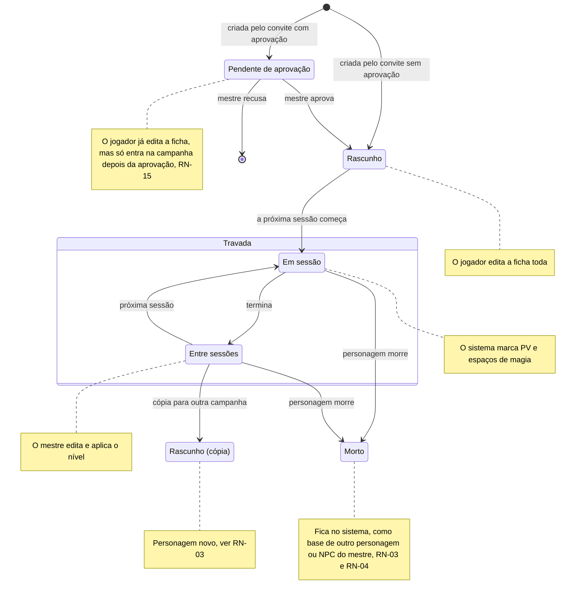
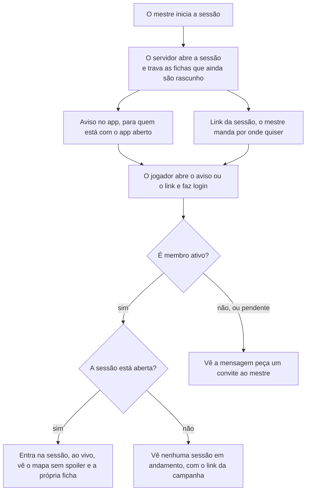

> A versão em inglês ([rules.md](../../product/rules.md)) é a canônica.

# Regras de negócio

Cada regra tem um ID (RN-xx) para as histórias, os testes e o código apontarem para ela. A tabela traz o enunciado de cada regra; a seção de cada regra, abaixo dela, diz como o sistema cumpre, com o comportamento e os testes.

| ID | Regra | Detalhes |
| --- | --- | --- |
| RN-01 | **Trava da ficha.** O jogador edita a própria ficha até o início da primeira sessão da campanha. Depois, só o mestre e o sistema alteram. Um personagem criado depois (o substituto de um morto, ou o de quem chegou depois) fica editável até a próxima sessão começar. | [Detalhes](#rn-01-trava-da-ficha) |
| RN-02 | **PV e espaços de magia.** Durante a sessão, o sistema marca PV e espaços de magia a partir das ações: dano, cura, magia conjurada, descanso. O mestre também pode corrigir PV e espaços de magia na mão, a qualquer momento da sessão: o mestre tem a palavra final. | [Detalhes](#rn-02-pv-e-espaços-de-magia) |
| RN-03 | **Um personagem, uma campanha.** O personagem do jogador fica numa campanha só. Dentro da campanha, o jogador só cria um personagem novo quando o atual morre. O personagem morto não é apagado: fica no sistema, como base para outro personagem do jogador, ou como NPC do mestre em outra campanha (RN-04). | [Detalhes](#rn-03-um-personagem-uma-campanha) |
| RN-04 | **NPCs reutilizáveis.** O mestre usa os próprios personagens em quantas campanhas quiser. Isso inclui um personagem de jogador morto (RN-03), que o mestre pode reaproveitar como NPC em outra campanha. | [Detalhes](#rn-04-npcs-reutilizáveis) |
| RN-05 | **Papéis por campanha.** Um usuário pode ser mestre numa campanha e jogador em outra. | [Detalhes](#rn-05-papéis-por-campanha) |
| RN-06 | **Aviso de início da sessão.** Quando o mestre inicia a sessão, os membros recebem uma notificação no app, para quem está com o app aberto. O link da sessão pede que a pessoa esteja logada (com Google; o login sem Google da RN-17 ainda não foi construído) e só abre a sessão para membros. | [Detalhes](#rn-06-aviso-de-início-da-sessão) |
| RN-07 | **Convite não é link da sessão.** O convite adiciona alguém à campanha; o link da sessão só leva um membro até ela. O mestre escolhe, ao gerar o convite, quantos usos ele tem e por quanto tempo vale, e pode revogar a qualquer momento. | [Detalhes](#rn-07-convite-não-é-link-da-sessão) |
| RN-08 | **Formato da importação.** O jogador ou o mestre escolhe o formato: ficha do D&D Beyond ou a ficha em português, as duas em PDF editável. Não há importação de DOCX. | [Detalhes](#rn-08-formato-da-importação) |
| RN-09 | **Modo de XP.** Cada campanha dá XP por inimigos derrotados, por ouro ou por marcos. Nos dois primeiros modos, o mestre também dá XP quando quiser. | [Detalhes](#rn-09-modo-de-xp) |
| RN-10 | **Mapa sem spoiler.** O jogador só vê os pontos de interesse que o grupo já descobriu. | [Detalhes](#rn-10-mapa-sem-spoiler) |
| RN-11 | **Notas do mestre.** Só o mestre lê e edita as notas do mestre. | [Detalhes](#rn-11-notas-do-mestre) |
| RN-12 | **Subir de nível.** O jogador sobe de nível pela edição guiada da ficha que a RN-01 permite enquanto ele "Pode subir de nível" ([MR-040](historias.md#mr-040-subir-de-nível-pela-ficha): o bloco "Pode subir de nível" da ficha e a página de passos Habilidades, Vida, Escolhas, Magias e Resumo, sem os passos que não têm o que escolher). | [Detalhes](#rn-12-subir-de-nível) |
| RN-13 | **Mais de um mestre.** Uma campanha pode ter mais de um mestre, e um mestre pode passar a campanha para outro. | [Detalhes](#rn-13-mais-de-um-mestre) |
| RN-14 | **Criar campanha exige conta de mestre completa.** Qualquer conta serve para jogar. Para criar campanha, a conta precisa ser uma conta de mestre completa, que no MVP só existe com Google. Outras formas de login viram conta de mestre completa depois do MVP. | [Detalhes](#rn-14-criar-campanha-exige-conta-de-mestre-completa) |
| RN-15 | **Convite com aprovação.** Pelo link do convite, o jogador já cria o próprio personagem. O mestre aprova ou recusa esse personagem antes dele valer para a campanha. | [Detalhes](#rn-15-convite-com-aprovação) |
| RN-16 | **Exclusão de conta e inatividade.** Quando um jogador exclui a conta, os personagens dele ficam vinculados ao mestre da campanha, não apagados. Quando um mestre exclui a conta, ele tem 30 dias para voltar entrando de novo com a mesma conta (o mesmo `issuer`/`subject`, ver [Privacidade](../privacidade.md#excluir-a-conta)); passado esse prazo, tudo é apagado. | [Detalhes](#rn-16-exclusão-de-conta-e-inatividade) |
| RN-17 | **Login do jogador sem Google.** O jogador entra por um login anônimo, sem e-mail nem nome real: o apelido do mestre junto do apelido do jogador identifica a conta de forma única (o handle é por mesa, não por campanha, como propunha a [ADR-0009](../../adr/0009-login-do-jogador-sem-google.md)). | [Detalhes](#rn-17-login-do-jogador-sem-google) |
| RN-18 | **Dados físicos ou do app.** O mestre escolhe se a campanha permite escolher o dado. Se permitir, cada jogador escolhe entre rolar no app ou rolar o dado físico e digitar o resultado. | [Detalhes](#rn-18-dados-físicos-ou-do-app) |
| RN-19 | **Iniciativa.** Numa batalha com vários NPCs iguais, cada um rola a própria iniciativa; o grupo não rola junto. | [Detalhes](#rn-19-iniciativa) |
| RN-20 | **O que o jogador vê dos inimigos no combate.** O jogador não vê o PV dos inimigos como número: vê uma palavra, "Ileso", "Ferido", "Muito ferido" (metade dos PV ou menos) ou "Derrotado". Também não vê a CA dos inimigos nem as rolagens que o mestre faz para os NPCs: vê se acertou ou errou e o dano que recebe. | [Detalhes](#rn-20-o-que-o-jogador-vê-dos-inimigos-no-combate) |
| RN-21 | **Movimento na grade.** Na grade do mapa, cada quadrado vale 1,5 m, e o movimento é um **círculo**: a distância entre dois quadrados é a linha reta entre os centros deles (um passo na diagonal vale cerca de 2,1 m, não 1,5 m), e o que um combatente alcança é o círculo do seu movimento. | [Detalhes](#rn-21-movimento-na-grade) |
| RN-22 | **Condições e concentração.** O app marca as condições (derrubado, envenenado...) e a concentração, e lembra: quando o personagem concentrado leva dano, lembra o teste de concentração. | [Detalhes](#rn-22-condições-e-concentração) |
| RN-23 | **Conteúdo da mesa.** O mestre cadastra classes, subclasses, raças, sub-raças, antecedentes e magias que valem só na campanha dele, ao lado do SRD 5.1. Os membros leem o conteúdo da campanha; só o mestre escreve. | [Detalhes](#rn-23-conteúdo-da-mesa) |
| RN-24 | **Regras da mesa.** No alto da página "Regras da mesa" fica o **estilo da mesa**: "Tudo no app" (os dados no app, o combate com mapa, a névoa ligada nos mapas novos), "Mesa física" (os dados físicos, o combate sem mapa por padrão, a névoa desligada) ou "Teatro da mente" (cada jogador escolhe os dados, o combate sem mapa, sem névoa), e "Personalizado" quando as escolhas não batem com nenhum. | [Detalhes](#rn-24-regras-da-mesa) |
| RN-25 | **A grade e o combate sem grade.** As regras contam em quadrados de 1,5 m em todo mapa (RN-21). Um mapa desenhado com quadrados maiores é calibrado: "cada quadrado deste desenho vale 3 m" faz o app contar quatro quadrados de 1,5 m em cada um, e o alcance de 1,5 m continua sendo o vizinho. | [Detalhes](#rn-25-a-grade-e-o-combate-sem-grade) |
| RN-26 | **Portas.** Uma porta fechada bloqueia o movimento, a vista e a luz, como uma parede, e conta como parede para a cobertura. O personagem que anda até ela a abre, se não estiver trancada; o mestre abre, fecha e tranca qualquer porta, no editor e na sessão. | [Detalhes](#rn-26-portas) |
| RN-27 | **Quebra-cabeças.** O jogador nunca recebe a resposta de um quebra-cabeça: só o estado (as luzes, as rodas, os símbolos, a mensagem cifrada), a pista do mestre, as dicas soltas, quem fez a última jogada (o nome do personagem) e, depois de resolvido, o que aconteceu (o texto que o mestre escreveu em "Ao resolver" ou uma linha genérica). | [Detalhes](#rn-27-quebra-cabeças) |
| RN-28 | **Imagens geradas por IA.** Só o mestre gera e edita, com um limite de imagens por campanha por mês. | [Detalhes](#rn-28-imagens-geradas-por-ia) |
| RN-29 | **Monstros no combate.** Um monstro do bestiário (MR-042) entra no combate como um NPC: o jogador vê só a palavra do estado (RN-20), o mestre vê a ficha de criatura do SRD, e ele conta no XP por inimigos pelo ND. | [Detalhes](#rn-29-monstros-no-combate) |
| RN-30 | **Limites do que uma conta cria.** Uma conta é mestre de no máximo 10 campanhas (`MAX_CAMPAIGNS_PER_USER`), e o servidor todo gera no máximo 100 imagens por dia (`IMAGE_DAILY_LIMIT`) e mantém no máximo 5 pedidos de imagem vivos ao mesmo tempo (o que está sendo feito e quatro esperando), além dos 20 por mês de cada campanha (RN-28). | [Detalhes](#rn-30-limites-do-que-uma-conta-cria) |

## RN-01: Trava da ficha

O jogador edita a própria ficha até o início da primeira sessão da campanha. Depois, só o mestre e o sistema alteram. Um personagem criado depois (o substituto de um morto, ou o de quem chegou depois) fica editável até a próxima sessão começar. A história do personagem (personalidade, aparência, história, aliados) tem trava própria: depois da trava, o jogador só a edita quando o mestre libera, personagem por personagem, até a próxima sessão começar ou até o mestre travar de novo. Os números que o sistema calcula nunca são editáveis. **Exceção ([MR-040](historias.md#mr-040-subir-de-nível-pela-ficha)):** enquanto o personagem "Pode subir de nível" (RN-12), o jogador pode editar a ficha, mas só para acrescentar o que o próximo nível dá: um nível de classe e as escolhas dele. O resto continua travado, e o servidor confere pelo motor de regras.

**Como o sistema cumpre**

O servidor recusa edições do jogador quando `sheet_locked_at` está preenchido. A liberação da história é `story_editing_allowed`, que só o mestre muda e que o início de cada sessão desliga. A tela mostra a ficha só para leitura. `PlayService.StartGameSession` trava, na mesma transação, todo personagem de jogador vivo que ainda é rascunho, então o personagem criado depois trava na sessão seguinte. O mestre é avisado antes de quais dessas fichas ainda têm perícias ou magias a escolher (`CharacterSummary.open_choices` no `ListCharacters`, só do mestre) e confirma antes de iniciar; o travamento em si não espera por elas. A recusa é `failed_precondition` com o detalhe `CharacterBlocked` (`SHEET_LOCKED`, `CHARACTER_DEAD` ou `STORY_LOCKED`); o mestre libera a história com `SetStoryEditing`. **A exceção do subir de nível:** a edição guiada é o `CharacterService.LevelUpCharacter`, só do dono (o mestre continua com o editor da ficha, `UpdateCharacter`), e só enquanto `can_level_up` é verdadeiro, na ficha travada também. O cliente nunca manda a ficha inteira: manda as escolhas (`LevelUpChoices`) e o servidor monta a ficha nova a partir da guardada, roda `rules.Validate` e `rules.CheckLevelUp` e grava com a checagem de revisão (`aborted` se a ficha mudou). **O que a edição pode mudar, e só isso:** um nível de uma classe que o personagem já tem (entrar numa classe nova é multiclasse e fica com o mestre); o incremento no valor de habilidade, só num nível que tem "Incremento no Valor de Habilidade" (+2 numa habilidade ou +1 em duas, nenhum acima de 20; o SRD 5.1 não tem talentos), que vai para `extra_ability_bonuses`; os PV do nível (a média, o dado rolado no app ou o dado físico digitado, de 1 até o dado da classe; a média e o rolado podem se misturar, e o primeiro dado rolado numa ficha de PV fixos preenche os níveis anteriores com as suas médias, então nada mais muda); exatamente os truques, as magias conhecidas ou do grimório (duas por nível, no Mago) que a tabela da classe dá, e as magias preparadas novas, nenhuma removida, até o novo máximo; a subclasse, se o nível dela é este; e as opções que as features do nível novo oferecem (um estilo de luta, uma metamagia), as perícias e a especialização que ele dá. **O que continua travado, e o servidor recusa com o campo e um motivo (`LevelUpRefusal`):** nome, raça, antecedente, valores-base, armadura, escudo, armas, as outras classes, e tudo o que os níveis anteriores já tinham; a ficha nova também não pode ficar com um problema que a antiga não tinha (uma magia fora da lista da classe, acima do nível ou preparadas demais). O que a lista não cobre fica com o mestre no editor ("o mestre acrescenta pelo editor"; as opções do servidor listam o que é do nível em `master_adds`): multiclasse; subclasse própria (nome livre); o Arcana Mística do Bruxo (níveis 11, 13, 15 e 17), a Maestria de Magia e a Magia Característica do Mago (18 e 20), os Segredos Mágicos Adicionais do Colégio do Conhecimento (6) e os inimigos e terrenos favoritos do Patrulheiro; e **trocar uma magia conhecida por outra**, que o SRD permite a Bardo, Patrulheiro, Feiticeiro e Bruxo ao subir de nível: a subida guiada só acrescenta magias, nunca tira uma. Dentro da lista, a subida cobre as invocações novas do Bruxo (pela tabela da classe), os Segredos Mágicos do Bardo (níveis 10, 14 e 18: duas das magias novas podem ser de qualquer classe), o truque a mais do Círculo da Terra e as perícias do Colégio do Conhecimento. Uma ficha guardada que já não passa nas regras de hoje (uma chave que o conteúdo perdeu) recebe a recusa `SHEET_NEEDS_MASTER`: o app diz para pedir ao mestre corrigir a ficha. A recusa do jogador por trava continua `failed_precondition` com `CharacterBlocked`, com mais três motivos: `CANNOT_LEVEL_UP` (não "Pode subir de nível", é NPC ou está no nível 20), `DICE_FORCED_PHYSICAL` e `DICE_FORCED_IN_APP` (RN-18). **O dado de vida (RN-18):** o dado rolado no app é rolado **pelo servidor** (`RollLevelUpHitPoints`) e fica guardado para aquele personagem e nível (uma rolagem só por nível, mesmo com duas classes, e ela só vale para a classe que rolou): pedir de novo devolve o mesmo resultado, nunca outro, então o resultado "fica no registro". A campanha que força dado físico recusa o dado do app; a que força o app recusa o número digitado; com "cada jogador escolhe", vale a escolha de cada rolagem. Cada subida fica registrada para o mestre (`ListLevelUps`, "O que mudou"). Testes: `TestLevelUpPensantus`, `TestLevelUpToren`, `TestLevelUpRefusals` (em `rules`) e `TestMR040_ThePlayerLevelsUpALockedSheet`, `TestMR040_TheRestStaysLocked`, `TestMR040_TheRulesRefuseWhatTheLevelDoesNotGive` e `TestMR040_TheHitPointRollIsKept` (em `characters`).

## RN-02: PV e espaços de magia

Durante a sessão, o sistema marca PV e espaços de magia a partir das ações: dano, cura, magia conjurada, descanso. O mestre também pode corrigir PV e espaços de magia na mão, a qualquer momento da sessão: o mestre tem a palavra final.

**Como o sistema cumpre**

Cada ação vira um evento no servidor, que recalcula e avisa a mesa ao vivo. A correção do mestre também vira um evento, sem passar pelas contas automáticas. **A correção do mestre:** PV atual, PV temporários, espaços de magia (e de pacto) usados e dados de vida usados ficam em `character_vitals` e duram de uma sessão para outra; os máximos saem da ficha (`rules.Derive`), e o valor guardado é cortado no máximo a cada leitura. O personagem cujo PV atual nunca foi definido tem os PV cheios, qualquer que seja o máximo (um aumento de nível, uma ficha alterada), mesmo depois de outro valor, como um espaço gasto, ter sido guardado; depois de definido o PV fica como está, e o valor guardado só é cortado quando o máximo cai abaixo dele. O mestre corrige com `PlayService.AdjustCharacterVitals`, só com uma sessão aberta (sem sessão, `failed_precondition` com `NO_OPEN_SESSION`), cada valor de 0 até o máximo (a folha "Ajustar" também devolve usos gastos de recursos de classe e raça, como Forma Selvagem ou Fúria, e acerta os PV da fera enquanto um druida está em Forma Selvagem); a correção e uma linha em `session_events` são gravadas na mesma transação, e o stream avisa o mestre e o dono do personagem na hora. Uma nova tentativa com a mesma `idempotency_key` não muda nada. O jogador vê só os números do próprio personagem (nunca os dos outros); o mestre vê os de todos. **As contas** são puras, em `rules/combat`: `ApplyDamage` (PV temporários primeiro, piso em 0), `ApplyHeal` (até o máximo) e `SpendSlot`, `SpendPactSlot` e `SpendResource`. **O dano do combate:** o ataque que acerta abre um dano pendente (`pending_damages`). Num NPC, o dano é aplicado na hora (PV temporários primeiro; a 0 PV ele fica derrotado e sai da ordem), depois das resistências, vulnerabilidades e imunidades da criatura do SRD dele (o NPC feito de uma criatura, o monstro da RN-29 e a criatura de um personagem): a imunidade ao tipo de dano o zera, a resistência o divide por dois (arredondado para baixo) e a vulnerabilidade o dobra, depois dos bônus e da metade de um teste de resistência. Só valem as entradas da ficha da criatura sem condição; a que traz uma condição nas palavras do SRD ("de armas não mágicas") não é aplicada, e o mestre corrige os PV à mão. As resistências de um personagem de jogador (Fúria e outras) são avisos que o mestre aplica ao definir o valor; o app não as aplica. Num personagem de jogador, o dano rolado **espera o mestre**, que o aplica ("Aplicar 5 de dano") ou o descarta ("Não aplicar"), e só então muda os `character_vitals`, pelo mesmo caminho da correção, com os mesmos limites (de 0 ao máximo). A 0 PV o personagem está caído (todos veem a palavra "Caído", nunca os números) e faz testes contra a morte (RN-03). O mestre mexe nos PV de um NPC na mão com `AdjustCombatantHitPoints` (dano, cura ou valor, e PV temporários) e desfaz a última ação com `UndoLastAction`: cada uma vira um evento, e o desfazer, um evento compensatório. **Magias, recursos e cura:** `CastSpell` gasta o espaço de magia (ou de pacto) **na conjuração**, junto com a ação ou a ação bônus, pelos mesmos `character_vitals` e na mesma transação (um reenvio com a mesma chave não gasta de novo; o espaço de um NPC não é contado). O dano de uma magia segue o caminho do dano de um ataque (um NPC aplica na hora, um personagem espera o mestre); uma **cura** rola o dado com o modificador de conjuração e cura **na hora**, até o máximo, em NPC e em personagem, e quem estava a 0 PV levanta (RN-03). Os usos de classe e raça (Retomar o Fôlego, Surto de Ação, Fúria...) também ficam em `character_vitals` (`resources_used`, cortados ao máximo da ficha) e a correção do mestre os devolve (`AdjustCharacterVitals.resources_used`; o descanso ainda não existe); Retomar o Fôlego cura 1d10 + o nível de guerreiro. Um recurso de usos ilimitados (Fúria no bárbaro 20, Forma Selvagem no druida 20) é guardado como 99 usos e aparece como "ilimitado" nas telas ao vivo. O mestre aplica **uma quantia diferente** da rolada (`ApplyPendingDamage.amount`, de 0 a 9.999: uma resistência, uma resistência que ele não aceita): o registro guarda as duas para ele, e o jogador só vê o que levou. Testes: `TestMonsterTakesDoubleDamageOfATypeItIsVulnerableTo`, `TestMonsterTakesNoDamageOfATypeItIsImmuneTo`, `TestAdjustForType`, `TestMR014_CastingSpendsTheSlot`, `TestTimelineRound3MagicMissile`, `TestSaveSpellRollsOnceForTheCast`, `TestHealingSpellRevivesAndResetsDeathSaves`, `TestSecondWindAndActionSurge`, `TestMasterAppliesADifferentAmount`, `TestCombatUndoTakesBackEveryNewAction`, `TestMR012_DamageToAnNPCIsAppliedAndDefeatsIt`, `TestRN02_DamageToAPlayerWaitsForTheMaster`, `TestCombatUndoRestoresTheLastAction`. **O dano de uma armadilha (MR-035):** o servidor rola o dano quando a armadilha dispara e ele segue o caminho do dano de um ataque: num NPC ou numa criatura cai na hora; num personagem de jogador **espera o mestre**, que o aplica (mudando a quantia antes, se quiser) ou descarta. No combate é uma linha de `pending_damages` sem atacante (`trap_point_id`), aplicada com `ApplyPendingDamage`; fora dele, uma linha de `trap_damages`, aplicada às vitais com `ApplyTrapDamage`. Um NPC fora do combate não tem PV guardado: o dano é só uma linha do histórico. Ao fim do combate o que ainda espera vira `trap_damages`, que sobrevive à sessão até o mestre aplicar ou descartar. Testes: `TestMR035_AMoveStopsAtTheFirstSquareOfTheArea`, `TestMR035_TheMasterFiresATrapByHand`, `TestMR035_OutsideACombat`, `TestMR035_AnEndedCombatKeepsTheTrapDamageForTheMaster`. **As criaturas do personagem (MR-037):** o PV de uma criatura é dela, não do personagem; o mestre o corrige fora do combate com `AdjustCreatureHitPoints` e, no combate, com o "Dano/Cura" do combatente (`AdjustCombatantHitPoints`); o dano de um ataque cai na criatura na hora, como no NPC, sem esperar o mestre (a espera da RN-02 é do PV de personagem), e a 0 PV ela é dispensada. Teste: `TestMR037_ACreatureAtZeroLeavesAndTheHitPointsGoBack`.

## RN-03: Um personagem, uma campanha

O personagem do jogador fica numa campanha só. Dentro da campanha, o jogador só cria um personagem novo quando o atual morre. O personagem morto não é apagado: fica no sistema, como base para outro personagem do jogador, ou como NPC do mestre em outra campanha (RN-04). Para jogar outra campanha, ao mesmo tempo ou numa continuação anos depois, o jogador faz uma cópia.

**Como o sistema cumpre**

A cópia ([MR-021](historias.md#mr-021-copiar-personagem), ainda não construída) será um personagem novo com `copied_from_id` apontando para o original; ela começa editável e trava na primeira sessão da nova campanha. O personagem morto muda de estado, nunca de linha: não existe exclusão de personagem no fluxo normal. `characters.campaign_id` é a campanha do personagem, o mestre marca a morte com `MarkCharacterDead` (`status = 'dead'` e `died_at`), e o índice único parcial `characters_one_living_player_character` deixa um só personagem vivo por jogador em cada campanha, mesmo com duas chamadas ao mesmo tempo. A segunda criação recebe `failed_precondition` com `LIVING_CHARACTER_EXISTS` e o ID do vivo (a cópia é a [MR-021](historias.md#mr-021-copiar-personagem), para depois). No combate, a terceira falha no teste contra a morte não mata sozinha: o personagem só morre quando o mestre confirma, e a confirmação é a mesma `MarkCharacterDead`; a partir daí vale tudo acima. As contas do teste contra a morte estão em `rules/combat` (`DeathSave`, `DamageWhileDown`): três falhas dão o resultado `dying`, nunca a morte. **Como o sistema cumpre:** um personagem a 0 PV está "Caído" e, no começo da vez dele, deve um teste contra a morte (`death_save_due`; o `EndTurn` do jogador espera, com `DEATH_SAVE_DUE`, e o mestre passa a vez mesmo assim). `RollDeathSave` (d20 do app ou digitado, a cada rolagem, RN-18): 10 ou mais é sucesso, menos é falha, 1 natural são duas falhas, 20 natural volta com 1 PV (pelos `character_vitals`, as contagens zeram e ele pode agir); três sucessos o deixam "Estável"; três falhas o deixam "Morrendo" para o mestre (para os jogadores a palavra continua "Caído", com as contagens, que são públicas: o app nunca diz que alguém morreu antes do mestre). Dano que acerta quem está a 0 PV não baixa os PV: conta uma falha (duas no crítico); num personagem estável, os sucessos zeram antes. Qualquer cura acima de 0 zera as contagens (uma magia, Retomar o Fôlego, a correção do mestre, um desfazer). `ConfirmDeath` (só o mestre, só com três falhas) chama o efeito do `MarkCharacterDead` na mesma transação, tira o combatente da ordem (a vez passa se era dele) e vai para o registro; **não se desfaz**, porque o personagem já está morto no `characters` (para trazê-lo de volta o mestre usa o próprio serviço de personagens). As contagens ficam na linha do combatente: o combate encerrado as guarda para o resumo ("Caída: 1 sucesso, 1 falha"), e um combate novo começa em 0 e 0. Quem cai a 0 PV na própria vez só rola o primeiro teste na vez seguinte. Fora do combate o app ainda não rola testes contra a morte. Testes: `TestRN03_DeathSavesAndTheMasterConfirms`, `TestRN03_NaturalOneTwentyAndStable`. **Nas telas:** na vez de quem está caído, o herói diz "Brisa está caída", com as marcas (sucesso ✓, falha ✕) e "Rolar teste contra a morte" (no app ou digitado, a cada rolagem); depois da rolagem aparece o resultado numa região viva e "Encerrar turno". Só o mestre vê "Morrendo · 3 falhas" e a pergunta "Confirmar a morte" / "Ainda não" (foco em "Ainda não"); os jogadores veem "Caída" e as contagens. Teste: `combat.spec.ts` ("caído: o teste contra a morte").

## RN-04: NPCs reutilizáveis

O mestre usa os próprios personagens em quantas campanhas quiser. Isso inclui um personagem de jogador morto (RN-03), que o mestre pode reaproveitar como NPC em outra campanha.

**Como o sistema cumpre**

O NPC é um modelo. PV e posição de cada combate ficam no combatente, então um combate numa campanha não muda o NPC nas outras. O NPC tem dono, o mestre que o criou (`characters.master_user_id`), e fica na campanha em que foi criado; usar o mesmo NPC em outras campanhas é a [MR-022](historias.md#mr-022-reutilizar-npcs), e nada no modelo impede. Jogadores não veem nem criam NPCs.

## RN-05: Papéis por campanha

Um usuário pode ser mestre numa campanha e jogador em outra.

**Como o sistema cumpre**

O papel fica em `campaign_members`, não no usuário.

## RN-06: Aviso de início da sessão

Quando o mestre inicia a sessão, os membros recebem uma notificação no app, para quem está com o app aberto. O link da sessão pede que a pessoa esteja logada (com Google; o login sem Google da RN-17 ainda não foi construído) e só abre a sessão para membros.

**Como o sistema cumpre**

O app mostra a notificação em tela; não há notificação push do navegador (com o app fechado) no MVP. Quem não é membro vê "peça um convite ao mestre". Com a aba visível, o app pergunta a cada 30 segundos quais sessões estão abertas nas campanhas da pessoa (`PlayService.ListOpenGameSessions`, só de quem é membro ativo), sem manter conexão aberta; a página da sessão só abre para membros (`GetLiveSession` e `WatchGameSession` respondem `not_found` a quem não é membro, inclusive ao membro pendente, e `failed_precondition` com `NO_OPEN_SESSION` quando não há sessão). Nas telas: o aviso embaixo da barra do app, o link "Ao vivo" na barra e a página da sessão (`/campaigns/<id>/session`). O aviso não aparece na própria página da campanha: ali, o cartão "Sessão" é o anúncio, e o cartão do jogador acompanha a mesma consulta ("Entrar na sessão" aparece quando uma sessão começa e some quando ela termina, sem recarregar a página).

## RN-07: Convite não é link da sessão

O convite adiciona alguém à campanha; o link da sessão só leva um membro até ela. O mestre escolhe, ao gerar o convite, quantos usos ele tem e por quanto tempo vale, e pode revogar a qualquer momento.

**Como o sistema cumpre**

O convite expira e fica guardado só como hash. Padrão: 1 uso, 7 dias. O mestre escolhe de 1 a 20 usos e de 5 minutos a 30 dias. O link da sessão não carrega segredo nenhum: é `/campaigns/<id>/session`, e quem decide se a pessoa entra é o servidor, conferindo a participação a cada chamada e, no stream, de novo a cada 60 segundos.

## RN-08: Formato da importação

O jogador ou o mestre escolhe o formato: ficha do D&D Beyond ou a ficha em português, as duas em PDF editável. Não há importação de DOCX.

**Como o sistema cumpre**

**Ainda não construído** ([MR-007](historias.md#mr-007-importar-ficha-em-pdf), Depois): hoje não há importador. O desenho é: o importador lê os campos do PDF e mostra o resultado para revisão antes de salvar.

## RN-09: Modo de XP

Cada campanha dá XP por inimigos derrotados, por ouro ou por marcos. Nos dois primeiros modos, o mestre também dá XP quando quiser.

**Como o sistema cumpre**

Por inimigos: soma o XP dos inimigos derrotados e divide entre o grupo, como no livro do mestre (um monstro do bestiário conta pelo ND da criatura, RN-29). Por ouro: 1 XP por 1 peça de ouro (PO), como nas edições antigas. Por marcos: o mestre sobe o nível do grupo. Por inimigos, o mestre escolhe se usa o ND ou digita o XP, e decide no fim do combate quem recebe. Por marcos, o mestre define antes os momentos em que dá um nível completo (os marcos planejados, descritos abaixo); o "Registrar um marco fora da lista" continua para o que ninguém planejou. **O modo muda depois de criada a campanha (RN-24):** `SetCampaignXpMode`, só o mestre; se já houve XP dado (um prêmio que não foi desfeito, um marco incluído), recusa com o detalhe `XpModeChangeBlocked` (quantos prêmios e quanto XP) até vir `confirm`. Nada é convertido: o XP já dado e o histórico ficam, e o novo modo vale daqui para a frente. **O modo também decide o "Pode subir de nível" (RN-12):** por inimigos ou por ouro, o XP da ficha chegar ao próximo nível; por marcos, a marca. Mudar o modo mexe então nos avisos de subir de nível que esperam: quem estava pronto pelo XP não está pronto por marcos até o mestre marcar, e quem tinha a marca não está pronto pelo XP até o XP alcançar o nível (nada é gravado nas fichas: o aviso é lido do modo a cada leitura). Um prêmio e a mudança do modo se alternam (o prêmio relê o modo dentro da própria transação), então nenhum prêmio escapa à confirmação. O modo só decide, além disso, que prêmios cabem na campanha; voltar ao modo de antes pergunta do mesmo jeito. Testes: `TestRN09_TheXPModeChangesAfterCreation`, `TestRN09_ChangingTheXPModeAsksOnceXPWasAwarded`, `TestRN09_AnUndoneAwardDoesNotCount`. Por ouro, as PO vêm de tesouros postos antes no mapa e são convertidas, 1 XP por PO, quando o grupo volta à cidade ([MR-041](historias.md#mr-041-tesouros-e-xp-por-ouro): "Voltar à cidade" na "Experiência" e no "Dar XP"); digitar as PO continua valendo. **O tesouro gerado (MR-044):** o gerador de tesouro põe no mapa um ponto escondido cujo valor é só o **ouro** do tesouro (as moedas, as gemas e as obras de arte, 10 PP = 1 PO); os itens mágicos ficam na descrição e **nunca viram XP** (um item não é ouro: somar o valor dele daria XP "de graça"). Numa campanha por ouro o ponto converte em "Voltar à cidade" como qualquer tesouro (`TestMR044_AGoldCampaignConvertsTheGoldOnly`); nas outras, ele só entra no resumo da sessão (ver [Arquitetura](../../architecture.md#treasure-generator-mr-044)). **As contas:** as tabelas do SRD são conteúdo escrito à mão, `effects/advancement.json` (XP de cada nível, de 1 a 20, e o XP de cada nível de desafio, "ND", de 0 a 30), conferido ao carregar. As funções são puras, no `rules`: `XPForChallenge` (ND para XP), `SplitXP` e `LevelForXP`. **A divisão** é do total pelo número de personagens, arredondada para baixo (100 XP para 3 dá 33 para cada); o ND 0 vale 10 na tabela, e o mestre digita 0 para uma criatura que não ataca. Testes: `TestXPForChallenge`, `TestSplitXP`, `TestLoadAdvancementRefusesBrokenTables`. **O XP dado (módulo `progression`).** O mestre dá XP com `AwardXP`: por inimigos (a soma do XP dos NPCs derrotados de um combate encerrado, um prêmio por combate, a menos que seja desfeito), por ouro (1 XP por PO) ou avulso (o número que digitou), e cada personagem escolhido recebe a parte dele na ficha, na mesma transação. O modo precisa caber na campanha (por inimigos: inimigos e avulso; por ouro: ouro e avulso; por marcos: só o marco) e quem recebe tem de ser personagem de jogador vivo da campanha. O XP do NPC é o `xp_value` da ficha dele (o nível de desafio preenche, e o mestre pode digitar outro), copiado para o combatente quando ele entra no combate; só o mestre o recebe (RN-20). O mestre desfaz só o último prêmio, que continua no histórico como "Desfeito" (nada se apaga, ADR-0007). O desfazer tira o XP que cada ficha ganhou, que é menor que a parte quando a ficha chegou ao limite de 1.000.000 de XP. Toda a campanha lê o histórico (quem deu, quando, por quê, quanto cada um recebeu), e os jogadores recebem o aviso `xp_changed` ao vivo. **Como funciona:** o ND é opcional e o campo de XP aceita qualquer número, então os dois jeitos valem por igual; quem divide é a lista de personagens que o mestre manda, que a tela propõe com os que lutaram e não morreram (por inimigos); a divisão que não fecha arredonda para baixo e o servidor diz quanto se perdeu; o marco marca os personagens que o mestre escolhe, sem XP, e a marca dura até o nível da ficha subir (o aviso de subir de nível); todos da campanha veem o histórico. **O XP por tesouro.** "Voltar à cidade" é um `AwardXP` de modo `GOLD` com `treasure_point_ids`: o servidor soma as PO dos tesouros achados que nenhum prêmio converteu, 1 XP por PO, e divide entre os personagens que o mestre escolher como em qualquer prêmio (iguais, arredondado para baixo; "achado por" não pesa na divisão). Cada tesouro é convertido uma vez (dois prêmios ao mesmo tempo: um vence), e só em campanha por ouro (nas outras, o tesouro fica no mapa e no resumo da sessão). Desfazer o prêmio, se ele é o último, devolve os tesouros a "achado, não convertido"; depois de um prêmio mais novo eles continuam convertidos até esse ser desfeito, e o mestre corrige à mão. Testes: `TestMR041_VoltarACidadeConvertsTreasuresIntoOneGoldAward`, `TestMR041_ATreasureIsConvertedOnce`, `TestMR041_UndoFreesTheTreasures`, `TestMR041_VoltarACidadeRefusesWhatDoesNotFit`. **Os marcos planejados.** Na campanha por marcos, o mestre escreve os marcos antes, uma lista de textos de até 120 caracteres (no máximo 100 por campanha, contando os alcançados), na ordem que ele quiser (`AddMilestone`, `UpdateMilestone`, `MoveMilestone`, `RemoveMilestone`, uma mudança por chamada; a tabela é `planned_milestones`). Quando o grupo chega num marco, o mestre o marca e escolhe quem sobe de nível (`MarkMilestoneReached`): é o `MarkMilestone` de antes, com o texto do marco como motivo e ligado ao marco, então "Pode subir de nível" (RN-12), o histórico, o evento da sessão e o `xp_changed` são os mesmos. A ordem nunca é cobrada: dá para marcar fora dela. Um marco é alcançado uma vez só; "Dar a mais alguém" (`GiveMilestoneTo`) dá o mesmo marco a quem ficou de fora, como um novo prêmio daquele personagem no histórico, sem um segundo marco. "Alcançado" não é uma coluna: vale enquanto algum prêmio do marco não foi desfeito. O desfazer continua sendo o do último prêmio (`UndoLastXPAward`): desfazer a única marca faz o marco voltar a planejado, no mesmo lugar da lista; desfazer uma marca de "Dar a mais alguém" tira o marco só daquele personagem, e ele continua alcançado para os outros. Um marco alcançado nunca é editado, movido nem removido, só desfeito. **Quem vê o quê (RN-20):** os planejados são só do mestre; o jogador recebe apenas os alcançados, com o dia, a hora e quem subiu de nível, como no histórico, e nunca o nome de um marco que não aconteceu (um marco marcado e depois desfeito volta a ser planejado, então o histórico que o jogador lê omite o texto dos prêmios desfeitos dele até ele ser alcançado de novo). Um marco registrado fora da lista aparece entre os alcançados, mas não pode receber "Dar a mais alguém". Campanha que conta XP recusa tudo isso com `MODE_NOT_ALLOWED`. Testes: `TestMR016_PlannedMilestones`, `TestMR016_ReachingAPlannedMilestoneLetsTheChosenLevelUp`, `TestMR016_GiveAReachedMilestoneToSomeoneElse`, `TestMR016_UndoOfAPlannedMilestone`, `TestMR016_AMilestoneMarkedOffTheListIsReachedToo`, `TestRN20_PlayersSeeOnlyReachedMilestones`, `TestMR016_PlannedMilestonesNeedAMilestonesCampaign` e a matriz `TestAuthorizationMatrix`; na tela, os testes `@MR-016`, `@RN-12` e `@RN-20` de `e2e/tests/milestones.spec.ts`. **As telas.** O NPC tem "Nível de desafio (ND)" e "XP ao derrotar" no editor (lacaio: seção "Ao ser derrotado"; inimigo e chefe: no passo Básico): trocar o ND sempre refaz o XP pela tabela, um valor digitado fica enquanto o ND não muda, e "Usar 50 XP" volta ao da tabela. No fim do combate, o mestre vê o XP de cada derrotado, a soma, quem recebe (por padrão quem lutou e não morreu; o morto não pode ser marcado) e a divisão escrita ("350 XP ÷ 3 = 116,67, arredondado para baixo. 2 XP se perdem na divisão."); "Dar 116 XP a cada um" dá o prêmio do combate, e "Agora não" deixa a linha "XP do combate ainda não dado", que abre "Dar XP" com o motivo e o total preenchidos. "Dar XP" a qualquer hora (campanha e sessão) pede o motivo (até 120 caracteres) e o valor (1 a 1.000.000), ou as peças de ouro no modo por ouro; os erros aparecem ao sair do campo. A página da campanha tem "Experiência" para todos os membros: o XP de cada personagem, o que falta, o histórico e, só para o mestre, "Desfazer" no último prêmio, com a pergunta no lugar e o foco em "Voltar". Em campanha por marcos nenhuma tela mostra número de XP: a etiqueta e as listas de marcos ("Registrar marco" virou "Registrar um marco fora da lista"). A ficha traz o XP como bloco de leitura, e o jogador não digita mais o XP depois que a ficha trava. Testes: `e2e/tests/xp.spec.ts` (`@MR-016`) e os do Vitest de `core/progression`, `shared/xp`, `campaign-detail/experience`, `combat-xp` e `defeat-xp`.

## RN-10: Mapa sem spoiler

O jogador só vê os pontos de interesse que o grupo já descobriu.

**Como o sistema cumpre**

O servidor filtra a resposta. O mapa e o ponto nascem escondidos, e o mestre revela e esconde cada um (`SetMapRevealed`, `SetMapPointRevealed`); o token do NPC nasce escondido e o do personagem de jogador, visível (`SetMapTokenHidden`); o token de uma criatura é um token de grupo, como o de um personagem, e nunca é escondido: só o token de um NPC se esconde. O jogador vê o mapa revelado e o mapa atual da sessão (escolher o mapa atual o revela); nele, só os pontos revelados e os tokens visíveis; o ponto de submapa só leva a um mapa que ele também vê. Qualquer outro mapa é `not_found`, igual a um mapa que não existe. **No combate de um mapa com névoa**, o jogador também só recebe os NPCs que o personagem dele vê (RN-20). O que o jogador não vê fica de fora da resposta, nunca em branco: nem o ID, nem o nome, nem a descrição. **Tesouro convertido:** o histórico de XP que o jogador lê traz de um "Voltar à cidade" só quantos tesouros foram e o total em PO (`treasure_count`, `gold`), nunca quais nem o valor de cada um; a lista (`treasures`) é do mestre. Um ponto escondido nunca chega ao celular do jogador. **Um tesouro gerado (MR-044):** as quatro chamadas do `TreasureService` são só do mestre (o jogador, o membro pendente e quem não é membro recebem `not_found`), e o ponto que `PlaceTreasure` faz nasce escondido: nem ele, nem a descrição, nem o ouro chegam ao jogador no mapa, na sessão ao vivo ou no stream enquanto está escondido; **revelado, o jogador vê só o ponto e o nome; achado pelo grupo, vê também a descrição e o ouro** (MR-041) (`TestRN10_APlayerNeverSeesAPlacedTreasureUntilRevealed`, `TestTreasureAuthorizationMatrix`). **Uma masmorra gerada:** a lista das salas, o registro (a semente, as opções, a versão do gerador) e as chamadas do `DungeonService` são só do mestre, e o jogador recebe `not_found` de todas, antes e depois de o mapa ser revelado (`TestRN10_PlayersReadNothingOfADungeon`). O stream segue a mesma regra: uma mudança só em coisas escondidas chega só ao mestre (`TestMR009_PlayersNeverReceiveHiddenPoints`, `TestRN10_PlayersCannotOpenHiddenMaps`; ver [Arquitetura](../../architecture.md#who-sees-what-on-the-map)). **As imagens** seguem a mesma ideia, com a galeria (MR-019): a galeria, com todas as imagens da campanha, é só do mestre (`TestMR019_PlayersCannotListTheGallery`). O jogador baixa uma imagem (`GET /images/{id}`) só enquanto a vê: o fundo de um mapa que ele vê, ou a imagem que o mestre mostra na sessão (MR-028), que não revela mais nada. Guardar o ID não basta: a rota confere a cada pedido, e o navegador do jogador pergunta de novo a cada uso (`TestRN10_PlayersOnlyFetchImagesTheyCanSee`). O mestre pode deixar uma imagem com os jogadores ("Deixar com os jogadores", MR-028): ela vai para a lista de imagens deixadas da campanha (`campaign_left_images`) e o jogador a baixa até o mestre tirá-la (`TakeBackLeftImage`), também depois da sessão (`TestMR028_MasterLeavesAnImageWithThePlayers`, e a parte nova de `TestRN10_PlayersOnlyFetchImagesTheyCanSee`: deixada, servida; tirada, `404` de novo). Quem não é membro ativo, ou o jogador que não vê a imagem, recebe `404`, igual a uma imagem que não existe (ver [Arquitetura](../../architecture.md#serving-images)). **Cenas de RP (MR-015):** o mestre pode abrir um ponto de cena escondido (`OpenScene`); ele não é revelado: a cena aberta chega aos jogadores (`GetOpenScene`, com o nome, a descrição e as ações), e o ponto continua fora do mapa deles. O `MapPoint` de um ponto revelado traz as ações da cena, sem a CD. Testes: `TestMR015_AHiddenPointCanBeOpenedAndStaysHidden`, `TestMR015_PlayerSeesTheMastersActionsWithTheirBonus`. **O palco e os retratos (MR-031):** o retrato de um NPC é uma imagem da galeria (campo `portrait_image_id` da ficha do NPC), e o jogador só o baixa enquanto o NPC está no palco da cena aberta: fora de cena, com a cena fechada ou trocada, ou com a sessão encerrada, é `404`, igual a uma imagem que ele não pode ver, também no `If-None-Match`. Tirar o NPC de cena corta o acesso na hora. Testes: `TestMR031_PortraitsAreVisibleOnlyOnStage`, `TestMR031_DeletingAPortraitClearsIt` (ver [Arquitetura](../../architecture.md#npcs-on-stage)). **Cenas descobertas, pistas e ganchos (MR-029, MR-030):** uma cena é "descoberta" quando o mestre revela o ponto no mapa ou a abre numa sessão (mesmo escondida), vale para o grupo todo e não some se o ponto for escondido de novo; é a única regra que deixa o jogador usar o nome de uma cena fora do mapa (a etiqueta de uma anotação), e só de uma cena de um mapa que o jogador pode abrir: a cena de um mapa que não foi revelado nem é o atual da sessão não entra na lista, seja como for que foi descoberta. Qualquer ponto de cena abre, mesmo sem ações: a cena é toda do mestre, e o servidor não recusa. O jogador só vê os NPCs da cena e pode tocar num deles para vê-lo maior, sem mais nada ([MR-031](historias.md#mr-031-npcs-na-cena)). Testes: `TestMR030_TagsOnlyDiscoveredScenes`, `TestScenesWithNoActionsOpen`. **Armadilhas, tesouros, luzes e camadas (MR-034 a MR-036 e MR-041):** uma armadilha que não foi revelada ao personagem do jogador nunca chega a ele, nem o ID nem a posição, em nenhuma resposta nem evento do stream; ela chega só quando o mestre a revelou a esse personagem (`RevealTrap`, e quando o personagem a nota ou a acha em jogo), quando já disparou (aí todos veem, mesmo se o mestre a desarmar depois) ou quando o mestre a revelou a todos; e então só com nome, descrição, posição, área e estado, nunca a CD para notar, a CD para achar, o gatilho, o efeito nem a predefinição, que só o mestre recebe. Uma revelação a alguns personagens avisa só os jogadores deles, e o jogador de outro personagem não recebe nem um `map_changed` por causa dela. Um tesouro segue a regra do ponto escondido e, depois de achado, todos os que veem o mapa o veem com a descrição, o valor e quem achou (antes de achado, mesmo revelado, não leva a descrição nem o valor). Um ponto de luz nunca vai a um jogador (ele vê a luz, não o ponto), e a camada de luz pintada também nunca: do que está pintado, o jogador de um mapa que vê, sem névoa, recebe só parede, terreno difícil e cobertura (são coisas que se veem), e com a névoa ligada, as camadas do que o personagem vê (abaixo). A luz que um personagem carrega vai só ao mestre e ao dono dele. **A névoa por jogador (MR-036):** num mapa com a névoa ligada, o jogador só recebe o que o personagem dele **vê agora ou já viu**, e o servidor decide pela conta de `rules/vision` (as paredes e a luz que o mestre pintou, os pontos de luz e as luzes que os personagens carregam, a visão no escuro da ficha). Não chega a ele: o ID, a URL nem a miniatura da imagem do mapa (a rota recusa o arquivo), um ponto cujos quadrados ele não vê nem lembra, o token de um NPC fora do que vê agora, a camada de luz nem uma parede longe do que vê. O token de um personagem de jogador chega sempre (o grupo sabe onde está o seu povo). Um token que o mestre escondeu continua iluminando o mapa (a luz carregada vale, e o jogador vê a claridade, não quem a carrega), como no jogo de mesa. Enquanto roda um combate no mapa, os tokens de NPC ficam de fora das leituras do jogador (os combatentes seguem a regra do combate, acima). A memória só é gravada enquanto os jogadores veem o mapa, e cada limpeza a invalida (uma época, sem corrida com uma atualização em andamento). Uma imagem de mapa com névoa é só dele: mostrá-la na sessão, deixá-la com os jogadores, usá-la de retrato ou de fundo de um mapa sem névoa dá uma cópia. O que já foi visto fica, escurecido e sem criaturas, até o mestre limpar ("Esquecer o que foi visto") ou trocar a grade ou a imagem. As contagens são as do que o jogador recebe; pedir o que não vê dá o mesmo `not_found` de pedir o que não existe. O stream segue a regra: o movimento de um NPC só chega como `vision_changed`, e só a quem o vê. O mestre vê tudo, e pode abrir o mapa "como" um personagem (`as_character_id`) para ver exatamente o que o jogador dele recebe. **A imagem, em peças:** o jogador nunca recebe a imagem inteira de um mapa com névoa, só peças de 16 × 16 quadrados, montadas no servidor com os pixels dos quadrados que ele viu ou lembra e preto opaco no resto (duas imagens que só diferem em quadrados que ele não conhece dão a ele peças idênticas; a borda da névoa fica escurecida 1 pixel num PNG e até 16 pixels num JPEG), de uma rota que confere o mapa a cada pedido (`404` para quem não vê o mapa, não é membro ou está pendente; o mestre lê a imagem inteira de sempre); uma peça sem nenhum quadrado conhecido não existe. Testes: `TestRN10_TileOracle` (o teste da garantia), `TestRN10_TilesCarryOnlyWhatThePlayerSaw` (decodifica a peça e confere cada pixel), `TestRN10_TileAuthorization`, `TestRN10_TilesAreInvalidated` (ver [Arquitetura](../../architecture.md#per-player-image-tiles)); `TestRN10_FogPlayersReceiveOnlyWhatTheirCharacterSees` (lê como o JSON do app cada resposta de quatro jogadores na caverna dos desenhos), `TestMR036_FogViewsMatchTheCaveOracle`, `TestMR036_SeeAsAPlayersCharacter`, `TestMR036_WhatWasSeenStays`, `TestMR036_VisionChangedReachesTheRightPlayers`, `TestRN10_FogMapImageIsCopiedWhenShared`; `TestRN10_PlayersNeverReceiveTrapsLightsOrHiddenTreasure`, que lê como o JSON do app cada resposta (`ListMaps`, `GetMap`, `GetMapLayers`, a foto da sessão) e o stream de dois jogadores, `TestMR034_PlayersReadOnlyWhatTheyMay`, `TestMR036_CarriedLight`. **Armadilhas em jogo (MR-035):** uma armadilha que nenhum personagem do jogador conhece (nem revelada a todos, nem disparada) nunca chega a ele, nem a existência, a posição, o nome ou as CDs, em nenhuma resposta, evento do stream ou linha do registro: notar e procurar são decididos no servidor, a partir do que o personagem enxerga, e revelam só a esse personagem; o resultado de uma busca lê igual quando não há nada e quando o teste falhou; o `GetMoveOptions` só marca a armadilha que o personagem conhece; um movimento cortado por uma armadilha desconhecida só diz que parou, e a armadilha vira pública porque disparou. O jogador lê "passou" ou "falhou", nunca a CD, e o dono de um personagem vê o próprio d20. Testes: `TestRN10_NoPlayerResponseNamesAnUnrevealedTrap` (lê como o JSON do app o mapa, o combate, as opções de movimento, o registro, a sessão ao vivo e o stream de dois jogadores, antes e depois de um terceiro conhecer a armadilha), `TestRN10_AMoveStoppedByAnUnknownTrapReadsAsTheTrapFiring`, `TestMR035_Searching`. **O teste sistemático:** `TestLeakMatrix` (`backend/internal/leaktest`) monta uma campanha com uma coisa escondida de cada tipo, marcada com textos e números que não aparecem por acaso, e pede toda leitura, todo evento do stream, toda imagem e toda peça da névoa como cada pessoa (dois jogadores, um membro pendente, um estranho e alguém sem sessão); o guarda de completude falha para um procedimento novo que não esteja classificado (ver [Arquitetura](../../architecture.md#leak-tests-rn-10)).

## RN-11: Notas do mestre

Só o mestre lê e edita as notas do mestre.

**Como o sistema cumpre**

As notas ficam numa tabela à parte, `character_master_notes`, e só saem por `GetMasterNotes` e `UpdateMasterNotes`, que só o mestre chama. Nenhuma outra resposta as carrega. No app antigo, o jogador conseguia ler e editar: é um bug conhecido, não corrigido lá — o sistema novo prova que ele não existe com um teste automático (`TestRN11_PlayersNeverReceiveMasterNotes`).

## RN-12: Subir de nível

O jogador sobe de nível pela edição guiada da ficha que a RN-01 permite enquanto ele "Pode subir de nível" ([MR-040](historias.md#mr-040-subir-de-nível-pela-ficha): o bloco "Pode subir de nível" da ficha e a página de passos Habilidades, Vida, Escolhas, Magias e Resumo, sem os passos que não têm o que escolher). O mestre também pode aplicar o novo nível na ficha. **Os PV atuais acompanham o máximo.** Quando um salvamento (a subida guiada ou a edição do mestre) muda os pontos de vida máximos da ficha, o personagem que tem os PV atuais definidos ganha o que o máximo ganhou: um ferimento continua um ferimento, e quem estava no máximo continua no máximo; um máximo que cai nunca deixa o atual acima dele, e um ferimento abaixo do novo máximo não paga pela queda. Quem nunca teve os PV atuais definidos está cheio seja qual for o máximo, e nenhum número é gravado para ele. Isso acontece na transação que salva a ficha (`CarryHitPoints`). A tela completa de subir de nível da [MR-017](historias.md#mr-017-subir-de-nível) fica para depois do MVP.

**Como o sistema cumpre**

O sistema avisa o mestre quando um personagem atinge o XP do próximo nível. `DerivedSheet.next_level_xp` traz o XP do próximo nível (0 no nível 20), calculado pelo `rules` a partir do nível total (`NextLevelXP`: 300 para o nível 2, 900 para o 3, 2.700 para o 4...). `GetCharacter` traz `can_level_up` e `level_up_reason` (`XP` ou `MILESTONE`) para o mestre e para o dono, de um personagem de jogador vivo, e `GetCampaignExperience` traz o mesmo para o grupo todo. Em campanha por inimigos ou por ouro, vale o `experience_points` da ficha chegar ao XP do próximo nível; em campanha por marcos, vale uma marca de marco (planejado ou não) cujo nível ainda não foi ultrapassado pelo nível da ficha (a marca some sozinha quando o mestre sobe o nível). Ninguém sobe do nível 20. Quem vê o aviso: o mestre e o jogador. **As telas:** a etiqueta "Pode subir de nível" (seta e palavras, nunca só a cor) aparece na lista "Personagens dos jogadores" da campanha, em "Experiência" e na ficha. Em campanha por inimigos ou por ouro, a ficha mostra o bloco "2.716 XP" com a barra e a frase "Chegou aos 2.700 XP do nível 4." seguida de "Suba o nível pelo botão abaixo." para o dono (o botão da MR-040) ou "Suba o nível na ficha." para o mestre; em campanha por marcos, só a etiqueta. A ficha escuta o `xp_changed` da sessão e se atualiza sozinha, e a marca some quando o mestre sobe o nível no editor. **A subida guiada:** quando o jogador sobe o nível pelo `LevelUpCharacter`, o "Pode subir de nível" some sozinho, como quando o mestre sobe o nível no editor: em campanha por XP porque o XP da ficha já não alcança o próximo nível, em campanha por marcos porque o nível da ficha passou o da marca (`TestMR040_CanLevelUpClearsAfterwards`). A subida manda às sessões abertas o mesmo aviso sem conteúdo do XP, o `xp_changed`, e o mestre lê o que mudou em `ListLevelUps`. **A tela da subida:** o botão "Subir para o nível N" é só do dono, na ficha travada; a rota sem a marca responde que ainda não dá para subir (a recusa `CANNOT_LEVEL_UP`), e o mestre, que a subida é do jogador. Testes: `TestDerivedNextLevelXP`, `TestLevelUpReason`, `TestXPCanLevelUpInAnXPCampaign`, `TestMR016_MilestoneMarksWithoutXP` e, na tela, os testes `@RN-12` de `e2e/tests/xp.spec.ts` e de `e2e/tests/levelup.spec.ts`.

## RN-13: Mais de um mestre

Uma campanha pode ter mais de um mestre, e um mestre pode passar a campanha para outro.

**Como o sistema cumpre**

**Depois do MVP ([MR-023](historias.md#mr-023-passar-ou-dividir-a-campanha)).** Hoje a campanha tem um mestre, quem a criou, e nenhuma chamada a passa adiante nem põe um segundo. O esquema já permite mais de uma linha com `role = master` em `campaign_members` da mesma campanha; a campanha só será apagada quando o último mestre sair (ver [Privacidade](../privacidade.md#excluir-a-conta)). Ver [ADR-0011](../../adr/0011-autorizacao-papeis-por-campanha.md).

## RN-14: Criar campanha exige conta de mestre completa

Qualquer conta serve para jogar. Para criar campanha, a conta precisa ser uma conta de mestre completa, que no MVP só existe com Google. Outras formas de login viram conta de mestre completa depois do MVP.

**Como o sistema cumpre**

No MVP toda conta vem do login OIDC (Google em produção), então toda conta é de mestre completo e o `CreateCampaign` não tem uma checagem própria para isso. O único portão é a lista opcional `CAMPAIGN_CREATORS` (RN-30). Quando chegar outra forma de login (RN-17), o `CreateCampaign` precisa passar a recusar contas sem identidade Google, como propôs a [ADR-0009](../../adr/0009-login-do-jogador-sem-google.md).

## RN-15: Convite com aprovação

Pelo link do convite, o jogador já cria o próprio personagem. O mestre aprova ou recusa esse personagem antes dele valer para a campanha.

**Como o sistema cumpre**

O personagem nasce num estado "pendente de aprovação", editável pelo jogador; só passa a fazer parte da campanha quando o mestre aprova (ver [Ciclo de vida da ficha](#ciclo-de-vida-da-ficha), RN-01). O mestre marca, em cada convite, "Exigir aprovação do mestre" (`requires_approval`; sem marcar, o convite funciona como de costume). Quem aceita esse convite vira membro pendente (`campaign_members.status = 'pending'`) e vai direto criar o personagem, que nasce `CHARACTER_STATE_PENDING`. O membro pendente não é membro: fora ver o nome da campanha, criar, ler e editar o próprio personagem, e (RN-24) ler as regras da mesa (`GetTableRules`) e fazer as habilidades com os 4d6 que o servidor guarda (`GetAbilityRolls`, `RollAbilityScores`), o servidor responde `not_found`, como a quem não está na campanha (ver [Arquitetura](../../architecture.md#pending-member)). A sessão não trava o personagem pendente, e ele não morre. A ficha dele não mostra as anotações do jogador nem o painel de criaturas, cujas chamadas um membro pendente não recebe: cada um diz "Aparece quando o mestre aprovar o personagem." no lugar. O mestre o aprova (`ApproveCharacter`: o personagem vira rascunho e o jogador, membro) ou recusa (`RejectCharacter`: o personagem e a participação pendente são apagados, e o jogador precisa de um convite novo), numa transação só. O mestre vê quem está pendente sem personagem (`ListPendingMembers`, com quando entrou e quando sai sozinho) e pode removê-lo (`RemovePendingMember`; recusa quem já é membro ou já tem personagem, que se recusa pelo `RejectCharacter`). A participação pendente sem personagem é apagada sozinha 30 dias depois de entrar, pelo TTL do banco sobre `campaign_members.pending_expires_at`. O prazo vale a partir do momento em que passa, antes de a tarefa do TTL rodar: essa pessoa deixa de contar como membro, e criar um personagem não traz a participação de volta. Um convite comum (sem aprovação, e que vale agora) aceito por um jogador pendente o torna membro na hora, gasta um uso e aprova o personagem dele, se esperava, porque conta como a aprovação do mestre. Um convite com aprovação aceito por um pendente não muda nada.

## RN-16: Exclusão de conta e inatividade

**Ainda não construído:** hoje só existem as cascatas do banco; não há chamada nem tela para excluir uma conta, nem configuração de inatividade. A regra abaixo é o desenho. Quando um jogador exclui a conta, os personagens dele ficam vinculados ao mestre da campanha, não apagados. Quando um mestre exclui a conta, ele tem 30 dias para voltar entrando de novo com a mesma conta (o mesmo `issuer`/`subject`, ver [Privacidade](../privacidade.md#excluir-a-conta)); passado esse prazo, tudo é apagado. Em qualquer exclusão, tudo some de vez 30 dias depois. Cada pessoa escolhe no próprio perfil quanto tempo de inatividade leva à exclusão da conta; padrão de 1 ano.

**Como o sistema cumpre**

O personagem do jogador passa a ser do mestre, sem vínculo com a conta apagada, ou é apagado junto, se a pessoa preferir. A espera de 30 dias do mestre é uma marca "apagar em" na conta, conferida no login. Ver [Privacidade](../privacidade.md#excluir-a-conta) para o fluxo completo, inclusive a ressalva sobre dado pessoal em texto livre do personagem. A parte dos personagens já vale no banco: `player_user_id` usa `ON DELETE SET NULL` (o personagem fica na campanha, com o mestre) e o NPC vai junto com a conta do mestre (`CASCADE`). Um personagem de jogador que fica sem jogador e sem campanha é apagado pelo TTL do banco. A escolha de apagar os próprios personagens, a espera de 30 dias e a inatividade vêm com a exclusão de conta.

## RN-17: Login do jogador sem Google

O jogador entra por um login anônimo, sem e-mail nem nome real: o apelido do mestre junto do apelido do jogador identifica a conta de forma única (o handle é por mesa, não por campanha, como propunha a [ADR-0009](../../adr/0009-login-do-jogador-sem-google.md)). O jogador entra sem senha; quando a primeira sessão de 30 dias vence, ele precisa definir uma senha ou vincular o Google para continuar.

**Como o sistema cumpre**

**Ainda não construído:** não há login de jogador sem Google no MVP, nem a tabela `table_handles`; toda conta entra pelo provedor OIDC (RN-14). O desenho é: o handle fica em `table_handles`, único dentro da mesa (`dm_user_id`) do mestre, e a senha segue a opção 3 da ADR-0009.

## RN-18: Dados físicos ou do app

O mestre escolhe se a campanha permite escolher o dado. Se permitir, cada jogador escolhe entre rolar no app ou rolar o dado físico e digitar o resultado. Se não permitir, todos usam o tipo que o mestre escolher.

**Como o sistema cumpre**

Uma configuração da campanha e uma preferência de cada jogador nela. O motor de regras aceita os dois (ADR-0008). A configuração é `campaigns.dice_mode` (`players_choose`, o padrão, `app` ou `physical`) e a preferência é `campaign_members.dice_preference` (`app`, o padrão, ou `physical`), com `SetCampaignDiceMode` (só o mestre) e `SetMyDicePreference` (qualquer membro ativo, o mestre também). A preferência só vale com `players_choose`; com os outros modos ela fica guardada, mas ignorada, e `EffectiveDiceMode` diz onde o jogador rola. A mudança vale a partir da próxima rolagem. Os NPCs sempre rolam no app. O pacote `platform/dice` lê expressões (`1d20+6`), rola com `crypto/rand` e confere a soma digitada com o dado físico: o jogador digita a soma dos dados, sem o modificador, e o app soma o modificador; a soma tem de caber no mínimo e no máximo dos dados. As telas são o painel "Dados" do mestre e "Como você rola os dados" do jogador, na página da campanha. As rolagens do combate seguem a regra. **Com "cada jogador escolhe", o jogador escolhe a cada rolagem ("Rolar no app" ou digitar o resultado); a preferência guardada é só o padrão que a tela destaca. Só um modo que o mestre forçou barra o outro:** com "todos rolam no app" um valor digitado é recusado, e com "todos rolam os próprios dados" a rolagem do app é recusada (`WRONG_DICE_MODE`), na iniciativa, no ataque e no dano. Em detalhe: o d20 do ataque e o dano do jogador vêm do app (`roll_in_app`) ou são digitados (`d20_face` de 1 a 20; `typed_sum`, a soma dos dados do dano, de N a N × faces, em que N é o dobro de dados no crítico dos dados dobrados e os dados de sempre no "máximo mais uma rolagem", RN-24), conforme a escolha do jogador, salvo modo forçado (acima); o NPC rola no app, e o mestre pode digitar o valor. Teste: `TestRN18_PhysicalRollsAreTypedSums`. As telas do ataque (a folha "Atacar", "Digite o resultado do dado", o cartão do mestre) são cobertas por `combat.spec.ts` (`@RN-18`). **Magias e o resto:** o d20 de um ataque de magia (`roll_in_app` ou `d20_face`, este só para um alvo), o dano e a cura das magias, o d10 do Retomar o Fôlego e o teste contra a morte seguem a regra a cada rolagem, com o mesmo `WRONG_DICE_MODE` quando o mestre forçou um modo. A resistência de um alvo de magia é sempre rolada pelo servidor com o bônus da ficha (a de um NPC, como as dele: no app); a palavra final é do mestre, pela quantia que ele aplica. Os PV rolados da criação do personagem (ver [MR-004](historias.md#mr-004-ficha-no-formato-do-pdf)) não entram nesta regra: rolam no navegador e não ficam registrados. **As habilidades 4d6 da ficha nova entram** (RN-24): o servidor os rola e guarda, e com dado físico o jogador digita os quatro dados de cada jogo, uma vez; a mesa que força o app recusa os dados digitados, e a que força o dado físico recusa a rolagem do servidor. **Cenas de RP:** o d20 de uma ação da cena (`RollSceneCheck`) segue a regra a cada rolagem, como o ataque: no app (`roll_in_app`) ou digitado (`d20_face`, de 1 a 20; o servidor soma o bônus da ficha), com `WRONG_DICE_MODE` quando o mestre forçou o outro modo. Teste: `TestRN18_SceneRollsFollowTheDiceMode`. **Nas telas:** a folha "Rolar" da cena usa o mesmo `roll-picker` do combate: "Rolar no app" e "Digitar o resultado" (o campo aceita 1 a 20 e mostra o total ao vivo), na ordem da preferência "Como você rola os dados", e só o jeito que um modo forçado permite quando o mestre forçou um; um `WRONG_DICE_MODE` vira "A campanha mudou a forma de rolar os dados. Recarregue a página.". A chave de idempotência é feita uma vez por rolagem e reenviada na nova tentativa. Teste: `scenes.spec.ts` (`@RN-18`).

## RN-19: Iniciativa

Numa batalha com vários NPCs iguais, cada um rola a própria iniciativa; o grupo não rola junto.

**Como o sistema cumpre**

Cada combatente (`combatants`) tem a sua iniciativa, também os NPCs iguais, e a ordem dos turnos sai delas. A única exceção são as criaturas de uma mesma invocação de um personagem de jogador (Conjurar Animais, Animar Mortos; [MR-037](historias.md#mr-037-criaturas-do-personagem)), que dividem uma só rolagem de iniciativa (`summon_group_id`). Vale com o dado do app ou com o físico (RN-18). Ao iniciar o combate (`CombatService.StartEncounter`), o servidor rola de uma vez a iniciativa de cada cópia de NPC (d20 + o bônus da ficha, com `crypto/rand`), uma rolagem para cada; o jogador rola a dele (`SubmitInitiative`, no app ou digitando o d20 físico, conforme a RN-18). A ordem é maior total, depois maior bônus, e no empate dos dois o mestre decide (`SetInitiativeOrder`). O combate só começa com todas as iniciativas (`BeginCombat`). **Turno conjunto:** combatentes lado a lado na ordem com o mesmo total, jogadores e NPCs, formam um grupo que joga um turno só: a vez de todos começa junto, cada um com a sua economia, o jogador de cada um encerra a própria parte (`EndTurn`) e o mestre a de qualquer um, e o turno passa quando o último encerra. Quem está sozinho no total é um grupo de um e tudo funciona como antes. O grupo vem da ordem e dos totais, não de um campo; vale a quem a vez começou e não muda no meio: reordenar um empate (`SetInitiativeOrder`) mantém o grupo; um reforço com o mesmo total entra na caixa mas só age na próxima vez do grupo; quem sai, morre ou é derrotado deixa a vez e, se ninguém mais age, o turno passa; esconder um membro não muda nada. O `tie_unresolved` continua só para a ordem em que o grupo é listado. Testes: `TestMR013_PlayersWithTheSameInitiativeShareATurn`, `TestMR013_TheTurnPassesWhenTheLastMemberEnds`, `TestMR013_EachMemberHasItsOwnEconomy`, `TestRN19_EachNPCRollsItsOwnInitiative`, `TestMR013_TurnOrderAndMovementLeft`, `TestRN19_OrderByInitiativeThenBonusThenTheMastersPlaces`.

## RN-20: O que o jogador vê dos inimigos no combate

O jogador não vê o PV dos inimigos como número: vê uma palavra, "Ileso", "Ferido", "Muito ferido" (metade dos PV ou menos) ou "Derrotado". Também não vê a CA dos inimigos nem as rolagens que o mestre faz para os NPCs: vê se acertou ou errou e o dano que recebe. O mesmo vale fora do combate: a CD de uma ação da cena, a rolagem de outro jogador, os ganchos, as pistas não reveladas e as anotações de outro jogador nunca chegam a um jogador.

**Como o sistema cumpre**

Mesma ideia da RN-10 e da RN-02: o servidor filtra a resposta, e o número, a CA e a rolagem do NPC nunca chegam ao celular do jogador; o que sai é a palavra do estado e o resultado (acertou, errou, dano). O mestre vê tudo.

**Combatentes.** O `GetEncounter` do jogador traz do NPC só a palavra (`CombatantState`: `UNHURT`, `HURT`, `BADLY_HURT` com metade dos PV ou menos, `DEFEATED`), nunca o PV, a iniciativa rolada nem o bônus. Um NPC escondido não vem de jeito nenhum: nem na ordem, nem no mapa, e a vez dele aparece como "Vez do mestre". Os eventos do stream seguem o mesmo filtro. Teste: `TestRN20_PlayersNeverReceiveHiddenCombatantsOrNPCNumbers`.

**Turno conjunto.** O jogador só vê um grupo se ele tem um personagem de jogador. A caixa, o total e o estado de cada parte ("Ainda age" / "Encerrou") chegam a todos, e a economia de um jogador chega só a ele, ao mestre e aos jogadores do mesmo grupo. Um grupo só de NPCs é do mestre: o jogador vê os NPCs pelo nome na ordem, sem caixa nem total, e na vez deles lê "Vez dos Goblins" (nunca um escolhido ao acaso; o servidor manda só os ids que ele vê, e os grupos de NPCs para dar o plural em "Depois de você: os Goblins", sem total). Um membro escondido nunca vai ao jogador: o grupo de Toren com um Goblin escondido é Toren sozinho, e a vez espera a parte do mestre sem nomeá-lo ("Falta o mestre"). A parte encerrada de um grupo só de NPCs, ou de um membro escondido, é uma linha só do mestre no registro. Um membro que sai da vez sem encerrar a parte dele (removido, uma morte confirmada, um NPC levado a 0 PV) deixa de segurar o grupo: a vez passa quando o último membro vivo encerra a dele. Testes: `TestRN20_NPCOnlyGroupsStayTheMasters`, `TestRN20_AHiddenMemberIsNeverNamed`, `TestAConfirmedDeathInAJointTurnDoesNotHoldThePass`, `TestADefeatedNPCInAJointTurnDoesNotHoldThePass`.

**O que isso não esconde, dito claro.** O jogador nunca recebe o número de um NPC. Mas, num grupo que tem um personagem de jogador e um NPC visível (o NPC aliado da Brisa, por exemplo), dividir o turno com o jogador mostra que os dois empataram, e portanto o total do NPC. O desenho aceita isso. Dois sinais pequenos também ficam, aceitos por enquanto: as cópias de um NPC são numeradas juntas ("Goblin 1" a "Goblin 3"), então, se o mestre revelar o Goblin 2 e esconder o 1, o jogador pode deduzir que existe outro; e o número de revisão do combate também sobe quando algo escondido muda. Para não dar a pista, o mestre esconde as últimas cópias, como no combate de referência (o Goblin 3).

**Ações.** `RollAttack` compara o d20 com a CA no servidor e devolve só "Acertou", "Errou" ou "Crítico", com a rolagem do próprio jogador. Nenhuma resposta do jogador leva a CA de ninguém. A do mestre leva, em `Combatant.armor_class` e `AttackRoll.target_armor_class`, para a ordem "CA 15" e para "Acertou contra CA 18 do Toren". O registro do combate (`ListCombatLog`) não traz a linha que envolve um combatente escondido (nem "espera escondido"; quando o mestre o mostra, só as linhas novas aparecem), nem os dados de um NPC nem os PV dele: só o resultado e o dano que o jogador sofre ou causa. Testes: `TestRN20_PlayersNeverReceiveCAOrHiddenLogEntries`, que lê as respostas do jogador (`RollAttack`, `RollDamage`, `GetTurnOptions`, `ListCombatLog`, `GetEncounter`) como o JSON que o app recebe e procura nelas a CA, os PV de NPC e o combatente escondido; e `TestTimelineRound1And2Log`, que repete as rodadas 1 e 2 do combate de referência e confere o registro do mestre e o de um jogador.

**Magias e reações.** A resistência de um alvo vai para o jogador como palavra (passou ou falhou). Os dados dela só vão para o mestre e para o dono do personagem alvo (nunca os de um NPC), e a CD, para o mestre e para quem conjurou. Se o bônus de resistência do NPC é conhecido é coisa do mestre. Uma conjuração que toca um combatente escondido, e o golpe de um escondido no Escudo, não deixam linha para o jogador. O aviso de reação do personagem atingido (`reaction_prompts`) não leva quem atacou nem o total do golpe. O jogador não vê os alvos escondidos na lista de alvos nem pode mirar neles (`not_found`). As condições são as dos combatentes que o jogador vê. O +5 da magia Escudo vale até a próxima vez do personagem para todo golpe contra ele: os outros golpes que já esperam a reação ou o dano são comparados de novo com a nova CA, os que ficam abaixo dela são descartados, e desfazer a magia os traz de volta. Testes: `TestRN20_PlayersNeverReceiveSpellAndReactionSecrets`, `TestShieldAlsoStopsTheOtherHitsAwaitingTheReaction`.

**Magias que leem PV.** Sono, Leque Cromático, Palavra de Poder Atordoar, Palavra de Poder Matar, Estabilizar e Cura Completa são resolvidas pelo servidor com o PV real (o de um NPC vem do combate; o de um personagem de jogador, da ficha viva), na mesma transação da conjuração, e o jogador continua vendo só a palavra. Quem conjurou vê a rolagem do próprio total, `5d8 (2, 4, 1, 5, 3) = 15` (com dado físico, só o total que digitou), e quais alvos foram afetados e quais não, como palavra ("adormeceu", "não foi afetado"), nunca o PV de um alvo, nem o que sobrou do total, nem o motivo. O mestre vê o total, o PV de cada criatura antes, a ordem em que o total passou por elas, o que sobrou depois de cada uma e o motivo de quem não foi afetado (mais que o total, acima do limite, já inconsciente, não estava a 0 PV). Os outros jogadores veem no registro só quem foi afetado e a condição como etiqueta. A ordem dos alvos que o jogador recebe é a que quem conjurou listou, não a do total, porque a ordem do total diria quem tem menos PV. O PV de um personagem de jogador já é público na mesa, mas a resposta não o repete. Palavra de Poder Matar num NPC o derrota (0 PV). Num personagem de jogador, leva-o a 0 PV com três falhas de morte, e o mestre confirma a morte com `ConfirmDeath` (o servidor nunca mata um personagem sozinho, RN-03). "Desfazer última ação" devolve tudo (PV, falhas, condições, espaço). Na tela, a folha do jogador que conjurou Sono mostra só quem adormeceu e quem não foi afetado, em palavra e ícone, e a rolagem do próprio total. O registro dos jogadores tem a frase sem número. Só o registro do mestre tem o cartão com o total, o PV de cada criatura, o que sobra e o motivo. A tela não calcula nada: escreve os campos que o servidor mandou, e o que não veio (PV, ordem, quantidade curada num NPC) não aparece. Testes: `TestMR014_SleepUsesTheRealHitPoints` (os números do E8-03: o total de 15 põe o Goblin de 7 PV para dormir e deixa o Capitão de 27 PV acordado; lê as respostas e o registro do jogador e do mestre como JSON e prova que o jogador nunca recebe um PV), `TestMR014_SleepSkipsTheUnconsciousAndTheOneAtZero`, `TestMR014_ColorSprayBlindsByThePool`, `TestMR014_PowerWordStunAndKillOnNPCs`, `TestMR014_PowerWordKillOnAPlayerCharacterWaitsForTheMaster`, `TestMR014_SpareTheDyingWorksOnlyAtZero`, `TestMR014_CompleteHealHealsAndEndsBlindnessAndDeafness`, `TestRN18_PoolSpellsFollowTheDiceMode`, e os e2e `hp-spells-log.spec.ts`, `cast-flow.spec.ts`, `cast-result.spec.ts`, `pool-card.spec.ts` e `combat.spec.ts` (`@RN-20`: "Sono em dois goblins e no Capitão").

**Cenas de RP (MR-015).** A CD de uma ação da cena é do mestre, como a CA no combate. O jogador nunca recebe a rolagem de outro jogador (o registro dele só tem as próprias, e o stream só o avisa das próprias). O mestre vê as CDs e todas as rolagens, com o resultado.

- *A CD por cena.* O ponto da cena tem a chave "Mostrar a CD aos jogadores" (`map_points.show_dc`, desligada por padrão, mudada com `UpdateMapPoint` como os ganchos). Desligada, o jogador não recebe a CD (a cena, o mapa e a resposta da rolagem não levam), nem se passou ou não. Ligada, o jogador recebe a CD de cada ação que tem uma (`SceneActionView.dc`, `SceneAction.dc`) e se passou nas próprias rolagens feitas enquanto a cena mostrava a CD (`SceneRoll.passed`). Ligar a chave depois não revela as rolagens antigas, e são exatamente as que o resumo da sessão conta. Uma ação sem CD não mostra nada a mais, ligada ou não. O mestre vê a CD sempre. Cada rolagem guarda se a cena mostrava a CD quando foi feita (`dc_shown`, no evento `scene_check_rolled`), e é só essa marca que o resumo da sessão conta.

- *As tentativas.* Cada ação tem um limite de tentativas por jogador (`scene_actions.max_attempts`: 1 por padrão, de 1 a 5, ou 0 para sem limite), que o mestre muda com `UpdateSceneAction`. Uma ação sem limite ainda para em 200 rolagens por personagem a cada vez que a cena é aberta, para ninguém encher o registro da sessão. `RollSceneCheck` recusa, com `ALREADY_ROLLED` (que significa "sem tentativa sobrando"), o personagem que gastou as suas. Fechar e abrir a cena de novo zera todas as contas. Baixar o limite abaixo do que alguém já gastou o deixa sem tentativas e não apaga nada. O jogador recebe o limite e quantas tentativas lhe restam em cada ação (`SceneActionView.max_attempts` e `attempts_left`), e só as próprias. "Dar mais uma tentativa" (`GrantSceneAttempt`, só o mestre, um personagem e uma ação da cena aberta) soma uma tentativa nesta abertura da cena e é um evento `scene_attempt_granted` (só IDs). O jogador fica sabendo pela dica `scene_changed`, que não leva conteúdo.

- *Nas telas.* Com a chave desligada (o padrão), a tela do jogador não tem a CD, a palavra "CD" nem "passou" em lugar nenhum (nem na folha do resultado, que traz só o total e a conta). A do mestre mostra a CD de cada ação e, em cada rolagem de uma ação com CD, "Passou · CD 12" ou "Não passou · CD 13", e diz no alto de "Ações" "Só você vê a CD". Com a chave ligada, o jogador vê a etiqueta "CD 12" na ação e, depois de rolar, "Passou · CD 12" ou "Não passou · CD 10" (ícone e palavras, nunca só cor; também na folha do resultado), só nas ações que têm CD e só nas próprias rolagens feitas com a chave ligada. O mestre vê "Os jogadores veem a CD". O jogador lê as tentativas que lhe restam ("Restam 2 de 3 tentativas") e nunca as de outro. O mestre vê "Tentativa 1 de 3" em cada rolagem e dá mais uma tentativa. O resumo da sessão na tela só conta as rolagens feitas com a CD à mostra, e o cartão do jogador traz os vencedores sem o "de N" e nenhuma tabela.

Testes: `TestMR015_ShowTheDCToPlayers`, `TestMR015_AttemptsPerAction`, `TestMR015_OneMoreAttempt` e `TestRN20_APlayerNeverGetsADCOrAnotherPlayersRoll`, que lê as respostas e os eventos do jogador como o JSON que o app recebe (com a chave desligada); `scenes.spec.ts` (`@RN-20`, as duas telas, com a chave ligada e desligada) e `session-summary.spec.ts` (`@RN-20`: a rolagem com a CD escondida não conta e o jogador não recebe tabela).

**Ganchos, pistas e anotações (MR-029, MR-030).** O jogador nunca recebe os ganchos do mestre, uma pista que não foi revelada a ele, a anotação de outro jogador nem o nome de uma cena que o grupo não descobriu, em nenhuma resposta nem evento do stream. O mestre escolhe a quem revelar cada pista (a tela não marca ninguém de antemão: o botão diz quem recebe e fica tracejado e desativado sem ninguém marcado; os jogadores combinam à mesa o que dividir). Cada jogador a recebe uma vez e não há "esconder de novo"; só quem a recebe ouve `notes_changed`. As anotações são só de quem as escreveu: o mestre não as lê (`not_found`). Os ganchos e as pistas guardadas só aparecem para o mestre, no mapa e na cena aberta. Nas telas, a do jogador não tem os ganchos, uma pista que não foi revelada a ele nem o nome de uma cena que o grupo não descobriu (o seletor de cena das anotações só lista as descobertas). O botão "Anotações" e o painel da ficha só existem para o jogador, e o mestre nunca os recebe. Testes: `TestRN20_PlayersNeverGetHooksOrUnrevealedClues`, que lê como o JSON que o app recebe o mapa e seus pontos, `GetOpenScene`, `ListNotes`, `ListNoteScenes`, a foto da sessão e o stream de cada jogador; `TestMR029_ARevealedClueReachesOnlyTheChosenPlayers`, `TestMR030_PlayerNotesArePrivate`; e `notes.spec.ts` (`@RN-20`), que lê a página do jogador e procura nela os ganchos, a pista não revelada e o nome da cena escondida.

**NPCs em cena (MR-031).** O jogador recebe de um NPC no palco só o nome, o retrato (a URL) e se ele fala; nunca o tipo, o PV, a CA, o XP, a ficha, as notas nem o ID do personagem (a entrada do palco leva um ID próprio, que não nomeia ninguém). Na tela, o palco do jogador mostra só imagem e nome (o botão de cada figura se chama "Ver Mira maior"), e a folha de "ver maior" só o nome e o retrato. Quando o NPC sai, a imagem dele devolve `404` ao jogador e a tela cai nas iniciais, sem ícone quebrado. Testes: `TestMR031_APlayerSeesOnlyNameAndPortrait`, que lê cada resposta e cada evento do jogador como o JSON do app; `stage.spec.ts` (`@RN-20`).

**Destaques do combate (MR-032).** Os destaques nunca nomeiam um NPC, e o dano a um NPC escondido entra só como número. Todo membro recebe as categorias com os números dos vencedores; o mestre recebe a tabela com os números de cada jogador, e o jogador recebe dela só a linha do próprio personagem. Contam os PV que realmente mudaram (o dano além de 0 não conta; o desfeito e o dano não aplicado também não). O texto de um marco planejado que foi alcançado e depois desfeito continua no histórico de XP que toda a campanha lê: os jogadores já o tinham visto quando o marco foi alcançado, e o histórico nunca é reescrito (ADR-0007). Um marco que nunca foi alcançado nunca chega a um jogador. Testes: `TestMR032_HighlightsOfTheAmbush`, `TestMR032_HighlightsSkipTheUndoneAndCountWhatHappened`.

**Resumo da sessão (MR-032).** O "Resumo da sessão" (`GetSessionSummary`, de uma sessão que acabou) soma os destaques de todos os combates da sessão e acrescenta "Mais testes passados fora do combate". Esse número conta só as rolagens feitas enquanto a cena mostrava a CD, e só de ações que têm uma: uma rolagem numa cena que escondia a CD não entra em conta nenhuma, para ninguém, porque a cena nunca disse ao jogador se passou ou não, e o resumo também não diz. O mestre recebe todos os números e a tabela por jogador ("Pensantus: 3 de 4"). O jogador recebe os vencedores de cada categoria com o número deles (sem o "de N"), o próprio resultado, e nunca as tentativas de outro jogador. Testes: `TestRN20_SessionSummaryHidesWhatTheSceneHid`, que lê cada resposta do jogador como JSON, e `TestMR032_SessionSummary`.

**A cobertura nunca vaza a CA (MR-034).** A cobertura que o alvo tem contra quem ataca (a lista de alvos, `AttackRoll`, o resultado da magia, o registro) vai ao jogador só como o grau e a origem ("Meia cobertura, do mapa"), nunca como CA nem como "+2 sobre 14". A CA com a cobertura ("CA 17: 15 + 2 de meia cobertura") é só do mestre, no registro e em `AttackRoll.target_armor_class` (e é com ela que o Escudo reavalia o golpe: o `attack_armor_class` do dano pendente). Um alvo que o jogador não enxerga não aparece na lista de jeito nenhum (nem como "atrás da parede"). A marca do mestre (`Combatant.cover_mark`) é um grau que todo mundo que vê o combatente lê, sem número. Teste: `TestMR034_CoverRaisesTheArmorClassOfTheTarget`, que lê as respostas e o registro do jogador como o JSON do app e procura nelas a CA.

**Criaturas do personagem (MR-037).** A criatura é do lado do grupo, e o PV dela é número só para o jogador dono e para o mestre. Os outros jogadores recebem a palavra do estado (`UNHURT`, `HURT`, `BADLY_HURT`, `DEFEATED`) na ordem, no registro e no stream, nunca `hit_points_*` nem `hit_points_after`. `ListCharacterCreatures` e `GetTurnOptions` da criatura de outro jogador são `not_found` e `permission_denied`. A iniciativa, o dono (`owner_character_id`), o tipo e o nome em português da criatura são públicos (o grupo sabe de quem é); o grupo da conjuração e o que ela pode atacar vão só ao dono e ao mestre. `Combatant.mine` continua verdadeiro só para o personagem do próprio jogador; `controlled_by_me` cobre as criaturas. Teste: `TestRN20_CreatureHitPointsOnlyToOwnerAndMaster`, que lê como o JSON do app a ordem, o registro e o stream de outros jogadores e prova que nenhum PV de criatura sai.

**O PV da fera.** Um druida na Forma Selvagem tem uma reserva de PV da fera à parte, e ela é número só para o mestre e para o jogador do druida, como o PV do personagem (`Combatant.wild_shape_hit_points_*`, `CharacterVitals.wild_shape`, e o stream `vitals_changed`, que só vai a eles). Todos que veem o combatente recebem *qual* é a fera (`wild_shape_beast_key`; o grupo vê o lobo) e nunca o PV dela. A CA da fera é só do mestre, como a de qualquer combatente. Os olhos do familiar (`familiar_sight_creature_id`) também são só do mestre e do dono, embora as condições de cego e surdo que ele dá sejam rótulos públicos, como toda condição. Testes: `TestMR037_WildShapeInCombat` (a cópia do mestre, do dono e de outros dois jogadores) e `TestMR036_FamiliarSightInCombat`.

**As criaturas na ficha e na tela.** A lista e os PV de uma criatura só chegam ao jogador dono e ao mestre. Para outro jogador `ListCharacterCreatures` responde `not_found`, e a ficha do dono também é `not_found` para ele, então a tela nunca precisa esconder um número: o painel "Criaturas" simplesmente não existe. O dono e o mestre leem os PV de uma criatura (e, na Forma Selvagem, os da fera). Os outros jogadores só a palavra de estado ("Ileso", "Ferido", "Muito ferido"), e nunca a CA, as ações, o grupo de conjuração nem o movimento dela. A CA que o dono lê numa criatura é a do livro do SRD (a ficha da criatura), não uma que o combate mande. Testes: `creatures-panel.spec.ts` (o painel não existe quando o servidor responde `not_found`), `creatures.spec.ts` (`@RN-20`, o dono e o mestre leem o número) e `creatures-combat.spec.ts` (`@RN-20`), com o terceiro jogador (Toren, a conta "E-mail Não Verificado"): ele lê o estado das criaturas de outra pessoa, e o teste confere que o JSON dele não leva `hitPointsCurrent`, `hitPointsMax`, `armorClass`, `creatureAttack`, `summonGroupId`, `movementLeftDft`, `creatureId`, `initiativeFace` nem `initiativeBonus`, e que a tela dele não mostra PV, CA nem as ações delas.

**Monstros do bestiário (RN-29).** O bestiário é o SRD público, então um jogador que conhece a criatura pode achar os números dela. O app nunca diz ao jogador qual criatura um monstro é, além do nome que o mestre lhe deu (o padrão é o nome da criatura em português; quem quer segredo dá outro nome-base). A criatura, o ND e os PV rolados são só do mestre. Testes: `TestRN20_PlayersNeverReceiveAMonstersNumbers`, `TestMR042_OnlyTheMasterReadsTheCreatureAndItsHitDice`.

**Combate num mapa com névoa (MR-036, RN-10).** Num mapa com a névoa ligada, cada jogador vê só os NPCs que o personagem dele vê agora (com a "Visão do grupo", os que o grupo vê). Para esse jogador, um NPC que ele não vê é como um escondido: fora da ordem, sem nome, estado nem quadrado; a vez dele é "Vez do mestre"; e nomeá-lo (alvo de ataque ou de magia, ataque de oportunidade, movimento) é `not_found`. As listas de alvos, os grupos de NPCs, os avisos de reação e de oportunidade e os quadrados que o movimento recusa não o contam nem o nomeiam, e a cobertura que ele vê só conta as criaturas que vê. Personagens de jogador e as criaturas deles nunca somem. Atacar um inimigo que o personagem não vê não é possível no app: o jogador avisa o mestre, que resolve.

- *O registro guarda quem podia ver a linha quando ela aconteceu* (`seen_by`, só ids de usuário). A linha é do jogador que via todos os NPCs dela naquele momento e continua dele depois que o NPC some no escuro. A que ele não via nunca aparece depois.

- *O stream segue o mesmo filtro.* `combatant_moved` de um NPC só vai a quem vê o quadrado novo. `turn_changed` vai a cada jogador como ele vê o turno. Quem viu só o quadrado de onde o NPC saiu recebe o `encounter_changed` sem conteúdo (e ninguém mais recebe nada). O `combat_log_changed` de uma linha vai só a quem pode lê-la. O que um NPC escondido faz (um movimento, um Escudo lançado contra o ataque dele) não conta para nenhum jogador e não é avisado a nenhum, nem a quem vê os quadrados dele; desfazer uma ação é avisado aos jogadores que souberam dela, e a mais ninguém.

- *Canais que ficam, ditos claro.* O jogador sabe que *algo* aconteceu no combate quando recebe um `encounter_changed` por um NPC que viu sair. Uma edição que o mestre faz só em combatentes escondidos (pontos de vida, condições, lado, cobertura, novos monstros escondidos) não manda aos jogadores aviso nenhum. E o `revision` do combate, para o jogador de um mapa com névoa, só conta os eventos que ele podia ver (o `revision` dos avisos `encounter_changed` dos jogadores diz 0), então ele não conta os passos no escuro.

- *A cobertura que o jogador lê* é a do terreno que ele conhece e das criaturas que ele vê. Um pilar num quadrado no escuro, ou um Ogro que ele não vê, não vira "cobertura do mapa" (a CA real, essa, só o mestre lê). O ataque de oportunidade pede que o reator veja quem anda, com os próprios sentidos (na Forma Selvagem, os da fera).

- *Armadilhas.* O disparo é público: depois que o mestre dispara uma armadilha, todo jogador lê o nome dela no registro do combate, mesmo que o quadrado dela esteja no escuro (o mapa continua escondendo o quadrado). O que ela fez a um NPC que o jogador não via, ou que o mestre tinha escondido quando ela disparou, não aparece na linha dele, nem depois que o NPC é revelado; e a linha nunca traz o id do personagem de um NPC.

Testes: `TestRN10_FogCombatEachPlayerSeesOnlyTheirNPCs`, `TestRN10_FogCombatGroupVisionAndTheStream`, `TestRN10_FogCombatMovesPlanOnWhatThePlayerKnows`, `TestRN10_FogCombatTheLogKeepsWhoSawIt`, `TestRN10_FogCombatReactorsMustSeeTheMover`, `TestRN10_FogCombatEveryReactorSeesWithItsOwnEyes`, `TestRN10_FogCombatCoverIsToldOnWhatThePlayerKnows`, `TestRN10_FogCombatAnOpportunityAttackOnANPCThatRetreatsIntoTheDark`, `TestRN10_FogCombatANewSightIsReadWhenTheCombatChangedMeanwhile`, `TestRN10_FogCombatNamingAnUnseenNPCIsNotFoundOnEveryCall`, `TestRN10_FogCombatAReplayKeepsTheFilter`, `TestRN10_FogCombatTheMapOfARunningCombatCannotBeDeleted`, `TestRN10_FogCombatATrapThatCaughtAnNPCOutOfSightIsNotItsLineToThePlayer`, `TestRN10_FogCombatAWolfFormReactorSeesWithTheBeastsEyes` (ver [Arquitetura](../../architecture.md#per-player-combat-under-fog)).

## RN-21: Movimento na grade

Na grade do mapa, cada quadrado vale 1,5 m, e o movimento é um **círculo**: a distância entre dois quadrados é a linha reta entre os centros deles (um passo na diagonal vale cerca de 2,1 m, não 1,5 m), e o que um combatente alcança é o círculo do seu movimento. O app impede o jogador de andar mais que o movimento do turno: avisa e não deixa. O mestre move qualquer um para qualquer lugar. Valem as regras oficiais: cada quadrado de terreno difícil em que se entra custa 1,5 m a mais; as paredes que o mestre pinta bloqueiam o movimento (e a vista); passar pelo espaço de uma criatura que não é inimiga custa como terreno difícil, pelo de um inimigo não dá (só com dois tamanhos de diferença), e ninguém termina o movimento no espaço de outro; sair do alcance de um inimigo provoca um ataque de oportunidade, que o app oferece a quem pode atacar (menos depois de Desengajar); e a cobertura fica marcada no mapa (meia +2, três quartos +5 na CA e nos testes de Destreza), calculada para cada ataque pela linha entre os dois.

**Como o sistema cumpre**

O deslocamento do turno vem do motor de regras (MR-013), que o reduz em 10 pés quando o personagem veste armadura pesada cujo requisito de Força ele não cumpre (anões não perdem). Uma condição que zera a velocidade (agarrado, contido) ou que impede a criatura de se mover (paralisado, petrificado, atordoado, inconsciente) não deixa movimento: a visão do combatente e as opções do turno (`GetTurnOptions`, de personagens e de criaturas) dizem os mesmos 0 restantes, a partir de `speedDFt`, o único lugar que calcula a velocidade; o servidor confere o caminho do jogador e recusa o que passa do movimento. Para o mestre, a conferência não vale. A grade é do mapa (`MapService.SetMapGrid`) e o combate não começa sem ela. As contas ficam em `rules/grid` e o `play` as chama sem refazer a geometria (ver [Arquitetura](../../architecture.md#grid-vision-and-presets) e [Movimento no combate](../../architecture.md#movement-in-combat)).

**Distância.** A distância do movimento é a linha reta entre os centros (5 ft por quadrado, exata até o décimo de pé: a diagonal de um quadrado vale 7,1 ft). Um movimento é uma linha reta; para dar a volta em algo, o jogador anda em partes, e o movimento que sobra continua valendo. O que se alcança num movimento é o círculo do movimento que sobra.

**Terreno difícil.** Cada quadrado de terreno difícil em que a linha entra (o de chegada incluso, o de saída não) custa 5 ft a mais, uma vez só por quadrado, mesmo que o quadrado conte como terreno difícil por mais de um motivo (entulho com uma criatura em cima, SRD). Um passo reto para dentro de entulho custa 10 ft, o dobro. Quem voa ignora o terreno difícil do mapa, mas ainda paga para passar pelo espaço de uma criatura.

**Outras criaturas (SRD).** Passar pelo quadrado de uma criatura que não é hostil ao personagem custa 5 ft a mais, como terreno difícil; o quadrado de uma criatura hostil só pode ser atravessado se ela tiver pelo menos dois tamanhos a mais ou a menos, e custa o mesmo. Nenhum movimento termina no quadrado de outra criatura, salvo uma criatura Miúda num quadrado que só tem criaturas Miúdas (cabem quatro). Um quadrado de uma criatura que o personagem não enxerga não entra na conta do que ele planeja (névoa de guerra); o servidor roda o plano com o que está de fato lá e para o personagem antes do obstáculo.

**Paredes e quadrados de cobertura.** Paredes (que bloqueiam movimento, vista e luz) e **quadrados de três quartos de cobertura** (uma coluna, uma seteira; bloqueiam o movimento como uma parede, mas não a vista nem a luz) recusam o movimento que passa por eles, e também o que se espreme na quina de dois deles. Quadrados de meia cobertura (um muro baixo, caixotes) se atravessam sem custo.

**Alcance de ataque e de magia** conta os quadrados entre os centros **arredondados para baixo**: um vizinho na diagonal está a 5 ft, então o alcance de 5 ft vale nos oito lados, e 4 quadrados na diagonal são 25 ft. Só o movimento usa a linha exata. Uma arma com a propriedade alcance (glaive, alabarda, lança de montaria, lança longa, chicote) alcança 10 ft, no ataque e no ataque de oportunidade (`TestAReachWeaponHitsAtTenFeet`).

**Salto** (`rules/combat.JumpLimits`): distância igual à Força em pés com corrida (o movimento imediatamente antes, neste turno, de pelo menos 3 m a pé) e a metade parado; altura de 3 pés mais o modificador de Força (nunca abaixo de 0) com corrida e a metade parado. O salto em distância custa só o seu comprimento (passa por cima de terreno difícil e de criaturas), não atravessa parede e não termina no quadrado de outra criatura.

**Cobertura** entre dois quadrados: a melhor entre os quadrados que a linha cruza, sem contar o do atacante nem o do alvo; uma parede na linha é cobertura total, um quadrado com outra criatura dá meia cobertura, e os graus não se somam (vale o mais protetor).

**Ataque de oportunidade.** Para um movimento reto de um quadrado a outro e um reator hostil com alcance de R ft, `LeavesReach` anda a linha inteira, o quadrado de saída incluso, e diz se o personagem esteve dentro do alcance e termina fora (inclusive quem atravessa o alcance de um lado ao outro), e qual foi o último quadrado dentro dele (onde o servidor deixa o personagem se o ataque o derruba a 0 PV). Quem nunca toca o alcance, ou termina dentro dele, não dispara.

**Névoa e armadilhas.** O servidor roda o plano com o que há de fato (`MoveUntil`) e para antes de uma parede, de uma criatura que não dá para atravessar, do primeiro quadrado que o movimento que sobra não paga (entulho escondido encareceu o caminho; recusar com `TOO_FAR` revelaria o entulho) ou no primeiro quadrado da área de uma armadilha, que dispara ali mesmo quando uma criatura ocupa o quadrado e o personagem termina um quadrado antes. O jogador **não faz conta de movimento no navegador**: o servidor manda o alcance (cada quadrado e o custo) e o navegador só desenha.

**Como o servidor cumpre.** `MoveCombatant` recusa o jogador que anda fora da vez dele (`NOT_YOUR_TURN`), com o personagem a 0 PV (`COMBATANT_DOWN`, como toda ação; `GetMoveOptions` só lê e continua respondendo; um personagem que o mestre marcou como morto no meio do combate está fora da luta e nunca faz falhar os movimentos de NPC do mestre), antes de o combate começar (`NOT_ACTIVE`) ou sem quadrado (`NOT_PLACED`), e cobra o comprimento exato da linha **em décimos de pé** (`movement_used_dft`: um quadrado reto são 50, o passo na diagonal 71; os campos em pés continuam preenchidos, arredondados para baixo, para o app que já está publicado), com o terreno e as criaturas na conta: parede, coluna ou quina espremida é `MOVE_BLOCKED`; um inimigo que não dá para atravessar é `ENEMY_IN_THE_WAY`; terminar no quadrado de outra criatura é `SQUARE_OCCUPIED`; e passar do movimento que sobra (a velocidade, dobrada depois da Disparada, menos o que já andou) é `TOO_FAR`, com o que falta em pés e em décimos de pé (`missing_dft`). O mestre põe qualquer um em qualquer quadrado da grade, parede inclusive, sem gastar movimento. Quem tem velocidade de voo (`speed_fly_ft`, copiada da ficha como a velocidade) usa a melhor das duas, e só se move como voador (ignora o terreno difícil) quando a melhor é a de voo (a criatura que anda 18 m e voa 3 m anda); nadar e escalar ficam de fora.

**Lado e tamanho.** O **lado** de cada combatente (`side`: `party` para os personagens de jogador e as criaturas deles (MR-037), `enemy` para os NPCs) e o **tamanho** (`size`, da raça do personagem ou do campo opcional `BasicSheet.size`, que sem valor é Médio) valem a regra das criaturas acima; o mestre marca um NPC como "Aliado" com `SetCombatantSide` (evento `side_set`). O jogador planeja com os combatentes que enxerga (os que não estão escondidos; com a névoa, os que o personagem vê), e o servidor roda o movimento de verdade com todos: ele para antes de uma criatura escondida, cobra só o custo real até ali e responde apenas `stopped_early` ("Algo bloqueia o caminho"), sem dizer o que era (RN-10, D1).

**`GetMoveOptions`** (`IDEMPOTENT`) devolve, para o combatente do próprio jogador na vez dele (ou qualquer um, para o mestre), todo quadrado alcançável num movimento reto com o custo e, para os quadrados dentro do círculo que recusa, o motivo (`WALL`, `ENEMY`, `OCCUPIED`, `TOO_COSTLY`), para a tela explicar sem calcular. O jogador cujo personagem está caído (0 pontos de vida) recebe `COMBATANT_DOWN`, como em `MoveCombatant`; o mestre continua planejando para qualquer um.

**Salto** (`MoveCombatant` com `jump`): os limites vêm da ficha quando o combatente entra (`jump_long_dft`, `jump_high_dft`) e são a única fonte. O `GetTurnOptions` devolve exatamente o que o servidor cobra (`options.jumps`, com `running_start`). Um combate que começou antes da migration `00098` não tem salto até os combatentes entrarem de novo. A corrida são os movimentos **a pé** seguidos, neste turno, que somam pelo menos 3 m (`last_move_dft`; dois trechos de 1,5 m valem 3 m): uma ação, um ataque, uma magia, um salto ou um voo no meio a quebra (e o desfazer a devolve). O salto em altura gasta os pés sem mover ninguém. O evento `combatant_moved` guarda o tipo do salto e a altura, e o registro do **mestre** (só dele) lembra, quando o salto cai em terreno difícil, "Acrobacia CD 10 ou cai Derrubado" (o app não rola).

**Cobertura em jogo** (para ataque com arma, ataque de magia e magia com teste de Destreza, menos as magias que o SRD diz que ignoram cobertura, como a Chama Sagrada: o conteúdo as marca com o tipo `ignores_cover` em `effects/spells.json`, e a recusa por cobertura total continua). Para quem ataca por um jogador, as criaturas escondidas dos jogadores não contam como cobertura (RN-10); quando o mestre ataca, todas contam. O servidor soma à CA ou ao teste a maior entre a cobertura do mapa (a linha entre o quadrado de quem ataca e o do alvo, `CoverBetween`, com as criaturas no caminho) e a marca do mestre no alvo (`SetCombatantCover`, evento `cover_set`, que some quando o combatente se move). Os graus não se somam. Cobertura total (parede na linha, ou a marca) tira o alvo dos ataques e das magias de alvo único (`TARGET_COVER_TOTAL` para o jogador; o mestre decide), e a lista de alvos diz a cobertura e a origem ("do mapa", "marcada pelo mestre").

**Desengajar** (`standard:disengage`) liga a marca `disengaged` no turno, como a Disparada (zerada no começo da vez, devolvida pelo desfazer); o ataque de oportunidade a lê. O "Desfazer última ação" do mestre desfaz movimentos, saltos (e a corrida), a cobertura que um movimento apagou e a marca de Desengajar.

**Ataque de oportunidade no servidor.** Um movimento a pé ou um salto em distância (que gasta movimento; o salto em altura não move ninguém e não provoca), que não é a colocação que o mestre faz fora da vez de quem anda nem um movimento **forçado** (`forced`, só do mestre: um Passo Nebuloso, um token posto no lugar certo; um jogador que o manda leva `permission_denied`), e que sai do alcance de um combatente **hostil** (o outro `side`) **que enxerga** quem anda ("enxergar" é quem anda não estar escondido), **tem a reação** livre, não está **incapacitado** (as condições Incapacitado, Paralisado, Petrificado, Atordoado, Inconsciente, e Cego, que tira a vista), não está caído nem derrotado, pode atacar com a reação (uma criatura de `summon_attack` `none` não pode) e tem um ataque corpo a corpo, **aterrissa na hora** e dá a esse combatente uma **oferta** (`opportunity_offers`, o evento `opportunity_offered`, só ids e o quadrado). Quem está no mesmo grupo de turno de quem anda também reage (o SRD permite reações em qualquer vez). O alcance é o **maior alcance corpo a corpo da ficha**, no mínimo **5 ft** (uma cobra constritora de Conjurar Animais alcança 10 ft; o alcance de uma arma de arremesso, que tem alcance longo, não conta) e a conta é a do `LeavesReach`: quem atravessa o alcance de um lado ao outro também provoca. Quem usou Desengajar neste turno não provoca. É uma oferta por reator por movimento, com o quadrado da linha em que quem anda **saiu** do alcance.

**O turno de quem anda espera.** Enquanto uma oferta sobre ele está pendente, **ou o dano do ataque que a respondeu ainda está por rolar, aplicar ou descartar**, o jogador não encerra o turno, não age, não ataca, não conjura nem anda (`OPPORTUNITY_PENDING`, "Esperando a reação do mestre"), e o mesmo vale para as criaturas do mesmo jogador no mesmo grupo de turno ("o jogador não age"); o mestre nunca fica preso. Uma oferta que ninguém pode responder mais (quem anda foi derrotado ou saiu, o reator foi derrotado, caiu, ficou incapacitado ou gastou a reação em outra coisa) passa a `skipped` sozinha e deixa de prender o turno.

**Quem responde.** O controlador do reator (o jogador de um personagem ou de uma criatura dele; o mestre, de um NPC) ataca (`RollAttack` com `opportunity_offer_id`: ataque de reação **sem a conferência de alcance**, que gasta a reação do reator e segue o caminho de sempre do dano e do Escudo), recusa (`DeclineOpportunity`), ou o mestre "segue sem esperar" (`SkipOpportunity`, para o jogador que está fora). Responder duas vezes, ou uma oferta de um movimento desfeito ou de um turno que já passou, é `aborted`; a pessoa errada é `permission_denied`. O ataque conta a **cobertura** com quem anda no quadrado em que saiu do alcance, não no que chegou (a parede de uma porta por onde ele passou não é cobertura). Se o dano do ataque leva quem anda a **0 PV**, ele volta ao quadrado em que saiu do alcance (o desfazer do dano o põe onde estava); se outro combatente está nesse quadrado, ele fica onde está e o registro do mestre diz (`return_blocked`). O mestre que encerra o turno de quem anda passa por cima das ofertas pendentes.

**Quem vê o quê (RN-10, RN-20).** O mestre vê todas, com nomes; o controlador do reator vê a oferta (com os ataques corpo a corpo dele); o jogador de quem anda vê que o turno espera e, quando enxerga o reator, o nome dele (um reator escondido provoca do mesmo jeito, e o jogador lê só "Esperando o mestre": sem nome nem id); os outros jogadores não veem nada. O `GetMoveOptions` marca cada quadrado que provocaria com os reatores que **quem pergunta enxerga**: para o jogador é um **aviso** feito só do que ele vê (hostil, visível, não derrotado, condições visíveis, alcance de 5 ft), que não depende da reação, da ficha nem da vida de um NPC e pode então pecar por excesso ("pode provocar"); para o mestre é exato. A decisão do servidor ao mover é sempre a exata. Um movimento **normal** do mestre com o combatente da vez provoca como qualquer outro; o `forced` é o que ele usa para posicionar sem provocar.

**Desfazer.** A recusa e o "seguir sem esperar" também têm linha no registro (presa à linha do movimento), para o "Desfazer" do mestre. O desfazer do movimento leva as ofertas pendentes junto; um movimento cuja oferta já foi respondida só se desfaz depois de desfazer a resposta (só a última ação se desfaz), e desfazer a resposta devolve a oferta à fila.

**Na tela.** O navegador não faz conta de regra: a página "Mover" lê o `GetMoveOptions` e desenha o que ele manda, o círculo do movimento que resta (tracejado) com cada quadrado alcançável tingido e o custo em metros com uma casa decimal ao lado do quadrado escolhido; um quadrado que o servidor recusa dentro do círculo diz o motivo (parede, inimigo, ocupado, custo a mais), sem nomear o que está no caminho, e um fora do círculo diz só "Longe demais", sem inventar um número que o servidor não mandou. O que sobra do movimento vale na parte seguinte ("Você já andou 3,0 m"). Um movimento que pode provocar avisa antes de confirmar ("Sair do alcance do Goblin 2 pode provocar um ataque de oportunidade", e a ação de texto "Desengajar"), e um que entra numa armadilha que o personagem conhece pergunta ("Isso entra no Fosso escondido. Mover assim mesmo?"). "Saltar" troca o andar por um salto em distância (um quadrado dentro do círculo do limite) ou em altura (de 0,3 m em 0,3 m, arredondado para baixo, nunca acima do limite), com os limites e a corrida como o servidor manda. O movimento que o servidor corta ("Você parou antes: algo bloqueou o caminho.") nunca diz o que o cortou. O ataque de oportunidade é um `alertdialog` para quem controla o reator ("O Goblin 2 está saindo do seu alcance. Ataque de oportunidade?", "Não atacar" com o foco), um cartão do mestre para um NPC ("Não atacar" com o foco, "Atacar com Cimitarra", e "Seguir sem esperar" para o jogador que não responde), e, para quem andou, "Esperando a reação do mestre" (ou "Esperando o mestre", sem nome, se ele não vê o reator) com as ações desabilitadas e o motivo escrito. Ver [Design](../../design.md#combat). A névoa de guerra na tela ainda não faz parte das telas desta regra.

**Testes:** `TestRN21_TheCircleCostsTheExactLine`, `TestRN21_WallsColumnsAndSqueezesBlockAMove`, `TestRN21_DifficultTerrainAndOtherCreaturesCostMore`, `TestRN21_GetMoveOptionsDrawsTheCircle`, `TestMR034_JumpsAndTheRunningStart`, `TestMR034_ReachIsCountedInSquaresBetweenCentresRoundedDown`, `TestMR034_SidesAndTheMastersMarks`, `TestRN21_DisengageSetsAFlagForTheTurn`, `TestRN21_TheFeetFieldsAreTheTenthsRoundedDown`, `TestRN10_ACreatureThePlayerDoesNotSeeCutsTheMoveShort`, `TestMR034_TheRunningStartAddsUpOnFootAndAnythingBreaksIt`, `TestMR034_NothingMovedKeepsTheMarkAndTheRun`, `TestMR034_TheJumpLimitsShownAreTheOnesEnforced`, `TestMR034_AMoveBeforeTheUndoKnewMovesCannotBeUndone`, `TestMR034_SacredFlameGetsNoCover`, `TestMR014_EscudoJudgesTheHitByTheArmorClassCoverRaised`, `TestRN20_AHiddenCreatureOnTheLineIsNoCoverForAPlayer`, `TestRN21_PlayerMovementIsLimitedTheMasterIsNot`, `TestMR013_TurnOrderAndMovementLeft`; do ataque de oportunidade, `TestRN21_LeavingAnEnemysReachOffersAnAttack`, `TestRN21_WhoProvokesAnOpportunityAttack`, `TestMR034_GetMoveOptionsWarnsWhichSquaresProvoke`, `TestMR034_TheAnswersToAnOffer`, `TestMR034_TheMoversTurnWaits`, `TestMR034_ZeroHitPointsSendsTheMoverBack`, `TestMR034_AMissLeavesTheMoverWhereItWent`, `TestRN20_AHiddenReactorIsNeverNamedToAPlayer`, `TestMR034_OpportunityAuthorizationMatrix`, `TestMR034_TheCoverOfAnOpportunityAttackIsFromWhereTheMoverLeft`, `TestMR034_TheWaitLastsUntilTheDamageSettles`, `TestMR034_ZeroHitPointsStaysWhereTheLeftSquareIsTaken`, `TestMR034_AForcedMoveIsTheMastersAndNeverProvokes`, `TestRN20_ThePlayersWarningDoesNotDependOnAnNPCsReaction`, `TestMR034_DecliningAndSkippingLeaveAnUndoableEntry`, `TestMR034_OffersNobodyCanAnswerStopHoldingTheTurn`, `TestRN21_AReactorsReachIsItsLongestMeleeReach`, `TestMR013_AJointTurnsReactorsAndCreaturesFollowTheWait`, `TestMR034_TheWaitHoldsTheSamePlayersCreaturesInTheTurn`.

## RN-22: Condições e concentração

O app marca as condições (derrubado, envenenado...) e a concentração, e lembra: quando o personagem concentrado leva dano, lembra o teste de concentração. O app não aplica os efeitos sozinho; o mestre decide. Aplicar os efeitos sozinho fica para depois do MVP. Isso vale também para os testes de resistência que uma magia força depois, quando uma criatura entra na área ou termina o turno nela (Esfera Flamejante, Teia, Nevasca, Terremoto): a conjuração rola os testes e o dano que a magia pede na hora em que é conjurada, e o mestre pede os demais.

**Como o sistema cumpre**

Condições e concentração ficam no combatente (ADR-0007, ADR-0008). O número do lembrete é `rules/combat.ConcentrationDC`: o maior entre 10 e metade do dano. Uma magia é uma só fonte de dano: quando causa dois tipos de dano (Coluna de Chamas, Tempestade de Gelo), o alvo recebe um só lembrete pela conjuração, depois que o último deles se resolve (aplicado ou descartado), a partir da soma do que atingiu o alvo.

**Servidor.** `SetCombatantConditions` troca o conjunto de condições de um combatente (chaves do SRD como `condition:poisoned`, só o mestre; o jogador só encerra a concentração do próprio personagem). Uma magia de concentração conjurada põe o nome dela em `concentration_spell` e uma segunda a troca (o registro diz qual terminou). Quando o mestre aplica dano a quem está concentrado, a resposta e o registro levam `concentration_dc` ("Teste de concentração: CD 10"), só para o mestre e o jogador do alvo. Os jogadores veem as condições (e os nomes em português) dos combatentes que veem, nunca as de um escondido. Nenhum efeito é aplicado. Teste: `TestRN22_ConditionsAndTheConcentrationReminder`.

**Nas telas.** "Condições…" no ⋮ de cada linha da ordem do mestre abre as 15 condições do SRD em caixas (a de `condition:prone` chama-se "Derrubado") e "Encerrar concentração". As condições aparecem como etiquetas sob o nome (ordem do mestre, faixa do jogador) e como um ponto no token. O jogador vê a própria concentração e a encerra. Depois de aplicar dano em quem concentra, o cartão do mestre mostra "Teste de Constituição, CD 10". Testes: `combat.spec.ts` ("condições e concentração", "outro valor").

**A concentração que convoca (MR-037).** Perder a concentração em Conjurar Animais **dispensa os animais**. `EndConcentration` (o jogador do conjurador ou o mestre) encerra a concentração e dispensa as criaturas daquela conjuração (as que têm `concentration_cast_id`), cada uma saindo do combate e da lista do dono com um evento `creature_dismissed`. `SetCombatantConditions` com `end_concentration` e conjurar outra magia de concentração fazem o mesmo. O app continua só lembrando o teste quando o conjurador leva dano (acima), e é o mestre quem decide se a concentração caiu. O desfazer do mestre devolve a concentração e as mesmas criaturas (mesmo id, PV e condições). Teste: `TestMR037_ConcentrationEndingDismissesTheCastingsCreatures`.

## RN-23: Conteúdo da mesa

O mestre cadastra classes, subclasses, raças, sub-raças, antecedentes e magias que valem só na campanha dele, ao lado do SRD 5.1. Os membros leem o conteúdo da campanha; só o mestre escreve. Uma mudança vale na hora, também nas fichas travadas: a ficha recalcula, e o que ficou fora das regras aparece nela como aviso ("A classe mudou"), sem impedir outra edição. Nada se apaga: o mestre arquiva, e o arquivado continua valendo nas fichas que já o usam, mas não aparece mais como escolha nova; o mestre pode desarquivar. **O que os jogadores veem:** toda opção jogável, por inteiro (os números e os efeitos). Na tela "Opções para os jogadores" (um interruptor por opção, com quantas fichas a usam, "Ligar todas" e "Desligar todas" por tipo, salvo na hora), o mestre liga e desliga cada classe, subclasse, raça, sub-raça, antecedente e magia, do SRD e da mesa. O que está desligado nunca aparece para os jogadores; as fichas que já usam a opção continuam funcionando. Com a sessão aberta, as telas abertas dos jogadores leem as listas de novo (a dica vai a todos, sem conteúdo, e cada tela lê com o papel de quem a abriu; uma sessão que abre com a tela de pé leva até 30 s para conectar). Os jogadores consultam todas as magias ligadas em "Magias" ([MR-045](historias.md#mr-045-consultar-as-magias)) e escolhem na ficha só as da lista da classe (na multiclasse, de cada classe pelo nível nela). Quando o mestre muda uma entrada, só os donos das fichas que a usam são avisados. Uma ficha que usa conteúdo da mesa não vai para outra campanha (quando copiar personagem e reutilizar NPCs existirem, MR-021 e MR-022). **O alvo de uma magia da mesa:** uma criatura, várias (com uma a mais por nível acima, se o mestre quiser), uma **área** (cone, cubo, cilindro, linha ou esfera, com o tamanho em metros, em passos de 1,5 m) ou só quem conjura; a mecânica, se o mestre quiser, é um ataque ou um teste de resistência, o dano (com mais dados por nível acima ou por nível do truque) e a cura. No combate, a magia de área da mesa vale como as do SRD: quem conjura escolhe as criaturas que ela pega, sem desenho da área no mapa. **Os interruptores em detalhe:** uma opção desligada é tratada como arquivada para os jogadores, em toda leitura: o catálogo, as entradas da mesa, a lista e os detalhes das magias, as opções de subida de nível e as referências dentro de outras entradas. O pai desligado esconde os filhos (uma classe, as subclasses; uma raça, as sub-raças). O mestre vê tudo, com a marca `off`. Uma escolha nova de uma opção desligada é recusada para o jogador (`SWITCHED_OFF_CONTENT` ao criar e editar, `SWITCHED_OFF_CHOICE` na subida de nível, e a prévia de uma subida de nível que escolhe uma não traz a ficha `after` para o jogador, seja qual for o outro erro das escolhas); uma edição sem relação nunca é recusada. O mestre não é recusado por opções desligadas, e a ficha de um jogador que ele edita as mantém. O pai desligado esconde os filhos só de quem não tem o pai na ficha, então uma ficha que já tem a classe desligada continua chegando ao nível da subclasse (a subclasse vale pelo interruptor dela); o mesmo vale para a sub-raça. O mestre nunca recebe como escolha nova uma entrada arquivada (`ARCHIVED_CONTENT`, que a tela diz pelo nome). A ficha de um jogador mantém, ao editar ou subir de nível, o que o mestre arquivou ou desligou depois (`ListContent` com `character_id`, só da própria ficha).

**Como o sistema cumpre**

Cada entrada é uma linha do banco, da campanha, com uma chave que nunca muda, nem quando o nome muda (`<tipo>:<nome>@mesa`, como `class:cavaleiro-runico@mesa`), validada pelo mesmo código que carrega o SRD (ADR-0008); o tipo e a chave não mudam depois de criados. A revisão do conteúdo da campanha (uma tabela do `characters`, `campaign_content_state`) sobe a cada mudança, e a versão de conteúdo da ficha passa a ser `srd51@…+fx.N+mesa.<revisão>`. **O conteúdo da mesa nunca roda código:** os efeitos saem de um menu fechado (modificador, proficiência, recurso com usos e recarga, sentido, modo de rolagem, ação, ataque extra, escolha entre opções do SRD, nota e magia concedida, como "conhece o truque Luz" ou uma magia uma vez por dia), sem `handler`, e uma característica só de texto sempre vale. Há orçamentos para o conjunto: 2.000 efeitos, 500 fórmulas distintas e 60 traços por raça e sub-raça, além dos 60 por classe. Uma classe da mesa traz a tabela dos 20 níveis (bônus de proficiência, características, truques e magias conhecidas, espaços ou espaços de pacto), o dado de vida, as resistências, as perícias, as proficiências, os níveis de incremento no valor de habilidade (4, 8, 12, 16 e 19 por padrão) e a conjuração (nenhuma, completa, metade ou de pacto). O conjurador de um terço é uma subclasse que conjura, como no SRD de 2014, e a subclasse pode ter magias sempre preparadas. Uma magia da mesa traz o nível da magia, a escola, o tempo de conjuração, o alcance, os componentes, a duração, a concentração e o ritual, as classes que a aprendem, o texto e **o alvo** (com o texto em português e em metros: "Uma criatura", "Várias criaturas", "Só quem conjura", "Cone de 4,5 m"). O alvo de toda magia, do SRD e da mesa, é calculado no servidor: no SRD, pela área estruturada do 5e-database (`area_of_effect`) e, só para a que não tem, pelo texto; na mesa, pelo que o mestre escreveu. As magias da mesa nunca leem PV nem convocam (isso é conteúdo escrito à mão, só do SRD). Limites: 300 entradas por campanha, 64 KiB por entrada, 60 características por classe. Copiar o conteúdo para outra campanha é a [MR-026](historias.md#mr-026-propor-uma-raça-ou-classe-nova), depois do MVP. Ver ADR-0018 e [MR-025](historias.md#mr-025-cadastrar-conteúdo-da-mesa). O motor é o `Content.With` (as chaves `@mesa`, o menu fechado de efeitos, a classe de 20 níveis, o conjurador de um terço, as magias com alvo; a ficha não quebra com uma chave que falta; ver [Arquitetura](../../architecture.md#table-content-contentwith)). As escritas do mestre (criar, editar, arquivar e desarquivar) conferem cada uma o conteúdo **inteiro** da campanha antes de valer, e uma conferência que recusa não muda nada; a revisão sobe de um na mesma transação de cada escrita. `ListTableEntries` e o catálogo por campanha nunca dão ao jogador uma entrada arquivada, e só o mestre vê quantas fichas usam cada uma. A fonte ao vivo lê a revisão na transação de quem chama e guarda os conteúdos por (campanha, revisão). O aviso "A classe mudou" na ficha (também travada) só aparece enquanto a ficha tem um aviso novo ligado a uma entrada que mudou, com a data e as frases exatas, que só o dono e o mestre leem. Para cada entrada mudada, mostra só os avisos novos que dependem dela, some sozinho quando o que ele diz é corrigido (salvar a ficha não o limpa) e arquivar ou desarquivar não o dispara. A entrada arquivada é recusada como escolha nova ao criar, editar ou subir de nível. A checagem de que a ficha com chave `@mesa` não vai para outra campanha está pronta (`CheckSheetCanMove`), à espera da MR-021 e da MR-022 (ver [Arquitetura](../../architecture.md#live-table-content)). O **alvo** e a página "Magias" (`ContentService.ListSpells`, [MR-045](historias.md#mr-045-consultar-as-magias)) oferecem a busca pelo nome em português ou em inglês, os filtros por classe (a lista de uma classe da mesa e a do conjurador de um terço incluídas), nível e escola, e "só as que posso aprender", por classe e pelo nível nela (na multiclasse também); o jogador nunca lê uma magia arquivada. A magia da mesa em combate passa pelo mesmo `CombatSpell` das do SRD (ataque, resistência com metade, cura, área contra vários alvos, "várias criaturas" com uma a mais por nível, truque por degrau, concentração, espaços e registro), com o alcance Pessoal e Toque (ver [Arquitetura](../../architecture.md#spell-targets-and-the-magias-page)). O antecedente **"Outro"** segue a regra do SRD 5.1 "Customizing a Background" (duas perícias, duas ferramentas ou idiomas, uma característica e o equipamento; a ficha calcula com isso). O editor da classe começa dos **números do servidor** (`GetClassTableDefaults`: o bônus de proficiência, os níveis de incremento no valor de habilidade e a tabela de 20 linhas de cada jeito de conjurar, a de um terço da subclasse inclusa) e do **menu fechado como dado** (`GetEffectMenu`: os nove tipos de efeito, as listas com nome em português, as listas de opções do SRD, as funções de fórmula e os limites), e o navegador não calcula nem escreve nenhuma lista. Toda recusa de uma classe ou subclasse aponta o **campo exato** do editor com um motivo estável (`table_class.levels[4].slots[2]`, `table_class.casting.list_from`, `table_subclass.always_prepared[1].spell_key`, o `value`, o `when` ou o `max` de uma fórmula; um campo que o tipo do efeito não lê também é recusado). O mesmo vale para magia, raça, sub-raça e antecedente (`table_spell.range.distance_ft`, `table_race.ability_bonuses.wisdom`...), e o servidor devolve **todas** as violações da entrada de uma vez. `ListContent` nomeia os idiomas, as proficiências e os tipos de dano, e as escritas devolvem `characters_using`. A multiclasse na criação (Maga 3 e Clériga 1, cada classe com a subclasse da mesa; uma classe da mesa com uma do SRD; o conjurador de um terço com um Mago) é aceita, com os pré-requisitos do SRD como aviso da ficha, os PV pela regra da mesa somando as classes e os espaços da multiclasse. A subida de nível com a classe da mesa cobre os PV, o estilo de luta, a subclasse com as magias sempre preparadas, o incremento no valor de habilidade e os espaços da tabela; com a subclasse que conjura, diz quantas magias ela soma e de qual lista (`LevelUpSubclass.spells`). No combate, uma magia da mesa da lista de um conjurador de um terço vale com a Inteligência e a CD da subclasse (a Lâmina de Nanquim). As frases de "A classe mudou" cobrem as mudanças comuns (perícias, truques, magias conhecidas e preparadas, o nível da subclasse, a multiclasse e uma opção que a classe deixou de oferecer). A subclasse diz as magias que sempre prepara (`Subclass.always_prepared`) e a proficiência diz o que é (`NamedKey.kind`). **Os interruptores:** `SetOptionSwitches` (até 700 por chamada; tudo ligado por padrão; a tabela é `campaign_content_off`) e `ListOptionSwitches` (o estado de cada opção e quantas fichas de jogador a usam). Toda escrita no conteúdo da mesa e todo interruptor avisam a sessão ao vivo (`content_changed`, sem conteúdo, RN-10: cada leitor lê com o próprio papel e as fichas abertas leem "A classe mudou" de novo; no máximo uma dica por campanha a cada 250 ms). No app: a página "Conteúdo da mesa" (`/campaigns/:id/content`: a lista por tipo, com a contagem de cada um, o estado de cada entrada em palavras, "Mostrar" e a busca; no celular o mestre só lê e arquiva), os editores de classe, subclasse (a tabela dos 20 níveis a partir dos padrões do servidor, as características com o menu de efeitos, a subclasse de um terço, as magias sempre preparadas, as recusas na célula ou na característica), magia (o grupo "Alvo", a área com a forma e o tamanho em passos de 1,5 m, o alcance com "Pessoal" e "Toque", a mecânica opcional), raça, sub-raça e antecedente, cada recusa do servidor de volta no campo dela, "Esta entrada mudou enquanto você editava" com "Recarregar", arquivar e desarquivar (sem "Apagar"), "N fichas ficaram com aviso" depois de uma edição, e a leitura de cada entrada ligada, por inteiro, para o jogador (ver [Design](../../design.md#table-content-the-list-the-editors-and-the-effect-picker-mr-025) e [Arquitetura](../../architecture.md#table-content-in-the-browser)). O editor de personagem e a subida de nível trabalham com o conteúdo da mesa (a etiqueta "Da mesa", o antecedente "Outro", a multiclasse na criação com um bloco por classe, as magias de cada lista, o conjurador de um terço na subida de nível), e a ficha mostra o aviso "A classe mudou" (ver [Design](../../design.md#the-character-editor-and-level-up-with-table-content-mr-025-mr-040)).

## RN-24: Regras da mesa

No alto da página "Regras da mesa" fica o **estilo da mesa**: "Tudo no app" (os dados no app, o combate com mapa, a névoa ligada nos mapas novos), "Mesa física" (os dados físicos, o combate sem mapa por padrão, a névoa desligada) ou "Teatro da mente" (cada jogador escolhe os dados, o combate sem mapa, sem névoa), e "Personalizado" quando as escolhas não batem com nenhum. Um estilo só preenche esses padrões, que continuam editáveis um a um (o resto das ideias é a [MR-046](historias.md#mr-046-o-estilo-da-mesa-recurso-por-recurso), depois do MVP). Depois, o mestre escolhe, por campanha: como se ganham PV ao subir de nível (rolar, a média, ou o jogador escolhe entre os dois); como se fazem as habilidades de uma ficha nova (marca os jeitos que valem: o conjunto padrão 15, 14, 13, 12, 10 e 8, a compra por 27 pontos, 4d6 descartando o menor, ou digitar, de 3 a 18 antes do bônus da raça); o crítico (os dados dobrados, como no SRD, ou o máximo dos dados mais uma rolagem); e se os testes contra a morte de um personagem são vistos por todos ou só pelo dono e pelo mestre. O modo de XP (RN-09) pode mudar depois de criada a campanha, com uma confirmação se alguém já ganhou XP (`SetCampaignXpMode` guarda a hora da mudança). Uma regra da casa é só um lembrete na página "Regras da mesa", sem o app impor: beber uma poção é uma ação bônus. Ficaram de fora o flanqueamento, que pede vantagem nos ataques (o app ainda não a aplica), e "o 1 natural sempre erra", que já é do SRD.

**Como o sistema cumpre**

O servidor confere cada escolha. Os PV do nível seguem a regra (o rolado continua guardado, MR-040). A ficha nova só aceita habilidades de um jeito permitido. Os 4d6 são rolados e guardados pelo servidor, uma vez só, e numa campanha de dado físico (RN-18) o jogador digita os dados, também uma vez. O crítico vale nos ataques e nas magias do combate. Os testes contra a morte escondidos saem do combate e do registro de quem não é o dono nem o mestre. Os três jeitos com dados (o conjunto padrão, a compra por pontos e os 4d6) vêm do SRD 5.2.1 (as regras de 2024, CC BY 4.0, p. 20), com crédito no `NOTICE` e na página "Créditos" e o rótulo "SRD 5.2.1 (regras de 2024)" na tela; são iguais aos de 2014, e o SRD 5.1 não traz nenhum jeito de fazer habilidades. A página "Regras da mesa" (só o mestre; o lembrete é uma linha de texto, sem chave de ligar) junta isso com o dado (RN-18), a grade (RN-25) e o conteúdo da mesa (RN-23). As regras são guardadas por campanha (`campaign_table_rules`; sem linha valem os padrões), lidas por `GetTableRules` (todo membro, inclusive o pendente, para escolher o jeito, RN-15) e gravadas por `SetTableRules` (só o mestre, tudo de uma vez, junto com o modo de dados). O estilo da mesa é calculado, nunca guardado, e a resposta traz os três estilos prontos para a tela preencher. Os números dos jeitos (o conjunto padrão, os custos da compra, o orçamento e a faixa de digitar) vêm na resposta do `GetTableRules`, para o app não fazer conta. **Os PV da subida de nível** são impostos: `LevelUpCharacter` e `RollLevelUpHitPoints` recusam o método que a regra não deixa, e `GetLevelUpOptions` diz qual vale. **As habilidades de uma ficha nova** são conferidas só quando um **jogador** cria a ficha, contra o jeito que ele diz ter usado (`ability_method`); o app que não manda o jeito só é aceito enquanto a mesa deixa todos os jeitos. Os 4d6 são rolados e guardados pelo servidor (`RollAbilityScores`, `GetAbilityRolls`; com dado físico, o jogador digita os dados, uma vez). O servidor grava na ficha como os valores-base foram feitos (`ability_origin`: o jeito e, nos 4d6, os seis resultados guardados; o cliente nunca o define). Enquanto a ficha é o rascunho do jogador, a edição **do jogador** que muda os valores-base é conferida contra esse jeito (o conjunto padrão continua uma permutação, a compra continua dentro dos 27 pontos, os 4d6 continuam os seis resultados, digitar continua de 3 a 18); as edições do mestre são livres, e uma ficha sem registro não é conferida. Teste: `TestRN24_ADraftEditFollowsTheRecordedMethod`. **Os bônus manuais:** os bônus de habilidade à mão (`extra_ability_bonuses`) não podem contornar o jeito. Na criação e na edição do rascunho **do jogador** (com jeito gravado), a soma dos bônus positivos não passa do que a raça deixa o jogador pôr (o "+1 em duas à escolha" do meio-elfo, ou a escolha de uma raça da mesa), mais 2 para cada Incremento no Valor de Habilidade que as classes já alcançaram (a subida de nível e o editor os escrevem no mesmo campo); outra raça dá 0. Os negativos são livres, e o mestre também. A recusa é `AbilityScoresRefusal` com o motivo `EXTRA_BONUSES`. **Os PV da criação:** a ficha de um jogador acima do nível 1 guarda os PV por nível (`hit_points`); o servidor confere, na criação, que a regra da mesa vale (com "rolar", todo nível depois do primeiro é uma rolagem; com "a média", nenhum), com a recusa `HIT_POINTS_RULE`; as edições do rascunho depois disso não são conferidas. **A névoa dos mapas novos** liga com a primeira grade do mapa (a névoa é feita de quadrados), não na criação. O "combate com mapa" vale: o `StartEncounter` sem modo o lê, na própria transação, e a mesa que começa sem mapa tem o combate sem grade (RN-25). **O crítico e os testes contra a morte no combate:** o servidor lê as regras da mesa a cada rolagem, na própria transação (mudar a regra no meio do combate vale da próxima rolagem em diante; um dano já aberto fica como foi aberto). **O crítico** vale em todo acerto crítico do combate: o ataque de arma, o de magia (o truque e a magia que ataca), o de uma criatura e o de um NPC (e o do monstro, quando ele entrar no combate), no modo com mapa e no teatro. Em "dados dobrados" (padrão) o dano rola o dobro de dados; em "máximo mais uma rolagem", rola os dados uma vez e soma o máximo deles; o bônus entra uma vez, nas duas. O ataque com arma é um acerto crítico com 20 natural, ou com 19 ou 20 para o Campeão a partir do nível 3 de guerreiro (Crítico Aprimorado) e com 18 a 20 a partir do nível 15 (Crítico Superior); a ficha leva a faixa (`critical_range`) e o ataque de magia sempre pede o 20. Os dados extras do Crítico Brutal não existem no app: a mesa os soma à mão ao aplicar a quantia. O dano pendente diz a regra (`critical_rule`) e o que vem sem rolar (`critical_max`), então o app mostra a dica ("role os dados duas vezes" ou "o máximo mais uma rolagem") sem fazer conta, e o jogador de dado físico digita só a soma dos dados que rola. O ataque crítico de uma armadilha (no combate e fora dele) segue a mesma regra da mesa. O dano de uma feature que o app não rola (Ataque Furtivo, Golpe Divino) é o que o mestre ou o jogador soma ao aplicar a quantia: a mesa decide a mão como decidiria a regra (o app não o dobra nem o maximiza). **Os testes contra a morte escondidos:** só o dono e o mestre recebem as contagens, cada d20, as falhas que um golpe a 0 PV soma e o 20 natural; todo outro jogador recebe a palavra "Caído" no combatente, na ordem, no registro, no stream, no resumo da sessão e nos destaques (nenhum dos dois últimos carrega teste contra a morte). Fica de todos o **resultado**: "Estável" (e a linha do registro que diz que o personagem estabilizou, sem d20 nem contagens) e "Morto" (a morte que o mestre confirma). Com "visíveis a todos" nada muda. Mudar quem vê os testes contra a morte também vale da próxima rolagem em diante: cada rolagem e cada falha somada por um golpe a 0 PV guarda, no próprio evento, se estava escondida, e o registro filtra por essa marca, então trocar a regra nunca revela nem esconde o que já foi escrito (as contagens do combatente, que são o estado de agora, seguem a regra de agora). Testes: `TestRN24_TheCriticalFollowsTheTablesRule`, `TestRN24_HiddenDeathSavesAreTheOwnersAndTheMasters` e os outros `TestRN24_` de `play` (ver [Arquitetura](../../architecture.md#table-rules-in-combat)). No app: a página "Regras da mesa", o passo "Habilidades" do jogador nos jeitos que a mesa deixa, os 4d6 pedidos ao servidor e os PV da subida de nível que seguem a regra (ver [MR-025](historias.md#mr-025-cadastrar-conteúdo-da-mesa)). A etapa do dano diz a regra do crítico ("role os dados duas vezes" ou "o máximo mais uma rolagem", com o máximo como parte fixa) quando o jogador rola dado físico, no ataque, na magia e no cartão do mestre, sem conta no navegador. Os testes contra a morte escondidos aparecem ao outro jogador só como "Caído" (e "Estável", "Morto"), com o aviso no registro, e ao dono e ao mestre com as marcas e quem mais as vê. O "combate com mapa" é o padrão do diálogo "Iniciar combate". Teste: `e2e/tests/theatre.spec.ts` (`@RN-24`). O bestiário e os monstros no combate estão na [MR-042](historias.md#mr-042-bestiário).

## RN-25: A grade e o combate sem grade

As regras contam em quadrados de 1,5 m em todo mapa (RN-21). Um mapa desenhado com quadrados maiores é calibrado: "cada quadrado deste desenho vale 3 m" faz o app contar quatro quadrados de 1,5 m em cada um, e o alcance de 1,5 m continua sendo o vizinho. Sem grade, o combate é "teatro da mente": o mestre começa o combate sem mapa, julga o alcance e a distância, e o jogador gasta o movimento por número ("Restam 6 m").

**Como o sistema cumpre**

A calibração é do mapa, no `SetMapGrid`: o mestre diz quantos quadrados de 1,5 m vale cada quadrado do desenho (`square_factor`: 1 é 1,5 m, 2 é 3 m, 3 é 4,5 m, até 20) e a grade das regras (`grid_columns`, `grid_rows`) é a do desenho vezes esse número; o `Map` devolve também as colunas e as linhas do desenho (`drawn_columns`, `drawn_rows`). Um quadrado de 1 m não existe: as regras são de 5 pés. A grade das regras continua com no máximo 200 × 400 quadrados, e uma calibração que passasse disso é recusada com o limite no texto. **Mudar a calibração mantém o que foi pintado, em escala, quando não perde nada:** com as mesmas colunas do desenho e um número que é múltiplo do antigo (de 1 para 2, de 2 para 6...), cada quadrado pintado (paredes, terreno difícil, cobertura, luz, **portas**) e cada quadrado que um jogador lembra ter visto vira um bloco de (novo ÷ antigo) × (novo ÷ antigo) quadrados. Uma porta vira uma passagem tão larga quanto o quadrado do desenho (todos os quadrados do bloco levam a mesma porta, e a regra das portas nunca exigiu chão ao lado). Num mapa calibrado, a porta é o quadrado do desenho: pintar um quadrado de porta pinta o bloco inteiro, e abrir andando abre o bloco inteiro, com um registro só. Se as colunas e as linhas das regras não mudam (24 de 1,5 m para 12 de 3 m), nada é apagado. Trocar a imagem de um mapa calibrado é recusado se a proporção da nova levasse a grade a mais de 400 linhas. Qualquer outra mudança (outras colunas, um número menor, um que não é múltiplo) apaga as camadas e a memória, como mudar a grade sempre apagou, e o app pergunta antes ("Mudar a grade?"). Pontos e tokens estão em pontos-base da imagem e não se mexem; a `area_size` de uma armadilha fica em quadrados de 1,5 m. A calibração que muda a grade das regras é recusada enquanto há um combate no mapa (os combatentes estão em quadrados da grade antiga); a que deixa a mesma grade (de 24 colunas de 1,5 m para 12 de 3 m) é permitida. A revisão das camadas sobe, os jogadores que veem o mapa recebem `map_changed` e a névoa recalcula (RN-10: o jogador continua recebendo só o que vê ou lembra, na grade nova). **O combate sem grade** (`encounters.mode`: `grid` ou `theatre`, vindo de `StartEncounter(mode)`; sem ele vale a regra da mesa "combate com mapa", RN-24, então o app que não manda o campo continua com o combate no mapa quando a mesa quer mapa): não há posição nem mapa, nenhum combatente tem quadrado, e o servidor não confere alcance, distância nem alcance de magia. A lista de alvos de um ataque, de uma magia ou do que for tem todo combatente que as regras deixam (um NPC escondido nunca entra, RN-10). `SpendMovement` gasta o movimento em pés inteiros no mesmo `movement_used_dft`, nunca mais que o turno tem (a velocidade, o dobro depois de Disparada), e responde o que resta; o mestre gasta por qualquer combatente do mesmo jeito. O ataque de oportunidade é uma oferta do mestre (`OfferOpportunity`: quem saiu do alcance de quem), com a pergunta e as regras de reação de sempre, e o mestre a retira (`WithdrawOpportunity`) ou segue sem esperar. A cobertura é a que o mestre marca (`SetCombatantCover`). Mover, saltar, pôr no mapa, `GetMoveOptions` (vazio e válido), as armadilhas, a névoa, as portas, o lugar das criaturas convocadas e os olhos do familiar não existem nesse modo e respondem uma recusa tipada (`NEEDS_A_MAP`) ou uma resposta vazia. O resto (iniciativa, turnos, ações, ataques, magias, dano, reações, condições, testes contra a morte, destaques, registro, desfazer, XP) é igual. Testes: `TestRN25_*` (o combate sem grade), `TestMR025_*` (a calibração). No app: "Calibrar o quadrado", no painel "Grade" do editor do mapa, só pergunta quando a mudança apaga o que foi pintado ou visto. O diálogo de início oferece "Com mapa" ou "Sem mapa (teatro da mente)" (o padrão vem da regra da mesa, e um mapa sem grade conta como sem mapa). O combate mostra a ordem em lista, "Gastar movimento" com o que resta dito pelo servidor, a oferta do ataque de oportunidade aberta no cartão do NPC e a resposta do jogador, e a cobertura marcada pelo mestre (cobertura total deixa o alvo fora de alcance). Ver ADR-0017, [Arquitetura](../../architecture.md#combat-without-a-grid-theatre-of-the-mind) e [Design](../../design.md).

## RN-26: Portas

Uma porta fechada bloqueia o movimento, a vista e a luz, como uma parede, e conta como parede para a cobertura. O personagem que anda até ela a abre, se não estiver trancada; o mestre abre, fecha e tranca qualquer porta, no editor e na sessão. Uma grade bloqueia a passagem, não a vista nem a luz. Uma porta secreta é parede para os jogadores até o mestre revelá-la; depois, é uma porta fechada.

**Como o sistema cumpre**

As portas são uma camada do mapa, por quadrado: nenhuma, aberta, fechada, trancada, grade ou secreta (`map_layers.doors`, 4 bits por quadrado: 0 nenhuma, 1 aberta, 2 fechada, 3 trancada, 4 grade, 5 secreta). A fechada, a trancada e a secreta bloqueiam a vista e a luz (a visão soma essas portas às paredes) e contam como parede na cobertura; a grade bloqueia só o movimento. O movimento real (`MoveUntil`) abre as portas fechadas que a linha atravessa: o `play` escreve a camada pelo `maps` **com a transação do movimento**, sobe a revisão das camadas, escreve um evento `door_opened` por porta e o registro diz "Toren abriu a porta" a quem viu quem andou. O movimento para **antes** de uma trancada, de uma grade ou de uma secreta e cobra só o que andou; só a trancada responde `locked_door` (a grade e a secreta param como uma parede, com `stopped_early`, que o app diz como "Você parou antes: algo bloqueou o caminho." (e, depois que o mestre arrasta um token, "Uma grade levadiça ou uma porta secreta parou o movimento. Abra a porta (toque nela no mapa) e mova de novo."); quando o primeiro passo já é a porta trancada, recusa com `DOOR_LOCKED`; quem não vê a porta, na névoa, recebe só `stopped_early`). **Qualquer combatente abre portas fechadas andando**, os NPCs que o mestre move também (o movimento do mestre é de graça e nenhuma parede o para, mas as portas valem para todos: a trancada, a grade e a secreta o param antes, e o mestre destranca pintando; um movimento forçado, de teletransporte, não anda). O "Desfazer" de um movimento põe o personagem de volta e **deixa a porta aberta** (uma porta aberta fica aberta; a linha do registro também fica). A linha "abriu a porta" só vai a quem viu ou lembra a porta na hora (mapa com névoa) e ao jogador de quem andou. O jogador planeja com as portas como as conhece: a trancada aparece fechada (ele descobre tentando) e a secreta é parede, na camada das paredes, e nunca na das portas. O mestre planeja com tudo. **Trancada:** depois de tentar, o app não guarda que ela está trancada, e o `GetMoveOptions` continua oferecendo os quadrados atrás dela (o movimento real para de novo). **Porta pintada sobre uma criatura:** o servidor não confere; num mapa com névoa a criatura fica escondida até a porta abrir, e o app avisa o mestre antes de pintar uma porta num quadrado ocupado. Pintar uma mudança que nenhum jogador vê (trancar uma porta fechada, uma secreta sobre uma parede) não mexe no número nem nos avisos dos jogadores. O jogador recebe a porta secreta não revelada como parede, na camada das paredes, e nunca a camada das portas com ela (RN-10, com um teste que prova). O gerador de masmorras (MR-010) preenche a camada; a porta com armadilha do gerador continua a mesma porta (a fechada vira fechada, a trancada, trancada, e a secreta, secreta) e ganha um aviso ao mestre na lista das salas (`DungeonExit.trapped`; o mapa não ganha ponto de armadilha). **Nas telas:** o editor tem a ferramenta "Porta" (um toque por quadrado do desenho: abre o vão numa parede com chão dos dois lados, troca o tipo de uma porta, "Tirar a porta" põe a parede de volta; num mapa calibrado o toque é julgado e pintado no bloco inteiro, como faz o servidor) e pergunta antes de pôr uma porta fechada, trancada ou secreta num quadrado com um token; o mestre abre, fecha e tranca uma porta na sessão pela folha da porta e revela a secreta com uma pergunta; o jogador vê só "Porta fechada" (a legenda nunca diz "trancada" nem "secreta" para ele) e, quando uma trancada o para, a página "Mover" diz "A porta está trancada.". Testes: `TestRN10_PlayersNeverSeeASecretDoor`, `TestRN10_FogFiltersTheDoors`, `TestMR010_AMoveOpensAClosedDoor`, `TestMR010_ALockedDoorStopsTheMove`, e os de `e2e/tests/doors.spec.ts` (`@RN-26 @RN-10`).

## RN-27: Quebra-cabeças

O jogador nunca recebe a resposta de um quebra-cabeça: só o estado (as luzes, as rodas, os símbolos, a mensagem cifrada), a pista do mestre, as dicas soltas, quem fez a última jogada (o nome do personagem) e, depois de resolvido, o que aconteceu (o texto que o mestre escreveu em "Ao resolver" ou uma linha genérica). Nos símbolos giratórios ele lê também o mural que precisa copiar e a regra de como os pilares giram juntos (o desenho aprovado, E10-06): o desafio são as jogadas, não adivinhar o alvo; a solução da fechadura nunca vai, e o objetivo das luzes (tudo apagado) é implícito. Cada jogada vai ao servidor, que confere se resolveu; resolvido, o quebra-cabeça para, o mestre é avisado, e acontece o que ele escolheu em "Ao resolver" (só o aviso, abrir uma porta, revelar um ponto do mapa ou revelar uma pista a quem resolveu).

**Como o sistema cumpre**

Seis tipos: "Apagar as luzes" (uma grade de 3 a 7 de lado; cada toque troca a luz tocada e as quatro vizinhas), a fechadura de combinação (2 a 6 rodas de dígitos, letras ou runas nossas, com a solução e a pista do mestre), os símbolos giratórios (3 a 6 pilares com 3 a 6 símbolos nossos, que podem girar juntos com os vizinhos), o enigma (a resposta digitada, comparada sem maiúsculas nem acentos com as respostas que o mestre aceita), a sequência para repetir (o mestre a toca, os jogadores a repetem) e a cifra (uma mensagem cifrada por substituição; a chave é uma pista da aventura). O começo de "Apagar as luzes" e dos símbolos é gerado pelo servidor e nunca já resolvido; "Recomeçar" volta ao mesmo começo, e "Gerar outro começo" é uma ação à parte. O começo da fechadura é escolhido pelo mestre ("Gerar outro começo" não vale nela). Dicas: o mestre as escreve e solta uma a uma, ou um jogador ganha a próxima passando num teste de perícia contra a CD do mestre (RN-18). Informação dividida: cada jogador vê só a parte da pista que o mestre deu a ele. Consequências, se o mestre quiser: uma jogada errada dispara uma armadilha do mapa, gasta uma tentativa do jogador, ou conta para um limite de jogadas ou de tempo, que para o quebra-cabeça. As jogadas de tocar e girar são relativas, então duas ao mesmo tempo valem as duas; cada jogada tem uma chave contra repetição, que vale para aquela jogada (a mesma chave com outra jogada é recusada). "Recomeçar", "Gerar outro começo", "Mostrar a próxima dica" e "Tocar a sequência", do mestre, levam a versão do quebra-cabeça que o mestre viu: um toque repetido (ou cuja resposta se perdeu) não solta uma segunda dica nem apaga as jogadas feitas desde então, e o app lê o quebra-cabeça de novo. O registro da sessão guarda só quando o quebra-cabeça foi mostrado, resolvido, recomeçado e fechado (ADR-0007); as jogadas ficam numa tabela própria. O resto das ideias é a [MR-047](historias.md#mr-047-mais-quebra-cabeças), depois do MVP.

**O que fica escondido e o que se guarda.** A solução da fechadura, o mínimo de jogadas, o caminho, as dicas ainda não soltas e o "Ao resolver" (a ação e o alvo; só o texto, depois de resolvido) nunca vão a um jogador. O jogador recebe o mural e as ligações dos pilares (`PuzzleRun.mural` e `config.pillars.links`) e, resolvido, `solved_message`: o texto do mestre (até 200 caracteres, `PuzzleOnSolve.message`) ou "Uma porta se abriu.", "<nome do ponto> apareceu no mapa." ("Algo apareceu no mapa." quando os jogadores não veem o ponto, porque o mapa dele está escondido deles) ou "Você ganhou uma pista." (a pista em si vai só a quem resolveu). Há um construtor só para o jogador, `playerRunProto`, e `TestRN10_PlayersNeverReceiveTheAnswer` o confere por lista de permissão: para cada mensagem, as chaves exatas do JSON do app que um jogador pode receber (uma chave nova falha até alguém decidir que ela pode ir). Cada quebra-cabeça é uma linha de `puzzles` (só do mestre) e, em cada sessão, uma de `puzzle_runs` (o estado de todos); cada jogada é uma linha de `puzzle_moves` com a chave contra repetição. A jogada que resolve congela a rodada, avisa o mestre (a dica `puzzle_changed` do stream e `outcome` na visão dele) e roda o "Ao resolver" na mesma transação: abrir uma porta abre qualquer estado de porta (o quebra-cabeça é a chave) e sobe a revisão das camadas, revelar um ponto o mostra a todos, e revelar uma pista a dá só ao jogador do personagem que fez a jogada. A sessão registra só `puzzle_shown`, `puzzle_solved`, `puzzle_reset` e `puzzle_closed`.

**Enigma.** O mestre escreve o enigma (até 500 caracteres) e de 1 a 10 respostas aceitas (até 80 caracteres cada); o jogador digita até 600 caracteres, e o servidor compara sem maiúsculas, acentos, pontuação nem espaços a mais ("  A Sombra! " é "a sombra"). O jogador nunca recebe as respostas, nem o que outro jogador digitou: a jogada dele só mostra que errou, e o texto digitado vai só ao mestre (`MasterPuzzleRun.last_move`).

**Sequência.** De 3 a 8 sinos e de 3 a 12 passos, com pelo menos dois sinos diferentes. "Tocar a sequência" (só o mestre) mostra os passos aos poucos, um a cada 1,2 s contados no relógio do servidor: cada leitura traz só os passos que já apareceram (`SequencePlayback.shown`) e o tempo até o próximo (`next_in_ms`), a dica `puzzle_changed` sai em cada passo, e depois do fim a sequência nunca mais é enviada (para vê-la de novo, o mestre toca de novo). Os jogadores só jogam depois de a sequência ter sido tocada e enquanto ela não toca; um sino errado zera o progresso da tentativa (`last_move.step` diz em que passo errou) e qualquer jogador toca, cada um com o seu personagem.

**Cifra.** O mestre escreve a mensagem e a chave (um deslocamento de 1 a 25 letras ou uma palavra-chave de 3 a 26 letras diferentes); o servidor cifra (só as letras A a Z, sem acento e em maiúsculas) e o jogador lê a mensagem cifrada, nunca a chave nem o texto claro. A chave é uma pista da cena que o mestre liga ao quebra-cabeça (`key_clue_id`): o jogador lê só que ela existe (`has_key_clue`) e, quando o personagem dele já a achou, o ID dela, para ler o texto nas anotações; os outros jogadores não. O jogador digita a mensagem decifrada, comparada como a do enigma.

**Dica por perícia.** O mestre põe uma perícia e uma CD (1 a 30; o jogador nunca recebe a CD); o jogador rola (no app ou com o dado físico, RN-18, no modo que a campanha pedir) e, passando, **só ele** ganha a próxima dica que ainda não lê, depois das que o mestre soltou e das que ele já ganhou; falhando, não pode tentar de novo a mesma dica até o mestre soltá-la (outro jogador que passa ganha a dele). Cada tentativa fica guardada (`puzzle_hint_tries`) e o mestre as lê.

**Informação dividida.** Até 8 partes de 300 caracteres, cada uma de um personagem de jogador vivo e ativo (um membro ainda pendente não tem personagem na mesa); cada jogador lê só a parte dele e o nome de quem tem as outras, nunca o texto delas. Uma parte cujo dono morreu fica sem leitor, e o mestre a vê marcada ("Parte de um personagem morto").

**Consequências ("Ao errar", todas opcionais e combináveis).** Uma jogada errada (resposta, sino ou mensagem) dispara um ponto de armadilha do mapa na mesma transação da jogada, uma vez só (como a armadilha que o mestre dispara à mão: ninguém é pego e o mestre decide o efeito; para disparar de novo, o mestre arma de novo), gasta uma tentativa do jogador (1 a 10 por rodada) e conta para o limite de jogadas (1 a 200, todas as jogadas de qualquer tipo) e para o limite de tempo (10 s a 4 h, desde que o quebra-cabeça é mostrado ou recomeçado; na sequência, desde o primeiro toque da rodada, para o relógio nunca acabar antes de alguém poder jogar). Chegando a um limite, o quebra-cabeça **para** (não resolvido), o mestre lê o motivo (`stop_reason`: jogadas ou tempo) e o jogador, uma linha neutra. Uma rodada começa ao mostrar e a cada "Recomeçar": ela devolve as tentativas e os contadores. O jogador lê a armadilha só pelo nome do ponto, depois de disparada e só se vê o ponto (o mapa na tela dele e, com névoa, o quadrado). Durante um combate sem mapa (RN-25) nada dispara, e a jogada errada conta do mesmo jeito; durante um combate no mapa da armadilha, o disparo é do combate (entra no registro dele), e o mestre pode estender a quem a armadilha pegou, como em qualquer armadilha.

## RN-28: Imagens geradas por IA

Só o mestre gera e edita, com um limite de imagens por campanha por mês. Para o serviço de IA vão só o desenho do mapa, a lista das salas de uma masmorra gerada (no mapa com textura), o texto que o mestre escreve e as imagens de referência que ele escolher na galeria (o mapa da cena, os retratos dos NPCs e inimigos em cena), nunca dado pessoal (nome de pessoa, e-mail, ficha de jogador). **A vista isométrica e a arte da cena feitas a partir de um mapa mostram só o que os jogadores veem agora**: o desenho de referência leva os quadrados que algum personagem vê, as criaturas que os jogadores veem e a porta secreta não revelada como parede, e a escolha dos NPCs e inimigos só traz os que eles veem; as outras salas e os inimigos escondidos ficam de fora, para a imagem aumentar a imersão em vez de estragar a descoberta. Num mapa sem névoa, vai o mapa todo, menos o que está escondido dos jogadores. Há três jeitos: a arte da cena, a vista isométrica de um mapa e o mapa com textura, que casa com a grade; na arte da cena e na vista isométrica, o mestre escolhe quais NPCs e inimigos aparecem (só os que os jogadores veem agora; o retrato de um NPC que tem token no mapa e que eles não veem também não entra como imagem de personagem, e uma imagem da galeria que não é retrato de NPC segue sendo escolha dele); o mapa com textura não leva criatura nenhuma (nem NPC, nem imagem de personagem), porque a imagem pode virar o mapa que os jogadores leem. A imagem gerada entra na galeria da campanha, escondida dos jogadores como qualquer imagem (RN-10). O mapa com textura parte do mapa inteiro, porque a névoa já o esconde de cada jogador, e pode virar a imagem do próprio mapa sem apagar as camadas nem o que os jogadores já viram; no desenho de referência dele, uma porta secreta não revelada vai como parede.

**Como o sistema cumpre**

O servidor reserva a vaga do mês numa transação curta, chama o modelo fora dela e depois guarda a imagem pelo mesmo caminho de um envio (recodificada, sem metadados, ADR-0012) ou devolve a vaga quando a chamada certamente não foi cobrada (uma recusa, uma resposta sem imagem, uma chave que o serviço recusou); o tempo esgotado, a conexão cortada depois que o pedido saiu, uma resposta que não dá para ler e uma imagem que o servidor não consegue guardar mantêm a vaga gasta; cada pedido tem uma chave contra repetição. O padrão é 20 por campanha (`IMAGE_MONTHLY_LIMIT`). A edição manda de novo a imagem anterior, o pedido original e o novo, sem nada guardado no serviço (`store=false`). Valem a arte da cena e o ajuste de uma imagem gerada, com "Cancelar" antes de o pedido sair do servidor (devolve a vaga) e depois (só para a espera: a vaga fica gasta e a imagem, se chegar, vai para a galeria). A imagem guardada fica escondida na galeria (RN-10) e uma recusa do serviço aparece em português. O corpo que vai ao Google é conferido por teste (`TestRN28_NothingPersonalGoesToTheModel`, `TestMR039_*`). **A partir de um mapa:** a vista dos jogadores de um mapa (`playersSeenOf`) é a união do que os personagens deles veem agora, sem a memória; num mapa sem névoa, o mapa todo menos o que está escondido. O desenho de referência (`maps/refimg`) é chão e paredes, o preto onde ninguém vê, um disco por criatura que eles veem, a porta secreta como parede, nunca uma porta nem um nome. Os três jeitos são o `GenerateMapImage`. O servidor só aceita NPCs que os jogadores veem, na arte da cena e na vista isométrica (o mapa com textura não leva criatura), e nenhum durante um combate no mapa. No mapa com textura, o servidor escolhe a proporção do modelo mais próxima da grade, completa o desenho do mapa com rocha até ela, recorta o mapa do resultado e o ajusta ao tamanho da imagem do mapa; trocar a imagem por ele mantém a grade, as camadas e a memória dos jogadores. "Usar como imagem do mapa" (`UseGeneratedImageAsMapImage`) mantém as camadas e a memória e é recusada com um motivo quando o mapa mudou (a imagem, a grade ou a calibração, ou as paredes que o desenho mostrava: uma parede pintada, uma porta secreta revelada); num mapa com névoa, a imagem do mapa continua só dele (uma cópia, se a imagem também é mostrada ou é um retrato, como no `UpdateMap`). Um mapa cuja imagem passa de 16 megapixels (4.000 × 4.000 px, qualquer grade) não vira mapa com textura. O número do limite fica em [Operação](../../operations.md#generated-images-the-gemini-api). Ver ADR-0019, [MR-039](historias.md#mr-039-imagens-geradas-para-masmorras-e-cenas) e [Arquitetura](../../architecture.md#ai-generated-images-mr-039-rn-28-adr-0019).

## RN-29: Monstros no combate

Um monstro do bestiário (MR-042) entra no combate como um NPC: o jogador vê só a palavra do estado (RN-20), o mestre vê a ficha de criatura do SRD, e ele conta no XP por inimigos pelo ND. Os PV são os médios da criatura, ou rolados pelo mestre.

**Como o sistema cumpre**

Cada monstro posto num combate é um combatente `npc` com a chave da criatura do SRD, cópia de um NPC escondido da campanha, **um por criatura** (por campanha e criatura, feito na primeira vez e reaproveitado, nunca na lista do mestre nem como participante), que o app cria sozinho; o nome e os PV de cada monstro ficam no combatente; assim a RN-20, os NPCs escondidos, o XP por inimigos e o `AddCombatants` valem sem mudança. "Criar NPC" faz uma ficha básica de NPC a partir da criatura, para um NPC com nome: o servidor faz (`CreateNpcFromCreature`) e a tela é o bestiário do mestre. Os combatentes monstros ("Pôr no combate") estão feitos no servidor (`AddMonsters`) e na tela (a folha do bestiário, o ND e "Ficha da criatura" para o mestre, a linha do registro só dele e o XP por ND): o jogador lê só a palavra do estado e nunca os PV, a CA nem a iniciativa, o escondido não chega a ele, o ataque da criatura segue a regra de crítico da mesa e o XP por inimigos soma o ND de cada um (3 Bandidos, ND 1/8, dão 3 × 25 = 75 XP: 18 para cada um de quatro, 3 de sobra). O ataque múltiplo segue o SRD 5.1 (os números do snapshot que erravam estão em `effects/corrections.json`): o app guarda N ataques, quaisquer dos da ficha, e o mestre joga a mistura; os NPCs do "Criar NPC" também o seguem. Só o mestre lê a criatura e o ND do monstro e os PV rolados (uma linha do registro, também antes do combate). O montador de encontros (MR-043) usa o mesmo caminho: o `StartEncounter` com `monsters` ("Começar este combate") põe os monstros do encontro guardado num ponto de batalha pelo mesmo código, na mesma transação do início, e o jogador nunca recebe o encontro guardado nem o montador (só o mestre; `not_found` para os outros). Testes: `TestMR042_ThreeBanditsJoinTheCombat`, `TestMR042_MonstersRollTheirHitPoints`, `TestMR042_AddMonstersRefusals`, `TestMR042_OneNpcPerCreatureIsReused`, `TestMR042_TwoAddsAtOnceKeepOneNpc`, `TestMR042_AMonstersNpcIsNeverAParticipant`, `TestMR042_ARetryIsCheckedAgainstWhatWasAdded`, `TestMR042_AMonstersCriticalFollowsTheTablesRule`, `TestMR042_OnlyTheMasterReadsTheCreatureAndItsHitDice`, `TestMR042_TheStreamCarriesNoMonster`, `TestMR042_MultiattackFollowsTheSRDCount`, `TestMultiattackCountsFollowTheSRDText`, `TestRN20_PlayersNeverReceiveAMonstersNumbers`, `TestMR042_MonstersGiveXPByTheirChallengeRating`, `TestMR042_ThreeBanditsGiveTheirXPToTheParty`, `TestMR042_MonstersInTheatreHaveNoSquare`.

## RN-30: Limites do que uma conta cria

Uma conta é mestre de no máximo 10 campanhas (`MAX_CAMPAIGNS_PER_USER`), e o servidor todo gera no máximo 100 imagens por dia (`IMAGE_DAILY_LIMIT`) e mantém no máximo 5 pedidos de imagem vivos ao mesmo tempo (o que está sendo feito e quatro esperando), além dos 20 por mês de cada campanha (RN-28). Uma campanha tem no máximo 50 convites que ainda valem (não revogados, não vencidos, com usos sobrando) e no máximo 1.000 personagens e NPCs juntos, vivos ou mortos. Opcionalmente, só uma lista de e-mails verificados (`CAMPAIGN_CREATORS`) pode criar campanhas; quem entra por convite joga sem estar nela. Vazia, qualquer um cria. A tela diz o motivo no lugar, sem erro genérico. Esses números são padrões escolhidos pela engenharia, configuráveis pelas variáveis acima.

**Como o sistema cumpre**

O teto de campanhas é contado na transação que insere a campanha, então duas criações ao mesmo tempo não o ultrapassam; a recusa é `resource_exhausted` (`LIMIT_REACHED`, com o teto) ou, fora da lista, `permission_denied` (`NOT_ALLOWED`), no detalhe `CampaignCreationRefused`. O teto de imagens do dia é lido na transação que reserva a vaga, e a recusa é o motivo `DAILY_LIMIT_REACHED` (o dia é o de Brasília). O teto de convites é contado na transação que insere o convite (`CountActiveInvites`): o 51º convite que ainda vale é `resource_exhausted`, e revogar um, deixá-lo vencer ou gastar o último uso libera uma vaga; o formulário de convite diz isso no lugar. O teto de personagens é contado do mesmo jeito em todo create de personagem (`CreateCharacter`, `CreateNpcFromCreature` e o NPC que o combate cria para um monstro; `CountCampaignCharacters`, contando os mortos e os pendentes): o 1.001º é `resource_exhausted`, a repetição de um create que já passou é respondida mesmo numa campanha cheia, e a tela diz isso onde o personagem é feito. Duas criações disputando a última vaga não passam juntas (o `SERIALIZABLE` faz uma repetir e contar de novo). Testes: `TestRN30_TheActiveInviteCapPerCampaign`, `TestRN30_TheLastInvitePlaceGoesToOneCreation`, `TestRN30_TheCharacterCapPerCampaign`, `TestRN30_TheLastCharacterPlaceGoesToOneCreate`, `TestRN30_TheDefaultCharacterCapIsAThousand`, `TestRN30_TheMonsterNpcOfACombatCountsInTheCap`. Ao lado, limites de taxa por IP e por usuário param um script ([Arquitetura](../../architecture.md#abuse-limits)).

## Fluxos e estados

Três fluxos concentram as regras novas: quem pode mexer na ficha em cada momento (RN-01, RN-03 e RN-15), como o jogador chega à sessão (RN-06 e RN-07) e o que acontece com a ficha quando o personagem morre (RN-03).

### Ciclo de vida da ficha

A API mostra esses estados como `CharacterState`, calculado das colunas `status` e `sheet_locked_at` (ver [Modelo de dados](../../data.md#tables-by-module)):

| Estado no diagrama | `CharacterState` | Colunas |
| --- | --- | --- |
| Pendente de aprovação | `CHARACTER_STATE_PENDING` | `status = 'pending'`: criado por um membro pendente, pelo convite com aprovação (RN-15, MR-024). Aprovado, vira `active` (rascunho); recusado, a linha é apagada |
| Rascunho, Rascunho (cópia) | `CHARACTER_STATE_DRAFT` | `status = 'active'`, `sheet_locked_at` vazio |
| Travada: Em sessão ou Entre sessões | `CHARACTER_STATE_LOCKED` | `status = 'active'`, `sheet_locked_at` preenchido; as duas diferem só por haver uma sessão aberta |
| Morto | `CHARACTER_STATE_DEAD` | `status = 'dead'`, com `died_at` |

Os NPCs estão sempre em `CHARACTER_STATE_DRAFT`: nunca travam nem morrem, e o mestre sempre os edita.

A trava vale por campanha: a cópia começa como rascunho e só trava na primeira sessão da nova campanha. O personagem pendente de aprovação não trava enquanto espera, nem morre; aprovado, vira rascunho e trava na sessão seguinte, como qualquer outro (RN-15). Um personagem criado depois da primeira sessão fica em rascunho até a próxima sessão começar. Depois da trava, a história do personagem só muda quando o mestre libera (RN-01). A tela completa de subir de nível fica para depois do MVP (RN-12); antes dele, o jogador sobe de nível pela edição guiada da ficha (RN-01, MR-040). O personagem morto nunca é apagado (RN-03): ele só muda de estado.

### Entrada na sessão

O aviso e o link só levam até a porta. Quem decide se a pessoa entra é o servidor, conferindo se ela é membro ativo da campanha: o membro pendente (RN-15) ainda não é membro, e vê a mesma mensagem de quem está de fora.

## Ver também

- [Histórias e critérios de aceite](historias.md): as histórias que implementam cada regra.
- [Arquitetura](../../architecture.md): módulos e códigos de erro que aplicam essas regras.
- [Modelo de dados](../../data.md): onde `sheet_locked_at` e as demais colunas citadas aqui vivem (`copied_from_id` está planejada).
- [Glossário](glossario.md)
